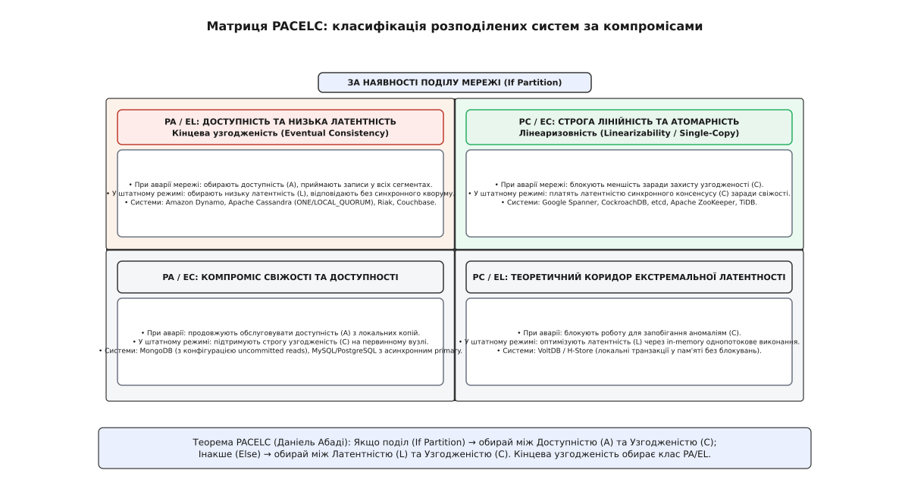
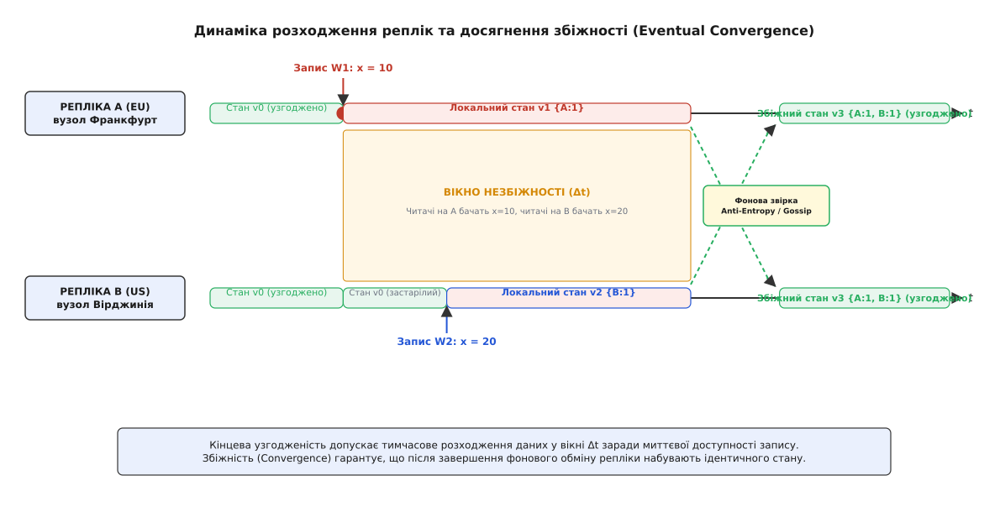
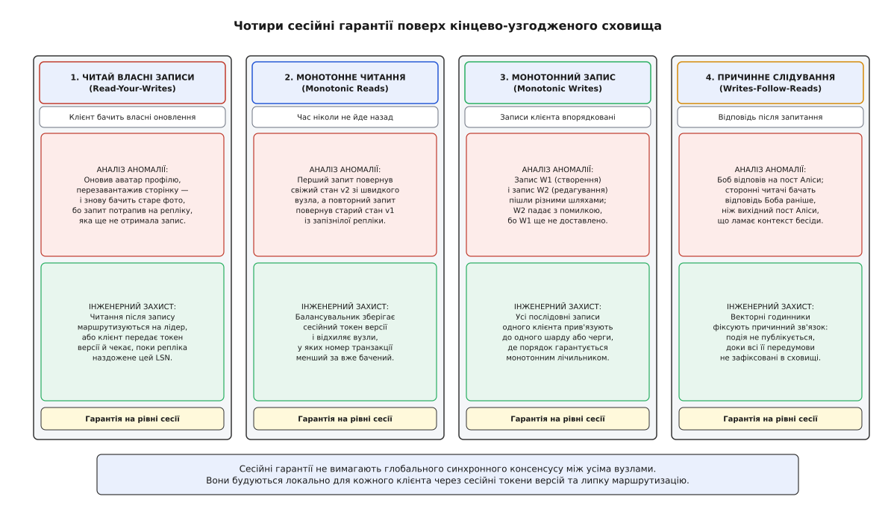

# Кінцева узгодженість на практиці

<preknowlist>
- [Лідер-фоловер / мультилідер / leaderless](topic:sf-distributed/replication-leader-follower) — типи топологій реплікації та шляхи поширення оновлень.
- [Реплікаційний лаг і сесійні гарантії](topic:sf-distributed/replication-lag) — природа затримки поширення даних і базові аномалії читання.
- [Мережевий поділ і теорема CAP](topic:sf-distributed/cap-theorem) — неминучий компроміс між доступністю та узгодженістю в ненадійних мережах.
- [Ідемпотентність](topic:sf-distributed/idempotency) — властивість повторних операцій не змінювати стан понад перший виклик.
- [Кворуми](topic:sf-distributed/quorum-and-leaderless) — математика перетину множин запису та читання W + R > N.
</preknowlist>

Під час розпродажу «Чорної п'ятниці» користувач додає в кошик останній екземпляр смартфона в регіоні Франкфурта (`eu-central-1`), успішно оплачує його і через три секунди відкриває мобільний застосунок у поїзді, підключаючись через точку доступу, маршрутизовану до дата-центра у Вірджинії (`us-east-1`).

Екран показує порожній кошик із пропозицією придбати той самий смартфон. Одночасно інший покупець у Нью-Йорку додає цей самий телефон у свій кошик і здійснює списання коштів. До вечора склад виявляє 412 випадків фізичного перепродажу (Overselling) товарів, яких немає на складі, а служба підтримки стикається з масовими чарджбеками та репутаційними втратами.

Причиною інциденту стала асинхронна реплікація зі сліпим перезаписом за фізичним часом (Last-Write-Wins), помножена на відсутність клієнтського відстеження причинності в міжрегіональному кластері.

Цей збій висвітлює фундаментальну проблему розподілених систем: як створити сховище, здатне приймати сотні тисяч записів на секунду з мікросекундною затримкою в різних куточках планети, не втрачаючи дані, не показуючи клієнтам «мандрівку в минуле» і гарантуючи, що стан усіх серверів детерміновано зійдеться до єдиної істини.

Детальний аналіз передумов відмови від класичного ACID та народження парадигми BASE описано в історичній довідці [BASE та історія появи кінцевої узгодженості в Amazon Dynamo](topic:hist-base-and-dynamo.md).

---

## 1. Ціна синхронних блокувань і матриця компромісів PACELC

Коли інженери вимагають абсолютної лінеаризовності (Linearizability) від глобально розподіленої бази даних, кожен запис змушений виконувати розподілений двофазний коміт (Two-Phase Commit, 2PC) або узгодження через консенсус Paxos/Raft крізь трансокеанські оптичні магістралі.

Світло у вакуумі рухається зі швидкістю приблизно `300 000` км/с, а в оптичному склі через показник заломлення кварцу `n ≈ 1.47` швидкість падає приблизно до `204 000` км/с. Відстань між Франкфуртом та Вірджинією кабелем становить близько 6 500 км, що дає теоретичний мінімум кругової затримки (Round-Trip Time, RTT) у 65–70 мс. Реальна затримка з урахуванням апаратних комутаторів, маршрутизаторів та оптичних підсилювачів сягає 85–100 мс.

Нижче наведено типові мінімальні затримки RTT між ключовими хмарними хабами:

```
┌──────────────────────────────────────┬───────────────────────┐
│ Регіональний маршрут                 │ Реальний RTT (мс)     │
├──────────────────────────────────────┼───────────────────────┤
│ Франкфурт (EU) ⟷ Вірджинія (US-East) │ 85 – 95 мс            │
│ Вірджинія (US-East) ⟷ Орегон (US-West)│ 65 – 75 мс            │
│ Франкфурт (EU) ⟷ Токіо (AP-East)     │ 210 – 230 мс          │
│ Вірджинія (US-East) ⟷ Сідней (AU)    │ 180 – 200 мс          │
└──────────────────────────────────────┴───────────────────────┘
```

Якщо транзакція вимагає трьох мережевих раундів блокувань (блокування ресурсу, підготовка коміту, фіксація), мінімальний час синхронного запису становить:

```
[Розрахунок затримки синхронного коміту 2PC між EU та US]
T_write = 3 · RTT_cross_region
        = 3 · 90 мс                                  [Мережеві раунди узгодження]
        = 270 мс                                     [Мінімальна затримка одного коміту]
```

При затримці 270 мс один потік бази даних здатний виконати не більше трьох-чотирьох транзакцій на секунду. Блокування рядків таблиці утримуються протягом усього цього часу, спричиняючи лавиноподібне зростання черг очікування та каскадну відмову пулу з'єднань клієнтських мікросервісів. Якщо ж міжрегіональний підводний кабель пошкоджено, синхронна система повністю зупиняє операції запису для збереження суворої узгодженості.

Щоб точно класифікувати цей фундаментальний компроміс, Деніел Абаді запропонував модель **PACELC**:

```
Якщо є Мережевий Поділ (Partition — P):
   Обираємо між Доступністю (Availability — A) та Узгодженістю (Consistency — C);
Інакше в Нормальному Режимі (Else — E):
   Обираємо між Затримкою (Latency — L) та Узгодженістю (Consistency — C).
```


*Класифікація розподілених баз даних у нормальному режимі (Else: Latency vs Consistency) та в умовах поділу (Partition: Availability vs Consistency)*

Кінцева узгодженість (Eventual Consistency) — це свідомий вибір класу **PA/EL**: система завжди приймає локальний запис із нульовим очікуванням віддалених реплік (`Latency → min`, `Availability → max`), гарантуючи високу швидкість обробки ціною тимчасової розбіжності даних.

---

## 2. Формальний контракт кінцевої узгодженості

Кінцева узгодженість — це не відсутність гарантій, а чіткий математичний контракт, що базується на двох фундаментальних властивостях:

```
1. Властивість живучості (Liveness / Eventual Delivery):
   Кожне оновлення, прийняте будь-яким працездатним вузлом, зрештою
   буде доставлене всім іншим працездатним реплікам кластера.
   Формально: ∀ u ∈ Updates, ∀ node ∈ Nodes : ∃ t < ∞ | u ∈ State(node, t).

2. Властивість безпеки (Safety / Eventual Convergence):
   Якщо надходження нових оновлень до об'єкта припиняється (стан спокою / quiescence),
   усі репліки через скінченний проміжок часу переходять у бінарно
   ідентичний стан:
   lim_{t → ∞} S_i(t) = S_j(t)  (∀ i, j ∈ Nodes).
```


*Часова шкала розбіжності реплік під час асинхронного запису та досягнення кінцевої збіжності через протоколи пліток і виправлення на читанні*

Інтервал часу між прийняттям запису на першому вузлі та досягненням ідентичного стану на всіх інших репліках називається **вікном невідповідності (Inconsistency Window / Divergence Window `Δt`)**.

Тривалість вікна розбіжності `Δt` не є константою і залежить від чотирьох інженерних факторів:
1. **Пропускна здатність міжсерверної мережі та jitter:** флуктуації затримок пакетів збільшують час доставки реплікаційного логу;
2. **Розмір черги реплікації (Replication Backlog):** при сплесках трафіку черга асинхронних завдань у пам'яті вузла розростається, відкладаючи відправку оновлень сусідам;
3. **Навантаження на CPU під час фонових процесів:** компакція LSM-дерев або збирання сміття JVM/Go тимчасово уповільнюють обробку вхідних повідомлень пліток;
4. **Конфігурація батчингу (Batching Window):** системи групують записи за 10–50 мс перед відправкою мережею для економії системних викликів.

Математичний апарат для точного розрахунку ймовірності читання застарілих даних усередині цього вікна наведено в роботі [Ймовірнісна оцінка застарілості (PBS) та математика збіжності](topic:math-probabilistic-staleness.md).

---

## 3. Чотири аномалії всередині вікна розбіжності

Коли користувач або мікросервіс виконує операції читання всередині вікна розбіжності `Δt`, виникають чотири типові поведінкові аномалії, які руйнують бізнес-інваріанти застосунку:

```
┌────────────────────────────────────────────────────────────────────────┐
│               Аномалії читання в слабких моделях                       │
├────────────────────────────────────────────────────────────────────────┤
│ 1. Втрата власного запису (Stale Read / Missing Own Writes):           │
│    Користувач оновлює статус профілю, оновлює сторінку й бачить        │
│    попереднє старе значення, оскільки запит потрапив на відсталу       │
│    репліку.                                                            │
│                                                                        │
│ 2. Подорож у минуле (Time-Travel / Non-monotonic Read):                │
│    Клієнт прочитав версію V2 з репліки A, а наступний запит пішов      │
│    на репліку B, яка ще перебуває на версії V1. Стан «відкотився».    │
│                                                                        │
│ 3. Порушення порядку причинності (Out-of-Order / Causal Inversion):     │
│    Користувач бачить відповідь на коментар раніше, ніж сам початковий │
│    коментар, оскільки повідомлення летіли різними маршрутами.          │
│                                                                        │
│ 4. Воскресіння видалених даних (Tombstone Resurrection):               │
│    Користувач видалив адресу доставки, але відсталий фоновий вузол     │
│    під час синхронізації перезаписав видалення старою копією.          │
└────────────────────────────────────────────────────────────────────────┘
```

Розглянемо механіку виникнення аномалії «Подорож у минуле» (Time-Travel Anomaly):

```
Клієнт                       Репліка R1                  Репліка R2 (Лаг = 500 мс)
  │                              │                               │
  ├─── 1. Запит GET /post/42 ───►│                               │
  │◄── 2. Відповідь {likes: 10} ─┤                               │
  │                              │                               │
  │  [Наступний клік користувача потрапляє через DNS на R2]      │
  │                              │                               │
  ├─── 3. Запит GET /post/42 ───────────────────────────────────►│
  │◄── 4. Відповідь {likes: 9} ──────────────────────────────────┤ [ВІДКАТ У ЧАСІ!]
```

Користувач сприймає таку поведінку як критичний програмний баг або втрату даних, хоча з точки зору репліки `R2` вона чесно повернула останній відомий їй локальний стан.

---

## 4. Топології реплікації: Кільце узгодженого хешування та списки уподобань

Щоб розподілити навантаження між сотнями серверів без центрального координатора, системи на базі архітектури Amazon Dynamo (DynamoDB, Cassandra, Riak) організовують вузли у **кільце узгодженого хешування (Consistent Hashing Ring)**:

```
                              [Вузол Node-1] (Токен 0)
                                    ▲
                                   ╱ ╲
                                  ╱   ╲
     [Вузол Node-4] (Токен 750) ◄      ► [Вузол Node-2] (Токен 250)
                                  ╲   ╱
                                   ╲ ╱
                                    ▼
                              [Вузол Node-3] (Токен 500)
```

### Принципи роботи топології:
1. **Простір токенів:** простір хеш-функції (наприклад, MD5 або Murmur3 від `0` до `2¹²⁸ - 1`) замикається в кільце. Кожен фізичний сервер відповідає за один або кілька діапазонів токенів;
2. **Віртуальні вузли (Vnodes):** замість одного діапазону фізичний сервер отримує 128 або 256 віртуальних позицій на кільці. Це забезпечує ідеально рівномірний розподіл навантаження та запобігає появі гарячих точок (Hotspots);
3. **Список уподобань (Preference List):** для кожного ключа обчислюється його хеш, і перші `N` унікальних фізичних вузлів за годинниковою стрілкою формують список реплікації для цього ключа. Координатор надсилає запис паралельно всім `N` вузлам списку уподобань.

---

## 5. Механізми досягнення збіжності (Convergence Engines)

Коли стан реплік розійшовся через незалежні локальні записи, система зобов'язана звести їх до спільного результату. Існує чотири фундаментальні стратегії збіжності:

### 1. Last-Write-Wins (LWW) за фізичним часом

Найпростіший підхід: кожен запис отримує таймстемп настінного годинника (Wall-clock Unix timestamp). При виявленні двох різних версій репліка обирає ту, у якої числове значення таймстемпу більше.

```
Вузол EU (NTP поспішає на +30 мс):
   Запис A відбувся о 12:00:00.010 -> Таймстемп: 12:00:00.040

Вузол US (NTP відстає на -20 мс):
   Запис B відбувся о 12:00:00.025 (РЕАЛЬНО ПІЗНІШЕ) -> Таймстемп: 12:00:00.005

Результат LWW: запис A перемагає запис B.
Справжній останній запис B БЕЗПОВОРОТНО ВТРАЧЕНО!
```

Правило LWW є детермінованим (усі вузли врешті-решт оберуть версію з більшим числом), але воно порушує причинність і тихо знищує бізнес-дані в умовах природного дрейфу апаратних таймерів.

### 2. Векторні годинники та причинні дерева версій

Векторні годинники не використовують ненадійний настінний час. Замість цього кожен вузол веде монотонний лічильник власних локальних подій.

```
Нехай годинник V = [v_EU, v_US, v_AP]

1. Початковий стан: V₀ = [0, 0, 0]
2. Запис на EU:      V₁ = [1, 0, 0]
3. Запис на EU:      V₂ = [2, 0, 0]
4. Паралельний запис на US: V₃ = [0, 1, 0]

Порівняння V₂ та V₃:
- V₂[EU] > V₃[EU]  (2 > 0)
- V₂[US] < V₃[US]  (0 < 1)
Висновок: V₂ ∥ V₃ (Конкурентні версії / Справжній конфлікт)
```

Система фіксує обидві паралельні гілки як множину двійників (Siblings) і передає їх клієнтському коду або викликає детермінований алгоритм злиття.

### 3. Безконфліктні типи даних (CRDTs) та теорема CALM

CRDT (Conflict-free Replicated Data Types) — це математичні структури, для яких операція злиття станів утворює напівґратку (Join-Semilattice):

```
1. Комутативність:   Merge(A, B) = Merge(B, A)
   [Порядок прибуття пакетів мережею не має значення]

2. Асоціативність:    Merge(Merge(A, B), C) = Merge(A, Merge(B, C))
   [Групування та каскадна реплікація не змінюють результат]

3. Ідемпотентність:   Merge(A, A) = A
   [Повторна доставка дублікатів пакетів повністю безпечна]
```

Теорема CALM (Consistency As Logical Monotonicity), доведена Джозефом Геллерштейном 2010 року, стверджує: **програма може бути реалізована з гарантованою збіжністю без будь-якої синхронізації та блокувань тоді й лише тоді, коли її логіка є монотонною** (додавання нових фактів ніколи не скасовує раніше виведених висновків).

Приклади монотонних структур:
- **PN-Counter:** пара монотонно зростаючих векторів `(P, N)`, значення `Val = ∑ P_i - ∑ N_i`;
- **OR-Set (Observed-Removed Set):** множина елементів з унікальними UUID додавання, що захищає від воскресіння видалених елементів;
- **LWW-Element-Set:** множина з мітками додавання та видалення за часом.

Розглянемо механіку розв'язання конфліктів у **OR-Set (Observed-Removed Set)**:

```
1. Вузол EU додає елемент:
   Add("item_1") -> елемент маркується тегом (item_1, uuid_A).
   Множина елементів: E = {(item_1, uuid_A)}, Надгробки: T = {}

2. Вузол US видаляє елемент "item_1":
   Вузол US бачив лише старий тег (item_1, uuid_old).
   Множина елементів: E = {}, Надгробки: T = {uuid_old}

3. Злиття станів:
   E_merged = E_EU ∪ E_US = {(item_1, uuid_A)}
   T_merged = T_EU ∪ T_US = {uuid_old}
   Видимий стан: E_merged \ T_merged = {(item_1, uuid_A)}
   [Свіже додавання автоматично перемагає старе видалення без блокувань!]
```

### 4. Протоколи пліток (Gossip Protocols): Scuttlebutt та виявлення відмов

Для поширення оновлень вузли використовують високоефективний протокол **Scuttlebutt** (розроблений Робом ван Ренессе):
- **Службові вектори версій:** кожен вузол періодично (наприклад, раз на секунду) транслює сусідам легковаговий масив `(NodeID, MaxVersion, Generation)`;
- **Generation Timestamp:** захищає від сміття після аварійного перезапуску вузла: новий час старту процесу інвалідує старі повідомлення;
- **Обмін лише дельтами:** отримувач порівнює максимальні відомі версії й запитує у відправника тільки ті мутації, яких йому бракує, мінімізуючи трафік.

Для визначення працездатності вузлів без хибних спрацьовувань застосовують детектор відмов Хаясібари (Φ-Accrual Failure Detector). Замість бінарного прапорця «живий/мертвий», детектор обчислює неперервне підозріле значення `Φ = -log10(P_later(t - t_last))`. Якщо `Φ > 8` (ймовірність запізнення серцебиття `< 10⁻⁸`), вузол позначається як тимчасово недоступний, і координатор активує механізм **Hinted Handoff**.

### 5. Натяки на запис (Hinted Handoff)

Коли цільова репліка не відповідає через короткочасний сплеск GC або розрив мережі, координатор запису зберігає локальний «натяк» (Hint) — серіалізовану мутацію із зазначенням цільового вузла.

```
Клієнт                  Координатор Node-A                 Цільова Node-B (ВІДПАЛА)
  │                              │                                    │
  ├── 1. Запис PUT key: "val" ──►│                                    │
  │                              ├── 2. Спроба відправити репліку ───X (Тайм-аут)
  │                              ├── 3. Збереження Hint на диску      │
  │◄─ 4. Відповідь 200 OK ───────┤                                    │
  │                              │                                    │
  │                              │ [Через 30 секунд Node-B оживає]    │
  │                              │                                    │
  │                              ├── 5. Доставка Hinted Handoff ─────►│
  │                              │◄── 6. Підтвердження застосування ──┤
```

Коли цільовий вузол повертається до життя, координатор вичитує накопичені натяки та застосовує їх, ліквідуючи розбіжність без необхідності повного сканування бази даних.

### 6. Анти-ентропія на базі дерев Меркла (Merkle Tree Anti-Entropy)

Фоновий процес реплікації порівнює хеш-дерева діапазонів ключів між вузлами:
1. Якщо кореневі хеші двох дерев збігаються, всі мільйони записів усередині діапазону гарантовано ідентичні — мережевий трафік дорівнює нулю.
2. Якщо корінь відрізняється, вузли спускаються на один рівень нижче, порівнюючи лівих і правих нащадків.
3. Процес рекурсивно звужує пошук до кількох конкретних ключів, що розійшлися, за логарифмічний час `O(d \log(K/d))`.

### 7. Реактивне лагодження на читанні (Read Repair)

Коли клієнт запитує дані з рівнем узгодженості `R > 1` (наприклад, `R = 2` або `R = QUORUM`), координатор опитує кілька реплік одночасно.

Для економії мережевого трафіку застосовують двоетапне опитування:
1. **Data Read:** координатор запитує повні дані лише від однієї репліки з найменшим мережевим пінгом;
2. **Digest Read:** від решти `R - 1` реплік запитується лише легковаговий криптографічний хеш або векторний годинник (Digest);
3. **Порівняння та зворотний запис:** якщо всі дайджести збіглися з хешем отриманих даних, відповідь негайно повертається клієнту. Якщо виявлено невідповідність, координатор вичитує повні дані з усіх відсталих реплік, формує зведену версію через правило злиття і відправляє оновлення відсталим вузлам (Write-back).

Практичну архітектуру та повний робочий код регістра з векторними годинниками реалізовано у проєкті [Проєктування збіжного розподіленого регістра з векторними годинниками](topic:proj-convergent-register.md).

---

## 6. Порівняльний аналіз провідних промислових баз даних

Різні NoSQL та NewSQL системи реалізують спектр кінцевої узгодженості під власні оптимізаційні цілі:

```
┌─────────────────┬──────────────────────┬────────────────────────┬─────────────────────────┐
│ Сховище         │ Модель узгодженості  │ Розв'язання конфліктів │ Механізми лагодження    │
├─────────────────┼──────────────────────┼────────────────────────┼─────────────────────────┤
│ Amazon DynamoDB │ Настроювана (Eventual│ LWW за фізичним часом  │ Асинхронний Replication │
│ Global Tables   │ або Strongly Cons.)  │ (Wall Clock Timestamp) │ Stream, фонова збіжність│
├─────────────────┼──────────────────────┼────────────────────────┼─────────────────────────┤
│ Apache          │ Настроювані кворуми  │ LWW за Cell Timestamp  │ Read Repair,            │
│ Cassandra       │ (ONE..LOCAL_QUORUM)  │ на рівні комірки       │ Nodetool Merkle Repair  │
├─────────────────┼──────────────────────┼────────────────────────┼─────────────────────────┤
│ Riak KV         │ Leaderless Causal    │ Векторні годинники     │ Active Anti-Entropy,    │
│                 │ (AP за CAP)          │ або Siblings на клієнті│ Read Repair             │
├─────────────────┼──────────────────────┼────────────────────────┼─────────────────────────┤
│ Apache CouchDB  │ Мультимайстер        │ Дерево ревізій (_rev)  │ Ручне або алгоритмічне  │
│                 │ (Offline-First)      │ зі збереженням гілок   │ злиття на клієнті       │
└─────────────────┴──────────────────────┴────────────────────────┴─────────────────────────┘
```

Розробник зобов'язаний розуміти ці внутрішні механізми: наприклад, у Cassandra правило LWW діє на рівні окремої комірки (Cell), що дозволяє паралельно оновлювати різні колонки одного рядка без конфліктів, але оновлення тієї самої колонки двома клієнтами призведе до тихого затирання запису клієнта з меншим таймстепом.

---

## 7. Серіалізація та оптимізація бінарного транспорту

При масштабуванні до сотень тисяч операцій на секунду накладні витрати на передачу векторних годинників та метаданих версій стають головним джерелом затримки.

У промислових системах застосовують три інженерні оптимізації транспортного рівня:
1. **Кодування змінної довжини (Varint / ZigZag Encoding):** монотонні лічильники версій та ідентифікатори вузлів кодуються за схемою LEB128 (Little-Endian Base 128), де малі числа (наприклад, версії від 1 до 127) займають рівно 1 байт замість 8 байтів `uint64`;
2. **Delta-компресія векторів:** при частих оновленнях вузол передає не повний вектор версій `[Node1: 100, Node2: 45, Node3: 12]`, а лише різницю з моменту останнього підтвердження `Δ = {Node1: +1}`;
3. **Бінарні формати без копіювання (Zero-Copy Serialization):** використання FlatBuffers або Cap'n Proto дозволяє обробляти вхідні мережеві пакети реплікації безпосередньо в буфері сокета без додаткової алокації об'єктів у кучі процесу;
4. **Контроль дедлайнів у gRPC потоках (gRPC Deadline Propagation):** кожен міжрегіональний запит реплікації несе заголовок граничного часу (Timeout Budget). Якщо пакет затримався на маршрутизаторі довше встановленого дедлайну, цільовий вузол миттєво відкидає його без виконання важких дискових операцій, запобігаючи накопиченню черг (Queue Build-up).

---

## 8. Проблема подвійного запису (Dual-Write Anti-Pattern) та патерн Outbox

У мікросервісній архітектурі часто виникає потреба зберегти стан у базі даних (наприклад, PostgreSQL) та одночасно оновити пошуковий індекс (Elasticsearch) або надіслати подію в чергу повідомлень (Kafka).

Наївна спроба виконати два послідовні виклики в коді бекенду є класичним антипатерном подвійного запису (Dual-Write Anti-Pattern):

```
// НЕБЕЗПЕЧНИЙ АНТИПАТЕРН:
void update_user_profile(User user) {
    db.save(user);                 // 1. Успішно зафіксовано в Postgres
    elastic.index(user);           // 2. Збій мережі / HTTP 500! Стан розійшовся назавжди!
    kafka.publish("user_updated"); // 3. Не виконано!
}
```

Якщо на кроці 2 трапляється збій мережі, перезапуск процесу або тайм-аут, база даних Postgres містить новий стан, а Elasticsearch — старий. Стан системи безповоротно десинхронізовано.

### Інженерне вирішення: Transactional Outbox + Log-based CDC

Для відновлення надійної кінцевої узгодженості між гетерогенними сховищами використовують патерн **Transactional Outbox**:

```
Клієнтський запит
      │
      ▼
┌────────────────────────────────────────────────────────┐
│  Єдина локальна ACID-транзакція в PostgreSQL:          │
│  1. INSERT INTO users VALUES ('Alice', 'VIP');         │
│  2. INSERT INTO outbox_events VALUES (uuid, 'UserUpd');│
└──────────────────────────┬─────────────────────────────┘
                           │ Зафіксовано у WAL на диску
                           ▼
┌────────────────────────────────────────────────────────┐
│  Debezium (Log-Based Change Data Capture):             │
│  Асинхронно вичитує логи WAL PostgreSQL                │
└──────────────────────────┬─────────────────────────────┘
                           │ Гарантія At-Least-Once
                           ▼
┌────────────────────────────────────────────────────────┐
│  Apache Kafka Event Stream                             │
└──────────────────┬──────────────────┬──────────────────┘
                   │                  │
                   ▼                  ▼
          ┌─────────────────┐┌─────────────────┐
          │  Elasticsearch  ││  Redis Cache    │ (Ідемпотентні споживачі
          │  Search Index   ││  Profile Cache  │  наздоганяють стан)
          └─────────────────┘└─────────────────┘
```

Завдяки цьому патерну бізнес-операція фіксується атомарно в єдиній локальній БД, а всі зовнішні кеші, пошукові індекси та аналітичні сховища гарантовано наздоганяють актуальний стан через асинхронний стрим подій.

---

## 9. Сесійні гарантії: повернення порядку для клієнта

Щоб кінцевий користувач не стикався з аномаліями відставання реплік, поверх кінцево-узгодженого кластера розгортають шар **сесійних гарантій (Session Guarantees)**.

Вперше формалізовані Дугласом Террі у системі Bayou (1995), ці чотири гарантії захищають логіку конкретного клієнта без блокування всієї бази даних:


*Чотири фундаментальні сесійні гарантії: механіка виникнення аномалій на відсталих репліках та їхнє усунення за допомогою клієнтських токенів*

### 1. Читай власні записи (Read-Your-Writes)

**Інваріант:** якщо клієнт виконав оновлення `W`, то будь-яке наступне читання цим самим клієнтом гарантовано поверне результат `W` або ще новіший стан.

```
Реалізація на практиці:
1. При записі координатор повертає клієнту токен LSN/версії (наприклад, LSN = 1042).
2. Клієнт зберігає токен у пам'яті сесії або HTTP-куках.
3. При наступному читанні клієнт передає заголовок X-Session-Min-LSN: 1042.
4. Балансувальник направляє запит на репліку, де LSN_local ≥ 1042, або репліка
   призупиняє відповідь на кілька мілісекунд, чекаючи застосування логу.
```

### 2. Монотонне читання (Monotonic Reads)

**Інваріант:** якщо клієнт побачив стан об'єкта версії `V_k`, він ніколи в майбутньому не побачить стан версії `V_m`, де `m < k` (захист від стрибків у минуле).

```
Реалізація на практиці:
Клієнтський SDK відстежує максимальний векторний годинник або таймстемп
усіх отриманих відповідей. Якщо репліка повертає старіший стан, SDK
автоматично відхиляє відповідь і повторює запит до іншого вузла.
```

### 3. Монотонний запис (Monotonic Writes)

**Інваріант:** операція запису `W_2` від певного клієнта фіксується всіма репліками лише після того, як успішно зафіксовано попередній запис `W_1` цього самого клієнта.

```
Реалізація на практиці:
Маршрутизація записів одного клієнта через єдиний вузол-координатор
(Sticky Routing за user_id) або маркування записів монотонними порядковими
номерами сесії SeqNo, що застосовуються строго по порядку.
```

### 4. Запис слідує за читанням (Writes-Follow-Reads / Causal Writes)

**Інваріант:** якщо клієнт прочитав версію `V_1` і на її основі сформував новий запис `W_2`, то на всіх вузлах оновлення `W_2` буде застосовано строго після `V_1`.

```
Реалізація на практиці:
Запис супроводжується списком причинних залежностей (Dependencies List).
Репліка не має права застосувати W_2, доки у її локальному стані
не з'явиться транзакція V_1.
```

---

## 10. Програмна реалізація клієнтського сесійного шару

Нижче наведено практичний зразок проміжного клієнтського шару (Session Middleware), що перехоплює HTTP/gRPC запити та автоматично реалізує гарантію **Read-Your-Writes** через передачу монотонних токенів версій:

:::tabs
```cpp
#include <iostream>
#include <string>
#include <string_view>
#include <unordered_map>
#include <memory>
#include <optional>
#include <chrono>
#include <thread>
#include <atomic>
#include <vector>

// Структура репліки бази даних
class DatabaseReplica {
private:
    std::string name_;
    std::unordered_map<std::string, std::pair<std::string, uint64_t>> storage_;
    std::atomic<uint64_t> current_lsn_{0};

public:
    explicit DatabaseReplica(std::string name) : name_(std::move(name)) {}

    const std::string& name() const { return name_; }
    uint64_t current_lsn() const { return current_lsn_.load(); }

    void apply_write(const std::string& key, const std::string& val, uint64_t lsn) {
        storage_[key] = {val, lsn};
        current_lsn_.store(lsn);
    }

    std::optional<std::string> read(const std::string& key, uint64_t min_lsn) const {
        // Якщо репліка відстає від вимог клієнта — читання відхиляється
        if (current_lsn_.load() < min_lsn) {
            return std::nullopt;
        }
        auto it = storage_.find(key);
        if (it != storage_.end()) {
            return it->second.first;
        }
        return std::nullopt;
    }
};

// Сесійний проксі-клієнт
class SessionConsistentClient {
private:
    std::vector<std::shared_ptr<DatabaseReplica>> replicas_;
    std::atomic<uint64_t>& global_lsn_gen_;
    uint64_t session_lsn_{0}; // Локальний токен причинності клієнта

public:
    SessionConsistentClient(std::vector<std::shared_ptr<DatabaseReplica>> replicas,
                            std::atomic<uint64_t>& lsn_gen)
        : replicas_(std::move(replicas)), global_lsn_gen_(lsn_gen) {}

    // Виконання запису: оновлюємо первинну репліку та фіксуємо LSN у сесії
    void write(const std::string& key, const std::string& val) {
        uint64_t new_lsn = ++global_lsn_gen_;
        // Пишемо на перший доступний вузол (імітація лідера)
        replicas_[0]->apply_write(key, val, new_lsn);
        session_lsn_ = new_lsn;
        std::cout << "[Client Write] Успішно записано '" << key << " = " << val
                  << "'. Сесійний токен LSN оновлено до " << session_lsn_ << "\n";
    }

    // Виконання читання: гарантуємо, що прочитаний вузол не старіший за session_lsn_
    std::string read(const std::string& key) {
        for (const auto& replica : replicas_) {
            auto res = replica->read(key, session_lsn_);
            if (res.has_value()) {
                std::cout << "[Client Read] Прочитано з " << replica->name()
                          << " (LSN " << replica->current_lsn() << "): " << *res << "\n";
                return *res;
            } else {
                std::cout << "[Client Read Bypass] Репліка " << replica->name()
                          << " відстає (LSN " << replica->current_lsn()
                          << " < " << session_lsn_ << "). Пропускаємо...\n";
            }
        }
        throw std::runtime_error("Усі доступні репліки відстають від сесії клієнта!");
    }
};

int main() {
    std::atomic<uint64_t> lsn_generator{0};

    auto primary = std::make_shared<DatabaseReplica>("Primary-EU");
    auto replica_fast = std::make_shared<DatabaseReplica>("Replica-Fast");
    auto replica_lagging = std::make_shared<DatabaseReplica>("Replica-Lagging");

    SessionConsistentClient client({primary, replica_fast, replica_lagging}, lsn_generator);

    std::cout << "=== 1. Клієнт виконує оновлення даних ===\n";
    client.write("user:101:status", "VIP-Tier");

    std::cout << "\n=== 2. Асинхронна реплікація з лагом ===\n";
    // Replica-Fast наздогнала Primary
    replica_fast->apply_write("user:101:status", "VIP-Tier", 1);
    // Replica-Lagging залишилася на LSN = 0

    std::cout << "\n=== 3. Клієнт читає свій запис із кластера ===\n";
    std::string value = client.read("user:101:status");
    std::cout << "Підсумковий прочитаний результат: " << value << "\n";

    return 0;
}
```
```go
package main

import (
	"errors"
	"fmt"
	"sync"
	"sync/atomic"
)

// DatabaseReplica представляє вузол бази даних
type DatabaseReplica struct {
	name       string
	mu         sync.RWMutex
	storage    map[string]string
	currentLSN uint64
}

func NewDatabaseReplica(name string) *DatabaseReplica {
	return &DatabaseReplica{
		name:    name,
		storage: make(map[string]string),
	}
}

func (r *DatabaseReplica) ApplyWrite(key, val string, lsn uint64) {
	r.mu.Lock()
	defer r.mu.Unlock()
	r.storage[key] = val
	atomic.StoreUint64(&r.currentLSN, lsn)
}

func (r *DatabaseReplica) Read(key string, minLSN uint64) (string, error) {
	r.mu.RLock()
	defer r.mu.RUnlock()

	cur := atomic.LoadUint64(&r.currentLSN)
	if cur < minLSN {
		return "", fmt.Errorf("replica %s lagging: current LSN %d < required %d", r.name, cur, minLSN)
	}

	val, exists := r.storage[key]
	if !exists {
		return "", errors.New("key not found")
	}
	return val, nil
}

// SessionConsistentClient забезпечує Read-Your-Writes
type SessionConsistentClient struct {
	replicas   []*DatabaseReplica
	globalLSN  *uint64
	sessionLSN uint64
}

func NewSessionClient(replicas []*DatabaseReplica, globalLSN *uint64) *SessionConsistentClient {
	return &SessionConsistentClient{
		replicas:  replicas,
		globalLSN: globalLSN,
	}
}

func (c *SessionConsistentClient) Write(key, val string) {
	newLSN := atomic.AddUint64(c.globalLSN, 1)
	c.replicas[0].ApplyWrite(key, val, newLSN)
	c.sessionLSN = newLSN
	fmt.Printf("[Client Write] Записано '%s = %s'. Сесійний LSN: %d\n", key, val, c.sessionLSN)
}

func (c *SessionConsistentClient) Read(key string) (string, error) {
	for _, replica := range c.replicas {
		val, err := replica.Read(key, c.sessionLSN)
		if err == nil {
			fmt.Printf("[Client Read] Успішно прочитано з %s (LSN %d): %s\n", replica.name, replica.currentLSN, val)
			return val, nil
		}
		fmt.Printf("[Client Read Bypass] %s відстає. Пропускаємо...\n", replica.name)
	}
	return "", errors.New("all replicas lagging")
}

func main() {
	var globalLSN uint64

	primary := NewDatabaseReplica("Primary-EU")
	replicaFast := NewDatabaseReplica("Replica-Fast")
	replicaLagging := NewDatabaseReplica("Replica-Lagging")

	client := NewSessionClient([]*DatabaseReplica{primary, replicaFast, replicaLagging}, &globalLSN)

	fmt.Println("=== 1. Клієнт виконує оновлення даних ===")
	client.Write("user:101:status", "VIP-Tier")

	fmt.Println("\n=== 2. Асинхронна реплікація з лагом ===")
	replicaFast.ApplyWrite("user:101:status", "VIP-Tier", 1)
	// replicaLagging залишається на LSN = 0

	fmt.Println("\n=== 3. Клієнт читає свій запис із кластера ===")
	val, _ := client.Read("user:101:status")
	fmt.Printf("Підсумковий прочитаний результат: %s\n", val)
}
```
:::

---

## 11. Мобільний клієнт: синхронізація в режимі Offline-First

У мобільних та десктопних застосунках користувач регулярно втрачає доступ до мережі. Парадигма **Offline-First** перетворює сам клієнтський пристрій на повноправний вузол розподіленого сховища.

### Архітектура локального реконсилятора:
1. **Локальна база даних (Embedded SQLite / RxDB):** усі операції читання та запису виконуються миттєво до локального сховища смартфона;
2. **Черга мутацій (Pending Mutations Queue):** кожна локальна зміна записується в незмінний лог мутацій із клієнтським часовим маркером та унікальним UUID;
3. **Реконсиляція при підключенні (3-Way Merge Engine):** при появі зв'язку SDK відправляє чергу мутацій на бекенд. Бекенд виконує злиття через напівґратку CRDT і повертає дельту змін, що відбулися на інших пристроях;
4. **Експоненційне відкладення з джитером (Exponential Backoff with Full Jitter):** щоб запобігти шторму запитів (Thundering Herd), коли літак приземлився і сотні пристроїв одночасно намагаються синхронізуватися, повторні спроби відправляються з випадковою затримкою `t_retry = random(0, min(T_max, T_base · 2^attempt))`.

---

## 12. Патерн CQRS та оптимістичні оновлення інтерфейсу

Кінцева узгодженість є природним фундаментом для патерну **CQRS (Command Query Responsibility Segregation)**:

```
                  ┌─────────────────────────────────────────────────┐
                  │                Клієнтський UI                   │
                  └────────┬───────────────────────────────▲────────┘
             1. Command    │                               │  5. Query
             (POST /order) │                               │  (GET /views)
                           ▼                               │
                  ┌─────────────────┐             ┌─────────────────┐
                  │  Command Side   │             │   Query Side    │
                  │  (Postgres/WAL) │             │ (Elastic/Redis) │
                  └────────┬────────┘             └────────▲────────┘
                           │ 2. Append Event               │
                           ▼                               │ 4. Update
                  ┌─────────────────┐                      │    Projection
                  │  Event Stream   │ ─────────────────────┘
                  │  (Kafka Queue)  │ 3. Async Broadcast
                  └─────────────────┘
```

### Оптимістичний інтерфейс (Optimistic UI Updates):
Коли користувач ставить лайк або залишає коментар:
1. Застосунок негайно змінює лічильник лайків на екрані (`Likes = Likes + 1`) та анімує кнопку;
2. Паралельно у фоновому потоці надсилається асинхронна команда `POST /like`;
3. Якщо через 5 секунд сервер повертає помилку або тайм-аут, інтерфейс плавно відкочує стан назад і показує делікатне спливаюче сповіщення.

У 99.9% випадків оновлення завершується успішно, а користувач отримує відчуття миттєвої реакції системи з нульовою затримкою.

---

## 13. Моніторинг та спостережуваність: SLI/SLA реплікації

Для надійного контролю кінцевої узгодженості в інженерній практиці розгортають трирівневу систему моніторингу:

```
┌──────────────────────────────────────┬──────────────────────────────────────────┐
│ Метрика (SLI)                        │ Цільовий поріг (SLA) та інженерна дія    │
├──────────────────────────────────────┼──────────────────────────────────────────┤
│ 1. replication_lag_seconds_p99       │ < 1.0 с (Warning при > 2с, Alert при > 5с│
│    Час відставання репліки від лідера│ Маршрутизатор знімає читання з репліки)  │
├──────────────────────────────────────┼──────────────────────────────────────────┤
│ 2. merkle_tree_diff_keys_total       │ < 100 ключів на добу                    │
│    Кількість розбіжностей у фоні     │ Різке зростання вказує на silent drops   │
├──────────────────────────────────────┼──────────────────────────────────────────┤
│ 3. read_repair_invocations_rate      │ < 0.1% від загального QPS читання        │
│    Частота спрацьовування Read-Repair│ Сплеск свідчить про системне відставання │
└──────────────────────────────────────┴──────────────────────────────────────────┘
```

Для вимірювання реплікаційного лагу в реальному часі використовують спеціалізовані сервіси-канарейки (Canary Probes), які щосекунди записують поточний мікросекундний таймстемп у виділений службовий рядок `__system_heartbeat` та вимірюють затримку його появи на кожній регіональній репліці.

---

## 14. Промислові крайові випадки та шаблони стійкості

Експлуатація глобально розподілених сховищ вимагає врахування чотирьох критичних граничних ситуацій:

### 1. Тривалий поділ мережі та злиття після відновлення (Long Partition Split-Brain)

Якщо дата-центри в Європі та США були ізольовані протягом трьох годин, обидва сегменти накопичили мільйони локальних мутацій.

- **Ризик:** при раптовому відновленні каналу зв'язку лавиноподібний обмін деревами Меркла та повідомленнями пліток може повністю забити міжрегіональну мережу та перевантажити диск (IOPS Throttling).
- **Шаблон захисту:** обмеження швидкості реплікації (Rate-Limited Anti-Entropy Bandwidth), пріоритезація гарячих ключів та поступова фонова реконсиляція порціями (Chunked Stream Sync).

### 2. Запобігання воскресінню видалених записів (Tombstone GC Grace Horizon)

При видаленні об'єкта записується спеціальний маркер — «надгробок» (Tombstone). Якщо видалити сам надгробок занадто рано, будь-яка відстала репліка, що повернеться в кластер, відправить старий стан і «воскресить» видалений запис.

- **Правило конфігурації:** параметр `gc_grace_seconds` (за замовчуванням 10 днів у Apache Cassandra) зобов'язаний перевищувати максимальний допустимий інтервал відновлення вузла після аварії.

### 3. Шторми виправлень на читанні (Read-Repair Throttling)

Якщо гарячий ключ зазнає 50 000 читань/с під час короткочасного відставання однієї репліки, кожен запит ініціює фоновий запис виправлення на відсталий вузол.

- **Шаблон захисту:** ймовірнісне лагодження (Probabilistic Read-Repair, наприклад, лише 0.5% запитів ініціюють запис) або згортання дублікатів через патерн Singleflight у проксі.

### 4. Робота з відсутністю зв'язку на клієнті (Offline-First Sync)

Мобільні пристрої регулярно втрачають зв'язок на години або дні.
- **Шаблон захисту:** клієнтський застосунок використовує локальну вбудовану базу даних (SQLite з підтримкою CRDT або RxDB), накопичує зміни в локальній черзі та виконує бідирекційне злиття через напівґратку при появі Wi-Fi з'єднання.

---

## 15. Патерни компенсації в бізнес-логіці: Саги та резервування

Як поєднати мікросекундну швидкість кінцевої узгодженості з вимогами бізнесу щодо запобігання фізичному перепродажу товарів?

Для цього застосовують два архітектурні шаблони:

### 1. Попереднє партиціювання та резервування слотів (Inventory Sharding & Slot Allocation)

Замість єдиного глобального лічильника залишку товару `Stock = 100`, склад заздалегідь розбивається між регіонами:

```
┌────────────────────────────────────────────────────────┐
│               Розподілений склад товару                │
├────────────────────────────────────────────────────────┤
│ Регіон EU: 50 одиниць (Локальний суворий лічильник)    │
│ Регіон US: 30 одиниць (Локальний суворий лічильник)    │
│ Регіон AP: 20 одиниць (Локальний суворий лічильник)    │
└────────────────────────────────────────────────────────┘
```

Кожен регіон списує залишки локально з миттєвою швидкістю. Якщо в регіоні EU залишок падає до 5 одиниць, фоновий процес асинхронно запитує передачу квоти з регіону AP. Перепродаж фізично неможливий, а латентність покупця залишається мінімальною.

### 2. Розподілена Сага з компенсацією (Orchestrated Saga Pattern)

Якщо операція вимагає узгодження кількох сервісів (Оплата → Склад → Доставка):

```
1. Сервіс замовлень створює замовлення у статусі PENDING.
2. Сервіс оплати списує кошти.
3. Сервіс складу виявляє нестачу товару та публікує подію STOCK_FAILED.
4. Оркестратор Саги ініціює компенсаційну дію:
   - Сервіс оплати повертає кошти покупцю (Refund);
   - Користувачу надсилається сповіщення про вибачення та промокод на знижку.
```

Бізнес приймає ймовірність відмови на рівні 0.01% заради можливості обробляти 99.99% замовлень із надшвидким відгуком.

---

## 16. Симуляційне тестування та перевірка інваріантів (Deterministic Simulation)

Щоб довести математичну коректність кінцево-узгодженої системи під час комбінованих аварій (одночасне падіння каналів зв'язку, рестарт лідерів, корупція дисків), сучасні інженерні команди використовують детерміністичне симуляційне тестування (методологія FoundationDB та Jepsen).

Основні принципи симуляційного тестування:
1. **Віртуалізація часу та планувальника:** усе асинхронне виконання потоків та мережевих таймерів переноситься на єдиний псевдовипадковий генератор (Single-threaded Event Loop з фіксованим Seed);
2. **Ін'єкція збоїв (Chaos Orchestration):** симулятор переставляє місцями мережеві пакети, вводить довільні затримки від 1 мс до 10 хвилин, симулює розділення кластера на три ізольовані групи;
3. **Верифікація інваріантів (Invariant Invariants Verification):** у кожній точці віртуального часу перевіряється, що жоден клієнт не прочитав стан із порушенням причинності (Causal Consistency Check) та що після припинення хаосу стан усіх реплік стає бінарно еквівалентним.

---

## 17. Архітектурне дерево рішень

Кінцева узгодженість не є універсальним інструментом для всіх задач. Вибір між моделями узгодженості визначається природою бізнес-домену:

```
                                Чи вимагає бізнес-домен
                             абсолютної фінансової точності
                             та нульового ризику перепродажу?
                                        │
                       ┌────────────────┴────────────────┐
                      ТАК                               НІ
                       │                                 │
                       ▼                                 ▼
           Чи можлива компенсація             Чи важлива мікросекундна
          постфактум (Saga / Резерви)?       затримка та глобальна доступність?
             ┌─────────┴─────────┐                     ┌─────────┴─────────┐
            ТАК                 НІ                    ТАК                 НІ
             │                   │                     │                   │
             ▼                   ▼                     ▼                   ▼
     Кінцева узгодженість  Строгий консенсус   Кінцева узгодженість  Лідер-фоловер
     із Сагою / CRDT       (Raft, Spanner)     (Dynamo, Cassandra)   з читанням із лідера
```

### Коли кінцева узгодженість — ідеальний вибір:
1. **Соціальні графіки, стрічки новин, коментарі, реакції:** якщо новий коментар з'явиться у підписника через 500 мс, це не завдає жодної бізнес-шкоди.
2. **Аналітика, метрики, логи, IoT-телеметрія:** затримка окремого повідомлення про температуру сенсора або завантаження CPU не спотворює загальну аналітичну картину.
3. **Кошики покупців (Shopping Carts):** доступність кошика важливіша за миттєву синхронізацію: покупець повинен мати змогу додати товар за будь-яких мережевих збоїв.
4. **Спільне редагування документів (Google Docs, Figma):** правки користувачів детерміновано зливаються за допомогою CRDT без блокувань інтерфейсу.

### Коли кінцева узгодженість катастрофічна:
1. **Головна бухгалтерська книга банку (General Ledger):** від'ємний баланс або подвійне списання порушують вимоги регуляторів.
2. **Аутентифікація, блокування доступу, відкликання токенів:** якщо скомпрометований акаунт заблоковано, заборона повинна негайно набути чинності на всіх серверах світу.
3. **Бронювання місць на авіарейси чи в театр:** два пасажири на одному кріслі `14B` ведуть до скандалу та судових позовів.

---

## 18. Сучасні гібридні архітектури у промисловості

Сучасні високонавантажені платформи уникають крайнощів. Промисловий стандарт полягає у **шаруватому розділенні моделей узгодженості (Multi-Tier Consistency)**:

```
┌────────────────────────────────────────────────────────────────────────┐
│                        Шарувата Архітектура                            │
├────────────────────────────────────────────────────────────────────────┤
│ 1. Шар суворого консенсусу (Strong / Raft Core):                       │
│    Вузька група сервісів (Auth, Billing, Inventory Core).              │
│    Використовує Multi-Raft або CockroachDB/Spanner.                    │
│    Гарантує нульовий ризик подвійних витрат ціною латентності 30-50 мс.│
├────────────────────────────────────────────────────────────────────────┤
│ 2. Шар сесійної узгодженості (Session-Consistent Middleware):          │
│    Клієнтський API-шлюз передає LSN-токени крізь HTTP-заголовки.       │
│    Користувач завжди бачить власні дії без блокування інших.           │
├────────────────────────────────────────────────────────────────────────┤
│ 3. Шар кінцевої узгодженості (Eventual / AP Tier):                     │
│    Каталог товарів, відгуки, рекомендації, кеш сесій, телеметрія.     │
│    Cassandra, DynamoDB, Redis Cluster з асинхронною міжрегіональною    │
│    реплікацією. Нульова затримка, 100% доступність при розриві океану. │
└────────────────────────────────────────────────────────────────────────┘
```

Такий гібридний дизайн дозволяє створювати системи, що витримують пікові навантаження в мільйони запитів на секунду, зберігаючи бездоганну цілісність критичних операцій та забезпечуючи максимальну швидкість взаємодії для користувачів по всьому світу.

При цьому взаємодія між суворим ядром та кінцево-узгодженим рівнем захищається механізмами зворотного тиску (Backpressure Control) та автоматичними вимикачами (Circuit Breakers): якщо черга асинхронної реплікації переповнюється, шлюз плавно деградує некритичні функції замість відмови всього сервісу.
