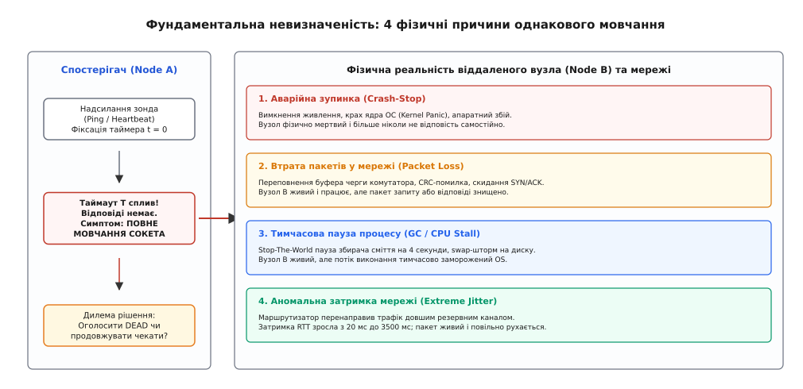
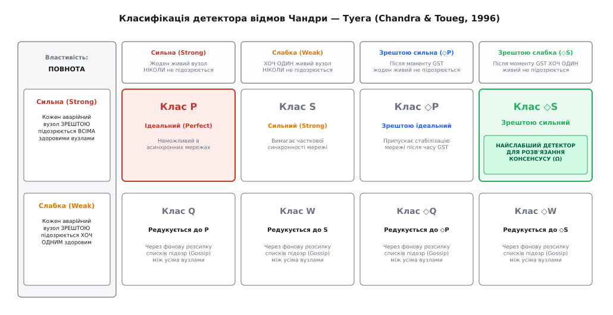
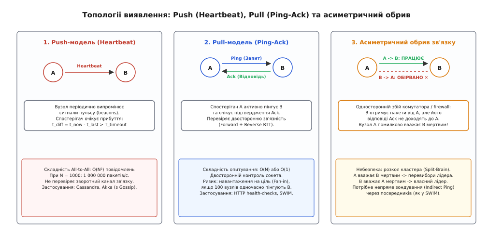
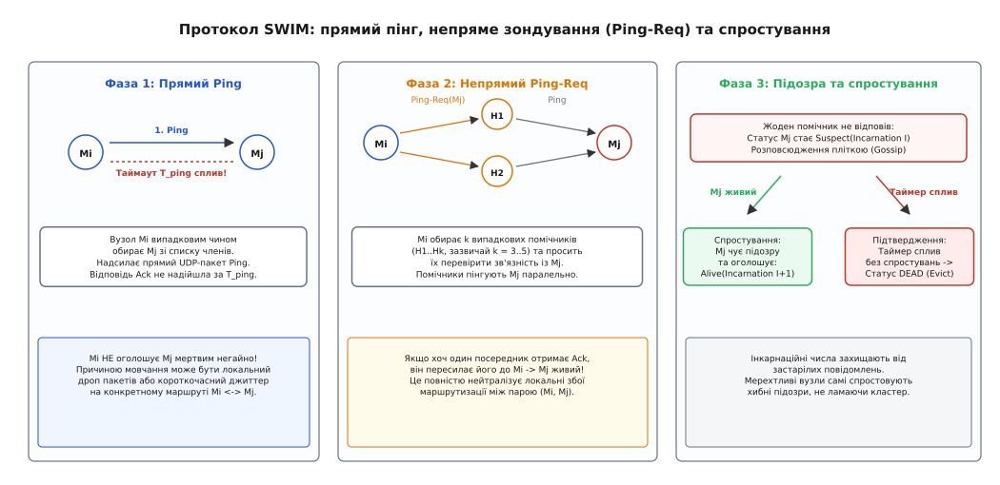

# Виявлення відмов: чому мертвий вузол не відрізнити від повільного

<preknowlist>
- [Омани розподілених обчислень](topic:sf-distributed/distributed-fallacies) — мережа ненадійна, пакети губляться, а час передачі постійно коливається.
- [Таймаути й дедлайни](topic:sf-distributed/timeouts-deadlines) — обмеження часу очікування та наслідки статичних часових рамок.
- [Розщеплення мозку](topic:sf-distributed/split-brain) — стан кластера, коли кілька вузлів одночасно вважають себе лідерами.
- [Фенсинг-токени](topic:sf-distributed/fencing-tokens) — генераційні мітки для захисту спільних ресурсів від ізольованих вузлів-зомбі.
- [Задача консенсусу](topic:sf-distributed/consensus-problem) — досягнення узгодженості між вузлами в умовах можливих аварій.
- [Gossip-протоколи](topic:sf-distributed/gossip-protocols) — фоновий епідемічний обмін станом і сигналами пульсу між вузлами.
- [Детектор відмов Phi Accrual](topic:sf-distributed/phi-accrual-failure-detector) — ймовірнісна шкала оцінки доступності на основі дисперсії затримок.
</preknowlist>

О 04:17 за всесвітнім координованим часом (UTC) розподілений кластер зберігання даних зі 120 серверів, розміщених у трьох зонах доступності хмарного провайдера, зазнає раптового нічного сплеску транзакційного навантаження одночасно з плановим створенням моментальних знімків (snapshots). Мережеві комутатори стійок входять у режим буферизації пакетів (англ. *bufferbloat*), а вузол-координатор `storage-042` потрапляє у блокуючу паузу збирача сміття (англ. *Stop-The-World Garbage Collection*) тривалістю 3.6 секунди.

Сервер `storage-042` абсолютно справний: його процесор, оперативна пам'ять і дискові масиви перебувають у робочому стані. Проте впродовж 3.6 секунди потік виконання заблокований віртуальною машиною, і жоден вхідний мережевий запит не обробляється. Сусідні вузли налаштовані на класичний бінарний детектор із жорстким таймаутом у 2.0 секунди: якщо контрольне повідомлення не надійшло за дві секунди, віддалений сервер автоматично позначається мертвим. Рівно на другій секунді мовчання кластер визнає `storage-042` аварійно зупиненим.

Наслідки цього хибного вердикту виявляються руйнівними: клієнтські координатори перенаправляють потоки запитів на інші репліки, запускаються вибори нового координатора шарду, а сусідні вузли починають локально накопичувати мільйони відкладених записів (*Hinted Handoff*). Коли через 1.6 секунди сервер `storage-042` повертається до життя після завершення паузи GC, він вважає себе легітимним координатором і продовжує застосовувати затримані транзакції. Виникає конфлікт паралельних записів, розкол кластера (*split-brain*) і перевантаження черг вцілілих серверів.

Цей інцидент оголює головну проблему розподілених обчислень: у ненадійних асинхронних мережах саме лише мовчання мережевого сокета не несе інформації про справжню причину відсутності відповіді.

## Фізика асинхронних мереж: чому точне виявлення неможливе

Усі реальні комп'ютерні мережі — від локальної шини Ethernet у дата-центрі до глобального інтернету — є асинхронними розподіленими системами. Асинхронна модель характеризується трьома фундаментальними властивостями:
1. **Відсутність єдиного фізичного годинника:** кожен вузол має власний кварцовий генератор, який неминуче зазнає температурного та апаратного дрейфу.
2. **Відсутність верхньої межі часу передачі повідомлень (`Δ`):** пакет може подолати мережу за 500 мікросекунд, а може затриматися в чергах проміжних маршрутизаторів на 10 секунд або загубитися взагалі.
3. **Відсутність верхньої межі швидкості обчислень:** процес може виконувати мільярд інструкцій на секунду, а може бути раптово призупинений ядром операційної системи, гіпервізором або збирачем сміття на непередбачуваний інтервал часу.

Коли вузол-спостерігач `Node A` надсилає контрольний запит до вузла `Node B` і фіксує локальний таймер `t = 0`, після спливання інтервалу `t = T` спостерігач бачить лише один симптом: відсутність вхідних байтів у буфері сокета.


*Чотири фундаментально різні фізичні стани віддаленого вузла та мережевого середовища, які призводять до ідентичного спостереження — відсутності відповіді до спливання локального таймауту T.*

Ця тиша може бути наслідком чотирьох принципово різних фізичних подій:
1. **Фізична аварійна зупинка (Crash-Stop):** знеструмлення материнської плати, крах ядра ОС (*Kernel Panic*), апаратний збій контролера пам'яті. Вузол `Node B` дійсно припинив існування.
2. **Втрата пакета в дорозі (Packet Loss):** переповнення буфера черги комутатора (*tail drop*), помилка контрольної суми CRC, скидання пакета міжмережевим екраном. Сервер `Node B` працює на повну потужність, але повідомлення знищено фізичним середовищем.
3. **Тимчасова пауза процесу (Execution Stall):** блокуюча пауза збирача сміття JVM/Go, активний свопінг пам'яті на диск при браку RAM (*swap storm*), витіснення віртуальної машини гіпервізором при перевищенні квоти CPU. Сервер `Node B` живий, але його потік виконання тимчасово заморожений.
4. **Екстремальний джиттер мережі (Bufferbloat):** через динамічну перемаршрутизацію або сплеск трафіку пакет затримався в черзі комутатора на `3.5` секунди замість типових `20` мілісекунд. Пакет живий і повільно рухається кабелем.

Для вузла `Node A` всі чотири сценарії виглядають **абсолютно однаково**. Жоден локальний алгоритм на вузлі `Node A` не здатний визначити за вмістом буфера сокета, який саме з чотирьох сценаріїв мав місце.

Ця фізична реальність є серцем теореми Фішера — Лінч — Патерсона (FLP, 1985): у повністю асинхронній мережі неможливо побудувати детерміністичний консенсус, якщо хоча б один вузол може зазнати аварії типу *crash-stop*. Причина не в недосконалості алгоритмів, а в принциповій неможливості відрізнити фізично мертвий вузол від нескінченно повільного вузла або затриманого повідомлення.

Будь-який фіксований таймаут `T` є евристичним компромісом: ми свідомо погоджуємося вважати мовчання довше за `T` еквівалентом смерті, приймаючи ризик помилки.

## Чому системні механізми ОС непридатні для виявлення відмов

Інженери часто сподіваються на стандартні можливості операційної системи та мережевого стека, такі як сокетні таймаути (`SO_RCVTIMEO`) або періодичні зонди TCP Keepalive (`SO_KEEPALIVE`). Проте на практиці вони виявляються непридатними для координації розподілених систем:

1. **Ілюзія TCP Keepalive:** Механізм `SO_KEEPALIVE` функціонує виключно на рівні ядра операційної системи. Якщо процес застосунку завис у нескінченному циклі, заблокований на дисковому ввід-виводі або перебуває у 30-секундній паузі Stop-the-World, ядро Linux продовжуватиме автоматично відповідати на вхідні TCP ACK пакети! Для віддаленого спостерігача TCP-з'єднання виглядатиме абсолютно живим, тоді як сам сервіс повністю недієздатний.
2. **Невідповідність часових масштабів за замовчуванням:** Стандартний таймаут TCP Keepalive у ядрі Linux становить 7200 секунд (2 години). Зменшення цього значення до кількох секунд перевантажує таблицю станів з'єднань і все одно не вирішує проблему зависання користувацьких потоків.
3. **Різниця між TCP RST та тихим дропом:** Коли процес завершується аварійно, ядро негайно надсилає пакет `TCP RST` або закриває сокет (`FIN`). Це дозволяє спостерігачу миттєво зафіксувати смерть процесу (`ECONNRESET`). Проте при фізичному знеструмленні сервера або обриві кабелю жоден пакет не надсилається — сокет просто замовкає, переводячи спостерігача в область повної невизначеності.

Саме тому надійне виявлення відмов завжди реалізується на рівні прикладного протоколу із власними повідомленнями пульсу та моніторингом реального стану обчислювального потоку.

## Абстракція детектора відмов Чандри — Туега

Щоб розірвати глухий кут між теоретичною неможливістю FLP та практичною потребою будувати надійні системи, Тушар Чандра і Сем Туег у 1996 році запропонували концептуальний прорив: відокремити часові припущення від логіки розподіленого алгоритму.

Вони ввели поняття **ненадійного детектора відмов (англ. *unreliable failure detector*, від лат. *detegere* — виявляти, відкривати)** як розподіленого оракула `D`. Кожен процес має локальний модуль детектора, який повертає множину процесів, підозрюваних у відмові на даний момент. Детектор ненадійний: він може помилково підозрювати живий вузол, а згодом зняти підозру, коли від нього надійде пакет.

Чандра і Туег довели, що поведінка детектора повністю визначається двома ортогональними математичними властивостями: **повнотою** та **точністю**.

### 1. Властивості повноти (Completeness)

Повнота визначає здатність детектора рано чи пізно виявляти реально зупинені вузли (властивість живучості, *liveness*):
* **Сильна повнота (Strong Completeness, `S_C`):** кожен вузол, що зазнав аварії, зрештою потрапляє до списку підозр **кожного** справного вузла назавжди.
* **Слабка повнота (Weak Completeness, `W_C`):** кожен вузол, що зазнав аварії, зрештою потрапляє до списку підозр **хоча б одного** справного вузла назавжди.

Слабка повнота здається недостатньою для роботи кластера, проте Чандра і Туег показали, що між ними немає фундаментальної різниці: будь-який детектор зі слабкою повнотою можна детерміністично перетворити на детектор із сильною повнотою. Для цього вузлам достатньо періодично розсилати свої локальні списки підозр сусідам за допомогою фонового протоколу розповсюдження пліток (Gossip). Отримавши список підозр від сусіда, вузол об'єднує його зі своїм власним списком.

### 2. Властивості точності (Accuracy)

Точність накладає обмеження на кількість помилкових підозр щодо здорових вузлів (властивість безпеки, *safety*):
* **Сильна точність (Strong Accuracy, `S_A`):** жоден справний вузол ніколи не підозрюється жодним вузлом.
* **Слабка точність (Weak Accuracy, `W_A`):** існує принаймні один справний вузол, який ніколи не підозрюється жодним вузлом.
* **Зрештою сильна точність (Eventually Strong Accuracy, `◇S_A`):** існує такий невідомий момент стабілізації часу `t_GST` (*Global Stabilization Time*), після якого жоден справний вузол не підозрюється жодним справним вузлом. До моменту `t_GST` детектор може робити довільну кількість помилок.
* **Зрештою слабка точність (Eventually Weak Accuracy, `◇W_A`):** після моменту `t_GST` існує принаймні один справний вузол, який більше ніколи не підозрюється жодним справним вузлом.


*Матриця восьми класів детекторів відмов Чандри — Туега та виділений найслабший клас ◇S (оракул лідера Ω), достатній для розв'язання задачі консенсусу.*

Комбінація двох видів повноти та чотирьох видів точності утворює вісім фундаментальних класів детекторів:

| Властивість точності | Сильна повнота (`S_C`) | Слабка повнота (`W_C`) |
| :--- | :--- | :--- |
| **Сильна точність (`S_A`)** | **`P`** (Perfect — Ідеальний) | **`Q`** |
| **Слабка точність (`W_A`)** | **`S`** (Strong — Сильний) | **`W`** (Weak — Слабкий) |
| **Зрештою сильна (`◇S_A`)** | **`◇P`** (Eventually Perfect) | **`◇Q`** |
| **Зрештою слабка (`◇W_A`)** | **`◇S`** (Eventually Strong) | **`◇W`** |

Детальний опис історичного контексту появи цієї класифікації наведено у вставці [Еволюція концепції виявлення відмов](topic:sf-distributed/failure-detection/hist-chandra-toueg.md).

Строгі формальні означення множин, алгоритм редукції повноти та математичний доказ коректності наведено у вставці [Властивості повноти і точності детекторів Чандри — Туега](topic:sf-distributed/failure-detection/math-completeness-and-accuracy.md).

### Найслабший детектор для розв'язання консенсусу

Головний результат теорії Чандри — Хаджілакоса — Туега полягає у доведенні того, що клас **`◇S`** (зрештою сильний детектор) та еквівалентний йому оракул вибору лідера **`Ω` (Omega)** є **найслабшими детекторами відмов**, за наявності яких задача консенсусу принципово розв'язується в асинхронній системі з меншістю аварійних вузлів (`f < N/2`).

Оракул `Ω` на кожному вузлі видає ідентифікатор поточного лідера. Його гарантія надзвичайно скромна: він може помилятися, призначати різних лідерів на різних вузлах і змінювати думку нескінченно довго, але зрештою (після моменту `t_GST`) на всіх справних вузлах він стабілізується на **одному й тому самому справному процесі**.

На цій абстракції базується алгоритм обертового координатора (*Rotating Coordinator*): вузли проходять раунди узгодження. Якщо поточний координатор підозрюється детектором `◇S`, раунд переривається, і керування передається наступному номеру. Щойно раунд досягає справного лідера, якого після `t_GST` ніхто більше не підозрює, координатор успішно збирає кворум більшості та фіксує рішення для всього кластера.

Саме цей принцип лежить в основі промислових алгоритмів консенсусу Raft та Paxos: їм не потрібна абсолютна синхронність мережі для збереження цілісності даних (*Safety*). Синхронність потрібна лише тимчасово для гарантії завершення виборів (*Liveness*).

## Комунікаційні топології: Heartbeat проти Ping-Ack

Щоб реалізувати детектор відмов на практиці в операційній системі, інженери обирають між двома базовими мережевими патернами опитування.


*Порівняння топологій опитування: квадратичний оверхед Push-моделі проти двостороннього контролю Pull-моделі та сценарій одностороннього розриву мережі.*

### 1. Push-модель (Heartbeat / Сигнали пульсу)

У моделі Heartbeat (англ. *серцебиття, пульс*) кожен контрольований вузол періодично генерує та випромінює в мережу службові повідомлення-маяки (*beacons*):

```
Node B ──[Heartbeat(t1)]──> Node A (Спостерігач)
Node B ──[Heartbeat(t2)]──> Node A
```

Спостерігач `Node A` не надсилає жодних запитів. Він лише фіксує локальний час надходження останнього повідомлення `t_last`. Якщо різниця `t_diff = t_now - t_last` перевищує поріг `T_timeout`, вузол `Node B` переходить у стан підозри.

**Переваги Push-моделі:**
* Мінімальне навантаження на опитуваний вузол: він просто розсилає пакети за таймером, не обробляючи вхідні запити.
* Відсутність фази очікування відповіді (*Round-Trip Time, RTT*): затримка виявлення визначається лише інтервалом між пульсами та таймаутом.

**Недоліки та пастки Push-моделі:**
* **Квадратичний вибух трафіку в повній сітці (All-to-All):** якщо кожен із `N` вузлів кластера розсилає пульс усім іншим `(N - 1)` вузлам з періодом 1 секунда, сумарна кількість повідомлень у мережі становить:
  ```
  Messages/sec = N · (N - 1) = O(N²)
  ```
  Для кластера з `N = 1000` серверів це породжує **1 000 000 пакетів щосекунди** суто службового трафіку, що призводить до колапсу мережевих інтерфейсів.
* **Сліпота до зворотного каналу:** Heartbeat перевіряє зв'язність лише в один бік (`B → A`). Якщо канал `A → B` обірвано, `Node A` вважатиме `Node B` здоровим, хоча не зможе надіслати йому жодного клієнтського запиту.

### 2. Pull-модель (Ping-Ack / Зондування)

У моделі Ping-Ack спостерігач активно пінгує цільовий вузол і чекає на парне підтвердження:

```
Node A ──[PING]──> Node B
Node A <──[ACK]─── Node B
```

**Переваги Pull-моделі:**
* **Двосторонній контроль сокета:** успішний `ACK` гарантує, що і прямий канал (`A → B`), і зворотний канал (`B → A`) функціонують коректно, а процес на `Node B` має вільні потоки для обробки черги.
* **Контрольована складність:** спостерігач опитує сусідів послідовно або невеликими пачками, утримуючи трафік на рівні `O(N)` або `O(1)`.

**Недоліки Pull-моделі:**
* **Концентрація запитів (Probe Fan-in):** якщо в кластері виникає координатор або лідер, якого одночасно починають пінгувати тисячі клієнтів, вхідна черга сокета лідера забивається запитами `PING`, витісняючи корисні клієнтські транзакції.
* **Вразливість до подвійного джиттеру:** таймер повинен покривати повний цикл RTT (`Forward Delay + Process Time + Reverse Delay`).

### Пастка асиметричного обриву зв'язку

У реальних мережах часто виникають асиметричні апаратні збої комутаторів, помилки таблиць маршрутизації BGP або некоректні правила фаєрвола (iptables), через які пакети проходять в один бік (`A → B`), але блокуються у зворотний (`B → A`).

У такій ситуації класичний бінарний Ping-Ack викликає катастрофічні наслідки:
1. `Node A` пінгує `Node B`, не отримує `ACK` і оголошує `Node B` мертвим.
2. `Node B` пінгує `Node A`, його пакети доходять, але відповіді від `Node A` губляться, тому `Node B` оголошує `Node A` мертвим.
3. Обидва вузли вважають один одного загиблими та одночасно ініціюють вибори лідера у своїх ізольованих сегментах, провокуючи розкол кластера (*Split-Brain*).

Щоб подолати цю вразливість, сучасні системи використовують непряме зондування через посередників.

## Масштабований gossip-детектор: протокол SWIM

У 2002 році Індраніл Гупта, Робберт ван Ренессе та Кеннет Бірман запропонували протокол SWIM (*Structured Weakly-Consistent Infection-Style Process Group Membership Protocol*), який поєднав масштабованість пліткових протоколів (Gossip) із високою точністю виявлення.

Головна перевага SWIM — **константне навантаження `O(1)`** на процесор і мережу кожного вузла незалежно від загального розміру кластера `N`, при цьому математичне сподівання часу виявлення аварії масштабується логарифмічно як `O(log N)`.


*Життєвий цикл зондування у протоколі SWIM: від прямого пінгу та непрямих запитів через помічників до механізму підозри й спростування інкарнаціями.*

### Фаза 1: Пряме випадкове зондування

Кожен вузол `M_i` веде локальний список відомих членів кластера. Кожні `T_period` мілісекунд (наприклад, 1 раз на секунду) вузол виконує наступні кроки:
1. Випадковим чином обирає один цільовий вузол `M_j` зі свого списку членів.
2. Надсилає йому прямий UDP-пакет `PING`.
3. Запускає локальний таймер очікування `T_ping` (зазвичай `200` мс).
4. Якщо підтвердження `ACK` надійшло до закінчення `T_ping`, раунд завершується успішно: вузол `M_j` вважається абсолютно здоровим.

### Фаза 2: Непряме зондування (Indirect Ping-Req)

Якщо прямий `ACK` не надійшов за час `T_ping`, вузол `M_i` **не оголошує `M_j` мертвим**. Мовчання може бути спричинене локальним дропом пакета на конкретному маршрутизаторі між `M_i` та `M_j` або джиттером конкретного кабельного лінка.

Замість поспішного висновку `M_i` запускає непряму перевірку:
1. Обирає `k` випадкових вузлів-помічників (`H_1, H_2, ..., H_k`, зазвичай `k = 3..5`).
2. Надсилає кожному помічнику запит `PING-REQ(target: M_j)`.
3. Кожен помічник `H_m`, отримавши запит, негайно надсилає власний прямий `PING` до цілі `M_j`.
4. Якщо ціль `M_j` відповідає помічнику `H_m`, той пересилає успішний `ACK` назад до ініціатора `M_i`.

Якщо хоча б один із `k` помічників зміг достукатися до `M_j` і повернути `ACK`, вузол `M_i` визнає `M_j` живим. Цей механізм повністю нейтралізує локальні збої маршрутизації та асиметричні розриви зв'язку між парою `(M_i, M_j)`.

### Фаза 3: Механізм підозри та числа інкарнацій

Якщо протягом додаткового інтервалу жоден із `k` помічників не зміг отримати відповідь від `M_j`, вузол `M_j` переводиться у проміжний стан **`SUSPECT`** (підозрюваний).

Щоб уникнути помилкового видалення живого сервера, який просто тимчасово перевантажений, SWIM запускає механізм спростування:
1. Вузол `M_i` формує повідомлення `SUSPECT(Node: M_j, Incarnation: I)` і «прикріплює» його до своїх наступних вихідних gossip-пакетів (*piggybacking*).
2. Інформація про підозру поширюється кластером епідемічним шляхом за `O(log N)` кроків.
3. **Спростування (Refutation):** Якщо сервер `M_j` насправді живий, він неминуче отримує плітку про те, що його підозрюють. Побачивши статус `SUSPECT` про себе з інкарнацією `I`, вузол `M_j` спростовує його: генерує власне повідомлення `ALIVE(Node: M_j, Incarnation: I + 1)` з більшим номером інкарнації та розсилає його кластером.
4. **Підтвердження смерті (Eviction):** Якщо протягом таймера підозри `T_suspect` (наприклад, 5 секунд) жодного спростування від `M_j` не надійшло, усі вузли кластера переводять `M_j` у фінальний стан `DEAD` і виключають його з активної топології.

Правило інкарнацій запобігає застарілим гонкам повідомлень у мережі: будь-яке повідомлення з більшим номером інкарнації безумовно перемагає повідомлення з меншим номером. При однакових інкарнаціях діє пріоритет: `DEAD > SUSPECT > ALIVE`.

Повну реалізацію протоколу SWIM мовами C та C++ з підтримкою непрямого опитування, таймерів та інкарнацій наведено у вставці [Реалізація детектора відмов SWIM](topic:sf-distributed/failure-detection/proj-swim-failure-detector.md).

## Неперервні ймовірнісні детектори: принцип Accrual

Традиційні детектори (як бінарні таймаути, так і базова модель SWIM) повертають дискретний стан вузла (`ALIVE`, `SUSPECT` або `DEAD`).

Головний концептуальний дефект дискретного підходу полягає у **злитті оцінки стану та реакції системи** в одну неподільну операцію. Коли детектор видає вердикт `DEAD`, система змушена виконати важку дію (перевибори лідера, виділення нового сервера, міграцію терабайтів даних).

У 2004 році Наохіро Хаясібара (Naohiro Hayashibara) запропонував альтернативну філософію — **детектори накопичувального типу (англ. *Accrual Failure Detectors*, від лат. *accrescere* — нарощувати, накопичувати)**.

Головний принцип Accrual:
* **Модуль детектора:** не приймає жодних рішень. Він лише вимірює статистику інтервалів надходження сигналів пульсу у ковзному вікні розміром `W = 1000` елементів, розраховує математичне сподівання `μ` та дисперсію `σ²` і повертає неперервне числове значення підозри `Φ ∈ [0, +∞)`:
  ```
  Φ = -log₁₀(P_later(t_diff))
  ```
  де `P_later(t_diff)` — ймовірність того, що сигнал пульсу затримається на час `t_diff` за умови, що віддалений сервер живий.
* **Прикладні підсистеми:** самостійно підписуються на метрику `Φ` і застосовують диференційовану реакцію залежно від ціни помилки:
  * **`Φ ≥ 2` (`P ≤ 10⁻²`, помилка раз на 100 с):** Клієнтський балансувальник тимчасово надсилає дублюючий хеджований запит (*hedged request*) на іншу репліку. Це дешева, повністю зворотна дія.
  * **`Φ ≥ 8` (`P ≤ 10⁻⁸`, помилка раз на 3 роки):** Драйвер реплікації переходить у режим накопичення локальних дельт (*Hinted Handoff*).
  * **`Φ ≥ 12..16` (`P ≤ 10⁻¹²..10⁻¹⁶`, помилка раз на тисячоліття):** Кластер ініціює виключення сервера з кільця реплікації та перезапуск контейнера.

Математичне обґрунтування, алгоритми обчислення функції помилок Гауса `erfc()` та виробничі оптимізації детально описано у статті [Детектор відмов Phi Accrual](topic:sf-distributed/phi-accrual-failure-detector).

## Виробничі пастки та інженерний захист

Створення надійної системи виявлення відмов у промислових кластерах вимагає врахування низки системних крайових випадків.

### 1. Пауза спостерігача (Observer GC Pause)

Якщо сам вузол-спостерігач зазнає блокуючої паузи збирача сміття на 4 секунди, його власний годинник після пробудження покаже стрибок часу вперед. Для спостерігача всі 100 контрольованих серверів кластера одночасно здадуться простроченими на 4 секунди. Вузол помилково зробить висновок, що весь світ загинув, і оголосить себе єдиним вцілілим лідером.

**Захист:** Сучасні середовища (зокрема Akka Cluster) відстежують тривалість власних циклів диспетчера подій. Якщо зафіксовано локальне блокування процесу тривалістю `t_pause`, це значення автоматично віднімається від часу очікування `t_diff` для всіх контрольованих вузлів.

### 2. Мерехтіння вузлів (Flapping) та демпфування

Вузол із пошкодженим мережевим кабелем або перевантаженим процесором може відповідати на пінг, потім зникати на 3 секунди, знову з'являтися і знову зникати. Кожна зміна статусу (`UP → DOWN → UP`) провокує хвилю перевиборів лідера та перерозподілу терабайтів реплік даних, перевантажуючи диски та комутатори кластера.

**Захист (Flap Damping):**
1. Для кожного вузла ведеться лічильник штрафних балів (*penalty score*).
2. Кожен перехід у стан підозри додає штраф: `penalty += 1000`.
3. Штрафні бали експоненційно згасають у часі з періодом напіврозпаду (*half-life*, наприклад, кожні 15 секунд зменшуються вдвічі).
4. Якщо штраф перевищує верхній поріг `Suppress Threshold`, вузол примусово ізолюється (заглушується) і не повертається в активну маршрутизацію навіть при відновленні пінгу, доки штраф не впаде нижче нижнього порогу `Reuse Threshold` (гістерезис).

### 3. Фенсинг-токени та покоління (Epochs)

Головне правило розподілених систем: **жоден детектор відмов не може гарантувати безпеку даних на 100%**. В асинхронній мережі завжди існує ймовірність, що вузол, оголошений мертвим, насправді живий, але затримався в черзі.

Якщо такий вузол прокинеться і спробує виконати запис у спільне сховище, виникне розкол кластера (*Split-Brain*).

**Захист:** Будь-яка деструктивна операція або операція зміни стану повинна супроводжуватися монотонно зростаючим токеном епохи (англ. *fencing token*), який видається сервісом блокувань або лідером консенсусу. Сховище приймає записи лише з токеном, більшим або рівним поточному максимальному. Якщо запізнілий вузол-зомбі зі старим токеном надсилає команду запису, сховище відкидає її. Детальніше цей механізм розглянуто у статтях [Фенсинг-токени](topic:sf-distributed/fencing-tokens) та [Розщеплення мозку](topic:sf-distributed/split-brain).

> 🔧 **Навіщо це.**
>
> У реальній інженерній практиці вибір та налаштування детектора відмов залежить від масштабу та архітектурного призначення системи:
> * **Мікросервісні виклики (gRPC/HTTP API):** Використовуйте адаптивне хеджування запитів на основі локальної дисперсії RTT. Якщо бекенд не відповів за час `p95`, надсилайте паралельний запит на альтернативний екземпляр, не чекаючи жорсткого 5-секундного таймауту.
> * **Координаційні групи (etcd, Raft, ZooKeeper):** Застосовуйте фіксовані таймаути виборів із додаванням випадкового джиттеру (`Heartbeat = 100` мс, `Election Timeout = 1000..2000` мс), щоб запобігти спліт-голосуванню при перевиборах лідера. Обов'язково вмикайте фазу Pre-Vote, щоб ізольований вузол з високим номером терма не зривав роботу кластера при поверненні.
> * **Великомасштабні кластери (Consul, Nomad, Cassandra):** Використовуйте дворівневу схему SWIM або Phi Accrual: непряме зондування через помічників захищає від локальних мережевих сплесків, а механізм підозри з інкарнаціями усуває помилкові каскадні відключення серверів.

## Порівняння промислових архітектур виявлення

| Система / Протокол | Базовий механізм | Мережева складність | Стійкість до джиттеру | Реакція на асиметричний розрив | Типовий час реакції |
| :--- | :--- | :--- | :--- | :--- | :--- |
| **Фіксований таймаут** | Бінарний Heartbeat / Ping | `O(N²)` або `O(N)` | Нульова (хибні тривоги) | Розкол кластера | Фіксований (статичний `T`) |
| **Raft / etcd** | Лідерський Push Heartbeat + Pre-Vote | `O(N)` (від лідера) | Низька (перевибори лідера) | Втрата кворуму | `1000 – 3000` мс |
| **HashiCorp Consul** | SWIM + Lifeguard (Gossip) | `O(1)` на вузол | Висока (через Suspect) | Повна стійкість (Ping-Req) | `200 – 1000` мс |
| **Apache Cassandra** | Phi Accrual + Gossip | `O(N)` (gossip-вектори) | Максимальна (ковзне вікно `σ`) | Градуйована реакція | `1000 – 8000` мс |
| **Kubernetes (Kubelet)** | Node Leases (Heartbeat до API) | `O(N)` до etcd | Середня (поріг 40 с) | Позначає `NodeNotReady` | `40` секунд |
| **Apache ZooKeeper** | Ефемерні сесії (TCP Ping) | `O(N)` до Leader/Follower | Низька (таймаут сесії) | Розрив сесії, втрата локів | `2000 – 10000` мс |
| **Ceph Storage (OSD)** | Peer Heartbeat (Fast / Slow) | `O(M)` (між сусідами PG) | Висока (подвійний поріг) | Маркування `OSD down` | `1000 – 20000` мс |

Виявлення відмов у розподілених системах — це не пошук абсолютної фізичної істини, а неперервне математичне керування ймовірнісною невизначеністю. Розуміння меж цієї невизначеності дозволяє інженеру проектувати системи, які зберігають стійкість навіть тоді, коли мережеве середовище навколо них зазнає штормів та аварій.
