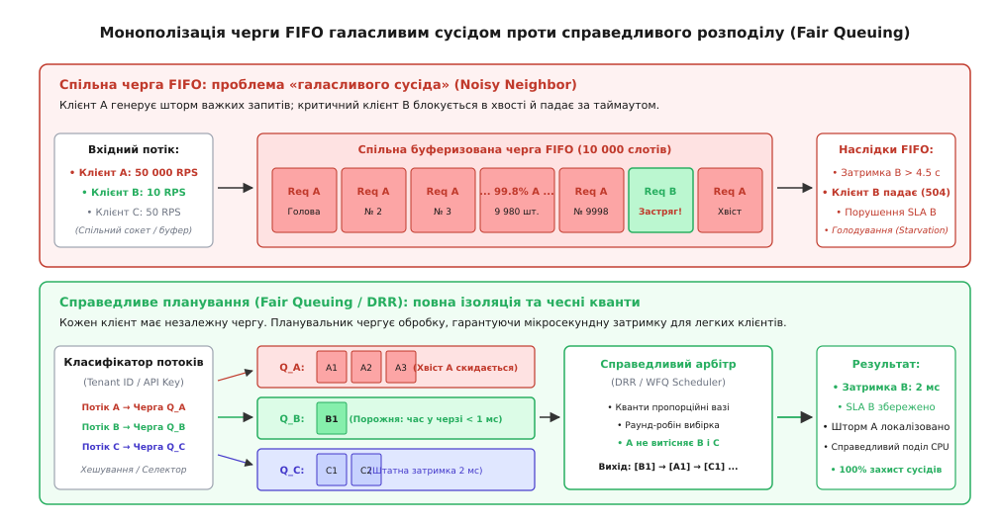
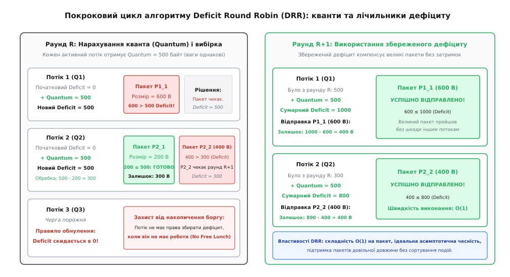
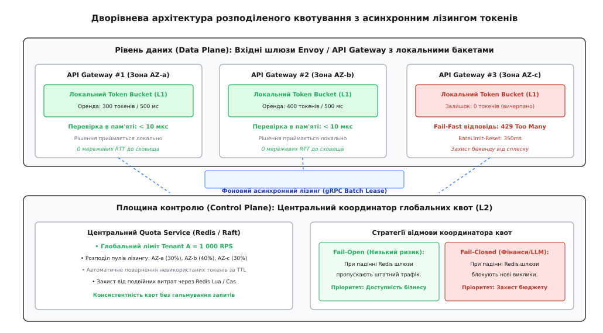

# Чесність розподілу ресурсів і квотування

<preknowlist>
- [Ізоляція орендарів (мультиарендність)](topic:sf-distributed/tenant-isolation) — логічне та фізичне розділення даних і обчислень між клієнтами.
- [Скидання навантаження](topic:sf-distributed/load-shedding) — захист системи від перевантаження через швидке відсікання надлишкових запитів.
- [Перебірки (bulkhead)](topic:sf-distributed/bulkhead-isolation) — ізоляція пулів потоків, з'єднань та пам'яті для локалізації збоїв.
- [Таймаути і бюджет часу](topic:sf-distributed/timeouts-deadlines) — дедлайни запитів та запобігання марній обробці застарілих викликів.
- [Повторні спроби та експоненційний відступ](topic:sf-distributed/retries-backoff) — шторми повторів і небезпека каскадного перевантаження.
</preknowlist>

У багатокористувацькому хмарному сховищі баз даних компанія надає спільний кластер на 100 вузлів для тисячі незалежних корпоративних клієнтів. О 09:14 ранку один з орендарів запускає неоптимізований скрипт міграції даних, генеруючи 80 000 аналітичних SQL-запитів на секунду з операціями повного сканування таблиць (`FULL TABLE SCAN`). Загальна фізична місткість кластера становить 50 000 запитів на секунду. Вхідні сокети та спільні пули потоків операційної системи заповнюються трафіком агресивного клієнта за 80 мілісекунд. Інший клієнт — платіжний сервіс інтернет-магазину — у цей самий момент надсилає лише 5 легких точкових запитів на секунду за первинним ключем. Однак кожен запит платіжного сервісу потрапляє в хвіст гігантської черги FIFO, де чекає на виконання понад 4 500 мілісекунд. Клієнтські таймаути платіжного шлюзу спливають через 2 000 мілісекунд, транзакції покупців падають з помилками `HTTP 504 Gateway Timeout`, а бізнес зазнає збитків на мільйони доларів, хоча платіжний сервіс жодним чином не перевищив свій оплачений ліміт використання.

Ця типова аварія викриває головну проблему неконтрольованого спільного доступу: **проста спільна черга FIFO (First-In, First-Out) повністю беззахисна перед агресивним джерелом трафіку**. Будь-який окремий клієнт, фоновий процес або помилково налаштований бот здатен миттєво монополізувати всі доступні обчислювальні потужності, заблокувати роботу добропорядних сусідів і спричинити катастрофічне голодування (Starvation) критично важливих бізнес-процесів.

Механізми **чесності розподілу (англ. *fairness*, від давньоангл. *fæger* — відповідний, гармонійний, належний)** та **квотування (англ. *quota*, від лат. *quota pars* — яка частина, належна частка)** вирішують цю проблему через перетворення спільних вузьких місць на ізольовані керовані потоки. Замість наївного почергового виконання запитів система виступає незалежним арбітром, який гарантує кожному клієнту його законну частку ресурсів незалежно від поведінки, помилок чи агресивності будь-яких сусідніх орендарів.

## Проблема «галасливого сусіда» та блокування голови черги

Коли кілька незалежних клієнтів (орендарів, мікросервісів або функціональних модулів) використовують спільну інфраструктуру, вони конкурують за вичерпні фізичні ресурси: тактові частоти процесора, оперативну пам'ять, дискові операції вводу-виводу (IOPS), смугу пропускання мережевих карт та пул з'єднань із базою даних.

Явище, коли один надмірно активний клієнт деградує якість обслуговування інших користувачів системи, називається проблемою **галасливого сусіда (англ. *noisy neighbor*)**.

У класичній архітектурі зі спільною чергою FIFO руйнівна дія галасливого сусіда розгортається через ефект **блокування голови черги (англ. *head-of-line blocking*, скорочено *HOL-blocking*)**:

1. **Заповнення буфера монополістом:** якщо клієнт A генерує 99% вхідного потоку, то з кожних 100 елементів у черзі 99 належать йому.
2. **Штучне зростання затримки для сторонніх потоків:** запит дисциплінованого клієнта B змушений фізично стояти в черзі за тисячами завдань клієнта A, навіть якщо виконання запиту B займає лише 100 мікросекунд.
3. **Марне згоряння клієнтського бюджету часу:** час очікування в черзі перевищує дедлайн клієнта B, що призводить до обриву з'єднання за таймаутом.
4. **Каскадний колапс через шторм повторів:** розірвавши з'єднання, клієнт B надсилає повторний запит ([Повторні спроби та експоненційний відступ](topic:sf-distributed/retries-backoff)), який знову стає в кінець переповненої черги, ще сильніше погіршуючи ситуацію.


*Монополізація спільної черги FIFO агресивним джерелом трафіку проти ізоляції та гарантованого обслуговування за алгоритмом Fair Queuing.*

### Чому статичні жорсткі ліміти є неефективними

Перша інтуїтивна спроба розв'язати проблему галасливого сусіда — встановлення жорсткого статичного ліміту інтенсивності (Hard Rate Limit) для кожного користувача, наприклад, не більше 50 RPS на орендаря. Однак такий підхід породжує два важкі системні недоліки:

* **Штучне недовикористання кластера (Underutilization):** якщо в системі наразі активний лише клієнт A, а решта 999 клієнтів сплять, жорсткий лімітер блокуватиме клієнта A на рівні 50 RPS, залишаючи 99% дорогого обладнання повністю бездіяльним.
* **Несправедливість при змінній складності операцій:** один запит може бути простим читанням з кешу в пам'яті (0,2 мс CPU), а інший — важким аналітичним агрегуванням (2 000 мс CPU). Обмеження за кількістю запитів (RPS) дозволяє клієнту з 50 важкими запитами спалити 100% процесора, тоді як клієнт із 51 легким запитом буде несправедливо відхилений.

Справжнє інженерне розв'язання вимагає динамічного планування, яке одночасно захищає слабких і дозволяє повністю утилізувати вільні потужності системи.

## Формальні критерії справедливості: Max-Min Fairness

Щоб алгоритмічно оцінити якість розподілу ресурсу, в комп'ютерних науках використовують математичний критерій **макс-мін справедливості (англ. *max-min fairness*)**.

Принцип макс-мін стверджує: **розподіл ресурсу є справедливим тоді й лише тоді, коли неможливо збільшити частку будь-якого учасника без зменшення частки того, хто вже отримує менше або стільки ж**.

Інтуїтивно це працює за принципом «водного наповнення» (Water-filling):

1. Усі активні споживачі починають одночасно отримувати ресурс рівними темпами.
2. Якщо вимоги дрібного клієнта задовольняються повністю, його виділення фіксується, а він перестає споживати додаткову ємність.
3. Весь невикористаний залишок ресурсу автоматично та порівну ділиться між тими клієнтами, чиї потреби ще не задоволені.
4. Процедура триває доти, доки вся доступна місткість системи не буде вичерпана.

У результаті малі споживачі отримують 100% того, що вони просять, а великі споживачі порівну ділять між собою весь залишок потужності, зупиняючись на єдиному справедливому порозі насичення `f`.

### Зважена макс-мін справедливість (Weighted Max-Min)

У комерційних системах користувачі мають різні рівні обслуговування (Service Level Agreement, SLA) та оплачені тарифи (наприклад, тариф Free має вагу `w = 1`, Standard — `w = 4`, а Enterprise — `w = 20`).

При **зваженому макс-мін розподілі** ресурс ділиться пропорційно до ваги клієнта: якщо два клієнти вимагають більше, ніж може надати система, клієнт із вагою 20 отримає рівно в 5 разів більшу частку пропускної здатності, ніж клієнт із вагою 4.

Детальне математичне виведення алгоритму прогресивного наповнення, балансових рівнянь та строгого доведення теореми зваженого розподілу наведено у вставці [🧮 Математика max-min справедливості та Dominant Resource Fairness](topic:sf-distributed/fairness-quotas/math-max-min-fairness.md).

### Принцип збереження роботи: Work-Conserving проти Non-Work-Conserving

Планувальники черг та ресурсів поділяються на два фундаментальні класи за їхнім ставленням до простою обладнання:

* **Збереження роботи (англ. *work-conserving*, від лат. *conservare* — зберігати):** планувальник ніколи не тримає процесорні ядра чи мережевий канал бездіяльними, якщо хоча б в одній черзі є очікувальне завдання. Якщо інші клієнти мовчать, активний клієнт може тимчасово зайняти хоч 100% місткості всієї системи. Проте щойно з'являється запит від іншого клієнта, планувальник миттєво обмежує монополіста до його справедливої частки.
* **Без збереження роботи (англ. *non-work-conserving*):** планувальник строго обмежує клієнта його номінальною смугою (наприклад, рівно 10 МБ/с або 100 RPS). Навіть якщо система вільна на 99%, надлишкові запити клієнта або штучно затримуються в буфері (шейпінг), або відкидаються.

У високонавантажених мікросервісних бекендах перевагу майже завжди віддають алгоритмам із збереженням роботи (Work-Conserving), оскільки вони максимізують корисну віддачу від орендованого «заліза».

## Еволюція алгоритмів справедливого планування черг

Шлях до швидкого та точного справедливого розподілу зайняв кілька десятиліть інженерних пошуків — від перших збоїв у мережі ARPANET до сучасних ядер маршрутизації.

Детальний хронологічний аналіз протистояння інженерів, штормів Нейгла та історії наукових відкриттів розкрито у вставці [📜 Історія розвитку справедливого планування черг](topic:sf-distributed/fairness-quotas/hist-fair-queuing-origins.md).

```
┌──────────────────────────────────────────────────────────────────────────────────────────┐
│                     ЕВОЛЮЦІЯ АЛГОРИТМІВ СПРАВЕДЛИВОГО ПЛАНУВАННЯ                         │
└────────────────────────────────────────────┬─────────────────────────────────────────────┘
                                             │
      ┌──────────────────────────────────────┴──────────────────────────────────────┐
      ▼                                                                             ▼
┌───────────────────────────────┐                             ┌────────────────────────────────────┐
│   Моделі віртуального часу    │                             │  Квантові циклічні планувальники   │
│   (Virtual Time / Sorting)    │                             │      (Quantum Deficit / O(1))      │
├───────────────────────────────┤                             ├────────────────────────────────────┤
│ • GPS (Ідеальна неперервна)   │                             │ • Round-Robin (Простий циклічний)  │
│ • WFQ (Пріоритетна купа)      │                             │ • DRR (Deficit Round Robin)        │
│ • Складність: O(log N)        │                             │ • Складність: константна O(1)      │
│ • Точність: абсолютна         │                             │ • Точність: асимптотично точна     │
│ • Вузьке місце: CPU сортування│                             │ • Перевага: масштабування на мільйон│
└───────────────────────────────┘                             └────────────────────────────────────┘
```

### 1. Ідеальна рідина: Generalized Processor Sharing (GPS)

Теоретичним еталоном справедливості є модель **Generalized Processor Sharing (GPS)**, запропонована в 1989 році. У цій моделі трафік розглядається як неперервна рідина: якщо в системі одночасно активні `N` черг, канал зв'язку ділиться на `N` мікроструменів, і дані з кожної черги передаються одночасно та паралельно зі швидкістю, пропорційною їхнім вагам.

У фізичному світі комп'ютерів передача рідиною неможлива: мережеві пакети та RPC-запити є дискретними неподільними блоками даних. Пакет розміром 1500 байтів або має бути переданий у сокет цілком, або не переданий взагалі.

### 2. Weighted Fair Queuing (WFQ) та віртуальний час

Алгоритм **Weighted Fair Queuing (WFQ)** вирішує проблему дискретності за допомогою математичної емуляції моделі GPS.

Для кожного вхідного пакета обчислюється мітка **віртуального часу завершення `F`** — точний момент часу, коли цей пакет закінчив би свою передачу в ідеальній системі GPS. Планувальник WFQ складає всі готові пакети в пріоритетну купу (Min-Heap) і в момент звільнення каналу завжди вибирає пакет з найменшим значенням `F`.

WFQ забезпечує бездоганну математичну точність і мінімальну затримку (Jitter). Проте він має критичний недолік для високопродуктивних систем:
* Кожна операція додавання або вилучення пакета вимагає балансування бінарної купи зі складністю `O(log N)`, де `N` — кількість одночасних активних черг.
* Необхідно перераховувати функцію глобального віртуального часу `V(t)` на кожній події прибуття та відправки пакета.

На швидкостях сучасних L7-проксі (сотні тисяч запитів на секунду) підтримка пріоритетної купи для 10 000 орендарів спалює неприпустимо велику кількість процесорних циклів.

### 3. Прорив Deficit Round Robin (DRR): справедливість за O(1)

У 1995 році інженери Мадхав Шрідхар та Джордж Варгезе винайшли алгоритм **Deficit Round Robin (DRR)**, який усунув необхідність у сортуванні та віртуальному часі, знизивши обчислювальну складність до **константного часу `O(1)` на пакет**.

Механізм роботи DRR надзвичайно простий та надійний:

1. **Ізольована черга для кожного потоку:** кожен клієнт має власну FIFO-чергу.
2. **Базовий квант (`Quantum`):** кожній черзі призначається квант ресурсу (у байтах або умовних одиницях CPU), пропорційний її вазі `w_i`.
3. **Лічильник дефіциту (`DeficitCounter`):** кожна черга утримує змінну дефіциту, яка спочатку дорівнює нулю.
4. **Кільцевий раунд:** планувальник обходить активні черги по колу (Round-Robin). Заходячи в чергу, він додає до її лічильника значення `Quantum`:
   ```
   DeficitCounter = DeficitCounter + Quantum
   ```
5. **Вибірка завдань:** черга виймає та обробляє свої запити поспіль доти, доки розмір наступного запиту менший або дорівнює накопиченому балансу:
   ```
   DeficitCounter = DeficitCounter - RequestSize
   ```
6. **Збереження залишку:** якщо розмір наступного запиту перевищує залишок дефіциту, обслуговування черги припиняється. Залишок дефіциту **не згорає**, а зберігається на наступний раунд. Планувальник переходить до наступного клієнта.
7. **Правило обнулення під час простою (Deficit Reset):** якщо черга повністю спорожніла, її `DeficitCounter` негайно скидається в `0`, а сама черга видаляється зі списку активних.


*Покроковий цикл алгоритму Deficit Round Robin: накопичення дефіциту та вибірка пакетів довільного розміру за O(1).*

Завдяки збереженню дефіциту клієнти з великими важкими пакетами не зазнають дискримінації: вони пропускають один раунд, накопичують необхідний дефіцит і успішно проходять у наступному раунді. При цьому клієнти з маленькими пакетами обслуговуються пачками в межах свого кванта.

Повнофункціональний робочий код багатопотокового планувальника DRR мовами C та C++ з детальним аналізом структур пам'яті наведено у вставці [⚙️ Реалізація планувальника Deficit Round Robin для RPC-запитів](topic:sf-distributed/fairness-quotas/proj-deficit-round-robin.md).

> 🔧 **Навіщо це.**
> Алгоритм DRR є базовим фундаментом планування у високонавантажених розподілених сховищах (Apache Cassandra, ScyllaDB, CockroachDB), де тисячі клієнтів змагаються за диск та пул потоків транзакцій. Завдяки складності `O(1)` планувальник витрачає на прийняття рішення менше 15 наносекунд, що дозволяє утримувати детермінований час відповіді без створення додаткового навантаження на підсистему пам'яті процесора.

## Ієрархічні черги та багаторівневий розподіл (Hierarchical DRR)

У великих організаціях структура споживання рідко буває пласкою. Як правило, ресурси компанії діляться за складною деревом подібною ієрархією:

```
                              ┌────────────────────────────────────────┐
                              │            ГЛОБАЛЬНИЙ КЛАСТЕР          │
                              └───────────────────┬────────────────────┘
                                                  │
                 ┌────────────────────────────────┴────────────────────────────────┐
                 ▼                                                                 ▼
      ┌─────────────────────┐                                           ┌─────────────────────┐
      │  Департамент Core   │ (вага 70%)                                │ Департамент Search  │ (вага 30%)
      └──────────┬──────────┘                                           └──────────┬──────────┘
                 │                                                                 │
        ┌────────┴────────┐                                               ┌────────┴────────┐
        ▼                 ▼                                               ▼                 ▼
  ┌───────────┐     ┌───────────┐                                   ┌───────────┐     ┌───────────┐
  │ Платежі   │     │  Авторизація│                                 │ Індексація│     │ Ранжування│
  │ (вага 80%)│     │ (вага 20%)│                                   │ (вага 40%)│     │ (вага 60%)│
  └───────────┘     └───────────┘                                   └───────────┘     └───────────┘
```

Якщо застосовувати плаский планувальник, сервіс з 100 дрібними воркерами витіснить сервіс з 2 важливими воркерами. Алгоритм **Hierarchical Deficit Round Robin (H-DRR)** організовує планування як дерево:

1. На кореневому рівні кванти діляться між департаментами пропорційно до їхнього бюджету (70% проти 30%).
2. Усередині департаменту виділена квота рекурсивно ділиться між командами та окремими мікросервісами.
3. Якщо сервіс авторизації мовчить, його невикористаний квант автоматично передається платіжному сервісу всередині тієї самої гілки Core, не витікаючи в сусідній департамент Search без необхідності.

Це гарантує сувору фінансову та організаційну ізоляцію: перевитрати однієї команди ніколи не зачіпають бюджет іншого підрозділу.

## Багатовимірна справедливість: Dominant Resource Fairness (DRF)

У сучасних хмарних платформах (Kubernetes, Apache Mesos) та складних мікросервісних конвеєрах запити конкурують не за один ресурс, а одночасно за кілька гетерогенних складових системи:

* **Процесорні ядра (CPU)**
* **Оперативна пам'ять (RAM)**
* **Дискові операції (IOPS / Read-Write Bandwidth)**
* **Мережевий трафік (Network Egress/Ingress)**

Класичні одновимірні алгоритми не здатні забезпечити чесність у таких умовах. Розглянемо приклад:
* Клієнт A запускає задачі машинного навчання: вимагає 8 ядер CPU та лише 1 ГБ RAM.
* Клієнт B запускає кеш у пам'яті Redis: вимагає 1 ядро CPU та 32 ГБ RAM.

Якщо ділити порівну CPU, клієнт B вичерпає всю пам'ять кластера і заблокує клієнта A. Якщо ділити порівну пам'ять, клієнт A вичерпає весь процесор.

У 2011 році дослідники з університету Берклі створили алгоритм **Dominant Resource Fairness (DRF)**.

Головна ідея DRF полягає у визначенні **домінантного ресурсу (англ. *dominant resource*)** для кожного користувача:

1. Для кожного клієнта розраховується частка споживання кожного типу ресурсу від загальної доступної місткості всього кластера.
2. Ресурс, відносна частка якого є максимальною, оголошується **домінантним ресурсом** цього клієнта.
3. Максимальна відносна частка називається **домінантною часткою (Dominant Share)**:
   ```
   DominantShare_i = max ( CPU_used / CPU_total,  RAM_used / RAM_total,  IO_used / IO_total )
   ```
4. **Правило планування DRF:** планувальник завжди вибирає для запуску наступне завдання того клієнта, чия **домінантна частка наразі є найменшою серед усіх активних орендарів**.

DRF має унікальні математичні властивості: він гарантує спільну вигоду від об'єднання ресурсів (Sharing Incentive), стійкість до маніпуляцій (Strategy-Proofness) та відсутність заздрості (Envy-Freeness — жоден клієнт не захоче помінятися своїм виділенням ресурсів із виділенням іншого клієнта).

## Розподілене квотування на масштабі: лізинг токенів

Коли сервіс масштабується на десятки географічно розподілених регіонів (Multi-Region Ingress), а вхідний потік обслуговується сотнями паралельних шлюзів API (Envoy, Kong, Cloudflare Workers), виникає архітектурна проблема: **як забезпечити глобальну квоту клієнта (наприклад, 10 000 RPS на організацію) без створення гігантської затримки на кожному виклику?**

Існують три базові підходи до організації розподілених квот:

### 1. Наївний синхронний централізований квотер
Кожен вхідний шлюз на кожен отриманий HTTP-запит робить блокуючий виклик до центрального кластера Redis або сервісу квот через мережу.

* *Чому це ламається:* кожен запит отримує штраф у 2–10 мілісекунд затримки. Якщо центральний Redis падає або зазнає деградації мережі, вся глобальна інфраструктура компанії миттєво паралізується. Redis зазнає навантаження в мільйони RPS і стає критичним вузьким місцем.

### 2. Статичний поділ квоти між шлюзами
Якщо організація має ліміт 1 000 RPS, а в системі працює 10 шлюзів, кожному шлюзу виділяється локальний ліміт `1000 / 10 = 100 RPS`.

* *Чому це ламається:* трафік у реальному житті ніколи не розподіляється ідеально рівномірно. Якщо клієнт надішле всі свої 1 000 запитів через шлюз у Франкфурті, шлюз пропустить лише 100 запитів і відхилить 900 із кодом HTTP 429, хоча 9 інших шлюзів будуть абсолютно порожніми. Клієнт отримує помилки за 10% використання свого оплаченого ліміту.

### 3. Дворівневий асинхронний лізинг квот (Token Leasing)

Сучасним стандартом розподіленого квотування є **патерн асинхронного лізингу токенів**:

* **Рівень 1 (Data Plane / Локальний шлюз):** кожен екземпляр API-шлюзу утримує в локальній оперативній пам'яті власний швидкісний алгоритм Token Bucket. Рішення про допуск або відхилення запиту приймається за **< 10 мікросекунд** без будь-яких мережевих викликів.
* **Рівень 2 (Control Plane / Центральний координатор):** фоновий потік шлюзу раз на 200–500 мілісекунд зв'язується з центральним сервісом квот через gRPC і бере в «оренду» пачку токенів (Batch Lease), наприклад, 300 токенів.
* **Адаптивний розмір пачки (Batch Sizing):** шлюз динамічно змінює розмір орендованої пачки залежно від поточної інтенсивності клієнта. Для активного клієнта орендуються великі пачки, для пасивного — маленькі.
* **Автоматичне повернення невикористаного залишку:** якщо трафік клієнта раптово спадає, невикористані орендовані токени автоматично повертаються в глобальний пул після закінчення таймера оренди (TTL).


*Дворівнева архітектура розподіленого квотування: локальні ліміти з асинхронним лізингом токенів через центральний координатор.*

Повну специфікацію gRPC-контрактів сервісу квот, стандартизовані HTTP-заголовки IETF (`RateLimit-Limit`, `RateLimit-Remaining`, `RateLimit-Reset`, `Retry-After`), а також оптимізований атомарний скрипт Redis Lua наведено у вставці [📋 Інтерфейс та протокол розподіленого квотування](topic:sf-distributed/fairness-quotas/api-quota-enforcement.md).

## Динамічна вартість запитів (Cost-based Quotas)

У реальних виробничих середовищах вимірювання квот у «кількості HTTP-запитів» (RPS) є грубим спрощенням, яке регулярно призводить до відмов інфраструктури.

Один запит `GET /api/v1/health` вимагає 0,05 мілісекунди процесора і повертає 20 байтів з оперативної пам'яті. Інший запит `POST /api/v1/reports/export` запускає складний аналітичний пайплайн, споживає 4 процесорні ядра протягом 8 секунд, виділяє 500 МБ оперативної пам'яті та створює гігабайтний тимчасовий файл на диску. Якщо обидва запити списати як «1 токен квоти», система обліку втрачає будь-який практичний сенс.

Сучасні системи квотування використовують **облік за динамічною вартістю (Cost-based Quotas)**:

```
                            ┌──────────────────────────────────────────────┐
                            │    СТРАТЕГІЇ ОБЛІКУ ВАРТОСТІ ЗАПИТІВ         │
                            └──────────────────────┬───────────────────────┘
                                                   │
                ┌──────────────────────────────────┴──────────────────────────────────┐
                ▼                                                                     ▼
┌──────────────────────────────────────────────┐       ┌──────────────────────────────────────────────┐
│     Апріорна оцінка (A-priori Costing)       │       │    Апостеріорна корекція (Post-Billing)      │
├──────────────────────────────────────────────┤       ├──────────────────────────────────────────────┤
│ • Оцінка до початку обробки на Gateway       │       │ • Розрахунок після виконання на бекенді      │
│ • Розмір корисного навантаження (Payload KB) │       │ • Реальний час CPU: Thread CPU Time          │
│ • Кількість ключів у Batch (Batch size)      │       │ • Кількість прочитаних рядків бази даних     │
│ • Статичний ваговий коефіцієнт маршруту      │       │ • Списання різниці через заголовок відповіді │
│ • Швидке відсікання важкого сміття           │       │ • Захист від прихованого ресурсного спаму    │
└──────────────────────────────────────────────┘       └──────────────────────────────────────────────┘
```

### 1. Апріорний розрахунок вартості (A-priori Costing)
Шлюз визначає попередню вартість запиту до його передачі на бекенд, аналізуючи метадані виклику:
* Фіксований ваговий коефіцієнт за типом кінцевої точки (наприклад, читання профілю = 1 Unit, пошук по всій базі = 10 Units).
* Розмір вхідного тіла запиту (1 Unit на кожні 64 КБ даних).
* Кількість ідентифікаторів у пакетному виклику `GET /users?ids=1,2,3...100` (1 Unit на кожен ID).

Якщо у клієнта недостатньо токенів для покриття розрахованої ваги, виклик відхиляється на рівні шлюзу без навантаження на внутрішні мікросервіси.

### 2. Апостеріорна корекція (A-posteriori Post-Billing)
Якщо реальна складність операції залежить від стану бази даних і не може бути передбачена наперед, бекенд вимірює фактично витрачені ресурси:
* Точний час роботи процесора (`getrusage()` або Java `ThreadMXBean.getCurrentThreadCpuTime()`).
* Кількість прочитаних та відсканованих рядків у сховищі даних.
* Обсяг згенерованого вихідного трафіку.

Після завершення операції бекенд повертає шлюзу заголовок `X-Request-Cost: 45`. Шлюз списує додаткові 44 токени з локального бакета клієнта. Якщо бакет іде в мінус (дефіцит), наступні запити цього користувача автоматично блокуються або ставляться на паузу доти, доки регулярне поповнення бакета не компенсує створений овердрафт.

## Крайові випадки, пастки та інженерні компроміси

Проектування систем справедливого розподілу та квотування супроводжується низкою неочевидних архітектурних пасток, кожна з яких може зруйнувати надійність сервісу:

### 1. Дилема Fail-Open проти Fail-Closed при падінні квотера

Якщо центральний координатор квот (кластер Redis або сервіс лізингу) зазнає повної відмови, мережевої ізоляції (Split-Brain) або критичної деградації затримки, шлюзи постають перед вибором:

* **Fail-Open (Пріоритет доступності):** шлюз фіксує помилку зв'язку з квотером, тимчасово вимикає перевірку лімітів і пропускає весь клієнтський трафік безпосередньо на бекенд.
  * *Сфера застосування:* інтернет-магазини, сервіси потокового відео, системи публічного контенту. Краще тимчасово ризикнути перевантаженням бекенду, ніж гарантовано заблокувати 100% користувачів і втратити прибуток.
* **Fail-Closed (Пріоритет фінансової безпеки):** шлюз блокує всі нові запити з кодом помилки `HTTP 429` або `503 Service Unavailable`, якщо не може підтвердити наявність квоти.
  * *Сфера застосування:* платформи генеративного штучного інтелекту (OpenAI/Anthropic API), платіжні та криптографічні шлюзи, сервіси відправки SMS-повідомлень. Якщо пропустити трафік без лімітів, компанія за лічені хвилини зазнає прямих фінансових збитків на сотні тисяч доларів за чужі обчислення.

### 2. Шторм помилок 429 та лавинне навантаження на шлюзи
Коли клієнт отримує статус `HTTP 429 Too Many Requests`, наївний клієнтський код починає надсилати повторні запити в щільному циклі `while (true)`.

Якщо 10 000 заблокованих клієнтів генерують по 1 000 запитів на секунду, вхідні проксі витрачають гігабайти пам'яті та 100% процесора лише на парсинг TLS, перевірку заголовків і повернення відповідей 429. Шлюз гине від перевантаження, відмовляючи навіть тим клієнтам, чия квота не була вичерпана.

*Захист:*
* Шлюзи зобов'язані передавати обов'язковий заголовок `Retry-After` з точним часом паузи.
* Застосування протоколів захисту від штормів повторів на рівні балансувальника L4 (iptables / eBPF / SYN Cookies) для відсікання IP-адрес, які генерують понад 1 000 помилок 429 на секунду.

### 3. Блокування голови черги в мультиплексованих протоколах (HTTP/2 та gRPC)
У протоколах HTTP/2 та HTTP/3 кілька незалежних логічних потоків (Streams) мультиплексуються всередині одного фізичного TCP- або QUIC-з'єднання.

Якщо клієнт надсилає через одне з'єднання 1 важкий запит і 10 легких, а сервер застосовує обмеження швидкості на рівні з'єднання (TCP Window), весь TCP-потік блокується. Легкі запити клієнта виявляються заблокованими на транспортному рівні ядра операційної системи, навіть якщо на рівні додатку діє планувальник DRR.

*Захист:* реалізація внутрішнього планувальника потоків безпосередньо в HTTP/2-стеку сервера (наприклад, пріоритезація gRPC Stream Weights), що дозволяє відправляти фрейми даних легких потоків раніше, ніж важких.

### 4. Накопичення невикористаного кредиту (Deficit Accumulation)
Якщо система дозволяє клієнту переносити невикористані квоти на наступні періоди без обмежень, клієнт, який мовчав 30 днів, накопичує право на 30 000 000 миттєвих запитів. Його наступний залповий сплеск гарантовано знищить інфраструктуру.

*Захист:* встановлення жорсткого стелі накопичення (Burst Cap) на рівні не більше 1,5–2,0 від номінального секундного ліміту. Усі токени, що перевищують цю ємність, безповоротно згорають.

---

Чесність розподілу ресурсів та розподілене квотування трансформують хаотичний конгломерат мікросервісів у стабільну, передбачувану інженерну систему. Поєднуючи константну швидкість алгоритму Deficit Round Robin на рівні локальних черг, математичну збалансованість Dominant Resource Fairness у багатовимірному кластері та асинхронний лізинг токенів на рівні глобальних шлюзів, архітектура отримує абсолютний імунітет до проблеми галасливого сусіда, гарантуючи виконання бізнес-зобов'язань та максимальну віддачу від обчислювальної інфраструктури.
