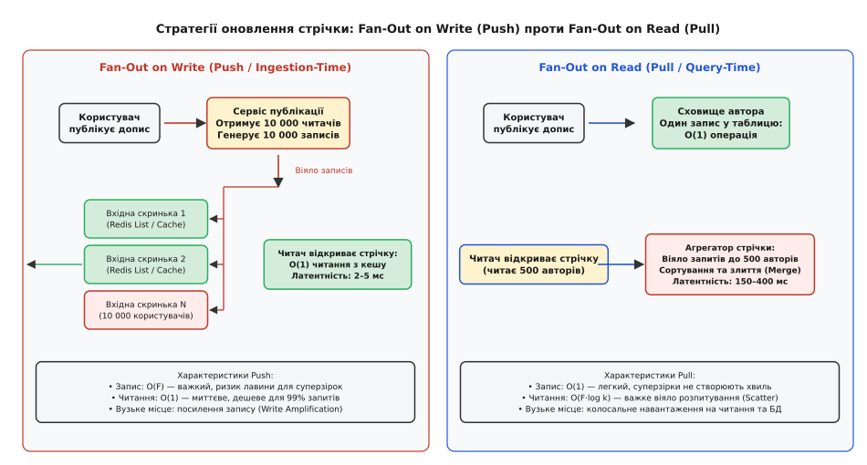
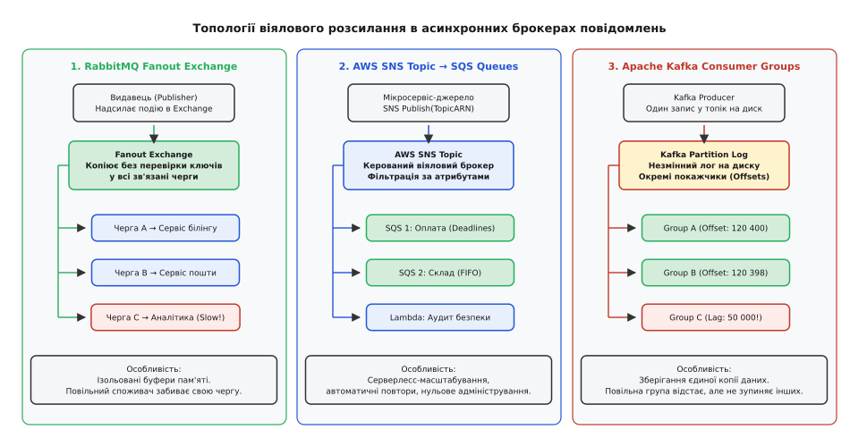
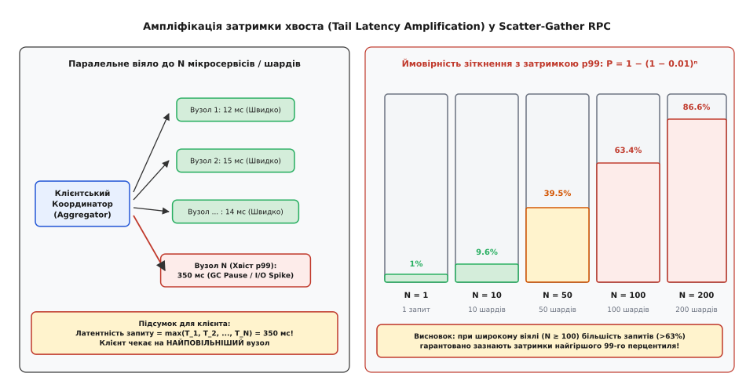
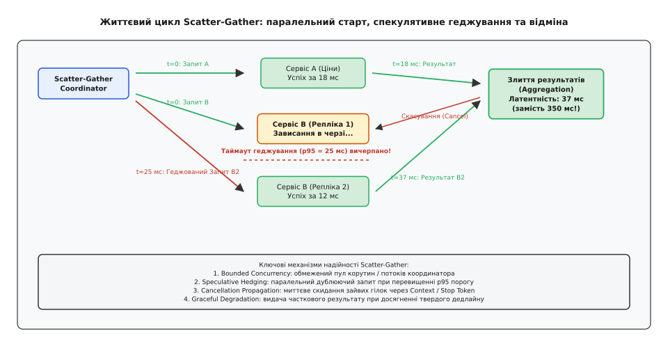

# Стратегії віялового розсилання: топології доставки, паралельний запит і подолання ампліфікації затримок

<preknowlist>
- [Черга повідомлень](topic:sf-distributed/message-queue) — буферизована асинхронна передача даних «точка-точка» між сервісами.
- [Видавець-передплатник](topic:sf-distributed/publish-subscribe) — розв'язання топологічної зв'язності відправника та множини отримувачів через шину або брокер.
- [Маршрутизатор повідомлень](topic:sf-distributed/message-router) — динамічна селекція цільових каналів за фільтрами та контентом.
- [Таймаути та дедлайни](topic:sf-distributed/timeouts-deadlines) — запобігання нескінченному блокуванню ресурсів і розповсюдження контексту скасування.
- [Шардування та секціонування](topic:sf-distributed/partitioning-sharding) — горизонтальний розподіл даних за ключем для паралельного масштабування сховищ.
</preknowlist>

Користувач маркетплейсу відкриває сторінку товару, на якій одночасно відображаються актуальна ціна, залишки на 40 регіональних складах, персональні знижки, персоналізовані рекомендації та відгуки покупців. Щоб сформувати таку сторінку, клієнтський API-шлюз розбиває вхідний HTTP-запит на віяло з 80 паралельних підзапитів до незалежних шардованих мікросервісів. Навіть якщо кожен окремий сервіс працює стабільно і повертає відповідь за 15 мілісекунд у 99% випадків (і лише в 1% через паузу збирання сміття чи скидання дискового буфера затримується до 400 мілісекунд), для кінцевого користувача ймовірність зіткнутися з 400-мілісекундним зависанням усієї сторінки перевищує 55%. Замість швидкого інтерфейсу клієнт отримує повільний додаток, де кожен другий перегляд сторінки впирається в найгірший хвіст затримок.

Паралельно у фоновій підсистемі платформи розгортається інша криза: продавець із 5 мільйонами підписників оголошує святковий розпродаж. Сервіс публікації намагається синхронно розіслати сповіщення у вхідні скриньки всіх 5 мільйонів покупців. Єдиний вхідний запит породжує лавину з 5 000 000 операцій запису в оперативні кеші, що забиває черги брокера повідомлень на 45 секунд. Доки триває обробка цієї гігантської хвилі, сповіщення для звичайних користувачів блокуються, вичерпується оперативна пам'ять брокера, а аналітичний споживач, який не встигає зчитувати потік із такою швидкістю, переповнює мережеві буфери й зупиняє роботу суміжних критичних черг.

Обидві ці ситуації є проявами фундаментальної проблеми розподілених обчислень — некерованого розмноження навантаження при переході від одного джерела до множини цілей. Без спеціалізованих архітектурних стратегій віялового розсилання паралелізація запитів замість прискорення призводить до катастрофічного падіння пропускної здатності, експоненційної деградації затримок та спільних каскадних відмов інфраструктури.


*Зліва: стратегія Fan-Out on Write здійснює важку реплікацію даних у персональні сховища під час публікації, гарантуючи швидке читання. Справа: Fan-Out on Read зберігає допис один раз, але перекладає навантаження на читача через важку фазу паралельного збору та злиття.*

## Сутність віялового розсилання: три площини розподіленого масштабування

**Віялове розсилання** (англ. *fan-out*, від слів *fan* — віяло та *out* — назовні, розгортання віялом) — це архітектурний патерн множення та одночасного розподілу одиничного вхідного сигналу (повідомлення, бізнес-події або клієнтського запиту) на `N` незалежних цільових вузлів, черг, мікросервісів або сховищ даних.

Термін походить із мікроелектроніки (коефіцієнт розгалуження за виходом, або *fan-out factor* логічного вентиля — максимальна кількість входів інших вентилів, якими може надійно керувати один вихід без спотворення електричного сигналу). У розподілених системах віяло вимірюється ступенем мультиплікації навантаження: одне вхідне повідомлення на вході породжує `N` вихідних дій усередині кластера.

Віялове розсилання реалізується у трьох принципово різних площинах функціонування:

1. **Асинхронне брокерне віяло (Message Broker Fan-Out):** Транспортне розмноження подій за принципом [видавець-передплатник](topic:sf-distributed/publish-subscribe), коли єдина подія публікується в брокер і дублюється в `N` ізольованих черг для незалежної фонової обробки різними сервісами (білінг, склад, аудит, машинне навчання).
2. **Синхронний розпил та агрегація запитів (Scatter-Gather RPC Fan-Out):** Координатор або [API-шлюз](topic:sf-web/api-gateway) приймає один клієнтський запит, розбиває його на `N` паралельних мережевих викликів до різних мікросервісів або [шардів сховища](topic:sf-distributed/partitioning-sharding), чекає на їхнє завершення, об'єднує результати в єдиний агрегат і повертає клієнту.
3. **Віяло матеріалізації стану (State Ingestion Fan-Out):** Дилема проектування сховищ даних між матеріалізацією персоналізованих вибірок у момент запису (*Fan-Out on Write / Push-модель*) та динамічним обчисленням вибірок у момент читання (*Fan-Out on Read / Pull-модель*).

Кожна з цих площин має власні вузькі місця, механізми захисту від перевантаження та математичні моделі деградації.

## Асинхронне брокерне віяло: топології та проблема повільного споживача

В асинхронних системах обміну повідомленнями віялове розсилання відокремлює відправника від отримувачів у часі та просторі. Відправник не знає кількості підписників, їхніх мережевих адрес та поточної швидкості їхньої роботи.

### Топологічні моделі брокерного віяла

Існує три домінуючі архітектурні топології реалізації асинхронного віяла:

1. **Broadcast Exchange у чергах пам'яті (RabbitMQ Fanout Exchange):** Обмінник типу `fanout` ігнорує ключі маршрутизації та миттєво клонує вхідне повідомлення в усі прив'язані до нього черги. Кожен сервіс-підписник володіє власною чергою з незалежним пулом [конкурентних споживачів](topic:sf-distributed/competing-consumers).
2. **Хмарний керований мікросервісний міст (AWS SNS Topic → SQS Queues):** Серверлесс-топік приймає подію через HTTPS API і автоматично дублює її в підписані черги SQS. Ця топологія підтримує вбудовану селективну фільтрацію за атрибутами через [маршрутизатор повідомлень](topic:sf-distributed/message-router), дозволяючи відсікати зайвий трафік ще до потрапляння в чергу споживача.
3. **Розподілений незмінний лог (Apache Kafka Consumer Groups):** На відміну від черг, брокер не клонує фізичні байти повідомлення на диску. Повідомлення записується в секцію топіка один раз. Віяло реалізується за рахунок того, що кожна група споживачів (*Consumer Group*) має власний незалежний покажчик зміщення (*Offset*) і вичитує ті самі незмінні дані з власною швидкістю.


*Три топології асинхронного віяла: RabbitMQ дублює повідомлення в пам'яті в окремі черги; AWS SNS здійснює кероване розсилання в черги SQS; Kafka зберігає єдиний лог на диску, де кожна група споживачів рухається з власним зсувом.*

Повні нормативні схеми інфраструктури, декларації Terraform для AWS SNS-SQS та конфігурації RabbitMQ наведено у технічній довідці: [детальні контракти конфігурацій топіків, черг і Protobuf-схем](topic:sf-distributed/fan-out-strategies/api-fanout-contracts.md).

### Проблема повільного споживача (Slow Consumer Problem)

Головною системною загрозою в брокерному віялі є нерівномірність швидкодії підписників. Нехай сервіс оформлення замовлень публікує 10 000 подій на секунду. До віялового обмінника підключено три підсистеми:
* Сервіс складського обліку (C++ / Go): обробляє 15 000 подій/с (черга завжди порожня).
* Сервіс відправки push-повідомлень (Node.js): обробляє 10 000 подій/с (працює на межі).
* Сервіс вивантаження в аналітичне сховище Data Warehouse (застарілий пакетний процес): обробляє лише 200 подій/с.

Якщо брокер побудований на спільній черзі або без обмеження буферів, виникає колапс трьох типів:

1. **Вичерпання оперативної пам'яті брокера:** Черга повільного споживача щосекунди накопичує 9 800 повідомлень. За кілька годин черга розростається до десятків мільйонів елементів, з'їдаючи всю виділену RAM брокера. Брокер починає екстрено скидати повідомлення на диск (*Paging to disk*), що обвалює швидкість роботи всього кластера у 20–50 разів і зупиняє швидкі черги складу та білінгу.
2. **Блокування мережевого вікна TCP (TCP Window Starvation):** Якщо брокер використовує спільний сокет або брокерний механізм прямого проштовхування (*Push-based delivery*), повільний клієнт заповнює свій сокетний буфер TCP. TCP-стек зменшує розмір вікна (*Window Size = 0*). Брокер блокується на спробі відправити наступний пакет, заморожуючи внутрішній потік диспетчеризації для решти клієнтів.
3. **Неконтрольований лаг секцій (Consumer Lag Explosion):** У Kafka повільна група споживачів не вичерпує RAM (дані лежать на диску), проте відставання (*Lag*) зростає настільки, що старі повідомлення видаляються політикою збереження (*Retention Policy: 7 days*) ще до того, як повільний сервіс встигне їх вичитати, призводячи до непоправної втрати бізнес-даних.

### Стратегії захисту від повільного споживача

Для ізоляції повільних споживачів у віялових брокерах застосовують чотири архітектурні бар'єри:

* **Ізоляція черг та жорсткі ліміти ємності (Bounded Queue Buffers):** Кожна черга отримує суворий ліміт розміру (наприклад, параметр RabbitMQ `x-max-length = 50000`). При переповненні брокер активує політику скидання старих даних (`x-overflow: drop-head`) або відхилення нових повідомлень лише для цієї конкретної черги, не зачіпаючи сусідні підсистеми.
* **Протитиск на основі попиту (Pull-Based Backpressure / Reactive Streams):** Споживач сам запитує порцію даних, яку він фізично здатний обробити (механізм `prefetch_count` в AMQP або виклик `request(n)` у стандарті Reactive Streams). Брокер ніколи не проштовхує дані вперед, доки споживач не підтвердить готовність.
* **Схлопування повідомлень (Conflation / Lossy Fan-Out):** Для потоків телеметрії, котирувань валют або статусів замовлень брокер перезаписує старе незчитане повідомлення новішим значенням за ключем сутності (*Key-based conflation*). Якщо споживач відстає, він пропускає проміжні стани і читає лише найсвіжіший актуальний стан.
* **Автоматична ізоляція збоїв (Dead Letter Queue):** Повільні або пошкоджені повідомлення після `K` невдалих спроб вичитування перенаправляються в [мертву чергу](topic:sf-distributed/dead-letter-queue) для відкладеного аналізу, звільняючи основну магістраль.

## Синхронний Scatter-Gather та закон ампліфікації хвоста затримок

У синхронній площині віялове розсилання набуває форми патерну **Scatter-Gather** (розпорошення та збір, від англійських слів *scatter* — розкидати, розпорошувати та *gather* — збирати, накопичувати). 

Клієнтський координатор виконує дві послідовні фази:
1. **Scatter-фаза:** Вхідний запит аналізується, формується `N` незалежних підзапитів, які одночасно відправляються по мережі до цільових сервісів або вузлів сховища.
2. **Gather-фаза:** Координатор збирає відповіді, валідує їх, усуває дублікати, виконує агрегацію (сортування, об'єднання, фільтрацію) і формує єдину відповідь.

### Статистична пастка паралелізму

При проектуванні систем інженери часто припускаються фатальної помилки: якщо кожен із 100 шардованих сервісів має затримку 99-го перцентиля (p99) на рівні 15 мілісекунд, вони очікують, що агрегований запит до 100 сервісів також завершиться за 15 мілісекунд у 99% випадків.

Реальність кардинально протилежна: координатор завершує обробку лише тоді, коли відповість **найповільніший із усіх `N` вузлів**:

```
T_agg = max(T₁, T₂, ..., T_N)
```

Якщо ймовірність того, що окремий вузол укладеться в нормальний час, становить `1 - p` (де `p = 0.01` для 99-го перцентиля), то ймовірність того, що **всі** `N` незалежних вузлів вкладуться в нормальний час, дорівнює `(1 - p)ᴺ`.

Відповідно, ймовірність того, що клієнт зазнає хвостової затримки найгіршого перцентиля, становить:

```
P(T_agg > t_p99) = 1 − (1 − p)ᴺ
```


*При зростанні ширини віяла N від 1 до 200 ймовірність зіткнення з хвостовою затримкою p99 зростає експоненційно: при N=100 понад 63% запитів зазнають затримки найгіршого перцентиля.*

При `N = 100` маємо: `P = 1 - (0.99)¹⁰⁰ = 1 - 0.366 = 0.634` (63.4%). Це означає, що понад 63% (майже дві третини) всіх клієнтських запитів зазнають деградації, навіть якщо 99% серверного кластера працює бездоганно.

Повний математичний апарат, обчислення математичного сподівання через гармонічні числа та аналіз важкохвостих розподілів розкрито у математичному додатку: [математичне виведення закону ампліфікації хвоста та ефекту геджування](topic:sf-distributed/fan-out-strategies/math-tail-latency.md).

### Мережевий стек Linux та динаміка сокетів під час віялового розпитування

Масове паралельне розпитування створює екстремальне навантаження на мережевий стек ядра ОС координатора. Коли процес виконує одночасний запуск 100 викликів:

1. **Мультиплексування проти нових з'єднань (gRPC / HTTP/2 vs HTTP/1.1):** Якщо координатор використовує застарілий протокол HTTP/1.1, кожен підзапит вимагає окремого TCP-з'єднання з тристороннім рукостисканням (*TCP 3-Way Handshake*) та узгодженням TLS-ключів. Для 100 шардів це генерує лавину з сотень SYN-пакетів. При перевищенні ліміту ядра `/proc/sys/net/ipv4/tcp_max_syn_backlog` нові з'єднання мовчки відкидаються, спричиняючи 3-секундні таймаути ретрансмісії SYN (*TCP SYN Retransmission*). Використання HTTP/2 або gRPC усуває цю проблему: єдиний постійний TCP-сокет мультиплексує сотні логічних потоків (*Streams*), зменшуючи навантаження на стек ядра на порядок.
2. **Буфери пам'яті сокетів (`tcp_rmem` / `tcp_wmem`):** Кожен відкритий сокет Linux алокує структури `struct sock` та буфери пакетів `sk_buff`. При утриманні 40 000 одночасних in-flight викликів ядро виділяє гігабайти пам'яті під мережеві черги. Якщо ліміт `net.ipv4.tcp_mem` перевищено, ядро переходить у режим тиску на пам'ять (*TCP Memory Pressure*) і починає скидати пакети.

### Закон Літтла та розмір пулів координатора

Вплив ампліфікації затримок на інфраструктуру координатора описується **законом Літтла** (англ. *Little's Law*):

```
L = λ · W
```

де `L` — середня кількість активних паралельних з'єднань (in-flight requests) у системі, `λ` — інтенсивність вхідного потоку клієнтських запитів (запитів/с), а `W` — середня тривалість обробки одного агрегованого запиту координатором (секунд).

Розглянемо практичний приклад:
* Вхідний трафік на шлюз: `λ = 5 000` запитів на секунду.
* Коефіцієнт віяла: `N = 40` підзапитів на кожен вхідний запит.
* Нормальний час відповіді: `W = 0.025` секунди (25 мс).

У нормальному режимі кількість одночасних з'єднань становить:

```
L_normal = 5 000 · 40 · 0.025 = 5 000 активних RPC-викликів
```

Тепер припустимо, що внаслідок ампліфікації хвоста або зависання дискового масиву середній час виконання запиту зріс у 8 разів — до `W = 0.200` секунди (200 мс). За законом Літтла кількість активних з'єднань миттєво злітає:

```
L_spike = 5 000 · 40 · 0.200 = 40 000 активних RPC-викликів
```

Координатор змушений одночасно утримувати 40 000 відкритих TCP-сокетів. Якщо стек Linux або середовище виконання координатора не розраховані на таку кількість дескрипторів, вичерпуються буфери сокетів у ядрі ОС (`tcp_rmem` / `tcp_wmem`), переповнюється черга `somaxconn`, і шлюз починає скидати вхідні з'єднання клієнтів з помилкою `Connection Reset by Peer` або `HTTP 503 Service Unavailable`.

### Чотири механізми приборкання хвоста затримок

Щоб стабілізувати роботу Scatter-Gather координатора при великих значеннях `N`, застосовують комплекс із чотирьох взаємодоповнюючих механізмів:

```
                  ┌──────────────────────────────┐
                  │   Клієнтський Координатор    │
                  └──────────────┬───────────────┘
                                 │ Scatter (1 → N)
         ┌───────────────────────┼───────────────────────┐
         │ (t = 0)               │ (t = 0)               │ (t = 0)
         ▼                       ▼                       ▼
   ┌───────────┐           ┌───────────┐           ┌───────────┐
   │  Шард 1   │           │  Шард 2   │           │  Шард N   │
   │ (Успіх)   │           │ (Зависання│           │ (Успіх)   │
   └─────┬─────┘           └─────┬─────┘           └─────┬─────┘
         │ 12 мс                 │                       │ 15 мс
         │                       ▼ (t = 25 мс: p95)      │
         │                 ┌───────────┐                 │
         │                 │ Репліка 2 │                 │
         │                 │(Геджування│                 │
         │                 └─────┬─────┘                 │
         │                       │ 12 мс                 │
         │                       ▼ (Успіх B2: Cancel B1) │
         └───────────────────────┼───────────────────────┘
                                 │ Gather (Злиття)
                                 ▼
                  ┌──────────────────────────────┐
                  │    Фінальний результат       │
                  │ (37 мс замість 400 мс!)      │
                  └──────────────────────────────┘
```

#### 1. Спекулятивне геджування (Speculative Hedging / Hedged Requests)

Замість того, щоб чекати на відповідь завислого сервера до вичерпання повного таймауту, координатор встановлює внутрішній таймер геджування (зазвичай на рівні 90-го або 95-го перцентиля затримки одиночного вузла, наприклад 20–25 мс).

Якщо первинний вузол не надав відповіді за 25 мс, координатор **не скасовує** перший запит, а паралельно відправляє дублюючий запит (*Hedged Request*) на вторинну незалежну репліку того самого шарду. Та репліка, яка відповість першою, надає результат, а повільніший запит негайно скасовується. 

Оскільки ймовірність того, що дві незалежні репліки одночасно зазнають рідкісної затримки p99, є добутком їхніх ймовірностей `p · p = 0.01 · 0.01 = 0.0001` (0.01%), сумарна ймовірність деградації віяла зі 100 вузлів знижується з 63.4% до мізерних 0.995%. При цьому система витрачає лише ~5% додаткового мережевого трафіку.

#### 2. Зв'язані запити та перехресне скасування (Tied Requests)

Удосконаленням геджування є механізм зв'язаних запитів, розроблений Джеффом Діном (Jeff Dean) у Google. Клієнт одночасно відправляє короткий дескриптор запиту двом різним серверам із зазначенням ідентифікатора зв'язки (*Tied Token*). Запит стає в локальні черги обох серверів. 

Той сервер, чий робочий потік першим звільнився і взяв запит на виконання, відправляє короткий мережевий сигнал скасування своєму двійнику. Двійник негайно видаляє задачу зі своєї черги ще до початку процесорних обчислень, зводячи марнотратні накладні витрати майже до нуля.

#### 3. Наскрізне скасування контексту (Cancellation Propagation)

Якщо загальний дедлайн користувацького запиту вичерпано або кворум відповідей уже сформовано, координатор зобов'язаний миттєво розіслати сигнали скасування через механізми [таймаутів та дедлайнів](topic:sf-distributed/timeouts-deadlines) (наприклад, `std::stop_token` у C++, `context.WithTimeout` у Go або закриття HTTP/2 RST_STREAM фрейму). Якщо цього не зробити, сервери бекенду продовжуватимуть виконувати важкі обчислення та операції читання з диска для запиту, відповідь на який клієнту вже не потрібна.

#### 4. Градуальна деградація та часткова агрегація (Graceful Degradation)

У високонавантажених інтерфейсах відповідь з 95% компонентів завжди краща за повну помилку або нескінченне очікування. Координатор класифікує підзапити на критичні (наявність товару, ціна) та некритичні (блок персональних рекомендацій, лічильник переглядів). 

Якщо некритичний шард не вкладається в дедлайн, координатор повертає відповідь зі статусом `DEGRADED`, підставляючи заглушку або застаріле значення з локального кешу, забезпечуючи дотримання системного SLA.


*Часова шкала виконання Scatter-Gather: успішний підзапит A завершується за 18 мс; завислий підзапит B на репліці 1 викликає геджований виклик до репліки 2 на 25-й мілісекунді; репліка 2 перемагає, скасовує репліку 1 і скорочує підсумковий час до 37 мс.*

Як показано на схемі життєвого циклу, швидка гілка A повертає відповідь за 18 мс, тоді як повільна первинна гілка B зависає; завдяки спрацьовуванню геджування на 25-й мілісекунді резервна репліка повертає результат за 12 мс, що дає фінальний час агрегації 37 мс замість очікування 400-мілісекундного таймауту. Повну виробничу реалізацію стійкого координатора з геджуванням, токенами скасування та збором часткових результатів наведено у практичному проекті: [робоча реалізація координатора Scatter-Gather на C++ та Go](topic:sf-distributed/fan-out-strategies/proj-scatter-gather.md).

## Віяло на записі проти віяла на читанні (Fan-Out on Write vs. Fan-Out on Read)

У підсистемах збереження стану та формування персоналізованих стрічок (новинні канали, сповіщення, каталоги товарів із динамічними фільтрами) архітектори стикаються з вибором точки розміщення обчислювального віяла: виконувати його в момент створення даних чи в момент запиту.

```
+-----------------------------------------------------------------------------------+
|                        ПОРІВНЯННЯ МОДЕЛЕЙ ВІЯЛА ДАНИХ                             |
+--------------------------+------------------------------+-------------------------+
| Критерій                 | Fan-Out on Write (Push)      | Fan-Out on Read (Pull)  |
+--------------------------+------------------------------+-------------------------+
| Точка обчислення         | Під час публікації допису    | Під час запиту сторінки |
| Складність запису        | O(F) операцій (важкий запис) | O(1) операція (легкий)  |
| Складність читання       | O(1) операція (надшвидке)    | O(F·log k) (важкий збір)|
| Латентність читання      | 2 – 5 мс (з оперативної RAM) | 150 – 500 мс (CPU + I/O)|
| Посилення запису         | Колосальне (Write Amplif.)   | Відсутнє                |
| Вразливість до зірок     | Катастрофічна (Celebrity Wall)| Стійка                  |
| Витрати пам'яті          | Високі (дублювання списків)  | Мінімальні              |
+--------------------------+------------------------------+-------------------------+
```

### 1. Fan-Out on Write (Push-модель / Ingestion-Time Fan-Out)

Коли автор публікує новий елемент, фоновий сервіс отримує список усіх його підписників `F` і записує копію або ідентифікатор події в персональну скриньку (матеріалізований список) кожного підписника.

* **Перевага:** Відкриття стрічки користувачем є елементарною `O(1)` операцією читання готового масиву з оперативної пам'яті (наприклад, команда `LRANGE timeline:<user_id> 0 50` у Redis).
* **Вразливість:** Посилення запису (*Write Amplification*). Якщо автор має 10 мільйонів читачів, публікація одного допису спричиняє 10 000 000 мережевих операцій запису у сховище. Якщо сервіс має тисячі таких авторів, кластер запису колапсує.
* **Витрати пам'яті:** Зберігання списку з 800 ідентифікаторів публікацій для 50 мільйонів активних користувачів вимагає:

```
RAM = 50 000 000 користувачів · 800 елементів · 8 байтів = 320 ГБ RAM
```

з урахуванням накладних витрат структур даних Redis (zip list, quicklist node overhead) реальне споживання пам'яті перевищує 750 ГБ RAM.

### 2. Fan-Out on Read (Pull-модель / Query-Time Fan-Out)

Публікація допису є миттєвою: автор записує свій пост у власну таблицю дописів за `O(1)`. Ніякого клонування не відбувається.

* **Перевага:** Запис не залежить від кількості підписників. Публікація допису автором із 100 мільйонами підписників коштує стільки ж, скільки публікація звичайним користувачем. Пам'ять не витрачається на дублювання ідентифікаторів у персональні списки.
* **Вразливість:** Кожен запит на читання стрічки перетворюється на важкий [Scatter-Gather](topic:sf-distributed/fan-out-strategies/proj-scatter-gather.md) запит: сервер змушений опитати персональні таблиці всіх 500 авторів, на яких підписаний читач, витягнути їхні останні записи, завантажити їх у пам'ять, виконати k-way злиття (*Merge Sort*) та відсортувати за часом. Це створює високу латентність читання (150–500 мс) та колосальне навантаження на процесори й диски бази даних.

### Гібридна стратегія: подолання бар'єра суперзірок

Щоб поєднати миттєве читання для 99% запитів і захистити систему від лавини записів при публікаціях відомих авторів, застосовують **динамічну гібридну стратегію** (*Dynamic Hybrid Fan-Out*):

1. **Сегментація авторів за порогом зв'язності (Follower Threshold):**
   * **Звичайні користувачі (`Followers < 25 000`):** працюють за моделлю *Fan-Out on Write*. Їхні пости автоматично пушаться в Redis-кеші активних друзів.
   * **Суперзірки (`Followers ≥ 25 000`):** віяло на записі **вимикається**. Пост записується виключно в персональний журнал автора.
2. **Локальне злиття в точці читання (Read-Time Merge):** Коли підписник відкриває додаток, система виконує два кроки:
   * Зчитує попередньо зібрану матеріалізовану стрічку з Redis за 2 мс (там уже лежать оновлення від усіх його звичайних друзів).
   * Знаходить у списку підписок суперзірок (зазвичай користувач підписаний на 5–15 популярних акаунтів), паралельно забирає їхні останні пости з їхніх кешів і за 3 мс виконує локальне сортування в пам'яті.
3. **Відсікання неактивних користувачів (Active Window Truncation):** Система ніколи не здійснює віялове розсилання у скриньки користувачів, які не відкривали додаток понад 30 днів. Їхні кеші очищаються. Якщо такий користувач повертається, його стрічка генерується за запитом методом *Fan-Out on Read*, після чого знову переводиться на Push-оновлення.

Як ці архітектурні концепції народжувалися у протистоянні гігантів індустрії та вирішували проблему падіння інфраструктури, викладено в історичному нарисі: [як архітектурна війна Fan-Out on Write та Fan-Out on Read змінила інженерію стрічок новин від LiveJournal до Twitter](topic:sf-distributed/fan-out-strategies/hist-timeline-fanout.md).

## Каскадні збої, перевантаження та радіус ураження

Неконтрольоване віялове розсилання є головним каталізатором системних аварій у мікросервісних ландшафтах.

### Шторм інвалідації кешу (Cache Invalidation Storms)

При використанні Fan-Out on Write або зміні глобальних сутностей (наприклад, зміна статусу популярного товару на маркетплейсі) система генерує сотні тисяч повідомлень інвалідації кешу. Коли кеші одночасно видаляються на десятках вузлів, наступна хвиля користувацьких запитів пробиває кеш-шар і одночасно б'є по базі даних (*Thundering Herd Problem*).

**Захист:**
* Застосування м'якої інвалідації з імовірнісним завчасним оновленням (*Probabilistic Early Expiration / XFetch*).
* Блокування повторних запитів до БД через розподілені м'ютекси на рівні координатора (*SingleFlight / Request Coalescing*), коли 10 000 паралельних запитів на один і той самий ключ об'єднуються в єдиний політ до бази даних.

### Вичерпання пулів потоків і сокетів (Connection Starvation)

При високому коефіцієнті віяла `N` кожен вхідний запит утримує `N` мережевих з'єднань або потоків з пулу координатора. Якщо один із цільових бекендів починає деградувати, потоки координатора блокуються на очікуванні сокетів. За лічені секунди вичерпується загальний пул потоків веб-сервера (наприклад, Tomcat або Jetty worker pool), і шлюз перестає приймати навіть ті запити, які взагалі не стосуються завислого сервісу.

**Захист:**
* **Ізоляція відсіків ([Bulkhead Pattern](topic:sf-distributed/bulkhead-isolation)):** Виділення незалежних, суворо ізольованих пулів потоків і клієнтів HTTP/gRPC під кожну цільову підсистему віяла. Перевантаження рекомендаційного сервісу не здатне вичерпати ресурси, виділені під сервіс оплати.
* **Автоматичні вимикачі ([Circuit Breakers](topic:sf-distributed/circuit-breaker-pattern)):** Якщо частота помилок або затримок гілки перевищує 30%, вимикач розмикає ланцюг, і координатор миттєво відкидає запити до деградованого вузла без створення мережевих викликів, повертаючи деградоване значення за 0 мілісекунд.

### Динамічне переконфігурування топології та виявлення сервісів

Коли кластер бекенду зазнає динамічного горизонтального масштабування (*Auto-scaling*) або аварійного перерозподілу шардів, список цільових адрес у координаторі змінюється в реальному часі.

Щоб запобігти блокуванню гарячого шляху обробки під час оновлення таблиці маршрутизації, координатор реалізує патерн RCU (*Read-Copy-Update*) або спирається на атомарні покажчики (`std::atomic<std::shared_ptr<TopologyMap>>` у C++ чи `atomic.Pointer` у Go). Потоки-воркери отримують неблокуючий доступ до незмінної карти шардів за O(1), тоді як фоновий клієнт [виявлення сервісів](topic:sf-distributed/service-discovery) (Consul, Eureka або ZooKeeper) підготовлює новий екземпляр карти та атомарно замінює глобальний покажчик. Це повністю усуває стан гонитви та виключає затримки на м'ютексах у диспетчері запитів.

## Матриця архітектурних рішень

Для вибору оптимальної стратегії віялового розсилання при проектуванні системи слід керуватися співвідношенням навантаження на читання/запис, вимогами до допустимої затримки та топологією зв'язності даних:

| Сценарій системи | Рекомендована стратегія | Обмеження та ключові механізми |
| :--- | :--- | :--- |
| **Синхронний пошук або агрегація по 10+ шардах** | Scatter-Gather з геджуванням | Обов'язкове спекулятивне геджування (поріг p95), тайм-аути дедлайнів, скасування контексту, часткова деградація |
| **Стрічка активності (99% читання, мало зірок)** | Fan-Out on Write (Push) | Обмеження довжини списків (800 елементів), витіснення неактивних користувачів, асинхронні черги публікації |
| **Стрічка з високою часткою авторів-зірок** | Динамічна гібридна стратегія | Відсікання віяла на записі при `Followers > 25 000`, злиття зірок у пам'яті в момент читання |
| **Асинхронне розповсюдження бізнес-подій** | SNS Topic → SQS Queues / RabbitMQ Fanout | Ізольовані буфери черг, жорсткі ліміти `x-max-length`, протитиск за попитом (Prefetch), Dead Letter Queues |
| **Аналітика великих потоків подій (Big Data)** | Log-Based Partitioning (Kafka) | Незмінний спільний лог на диску, незалежні зміщення (Offsets) груп споживачів, моніторинг лагу |
| **Трансляція ринкових котирувань / IoT телеметрії** | Схлопування (Conflation Fan-Out) | Перезапис застарілих значень за ключем, відкидання проміжних станів для повільних клієнтів |
