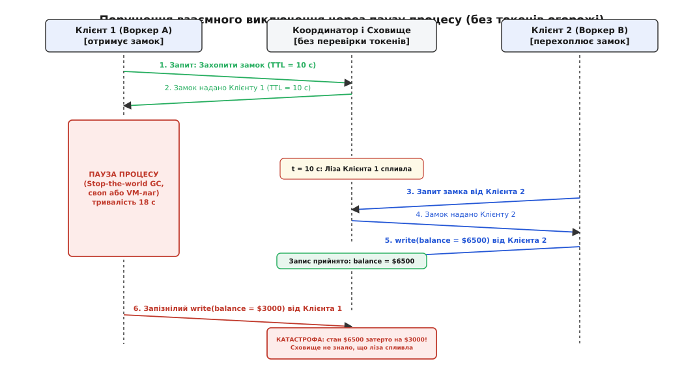
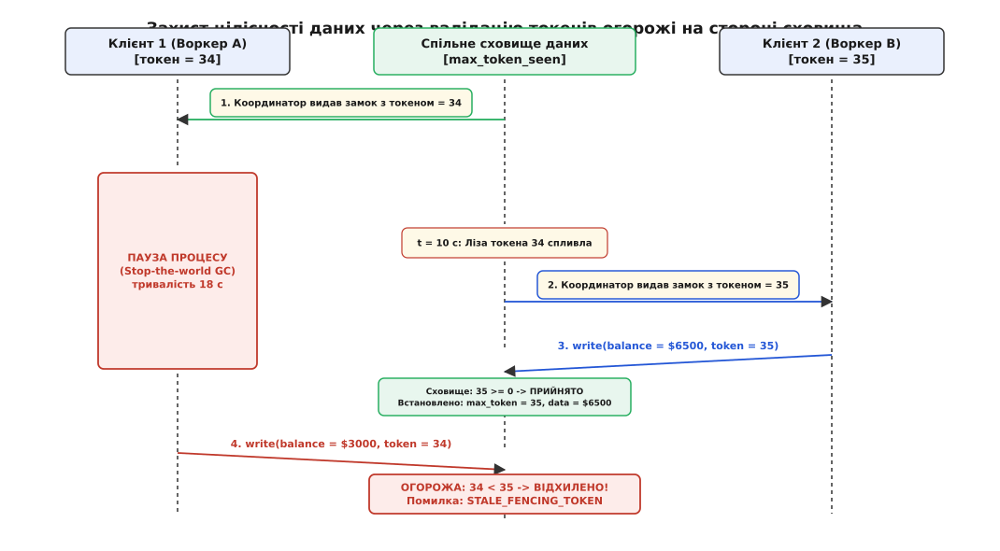
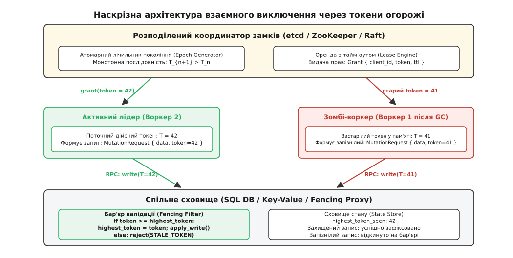

# Fencing-токени розподілених блокувань: наскрізний захист спільного стану від зомбі-процесів

<preknowlist>
- [Омани розподілених обчислень](topic:sf-distributed/distributed-fallacies) — асинхронні мережі затримують пакети, а вузли зазнають пауз без попередження; часткова відмова є нормою обчислень.
- [Розподілені замки й лізи](topic:sf-distributed/distributed-locks) — блокування на основі оренди захищають від дедлоків при збоях, але не гарантують безпеку під час асинхронних пауз клієнта.
- [Failover і розщеплення мозку](topic:sf-distributed/split-brain) — поділ кластера й раптові затримки породжують ситуацію двох активних лідерів одночасно.
- [Ідемпотентність](topic:sf-distributed/idempotency) — повторне надсилання запитів через мережеві збої не повинно пошкоджувати фінальний стан.
</preknowlist>

Розподілений сервіс обробки фінансових операцій отримує завдання списати $2000 з рахунку клієнта #48291 із поточним балансом $5000. Воркер A звертається до координатора замків, успішно отримує ексклюзивне блокування на цей рахунок строком на 10 секунд і починає підготовку транзакції. У цей самий момент віртуальна машина Воркера A зазнає 18-секундної паузи: процес зависає через фазу Stop-the-World збирача сміття у віртуальній машині або примусову міграцію гіпервізором на інший фізичний хост. На 10-й секунді координатор замків фіксує спливання лізи й вважає ресурс вільним. На 11-й секунді Воркер B перехоплює замок, зчитує баланс $5000, успішно зараховує поповнення на $1500 і записує в базу даних нову суму $6500. На 18-й секунді Воркер A нарешті прокидається: його локальний потік не підозрює, що минув час, обчислює залишок як $5000 − $2000 = $3000 і відправляє запис у базу даних. База даних беззастережно приймає запит і затирає баланс $6500 значенням $3000. Користувач втратив $3500 через класичну асинхронну затримку, якій розподілений замок сам по собі не зміг завадити.

## Анатомія пастки: чому клієнт ніколи не знає свого справжнього стану

Усі системи розподіленого блокування — від ZooKeeper та etcd до Consul і Redis — надають взаємне виключення через механізм тимчасової оренди ([лізи](topic:sf-distributed/distributed-locks)). Ліза гарантує життєздатність (англ. *liveness*): якщо власник замка раптово знеструмлений або знищений апаратним збоєм, замок не зависає навічно, а автоматично звільняється після вичерпання інтервалу оренди `TTL`.

Проте ліза не здатна самотужки забезпечити безпеку (англ. *safety*). Причина криється у фундаментальній властивості асинхронних розподілених систем: між моментом, коли клієнт перевіряє правомірність свого замка, і моментом, коли його запит фізично виконується у спільному сховищі, лежить неконтрольований часовий розрив.

```text
Клієнт:  [Перевірка лізи: OK] ──(непередбачувана затримка Δt)──> [Виконання запису в БД]
                                 ▲
                     Пауза JVM / своп / черга TCP
                     Ліза встигає спливти на координаторі!
```

Навіть якщо розробник спробує реалізувати локальну перевірку таймера перед кожним зверненням до бази:
```text
if monotonic_now() < lease_deadline:
    storage.write(data)
```
цей код залишається вразливим. Затримка може виникнути:
1. **Між інструкцією перевірки й відправкою сокета**: потік витісняється планувальником ОС (*context switch*) або потрапляє в паузу збирача сміття саме між перевіркою `if` та викликом `write()`.
2. **У черзі операційної системи**: вихідний буфер TCP блокується через перевантаження мережевого інтерфейсу або заповнення вікна приймача.
3. **У самій мережі**: комутатори перенаправляють пакети повільним маршрутом або буферизують їх через сплеск трафіку (*bufferbloat*).
4. **У черзі вхідних запитів сервера бази даних**: пакет доставлено вчасно, але він провів 15 секунд у черзі пулу з'єднань перед тим, як потік СКБД дістався до його виконання.


*Сценарій руйнування даних без токенів огорожі: Воркер A отримує лізу на 10 с, зависає в GC-паузі на 18 с; після спливання лізи Воркер B записує коректний стан $6500, але прокинутий Воркер A запізнілим записом затирає його старим значенням $3000.*

Клієнт, який пережив асинхронну паузу, перетворюється на **процес-зомбі** (англ. *zombie process* або *stale client*): він абсолютно переконаний, що діє законно, володіє ресурсом і виконує коректну мутацію, тоді як координатор уже віддав цей самий ресурс іншому вузлу.

Звідси випливає фундаментальний висновок, сформульований ще у класичному наскрізному принципі проектування систем (англ. *End-to-End Argument*, Сальцер, Рід, Кларк, 1984): **взаємне виключення неможливо забезпечити виключно на стороні клієнта чи координатора замків. Спільний ресурс, стан якого модифікується, зобов'язаний бути активним учасником протоколу валідації**.

## Принцип огорожі: монотонні токени як захисний бар'єр

Для усунення цієї вразливості координатор блокувань і спільне сховище об'єднують у протокол **токенів огорожі** (англ. *fencing tokens*, від англійського *fence* — «огорожа, захисний бар'єр» та *token* — «жетон, посвідчення права»).

Ідея полягає в тому, що кожна успішна видача або подовження замка супроводжується генерацією монотонно зростаючого 64-бітного цілого числа — **токену епохи** (англ. *epoch number* / *sequencer*). Кожен наступний власник замка гарантовано отримує токен, строго більший за всі токени, видані будь-коли в минулому:

```text
T[n+1] > T[n]   (строга монотонність)
```

Протокол спирається на три жорсткі правила взаємодії між трьома сторонами:

```
┌────────────────────────┐
│ Координатор блокувань  │ ── 1. Захоплення замка: видає Token = 35 ──┐
│ (etcd / ZooKeeper)     │                                            │
└────────────────────────┘                                            ▼
                                                             ┌─────────────────┐
                                                             │ Клієнт (Воркер) │
                                                             └─────────────────┘
                                                                      │
                                    2. Запит: write(data, token = 35) │
                                                                      ▼
                                                         ┌────────────────────────┐
                                                         │   Спільне сховище      │
                                                         │ (SQL / NoSQL / S3 Proxy)│
                                                         │ [max_token_seen = 34]  │
                                                         └────────────────────────┘
                                                         3. Перевірка: 35 > 34 -> OK
                                                            Встановити max_token = 35
```

### 1. Поведінка координатора замків
Координатор підтримує персистентний атомарний лічильник покоління. Щоразу, коли будь-який клієнт звертається за отриманням або продовженням замка, координатор виконує атомарний інкремент:
```text
token = ++counter
grant_lock(client_id, resource, token, ttl)
```
Токен повертається клієнту разом із підтвердженням блокування.

### 2. Поведінка клієнта
Клієнт зобов'язаний передавати отриманий токен огорожі як обов'язковий атрибут у кожному виклику до цільового сховища або сервісу:
```text
storage.mutate_resource(resource_id, payload, fencing_token)
```

### 3. Поведінка спільного сховища
Сховище зберігає у метаданих кожного ресурсу значення найбільшого токена, який воно коли-небудь успішно обробило: `highest_token_seen`.

Під час отримання запиту на запис із токеном `T_req` сховище виконує атомарну перевірку:
* Якщо `T_req >= highest_token_seen`: сховище приймає запис, фіксує нові дані й оновлює метадані `highest_token_seen = T_req`.
* Якщо `T_req < highest_token_seen`: сховище **негайно відхиляє запит** і повертає помилку `STALE_FENCING_TOKEN`.


*Механізм огорожі: сховище фіксує токен 35 від Воркера B, а запізнілий запис із токеном 34 від Воркера A негайно відхиляє через умову 34 < 35, зберігаючи консистентність даних.*

Завдяки цьому простому інваріанту система стає математично несприйнятливою до будь-яких затримок клієнтів:
1. Воркер A отримав замок із токеном `34` і заснув.
2. Воркер B перехопив замок, отримав токен `35`, виконав запис у сховище. Сховище встановило `highest_token_seen = 35`.
3. Воркер A прокинувся через годину і надіслав запит із токеном `34`.
4. Сховище порівнює `34 < 35` і блокує запис. Стан, сформований Воркером B, залишається неушкодженим.

Детальний аналіз того, як ця концепція зародилася у системі Google Chubby, розгорнулася у знаменитій дискусії щодо безпеки алгоритму Redlock і трансформувалася у промисловий стандарт, наведено в [історичному нарисі еволюції секвенсерів та епох](topic:sf-distributed/fencing-tokens/hist-sequencers-and-epochs.md).

## Інтеграція огорожі в реальні системи зберігання

Головна практична складність токенів огорожі полягає в тому, що цільове сховище має підтримувати умовні модифікації (*conditional writes*). Розглянемо патерни інтеграції для різних класів сховищ.

### 1. Реляційні бази даних (SQL)
У реляційних базах даних захист реалізується через оптимістичне блокування за стовпцем версії токена в межах атомарної транзакції:

```sql
-- Таблиця з підтримкою огорожі
CREATE TABLE bank_accounts (
    account_id   BIGINT PRIMARY KEY,
    balance      NUMERIC(18, 2) NOT NULL,
    fencing_token BIGINT NOT NULL DEFAULT 0
);

-- Атомарний запис із валідацією токена
UPDATE bank_accounts
SET balance = 3000.00,
    fencing_token = 35
WHERE account_id = 48291
  AND fencing_token < 35;
```

Після виконання запиту додаток перевіряє кількість змінених рядків (`rows affected`):
* Якщо `rows_affected == 1`: оновлення успішне.
* Якщо `rows_affected == 0`: запис відхилено, оскільки база вже бачила токен `35` або вищий. Клієнт розуміє, що втратив замок, скасовує локальну роботу й повертає помилку конкурентного конфлікту.

### 2. Документні та NoSQL сховища (DynamoDB / MongoDB / Cassandra)
У распределених NoSQL базах умовні вирази перевіряються на рівні окремих документів чи рядків.

У Amazon DynamoDB це виглядає так:
```json
{
  "TableName": "BankAccounts",
  "Key": { "AccountId": { "N": "48291" } },
  "UpdateExpression": "SET Balance = :new_balance, FencingToken = :token",
  "ConditionExpression": "attribute_not_exists(FencingToken) OR FencingToken < :token",
  "ExpressionAttributeValues": {
    ":new_balance": { "N": "3000.00" },
    ":token": { "N": "35" }
  }
}
```
Якщо умова `ConditionExpression` не виконується, DynamoDB повертає виняток `ConditionalCheckFailedException`, сигналізуючи про відхилення застарілого токена.

### 3. Хмарні об'єктні сховища (S3, GCS, Azure Blob)
Традиційні об'єктні сховища API `PUT /bucket/key` тривалий час не підтримували числові порівняння метаданих. Тут застосовують два підходи:

1. **Умовні заголовки ETag (`If-Match`)**: під час взяття замка клієнт зчитує поточний `ETag` об'єкта. При записі він передає заголовок `If-Match: "<попередній_etag>"`. Якщо інший воркер уже оновив об'єкт, хмара повертає статус `412 Precondition Failed`.
2. **Шлюз огорожі (Fencing Proxy)**: архітектурний посередник, який розміщується перед об'єктним сховищем. Шлюз зберігає в пам'яті (або в транзакційній БД) таблицю пар `(object_key -> highest_token)` і виконує атомарну фільтрацію потоку запитів перед їх відправкою до S3.


*Архітектурні компоненти огорожі: генератор монотонних епох у сервісі блокувань, передача токена у кожному RPC-запиті та бар'єр валідації на вході до сховища стану.*

Повний перелік специфікацій протоколів, форматів gRPC/Protobuf повідомлень та SQL-схем описано у [довіднику інтерфейсів контрактів огорожі](topic:sf-distributed/fencing-tokens/api-fencing-contracts.md).

## Епохи та номери поколінь у протоколах розподілених систем

Концепція токенів огорожі настільки універсальна, що лежить в основі практично кожного надійного протоколу розподілених обчислень, змінюючи лише назву:

| Технологія / Протокол | Назва токена огорожі | Механізм захисту |
| :--- | :--- | :--- |
| **Apache Kafka** | `producer_epoch` / `leader_epoch` | Брокери відхиляють повідомлення від старих лідерів розділів або транзакційних продюсерів, що пережили GC-паузу. |
| **Raft Consensus** | `term` (номер терму) | Вузли ігнорують запити `AppendEntries` від колишнього лідера, чий терм менший за поточний терм кворуму. |
| **Multi-Paxos** | `ballot_number` (номер голосування) | Акцептори відхиляють фазу прийняття пропозиції, якщо бачили вищий номер бюлетеня від іншого пропозера. |
| **Apache ZooKeeper** | `zxid` (64-бітне число) | Старші 32 біти є номером епохи лідера (`epoch`), що блокує зміни від старих знеструмлених лідерів. |
| **NVMe-oF / SAN** | `Persistent Reservation Key` | Апаратний контролер дискового масиву скидає команди запису від хостів зі застарілим ключем реєстрації. |

В усіх цих системах діє той самий інваріант: **номер покоління є строго монотонним, а вузол, який виконує мутацію, зобов'язаний відхиляти будь-які повідомлення з минулих поколінь**.

## Підводні камені, крайові випадки та ціна огорожі

Хоча концепція токенів огорожі виглядає простою, при її реалізації в промислових системах інженери стикаються з низкою неочевидних пасток.

### 1. Втрата монотонності під час аварії координатора
Якщо координатор замків генерує токени за допомогою звичайного лічильника в оперативній пам'яті, перезавантаження сервера призведе до скидання лічильника:
```text
До перезапуску: видано токени 101, 102, 103...
Аварійний рестарт координатора: лічильник скинуто на 0!
Після рестарту: видано токен 1.
Сховище бачило max_token = 103 і назавжди заблокує всі нові записи!
```
**Правило**: генератор токенів зобов'язаний спиратися на персистентний розподілений журнал консенсусу (Raft log або zxid). Номер епохи повинен або зберігатися на диску перед видачею, або формуватися як складене число: `(cluster_epoch << 32) | local_counter`, де `cluster_epoch` інкрементується через кворум під час кожного переобрання лідера.

### 2. Мутація кількох гетерогенних ресурсів
Якщо операція воркера вимагає запису одночасно в базу даних SQL, відправки повідомлення в RabbitMQ і виклику стороннього платіжного API Stripe:
* База даних SQL підтримує умовний запис і захищена токеном.
* Черга повідомлень RabbitMQ та зовнішній API Stripe поняття про токени огорожі не мають і виконають операцію повторно.

У такому разі огорожа бази даних не рятує від побічних ефектів у зовнішніх системах. Для захисту гетерогенних середовищ застосовують патерн [Transactional Outbox](topic:sf-distributed/outbox-pattern): воркер виконує запис виключно в локальну таблицю вихідних повідомлень бази даних із токеном огорожі. Окремий ретранслятор зчитує зафіксовані рядки й відправляє їх у зовнішні API за принципом гарантованої доставки з [ідемпотентністю](topic:sf-distributed/idempotency).

### 3. Розрізнення застарілого запису та мережевого повтору (Idempotency vs Fencing)
Токен огорожі захищає від конфліктів між **різними** поколіннями замка (`T_old < T_new`). Проте він не вирішує проблему дублювання пакетів у межах **одного й того самого** покоління:
```text
Воркер (T = 35) ───[ write(balance = $3000, T = 35) ]───> Сховище (успіх)
                 ▲
          Мережевий таймаут клієнта
                 ▼
Воркер (T = 35) ───[ write(balance = $3000, T = 35) ]───> Сховище (дублікат!)
```
Якщо операція не є абсолютно ідемпотентною (наприклад, відносне списання `balance = balance - 2000` замість абсолютного встановлення значення), повторний пакет з тим самим токеном `35` буде прийнятий сховищем, бо `35 >= 35`, і призведе до подвійного списання грошей.

**Правило**: токен огорожі слід комбінувати з унікальним ідентифікатором запиту:
```sql
UPDATE accounts 
SET balance = balance - 2000,
    fencing_token = 35,
    last_request_id = 'req-abc-123'
WHERE account_id = 48291
  AND fencing_token <= 35
  AND last_request_id != 'req-abc-123';
```

### 4. Ризик переповнення розрядності лічильника
Чи може 64-бітний лічильник токенів переповнитися під час тривалої роботи системи?

Обчислимо граничний час роботи безперервної системи за умов надзвичайно інтенсивного навантаження — 1 000 000 захоплень замків щосекунди:

```text
T_overflow
= 2⁶⁴ ÷ (10⁶ зап/с · 3600 с/год · 24 год/день · 365.25 днів/рік)  [місткість 64 бітів поділена на річне навантаження]
= 18 446 744 073 709 551 616 ÷ 31 557 600 000 000                 [обчислення 2⁶⁴ та кількості операцій на рік]
≈ 584 542 роки                                                    [час до вичерпання простору номерів]
```

Використання 64-бітного беззнакового цілого (`uint64_t`) повністю знімає ризик переповнення на весь час існування будь-якого програмного комплексу. Навпаки, використання 32-бітного лічильника (`uint32_t`) при такій швидкості призведе до переповнення (`2³² ≈ 4.29 · 10⁹`) всього за **71 хвилину**, що спровокує катастрофічну відмову всієї системи валідації.

Повнофункціональну реалізацію координатора, клієнта зі сторожовим таймером та захищеного сховища на мовах C та C++ наведено у [практичному проекті розподіленої огорожі](topic:sf-distributed/fencing-tokens/proj-fencing-storage-engine.md).

## Метрики та експлуатаційна діагностика

Надійна експлуатація механізму огорожі вимагає безперервного моніторингу телеметрії. Будь-яке спрацьовування захисного бар'єра має фіксуватися як інцидент, оскільки воно свідчить про наявність асинхронних збоїв або деградації воркерів у кластері.

```
┌────────────────────────────────────────────────────────────────────────┐
│                        ПАНЕЛЬ МОНІТОРИНГУ ОГОРОЖІ                      │
├────────────────────────────────┬───────────────────────────────────────┤
│ Метрика                        │ Нормальний стан / Тривога             │
├────────────────────────────────┼───────────────────────────────────────┤
│ fencing_stale_rejections_total │ Норма: 0.                             │
│                                │ > 0: Зомбі-воркер намагався пошкодити │
│                                │ стан! Огорожа врятувала дані.         │
├────────────────────────────────┼───────────────────────────────────────┤
│ worker_gc_pause_seconds        │ > TTL / 2: Ризик випаровування лізи  │
│                                │ до завершення обробки завдання.       │
├────────────────────────────────┼───────────────────────────────────────┤
│ lock_held_duration_seconds     │ Наближення до TTL лізи: потрібна      │
│                                │ оптимізація розміру транзакції.       │
└────────────────────────────────┴───────────────────────────────────────┘
```

> 🔧 **Навіщо це на практиці.**
> Лічильник `fencing_stale_rejections_total` є головним індикатором ефективності розподіленої огорожі. Якщо цей лічильник показує ненульове значення, система не «зламалася» — навпаки, захисний бар'єр успішно відбив атаку запізнілого зомбі-процесу і врятував бізнес від прихованого пошкодження бази даних. Проте кожен такий сплеск є приводом розслідувати стан вузла-відправника: перевірити тривалість пауз Stop-The-World JVM, профілі використання swap-простору або втрату пакетів на мережевих інтерфейсах.
