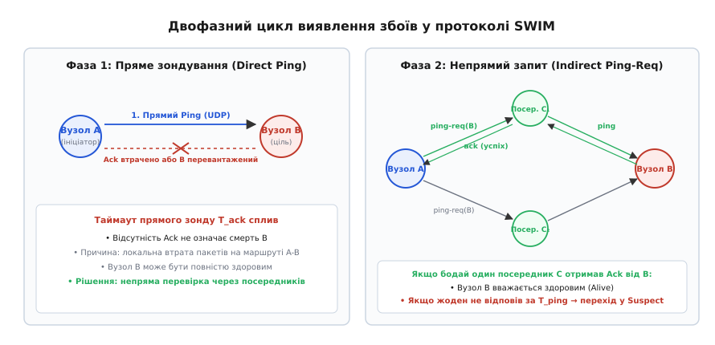
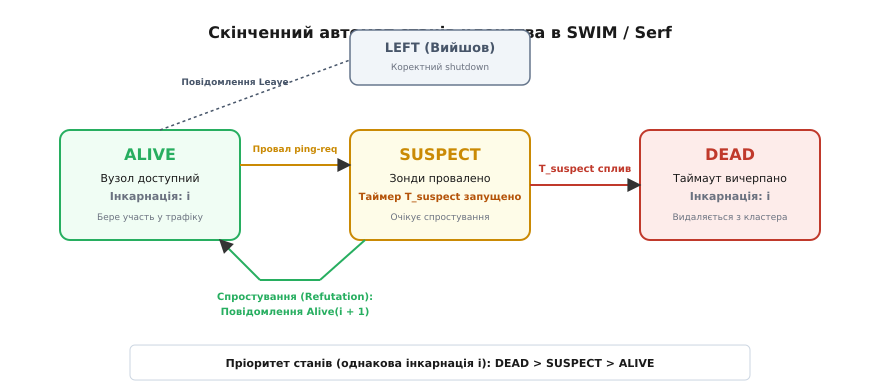
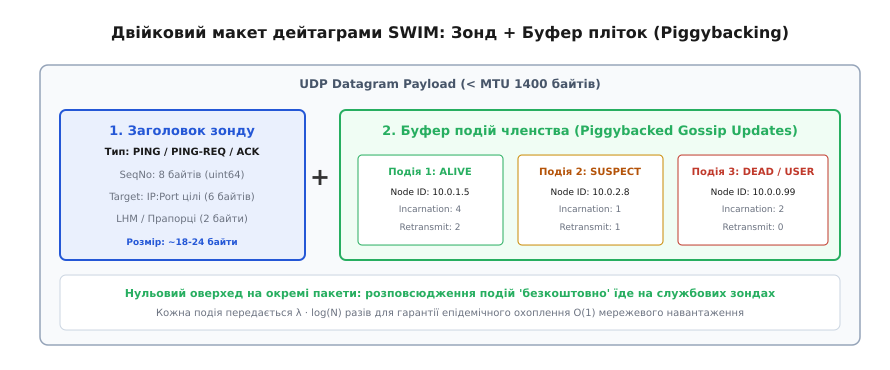
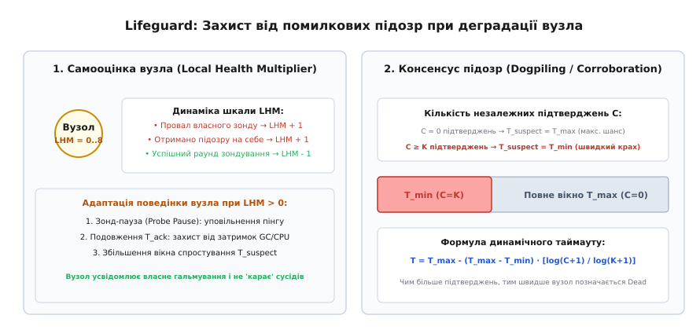

# Плітки й членство в кластері: протоколи SWIM, Lifeguard та епідемічне виявлення збоїв

<preknowlist>
- [Вісім оман розподілених обчислень](topic:sf-distributed/distributed-fallacies) — ненадійність мережевих каналів, ненульові затримки та наслідки часткових відмов.
- [Кінцева узгодженість на практиці](topic:sf-distributed/eventual-consistency) — модель збіжності реплік у часі без синхронного блокування.
- [Перевірки живості й готовності](topic:sf-distributed/health-checks) — механізми активного зондування, пульсу (heartbeat) та детектування збоїв.
- [Кворуми та безлідерна реплікація](topic:sf-distributed/quorum-and-leaderless) — топології збереження даних без виділеного майстра.
- [Виявлення сервісів](topic:sf-distributed/service-discovery) — реєстри адрес, реєстрація вузлів та балансування навантаження.
- [М'який стан](topic:sf-distributed/soft-state) — дані з обмеженим терміном життя, що потребують періодичного оновлення.
</preknowlist>

У розподіленому кластері з 5000 серверів кожен вузол повинен знати актуальний перелік усіх живих учасників для коректної маршрутизації RPC-запитів, шардингу даних та вибору реплік. Якщо реалізувати моніторинг через централізований координатор (наприклад, etcd чи ZooKeeper), на майстер-вузол щосекунди надходитиме 5000 UDP-пульсів (*heartbeats*). При зростанні масштабу до 50 000 серверів потік у 50 000 дейтаграм на секунду переповнює мережевий сокетний буфер ядра `SO_RCVBUF`, координатор починає масово губити пакети, помилково оголошує тисячі здорових вузлів мертвими та запускає катастрофічний шторм каскадних перевиборів і перебалансування даних.

Якщо ж відмовитися від координатора і змусити кожен сервер періодично опитувати кожного сусіда напряму (топологія повного зв'язку *All-to-All Mesh*), сумарний трафік у мережі зростає пропорційно квадрату кількості учасників як `N · (N - 1)`. Для кластера з 50 000 вузлів це генерує майже 2.5 мільярда пакетів щосекунди, що миттєво паралізує канальний рівень комутаторів стійок (*Top-of-Rack Switches*).

Для подолання цього глухого кута необхідний децентралізований протокол керування членством, у якому навантаження на процесор і мережу кожного окремого сервера залишається суворо постійним (`O(1)`), час виявлення аварії та поширення інформації про неї зростає лише логарифмічно (`O(log N)`), а локальні втрати окремих дейтаграм на нестабільних каналах не спричиняють хибних виключень здорових серверів.

Цю задачу вирішує сімейство протоколів **SWIM** (англ. *Scalable Weakly-consistent Infection-style Process Group Membership*) та його сучасне промислове розширення **Lifeguard**.

---

## Архітектура протоколу SWIM: розділення виявлення та поширення

Класичні алгоритми членства намагалися виконувати виявлення відмов (*Failure Detection*) та розповсюдження інформації (*Dissemination*) одним і тим самим механізмом широкомовного пульсу. Протокол SWIM, розроблений дослідниками Корнелльського університету (Абхінандан Дас, Індраніл Гупта, Ашіш Мотівала) у 2002 році, запропонував фундаментальне архітектурне розділення цих двох контурів:
1. **Контур виявлення збоїв** працює через детерміноване псевдовипадкове зондування з постійною кількістю повідомлень за раунд (`O(1)`).
2. **Контур розповсюдження оновлень** працює за епідемічним принципом поширення пліток (*gossip* або *infection-style*), упаковуючи події членства безпосередньо в службові пакети зондування без генерації додаткового мережевого трафіку.

```
+-------------------------------------------------------------------------------+
|                            ВУЗОЛ КЛАСТЕРА (SWIM)                              |
|                                                                               |
|  +-----------------------------+       +-----------------------------------+  |
|  |   1. Детектор відмов        |       |   2. Черга пліток (Dissemination) |  |
|  |   • Прямий Ping (T_ack)     |       |   • Події: Alive, Suspect, Dead   |  |
|  |   • Непрямий Ping-Req (k)   |       |   • Бюджет ретрансляцій O(log N)  |  |
|  +-----------------------------+       +-----------------------------------+  |
|                 │                                        │                    |
|                 ▼                                        ▼                    |
|  +-------------------------------------------------------------------------+  |
|  |   Пакування в одну UDP-дейтаграму (MTU < 1400B, Piggybacking)          |  |
|  +-------------------------------------------------------------------------+  |
+-------------------------------------------------------------------------------+
```

### Двофазний цикл зондування

Кожен вузол кластера підтримує локальний список усіх відомих учасників. Раз на період `T_probe` (типово 1 секунда) вузол виконує послідовність дій:

1. **Вибір цілі зондування.** Вузол обирає випадковий елемент зі свого списку членів. Щоб гарантувати, що кожен учасник кластера перевіряється з однаковою частотою, вибір здійснюється за алгоритмом випадкової перестановки: вузол перемішує список учасників і проходить його послідовно від початку до кінця, після чого перемішує знову.
2. **Пряме зондування (Direct Ping).** Вузол `A` надсилає дейтаграму `PING` обраному вузлу `B` через UDP і запускає таймер прямого очікування `T_ack` (типово 200 мс). Якщо протягом `T_ack` надходить дейтаграма `ACK`, раунд вважається успішним.
3. **Непряме зондування (Indirect Ping-Req).** Якщо таймер `T_ack` сплив, а відповідь не надійшла, вузол `A` не робить поспішного висновку про падіння `B`. Вузол `A` обирає `k` випадкових посередників `C₁, C₂, ..., C_k` (зазвичай `k = 3..5`) і надсилає кожному запит `PING_REQ(B)`.
4. **Ретрансляція через посередників.** Кожен посередник `C_i`, отримавши `PING_REQ(B)`, негайно надсилає власний прямий `PING` до вузла `B`. Якщо `B` відповідає посереднику дейтаграмою `ACK`, посередник форвардить цей `ACK` назад ініціатору `A`.


*Двофазний цикл виявлення збоїв: прямий зонд Ping від вузла A до B зазнає невдачі через локальну втрату пакетів, після чого A залучає k випадкових посередників C₁ і C₂ для незалежної перевірки доступності B.*

Цей двофазний механізм вирішує фундаментальну проблему асиметричної втрати зв'язку та локальних мережевих колізій. Якщо між вузлом `A` та `B` виникла локальна втрата пакетів через перевантажений мережевий інтерфейс або збій конкретного маршрутизатора, але сам вузол `B` абсолютно здоровий і доступний з решти кластера, непряма перевірка через посередників поверне успішний `ACK`.

Суворе математичне обґрунтування того, чому непрямий зонд знижує ймовірність хибних спрацьовувань детектора у сотні разів за наявності мережевих втрат, наведено у вставці [Математичне виведення ймовірності хибних детекцій та оцінка швидкості збіжності](topic:sf-distributed/gossip-membership/math-swim-convergence.md).

---

## Механізм підозри та лічильники інкарнацій (Suspicion Subprotocol)

У класичній моделі відмов при відсутності відповіді від цілі та від усіх `k` посередників вузол `B` мав би негайно оголошуватися мертвим (`DEAD`). Однак у реальних дата-центрах сервери стикаються з тимчасовими затримками: тривалими паузами збирача сміття (GC pauses у Java або Go), короткочасним 100% навантаженням на процесор чи секундними затримками виділення пам'яті ядром ОС. Якщо оголошувати сервер мертвим через секундну затримку планувальника, кластер почне безперервно викидати й повертати назад здорові сервери, спричиняючи шторм реконфігурацій.

Для ліквідації цієї проблеми SWIM вводить проміжний стан **Підозрілий (SUSPECT)** та механізм спростування через **номери інкарнацій** (від лат. *incarnatio* — «втілення»).

```
                  +--------------------------+
                  |          ALIVE           |
                  |     (інкарнація: i)      |
                  +--------------------------+
                     │                    ▲
         Провал      │                    │  Спростування (Refutation):
         ping-req    │                    │  Повідомлення Alive(i + 1)
                     ▼                    │
                  +--------------------------+
                  |         SUSPECT          |
                  |     (інкарнація: i)      |
                  +--------------------------+
                     │
         Сплив таймер│
         T_suspect   │
                     ▼
                  +--------------------------+
                  |           DEAD           |
                  |     (інкарнація: i)      |
                  +--------------------------+
```


*Скінченний автомат станів: перехід з Alive у Suspect у разі провалу непрямих зондів, автоматичне спростування підозри за допомогою підвищення номера інкарнації та фінальний перехід у Dead після вичерпання таймауту.*

### Життєвий цикл стану Suspect

1. **Встановлення підозри.** Якщо прямий зонд та всі `k` посередників не змогли достукатися до вузла `B` протягом періоду `T_probe`, ініціатор `A` змінює локальний статус `B` на `SUSPECT(B, inc = i)` і запускає локальний таймер підозри `T_suspect`. Одночасно інформація `SUSPECT(B, inc = i)` додається до буфера пліток для розповсюдження по всьому кластеру.
2. **Спростування підозри (Refutation).** Оскільки плітка `SUSPECT(B, inc = i)` поширюється епідемічно, сам вузол `B` незабаром отримує цю звістку від одного зі своїх сусідів. Дізнавшись, що кластер вважає його несправним, вузол `B` спростовує це твердження: збільшує свій номер інкарнації `inc = i + 1`, формує повідомлення `ALIVE(B, inc = i + 1)` і розсилає його сусідам.
3. **Визнання смерті.** Якщо вузол `B` дійсно аварійно вимкнувся або повністю втратив живлення, він не зможе згенерувати спростування. Після спливання таймера `T_suspect` вузли перемножують стан `SUSPECT` у `DEAD` та видаляють `B` зі списку активних маршрутів.

### Матриця пріоритетів станів

Коли вузол отримує оновлення про іншого учасника, він зіставляє вхідний номер інкарнації з локальним. Конфлікти вирішуються за суворими правилами:

```
1. Більший номер інкарнації завжди перемагає менший (inc_new > inc_local → ПРИЙНЯТИ).
2. За однакового номера інкарнації (inc_new == inc_local) діє пріоритет:
   DEAD > SUSPECT > ALIVE
```

Завдяки цьому правилу повідомлення `ALIVE` з інкарнацією `i` не може зняти стан `SUSPECT` з тією самою інкарнацією `i` — для зняття підозри сам вузол зобов'язаний монотонно збільшити інкарнацію до `i + 1`. Це запобігає зацикленню застарілих пліток у мережі.

Повний бінарний формат пакетів, структуру полів та контракт викликів описано у вставці [Специфікація протоколу SWIM та бінарний формат Memberlist](topic:sf-distributed/gossip-membership/api-swim-memberlist.md).

---

## Поширення методом «наїзду» (Piggybacking on probes)

Замість надсилання окремих широкомовних UDP-пакетів для кожної зміни топології, SWIM використовує техніку попутного пакування (англ. *piggybacking* — «їзда на чужій спині»).

Усі події кластера (`ALIVE`, `SUSPECT`, `DEAD`, `LEAVE`, а також прикладні користувацькі повідомлення) вміщуються до локальної черги пліток (*Broadcast Queue*). Коли протокольний таймер ініціює відправку чергового `PING`, `PING_REQ` або `ACK`, вузол витягує з черги кілька оновлень і дописує їх у хвіст дейтаграми, доки розмір пакета не досягне ліміту MTU (1400 байтів).


*Структура UDP-дейтаграми SWIM: службовий заголовок зонда об'єднано з масивом попутних пліток про членство, що забезпечує нульові додаткові витрати на окремі пакети оновлень.*

### Бюджет ретрансляцій

Щоб повідомлення не циркулювали в мережі вічно, кожна подія в черзі має лічильник допустимих повторних відправок `retransmits_left`. Згідно з теорією епідемічних алгоритмів, для гарантованого охоплення всіх `N` учасників кластера з імовірністю `1 - ε` кожен вузол має передати подію:

```
m = λ · ⌈log₂(N + 1)⌉
```

де `λ` — конфігураційний коефіцієнт (зазвичай `λ = 3..5`). Щойно лічильник досягає нуля, повідомлення видаляється з черги. Завдяки цьому мережевий трафік на вузол залишається суворо обмеженим константою `O(1)`, незалежно від того, скільки тисяч серверів працює в кластері.

---

## Розширення Lifeguard: самооцінка вузла та адаптивні таймаути

Хоча базовий протокол SWIM є високонадійним, на практиці він має слабке місце: коли окремий сервер потрапляє під екстремальне навантаження (наприклад, через довгу паузу JVM GC або затримку ядра ОС), він перестає вчасно надсилати `ACK` на вхідні пінги і водночас не встигає вчасно зондувати сусідів. В результаті деградований вузол починає хибно підозрювати здорових сусідів і сам стає об'єктом підозр з боку решти кластера.

У 2017–2018 роках інженери компанії HashiCorp (Армон Дадґар, Раян Убер) розробили розширення **Lifeguard** (впроваджене в бібліотеку `memberlist`, на якій базуються Consul та Nomad). Lifeguard додає два ключові механізми:

### 1. Локальний множник здоров'я (Local Health Multiplier, LHM)
Кожен вузол кластера веде динамічну оцінку власної деградації у вигляді цілого числа `LHM ∈ [0, 8]`:
* Якщо власний раунд зондування завершується таймаутом або якщо вузол отримує повідомлення про підозру на свою адресу (симптом того, що він не встиг відповісти на вхідний пінг), лічильник зростає: `LHM = min(8, LHM + 1)`.
* Якщо черговий раунд зондування пройшов успішно, лічильник зменшується: `LHM = max(0, LHM - 1)`.

Коли `LHM > 0`, вузол «розуміє», що джерелом затримок є він сам, і автоматично адаптує свою поведінку:
* **Зонд-пауза (Probe Pause):** збільшує інтервал між вихідними пінгами (`T_probe · (1 + LHM)`), щоб знизити навантаження на локальний планувальник.
* **Подовження очікування (Probe Timeout Elongation):** дає сусідам більше часу на відповідь (`T_ack · (1 + LHM)`), перш ніж запускати непрямий `PING_REQ`.
* **Розширення вікна спростування:** збільшує локальний таймер `T_suspect`, даючи сусідам максимальний шанс вийти з підозри.


*Механізм Lifeguard: ліворуч — динаміка шкали LHM при внутрішніх затримках вузла; праворуч — динамічне скорочення вікна підозри T_suspect у міру надходження незалежних підтверджень збою (dogpiling).*

### 2. Консенсус підозр (Dogpiling / Corroboration)
У базовому SWIM таймаут підозри є фіксованим. Lifeguard робить його динамічним:
* Якщо підозра виникла лише в одного вузла (`C = 0` підтверджень), таймер встановлюється у максимальне значення `T_max` (наприклад, 25–30 секунд). Це дає здоровому вузлу з довгою паузою GC достатньо часу для відновлення та генерації спростування.
* Якщо кілька незалежних вузлів підтверджують недоступність тієї самої цілі (`C ≥ K`, де `K = 3..4`), вікно скорочується за логарифмічною кривою до мінімуму `T_min` (1–2 секунди). Справжня аварія сервера детектується майже миттєво.

---

## Життєвий цикл кластера: Join, Graceful Leave та Anti-Entropy Repair

```
+-------------------------------------------------------------------------------+
|                       ЖИТТЄВИЙ ЦИКЛ УЧАСНИКА КЛАСТЕРА                         |
|                                                                               |
|  1. ПІДКЛЮЧЕННЯ (Bootstrap):                                                  |
|     Новий вузол надсилає Ping на адресу відомого Seed-сервера                 |
|     ──► Вузол додається в таблицю з інкарнацією 0 і поширюється плітками      |
|                                                                               |
|  2. ШТАТНА РОБОТА:                                                            |
|     Періодичне пряме та непряме зондування O(1) + обмін буфером пліток        |
|                                                                               |
|  3. ПЛАНОВИЙ ВИХІД (Graceful Leave):                                          |
|     Вузол розсилає подію LEAVE ──► Миттєве видалення без таймауту підозри     |
|                                                                               |
|  4. АВАРІЙНИЙ КРАХ (Crash / Power Loss):                                      |
|     Провал зондів ──► Стан SUSPECT ──► Таймаут ──► Стан DEAD ──► Очищення     |
+-------------------------------------------------------------------------------+
```

### Підключення нових вузлів (Bootstrap)
Для вступу до кластера новому серверу не потрібен центральний реєстр — достатньо знати IP-адресу бодай одного наявного учасника (так званого сід-вузла, або *seed node*). Новий вузол надсилає сід-серверу стандартний `PING` із власними координатами. Сід-вузол додає новачка до своєї таблиці зі станом `ALIVE(inc = 0)`, і вже за `O(log N)` раундів епідемічний буфер доносить інформацію про нового учасника до кожного сервера в дата-центрі.

### Плановий вихід (Graceful Leave) проти аварійного краху
Коли сервер зупиняється на планове обслуговування, він генерує спеціальне повідомлення `LEAVE` з найвищим пріоритетом. Отримавши `LEAVE`, інші учасники кластера негайно маркують сервер як такий, що вийшов, без запуску тривалого таймера підозри `T_suspect`. Це дозволяє виконувати розгортання нових версій (*rolling updates*) без затримок у маршрутизації.

### Повна синхронізація через TCP (Anti-Entropy Full-Sync)
Хоча передача пліток через UDP є надзвичайно швидкою, екстремальні втрати пакетів або короткочасні розділення мережі (*network partitions*) можуть призвести до того, що окремі вузли пропустять серію оновлень.

Для гарантії кінцевої узгодженості кожен вузол раз на 30–60 секунд обирає одного випадкового партнера і відкриває з ним надійне TCP-з'єднання для повного обміну станами членства (Anti-Entropy Repair). Учасники звіряють інкарнації та додають усі відсутні записи, що гарантує 100% самозцілення кластера після ліквідації мережевих розривів.

Робочу реалізацію вузла SWIM мовами C та C++ з неблокуючим вводом-виводом і підтримкою інкарнацій наведено у вставці [Реалізація децентралізованого вузла SWIM та буфера пліток](topic:sf-distributed/gossip-membership/proj-swim-node.md).

---

> 🔧 **Навіщо це в реальній розробці.**
> 
> У сучасній хмарній інфраструктурі протоколи сімейства SWIM є стандартом де-факто для побудови відмовостійких систем:
> 
> 1. **HashiCorp Consul та Serf:** Бібліотека `memberlist` реалізує протокол SWIM з розширеннями Lifeguard, забезпечуючи моніторинг десятків тисяч мікросервісів, динамічну реєстрацію в DNS та автоматичне оновлення апстрімів у балансувальниках Envoy та Nginx.
> 2. **Apache Cassandra:** Використовує власний епідемічний протокол `Gossiper` для узгодження топології розбиття хеш-кільця токенів та виявлення недоступних реплік без участі центрального майстра.
> 3. **Amazon Dynamo та ScyllaDB:** Застосовують плітки для динамічного масштабування сховища, визначення локації реплік за стійками дата-центру (*Rack Awareness*) та координації відновлення даних.
