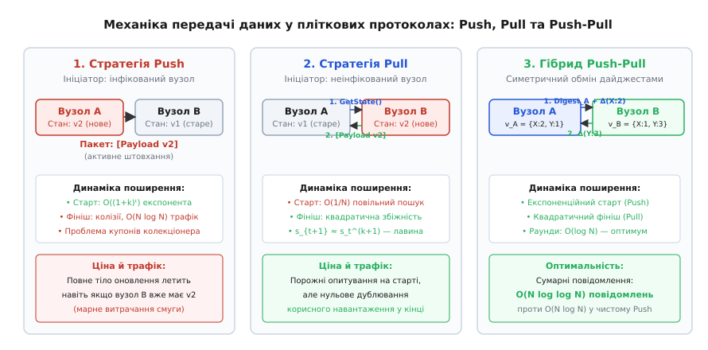
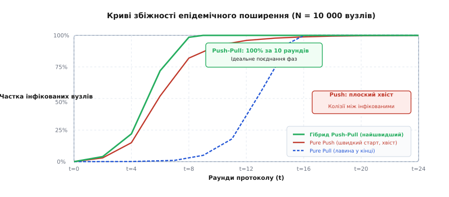
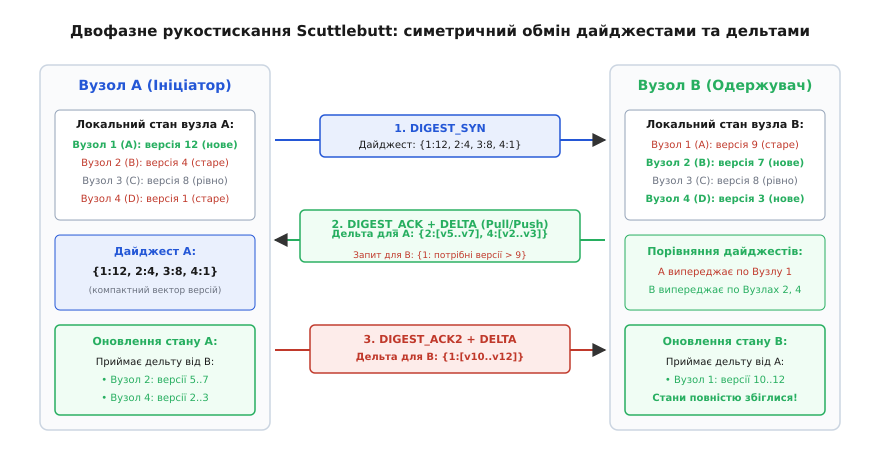

# Стратегії поширення пліток: Push, Pull та гібридний Push-Pull

<preknowlist>
- [Вісім оман розподілених обчислень](topic:sf-distributed/distributed-fallacies) — ненадійність мережевих каналів, ненульові затримки та наслідки часткових відмов.
- [Кінцева узгодженість на практиці](topic:sf-distributed/eventual-consistency) — модель збіжності реплік у часі без синхронного блокування.
- [Gossip-протоколи](topic:sf-distributed/gossip-protocols) — базові принципи епідемічного поширення інформації у великих кластерах.
- [Плітки й членство в кластері](topic:sf-distributed/gossip-membership) — децентралізоване виявлення збоїв (SWIM) та розповсюдження подій.
- [Анти-ентропія](topic:sf-distributed/anti-entropy-repair) — фонова синхронізація холодного стану через дерева Меркла та дайджести.
</preknowlist>

У розподіленому кластері з 10 000 серверів під керуванням безлідерної бази даних оператор змінює топологію шардингу або позначає стійку як виведену з експлуатації на вузлі `Node-1`. Щоб система працювала коректно, це оновлення має дійти до кожного з 9999 інших серверів. Якщо для доставки застосувати чисту стратегію активного проштовхування (**Push**), перші 8000 вузлів дізнаються про подію за лічені секунди. Проте коли 95% кластера вже оновлено, інфіковані сервери продовжують сліпо штурмувати один одного дубльованими пакетами. Пошук останніх 50 неінфікованих вузлів перетворюється на марне спалювання гігабайтів мережевого трафіку та розтягує фінішний хвіст затримки на хвилини.

Якщо ж спробувати уникнути цього шторму й змусити сервери лише пасивно підтягувати оновлення (**Pull**), виникає протилежний глухий кут. Кожен неінфікований вузол періодично опитує випадкового сусіда, але на старті ймовірність натрапити на єдиний оновлений `Node-1` становить мізерні `1 / 10 000`. Кластер зависає в тривалій «холодній» фазі, де хвилинами не відбувається жодного помітного прогресу, доки випадкова ланцюгова реакція нарешті не зрушить процес із мертвої точки.

Ця фундаментальна асиметрія — стрімкий старт і колапс фінішу в Push проти мертвого старту й лавиноподібного фінішу в Pull — формує головний компроміс у проєктуванні сучасних децентралізованих систем. Єдиним математично оптимальним виходом із цього протиріччя є симетричний протокол **Push-Pull**, який об'єднує переваги обох фаз і скорочує загальну кількість повідомлень у кластері до суворої теоретичної межі `O(N · log log N)`.

---

## Анатомія епідемічного обміну: напрям руху даних та ціна помилки

В основі будь-якого епідемічного протоколу лежить періодичний випадковий вибір партнерів: кожен вузол раз на період `T_gossip` (зазвичай 200–1000 мс) обирає `k` випадкових серверів зі свого списку відомих учасників. Проте те, *хто саме* надсилає корисне навантаження і *що саме* міститься в дейтаграмі, визначає одну з трьох базових парадигм:

```
+-----------------------------------------------------------------------------------+
| 1. Pure Push (Rumor Mongering / Штовхання):                                       |
|    • Ініціатор: Вузол, що володіє новим станом (State > 0).                       |
|    • Повідомлення: [Payload: повний стан або дельта].                             |
|    • Напрямок даних: Від ініціатора -> до випадкового партнера.                  |
|    • Поведінка одержувача: Оновлює локальний стан, якщо версія свіжіша.           |
+-----------------------------------------------------------------------------------+
                                       ▲
                                       │ протилежні підходи
                                       ▼
+-----------------------------------------------------------------------------------+
| 2. Pure Pull (Пасивне витягування):                                               |
|    • Ініціатор: Будь-який вузол, що шукає оновлення.                              |
|    • Повідомлення 1 (Запит): [GetState: мій поточний номер версії].                |
|    • Повідомлення 2 (Відповідь): [Payload: свіжіші дані, якщо вони є у партнера]. |
|    • Напрямок даних: Від обраного партнера -> до ініціатора.                      |
+-----------------------------------------------------------------------------------+
                                       ▲
                                       │ синергетичний синтез
                                       ▼
+-----------------------------------------------------------------------------------+
| 3. Hybrid Push-Pull (Симетрична реконсиляція / Scuttlebutt):                      |
|    • Ініціатор: Будь-який вузол.                                                  |
|    • Крок 1 (Syn): Ініціатор надсилає компактний дайджест версій.                 |
|    • Крок 2 (Ack): Партнер відповідає дельтою для ініціатора + власним дайджестом.|
|    • Крок 3 (Ack2): Ініціатор надсилає дельту для партнера.                       |
+-----------------------------------------------------------------------------------+
```


*Механізми передачі в епідемічних протоколах: Push активно штовхає повні дані від інфікованого до сприйнятливого; Pull витягує дані за запитом; симетричний Push-Pull обмінюється компактними дайджестами та передає дельти в обох напрямках.*

Вибір між цими схемами визначає не просто швидкість оновлення конфігурації, а фізичне виживання мережевого стека під час пікових навантажень.

Детальний історичний шлях відкриття цих механізмів — від розробок Xerox PARC для служби Clearinghouse у 1987 році до сучасних алгоритмів — розглянуто у вставці [Історія епідемічних алгоритмів: від Clearinghouse у Xerox PARC до Scuttlebutt та Cassandra](topic:sf-distributed/gossip-pull-vs-push/hist-epidemic-spread.md).

---

## Стратегія Push (Rumor Mongering): експоненційний старт та пастка фінішу

Стратегія Push (від англ. *push* — штовхати) є класичною моделлю поширення чуток (*Rumor Mongering*). Коли на вузлі `A` виникає мутація стану, вузол переходить у стан «інфікованого» (*infected*) і починає активне бомбардування кластера.

### Рання фаза: експоненційний вибух

На початковому етапі, коли практично всі вузли є сприйнятливими (*susceptible*, тобто ще не знають новини), кожен контакт інфікованого вузла потрапляє в «незайману» ціль. Якщо коефіцієнт розгалуження `k = 2`, то в раунді `t = 0` інфіковано 1 вузол, у раунді `t = 1` — уже 3 вузли, у раунді `t = 2` — 9 вузлів.

Кількість інфікованих вузлів подвоюється або потроюється на кожному кроці:
```
I_{t+1} ≈ I_t · (1 + k)
```

Завдяки цьому за перші `t = O(log N)` раундів оновлення охоплює левову частку кластера (80–90%).

### Пізня фаза: проблема колекціонера купонів

Катастрофа чистого Push настає тоді, коли частка інфікованих вузлів `p_t` перевищує 90%. Інфіковані вузли продовжують обирати випадкових партнерів, але тепер імовірність того, що випадково обраний партнер уже має це оновлення, становить `p_t ≈ 0.95`.

Виникає класична ймовірнісна **проблема колекціонера купонів** (*Coupon Collector's Problem*):
- Інфіковані вузли масово надсилають дублікати оновлень іншим уже інфікованим вузлам.
- Корисний ефект кожного надісланого пакета стрімко падає до нуля.
- Ймовірність уникнути вибору для останніх неінфікованих вузлів спадає суто лінійно: `s_{t+1} ≈ s_t · e^{-k}`.

```
Раунд t=8:  90% інфіковано -> 90% пакетів передають марні дублікати.
Раунд t=12: 99% інфіковано -> 99% пакетів є сміттєвим трафіком.
Раунд t=18: 99.9% інфіковано -> 99.9% трафіку спалюється даремно заради останніх одиниць серверів.
```

Якщо система намагається обмежити кількість раундів життя чутки (наприклад, зупиняти Push після `B` раундів або за правилом зворотного зв'язку `1/k`), протокол отримує **бімодальний розподіл доставки**: з ненульовою ймовірністю частина вузлів у кластері ніколи не отримає це оновлення і назавжди залишиться з застарілими даними.

Для гарантованого покриття 100% вузлів чистий Push змушений згенерувати сумарно `O(N · log N)` повідомлень.


*Динаміка поширення оновлення в кластері з 10 000 вузлів: чистий Push має швидкий старт, але плоский фінішний хвіст; чистий Pull має тривалу затримку запалювання, але миттєвий фініш; гібридний Push-Pull досягає 100% узгодженості за мінімальну кількість раундів.*

---

## Стратегія Pull: холодне запалювання та квадратична лавина фінішу

Стратегія Pull (від англ. *pull* — тягнути) працює з точністю до навпаки. Вузол не кричить у мережу про свої зміни, а навпаки: кожен сервер періодично сам звертається до випадкових сусідів із запитанням: «Яка у вас остання версія?».

### Рання фаза: параліч холодного старту

Уявімо кластер із `N = 10 000` серверів, де оновлення щойно з'явилося на сервері `Node-1`. Усі інші 9999 серверів є неінфікованими і щосекунди надсилають запити `GetState()` до випадкових сусідів.

Ймовірність того, що конкретний сервер обере саме `Node-1`:
```
P = k / (N - 1) ≈ 2 / 10 000 = 0.0002 (0.02%)
```

Поки інформація є лише в одного або кількох вузлів, кластер генерує десятки тисяч порожніх запитів, не отримуючи жодних оновлень. Час до моменту, коли випадкова репліка нарешті підтягне дані і почне формуватися критична маса, становить `O(N / k)` раундів. У реальних системах це виглядає як непередбачуване «зависання» реплікації на десятки секунд після запису.

### Пізня фаза: супер-експоненційне (квадратичне) схлопування

Магічна властивість Pull проявляється в той момент, коли частка інфікованих вузлів перетинає поріг 50% (`p_t > 0.5`, відповідно частка неінфікованих `s_t < 0.5`).

Неінфікований вузол `u` залишиться неінфікованим у наступному раунді лише за умови, що **всі** `k` опитаних ним сусідів також виявляться неінфікованими. Оскільки частка таких сусідів дорівнює `s_t`, маємо точне рекурентне рівняння:
```
s_{t+1} = s_t · (s_t)^k = s_t^{k+1}
```

При `k = 1` кількість неінфікованих вузлів спадає **квадратично** на кожному раунді:

```
s_t = 0.1   (1 000 неінфікованих вузлів)
s_{t+1} = (0.1)² = 0.01  (100 неінфікованих вузлів)
s_{t+2} = (0.01)² = 0.0001 (1 неінфікований вузол)
s_{t+3} = (0.0001)² = 0.00000001 (0 неінфікованих вузлів — 100% кластера синхронізовано!)
```

У фінальній фазі Pull знищує залишок неінфікованих серверів за лічені раунди: `O(log log N)`. Жоден інфікований вузол не надсилає непотрібних повідомлень тим, хто вже знає новину: корисні байти передаються лише тоді, коли неінфікований вузол сам знайшов джерело правди.

---

## Гібрид Push-Pull: оптимум Карпа та поєднання сильних сторін

Гібридний підхід Push-Pull усуває слабкі місця обох стратегій:
1. **На старті** працює механіка **Push**: інфіковані вузли штовхають оновлення, забезпечуючи експоненційний розгін епідемії від `p₀ = 1/N` до `p_t = 0.5` за час `O(log N)`.
2. **На фініші** автоматично домінує механіка **Pull**: коли більшість кластера вже оновлена, залишок неінфікованих серверів сам за 2–3 раунди знаходить оновлених сусідів завдяки квадратичній збіжності `s_{t+1} = s_t^{k+1}`.

Суворе математичне доведення того, чому Push-Pull потребує лише `O(N · log log N)` повідомлень і досягає повної збіжності за `log₃ N + O(log log N)` раундів, наведено у вставці [Математичне моделювання збіжності Push, Pull та Push-Pull](topic:sf-distributed/gossip-pull-vs-push/math-epidemic-convergence.md).

---

## Протокол Scuttlebutt: компактні дайджести, лінійні покоління та контроль MTU

Найдосконалішою практичною реалізацією парадигми Push-Pull для промислових баз даних став протокол **Scuttlebutt**, створений Роббертом ван Ренессе у 2008 році і впроваджений як серцевина підсистеми пліток у **Apache Cassandra**.

Scuttlebutt вирішує головну прикладну проблему: як передати інформацію про тисячі вузлів і ключів через мережу, не переповнюючи ліміт UDP MTU (1400 байтів) і не витрачаючи мегабайти трафіку на кожне рукостискання.

### Вектори версій та лінійне впорядкування станів

Замість того, щоб порівнювати кожен окремий ключ конфігурації, Scuttlebutt вводить трирівневу ієрархію метаданих для кожного сервера:
1. **Ідентифікатор вузла (`Endpoint ID`):** Унікальна IP-адреса або UUID сервера.
2. **Номер покоління (`Generation`):** Монотонна мітка часу запуску процесу (Unix Epoch у мілісекундах). Якщо сервер перезавантажується, його generation зростає, сигналізуючи всім сусідам, що попередній локальний стан скинуто.
3. **Версія стану (`Version`):** Простий 64-бітний атомарний лічильник, який інкрементується локальним вузлом на кожну зміну будь-якого атрибута (зміна статусу, додавання токена, оновлення схеми, зміна навантаження).

Завдяки цьому повний стан знань вузла `A` про вузол `B` виражається всього трьома числами — **дайджестом**:
```
DigestEntry = { Endpoint: 192.168.1.15, Generation: 1718900000, MaxVersion: 452 }
```

Якщо в системі `N = 1000` вузлів, повний дайджест займає всього:
```
1000 вузлів · 20 байтів = 20 КБ (у стисненому вигляді — менше 4 КБ).
```

### Трьохфазне симетричне рукостискання Scuttlebutt


*Двофазний цикл реконсиляції Scuttlebutt: обмін короткими дайджестами SYN/ACK та передача впорядкованих дельт дозволяє обом вузлам синхронізувати стан за одне рукостискання без надлишкового трафіку.*

Рукостискання між ініціатором `A` та обраним партнером `B` відбувається за три кроки:

1. **Крок 1: `DIGEST_SYN` (`A -> B`)**
   - Вузол `A` формує масив своїх локальних дайджестів `[ (Node_1, Gen_1, Ver_A1), (Node_2, Gen_2, Ver_A2), ... ]` і надсилає його вузлу `B`.
2. **Крок 2: `DIGEST_ACK` (`B -> A`)**
   - Вузол `B` попарно зіставляє отриманий дайджест `A` зі своїм локальним дайджестом:
     - Якщо `Ver_B > Ver_A`: Вузол `B` випереджає `A`. Вузол `B` збирає всі локальні мутації у діапазоні версій `(Ver_A, Ver_B]` у пакет **Delta**.
     - Якщо `Ver_B < Ver_A`: Вузол `B` відстає від `A`. Вузол `B` формує зустрічний дайджест-запит із вказівкою свого `Ver_B`.
   - Вузол `B` відправляє назад дейтаграму `DIGEST_ACK`, яка містить одночасно **дельту для A (Push від B)** та **запит відсутніх версій (Pull для B)**.
3. **Крок 3: `DIGEST_ACK2` (`A -> B`)**
   - Вузол `A` застосовує отриману від `B` дельту, вирівнюючи свій стан.
   - Вузол `A` витягує з локального журналу зміни, які запитав `B`, і відправляє фінальну дельту `DIGEST_ACK2` **(Push від A)**.
   - Вузол `B` застосовує дельту від `A`. Обидва сервери досягають абсолютної ідентичності станів.

Детальні структури бінарних пакетів, константи полів та програмні інтерфейси C/C++ наведено в окремій статті [Протокол узгодження Scuttlebutt](topic:sf-distributed/scuttlebutt-protocol).

---

## Порівняння в умовах реальної мережі: втрати пакетів та обмеження MTU

У промислових мережах дейтаграми UDP регулярно втрачаються через перевантаження буферів комутаторів (*Top-of-Rack Switch buffer drops*), а розмір одного пакета жорстко обмежений значенням `MTU = 1500` байтів.

### Контракт квантування дельт за MTU

Якщо сервер довго перебував в офлайні, накопичена дельта змін для нього може складати сотні кілобайтів. Спроба відправити таку дельту одним пакетом призведе до фрагментації IP або переповнення буфера сокета ядра `SO_RCVBUF`.

Scuttlebutt реалізує жорсткий інваріант контролю потоку:
1. Записи дельти сортуються строго за монотонним зростанням версій: `version ASC`.
2. Пакет заповнюється мутаціями до досягнення межі 1400 байтів, після чого дейтаграма негайно відправляється.
3. Одержувач застосовує першу порцію найстаріших версій і оновлює свій локальний `MaxVersion`.
4. У наступному раунді пліток (через 1 секунду) одержувач надішле свіжий `DIGEST_SYN` із новим `MaxVersion`, і наступна порція дельти доїде без спеціального коду повторної передачі.

Практичну програмну модель симуляції таких мережевих умов реалізовано у вставці [Дискретно-подійний симулятор епідемічних протоколів: порівняння Push, Pull та Push-Pull](topic:sf-distributed/gossip-pull-vs-push/proj-gossip-simulator.md).

---

## Промислова практика: як це влаштовано в Cassandra, Consul, Dynamo та Redis

```
+-------------------+----------------------+---------------------------------------------------------+
| Система           | Тип протоколу        | Архітектурне призначення та особливості                |
+-------------------+----------------------+---------------------------------------------------------+
| Apache Cassandra  | Scuttlebutt          | Повний стан кластера: токени шардингу, схеми таблиць,   |
| / ScyllaDB        | (Push-Pull через UDP)| статуси вузлів, мітки поколінь (generation).            |
+-------------------+----------------------+---------------------------------------------------------+
| HashiCorp Consul  | SWIM (Push UDP) +    | Швидке детектування збоїв та поширення подій через UDP  |
| / Serf            | Anti-Entropy (TCP)   | з періодичним TCP Push-Pull звірянням раз на 30 секунд. |
+-------------------+----------------------+---------------------------------------------------------+
| Amazon DynamoDB   | Scuttlebutt          | Синхронізація членства реплікаційних груп та списків     |
| (внутрішнє ядро)  | (Push-Pull)          | живих вузлів у мультизональних регіонах.                 |
+-------------------+----------------------+---------------------------------------------------------+
| Redis Cluster     | Gossip Ping-Pong     | Обмін хеш-слотами шардингу (16384 слоти) та епохами     |
|                   | (Push-Pull через TCP)| конфігурації між майстрами через виділений кластерний порт|
+-------------------+----------------------+---------------------------------------------------------+
```

> 🔧 **Навіщо це в інженерній практиці.**
> Розуміння різниці між Push та Pull дозволяє уникнути фатальних конфігураційних помилок у продакшені:
> 1. **Налаштування `phi_convict_threshold` у Cassandra:** Затримка оновлення пліток на 2–3 секунди через повільний Push-хвіст може призвести до хибного спрацьовування детектора збоїв (Phi Accrual Failure Detector). Перехід на Scuttlebutt Push-Pull гарантує доставку серцебиття (`HeartBeatState`) за сталий час.
> 2. **Масштабування Consul:** Якщо в кластері понад 5000 вузлів, чистий Push створює сплески втрати UDP-пакетів. Інженери налаштовують параметр `retransmit_mult` для згладжування Push-хвилі та покладаються на фоновий Push-Pull TCP-синк.

---

## Крайові випадки, пастки та межі застосовності

### 1. Дрейф системних годинників проти лічильників поколінь
Категорично заборонено використовувати системний час операційної системи (`gettimeofday()` або `clock_gettime(CLOCK_REALTIME)`) як номер версії стану в плітках. При стрибках часу через NTP-корекцію вузол може згенерувати версію «з майбутнього». Після цього всі наступні реальні оновлення цього вузла ігноруватимуться всім кластером як «застарілі».
- *Правильне рішення:* Системний час використовується **виключно один раз** — як номер покоління (`Generation`) при старті процесу. Усі подальші версії всередині покоління є суворо монотонними атомарними лічильниками (`uint64_t`).

### 2. Розщеплення мережі (Network Partition / Split-Brain)
Якщо кластер розпадається на два ізольовані сегменти, плітки всередині кожного сегмента успішно сходяться до локального стану. При відновленні зв'язку Push-Pull симетрично об'єднує стани обох половин.
- *Пастка:* Якщо два вузли одночасно змінили один і той самий атрибут (наприклад, стан схеми таблиці), чистий плітковий протокол не може самостійно вирішити конфлікт. Плітки забезпечують лише доставку метаданих, а семантика вирішення конфліктів повинна базуватися на CRDT-структурах (*Conflict-free Replicated Data Types*) або правилі старшої мітки часу (*Last-Write-Wins*).

### 3. Отруєне оновлення (Poison Pill Digest)
Якщо внаслідок програмної помилки або збою пам'яті один із вузлів згенерує `MaxVersion = UINT64_MAX`, цей запис через Push-Pull миттєво заразить увесь кластер. Жодне наступне оновлення для цього вузла більше ніколи не буде прийняте системою.
- *Захист:* Введення валідації дельт на канальному рівні та можливість примусової реінкарнації вузла з новим `Generation > Old_Generation`.
