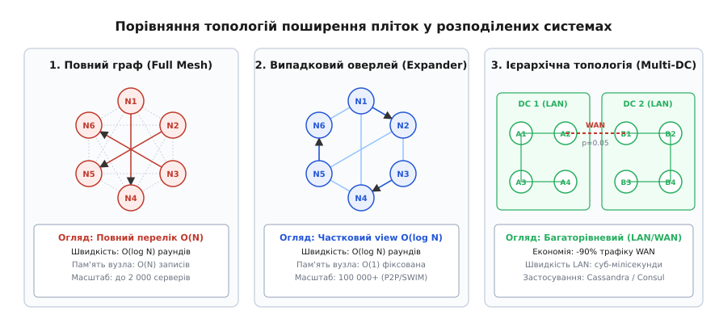
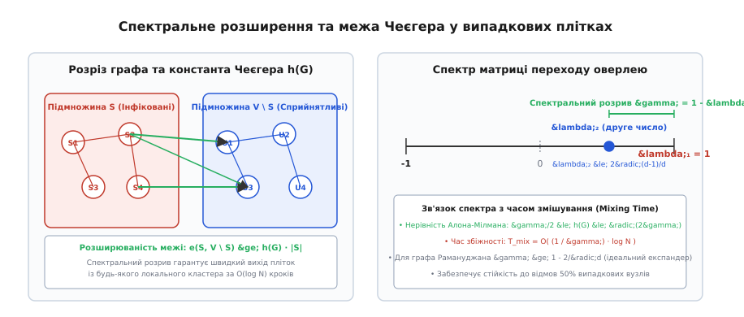
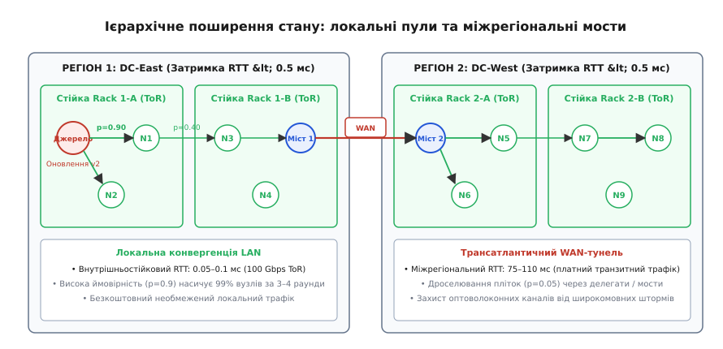
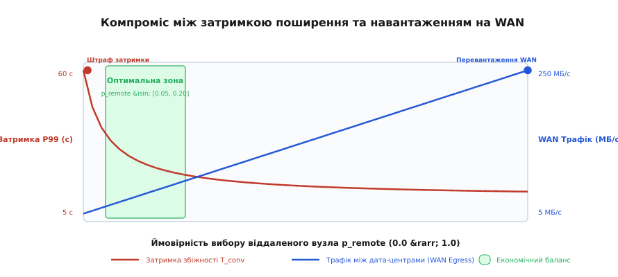

# Топології пліток: повний граф, випадкові оверлеї та ієрархічні структури

<preknowlist>
- [Gossip-протоколи](root:sf-distributed/gossip-protocols) — епідемічне поширення інформації, стратегії push/pull, логарифмічна збіжність.
- [Плітки й членство в кластері: протоколи SWIM, Lifeguard та епідемічне виявлення збоїв](root:sf-distributed/gossip-membership) — детектування збоїв, непряме зондування, протокол SWIM.
- [Вісім оман розподілених обчислень](root:sf-distributed/distributed-fallacies) — ненадійність мережевих каналів, затримки та асиметрія пропускної здатності.
- [Кінцева узгодженість на практиці](root:sf-distributed/eventual-consistency) — модель збіжності реплік у часі без синхронного блокування.
- [Анти-ентропія та відновлення узгодженості](root:sf-distributed/anti-entropy-repair) — фонова синхронізація через дерева Меркла та дайджести.
</preknowlist>

Розподілений кластер із 12 000 серверів розгорнуто у чотирьох географічних регіонах: Північна Вірджинія, Франкфурт, Сінгапур та Сан-Паулу. Кожен вузол запускає класичний епідемічний протокол розповсюдження конфігурацій (gossip): щосекунди сервер обирає три випадкові вузли з усього кластера (`k = 3`) і відправляє їм UDP-пакет розміром 1.2 КБ. У математичній моделі з однорідною мережею інформація досягає всіх учасників за `O(log N)` раундів (близько 9–10 секунд). Проте в реальному фізичному середовищі система зазнає колапсу: 75% згенерованих дейтаграм намагаються перетнути дорогі міжконтинентальні оптоволоконні канали з затримкою RTT від 80 до 240 мс і періодичними втратами пакетів у 1.5%.

Мережеві шлюзи регіонів захлинаються від шторму у 27 000 міжрегіональних дейтаграм щосекунди, що генерує понад 250 МБ/с транзитного трафіку вартістю десятки тисяч доларів на місяць. Через переповнення буферів маршрутизаторів частина пакетів губиться, що збільшує час поширення критичних оновлень до 45–60 секунд із непередбачуваним джитером, а помилкові спрацьовування детектора відмов починають ізолювати цілі дата-центри.

Причина цієї кризи полягає у фундаментальній невідповідності між **логічною топологією оверлею пліток** (яка вважає, що всі вузли рівновіддалені один від одного) та **фізичною топологією мережі** (де комутація всередині стійки коштує нуль грошей і займає 0.05 мс, а передача через океан коштує реальних грошей і триває сотні мілісекунд).

Щоб побудувати стійку розподілену систему на тисячі й десятки тисяч серверів, інженери застосовують три фундаментальні топологічні структури: **повний граф** (*Full Mesh*), **випадкові оверлеї-експандери** (*Random Expander Overlays*) та **ієрархічні топологічно-чутливі пули** (*Locality-Aware / Multi-DC Gossip*).

---

## Анатомія трьох топологій оверлею

Вибір структури зв'язків між вузлами визначає три критичні характеристики системи: обсяг пам'яті під список учасників на кожному сервері, сумарне навантаження на комутатори та швидкість вирівнювання розбіжностей.

```
+---------------------------------------------------------------------------------------------------+
| 1. Повний граф (Full Mesh Overlay):                                                              |
|    • Огляд: Кожен вузол зберігає адреси та стан усіх N учасників кластера.                        |
|    • Вибір цілі: Рівномірний випадковий вибір P(i -> j) = 1 / (N - 1).                           |
|    • Переваги: Мінімальна теоретична кількість раундів O(log N), відсутність діаметра графа.     |
|    • Обмеження: Пам'ять O(N) на вузол; сліпота до вартості та затримок фізичної мережі.          |
+---------------------------------------------------------------------------------------------------+
                                                  ▲
                                                  │ еволюція для великих P2P
                                                  ▼
+---------------------------------------------------------------------------------------------------+
| 2. Випадковий оверлей-експандер (Random Expander / Partial View):                                |
|    • Огляд: Вузол знає лише малу частку d = O(log N) або d = const випадкових сусідів.           |
|    • Вибір цілі: Випадковий вибір серед активного пулу (Active View); динамічне перемішування.    |
|    • Переваги: Фіксована пам'ять O(1) на вузол, масштабування до 1 000 000+ машин (P2P/SWIM).    |
|    • Обмеження: Вимагає протоколу лікування зв'язків (Peer Sampling); сліпий до географії.       |
+---------------------------------------------------------------------------------------------------+
                                                  ▲
                                                  │ адаптація до хмарних ДЦ
                                                  ▼
+---------------------------------------------------------------------------------------------------+
| 3. Ієрархічна топологія (Hierarchical / Locality-Aware Multi-DC):                                |
|    • Огляд: Багаторівневий поділ кластера (Стійка -> Зона доступності -> Регіон).                 |
|    • Вибір цілі: Зважений або шлюзовий вибір: P(локальний) = 0.90..0.95, P(віддалений) = 0.05..0.1|
|    • Переваги: Скорочення міжрегіонального WAN-трафіку на 85–92%, суб-мілісекундна швидкість LAN.|
|    • Обмеження: Необхідність явного детектування топології або налаштування шлюзових мостів.     |
+---------------------------------------------------------------------------------------------------+
```


*Порівняння топологій поширення пліток: повний граф забезпечує швидкість за ціною O(N) пам'яті, випадковий expander оверлей масштабується до мільйона вузлів із пам'яттю O(1), а ієрархічна структура мінімізує навантаження на дорогі WAN-канали.*

Детальний аналіз того, як змінювалися погляди дослідників на топологію зв'язків від перших робіт Xerox PARC до сучасних хмарних систем, наведено у вставці [Історія еволюції топологій пліток: від плаських списків Xerox PARC до Astrolabe, Cassandra та Consul](root:sf-distributed/gossip-topology/hist-topology-evolution.md).

---

## 1. Повний граф (Full Mesh): межі однорідного вибору

У класичній моделі повного зв'язку кожен вузол підтримує таблицю членства, що містить ідентифікатори, IP-адреси, порти та лічильники версій стану для всіх `N` учасників кластера.

Коли вузол `A` генерує оновлення або виконує черговий раунд фонового обміну (анти-ентропії), він обирає `k` випадкових цільових серверів рівномірно з пулу `N - 1`.

```
[Динаміка інфікування в однорідному повному графі]:
Раунд 0:  1 вузол інфікований.
Раунд 1:  1 + k вузлів інфіковано (при k = 3: 4 вузли).
Раунд 2:  4 · (1 + 3) = 16 вузлів.
Раунд t:  (1 + k)^t вузлів на початковій експоненційній фазі.
```

### Фізичні бар'єри масштабування повного графа

Хоча повний граф забезпечує найшвидше поширення інформації з теоретичної точки зору, він стикається з трьома нездоланними інженерними бар'єрами при зростанні `N > 2000..5000`:

1. **Споживання пам'яті та серіалізація (`O(N)`):**
   Кожен запис про вузол у пам'яті (разом із таймстемпами, метриками затримок та буферами останніх повідомлень) займає від 200 до 500 байтів. Для 50 000 вузлів це становить 25 МБ оперативної пам'яті на кожен процес. Під час відправлення дайджестів членства розмір пакетів починає перевищувати стандартний MTU мережі Ethernet (1500 байтів), викликаючи IP-фрагментацію дейтаграм і лавиноподібне зростання втрат пакетів.

2. **Квадратичний фоновий трафік оновлень:**
   Якщо кожен із `N` серверів виконує перевірку стану або анти-ентропію раз на `T` секунд, сумарна кількість пакетів у мережі дорівнює `(k · N) / T`. Для кластера з 10 000 серверів при `k = 3` та `T = 1 с` мережа повинна пропускати 30 000 дейтаграм щосекунди. Якщо всі сервери розміщені в одному дата-центрі, комутатори справляються з цим потоком, але за наявності міжрегіональних лінків канали миттєво перевантажуються.

3. **Сліпота до неоднорідності затримок (Latency Asymmetry):**
   У повному графі ймовірність надіслати пакет сусідньому серверу в тій самій стійці (відстань 2 метри, RTT 0.05 мс) дорівнює ймовірності відправити пакет на інший континент (відстань 10 000 км, RTT 180 мс). В результаті 90–95% часу раунду вузол витрачає на очікування відповідей від повільних транзитнапрямків.

---

## 2. Випадкові оверлеї-експандери та частковий огляд

Коли кількість вузлів у системі вимірюється десятками або сотнями тисяч (наприклад, у глобальних peer-to-peer мережах, блокчейнах або масштабних бессерверних кластерах), жоден вузол не може знати всіх інших учасників.

Для таких середовищ застосовується концепція **часткового огляду** (*Partial View*) на базі **служб вибірки партнерів** (*Peer Sampling Service*):

```
+-------------------------------------------------------------------------------+
|                      ВУЗОЛ КЛАСТЕРА (HyParView / SCAMP)                       |
|                                                                               |
|  +-------------------------------------+  +--------------------------------+  |
|  |   1. Активний огляд (Active View)   |  |  2. Пасивний огляд (Passive)   |  |
|  |   • Розмір: d = log(N) (напр. 6..8) |  |  • Розмір: c · log(N) (30..50) |  |
|  |   • Використання: Розсилка пліток   |  |  • Використання: Резерв зв'язку|  |
|  |   • Властивість: Симетричні канали  |  |  • Регенерація при збоях Active|  |
|  +-------------------------------------+  +--------------------------------+  |
|                         ▲                                 ▲                   |
|                         │                                 │                   |
|  +-------------------------------------------------------------------------+  |
|  |   Протокол перемішування зв'язків (Peer Shuffling / Cyclon)             |  |
|  +-------------------------------------------------------------------------+  |
+-------------------------------------------------------------------------------+
```

### Властивості графів-експандерів у випадкових оверлеях

Якщо кожен вузол підтримує лише `d` випадкових зв'язків (`d ≥ 5..8`), вся сукупність серверів утворює випадковий `d`-регулярний граф.

У теорії графів випадкові регулярні графи є **експандерами** (від англ. *expander graph* — «розширювальний граф»). Вони володіють двома фундаментальними характеристиками:

1. **Логарифмічний діаметр:**
   Найкоротша відстань між будь-якими двома вузлами в графі з `N` вершин становить `O(log_d N)`. Тобто повідомлення досягає протилежного кінця мережі за таку саму кількість кроків, як і в повному графі.
2. **Висока константа Чеєгера `h(G)` (Isoperimetric Expansion):**
   Неможливо знайти підмножину вузлів `S`, яка була б ізольована від решти кластера вузьким перешийком зв'язків. Будь-який розріз графа перетинається великою кількістю випадкових ребер `e(S, V \ S) ≥ h(G) · |S|`.


*Спектральний аналіз випадкового оверлею: константа Чеєгера гарантує вихід пліток через межу розрізу e(S, V \ S), а спектральний розрив γ = 1 - λ₂ забезпечує збіжність за O(log N) раундів.*

Суворе математичне доведення зв'язку між спектральним розривом матриці переходу оверлею та швидкістю розповсюдження інформації наведено у вставці [Математичний аналіз збіжності пліток на топологіях: спектральний аналіз, експандери та затримки між ДЦ](root:sf-distributed/gossip-topology/math-topology-convergence.md).

### Протокол перемішування зв'язків (Peer Shuffling)

Щоб граф оверлею не деградував і не розпадався на ізольовані кластери при масових збоях вузлів, сервери періодично виконують протокол перемішування (наприклад, алгоритм **Cyclon**):

1. Вузол `A` обирає найстарішого сусіда `B` зі свого активного огляду.
2. Вузол `A` формує пакет зі свого власного ID та кількох випадкових адрес зі свого огляду.
3. Вузол `B` відповідає списком своїх випадкових сусідів.
4. Обидва вузли оновлюють свої огляди, замінюючи старі записи новими.

Цей безперервний фоновий процес гарантує, що топологія постійно залишається ідеальним випадковим графом-експандером навіть за умови постійного підключення та відключення вузлів (*churn*).

---

## 3. Ієрархічні та топологічно-чутливі плітки (Hierarchical Gossip)

Хоча випадкові оверлеї-експандери вирішують проблему пам'яті, вони залишаються сліпими до фізичної вартості мережевих каналів. У хмарних дата-центрах фізична інфраструктура завжди організована за багаторівневою ієрархією:

```
[Рівень 1: Стійка (Rack)]
  • 40–60 серверів підключені до ToR-комутатора (Top-of-Rack).
  • Затримка: 0.05–0.1 мс. Пропускна здатність: 25–100 Гбіт/с.
  • Вартість трафіку: 0 $ (безкоштовно).

[Рівень 2: Дата-центр / Зона доступності (Datacenter / AZ)]
  • Фабрика комутаторів Spine-Leaf об'єднує сотні стійок.
  • Затримка: 0.5–1.2 мс. Пропускна здатність: 10–40 Гбіт/с.
  • Вартість трафіку: 0 $ або мінімальна внутрішня плата.

[Рівень 3: Географічний регіон / WAN]
  • Оптоволоконні магістралі через континенти та океани.
  • Затримка: 40–200 мс. Пропускна здатність: обмежена та платна.
  • Вартість трафіку: 0.01–0.08 $ за кожен переданий гігабайт (Egress).
```

Ієрархічний gossip узгоджує математику епідемічного поширення з цією фізичною ієрархією.


*Ієрархічна динаміка пліток: локальні пули стійок та дата-центрів синхронізуються на високій швидкості LAN через p = 0.9, а транзит через дорогий океанський WAN дроселюється з імовірністю p = 0.05 через призначені мости.*

### Три архітектурні моделі ієрархічного вибору

В інженерній практиці застосовується три підходи до організації ієрархії:

#### 1. Асиметричний імовірнісний вибір (Weighted Probabilistic Target Selection)

Кожен сервер володіє інформацією про розташування інших вузлів (наприклад, через IP-маску або метадані провайдера). Під час вибору партнера вузол використовує зважений генератор випадкових чисел:

```
P(партнер зі своєї стійки)   = 0.60    [швидке вирівнювання найближчих сусідів]
P(партнер з іншої стійки ДЦ)  = 0.35    [поширення всередині дата-центру]
P(партнер із віддаленого ДЦ) = 0.05    [рідкісні мости через океан]
```

Завдяки цьому 95% усього згенерованого трафіку залишається всередині швидкої та безкоштовної локальної мережі дата-центру. Оновлення миттєво поширюється серед тисяч локальних машин. Лише 5% дейтаграм виходять у WAN, але оскільки таких дейтаграм надходить кілька сотень на секунду від усього кластера, віддалений регіон отримує оновлення майже без затримки.

#### 2. Дворівневий шлюзовий оверлей (Two-Tier Gateway / Delegate Overlay)

Цей патерн реалізовано в системі **HashiCorp Consul**:
- **LAN Serf Pool:** Кожен дата-центр має власний незалежний gossip-пул, у якому беруть участь усі локальні агенти (наприклад, 5000 мікросервісів). Вони пінгують один одного кожні 200 мс.
- **WAN Serf Pool:** Окремий федеративний пул, у якому зареєстровано виключно сервери-делегати Consul (по 3–5 виділених серверів на дата-центр). Звичайні сервісні агенти взагалі не знають про існування віддалених регіонів і не надсилають туди жодного байта.

Коли в регіоні US-East з'являється новий сервіс або падає вузол, подія поширюється локальним пулом LAN до серверів Consul. Сервери Consul ретранслюють подію через WAN-пул до серверів регіону EU-West, а ті транслюють її вниз у свій локальний LAN Serf Pool.

#### 3. Ієрархічна агрегація зон (Zone Tree Aggregation)

Цей підхід використовується в системі **Astrolabe**: сервери об'єднуються в дерево вкладених зон (`/world/europe/frankfurt/rack-2`). Вузли всередині зони пліткують між собою, формуючи агреговане зведення стану (наприклад, середній лаг реплікації або максимальне завантаження CPU). На рівень вище передається лише стиснуте зведення, що зводить трафік кореневої зони до мінімального фіксованого обсягу.

---

## 4. Інженерний компроміс: швидкість проти вартості WAN

Зниження ймовірності міжрегіонального вибору `p_remote` скорочує витрати на передачу даних, але створює затримку переходу інфекції між регіонами.


*Крива компромісу: при зростанні p_remote трафік WAN зростає лінійно, а затримка P99 спадає гіперболічно. Оптимальна інженерна зона лежить у діапазоні p_remote від 0.05 до 0.15.*

Як показано на графіку:
- Якщо `p_remote < 0.02`, виникає ризик тимчасової ізоляції регіонів: час повної глобальної збіжності зростає до 60 секунд.
- Якщо `p_remote > 0.40`, канали WAN перевантажуються дублікатами пліток без будь-якого помітного виграшу в швидкості (затримка виходить на плато).
- Оптимальний діапазон лежить у межах `0.05 ≤ p_remote ≤ 0.15`: навантаження на канали WAN знижується на 85–90%, тоді як затримка доставки зростає лише на 10–15% порівняно з теоретичним максимумом.

Практичну програмну реалізацію дискретного симулятора для експериментальної перевірки цих параметрів наведено у вставці [Симулятор ієрархічного та випадкового gossip-протоколу: порівняльний експеримент збіжності й трафіку](root:sf-distributed/gossip-topology/proj-hierarchical-gossip.md).

Специфікацію інтерфейсу модульного маршрутизатора топології для інтеграції у власні сервіси наведено у вставці [Контракт інтерфейсу топологічно-чутливого маршрутизатора пліток](root:sf-distributed/gossip-topology/api-topology-router.md).

---

## 5. Практична реалізація: вибір партнерів у C++ та Go

Нижче наведено алгоритм топологічно-чутливого вибору цілі пліток, який застосовується в рушіях Cassandra та ScyllaDB:

:::tabs
```cpp
#include <iostream>
#include <vector>
#include <string>
#include <random>
#include <span>
#include <memory>
#include <algorithm>

struct Endpoint {
    std::string id;
    std::string datacenter;
    std::string rack;
};

class LocalityAwarePeerSelector {
public:
    LocalityAwarePeerSelector(Endpoint local_node, double p_rack, double p_dc, double p_remote)
        : self_(std::move(local_node)),
          p_rack_(p_rack),
          p_dc_(p_dc),
          p_remote_(p_remote),
          rng_(std::random_device{}()) {}

    void UpdatePeerList(std::vector<Endpoint> peers) {
        same_rack_.clear();
        same_dc_.clear();
        remote_dc_.clear();

        for (auto& peer : peers) {
            if (peer.id == self_.id) continue;

            if (peer.datacenter != self_.datacenter) {
                remote_dc_.push_back(peer);
            } else if (peer.rack != self_.rack) {
                same_dc_.push_back(peer);
            } else {
                same_rack_.push_back(peer);
            }
        }
    }

    std::vector<Endpoint> SelectTargets(size_t fanout) {
        std::vector<Endpoint> selected;
        selected.reserve(fanout);

        std::uniform_real_distribution<double> dist(0.0, 1.0);

        for (size_t i = 0; i < fanout; ++i) {
            double roll = dist(rng_);

            if (roll < p_rack_ && !same_rack_.empty()) {
                selected.push_back(pick_random(same_rack_));
            } else if (roll < (p_rack_ + p_dc_) && !same_dc_.empty()) {
                selected.push_back(pick_random(same_dc_));
            } else if (!remote_dc_.empty()) {
                selected.push_back(pick_random(remote_dc_));
            } else if (!same_dc_.empty()) {
                selected.push_back(pick_random(same_dc_));
            } else if (!same_rack_.empty()) {
                selected.push_back(pick_random(same_rack_));
            }
        }
        return selected;
    }

private:
    Endpoint pick_random(const std::vector<Endpoint>& pool) {
        std::uniform_int_distribution<size_t> idx_dist(0, pool.size() - 1);
        return pool[idx_dist(rng_)];
    }

    Endpoint self_;
    double p_rack_;
    double p_dc_;
    double p_remote_;
    std::mt19937 rng_;
    std::vector<Endpoint> same_rack_;
    std::vector<Endpoint> same_dc_;
    std::vector<Endpoint> remote_dc_;
};

int main() {
    Endpoint local{"node-1", "us-east-1", "rack-A"};
    LocalityAwarePeerSelector selector(local, 0.60, 0.35, 0.05);

    std::vector<Endpoint> cluster = {
        {"node-1", "us-east-1", "rack-A"},
        {"node-2", "us-east-1", "rack-A"},
        {"node-3", "us-east-1", "rack-B"},
        {"node-4", "eu-central-1", "rack-C"}
    };

    selector.UpdatePeerList(cluster);
    auto targets = selector.SelectTargets(2);

    for (const auto& t : targets) {
        std::cout << "Обрано партнера для пліток: " << t.id 
                  << " (" << t.datacenter << " / " << t.rack << ")\n";
    }
    return 0;
}
```
```go
package main

import (
	"fmt"
	"math/rand"
	"time"
)

type Endpoint struct {
	ID         string
	Datacenter string
	Rack       string
}

type LocalityAwarePeerSelector struct {
	self     Endpoint
	pRack    float64
	pDC      float64
	pRemote  float64
	rnd      *rand.Rand
	sameRack []Endpoint
	sameDC   []Endpoint
	remoteDC []Endpoint
}

func NewLocalityAwarePeerSelector(self Endpoint, pRack, pDC, pRemote float64) *LocalityAwarePeerSelector {
	return &LocalityAwarePeerSelector{
		self:    self,
		pRack:   pRack,
		pDC:     pDC,
		pRemote: pRemote,
		rnd:     rand.New(rand.NewSource(time.Now().UnixNano())),
	}
}

func (s *LocalityAwarePeerSelector) UpdatePeerList(peers []Endpoint) {
	s.sameRack = nil
	s.sameDC = nil
	s.remoteDC = nil

	for _, peer := range peers {
		if peer.ID == s.self.ID {
			continue
		}
		if peer.Datacenter != s.self.Datacenter {
			s.remoteDC = append(s.remoteDC, peer)
		} else if peer.Rack != s.self.Rack {
			s.sameDC = append(s.sameDC, peer)
		} else {
			s.sameRack = append(s.sameRack, peer)
		}
	}
}

func (s *LocalityAwarePeerSelector) SelectTargets(fanout int) []Endpoint {
	selected := make([]Endpoint, 0, fanout)

	for i := 0; i < fanout; i++ {
		roll := s.rnd.Float64()

		switch {
		case roll < s.pRack && len(s.sameRack) > 0:
			selected = append(selected, s.sameRack[s.rnd.Intn(len(s.sameRack))])
		case roll < (s.pRack+s.pDC) && len(s.sameDC) > 0:
			selected = append(selected, s.sameDC[s.rnd.Intn(len(s.sameDC))])
		case len(s.remoteDC) > 0:
			selected = append(selected, s.remoteDC[s.rnd.Intn(len(s.remoteDC))])
		case len(s.sameDC) > 0:
			selected = append(selected, s.sameDC[s.rnd.Intn(len(s.sameDC))])
		case len(s.sameRack) > 0:
			selected = append(selected, s.sameRack[s.rnd.Intn(len(s.sameRack))])
		}
	}
	return selected
}

func main() {
	local := Endpoint{ID: "node-1", Datacenter: "us-east-1", Rack: "rack-A"}
	selector := NewLocalityAwarePeerSelector(local, 0.60, 0.35, 0.05)

	cluster := []Endpoint{
		{ID: "node-1", Datacenter: "us-east-1", Rack: "rack-A"},
		{ID: "node-2", Datacenter: "us-east-1", Rack: "rack-A"},
		{ID: "node-3", Datacenter: "us-east-1", Rack: "rack-B"},
		{ID: "node-4", Datacenter: "eu-central-1", Rack: "rack-C"},
	}

	selector.UpdatePeerList(cluster)
	targets := selector.SelectTargets(2)

	for _, t := range targets {
		fmt.Printf("Обрано партнера для пліток: %s (%s / %s)\n", t.ID, t.Datacenter, t.Rack)
	}
}
```
:::

---

## 6. Промислова діагностика та простеження каналів зв'язку

Для діагностики поведінки епідемічного обміну в production-кластерах інженери спираються на системні лічильники ядра ОС та аналіз мережевих сокетів:

1. **Моніторинг сокетних черг через `ss` та `/proc/net/udp`:**
   ```bash
   # Перевірка наявності черг Recv-Q та Send-Q на UDP-порту пліток (типово 7000 або 8301):
   ss -u -a -n -p '( sport = :7000 or dport = :7000 )'
   ```
   Якщо лічильник `Recv-Q` постійно відмінний від нуля, це свідчить про те, що потік вхідних дейтаграм перевищує пропускну здатність користувацького потоку обробки, і ядро незабаром почне скидати пакети.

2. **Перевірка скидання дейтаграм на канальному рівні (`netstat`):**
   ```bash
   # Перевірка лічильників втрат через брак буферної пам'яті:
   netstat -s -u | grep -E "buffer errors|RcvbufErrors|SndbufErrors"
   ```
   Поява ненульових значень у графі `RcvbufErrors` є прямим наслідком некоректної топології (наприклад, надмірного fanout у великому однорідному кластері), що вимагає переходу до ієрархічного вибору або збільшення ліміту `net.core.rmem_max`.

3. **Простеження міжрегіональних пакетів через `tcpdump`:**
   ```bash
   # Підрахунок кількості пакетів, що виходять на зовнішній мережевий інтерфейс WAN:
   sudo tcpdump -i eth1 -n "udp port 7000" -c 1000
   ```

---

> 🔧 **Навіщо це.**
>
> У реальній інфраструктурі (AWS, GCP, власні дата-центри) використання плоского однорідного gossip у мультирегіональному кластері призводить до фінансових втрат через рахунки за Cross-Region Egress та до нестабільності детектора збоїв при перевантаженні магістралей.
>
> Налаштування топологічно-чутливого маршрутизатора (як-от `Gossiper` у Cassandra через `RackInferringSnitch` або поділ на LAN/WAN пули в HashiCorp Consul) дозволяє знизити міжрегіональний службовий трафік на 90%, зберегти суб-мілісекундну швидкість оновлень у межах дата-центру та уникнути каскадних хибних відключень здорових серверів при тимчасовій деградації трансатлантичних оптичних ліній.
