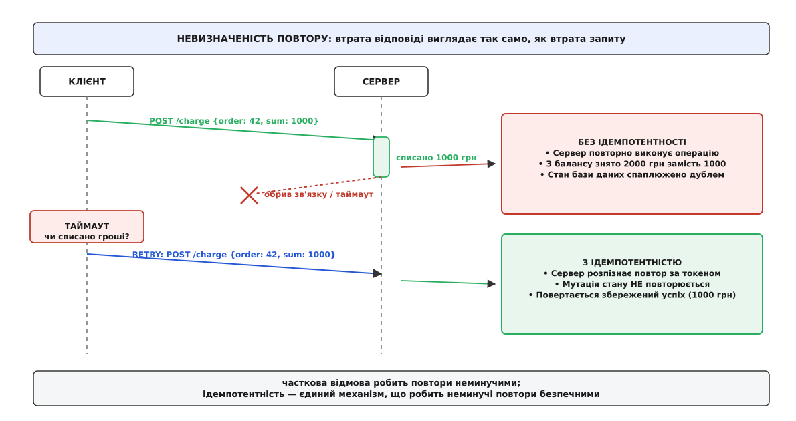
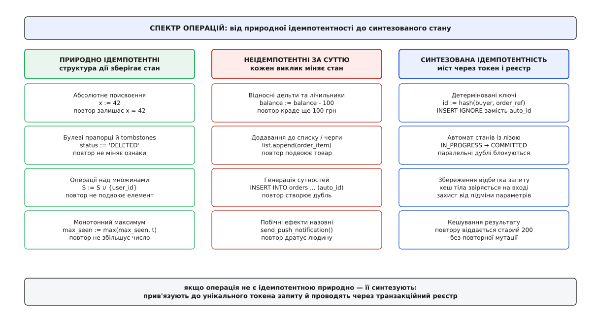
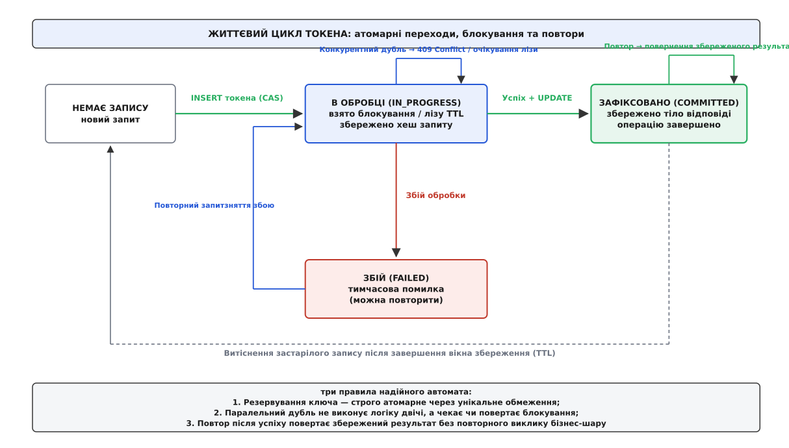
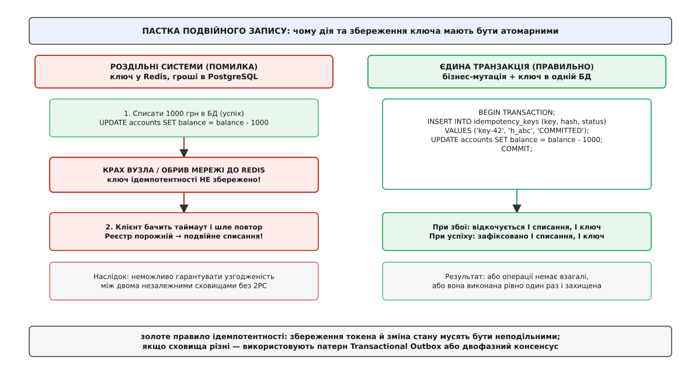
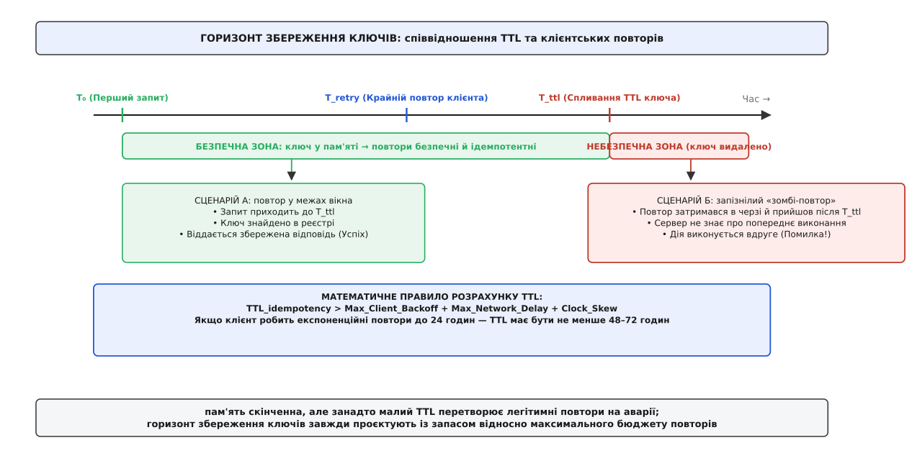

# Ідемпотентність у розподілених системах

<preknowlist>
- [Омани розподілених обчислень](root:sf-distributed/distributed-fallacies) — чому мережа ненадійна, пакети губляться і виникають часткові відмови.
- [Таймаути й бюджет часу](root:sf-distributed/timeouts-deadlines) — клієнт не знає, чи запит не дійшов до сервера, чи відповідь загинула дорогою назад.
- [Повторні спроби (retries)](root:sf-distributed/retries-backoff) — стратегія повторного надсилання запитів при збоях та небезпека накопичення дублікатів.
- [Гарантії доставки](root:sf-distributed/delivery-guarantees) — семантика at-most-once, at-least-once та чому прикладний рівень спирається на effectively-once.
</preknowlist>

Клієнтський застосунок банку надсилає платіжному шлюзу запит на переказ 50 000 гривень за договором № 8412. Сервер успішно отримує HTTP-пакет, відкриває транзакцію в базі даних, списує кошти з рахунку платника, зараховує їх отримувачу і формує успішну відповідь `200 OK`. Але в ту саму мілісекунду, коли мережева карта сервера відправляє перший пакет підтвердження, магістральний комутатор провайдера зазнає апаратного скидання. З'єднання обривається. Клієнтський процес чекає на відповідь рівно 3000 мс і завершує виклик із системною помилкою `ETIMEDOUT`.

У цій точці клієнт опиняється перед класичною дилемою ненадійної мережі: чи відбулася фінансова транзакція насправді? Якщо мережа знищила запит дорогою до сервера, гроші залишилися на місці, і платіж необхідно надіслати повторно. Якщо ж сервер усе виконав, а зникла лише зворотна відповідь, повторний запит спише з клієнта ще 50 000 гривень, подвоївши суму платежу. Обидва випадки ззовні мають абсолютно однаковий вигляд: відсутність байтів відповіді у встановлений ліміт часу.

У розподілених системах неможливо побудувати фізичний транспорт, який доставляв би повідомлення строго один раз (*exactly-once delivery*): через падіння вузлів, мережеві розриви та затримки протоколи здатні гарантувати або доставку не більше одного разу (*at-most-once*, без повторів — із ризиком втрати дій), або доставку принаймні один раз (*at-least-once*, з повторами — із неминучим дублюванням пакетів). Ідемпотентність — це фундаментальна інженерна властивість операції, яка перетворює транспортну гарантію *at-least-once* на прикладну семантику *effectively-once*: скільки б разів один і той самий запит не виконувався на сервері, результуючий стан системи залишається тотожним однократному успішному застосуванню.



*Загублена відповідь змушує клієнта повторювати запит. Без ідемпотентності кожен повтор подвоює зміну балансу; з ідемпотентністю сервер розпізнає дублікат і повертає узгоджений результат без повторної мутації.*

## Алгебраїчна сутність та семантичні межі

Термін походить від латинських слів *idem* («той самий», «однаковий») та *potens* («здатний», «сильний», «той, що має силу»). Поняття вперше ввів американський математик Бенджамін Пірс 1870 року в праці про асоціативні алгебри для опису елементів, множення яких самих на себе не змінює результату.

В інформатиці оператор `f` над станом системи `S` називається **ідемпотентним**, якщо його повторне застосування до результату попереднього виклику не змінює результуючого стану:

```
f(f(S)) = f(S)
```

Застосування операції `n` разів поспіль дає точно такий самий стан, як і застосування один раз:

```
f(f(...f(S)...)) = f(S)    [для будь-якого n ≥ 1]
```

Про те, як абстрактна математична концепція перетворилася на наріжний камінь мережевих протоколів Sun NFS та сучасних хмарних транзакцій, розказано в [історичному нарисі еволюції ідемпотентності](root:sf-distributed/idempotency/hist-algebra-to-distrib.md).

Тут важливо провести чітку межу, на якій розробники помиляються найчастіше: **ідемпотентність стосується стану сервера, а не байтів або статусів відповіді клієнту**.

Розглянемо виклик видалення ресурсу в REST-архітектурі:

```
крок 1:  DELETE /users/42   → користувача видалено з БД     → HTTP 200 OK
крок 2:  DELETE /users/42   → користувача вже немає в БД    → HTTP 404 Not Found
стан:    користувач 42 відсутній (однаковий після кроку 1 і кроку 2)
```

Коди повернення різні (`200` та `404`), проте стан сховища даних після першого та після другого викликів абсолютно тотожний: запис про користувача 42 відсутній. Операція є строго ідемпотентною. Клієнтська бібліотека повторів, отримавши код `404` на повторному виклику, повинна інтерпретувати це не як катастрофу, а як підтвердження бажаного стану: об'єкта більше немає.

Слід також розрізняти дві споріднені властивості:
* **Безпечність** (*safety*): операція взагалі не здійснює побічних ефектів і не змінює стану сервера (наприклад, читання даних `GET`, `HEAD`, `OPTIONS`). Будь-яка безпечна операція є автоматично ідемпотентною (виконати нуль мутацій десять разів — це нуль мутацій).
* **Ідемпотентність** (*idempotency*): операція може активно змінювати стан системи (писати на диск, видаляти таблиці, списувати ліміти), але повторення цієї дії не призводить до додаткових змін порівняно з першим викликом (`PUT`, `DELETE`, ідемпотентний `POST`).

> 🔧 **Навіщо це.** Коли проєктуєш клієнти розподілених сервісів, відокремлюй перевірку кінцевого стану від аналізу HTTP-статусу. Якщо повторний запит на створення сутності повертає `409 Conflict` або `200 OK` замість первинного `201 Created`, але тіло ресурсу збігається з очікуваним — клієнт повинен вважати операцію успішно завершеною.

## Природна проти синтезованої ідемпотентності

Всі операції в розподілених системах поділяються на два класи: ті, що володіють ідемпотентністю за своєю структурою, і ті, які за своєю природою неідемпотентні й вимагають спеціальної інженерної надбудови.



*Структурно ідемпотентні операції безпечні за побудовою. Неідемпотентні дії (дельти, черги, сторонні API) вимагають синтезованого конвеєра: унікального токена, транзакційного автомата та кешу результатів.*

### 1. Природна (структурна) ідемпотентність

Операція є природно ідемпотентною, якщо її дія полягає у встановленні абсолютного цільового стану, а не у застосуванні відносної зміни.

* **Абсолютне присвоєння значення:**
  Команда `SET temperature = 24.5` є ідемпотентною: скільки б разів вона не повторилася, значення в комірці дорівнюватиме `24.5`. На противагу цьому, команда `ADD temperature, 1.5` не є ідемпотентною: три повтори збільшать температуру на `4.5` градуса.
* **Термінальні прапорці стану (tombstones):**
  Оновлення `UPDATE orders SET status = 'CANCELLED' WHERE id = 101` переводить сутність у кінцевий стан. Повторне виконання запиту знаходить той самий рядок і знову записує `'CANCELLED'`, не порушуючи бізнес-правил.
* **Операції над множинами з унікальними ключами:**
  Додавання елемента до математичної множини `S ∪ {item}` є ідемпотентним. У базах даних це відповідає конструкціям `INSERT INTO tags (article_id, tag) VALUES (42, 'distributed') ON CONFLICT DO NOTHING` або додаванню в структуру `Set` у Redis (`SADD`).
* **Монотонне зростання (Max / Min):**
  Оновлення показників лічильника висоти чи версії за правилом `seen_version = max(seen_version, incoming_version)`. Повторний прихід застарілого або дубльованого пакета не зрушує вказівник.

Детальний математичний апарат таких монотонних операцій, властивості напівґраток та доведення кінцевої узгодженості без блокувань за теоремою CALM викладено у [математичній вставці про алгебру напівґраток](root:sf-distributed/idempotency/math-semilattice-idempotence.md).

### 2. Неідемпотентні операції за своєю природою

Більшість критичних бізнес-операцій не є ідемпотентними у своїй вихідній постановці:
* Списання коштів з балансу (`balance = balance - amount`).
* Додавання запису до неіндексованого списку чи черги повідомлень (`LPUSH queue, payload`).
* Генерація нових замовлень з автоінкрементним первинним ключем (`INSERT INTO orders (item_id) VALUES (...)`).
* Відправка фізичних повідомлень у зовнішній світ (виклик SMS-шлюзу, надсилання електронного листа клієнту).

Щоб зробити такі операції безпечними для повторів, їх **синтезують**: навколо неідемпотентної бізнес-дії будують детермінований автомат обліку запитів.

## Анатомія синтезованої ідемпотентності: ключ, автомат стану та лізи

Синтезована ідемпотентність базується на передачі клієнтом **ключа ідемпотентності** (*Idempotency Key / Client Request Token*) — унікального ідентифікатора (зазвичай 128-бітного випадкового UUIDv4), який генерується клієнтом до першої спроби відправки і залишається незмінним у всіх наступних повторах саме цього логічного запиту.

Коли сервер отримує запит із ключем, він проводить його через суворий трифазний автомат станів:



*Життєвий цикл токена ідемпотентності: атомарне взяття в обробку через унікальне обмеження, захист від паралельних гонок за часом оренди, збереження результату та очищення після спливання TTL.*

### Фази автомата:

1. **Фаза резервування (`IN_PROGRESS` з орендою):**
   Сервер намагається атомарно вставити запис про отриманий ключ у таблицю ідемпотентності зі статусом `IN_PROGRESS`.
   * Якщо запису не існувало: запис фіксується, встановлюється час закінчення оренди (`lease_timeout`, наприклад, 30–60 секунд). Сервер переходить до виконання бізнес-логіки.
   * Якщо запис вже існує і має статус `IN_PROGRESS`: це свідчить або про паралельний конкурентний запит із тим самим ключем, або про занадто швидкий повтор, поки перший запит ще обробляється. Якщо час оренди ще не минув, сервер негайно повертає помилку `409 Conflict` (або `425 Too Early` / `Retry-After`), запобігаючи одночасному виконанню двох однакових транзакцій.
   * Якщо статус `IN_PROGRESS`, але час оренди минув: це означає, що попередній вузол, який виконував запит, аварійно впав або завис. Поточний обробник поновлює оренду на себе і повторно береться за виконання.

2. **Фаза фіксації (`COMMITTED` із збереженням результату):**
   Після успішного завершення бізнес-дії (наприклад, списання коштів) сервер в тій самій транзакції переводить статус ключа в `COMMITTED` і зберігає:
   * Код відповіді (наприклад, `200 OK`).
   * Тіло відповіді (JSON/Protobuf результат).
   * Контрольну суму (хеш) тіла первинного запиту.
   * Довгостроковий час зберігання (TTL, наприклад, 24–72 години).

3. **Фаза повернення закешованого результату:**
   Коли через обрив зв'язку клієнт надсилає повторний запит із тим самим ключем, сервер знаходить запис у стані `COMMITTED`, звіряє відбиток запиту і **миттєво повертає збережену відповідь без повторного виклику бізнес-шару**. Гроші не списуються вдруге, а клієнт отримує точний результат первинної операції.

4. **Фаза збою (`FAILED` / `RETRYABLE`):**
   Якщо бізнес-логіка завершилася тимчасовою інфраструктурною помилкою (наприклад, база даних тимчасово заблокована), статус переводиться у `FAILED` або запис видаляється, дозволяючи клієнту зробити наступний повтор без блокування на конфлікті.

Працюючий потокобезпечний рушій ідемпотентності з атомарними переходами станів, захистом від стану гонитви та таймерами оренди мовами C та C++ наведено у [проєктній вставці реалізації рушія ідемпотентності](root:sf-distributed/idempotency/proj-idempotent-state-machine.md).

## Пастка подвійного запису (Dual-Write Hazard)

Головне вразливе місце синтезованої ідемпотентності — це точка стику між **виконанням бізнес-дії** та **збереженням ключа ідемпотентності**.

Розглянемо поширену антипатернову реалізацію, де розробник зберігає ключ у швидкому кеші Redis, а фінансові операції проводить у реляційній базі даних PostgreSQL:

```
// НАЇВНИЙ АНТИПАТЕРН: РОЗДІЛЬНІ СХОВИЩА
bool handle_request(string key, Request req) {
    if (redis.exists(key)) {
        return redis.get(key);
    }
    
    // Крок 1: зміна бізнес-стану
    db.execute("UPDATE accounts SET balance = balance - 1000 WHERE id = 42");
    
    // <-- ВУЗОЛ ПАДАЄ САМЕ ТУТ (ВІДКЛЮЧЕННЯ ЖИВЛЕННЯ АБО OOM KILLED) -->
    
    // Крок 2: збереження ключа
    redis.set(key, "SUCCESS", TTL_24H);
    return SUCCESS;
}
```

Якщо процес завершується аварійно між рядками 1 та 2:
1. База даних зафіксувала списання 1000 гривень.
2. Ключ у Redis **не був записаний**.
3. Клієнт отримав розрив TCP-з'єднання і за правилом надійності надіслав повторний запит із тим самим ключем.
4. Новий обробник перевіряє Redis: ключа немає!
5. Обробник повторно списує 1000 гривень.



*Якщо дія та запис ключа розділені різними сховищами, аварія між ними призводить до подвійного списання або блокування системи. Атомарність досягається лише в межах єдиної транзакції або через патерни Outbox/Inbox.*

### Золоте правило атомарності ідемпотентності

> **Зміна бізнес-стану та збереження запису про ключ ідемпотентності зобов'язані відбуватися в межах однієї атомарної транзакції (ACID).**

У реляційній базі даних це реалізується створенням таблиці `idempotency_keys` поруч із бізнес-таблицями:

```sql
BEGIN TRANSACTION;

-- 1. Спроба вставити ключ ідемпотентності
INSERT INTO idempotency_keys (key, payload_hash, status, response_code, response_body, expires_at)
VALUES ('req-uuid-9948', 'sha256_abc123', 'COMMITTED', 200, '{"tx_id": 8812}', NOW() + INTERVAL '24 hours')
ON CONFLICT (key) DO NOTHING;

-- 2. Перевіряємо, чи вставився рядок (якщо 0 рядків — ключ вже був використаний)
-- Якщо рядок новий — виконуємо бізнес-мутацію в цій же транзакції:
UPDATE accounts SET balance = balance - 1000 WHERE id = 42;

COMMIT;
```

### Порівняння стратегій блокування на рівні СКБД

Реалізація атомарності в таблиці ідемпотентності залежить від архітектури та можливостей конкретної СКБД:

1. **Песимістичне блокування (SELECT ... FOR UPDATE):**
   Обробник починає транзакцію і намагається заблокувати рядок ключа на рівні бази даних. Якщо рядок у стані `IN_PROGRESS`, наступні паралельні потоки зупиняються і чекають на зняття блокування на рівні СКБД. Цей підхід є найнадійнішим, але створює ризик вичерпання пулу з'єднань при тривалих бізнес-операціях.

2. **Оптимістичне блокування з версіонуванням (OCC):**
   Рядок ключа містить монотонний номер версії: `version INT DEFAULT 1`. Оновлення результату виконується через умовний вираз:
   ```sql
   UPDATE idempotency_keys
   SET status = 'COMMITTED', response_body = '...', version = version + 1
   WHERE key = 'uuid-9948' AND version = 1;
   ```
   Якщо паралельний потік уже змінив версію, `UPDATE` повертає 0 оновлених рядків, що сигналізує про конфлікт без утримання довгих блокувань.

3. **Умовний запис у розподілених NoSQL-сховищах (Conditional Writes):**
   У сховищах без класичних багаторядкових транзакцій (Amazon DynamoDB, Apache Cassandra, Google Cloud Bigtable) ідемпотентність спирається на механізм атомарного порівняння та запису (Compare-And-Swap):
   * У DynamoDB: вираз `attribute_not_exists(idempotency_key) OR #expires_at < :now` у команді `PutItem`.
   * У Cassandra: оператор `IF NOT EXISTS` у команді `INSERT` (легковагі транзакції LWT на основі протоколу Paxos).

Якщо транзакція переривається через падіння вузла на будь-якому етапі — СКБД відкочує **і списання коштів, і збереження ключа**. Повторний запит прийде до чистого стану системи. Якщо ж транзакція зафіксована (`COMMIT`) — у базі гарантовано є і списані кошти, і запис про ключ.

Якщо ж операція охоплює декілька мікросервісів або черг повідомлень, де єдиної транзакції БД немає, застосовують інтеграційні патерни:
* [Transactional Outbox](root:sf-distributed/outbox-pattern) — збереження повідомлення в локальній таблиці БД у тій самій транзакції, що й бізнес-дія, з подальшим надійним релеєм у брокер.
* [Transactional Inbox](root:sf-distributed/inbox-pattern) — перевірка й дедуплікація вхідних повідомлень на стороні споживача через локальну транзакційну таблицю.
* [Сага (Saga pattern)](root:sf-distributed/saga-pattern) — ланцюжок компенсуючих транзакцій, де кожен крок зобов'язаний бути ідемпотентним відносно свого ідентифікатора саги.

## Стан гонитви та перевірка відбитка (Payload Fingerprinting)

Синтезована ідемпотентність має два специфічні крайові випадки, які здатні зламати систему навіть за наявності унікальних ключів.

### 1. Конкурентні дублікати (Race Condition)

Припустимо, клієнт працює в багатопотоковому середовищі або має агресивний механізм повторів без експоненційного відступу. Запит № 1 і запит № 2 з абсолютно однаковим ключем надходять на два різних вузли кластера одночасно (з різницею у 2 мілісекунди).

Якщо сервер використовує наївний підхід `SELECT status FROM idempotency_keys WHERE key = '...'`, то обидва вузли побачать, що запису ще немає, обидва розпочнуть списання коштів і обидва запишуть результат.

**Розв'язання:** Захист будується виключно на рівні атомарних примітивів сховища:
* В SQL-базах: `UNIQUE CONSTRAINT` на колонку `idempotency_key`. Другий паралельний `INSERT` миттєво падає з помилкою порушення унікальності (`23505 unique_violation` у PostgreSQL) і змушує другий потік відступити.
* У key-value сховищах: атомарна команда `SET key value NX EX 30` (встановити, лише якщо не існує, з таймаутом оренди 30 с).

### 2. Підміна тіла запиту (Payload Mismatch)

Що станеться, якщо клієнтська бібліотека через помилку програміста або зловмисник використає один і той самий ключ ідемпотентності для двох **різних** дій?

```
Запит 1: POST /charges {amount: 100, account: "A"}  Idempotency-Key: "uuid-111"  → Успіх (знято 100 грн)
Запит 2: POST /charges {amount: 9000, account: "B"} Idempotency-Key: "uuid-111"  → ???
```

Якщо сервер просто перевірить наявність ключа `"uuid-111"` і поверне старий результат — користувач B подумає, що його платіж на 9000 грн виконано, хоча насправді гроші не переказувалися!

**Розв'язання:** Разом із ключем сервер зобов'язаний обчислювати криптографічний хеш від тіла та URL запиту (наприклад, `SHA-256(method + path + body)`). При отриманні запиту з наявним ключем відбиток нового запиту побітово звіряється зі збереженим:
* Хеші збігаються → це легітимний мережевий повтор, повертається збережений результат.
* Хеші відрізняються → це фатальна помилка конфлікту параметрів. Сервер негайно відхиляє запит із кодом `422 Unprocessable Entity` або `409 Conflict` із повідомленням `Idempotency-Key-Payload-Mismatch`.

> 🔧 **Навіщо це.** Завжди включайте у хеш відбитка не лише тіло JSON, але й ідентифікатор автентифікованого користувача (`user_id`). Це унеможливить атаку, коли один користувач намагається підібрати або перехопити чужий ключ ідемпотентності для отримання несанкціонованого доступу до чужих транзакцій.

## Горизонт збереження (TTL) та зомбі-повтори

Жодна база даних не може зберігати ключі ідемпотентності вічно. При мільярді операцій на добу збереження результатів за кілька років вимагатиме сотень терабайтів пам'яті. Тому кожен запис ідемпотентності має обмежений час життя (*Time-To-Live, TTL*).

Але як тільки ключ видаляється за строком давності, система втрачає пам'ять про факт виконання цієї операції.



*Якщо клієнтський повтор затримався в черзі й надійшов після спливання TTL ключа, сервер сприйме його як новий первинний запит і виконає дію повторно.*

### Правило вибору вікна TTL

Горизонт збереження ключів ідемпотентності `T_ttl` зобов'язаний суворо перевищувати максимальний сумарний бюджет часу, протягом якого клієнт або проміжні черги здатні надіслати повтор:

```
TTL_idempotency > Max_Client_Retry_Budget + Max_Queue_Retention + Clock_Skew
```

Якщо клієнтський алгоритм [повторів з експоненційним відступом](root:sf-distributed/retries-backoff) налаштовано на максимальний горизонт повторів у 24 години, то TTL ідемпотентності на сервері повинен становити не менше **48–72 годин**.

Якщо ж існує ризик надходження запізнілих запитів поза межами вікна TTL (наприклад, через ручний перерозрахунок історії оператором через місяць), операцію проектують так, щоб первинний ключ самої сутності в базі даних формувався детерміновано від бізнес-ідентифікатора (наприклад, `order_id = UUIDv5(namespace, "client_id:order_number")`). Тоді навіть через рік спроба повторного запису натрапить на унікальний індекс сутності в базі даних.

## Ідемпотентність у чергах повідомлень та подієвих архітектурах

У брокерах повідомлень (Apache Kafka, RabbitMQ, Amazon SQS) ідемпотентність є єдиним способом усунути дублікати, які неминуче генеруються при аварійному перезавантаженні консюмера або скиданні зміщення (*offset reset*).

Розглянемо типовий сценарій збою у споживача черги:
1. Консюмер вичитує повідомлення з черги: `{event: "ORDER_PAID", order_id: 501}`.
2. Консюмер списує залишок товару на складі в базі даних.
3. Консюмер відправляє брокеру підтвердження `ACK` (або комітить offset у Kafka).
4. У момент відправки `ACK` консюмер зазнає аварійного перезапуску через брак пам'яті (*Out-Of-Memory*).
5. Брокер повідомлень не отримав `ACK`. Після закінчення таймауту непідтвердженого повідомлення брокер перенаправляє те саме повідомлення іншому екземпляру консюмера.

Якщо консюмер не є ідемпотентним, складський залишок товару буде зменшено вдруге.

### Патерн Idempotent Consumer

Для захисту від повторної обробки подій споживач реалізує патерн **Idempotent Consumer**:
1. Кожне повідомлення в черзі має глобально унікальний `Message-ID` або бізнес-ключ (`order_id`).
2. Споживач відкриває транзакцію в локальній базі даних.
3. У транзакції виконується вставка у службову таблицю `processed_messages (message_id PRIMARY KEY, processed_at TIMESTAMP)`.
4. Якщо вставка успішна — виконується зміна залишків товару і транзакція фіксується.
5. Якщо вставка завершується помилкою порушення унікальності первинного ключа — транзакція скасовується, а повідомлення відразу квитується брокеру як успішно оброблене без повторного списання товару.

### Обробка отруйних повідомлень (Poison Pills) та DLQ

Окремим крайовим випадком є ситуація, коли повідомлення містить пошкоджені дані, які викликають фатальну помилку обробки (наприклад, ділення на нуль або невалідний JSON).

Якщо сервіс налаштований на нескінченні повтори при будь-якій помилці, таке «отруйне» повідомлення (*Poison Pill*) блокує чергу назавжди: воно повторно вичитується, падає, повертається в чергу і знову падає, спричиняючи деградацію продуктивності всієї системи.

Щоб запобігти цьому:
* Лімітують кількість повторних спроб обробки повідомлення (наприклад, не більше 3–5 спроб).
* Після вичерпання ліміту повідомлення переміщується у спеціальну **мертву чергу** (*Dead Letter Queue, DLQ*) для подальшого ручного аналізу інженерами.
* Запис про `Message-ID` у таблиці ідемпотентності позначається як `PERMANENTLY_FAILED`, щоб запізнілі дублікати цього отруйного пакета не викликали повторного циклу збоїв.

## Ідемпотентність у георозподілених та мультирегіональних системах

У сучасних георозподілених архітектурах (*Multi-Region Active-Active*) сервіси розгортаються одночасно в кількох датацентрах (наприклад, Франкфурт, Вірджинія та Токіо), кожен із яких обслуговує локальних користувачів і асинхронно реплікує дані в інші регіони.

У такій конфігурації виникає критичний ризик: **що станеться, якщо клієнт надішле первинний запит у регіон Франкфурт, а повторний запит через зміну маршрутизації потрапить у регіон Токіо до того, як таблиця ідемпотентності встигне зареплікуватися через океан?**

Якщо регіон Токіо ще не отримав репліку запису про ключ із Франкфурта, він вважатиме запит новим і повторно виконає бізнес-дію, порушивши інваріант єдиності.

### Стратегії георозподіленої ідемпотентності

Для нейтралізації цього ризику використовують три архітектурні підходи:

1. **Детермінована регіональна прив'язка (Affinity Routing):**
   Ключ ідемпотентності містить префікс регіону створення (наприклад, `fra_uuid-9948`). Глобальний балансувальник навантаження (Anycast / CDN) читає заголовок і завжди спрямовує всі повторні запити з цим ключем у той самий датацентр, де відбулася перша спроба.
2. **Глобально консистентні сховища ключів:**
   Таблиця ідемпотентності розміщується в розподіленій базі даних із синхронним консенсусом Paxos/Raft (Google Cloud Spanner, CockroachDB, Amazon DynamoDB Global Tables зі строгим читанням). Запис ключа вимагає кворуму між регіонами, що гарантує миттєву видимість статусу `IN_PROGRESS` на всіх континентах ціною додаткової латентності на першому запиті.
3. **Конфліктно-стійкі типи даних (CRDT):**
   Якщо бізнес-модель дозволяє представити стан через математичні напівґратки (наприклад, поповнення бонусного рахунку або додавання прав користувача), операції проєктуються так, щоб злиття регіональних баз даних здійснювалося за правилом `S₁ ⊔ S₂` без необхідності централізованого блокування.

## Типові інженерні антипатерни проєктування

Навіть при використанні ключів ідемпотентності розробники часто припускаються помилок, які повністю нівелюють захист. Розглянемо найнебезпечніші антипатерни:

### 1. Використання мінливих бізнес-полів як ключа
Генерація ключа за шаблоном `hash(user_id + phone + amount)`. Якщо клієнт вирішить повторити той самий платіж наступного місяця, система вважатиме його торішнім дублікатом і мовчки відхилить легітимне списання. Ключ зобов'язаний бути унікальним для кожного окремого **наміру** транзакції (випадковий UUIDv4).

### 2. Сліпі повтори без джитера та експоненційного відступу (Retry Storms)
Якщо тисячі клієнтів при збої шлюзу починають повторювати запити щосекунди без випадкового розкиду часу (*jitter*), сервер перевантажується перевірками таблиці ідемпотентності й остаточно виходить із ладу.

### 3. Кешування лише успіхів без обробки бізнес-відмов
Якщо операція повертає помилку валідації (наприклад, `400 Bad Request: недостатньо коштів на балансі`), а сервер не зберігає цей результат у реєстрі ідемпотентності, клієнтські повтори будуть знову й знову навантажувати ядро бізнес-системи безнадійними обчисленнями. Завершальні бізнес-помилки повинні кешуватися точно так само, як і успішні відповіді.

### 4. Спільний простір ключів без ізоляції користувачів
Якщо таблиця ідемпотентності індексується виключно за полем `key`, зловмисник може навмисно надсилати передбачувані ключі (або UUID сусідніх користувачів), блокуючи чужі транзакції чи перехоплюючи закешовані відповіді. Первинний ключ реєстру зобов'язаний бути композитним: `(tenant_id, user_id, idempotency_key)`.

## Ідемпотентність у розподілених протоколах: Kafka, TCP, Raft

Принцип ідемпотентності діє на кожному рівні сучасного технологічного стеку:

1. **Мережевий рівень (TCP):**
   Протокол TCP перетворює ненадійні IP-пакети на надійний потік байтів завдяки ідемпотентній обробці номерів послідовності `Sequence Number`. Якщо пакет дублюється маршрутизатором, стек TCP приймача бачить, що байти з номерами `Seq: 1000..1500` вже розміщені в буфері сокета, відкидає дублікат і повторно надсилає `ACK: 1500`.

2. **Брокери повідомлень (Kafka Idempotent Producer):**
   Кожен клієнт Kafka отримує унікальний `Producer ID` (PID), а кожному повідомленню присвоюється монотонний `Sequence Number`. Брокер відхиляє будь-яке повідомлення з номером `SeqNum <= Last_Seen_SeqNum`, забезпечуючи бездублікатний запис у топік навіть при агресивних мережевих ретраях продюсера.

3. **Розподілений консенсус (Raft / Paxos):**
   У протоколах консенсусу реплікація журналу на вузли-послідовники побудована на абсолютно ідемпотентній операції перезапису непідтверджених записів за індексом `LogIndex` та терміном `Term`. Повторний прихід повідомлення `AppendEntries` із тими самими індексами не змінює стану автомата скінченних станів (*State Machine*).

## Практичний чекліст проєктування ідемпотентних сервісів

Перед виведенням будь-якого розподіленого API у промислову експлуатацію перевірте наступні інженерні критерії:

1. **Явна угода про ключ:** Клієнт генерує унікальний токен (UUIDv4) для кожного унікального наміру і передає його у стандартизованому заголовку (наприклад, `Idempotency-Key`).
2. **Атомарність первинної фіксації:** Запис ключа в стані `IN_PROGRESS` здійснюється атомарно через механізм `UNIQUE` або `CAS`.
3. **Атомарність бізнес-дії та результату:** Зміна бізнес-даних та переведення ключа в `COMMITTED` виконуються в єдиній транзакції сховища.
4. **Валідація відбитка:** Сервер звіряє хеш параметрів запиту і повертає помилку при спробі підміни тіла під тим самим ключем.
5. **Коректне кешування:** Повторний запит повертає точний збережений код і тіло відповіді первинної транзакції без виклику бізнес-логіки.
6. **Запас за часом TTL:** Строк збереження записів ідемпотентності як мінімум удвічі перевищує максимальний бюджет часу клієнтських повторів.
7. **Ізоляція за клієнтом:** Простір ключів ідемпотентності обов'язково секціонується за ідентифікатором облікового запису користувача (`user_id`).
