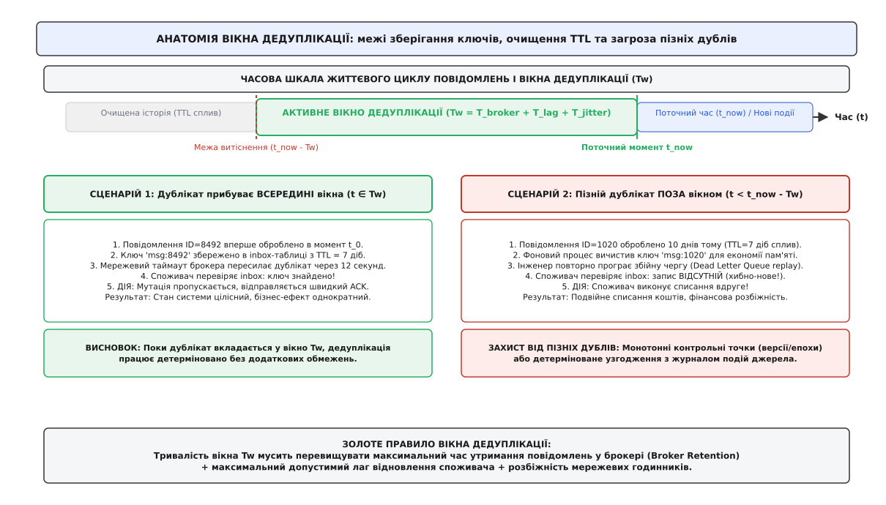
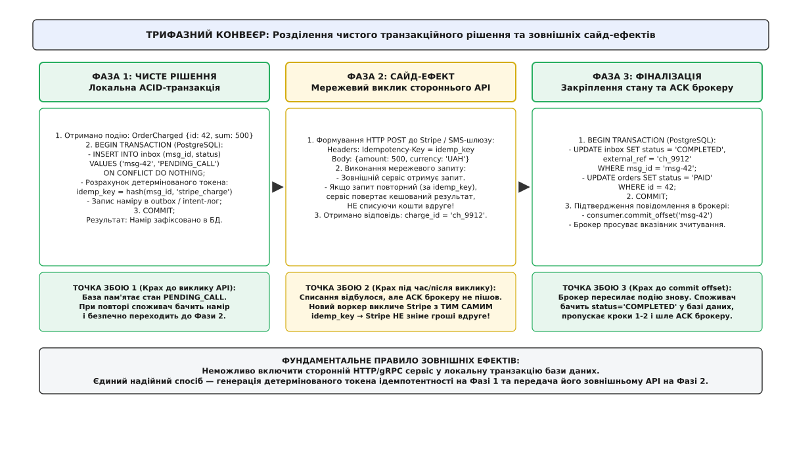
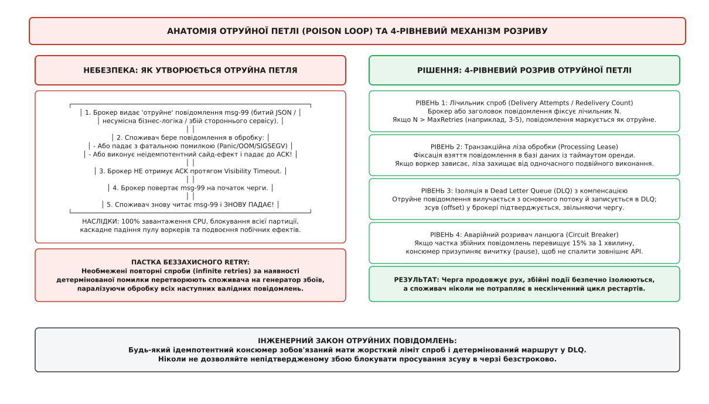
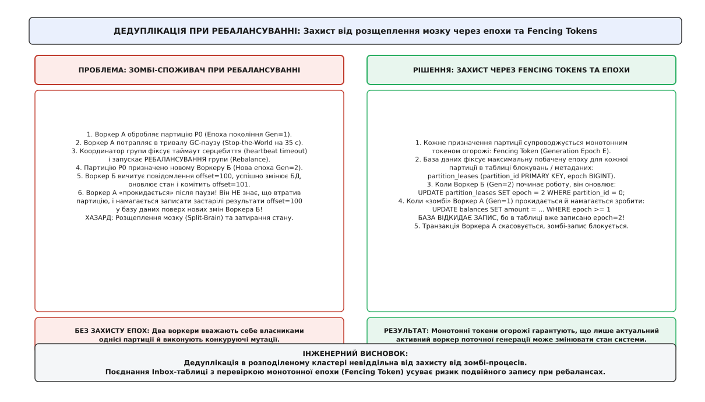

# Ідемпотентні консюмери: глибокі патерни надійності

<preknowlist>
- [Ідемпотентність](root:sf-distributed/idempotency) — алгебраїчна властивість операції зберігати однаковий кінцевий стан системи при довільній кількості повторних викликів.
- [Вхідна скринька (inbox)](root:sf-distributed/inbox-pattern) — патерн атомарного збереження ідентифікатора вхідного повідомлення та бізнес-змін у межах однієї локальної транзакції бази даних.
- [Гарантії доставки](root:sf-distributed/delivery-guarantees) — семантика «щонайменше один раз» (at-least-once) у розподілених чергах і журналах подій та неминучість дублювання пакетів.
- [Transactional outbox](root:sf-distributed/outbox-pattern) — гарантована публікація вихідних подій через проміжну таблицю бази даних для усунення проблеми подвійного запису.
- [Таймаути й бюджет часу](root:sf-distributed/timeouts-deadlines) — невизначеність результату мережевого запиту при спливанні граничного часу очікування відповіді.
- [Повторні спроби (retries)](root:sf-distributed/retries-backoff) — алгоритми повторного надсилання запитів з експоненційним відкладенням і випадковим джитером.
- [Отруйні повідомлення](root:sf-distributed/poison-message) — механіка ізоляції некоректних повідомлень, що спричиняють аварійне завершення обробника.
</preknowlist>

У високошвидкісному платіжному мікросервісі обробник черги повідомлень отримує подію `OrderChargeRequested` з ідентифікатором замовлення № 84912 на суму 2500 гривень. Воркер успішно надсилає мережевий HTTP-запит до стороннього платіжного шлюзу Stripe, отримує підтвердження успішного списання коштів із кодом `200 OK` і готується зафіксувати статус у локальній базі даних та надіслати підтвердження зсуву (ACK, від англійського *acknowledgement* — підтвердження отримання) брокеру повідомлень. Проте за дві мілісекунди до запису в базу даних операційна система аварійно зупиняє контейнер через перевищення ліміту оперативної пам'яті (Out-Of-Memory Killer). Брокер фіксує втрату зв'язку з воркером, очікує завершення таймауту непідтвердженого повідомлення і пересилає те саме повідомлення іншому екземпляру споживача.

Новий споживач вичитує подію з черги, бачить абсолютно чистий локальний стан у своїй базі даних і знову викликає API шлюзу Stripe. Якщо виклик стороннього сервісу не захищений детермінованим ключем ідемпотентності, шлюз виконує списання вдруге, знімаючи з картки клієнта вже 5000 гривень замість 2500. Якщо ж під час масового мережевого збою сотні воркерів одночасно перезапускаються, система породжує лавину повторних списань на мільйони гривень.

Цей збій викриває фундаментальну межу базового патерну Transactional Inbox: збереження повідомлення в локальній базі даних захищає виключно локальний стан. Щойно обробка вимагає виклику зовнішніх сторонніх систем, відправлення повідомлень в інший несинхронізований брокер або керування фізичними виконавчими механізмами, наївна дедуплікація руйнується. Щоб побудувати по-справжньому стійкий розподілений консюмер, необхідно вирішити чотири нетривіальні інженерні проблеми: керування обмеженим вікном дедуплікації, ізоляція незворотних зовнішніх побічних ефектів, розрив аварійних отруйних петель та захист від зомбі-воркерів під час ребалансування черги.

## Анатомія вікна дедуплікації (The Dedup Window)

Найперша ілюзія розробника розподілених систем — це припущення, що споживач може зберігати ідентифікатори всіх побачених повідомлень вічно.

Розглянемо систему обробки подій із середнім навантаженням 10 000 повідомлень на секунду. Якщо записувати кожен 128-бітний ідентифікатор події (UUIDv4 або UUIDv7) разом із міткою часу та індексом у таблицю бази даних, за один рік накопичується гігантський масив ключів:

```
10 000 msg/s · 86 400 s/день · 365 днів = 315 360 000 000 повідомлень (315.36 млрд)
```

При середньому розмірі одного індексованого запису в 120 байтів загальний обсяг лише таблиці дедуплікації перевищить 37 терабайтів. Деревоподібні індекси (B-Tree) такого розміру перестають вміщатися в оперативну пам'ять сервера (`buffer pool`), глибина індексу зростає, а кожна перевірка нового повідомлення вимагає кількох операцій випадкового читання з диска (Random I/O), уповільнюючи пропускну здатність консюмера в десятки разів.

Звідси випливає фундаментальна необхідність обмеження історії: споживач зобов'язаний підтримувати ковзне **вікно дедуплікації** (Deduplication Window, `T_w`), витісняючи застарілі ключі після закінчення терміну їхньої актуальності (TTL, від англійського *Time-To-Live* — час життя).


*Анатомія вікна дедуплікації: поки дублікат надходить у межах активного вікна Tw, споживач детерміновано відсікає повтор. Пізній дублікат після спливання TTL ризикує спричинити подвійну мутацію, що вимагає узгодження вікна з політикою зберігання брокера.*

### Межі безпечного вікна та розрахунок тривалості

Розмір вікна `T_w` не може обиратися довільно. Якщо зробити вікно занадто коротким (наприклад, 10 хвилин), виникає явище **прориву дедуплікації** (Deduplication Leak):
1. Повідомлення успішно обробляється в момент часу `t_0`.
2. Через падіння споживчого кластера або накопичення великого відставання (Consumer Lag) черга зупиняється на 2 години.
3. Коли воркери піднімаються, брокер пересилає старе повідомлення знову.
4. Ключ у таблиці дедуплікації вже знищений фоновим процесом очищення.
5. Споживач вважає подію абсолютно новою і виконує неідемпотентну дію вдруге.

Щоб гарантувати математичну безпеку системи, тривалість вікна дедуплікації `T_w` повинна суворо перевищувати суму максимального часу зберігання повідомлень у брокері, пікового лагу споживача та часу повного аварійного відновлення системи:

```
T_w ≥ T_broker_retention + T_max_lag + T_disaster_recovery + Δ_clock_skew
```

Якщо брокер Apache Kafka налаштований на утримання логів протягом 7 діб (`log.retention.hours = 168`), то вікно дедуплікації споживача зобов'язане становити щонайменше 8–9 діб. Строгі математичні моделі розрахунку ймовірності пропуску пізніх дублікатів та оптимізації пам'яті наведено у [математичному аналізі вікна дедуплікації](root:sf-distributed/idempotent-consumers-deep/math-dedup-window-sizing.md).

### Архітектура дворівневого ковзного вікна

Щоб поєднати тривале вікно зберігання (дні та тижні) з мікросекундною швидкістю перевірки дублікатів, застосовують дворівневу гібридну схему:

* **Рівень L1 (Оперативна пам'ять — In-Memory Sliding Filter):**
  Використовує генераційний фільтр Блума (Generational Bloom Filter) або фільтр Зозулі (Cuckoo Filter), розбитий на 3–5 часових поколінь. Фільтр займає лічені сотні мегабайтів RAM і за час `O(1)` відсікає 99.9% повторних звернень без жодного звернення до бази даних. Кожні `T_w / (G - 1)` годин найстаріше покоління фільтра просто очищується в пам'яті, реалізуючи плавне витіснення без блокувань.

* **Рівень L2 (Транзакційне реляційне сховище — Persistent Inbox Table):**
  Таблиця в PostgreSQL або розподіленій базі даних, секціонована за часом (Range Partitioning по полю `created_at` на кожен день). Секціонування дозволяє видаляти застарілі ключі цілими добовими блоками через миттєву команду `DROP TABLE partition_2026_08_10;`, повністю уникаючи важких операцій `DELETE WHERE created_at < NOW() - INTERVAL '7 days'`, які спричиняють фрагментацію таблиць (Table Bloat) та перевантаження збирача сміття (Vacuum).

Застосування виключно зовнішніх key-value сховищ (наприклад, Redis з індивідуальними `TTL` на кожен ключ через команду `SET key val EX 86400 NX`) для ролі L2 є небезпечною практикою. Якщо споживач впаде між записом у Redis та комітом у базу даних, виникає розрив атомарності: ключ у Redis є, а стан у базі відсутній, що призводить до тихої втрати повідомлення при повторі. Тому L2 зобов'язаний знаходитися в тому самому транзакційному ядрі, що й доменні дані сервісу.

### Захист від пізніх дублікатів при ручному переграванні (DLQ Replay)

Особливий випадок прориву дедуплікаційного вікна настає під час ліквідації наслідків великих аварій, коли інженери виконують повторне програвання повідомлень із черги мертвих листів (DLQ Replay) через 2–3 тижні після первинного збою. Оскільки вікно `T_w` (наприклад, 9 діб) уже закінчилося, всі переграні повідомлення будуть сприйняті системою як абсолютно нові.

Для запобігання цій аварії використовують **монотонні версійні контрольні точки** (Entity Version Watermarks):
Кожен агрегат у доменній моделі містить монотонний числовий номер версії (`version`). Кожна подія несе очікувану версію `expected_version`. При виконанні транзакції база даних перевіряє умову:

```sql
UPDATE orders
SET status = 'PAID', version = version + 1
WHERE id = 42 AND version = 3;
```

Якщо під час перегравання застаріле повідомлення намагається виконати зміну поверх агрегату, який уже перейшов на версію `version = 10`, умова `version = 3` повертає нуль оновлених рядків. Транзакція безпечно ігнорується, захищаючи систему навіть у тих випадках, коли вікно дедуплікації `T_w` давно вичерпано.

## Розділення чистого рішення й зовнішніх сайд-ефектів

Найбільш критична помилка проєктування споживачів криється у спробі помістити зовнішній мережевий виклик (HTTP, gRPC, відправка пошти, звернення до платіжного шлюзу) всередину локальної транзакції бази даних:

```
-- НАЇВНА АНТИПАТЕРННА СХЕМА (КАТАСТРОФА ПІД НАВАНТАЖЕННЯМ)
BEGIN;
  SELECT * FROM orders WHERE id = 42 FOR UPDATE;
  -- Виклик зовнішнього REST API Stripe через блокуючий клієнт (1500 мс)
  -- База тримає відкрите з'єднання і лок рядка 1.5 секунди!
  UPDATE orders SET status = 'PAID';
COMMIT;
```

Такий підхід неминуче вбиває систему:
1. **Вичерпання пулу з'єднань:** Будь-яка затримка зовнішнього API на кілька секунд вичерпує пул підключень до бази даних, паралізуючи всю систему.
2. **Неможливість розподіленого відкату:** Якщо після виконання зовнішнього HTTP-запиту база даних впаде на етапі `COMMIT`, база відкотить локальний запис, але зовнішній платіжний шлюз уже безповоротно спише кошти.

Оскільки класичний протокол двофазної фіксації (Two-Phase Commit, 2PC) та стандарт XA довели свою непридатність для хмарних мікросервісів через блокуючу природу координатора (про що детально розповідає [історичний нарис еволюції ідемпотентності](root:sf-distributed/idempotent-consumers-deep/hist-idempotent-messaging-evolution.md)), єдиним життєздатним рішенням є **трифазний конвеєр обробки з ізоляцією сайд-ефектів**.


*Трифазний конвеєр: Phase 1 резервує намір та генерує стабільний токен у локальній БД; Phase 2 транслює токен зовнішньому API; Phase 3 атомарно закріплює фінальний результат.*

### Три фази ідемпотентного конвеєра

Уся робота споживача розбивається на три суворо розмежовані стадії:

```
┌─────────────────────────────────────────────────────────────────────────────┐
│ 1. ФАЗА 1 (Чисте рішення):                                                  │
│    BEGIN TRANSACTION;                                                       │
│      INSERT INTO consumer_inbox (msg_id, status, outbound_key)              │
│      VALUES ('evt-101', 'PENDING_CALL', SHA256('evt-101:charge'))           │
│      ON CONFLICT DO NOTHING;                                                │
│    COMMIT;                                                                  │
└──────────────────────────────────────┬──────────────────────────────────────┘
                                       ▼
┌─────────────────────────────────────────────────────────────────────────────┐
│ 2. ФАЗА 2 (Зовнішній сайд-ефект):                                           │
│    POST https://api.stripe.com/v1/charges                                   │
│    Headers: [ Idempotency-Key: idemp_8f1b9a2c_step1 ]                       │
│    Body: { amount: 2500, currency: "uah" }                                  │
│    Response: { charge_id: "ch_99120", status: "succeeded" }                 │
└──────────────────────────────────────┬──────────────────────────────────────┘
                                       ▼
┌─────────────────────────────────────────────────────────────────────────────┐
│ 3. ФАЗА 3 (Фіналізація та коміт):                                           │
│    BEGIN TRANSACTION;                                                       │
│      UPDATE consumer_inbox SET status = 'COMPLETED', ref = 'ch_99120'       │
│      WHERE msg_id = 'evt-101';                                              │
│      UPDATE orders SET status = 'PAID' WHERE id = 42;                       │
│    COMMIT;                                                                  │
│    consumer.commit_offset('evt-101');  -- Підтвердження в брокері           │
└─────────────────────────────────────────────────────────────────────────────┘
```

Розглянемо детальну поведінку системи при аварійному перезапуску воркера на кожному можливому мікросекундному інтервалі:

* **Збій під час або до Фази 1:** Транзакція бази даних автоматично відкочується. Стан бази чистий. Повторне повідомлення почне виконання з Фази 1 з чистого аркуша.
* **Збій між Фазою 1 і Фазою 2 (до виклику API):** У базі зафіксовано намір `PENDING_CALL`. Новий воркер читає повідомлення з черги, бачить збережений стан `PENDING_CALL`, витягує раніше обчислений детермінований токен `outbound_key` і переходить до виконання Фази 2.
* **Збій під час або після Фази 2 (API виконано, але стан не фіналізовано):** Зовнішній сервіс уже списав кошти. Новий воркер прокидається, бачить намір `PENDING_CALL` і повторно викликає Stripe із **абсолютно тим самим детермінованим ключем** `Idempotency-Key`. Шлюз Stripe розпізнає свій власний токен дедуплікації, не списує гроші вдруге, а повертає кешовану успішну відповідь з `charge_id = ch_99120`. Споживач успішно переходить до Фази 3.
* **Збій після Фази 3 до коміту зсуву в брокері:** База даних містить `status = 'COMPLETED'`. Брокер пересилає дублікат через таймаут. Новий воркер бачить статус `COMPLETED`, миттєво пропускає Фази 1 і 2, оновлює зсув брокера і надсилає ACK.

Ця модель докорінно відрізняється від наївного споживання: Фаза 1 перетворює недетермінований зовнішній світ на детерміноване внутрішнє рішення. Ключ для зовнішнього API обчислюється не випадковою функцією `UUID.randomUUID()`, а як криптографічний хеш від ідентифікатора вхідної події та назви кроку `SHA256(inbound_message_id + ":" + step_name)`.

### Рівні ізоляції транзакцій та гонки станів

Під час висококонкурентної паралельної обробки кількох повідомлень одного користувача різними воркерами критично важливо правильно обрати рівень ізоляції транзакцій у базі даних (Transaction Isolation Level).

При стандартному рівні `READ COMMITTED` два воркери, що одночасно обробляють дві різні події над одним рахунком (наприклад, списання коштів та зміна кредитного ліміту), можуть зчитати однаковий початковий баланс, що призведе до аномалії втраченого оновлення (Lost Update). Щоб усунути цю проблему, оновлення рядка агрегату повинно використовувати або оптимістичне блокування за версією (`WHERE version = :v`), або явне блокування рядка на час Фази 3:

```sql
SELECT balance FROM accounts WHERE user_id = 42 FOR UPDATE;
UPDATE accounts SET balance = balance - 2500 WHERE user_id = 42;
```

Використання `SELECT FOR UPDATE` виключно на короткій Фазі 3 (яка триває менше 2 мілісекунд) повністю усуває гонки без ризику тривалого блокування з'єднань під час очікування зовнішнього API.

### Взаємодія з патерном Transactional Outbox

Якщо результатом обробки вхідного повідомлення є публікація нової події в інший топік брокера (патерн *consume-transform-produce*), відправка вихідного повідомлення безпосередньо в мережевий сокет брокера на Фазі 3 знову створила б ризик подвійного запису.

Тому Фаза 3 обов'язково комбінується з патерном Transactional Outbox:
В тій самій транзакції, де статус вхідного повідомлення переводиться в `COMPLETED` і змінюються доменні сутності, вихідна подія записується в локальну таблицю `outbox_events`. Окремий фоновий процес вичитує outbox і публікує події в цільовий брокер з гарантією доставки *at-least-once*. Таким чином, і вхідний, і вихідний інтерфейси мікросервісу стають абсолютно захищеними від мережевих розривів. Повну реалізацію цього конвеєра мовами Go та C++ наведено у [проєктному розборі відмовостійкого споживача](root:sf-distributed/idempotent-consumers-deep/proj-resilient-idempotent-consumer.md).

## Отруйна петля (Poison Loop) та механіка розриву

Коли обробник черги стикається з повідомленням, яке спричиняє неперехоплену системну помилку (Null Pointer Exception, зациклення, переповнення пам'яті OOM, збій валідації схеми або 4xx-помилку стороннього API), виникає катастрофічне явище — **отруйна петля** (Poison Loop / Poison Pill).

### Як утворюється отруйна петля

Механізм аварії розвивається за замкненим циклом:
1. Споживач отримує з черги «отруйне» повідомлення `msg-99`.
2. Під час виконання воркер зазнає паніки або аварійного завершення (SIGSEGV/SIGKILL).
3. Оскільки процес загинув до відправки квитанції, брокер фіксує спливання таймауту видимості (Visibility Timeout у SQS/RabbitMQ або відсутність `commitSync` у Kafka).
4. Брокер вважає повідомлення необробленим і повертає його назад у чергу.
5. Наступний вільний воркер знову вичитує `msg-99`, знову падає і знову повертає повідомлення брокеру.


*Анатомія отруйної петлі: безконтрольні повтори блокують чергу та перевантажують воркери. 4-рівневий контур автоматично ізолює збійне повідомлення в DLQ та відновлює рух черги.*

Якщо в черзі утворюється навіть одне таке повідомлення, воно здатне за лічені хвилини покласти весь пул воркерів, заблокувати просування всієї партиції та вивести з ладу сервіс.

Особливо небезпечна отруйна петля у поєднанні з неідемпотентними сайд-ефектами: якщо воркер щоразу встигає викликати сторонній платіжний сервіс без ключа ідемпотентності, а падає на наступному рядку через баг у коді логування, кожна ітерація петлі списуватиме гроші з клієнта знову і знову.

### Чотирирівневий контур розриву петлі

Для надійного захисту від отруйних петель споживач проєктується з багатоешелонною системою безпеки:

1. **Лічильник спроб доставки (Delivery Attempt Tracking):**
   Сучасні брокери передають лічильник спроб у метаданих повідомлення (наприклад, заголовок `ApproximateReceiveCount` в AWS SQS або `redelivered` у RabbitMQ). Якщо брокер не підтримує нативний облік (як базова Kafka), лічильник спроб фіксується в таблиці `consumer_inbox` атомарною операцією:
   ```sql
   INSERT INTO consumer_inbox (message_id, delivery_attempts)
   VALUES ('msg-99', 1)
   ON CONFLICT (consumer_group, message_id) DO UPDATE
   SET delivery_attempts = consumer_inbox.delivery_attempts + 1;
   ```

2. **Транзакційні лізи обробки (Processing Leases):**
   При взятті повідомлення в роботу воркер фіксує в базі часову мітку оренди `lease_expires_at = NOW() + INTERVAL '30 seconds'`. Якщо воркер зависає, інший воркер має право перехопити обробку лише після закінчення терміну оренди, що усуває гонку за стан між живим і повільним воркерами.

3. **Евакуація в Dead Letter Queue (DLQ) з автоматичним підтвердженням:**
   Якщо кількість спроб перевищує встановлений поріг (`attempts > MAX_ATTEMPTS`, зазвичай 3–5), консюмер припиняє повтори. Повідомлення разом із повним стеком помилки записується в ізольовану чергу мертвих листів (DLQ), статус в inbox переводиться в `QUARANTINED`, а зсув у брокері **підтверджується (ACK)**. Це розриває смертельну петлю і дозволяє консюмеру продовжити обробку валідних повідомлень, що стоять у черзі позаду.

4. **Аварійний розривач ланцюга (Circuit Breaker):**
   Якщо частка повідомлень, що потрапляють у DLQ, перевищує 15–20% за останні 60 секунд, це свідчить про системну аварію (несумісна зміна схеми даних або падіння бази даних). У цьому випадку консюмер тимчасово призупиняє вичитку черги (`consumer.pause()`), запобігаючи масовому відправленню валідних подій у карантин.

Повна специфікація схеми бази даних, статусів та контрактів карантину представлена у [довіднику інтерфейсів та схем ідемпотентного консюмера](root:sf-distributed/idempotent-consumers-deep/api-idempotent-consumer-contracts.md).

## Дедуплікація при зміні топології, шардингу та ребалансуванні

У розподілених системах топологія споживачів постійно змінюється: масштабування вузлів (Auto-Scaling), розгортання нових версій (Rolling Deployments), падіння окремих серверів або планове перезавантаження кластера спричиняють **ребалансування групи споживачів** (Consumer Group Rebalance).

Під час ребалансу виникає вкрай небезпечна ситуація — поява **зомбі-воркера** (Zombie Worker) та стан розщеплення мозку (Split-Brain).


*Дедуплікація при ребалансуванні: зомбі-воркер після тривалої GC-паузи намагається зберегти застарілі зміни. Монотонний Fencing Token у базі даних відкидає запис старої епохи.*

### Сценарій зомбі-воркера

1. Воркер А вичитує партицію `P0` топіка Kafka у складі генерації групи `Generation = 1`.
2. Воркер А отримує повідомлення з `offset = 100` і починає його обробку.
3. Процес Воркера А потрапляє у тривалу паузу збирача сміття (Full GC Stop-the-World) або відчуває тимчасове зависання дискового вводу-виводу на 40 секунд.
4. Координатор групи Kafka не отримує періодичних сигналів життя (Heartbeats) від Воркера А протягом `max.poll.interval.ms` (наприклад, 30 с), виключає його з групи та ініціює ребалансування.
5. Партицію `P0` призначено новому Воркеру Б у складі нової генерації `Generation = 2`.
6. Воркер Б вичитує те саме повідомлення `offset = 100`, успішно виконує транзакцію в базі даних, фіксує статус `COMPLETED` і підтверджує зсув `offset = 101`.
7. **Воркер А прокидається після паузи!** Він ще не знає, що координатор позбавив його партиції, і намагається виконати запис у базу даних зі своїми застарілими результатами поверх свіжих даних Воркера Б.

Якщо база даних не захищена від застарілих записів, споживач отримує розсинхронізацію стану, подвійні побічні ефекти або затирання актуальних даних старими.

### Протоколи ребалансування: Eager проти Cooperative Sticky

Класичний протокол ребалансування в Apache Kafka — **Eager Rebalance** (Жадібне ребалансування) — вимагав від усіх воркерів групи одночасно відмовитися від усіх своїх партицій, скинути локальні буфери та очікувати повного перерозподілу. Це спричиняло явище «Stop-The-World для всієї черги» (Global Consumer Group Pause), різкий стрибок навантаження на базу даних під час масового скидання транзакцій та хвилю таймаутів.

Починаючи з версії Apache Kafka 2.4 (KIP-429), впроваджено протокол **Cooperative Sticky Assignor** (Кооперативний липкий розподілювач). Він виконує перерозподіл інкрементально: воркери продовжують обробляти свої стабільні партиції без зупинки, а відкликаються лише ті окремі партиції, які безпосередньо мігрують на інший вузол.

Проте навіть кооперативне ребалансування не захищає від мережевих розривів: якщо воркер фізично ізольований мережевим розділенням (Network Partition), він продовжує вважати себе власником партиції до закінчення локального таймера `max.poll.interval.ms`. Тому наявність токенів огорожі на рівні бази даних залишається обов'язковою за будь-якого протоколу брокера.

### Захист через токени огорожі (Fencing Tokens) та епохи

Щоб унеможливити виконання дій зомбі-процесами, використовують механізм **монотонних токенів огорожі** (Fencing Tokens, від англійського *fence* — паркан, огорожа):

1. **Фіксація епохи партиції:**
   У базі даних створюється службова таблиця `partition_epoch_fences`:
   ```sql
   CREATE TABLE partition_epoch_fences (
       topic VARCHAR(128) NOT NULL,
       partition_id INTEGER NOT NULL,
       current_epoch BIGINT NOT NULL,
       owner_worker_id VARCHAR(128) NOT NULL,
       PRIMARY KEY (topic, partition_id)
   );
   ```

2. **Оновлення епохи при призначенні партиції:**
   Коли Воркер Б отримує партицію при ребалансі, він отримує від брокера монотонний номер генерації групи (`Generation ID`) і виконує транзакційне захоплення:
   ```sql
   INSERT INTO partition_epoch_fences (topic, partition_id, current_epoch, owner_worker_id)
   VALUES ('orders_topic', 0, 2, 'worker-B')
   ON CONFLICT (topic, partition_id) DO UPDATE
   SET current_epoch = EXCLUDED.current_epoch,
       owner_worker_id = EXCLUDED.owner_worker_id
   WHERE EXCLUDED.current_epoch > partition_epoch_fences.current_epoch;
   ```

3. **Верифікація епохи при кожній бізнес-мутації:**
   Будь-яка транзакція фіналізації бізнес-даних або запису в inbox зобов'язана перевіряти відповідність своєї епохи поточному значенню в таблиці огорожі:
   ```sql
   UPDATE orders SET status = 'PAID'
   WHERE id = 42
     AND EXISTS (
       SELECT 1 FROM partition_epoch_fences
       WHERE topic = 'orders_topic'
         AND partition_id = 0
         AND current_epoch = 1  -- Епоха Воркера А
     );
   ```

Коли «зомбі» Воркер А прокидається і намагається виконати оновлення з застарілою епохою `current_epoch = 1`, умова `EXISTS` повертає нуль рядків, оскільки Воркер Б уже підвищив епоху до `2`. Транзакція Воркера А скасовується без будь-яких наслідків для цілісності бази даних.

### Локальна проти глобальної дедуплікації при репартиціюванні

Ще один критичний виклик виникає при зміні кількості партицій у топіку або зміні ключів шардингу (Partition Keys):

* **Партиційно-локальна дедуплікація (Partition-Local Dedup):**
  Якщо повідомлення одного агрегату (наприклад, замовлення одного клієнта) гарантовано потрапляють в одну й ту саму партицію завдяки хешуванню `hash(customer_id) % num_partitions`, кожна партиція може оброблятися повністю автономно без міжпартиційних блокувань. Це забезпечує максимальну лінійну масштабованість системи.
* **Глобальна дедуплікація (Cross-Partition Global Dedup):**
  Якщо через зміну кількості партицій (наприклад, збільшення з 16 до 32) або аварійний round-robin retry продюсера дублікат повідомлення потрапляє в **іншу** партицію, партиційно-локальний облік пропускає повтор. У таких топологіях таблиця `consumer_inbox` зобов'язана мати глобальний первинний ключ `PRIMARY KEY (message_id)` у єдиному кластері бази даних або розподіленому сховищі, поєднуючи перевірку унікальності з шардованими транзакціями.

## Комплексний наскрізний сценарій відновлення після збоїв

Для наочного закріплення всіх чотирьох захисних контурів простежимо поведінку виробничого кластера під час реальної каскадної аварії:

1. **Нормальний потік (Подія 1):** Воркер 1 вичитує подію `OrderCreated`, успішно проходить Фази 1–3, здійснює бізнес-мутацію і підтверджує зсув у брокері за 14 мілісекунд.
2. **Падіння після сайд-ефекту (Подія 2):** Воркер 1 виконує списання в Stripe на Фазі 2, але падає через апаратне перезавантаження ноди Kubernetes. Воркер 2 після завершення таймауту оренди перехоплює повідомлення, повторно надсилає запит до Stripe із тим самим детермінованим `Idempotency-Key`, отримує збережену квитанцію без списання нових грошей і завершує Фазу 3.
3. **Отруйне повідомлення (Подія 3):** Надходить повідомлення з некоректним числовим форматом, що спричиняє паніку в коді обчислення знижки. Після трьох невдалих спроб лічильник `delivery_attempts` досягає значення 4, запис маркується як `QUARANTINED`, відправляється в DLQ, а брокер отримує підтвердження зсуву. Потік розблоковано.
4. **Зомбі-воркер при ребалансуванні (Подія 4):** Воркер 1 зависає у GC-паузі на 45 секунд. Координатор Kafka перепризначає партицію Воркеру 2 з епохою `Generation = 2`. Воркер 2 успішно записує нову епоху в `partition_epoch_fences`. Коли Воркер 1 прокидається, його транзакція відхиляється базою даних через застарілу епоху.
5. **Пізній повтор із DLQ (Подія 5):** Через 20 днів інженер виправляє баг у коді розрахунку знижки і запускає повторну вичитку з DLQ. Оскільки вікно дедуплікації `T_w` (9 діб) минуло, дедуплікаційна таблиця вже очищена, але перевірка монотонної версії агрегату `WHERE version = expected_version` унеможливлює повторне застосування знижки до вже закритих замовлень.

## Архітектурний синтез і проектування виробничих консюмерів

Побудова надійного ідемпотентного консюмера в сучасній розподіленій інфраструктурі — це багаторівневий інженерний компроміс між затримкою (Latency), обсягом сховища (Storage Overhead) та гарантіями узгодженості (Consistency Guarantees).

```
┌─────────────────────────────────────────────────────────────────────────────┐
│                    ПОВНИЙ КОНТУР НАДІЙНОГО СПОЖИВАЧА                        │
├─────────────────────────────────────────────────────────────────────────────┤
│ 1. ВХІДНИЙ ПОТІК      : Брокер подій (Kafka / SQS / RabbitMQ / NATS)        │
│                         └─► Заголовки: Idempotency-Key, Correlation-Id      │
├─────────────────────────────────────────────────────────────────────────────┤
│ 2. L1 ФІЛЬТРАЦІЯ      : In-Memory Generational Bloom / LRU Filter           │
│                         └─► Відсікає 99.9% повторів за мікросекунди         │
├─────────────────────────────────────────────────────────────────────────────┤
│ 3. L2 ТРАНЗАКЦІЙНІСТЬ : Трифазний конвеєр у реляційній базі даних           │
│                         ├─► Фаза 1: Резервування наміру + токен для API     │
│                         ├─► Фаза 2: Виклик стороннього сервісу з токеном    │
│                         └─► Фаза 3: Атомарна фіксація стану та inbox        │
├─────────────────────────────────────────────────────────────────────────────┤
│ 4. ВІКНО ЗБЕРІГАННЯ   : Ковзний TTL Tw ≥ T_retention + T_lag + T_recovery   │
│                         └─► Секціонування таблиць (Range Partitions)        │
├─────────────────────────────────────────────────────────────────────────────┤
│ 5. ЗАХИСТ ВІД ЗБОЇВ   : 4-рівневий контур від отруйної петлі (Poison Break) │
│                         ├─► Лічильник спроб (Delivery Attempts)             │
│                         ├─► Транзакційні лізи (Processing Leases)           │
│                         ├─► Ізоляція в Dead Letter Queue (DLQ)              │
│                         └─► Токени огорожі (Fencing Tokens) при ребалансах  │
└─────────────────────────────────────────────────────────────────────────────┘
```

Повна історія еволюції цих патернів від протоколів XA до сучасних хмарних стандартів зафіксована в [історичній довідці](root:sf-distributed/idempotent-consumers-deep/hist-idempotent-messaging-evolution.md). Математичні формули розрахунку ємності та витоків зібрані у [математичній вставці](root:sf-distributed/idempotent-consumers-deep/math-dedup-window-sizing.md), практичний рушій наведено у [проєктній реалізації](root:sf-distributed/idempotent-consumers-deep/proj-resilient-idempotent-consumer.md), а специфікації заголовків та DDL-схеми — у [довіднику контрактів](root:sf-distributed/idempotent-consumers-deep/api-idempotent-consumer-contracts.md).

### Інженерний чекліст перевірки споживача перед релізом

Перед запуском будь-якого споживача критичних бізнес-подій у промислову експлуатацію перевірте відповідність системи десяти золотим правилам надійності:

1. **Детермінованість ключів:** Ключ для зовнішніх систем розраховується як `hash(message_id + action)`, а не через випадковий `randomUUID()`.
2. **Ізоляція сайд-ефектів:** Жоден мережевий HTTP/gRPC виклик не виконується всередині активної транзакції бази даних.
3. **Узгодженість вікна дедуплікації:** Термін зберігання ключів у таблиці inbox перевищує максимальний термін утримання повідомлень у брокері.
4. **Секціонування історії:** Очищення старих ключів виконується через видалення часових секцій (`DROP PARTITION`), а не через блокуючий масовий `DELETE`.
5. **Жорсткий ліміт спроб:** Кількість спроб обробки обмежена фіксованим числом (3–5), після чого повідомлення безумовно маркується як отруйне.
6. **Наявність DLQ:** Усі непереборні помилки супроводжуються відправкою тіла повідомлення та стеку помилки в Dead Letter Queue з подальшим підтвердженням зсуву (ACK).
7. **Захист від зомбі-процесів:** При ребалансуванні перевіряється монотонний токен епохи (Fencing Token), що блокує застарілі транзакції.
8. **Швидкий перший рівень:** Перед зверненням до дискової бази даних повідомлення перевіряється через швидкий фільтр у пам'яті (Bloom Filter / LRU Cache).
9. **Наскрізне трасування:** Усі вхідні, внутрішні та вихідні виклики містять єдиний заголовок `Correlation-Id` для наскрізного аудиту в OpenTelemetry.
10. **Готовність до повного перегравання:** Система витримує ручне повторне програвання топіка від нульового зсуву (`replay from offset 0`) без спотворення балансів користувачів та повторних фінансових списань.
