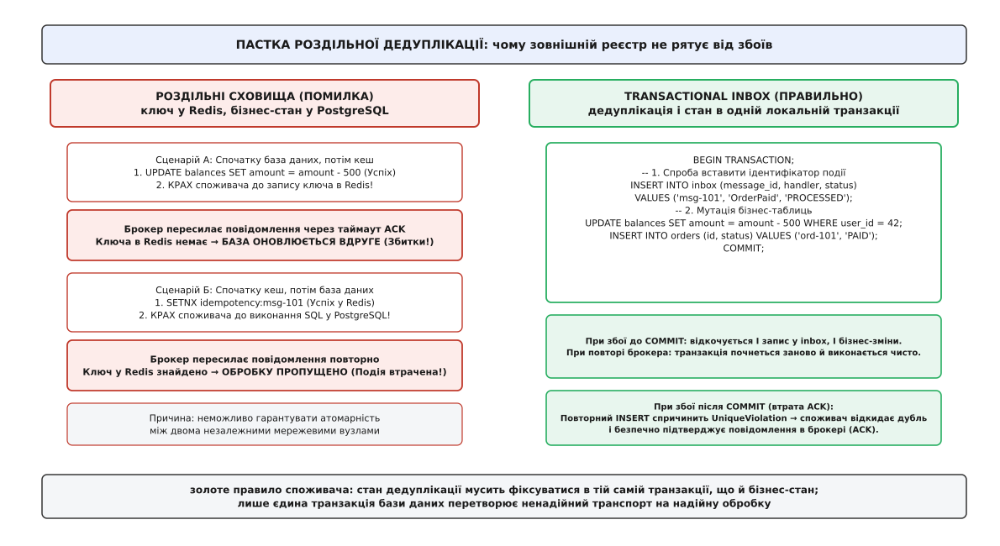
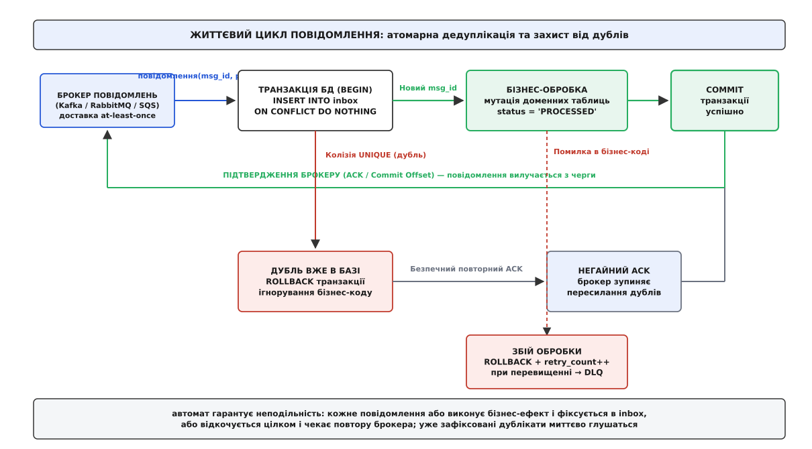
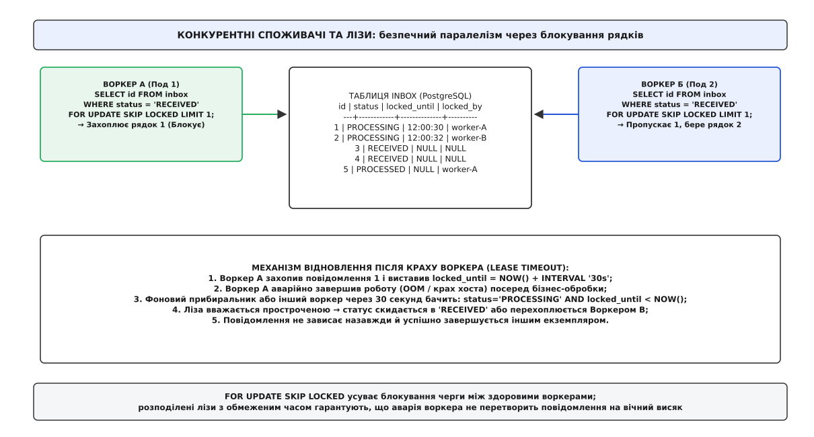
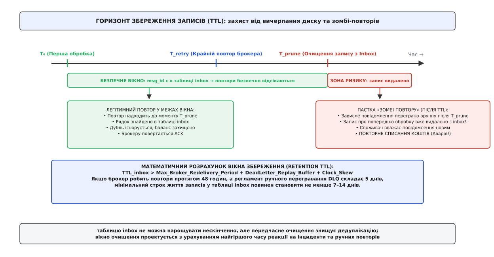
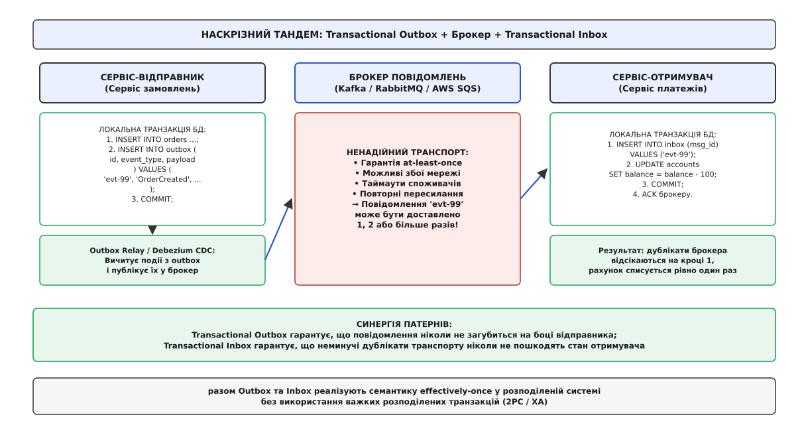

# Патерн «Вхідна скринька» (Transactional Inbox)

<preknowlist>
- [Ідемпотентність](root:sf-distributed/idempotency) — збереження однакового кінцевого стану системи при багаторазовому виконанні однієї й тієї самої операції.
- [Гарантії доставки](root:sf-distributed/delivery-guarantees) — семантика «щонайменше один раз» (at-least-once) та неминучість дублювання мережевих пакетів і повідомлень.
- [Transactional outbox](root:sf-distributed/outbox-pattern) — атомарне збереження вихідних подій у локальній базі даних сервісу перед відправленням у брокер.
- [Черга повідомлень](root:sf-distributed/message-queue) — механіка взаємодії «точка-точка», черги, тайм-аути непідтверджених повідомлень та споживчі квитанції (ACK/NACK).
- [Омани розподілених систем](root:sf-distributed/distributed-fallacies) — ілюзія надійності мережі, наслідки часткових відмов та неможливість безпечного подвійного запису.
</preknowlist>

Розподілена система списує 500 гривень з рахунку клієнта у відповідь на подію успішної оплати замовлення. Споживач вичитує повідомлення з черги брокера, відкриває з'єднання з базою даних, успішно виконує SQL-запит на зменшення балансу користувача, але за мілісекунду до відправлення мережевого підтвердження (ACK) у контейнера вимикається живлення або стається мережевий обрив. Брокер повідомлень не отримує квитанції у встановлений строк, фіксує тайм-аут і за кілька секунд пересилає те саме повідомлення іншому сусідньому вузлу-споживачу. Якщо новий споживач просто візьме й виконає отриманий код знову, з балансу клієнта спишеться вже 1000 гривень замість 500, а фінансовий баланс сервісу втратить узгодженість.

Ця типова аварійна ситуація наочно розкриває базову природу розподіленого обміну повідомленнями: будь-який надійний транспорт (Apache Kafka, RabbitMQ, Amazon SQS, NATS JetStream) через неминучість мережевих збоїв та перезапусків процесів функціонує виключно за правилом доставки «щонайменше один раз» (at-least-once delivery). Якщо прикладний бізнес-код не володіє природною ідемпотентністю (як абсолютне присвоєння значення змінній), йому потрібен надійний, транзакційно строгий механізм дедуплікації на стороні отримувача.

## Неминучість повторів на боці споживача

У розподілених подійно-орієнтованих архітектурах обробка кожного вхідного повідомлення завжди розпадається на три послідовні мережеві фази: отримання повідомлення з брокера, локальна зміна стану в базі даних та повернення підтвердження прочитання (ACK, від англійського *acknowledgement* — підтвердження отримання):

```
1. Брокер ────────► Споживач : Повідомлення (Event Payload, ID)
2. Споживач ──────► База БД  : Транзакція обробки (BEGIN ... COMMIT)
3. Споживач ──────► Брокер   : Підтвердження (ACK / Offset Commit)
```

Збій у цій послідовності може статися в будь-який момент часу, причому наслідки аварії до і після фіксації транзакції кардинально різняться:

- **Збій до коміту в базі даних:** Споживач отримав повідомлення, почав виконувати бізнес-код, але зазнав краху до команди `COMMIT`. База даних автоматично відкочує незавершену транзакцію. Брокер не отримує підтвердження і після спливання тайм-ауту видимості (Visibility Timeout) передає повідомлення іншому споживачу. Новий споживач починає обробку з чистого аркуша. Тут дублювання не призводить до спотворення стану.
- **Збій після коміту, але до відправлення ACK:** База даних успішно зафіксувала списання коштів або створення замовлення. Проте мережевий сокет до брокера обірвався, або процес споживача був примусово зупинений операційною системою (SIGKILL через нестачу пам'яті OOMKilled). Брокер вважає повідомлення необробленим і відправляє його повторно. Якщо споживач не має пам'яті про минулі дії, операція виконується вдруге.

Спроби усунути цей розрив за допомогою класичного протоколу двофазного узгодження (Two-Phase Commit, 2PC) та розподілених транзакцій стандарту XA зазнали повної поразки в сучасних хмарних системах. Протокол 2PC є блокуючим: якщо координатор транзакцій падає під час фази підготовки, заблоковані рядки в базі даних залишаються недоступними на невизначений термін. Крім того, протокол 2PC створює колосальні затримки через багаторазові мережеві раунди підтверджень і вимагає єдиного простору довіри, що неможливо в незалежних мікросервісах.

Сучасна інженерна практика визнає: транспортний рівень зобов'язаний залишатися асинхронним і дублюючим, а гарантування одноразовості бізнес-ефекту покладається безпосередньо на споживача.

## Пастка роздільної дедуплікації

Найпоширеніша і водночас найнебезпечніша помилка архітектури полягає в спробі створити захист від дублікатів через окреме швидке сховище — наприклад, розподілений кеш Redis або окрему таблицю в іншій службовій базі даних.

Розглянемо детально обидва можливі сценарії реалізації такої роздільної схеми:

**Сценарій А: Спочатку бізнес-мутація в базі, потім запис ключа в кеш.** Споживач успішно зменшує залишок на рахунку в PostgreSQL, але аварійно падає до того, як відправляє команду збереження ідентифікатора повідомлення `SETNX idempotency:msg-101` у Redis. Брокер повідомлень фіксує таймаут квитанції й пересилає дублікат новому воркеру. Новий воркер перевіряє Redis, бачить відсутність ключа, робить висновок, що повідомлення нове, і повторно виконує списання в PostgreSQL. Маємо прямі фінансові збитки через повторне виконання неідемпотентної операції.

**Сценарій Б: Спочатку запис ключа в кеш, потім бізнес-мутація в базі.** Споживач насамперед записує ідентифікатор події в Redis, отримує успішну відповідь, але зазнає збою (наприклад, дедлок або помилка обмеження зовнішнього ключа) під час виконання транзакції в PostgreSQL. Транзакція в базі даних відкочується. Коли брокер надсилає повторну спробу повідомлення, новий воркер знаходить ключ у Redis, хибно вирішує, що дія вже виконана, і надсилає брокеру підтвердження (ACK). У результаті в базі даних гроші так і не списалися, а замовлення назавжди зависло в невизначеному стані.


*Пастка роздільної дедуплікації: будь-який розрив між оновленням бізнес-даних та фіксацією ідентифікатора повідомлення у зовнішньому сховищі призводить або до подвійного списання, або до безповоротної втрати події.*

Ця дилема є прямим наслідком фундаментальної проблеми подвійного запису в розподілених системах: неможливо гарантувати атомарну зміну стану двох незалежних мережевих вузлів без координатора розподілених транзакцій. Звідси випливає непорушний закон споживчої дедуплікації:

> **Закон збереження стану споживача:** Ідентифікатор обробленого повідомлення та доменні бізнес-зміни повинні записуватися в межах однієї й тієї самої локальної ACID-транзакції тієї самої бази даних.

Це правило є концептуальним фундаментом патерну **Вхідна скринька** (Transactional Inbox).

## Анатомія патерну Transactional Inbox

Патерн «Вхідна скринька» переносить гарантію дедуплікації з ненадійного мережевого транспорту в транзакційне ядро споживача. Суть патерну полягає у створенні спеціальної таблиці `inbox` безпосередньо в тій самій базі даних і схемі, де зберігаються бізнес-сутності сервісу.

Кожне вхідне повідомлення повинно мати глобально унікальний ідентифікатор `message_id` (латинське *identificator* — ознака тотожності), який присвоюється відправником (UUIDv4/UUIDv7) або формується як детермінований хеш ключових бізнес-полів події.

При отриманні повідомлення з брокера споживач відкриває локальну транзакцію бази даних і виконує суворо визначений ланцюг неподільних дій:

1. Виконує спробу вставити `message_id` у таблицю `inbox`.
2. Якщо рядок із таким `message_id` уже присутній у таблиці, реляційна СУБД миттєво відхиляє операцію через порушення обмеження унікальності (Unique Constraint). Транзакція переривається або оминає бізнес-блок, а споживач негайно відправляє підтвердження (ACK) брокеру, знаючи, що це повідомлення вже зафіксоване раніше.
3. Якщо вставка в таблицю `inbox` пройшла успішно, у тій самій транзакції виконується прикладний код: оновлюються баланси, резервуються товари на складі або створюються записи в журналі аудиту.
4. Транзакція неподільно фіксується командою `COMMIT`.
5. Лише після успішного коміту транзакції споживач відправляє підтвердження (ACK) брокеру повідомлень.


*Життєвий цикл повідомлення: перевірка унікальності та мутація бізнес-стану відбуваються в неподільній транзакції БД, після чого надсилається підтвердження брокеру.*

Розглянемо поведінку цієї моделі при виникненні типових збоїв:

- **Аварія до COMMIT:** Якщо вузол споживача падає під час виконання SQL-запитів, СУБД автоматично відкочує транзакцію. У базі даних не залишається ні сліду в таблиці `inbox`, ні змін у бізнес-таблицях. Брокер пересилає повідомлення новому воркеру, і той починає обробку з чистого аркуша.
- **Аварія після COMMIT, але до відправлення ACK:** База даних зберегла і бізнес-зміни, і рядок у таблиці `inbox`. Брокер, не отримавши квитанції, надсилає дублікат. Новий воркер починає транзакцію, але вставка в `inbox` зазнає колізії первинного ключа. Воркер розуміє, що повідомлення вже успішно оброблене, не чіпає бізнес-таблиці та спокійно підтверджує повідомлення в брокері (ACK). Повторне списання нейтралізовано.

> 🔧 **Навіщо це.** Завдяки переносу перевірки унікальності в транзакцію бази даних досягається математично точна семантика «фактично один раз» (effectively-once processing): повідомлення може проходити мережею десятки разів, але бізнес-ефект буде застосовано рівно один раз без використання важких блокувань.

Повний опис схеми полів, структури таблиці та скінченного автомата переходів станів наведено в окремій [довідці схеми та станів Inbox](root:sf-distributed/inbox-pattern/api-inbox-storage-schema.md).

## Низькорівнева механіка реляційних СУБД: MVCC, WAL та атомарні конфлікти

Для глибокого розуміння продуктивності вхідної скриньки необхідно простежити, що саме відбувається на рівні дискової підсистеми та журналів СУБД під час виконання дедуплікації.

У сучасних реляційних базах даних із багатоверсійною організацією пам'яті (Multi-Version Concurrency Control, MVCC), таких як PostgreSQL або MySQL InnoDB, виконання запиту `INSERT INTO inbox_messages ... ON CONFLICT (message_id) DO NOTHING` працює без залучення важких табличних замків.

Процес виконання запиту розпадається на такі мікрокроки:

1. **Пошук за B-деревом унікального індексу:** СУБД виконує спуск за B-деревом індексу первинного ключа за `O(log N)` дискових або кешованих операцій читання сторінок.
2. **Атомарне встановлення блокування рядка (Row-level Lock):** Якщо ключ відсутній, рушій резервує місце в сторінці даних (heap page), вставляє заголовок кортежу (tuple header) з поточним номером транзакції `xmin` і додає посилання на нього в індексний листок B-дерева.
3. **Запис у журнал випереджального запису (Write-Ahead Log, WAL):** Запис про створення кортежу потрапляє в буфер WAL. При виклику `COMMIT` буфер скидається на диск (fsync), що гарантує збереження факту обробки навіть при раптовому знеструмленні сервера.
4. **Обробка колізії без відкату транзакції:** Якщо ключ уже існує, механізм `ON CONFLICT DO NOTHING` просто повертає нульову кількість змінених рядків (`rows_affected = 0`), не генеруючи внутрішній виняток СУБД (як це робить звичайний `UniqueViolation`). Це надзвичайно важливо, оскільки в PostgreSQL виникнення необробленого SQL-винятку переводить поточну транзакцію у стан помилки (`current transaction is aborted, commands ignored until end of transaction block`), що унеможливлює виконання подальших запитів без повного `ROLLBACK`.

Завдяки конструкції `ON CONFLICT` перевірка дубліката виконується як звичайний швидкий пошук у пам'яті без руйнування транзакційного контексту.

## Два режими роботи: Синхронний та Асинхронний Inbox

Залежно від вимог до пропускної здатності, латентності та складності бізнес-операцій патерн вхідної скриньки реалізують у двох архітектурних конфігураціях: синхронному прямому (Inline Inbox) та двоетапному буферизованому (Staged / Decoupled Inbox).

### 1. Синхронний Inbox (Inline Inbox)

У синхронному варіанті вичитування з черги, дедуплікація та бізнес-логіка виконуються безпосередньо в обробнику події в одному потоці виконання:

```sql
BEGIN TRANSACTION;

-- 1. Спроба вставити ідентифікатор повідомлення
INSERT INTO inbox_messages (message_id, event_type, status, processed_at)
VALUES ('evt-84920', 'OrderPaid', 'PROCESSED', NOW())
ON CONFLICT (message_id) DO NOTHING;

-- Якщо рядок не вставився (rows_affected == 0), це дублікат:
-- негайно робимо COMMIT або ROLLBACK і шлемо ACK брокеру.

-- 2. Виконання бізнес-мутації
UPDATE accounts SET balance = balance - 500 WHERE user_id = 42;
INSERT INTO ledger (order_id, amount) VALUES ('ord-99', 500);

COMMIT;
```

**Переваги:** Мінімальна затримка реакції (latency) — бізнес-ефект настає миттєво після прийому повідомлення; повна відсутність додаткових фонових процесів, диспетчерів чи внутрішніх черг.

**Обмеження:** Якщо виконання бізнес-логіки займає багато часу або блокує численні таблиці, транзакція утримується відкритою, створюючи навантаження на пул з'єднань СУБД. Режим непридатний, якщо обробка вимагає виклику сторонніх зовнішніх HTTP/gRPC сервісів.

### 2. Асинхронний буферизований Inbox (Staged Inbox)

Якщо вхідний потік повідомлень надзвичайно високий або обробка займає значний час, прийом повідомлень та їх виконання розділяють на два незалежні етапи:

- **Етап прийому (Ingress Stage):** Споживач вичитує повідомлення з брокера, швидко вставляє його в таблицю `inbox_messages` зі статусом `RECEIVED` і сирим тілом (`payload`), після чого негайно підтверджує повідомлення в брокері (ACK). Ця операція триває 1–2 мілісекунди, що дозволяє швидко вичищати чергу брокера.
- **Етап фонової обробки (Worker Stage):** Окремий пул процесів-воркерів опитує таблицю `inbox_messages`, конкурентно вибирає нерозглянуті завдання, виконує доменну логіку та переводить статус у `PROCESSED`.

Такий поділ перетворює таблицю бази даних на буфер вирівнювання навантаження (Load Leveling) та надійно ізолює внутрішні підсистеми від пікових сплесків вхідного трафіку.

## Конкурентність, блокування та розподілені лізи

Коли в системі одночасно працює кілька паралельних екземплярів сервісу-споживача (наприклад, пул подів у кластері Kubernetes), виникає задача координації: як гарантувати, що кілька незалежних воркерів не схоплять одне й те саме повідомлення з таблиці `inbox` одночасно?

Просте виконання запиту `SELECT * FROM inbox_messages WHERE status = 'RECEIVED'` призведе до того, що всі паралельні воркери зчитають однакові рядки, почнуть паралельно виконувати ту саму роботу та зіткнуться з конфліктами блокувань і взаємними блокуваннями (дедлоками).

### Блокування вибірки через SKIP LOCKED

У сучасних реляційних базах даних (PostgreSQL 9.5+, MySQL 8.0+, Oracle) цю задачу вирішує механізм `FOR UPDATE SKIP LOCKED`. Він дозволяє воркеру заблокувати порцію рядків і водночас наказує іншим воркерам пропускати вже зайняті рядки без очікування:

```sql
WITH target_batch AS (
    SELECT message_id
    FROM inbox_messages
    WHERE status = 'RECEIVED'
    ORDER BY created_at ASC
    LIMIT 10
    FOR UPDATE SKIP LOCKED
)
UPDATE inbox_messages m
SET status = 'PROCESSING',
    locked_until = NOW() + INTERVAL '30 seconds',
    locked_by = 'worker-pod-4'
FROM target_batch b
WHERE m.message_id = b.message_id
RETURNING m.message_id, m.payload;
```


*Механіка конкурентної вибірки: вибірка доступних завдань через блокування рядків із пропуском зайнятих унеможливлює стан гонитви між незалежними воркерами.*

### Механізм ліз та захист від зависань (Lease Expiry)

Що станеться, якщо воркер заблокував рядок, перевів його в стан `PROCESSING`, але раптово впав із вичерпанням пам'яті (OOMKilled) посеред виконання? Повідомлення назавжди залишилося б у стані `PROCESSING` і ніколи не було б завершене.

Для усунення цієї вразливості впроваджено концепцію розподіленої **лізи** (lease — тимчасова оренда права на обробку):

1. Воркер встановлює часову мітку завершення лізи: `locked_until = NOW() + INTERVAL '30s'`.
2. Поки триває тривала обробка, воркер періодично надсилає сигнал життєздатності (heartbeat), продовжуючи `locked_until` ще на 30 секунд.
3. Якщо воркер гине, через 30 секунд ліза автоматично стає недійсною.
4. Запит вибірки шукає завдання за розширеною умовою:
   ```sql
   WHERE status = 'RECEIVED' 
      OR (status = 'PROCESSING' AND locked_until < NOW())
   ```
5. Інший живий воркер виявляє прострочену лізу, перехоплює повідомлення й успішно доводить його до кінця.

Повноцінний програмний каркас споживача з управлінням транзакціями та відновленням ліз наведено у [практичній реалізації рушія Transactional Inbox](root:sf-distributed/inbox-pattern/proj-transactional-inbox-engine.md).

## Взаємодія з Apache Kafka та Consumer Group Rebalance

Окремої уваги заслуговує інтеграція вхідної скриньки з розподіленим журналом подій Apache Kafka.

У Kafka споживачі об'єднуються в групи (Consumer Groups), де кожен споживач читає виділений набір розділів (partitions). Якщо один зі споживачів зависає під час тривалої транзакції в базі даних або не викликає вчасно метод `poll()`, координатор групи Kafka фіксує таймаут (`max.poll.interval.ms`) і запускає процедуру перебалансування групи (Group Rebalance).

Під час перебалансування розділ відбирається у повільного споживача і передається новому, здоровому екземпляру.

Якщо споживач використовував автоматичний комміт зміщень (`enable.auto.commit = true`), стається катастрофа: зміщення або зафіксувалося до виконання бізнес-транзакції (втрата події при падінні), або не зафіксувалося взагалі, і новий споживач починає читати ті самі повідомлення повторно.

При використанні Transactional Inbox діє суворий протокол узгодження:

1. Автоматичний комміт зміщень **суворо вимикається** (`enable.auto.commit = false`).
2. Фіксація зміщення в Kafka (`commitSync()` або `commitAsync()`) викликається **виключно після успішного виконання `COMMIT` транзакції бази даних**.
3. Якщо через ребаланс два споживачі одночасно обробляють одне й те саме повідомлення з одного розділу (так званий split-brain споживачів), перший успішно завершує транзакцію в базі даних, а другий миттєво зазнає колізії унікальності в таблиці `inbox` і безпечно скидає дубль без повторної зміни балансу.

## Крайові випадки: отруйні повідомлення, порушення порядку та дедлоки

Експлуатація вхідної скриньки у високонавантажених промислових системах стикається з трьома критичними крайовими випадками.

### 1. Отруйні повідомлення (Poison Messages)

Отруйне повідомлення — це повідомлення з некоректною структурою даних або логічною помилкою, що викликає неперехоплений виняток у бізнес-коді при кожній спробі обробки.

Якщо система налаштована на нескінченний повтор при збоях, виникає нескінченна петля: воркер бере повідомлення → виникає помилка → транзакція відкочується → ліза скидається → інший воркер бере його знову. Черга зупиняється, а ресурси бази даних спалюються марно.

**Рішення:**
- Кожен запис у таблиці `inbox` містить лічильник `retry_count` та поріг `max_retries` (зазвичай 3–5).
- Після кожної невдалої спроби `retry_count` збільшується.
- При перевищенні ліміту повідомлення переводиться у фінальний стан `FAILED` і більше не вибирається регулярними воркерами.
- Одночасно генерується сповіщення для інженерів або запис копіюється в чергу мертвих листів (Dead Letter Queue, DLQ) для ручного аналізу.

### 2. Порушення хронологічного порядку (Out-of-Order Delivery)

Розподілені черги не гарантують суворого глобального порядку доставки між різними розділами чи споживачами. Може виникнути ситуація, коли повідомлення `OrderCancelled` надійде до споживача раніше, ніж повідомлення `OrderCreated`.

Якщо споживач спробує скасувати замовлення, якого ще немає в базі, виникне помилка зовнішнього ключа або порушення цілісності.

**Рішення:**
1. **Ідемпотентні автомати станів:** Доменні таблиці проектуються так, щоб стан міг приймати значення `CANCELLED` навіть для ще не створеної сутності (створення так званого фантомного запису або tombstone). Коли згодом прийде запізніле `OrderCreated`, обробник побачить стан `CANCELLED` і проігнорує створення.
2. **Версіонування сутностей:** Кожне повідомлення містить номер версії агрегату `version` або часову мітку відправника. Якщо `version_incoming <= version_current`, подія відкидається як застаріла.

### 3. Блокування зовнішніх викликів усередині транзакції

Найнебезпечніша пастка для продуктивності — виклик зовнішнього HTTP/gRPC API або відправлення пошти всередині транзакції вхідної скриньки:

```
BEGIN;
INSERT INTO inbox ...;
UPDATE balances ...;
-- КАТАСТРОФА: мережевий виклик стороннього платіжного шлюзу
HTTP_POST("https://external-bank.api/charge"); 
COMMIT;
```

Якщо зовнішній банківський шлюз зависне на 60 секунд, транзакція триматиме блокування рядків у базі даних протягом усієї хвилини. Це вичерпає пул з'єднань СУБД і призведе до каскадної зупинки всього застосунку.

> **Золоте правило транзакційної ізоляції:** Усередині транзакції вхідної скриньки дозволені виключно локальні операції з базою даних. Усі вихідні мережеві взаємодії повинні виконуватися після фіксації або оформлюватися через симетричний патерн [Transactional outbox](root:sf-distributed/outbox-pattern).

## Шардинг бази даних та локальність дедуплікації

Коли сервіс масштабується шляхом горизонтального шардингування бази даних (Database Sharding), таблиці розподіляються між кількома фізичними серверами СУБД за ключем шардингу (`shard_key`, наприклад, `user_id` або `account_id`).

У такій архітектурі критично важливо, щоб таблиця `inbox_messages` була шардована за тим самим ключем, що й доменні бізнес-таблиці.

Якщо повідомлення про зміну балансу користувача `user_42` потрапить на шард 1, а запис у таблицю `inbox` спробують зробити на шарді 2, виникне потреба у розподіленій транзакції між шардами, що знищить продуктивність кластера.

Правильний дизайн шардованої скриньки вимагає:
1. **Колокація даних (Data Colocation):** Кожен шард містить власну локальну таблицю `inbox_messages`.
2. **Маршрутизація вхідних повідомлень:** Відправник або брокер повідомлень використовує той самий ключ шардингу (наприклад, Kafka Message Key = `user_id`), що гарантує доставку всіх подій конкретного користувача на відповідний шард бази даних.
3. **Локальна ізоляція:** Перевірка унікальності `message_id` та мутація балансу виконуються суто локально в межах одного шарда без міжсерверних блокувань.

## Очищення скриньки та горизонт збереження (TTL Retention)

Оскільки таблиця `inbox_messages` фіксує кожне вхідне повідомлення, в активній системі вона щодня накопичує мільйони рядків. Без регулярного очищення таблиця розростається до сотень гігабайтів, розмір індексів B-дерева перевищує обсяг оперативної пам'яті, а швидкість перевірки унікальності деградує.

Для підтримки стабільного розміру застосовують процедуру фонового очищення за строком давності (Time-to-Live, TTL). Проте тут виникає підступна загроза — **пастка зомбі-повторів**.


*Горизонт збереження: вікно збереження ідентифікаторів у таблиці скриньки зобов'язане перевищувати максимальний сумарний час затримки та всіх повторів у розподіленій системі.*

Якщо видалити запис про обробку повідомлення занадто рано (наприклад, через 24 години), а згодом адміністратор системи вручну перезапустить завислу чергу або відтворить старі повідомлення з бекапу триденної давнини, споживач більше не знайде старого `message_id` у таблиці `inbox`. Він прийме це повідомлення за абсолютно нове і повторно спише гроші або створить дубль товару.

Для безпечного розрахунку вікна збереження діє нерівність:

```
TTL_inbox > Max_Broker_Retry_Window + DLQ_Replay_Buffer + Max_Clock_Skew
```

Детальний математичний апарат розрахунку обсягів диска, підсилення запису B-дерев та ймовірностей витоку дублікатів розібрано в [математичному аналізі місткості та ймовірності колізій](root:sf-distributed/inbox-pattern/math-inbox-capacity-and-retention.md).

### Стратегії фізичного очищення в базах даних

1. **Фоновий низькопріоритетний батч-делітер (Batch Pruning):**
   Видалення невеликими порціями, щоб не блокувати таблицю:
   ```sql
   DELETE FROM inbox_messages
   WHERE message_id IN (
       SELECT message_id FROM inbox_messages
       WHERE status = 'PROCESSED' AND processed_at < NOW() - INTERVAL '14 days'
       LIMIT 1000
   );
   ```
2. **Секціонування таблиці за часом (Table Partitioning):**
   Таблиця розбивається на денні або тижневі секції (`inbox_2026_w32`, `inbox_2026_w33`). Очищення застарілих даних за минулий місяць виконується миттєвою командою `DROP TABLE inbox_2026_w30;`, що не створює навантаження на диск і не породжує фрагментації простору (dead tuples у PostgreSQL).

## Наскрізний тандем Outbox та Inbox

У реальній мікросервісній архітектурі надійна асинхронна взаємодія будується на синергії двох дзеркальних патернів: [Transactional outbox](root:sf-distributed/outbox-pattern) на стороні сервісу-відправника та **Transactional Inbox** на стороні сервісу-отримувача.


*Наскрізний тандем: поєднання вихідної скриньки на стороні відправника та вхідної скриньки на стороні отримувача перетворює гарантію щонайменше один раз брокера на фактично одноразову обробку.*

Повний наскрізний шлях події виглядає так:

1. **Сервіс замовлень (Відправник):**
   - У локальній транзакції зберігає нове замовлення в таблицю `orders` і записує подію `OrderCreated` у таблицю `outbox`.
   - Процес ретрансляції (Outbox Relay або CDC на базі Debezium) вичитує подію з `outbox` і публікує її в Kafka.
   - *Гарантія відправника:* Подія гарантовано потрапить у брокер хоча б один раз (at-least-once). Вона ніколи не загубиться, навіть якщо брокер був тимчасово недоступний.

2. **Брокер повідомлень (Транспорт):**
   - Передає подію через мережу. Може продублювати повідомлення через аварію мережевого шлюзу або таймаут зв'язку.

3. **Сервіс платежів (Отримувач):**
   - Приймає повідомлення з Kafka.
   - У локальній транзакції вставляє ідентифікатор події в таблицю `inbox` та списує гроші в таблиці `accounts`.
   - *Гарантія отримувача:* Якщо брокер надішле дублікат, таблиця `inbox` заблокує повторну мутацію рахунку.
   - Підтверджує зміщення (Offset Commit) у брокері.

Такий тандем перетворює ненадійне розподілене середовище з можливими збоями на будь-якому вузлі в математично строгу систему з детермінованою гарантією узгодженості даних.

Історичні передумови виникнення цього підходу та еволюцію від ранніх корпоративних шин даних описано в [історії виникнення та еволюції споживчої дедуплікації](root:sf-distributed/inbox-pattern/hist-inbox-pattern-origins.md).

## Порівняльний аналіз стратегій споживчої дедуплікації

Вибір інструменту дедуплікації залежить від вимог до строгості консистентності, допустимого рівня накладних витрат на сховище та характеристик самої бізнес-операції.

| Стратегія | Механізм реалізації | Гарантія надійності | Накладні витрати на БД | Складність впровадження | Коли застосовувати |
| :--- | :--- | :--- | :--- | :--- | :--- |
| **Природна ідемпотентність** | Бізнес-операція не залежить від кількості викликів (наприклад, `status = 'ACTIVE'`) | Абсолютна | Нульові | Мінімальна | Булеві прапорці, перезапис повного стану, операції злиття множин. |
| **Дедуплікація в кеші (Redis SETNX)** | Збереження ідентифікатора у винесеному сховищі до або після обробки | Слабковата (вразлива до пастки подвійного запису) | Мінімальні | Низька | Нечутливі до дублів операції: надсилання Push-повідомлень, збір аналітики. |
| **Синхронний Inbox (Inline)** | Вставка `message_id` та бізнес-мутація в одній транзакції | Максимальна (ACID-гарантія) | Помірні (додатковий `INSERT` на транзакцію) | Середня | Фінансові транзакції, облік залишків товарів, зміна балансів. |
| **Асинхронний Inbox (Staged)** | Буферизація в `inbox` + конкурентна обробка через `SKIP LOCKED` | Максимальна (ACID-гарантія) | Вищі (збільшений обсяг диска, робота воркерів) | Висока | Складні багатоетапні бізнес-процеси, вирівнювання пікового навантаження. |
| **Event Sourcing дедуплікація** | Журнал подій як первинне джерело правди; перевірка агрегатом | Максимальна | Високі (збереження повної історії всіх подій) | Дуже висока | Системи, архітектура яких від початку побудована на Event Sourcing / CQRS. |

## Підсумковий синтез

Патерн «Вхідна скринька» є фундаментальним інженерним рішенням проблеми неминучих дублікатів у розподілених системах. Він остаточно розв'язує конфлікт між семантикою доставки брокера «щонайменше один раз» та вимогою бізнесу виконати дію «рівно один раз».

Головний принцип патерну — зв'язування перевірки унікальності повідомлення та зміни доменного стану в неподільну транзакцію локальної бази даних — усуває потребу у важких розподілених протоколах блокувань і зберігає повну автономність сервісів. У поєднанні з симетричним патерном Transactional Outbox на боці відправника, Transactional Inbox утворює надійний наскрізний міст для побудови відмовостійких систем обміну подіями будь-якого масштабу.
