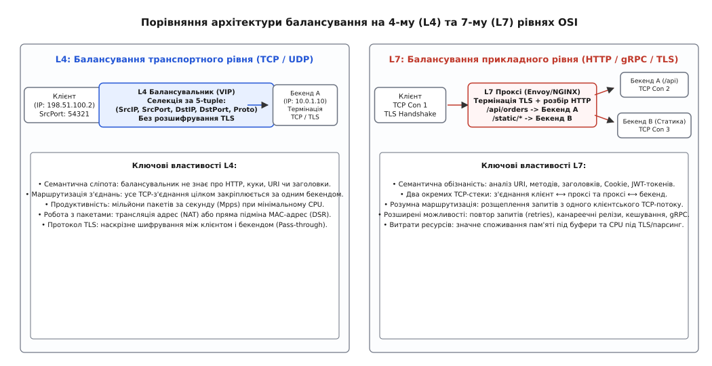
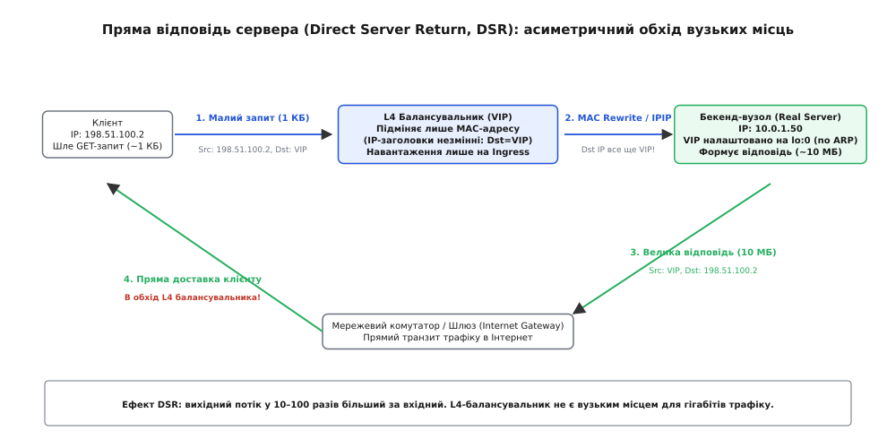
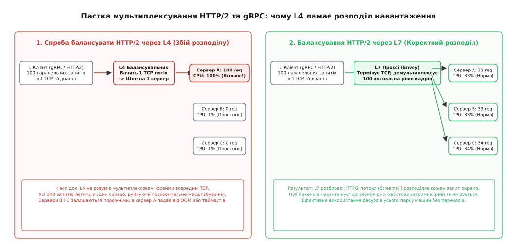
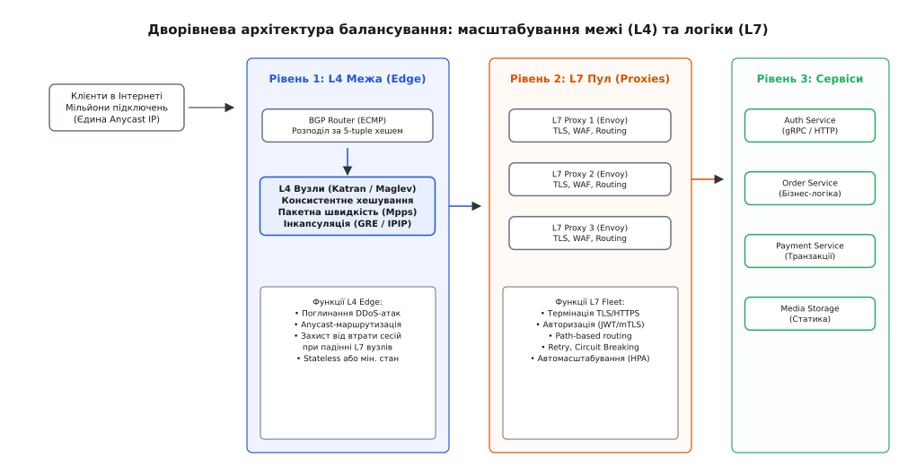

# Балансування на 4-му та 7-му рівнях (L4 vs L7)

<preknowlist>
- [TCP проти UDP](topic:com-transport/tcp-vs-udp) — різниця між орієнтованим на потік з'єднанням із контролем доставки та датаграмами без стану.
- [Життєвий цикл TCP-з'єднання](topic:com-transport/tcp-connection-lifecycle) — триетапне рукостискання, потік байтів, стани TIME_WAIT та закриття сокетів.
- [Зворотні проксі та балансування](topic:sf-web/reverse-proxy-load-balancing) — загальний принцип розподілу запитів клієнтів між групою бекендів.
- [Перевірки працездатності](topic:sf-distributed/health-checks) — активні та пасивні проби готовності вузлів для виключення несправних екземплярів із пулу.
</preknowlist>

Коли один сервер отримує десять тисяч HTTP-запитів за секунду, його мережева карта, черга сокетів операційної системи та процесорні ядра ще справляються з навантаженням. Але коли потік зростає до п'ятисот тисяч або мільйонів запитів, поодинокий вузол неминуче вичерпує пропускну здатність інтерфейсу, пам'ять під TCP-буфери та обчислювальні ресурси для криптографічних операцій TLS. Єдиним виходом стає запуск групи з десятків або сотень однакових серверів за єдиною віртуальною адресою.

Проте щойно перед пулом серверів з'являється проміжний пристрій, постає фундаментальна дилема: на якій саме глибині мережевого стеку ухвалювати рішення про розподіл трафіку? Чи повинен балансувальник оперувати сирими пакетами та потоками байтів, не заглядаючи в їхній зміст, чи він зобов'язаний повністю термінувати з'єднання, розшифровувати трафік і аналізувати структуру кожного окремого прикладного повідомлення?

Цей вибір розмежовує балансування на дві принципово різні архітектурні моделі: 4-й (транспортний) та 7-й (прикладний) рівні еталонної моделі OSI.


*Архітектурне розмежування: наскрізне перенаправлення TCP-потоків на 4-му рівні проти повної термінації з'єднань і семантичної маршрутизації на 7-му рівні.*

---

### Семантична сліпота проти семантичної обізнаності

Транспортний рівень (Layer 4, лат. *transportare* — переносити) оперує виключно поняттям мережевого потоку (Flow). Для протоколу TCP або UDP такий потік однозначно ідентифікується кортежем із п'яти параметрів — 5-tuple:
1. IP-адреса джерела (`Source IP`)
2. Порт джерела (`Source Port`)
3. IP-адреса призначення (`Destination IP`, віртуальний IP балансувальника — VIP)
4. Порт призначення (`Destination Port`)
5. Транспортний протокол (`TCP` або `UDP`)

L4-балансувальник є семантично сліпим. Він не знає, які дані передаються всередині TCP-сегментів: це HTML-сторінка, REST API виклик, бінарний protobuf чи потік відео. Балансувальник обирає цільовий сервер у момент надходження першого стартового пакета `TCP SYN`, фіксує зв'язку в таблиці станів або обчислює її хеш-функцією, після чого всі наступні пакети цього з'єднання без змін пересилаються на той самий бекенд.

Прикладний рівень (Layer 7, лат. *applicatio* — прикладання, застосування) оперує логічними повідомленнями програми. L7-балансувальник є повноцінним зворотним проксі-сервером (Terminating Reverse Proxy, від лат. *procurator* — управитель, представник). Він встановлює окреме повноцінне TCP-з'єднання з клієнтом, виконує криптографічне рукостискання TLS, повністю збирає потік байтів у пам'яті, парсить протокольні структури (заголовки HTTP, куки, URI, параметри запиту, gRPC-методи) і лише після цього вирішує, куди відправити кожен конкретний запит.

Зіставлення коду обох підходів демонструє [реалізацію потокового L4-сплайсера та L7-маршрутизатора](topic:sf-distributed/load-balancing/proj-l4-vs-l7-proxy.md) — робочий приклад на мовах C та C++, де L4 передає сирий потік дескрипторів сокетів, а L7 розбирає стартовий рядок HTTP і підміняє заголовки.

---

### Механізми балансування на 4-му рівні (L4)

Головна перевага L4 полягає в швидкості та низьких накладних витратах. Оскільки балансувальнику не потрібно розбирати прикладні протоколи чи зберігати стан сесій у просторі користувача, обробка пакетів може відбуватися на рівні ядра операційної системи або безпосередньо в мережевій карті.

Існує три основні режими роботи L4-балансувальників:

#### 1. Трансляція мережевих адрес (NAT: DNAT та SNAT)
Балансувальник приймає пакет від клієнта на віртуальну адресу VIP, замінює адресу призначення (`Destination IP`) на реальну IP-адресу обраного бекенда (`DNAT`) і змінює адресу джерела (`Source IP`) на власну IP-адресу (`SNAT`).

```
Клієнт (198.51.100.2) ──► [Dst: VIP] ──► L4 NAT ──► [Src: LB, Dst: 10.0.1.5] ──► Бекенд
Клієнт (198.51.100.2) ◄── [Src: VIP] ◄── L4 NAT ◄── [Src: 10.0.1.5, Dst: LB] ◄── Бекенд
```

Недолік подвійного NAT полягає в тому, що весь зворотний трафік від бекендів до клієнтів зобов'язаний проходити через той самий балансувальник, створюючи вузьке місце за пропускною здатністю каналу (Egress bottleneck). Крім того, бекенд втрачає реальну IP-адресу клієнта (вона замінена на IP балансувальника), що вимагає використання спеціальних розширень, таких як `PROXY protocol`.

#### 2. Пряма відповідь сервера (Direct Server Return, DSR)
У більшості веб-сервісів трафік є асиметричним: клієнтські HTTP-запити дуже малі (кілька сотень байтів або кілобайтів), тоді як відповіді бекендів містять мегабайти HTML, JSON, зображень чи відео.

DSR вирішує проблему вузького місця вихідного каналу: вхідний потік проходить крізь L4-балансувальник, а вихідний потік відповіді надсилається бекендами безпосередньо клієнту через стандартний шлюз дата-центру, повністю оминаючи балансувальник.


*Схема прямої відповіді сервера (DSR): балансувальник L4 приймає лише малі вхідні запити, а важкі гігабітні відповіді бекенди відправляють безпосередньо клієнту в обхід балансувальника.*

Щоб схема DSR працювала, необхідне виконання таких умов:
* Бекенд має віртуальну адресу VIP, налаштовану на локальному петльовому інтерфейсі (наприклад, `lo:0` у Linux).
* На бекенді обов'язково вимикається відповідь на ARP-запити для адреси VIP (`arp_ignore = 1`, `arp_announce = 2`), інакше виникне конфлікт IP-адрес у локальній мережі.
* L4-балансувальник отримує пакет на VIP і замість зміни IP-адрес підміняє лише MAC-адресу призначення на рівні Ethernet-кадру (або загортає IP-пакет у тунель `IP-in-IP` / `GRE` / `GENEVE`).
* Бекенд отримує пакет, бачить у полі Destination IP власну адресу VIP на інтерфейсі `lo`, успішно обробляє запит і формує TCP-відповідь, де адресою джерела стоїть VIP.
* Пакет-відповідь іде через стандартний комутатор напряму до маршрутизатора клієнта. Клієнт бачить відповідь від тієї адреси VIP, до якої звертався, і нічого не знає про існування внутрішніх адрес бекендів.

Завдяки DSR один скромний L4-балансувальник із мережевим інтерфейсом 10 Gbps здатен обслуговувати вихідний трафік обсягом 100–200 Gbps.

#### 3. Консистентне хешування без стану (Stateless Consistent Hashing)
Якщо L4-балансувальник зберігає кожне активне з'єднання в оперативній пам'яті (Stateful Connection Tracking), він ризикує переповнити таблицю станів під час сплеску трафіку або втратити всі сесії у разі перезавантаження.

Сучасні L4-балансувальники (такі як Google Maglev та Facebook Katran) будуються за схемою консистентного хешування: 5-tuple хешується і проєктується на фіксовану таблицю підстановки. Докладний математичний розбір та архітектура Katran викладені в статті [Алгоритм хешування Maglev](topic:sf-distributed/maglev-hashing).

Математичне обґрунтування того, чому таблиця перестановок гарантує мінімальне зміщення сесій при додаванні нових серверів, розбирає [математичне виведення таблиці перестановок Maglev](topic:sf-distributed/load-balancing/math-consistent-hashing-lookup.md) з покроковим розрахунком часток за модулем простого числа.

---

### Механізми балансування на 7-му рівні (L7)

Балансування на прикладному рівні платить обчислювальною потужністю та пам'яттю за повний контроль над змістом повідомлень.

L7-балансувальник (наприклад, Envoy, NGINX, HAProxy, AWS ALB) працює за моделлю розірваного з'єднання (Dual TCP Stack):

```
Клієнт ◄──── TCP Con 1 (TLS) ────► L7 Проксі ◄──── TCP Con 2 (HTTP/2) ────► Бекенд A
                                              ◄──── TCP Con 3 (gRPC)   ────► Бекенд B
```

Клієнтське TCP-з'єднання завершується на балансувальнику. Балансувальник володіє приватними ключами та сертифікатами, здійснює TLS Termination (звільняючи бекенди від важких криптографічних операцій) і розбирає потік байтів на дискретні логічні запити.

Це відкриває спектр можливостей, принципово недосяжних для L4:

#### 1. Маршрутизація на основі змісту (Content-Based Routing)
* **За шляхом URI:** запити до `/api/v1/checkout` направляються на кластер обробки платежів, `/api/v1/catalog` — на кластер товарів, а `/static/*` — на оптимізовані сервери роздачі медіа або CDN.
* **За заголовками та cookies:** маршрутизація користувачів за заголовком `Authorization` чи `Cookie` (наприклад, направлення преміум-користувачів на виділений ізольований пул серверів).
* **Канареечні релізи та A/B тестування:** перенаправлення 5% запитів із певним HTTP-заголовком (`X-Canary: true`) на нову версію мікросервісу.

#### 2. Захист, стійкість та відновлення
* **Автоматичні повтори (Retries):** якщо бекенд відповів статусом `503 Service Unavailable` або розірвав з'єднання під час виконання ідемпотентного `GET`-запиту, L7-балансувальник перехоплює помилку і прозоро для клієнта повторює запит на інший працездатний бекенд.
* **Запобіжники (Circuit Breaking):** балансувальник веде статистику помилок кожного бекенда на рівні HTTP-відповідей. Якщо відсоток помилок 5xx перевищує поріг, вузол тимчасово вилучається з ротації.
* **Буферизація проти повільних клієнтів (Slowloris Protection):** повільний мобільний клієнт, що передає POST-запит по байту в секунду, утримує з'єднання лише з балансувальником. Дорогий бекенд отримує запит лише тоді, коли всі байти тіла вже зібрані в пам'яті проксі.

Декларативні структури даних для налаштування цих механізмів документує [специфікація мережевих та HTTP-фільтрів Envoy](topic:sf-distributed/load-balancing/api-envoy-routing.md), де детально описано роботу ланцюжків `http_connection_manager` та `tcp_proxy`.

---

### Пастка мультиплексування: чому L4 ламає HTTP/2 та gRPC

Найбільш підступна помилка при проектуванні мікросервісних систем виникає при спробі збалансувати трафік протоколів HTTP/2 або gRPC за допомогою балансувальника 4-го рівня.

Протокол HTTP/1.1 вимагав відкриття окремого TCP-з'єднання на кожен паралельний запит (або послідовної передачі через Keep-Alive). У таких умовах L4-балансувальник розподіляв з'єднання між серверами, і навантаження розподілялося відносно рівномірно.

У протоколах HTTP/2 та gRPC впроваджено мультиплексування (лат. *multiplex* — складений із багатьох частин): клієнт відкриває **одне довгоживуче TCP-з'єднання** до сервера і передає всередині нього сотні паралельних логічних запитів у вигляді незалежних бінарних кадрів (Streams).


*Нерівномірний розподіл мультиплексованого трафіку: балансувальник L4 спрямовує єдине TCP-з'єднання з сотнями RPC на один сервер, перевантажуючи його, тоді як L7 демультиплексує кадри та балансує кожен запит окремо.*

Якщо між gRPC-клієнтом і пулом бекендів встановити L4-балансувальник (наприклад, стандартний AWS NLB або Linux IPVS), відбувається катастрофічний перекіс:
1. Клієнт ініціює одне TCP-з'єднання.
2. L4-балансувальник обирає один бекенд (наприклад, Сервер A) і закріплює цей потік за ним.
3. Клієнт генерує 10 000 RPC-запитів за секунду через це єдине з'єднання.
4. Усі 10 000 запитів надходять виключно на Сервер A.
5. Сервер A перевантажується і падає через дефіцит CPU чи пам'яті, тоді як сусідні Сервери B, C і D залишаються повністю незавантаженими.

Для рівномірного розподілу навантаження в середовищі gRPC та HTTP/2 **балансувальник L7 є безальтернативною вимогою**. Лише L7-проксі здатен термінувати мультиплексоване TCP-з'єднання, розбирати окремі кадри потоків (HTTP/2 Data/Headers Frames) і маршрутизувати кожен логічний RPC-виклик на різні екземпляри бекендів.

---

### Дворівнева архітектура високонавантажених систем

Оскільки L4 забезпечує неперевершену пропускну здатність пакетів, а L7 надає інтелектуальну маршрутизацію, масштабні веб-системи та хмарні платформи поєднують їх у дворівневу ієрархію.


*Дворівнева архітектура на межі дата-центру: пул L4-балансувальників із BGP Anycast та eBPF поглинає мільйони пакетів і передає їх групі L7-проксі для термінації TLS та складної маршрутизації.*

У такій дворівневій моделі кожен рівень виконує свою спеціалізовану роль:
1. **Перший рівень (Edge L4 Tier):**
   * Працює на межі мережі дата-центру під керуванням BGP Anycast та апаратних маршрутизаторів ECMP.
   * Реалізується на базі швидких технологій ядра або драйверів (eBPF/XDP, DPDK, Katran, IPVS).
   * Поглинає масовані DDoS-атаки (SYN-флуд, UDP-ампліфікація) без виділення важких структур пам'яті.
   * Використовує консистентне хешування для рівномірного розподілу мільйонів вхідних TCP-з'єднань між серверами L7-рівня.
2. **Другий рівень (L7 Application Proxy Fleet):**
   * Пул серверів під керуванням Envoy, NGINX або HAProxy, що динамічно масштабуються залежно від навантаження на процесор.
   * Здійснює термінацію TLS-сертифікатів, перевірку токенів безпеки (JWT, OAuth2) та блокування атак прикладного рівня (WAF).
   * Розбирає шляхи URI, інспектує заголовки та демультиплексує gRPC/HTTP/2 потоки.
   * Перенаправляє чисті, готові до виконання запити на кінцеві мікросервіси внутрішньої мережі.

---

### Порівняльна матриця L4 проти L7

| Критерій | Балансування 4-го рівня (L4) | Балансування 7-го рівня (L7) |
| :--- | :--- | :--- |
| **Одиниця маршрутизації** | Мережевий потік / TCP-з'єднання | Окремий HTTP-запит / gRPC-виклик |
| **Семантична обізнаність** | Відсутня (сліпе пересилання байтів) | Повна (URI, Headers, Cookies, JSON/Proto) |
| **Продуктивність (Throughput)** | Дуже висока (10–100+ Mpps, терабіти/с) | Середня (10–100k RPS на ядро CPU) |
| **Затримка (Latency Overhead)** | Мінімальна (частки мікросекунд) | Помітна (1–5 мілісекунд на TLS + парсинг) |
| **Споживання пам'яті** | Мінімальне (~кілька байтів на потік) | Значне (30–100 КБ на клієнтський сокет) |
| **Термінація TLS** | Відсутня (Pass-through) | Повна (з розшифруванням і валідацією) |
| **Підтримка DSR (Direct Return)** | Так (вихідний трафік оминає LB) | Ні (проксі обов'язково є посередником) |
| **Мультиплексування gRPC / H2**| Не підтримується (весь потік на 1 вузол) | Підтримується (потоки демультиплексуються) |
| **Можливість Retry / Circuit Break**| Лише при збої TCP-з'єднання | Повноцінна на рівні HTTP статус-кодів |
| **Типові технології** | Katran, Maglev, Linux IPVS, AWS NLB | Envoy, NGINX, HAProxy, AWS ALB, Traefik |

> 🔧 **Навіщо це в реальній розробці.**
> 
> Розуміння межі між L4 та L7 рятує архітектуру від двох критичних помилок. Перша — спроба поставити дорогий і важкий L7-проксі на межу мережі під відкритий інтернет без попереднього L4-фільтра: раптовий сплеск сирого трафіку або SYN-флуд миттєво покладе L7-сервери через вичерпання пам'яті під TLS-буфери та черги дескрипторів. Друга — спроба зекономити ресурси та підключити мікросервіси на базі gRPC через L4-балансувальник: уся система втратить горизонтальне масштабування, оскільки багатопотокові виклики застрягнуть на одному випадковому сервері. Стійка система завжди розмежовує ці завдання: L4 приймає на себе удар стихії пакетів, а L7 акуратно керує бізнес-потоками даних.
