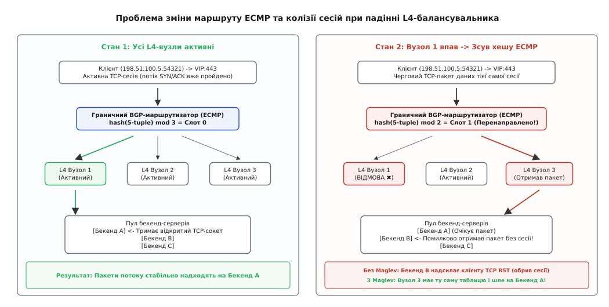
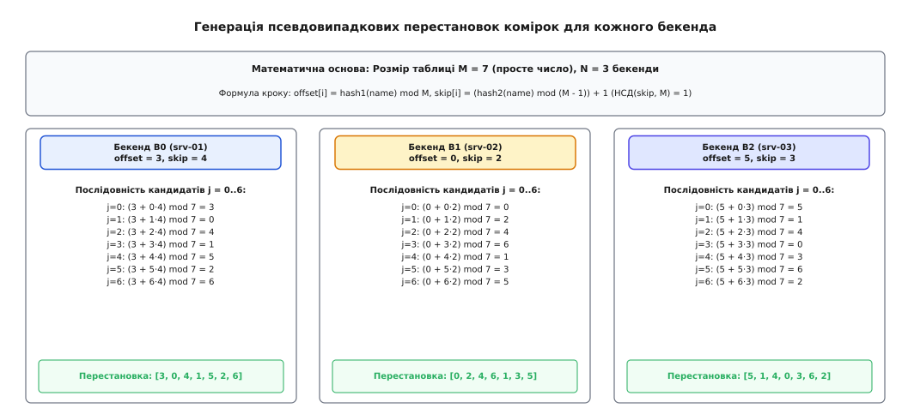
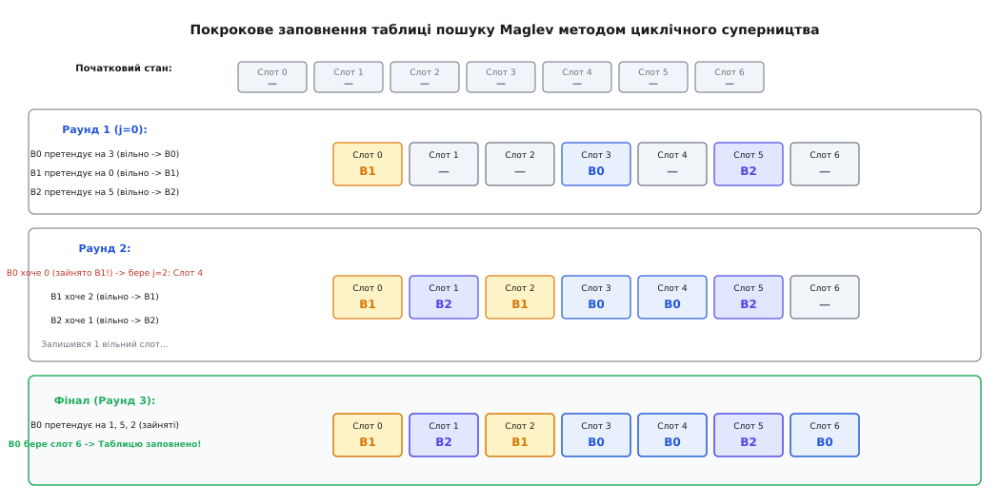
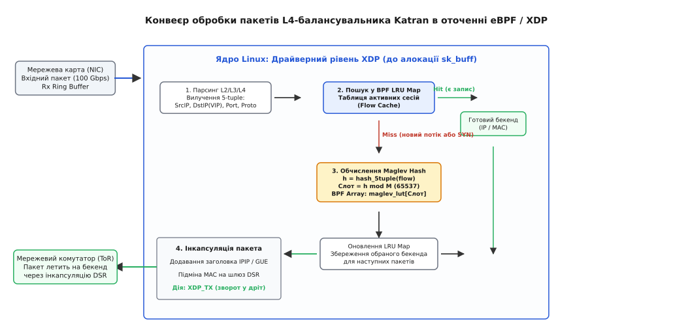

# Алгоритм хешування Maglev (Google / Katran L4)

<preknowlist>
- [Балансування на 4-му та 7-му рівнях](topic:sf-distributed/load-balancing) — різниця між комутацією потоків за 5-tuple і термінацією протоколів прикладного рівня.
- [Мережевий BGP Anycast](topic:com-transport/anycast) — анонсування єдиної IP-адреси з багатьох точок та розподіл через ECMP.
- [Хеш-таблиці та колізії](topic:algorithms/hash-tables) — відображення ключів у фіксований простір комірок та методи розв'язання колізій.
- [Життєвий цикл TCP-з'єднання](topic:com-transport/tcp-connection-lifecycle) — триетапне рукостискання, потік байтів, стани TIME_WAIT та закриття сокетів.
</preknowlist>

Коли на мережевий шлюз дата-центру надходить потік трафіку інтенсивністю 100 гігабітів за секунду, поодинокий сервер не здатен прийняти десятки мільйонів пакетів. Граничний маршрутизатор BGP Anycast розпилює пакети між групою з кількох десятків програмних L4-балансувальників за допомогою апаратного механізму ECMP (англ. *Equal-Cost Multi-Path* — багатошляхова маршрутизація з однаковою вартістю). Проте комутатор ECMP не має пам'яті про стан з'єднань: він обчислює простий хеш від 5-tuple заголовка пакета за модулем кількості активних балансувальників `N_lb`. Щойно один балансувальник перезавантажується для оновлення ядра або виходить із ладу через апаратний збій, значення `N_lb` змінюється на `N_lb - 1`, і апаратний хеш комутатора миттєво зміщується.

Усі наступні пакети активних TCP-з'єднань, які до аварії проходили через вузол 1, раптово потрапляють на вузол 2 або 3. Якщо новий балансувальник не знає, на який саме бекенд-сервер раніше надсилалися ці пакети, він обере довільний сервер. Бекенд, отримавши TCP-пакет даних без попереднього рукостискання `SYN`, відповість пакетом `TCP RST` (англ. *Reset* — скидання), і тисячі користувацьких завантажень обірвуться одночасно.


*Проблема узгодженості маршрутів: зсув апаратного ECMP-хешу спрямовує пакети активного TCP-потоку на новий L4-вузол, що за відсутності узгодженого хешування призводить до надсилання TCP RST.*

---

### Фатальний глухий кут традиційних архітектур

Ця проблема виникає через фундаментальне протиріччя між вимогами до швидкодії та потребою зберігати контекст сесій. До появи алгоритму Maglev інженери намагалися вирішити її трьома шляхами, кожен із яких виявився непридатним для масштабу хмарних дата-центрів:

1. **Міжвузлова синхронізація станів з'єднань (Stateful Cluster Sync):**
   Балансувальники транслюють стан кожного нового TCP-з'єднання через локальну мережу за допомогою протоколів Multicast або брокерів пам'яті. За швидкості 40–100 млн пакетів/с накладні витрати на передачу та блокування таблиці з'єднань (`lock contention`) поглинають більшу частину пропускної здатності шини процесора. Будь-яка затримка реплікації або втрата пакета синхронізації призводить до гонитви сигналів (*race conditions*), коли пакет даних прибуває на новий вузол раніше, ніж запис про створення сесії.

2. **Наївне хешування за модулем (`hash(5-tuple) mod N`):**
   Балансувальник не зберігає стану взагалі, обчислюючи залишок від ділення на кількість доступних бекендів `N`. Проте це створює катастрофічну лавину збоїв: варто вимкнути один сервер із сотні на технічне обслуговування (`N → N - 1`), як математичне значення залишку змінюється для 99% активних з'єднань усього кластера. Користувачі масово стикаються з розривами з'єднань під час кожного планового оновлення пулу.

3. **Кільцеве консистентне хешування (Ketama / Karger Ring):**
   Консистентне хешування (англ. *Consistent Hashing*, від лат. *consistere* — стояти разом) на віртуальному кільці успішно локалізує зміщення ключів до частки `1/N`. Однак пошук цільового сервера на кільці вимагає бінарного пошуку в пам'яті з часовою складністю `O(log V)` (де `V` — кількість віртуальних вузлів, зазвичай 1000–5000). На швидкостях 100 Gbps конвеєр процесора зазнає частих промахів повз кеш пам'яті та штрафів за помилкові передбачення переходів (*branch mispredictions*), що обмежує продуктивність балансувальника кількома мільйонами пакетів на секунду.

Для подолання цього глухого кута інженери Google розробили алгоритм **Maglev** (від *magnetic levitation* — магнітна левітація), який згодом ліг в основу балансувальника Katran компанії Meta (Facebook). [Історія створення Maglev та переходу індустрії від апаратних L4-пристроїв до eBPF](topic:sf-distributed/load-balancing/hist-maglev-katran.md) демонструє, як програмна модель на стандартних x86-серверах остаточно знищила ринок монолітних апаратних балансувальників.

---

### Архітектурна ідея Maglev: статична таблиця перестановок

Головна концепція Maglev полягає у відмові від динамічної координації між балансувальниками. Замість обміну повідомленнями всі машини кластера генерують повністю ідентичну таблицю підстановки (*Lookup Table*) фіксованого розміру `M`, спираючись на однаковий список імен доступних серверів.

Maglev забезпечує три ключові інженерні гарантії:
1. **Швидкість диспетчеризації `O(1)`:** рішення про вибір сервера приймається за одну операцію індексації масиву в оперативній пам'яті без бінарного пошуку та без розгалужень у коді.
2. **Мінімальне збурення `1/N`:** вихід із ладу одного бекенда перерозподіляє лише його власні `1/N` потоків; решта `(N - 1)/N` з'єднань гарантовано залишаються на своїх серверах без змін.
3. **Нульовий міжвузловий стан:** усі балансувальники кластера обчислюють однакову таблицю абсолютно детерміновано, що дозволяє комутаторам ECMP вільно перенаправляти пакети на будь-який вузол балансування.

Таблиця розміром `M` комірок (де `M` — просте число, що перевищує кількість серверів на кілька порядків, зазвичай `65537`) заповнюється числовими ідентифікаторами бекендів.

Коли балансувальник отримує пакет, він витягує з його заголовків кортеж із п'яти параметрів — 5-tuple:

```
5-tuple: (Source IP, Destination IP, Source Port, Destination Port, Protocol)
```

Цільовий бекенд визначається єдиною прямою операцією читання комірки з масиву:

```
backend_index = lookup_table[hash_5tuple(packet) mod M]
```

Оскільки звернення до пам'яті за прямим індексом не містить розгалужень `if/else`, конвеєр процесора виконує інструкцію за лічені наносекунди, не відчуваючи затримок.

---

### Алгоритм генерації перестановок та заповнення таблиці

Побудова таблиці Maglev виконується у два математичні етапи: генерація індивідуальних уподобань серверів та їхнє раундове зведення у фінальну таблицю.

#### Крок 1. Обчислення псевдовипадкових перестановок бекендів

Для кожного сервера `i` (від `0` до `N - 1`) за допомогою двох незалежних 32-бітних хеш-функцій обчислюються початковий зсув `offset` та крок `skip`:

```
offset[i] = hash1(backend_name[i]) mod M
skip[i]   = (hash2(backend_name[i]) mod (M - 1)) + 1
```

Оскільки `M` — просте число, а величина `skip[i]` лежить у діапазоні `1 ≤ skip[i] ≤ M - 1`, найбільший спільний дільник становить:

```
НСД(skip[i], M) = 1
```

Згідно з теоремою теорії чисел про циклічні підгрупи, якщо крок і модуль є взаємно простими числами, лінійна конгруентна послідовність:

```
permutation[i][j] = (offset[i] + j · skip[i]) mod M,    де j = 0, 1, ..., M - 1
```

гарантовано містить усі числа від `0` до `M - 1` рівно по одному разу без повторень і пропусків. Ця послідовність утворює повну перестановку множини комірок таблиці й задає строгий список переваг для сервера `i`: слот `permutation[i][0]` є для нього найбажанішим, `permutation[i][1]` — другим за пріоритетом, і так далі.


*Генерація перестановок: взаємно прості крок і модуль утворюють повну циклічну послідовність слотів таблиці для кожного бекенда.*

#### Крок 2. Раундове суперництво за комірки (Round-Robin Filling)

Таблиця `lookup_table` розміром `M` ініціалізується порожніми значеннями `-1`. Кожен сервер має локальний покажчик `next[i] = 0`, що вказує на поточну позицію в його списку переваг.

Алгоритм виконує послідовні раунди обходу всіх активних серверів:
1. У кожному раунді сервер `i` бере свій черговий кандидат зі списку перестановок: `c = permutation[i][next[i]]` і збільшує покажчик `next[i]++`.
2. Якщо комірка `lookup_table[c]` вільна (дорівнює `-1`), сервер займає її: `lookup_table[c] = i`.
3. Якщо комірка вже зайнята іншим сервером на попередніх кроках, поточний сервер негайно перевіряє наступного кандидата зі своєї черги (збільшуючи `next[i]`), доки не натрапить на вільну комірку.
4. Раунди повторюються циклічно, доки всі `M` комірок таблиці не будуть заповнені.


*Заповнення таблиці Maglev: циклічний вибір комірок з черг пріоритетів забезпечує рівномірне покриття простору M та мінімальний зсув при зміні пулу.*

Завдяки циклічному чергуванню всі сервери отримують практично однакову кількість слотів у таблиці (різниця між будь-якими двома серверами не перевищує 1 слота).

Формальні математичні доведення бієктивності генератора, оцінки точності розподілу ваг та межі стійкості наведені у вставці: [математичні засади алгоритму Maglev: перестановки, взаємна простота та межі стійкості](topic:sf-distributed/maglev-hashing/math-maglev-permutation.md).

---

### Вагове балансування та динамічні бекенди

У реальних кластерах сервери часто мають різну обчислювальну здатність (наприклад, нові машини з 128 процесорними ядрами поруч із вузлами на 32 ядра). Maglev природно підтримує вагові коефіцієнти без ускладнення швидкого шляху диспетчеризації `O(1)`.

Для реалізації ваг у циклі заповнення сервер із цілочисельною вагою `W[i]` робить не 1, а `W[i]` успішних кроків захоплення вільних комірок за один раунд. У результаті частка слотів, яку отримує сервер у таблиці, строго пропорційна його вазі:

```
Сумарна вага пулу = ∑ W[i]
Кількість слотів сервера i ≈ M · (W[i] / ∑ W)
```

Коли фоновий моніторинг фіксує вихід сервера з ладу або зміну його ваги, площина керування генерує нову версію таблиці у фоновому буфері пам'яті. Після завершення генерації активний покажчик атомарно підміняється за допомогою патерну RCU (англ. *Read-Copy-Update*). Робочі ядра обробки пакетів продовжують вичитувати таблицю без застосування м'ютексів чи атомарних лічильників блокувань.

Повний виробничий вихідний код генератора таблиці, підтримки ваг та RCU-підміни покажчиків демонструє [високопродуктивна побудова таблиці Maglev та RCU-диспетчеризація пакетів](topic:sf-distributed/maglev-hashing/proj-maglev-kernel-lookup.md) мовами C та C++.

---

### Архітектура ядра: Katran у Meta (eBPF / XDP)

Компанія Meta перенесла концепцію Maglev безпосередньо в мережевий драйвер ядра Linux за допомогою технологій eBPF (англ. *extended Berkeley Packet Filter*) та XDP (англ. *eXpress Data Path*).

У проєкті Katran таблиця Maglev розміщується в пам'яті ядра всередині карти `BPF_MAP_TYPE_ARRAY` фіксованого розміру `65537` елементів.


*Архітектура Katran: поєднання таблиці Maglev у пам'яті eBPF Array та кешу сесій у BPF LRU для безперервної маршрутизації на швидкостях 100 Gbps.*

#### Життєвий цикл вхідного пакета в XDP:
1. **Перехоплення на рівні драйвера:** мережева карта записує пакет у кільцевий буфер Rx через DMA. Програма XDP починає виконання до того, як ядро витратить такти процесора на алокацію важкої системної структури `sk_buff`.
2. **Перевірка LRU Flow Cache:** BPF-програма зчитує 5-tuple і перевіряє таблицю `BPF_MAP_TYPE_LRU_HASH`. Якщо потік уже встановлено, пакет негайно отримує адресу цільового сервера.
3. **Обчислення Maglev:** якщо стався промах кешу (новий TCP-потік або початковий пакет `SYN`), BPF-програма обчислює хеш від 5-tuple за модулем `65537`, вичитує індекс сервера з карти `BPF_MAP_TYPE_ARRAY` і записує зв'язку в LRU-кеш для прискорення наступних пакетів.
4. **Інкапсуляція DSR (Direct Server Return):** балансувальник загортає оригінальний пакет у тунельний заголовок Generic UDP Encapsulation (GUE) або IP-in-IP і повертає вердикт `XDP_TX`. Мережева карта негайно відправляє інкапсульований пакет на обраний бекенд.
5. **Пряма відповідь бекенда:** бекенд знімає тунельний заголовок, обробляє запит і відправляє вихідну відповідь безпосередньо клієнту через стандартний шлюз дата-центру, повністю оминаючи балансувальник.

Опис структур ядра, специфікації eBPF-карт пам'яті та прикладів використання утиліти керування наведено у вставці: [інтерфейс конфігурації L4-балансувальника Katran та структури eBPF](topic:sf-distributed/maglev-hashing/api-katran-lb-config.md).

---

### Апаратна ефективність та локальність процесорного кешу

Ключова перевага Maglev перед іншими алгоритмами полягає в оптимізації під мікроархітектуру сучасних процесорів x86-64 та ARM:

1. **Розмір структури даних:**
   Таблиця з `M = 65537` цілих 32-бітних чисел займає в пам'яті рівно:

   ```
   65537 × 4 байти = 262 148 байтів (≈ 256 КБ)
   ```

2. **Ідеальне розміщення в L2 кеші:**
   Сучасні процесорні ядра (наприклад, Intel Sapphire Rapids чи AMD Zen 4) мають від 1 до 2 МБ виділеної кеш-пам'яті L2 на кожне ядро. Вся таблиця Maglev повністю вміщується в L2 кеш одного ядра, не витісняючи службовий стек програми.
3. **Відсутність конкуренції за кеш-лінії:**
   Оскільки робочі ядра лише читають таблицю, кеш-лінії залишаються в стані `Shared` протоколу когерентності MESI. Жодне ядро не ініціює інвалідацію кешу сусідніх ядер, що усуває затримки між'ядерної шини (*cross-core bus traffic*).

---

### Порівняльний інженерний аналіз підходів

| Критерій порівняння | Наївне `hash mod N` | Кільце Ketama (Karger) | Кластерний IPVS | Таблиця Maglev (Google / Katran) |
|---|---|---|---|---|
| **Часова складність `Fast Path`** | `O(1)` | `O(log V)` (бінарний пошук) | `O(1)` (хеш-таблиця з блокуванням) | `O(1)` (пряма індексація масиву) |
| **Розмір структури даних** | `0` байтів (немає стану) | `2–8 МБ` (масив віртуальних точок) | Сотні МБ (таблиця з'єднань ядра) | `256 КБ` (фіксована таблиця 65537) |
| **Локальність у процесорному кеші** | Ідеальна | Низька (промахи кешу L3) | Низька (конкуренція блокувань ядер) | Ідеальна (постійно живе в кеші L2) |
| **Збереження з'єднань при збої вузла** | `~0%` (лавинний зрив) | `(N - 1)/N` (мінімальне збурення) | `100%` (поки жива синхронізація) | `(N - 1)/N` (мінімальне збурення) |
| **Стійкість до SYN-флуду та DDoS** | Ідеальна (без стану) | Висока (без стану) | Низька (вичерпання пам'яті conntrack) | Ідеальна (обчислення на льоту) |
| **Пропускна здатність на ядро CPU** | > 30 Mpps | ~3–5 Mpps | ~1–2 Mpps | > 35–40 Mpps (на 100 Gbps) |

---

### Інженерні пастки та правила впровадження

1. **Пастка складеного розміру таблиці `M`:**
   Розмір таблиці `M` зобов'язаний бути простим числом. Якщо розробник обере степінь двійки (наприклад, `65536`), для будь-якого парного кроку `skip` виникне спільний дільник `НСД(skip, 65536) > 1`. Генератор перестановок замкнеться у внутрішньому циклі парних чисел і ніколи не відвідає непарні комірки, спричинивши нескінченний цикл при заповненні. Число Ферма `M = 65537 = 2¹⁶ + 1` гарантує взаємну простоту з будь-яким `skip ∈ [1, 65536]`.

2. **Асиметрія хешування двонапрямлених потоків:**
   У мережевих топологіях без Direct Server Return (коли зворотний трафік від серверів до клієнтів також проходить крізь L4-балансувальник) прямий потік `(SrcIP, DstIP, SrcPort, DstPort)` та зворотний потік `(DstIP, SrcIP, DstPort, SrcPort)` повинні потрапляти на один і той самий бекенд. Для цього функція хешування 5-tuple зобов'язана бути симетричною (комутативною): поєднувати адреси та порти через операцію побітового виключного АБО (`SrcIP ^ DstIP` та `SrcPort ^ DstPort`).

3. **Співвідношення розміру таблиці та кількості серверів:**
   Для збереження рівномірності балансування розмір таблиці `M` повинен перевищувати кількість серверів `N` щонайменше у 100–1000 разів (`M ≫ N`). Якщо розмістити 50 000 серверів у таблицю на 65 537 слотів, дискретність раундового заповнення призведе до перекосу навантаження до 10–15%. Для надвеликих кластерів обирають прості числа порядку `M = 655583` або розділяють сервіси за різними VIP-адресами.
