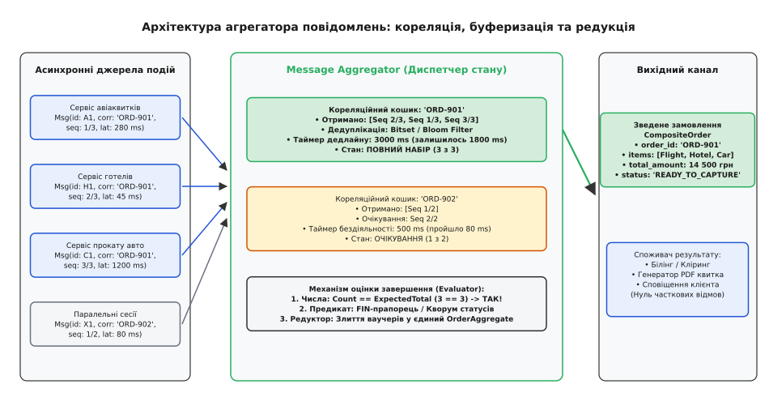
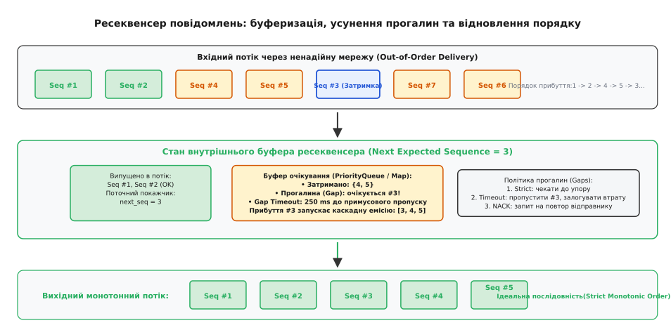
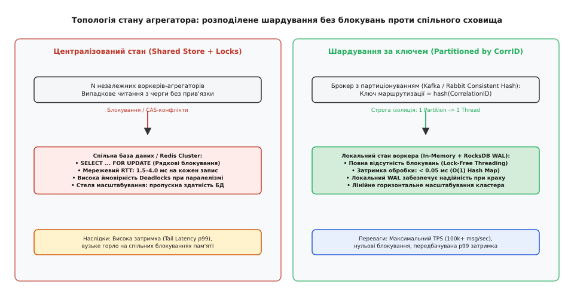
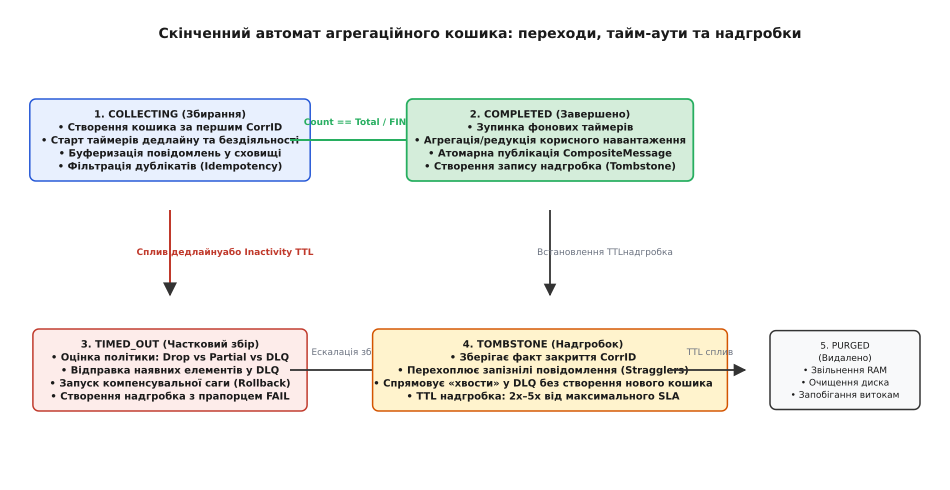

# Агрегатор і ресеквенсер повідомлень: збирання, кореляція та відновлення порядку в розподілених потоках

<preknowlist>
- [Черга повідомлень](topic:sf-distributed/message-queue) — буферизована асинхронна передача даних «точка-точка» між компонентами.
- [Розділювач повідомлень](topic:sf-distributed/message-splitter) — декомпозиція складеного пакета на дискретні елементи з ін'єкцією метаданих.
- [Маршрутизатор повідомлень](topic:sf-distributed/message-router) — розв'язання топологічних шляхів та селекція цільових каналів за критеріями.
- [Гарантії доставки](topic:sf-distributed/delivery-guarantees) — семантика at-least-once, at-most-once та exactly-once у ненадійній мережі.
- [Ідемпотентність](topic:sf-distributed/idempotency) — захист стану системи від дублювання операцій при повторній доставці.
- [Мертва черга](topic:sf-distributed/dead-letter-queue) — ізоляція пошкоджених та необроблюваних повідомлень для аудиту.
</preknowlist>

Розподілена платформа бронювання подорожей оформлює туристичний пакет, що складається з чотирьох незалежних операцій: купівлі авіаквитків, бронювання номера в готелі, оренди автомобіля та оформлення медичного страхування. Запит клієнта розщеплюється на чотири паралельні підзадачі й публікується в асинхронну шину повідомлень. Чотири мікросервіси-інтегратори взаємодіють із зовнішніми постачальниками й повертають підтвердження з суттєво різною затримкою: готель підтверджує бронь за 35 мс, авіакомпанія формує квиток за 280 мс, сервіс прокату авто відповідає через 1 450 мс, а шлюз страхової компанії через мережеві коливання затримує транзакцію на 3 200 мс. Якщо платіжний сервіс та генератор підсумкового ваучера почнуть обробляти вхідні події хаотично, система зіткнеться з неможливістю сформувати єдиний платіжний чек, передчасним списанням коштів за неповний набір послуг, гонками станів та порушенням хронологічного порядку генерації документів.


*Асинхронні воркери генерують дискретні події з гетерогенними затримками; агрегатор групує їх за кореляційним ідентифікатором, перевіряє критерії завершення та емітує єдиний складений результат у вихідний канал.*

## Кореляція, сесії та відновлення цілісності

Коли розподілена система застосовує патерн паралельної обробки, атомарні повідомлення втрачають часову синхронність і змішуються в загальних чергах із мільйонами подій від інших користувацьких сесій. Щоб зібрати ці розрізнені фрагменти в єдиний цілісний бізнес-результат або впорядкувати спотворений мережею потік, використовують два симетричні архітектурні патерни:

1. **Агрегатор повідомлень** (англ. *Message Aggregator*, від латинського *aggregare* — збирати докупи, приєднувати до стада) — станційний посередник, який ідентифікує зв'язок між окремими повідомленнями, зберігає їх у тимчасовому буфері стану, відстежує настання критеріїв повноти й об'єднує накопичені елементи в одне складене результуюче повідомлення.
2. **Ресеквенсер** (англ. *Message Resequencer*, від латинського *re-* — знову та *sequi* — слідувати за порядком) — станційний потоковий фільтр, який приймає повідомлення, що прибули з порушенням послідовності, буферизує їх і випускає у вихідний канал у строго монотонному зростаючому порядку відповідно до їхніх порядкових номерів.

Історично ця задача виникла ще в механічних табуляторах і сортувальниках перфокарт, після чого лягла в основу TCP-стеку та потокових редукторів: [як механізми кореляції та сортування еволюціонували від табуляторів Голлеріта й TCP-ресеквенсингу до EIP та потокових процесорів](topic:sf-distributed/message-aggregator/hist-aggregation-roots.md).

Фундаментальна робота агрегатора базується на чотирьох службових полях метаданих, що інжектуються у транспортний конверт повідомлень:
* **Кореляційний ідентифікатор (`Correlation ID`):** Унікальний ключ сесії (UUIDv4 або 64-бітне число), спільний для всіх елементів конкретної групи. Агрегатор використовує цей ключ як первинний індекс для виділення ізольованого кошика збирання (англ. *Correlation Bucket*).
* **Порядковий номер (`Sequence Number`):** Монотонний 1-індексований числовий індекс елемента (`1, 2, 3, ..., N`), що задає відносне положення повідомлення всередині групи.
* **Загальний розмір послідовності (`Sequence Size` / `Total Expected Count`):** Очікувана кількість повідомлень `N`. Дозволяє агрегатору миттєво визначити момент отримання повного комплекту без додаткових запитів.
* **Термінальний прапорець (`Is Last Element` / `FIN`):** Булевий маркер кінця потоку, що застосовується у сценаріях, де загальний обсяг даних невідомий заздалегідь аж до завершення читання джерела.

Повний перелік транспортних заголовків, бінарні схеми Protobuf v3 та контракти сховища наведені в технічній довідці: [детальна специфікація метаданих, конфігурацій завершення та інтерфейсів сховища агрегатора](topic:sf-distributed/message-aggregator/api-aggregator-spec.md).

## Критерії та стратегії завершення агрегації

Агрегатор не може утримувати стан у пам'яті нескінченно. Головне алгоритмічне завдання агрегатора — своєчасно та коректно визначити момент, коли накопичення даних для конкретного `Correlation ID` має бути припинено, а результат передано далі за конвеєром. Цей механізм називається **стратегією завершення** (англ. *Completion Strategy / Completion Condition*).

У промислових розподілених системах застосовують чотири базові класи стратегій завершення.

### 1. Розмірна стратегія (Size-Based Completion)

Розмірна стратегія закриває агрегаційний кошик на основі кількості отриманих елементів:
* **Фіксований розмір послідовності (`count == total_expected`):** Кожне повідомлення містить поле `x-sequence-size: N`. Щойно внутрішній лічильник кошика досягає `N` унікальних елементів, кошик вважається повністю укомплектованим.
* **Поріг накопичувального буфера (`count >= batch_size_limit`):** Застосовується для пакетування незалежних запитів (наприклад, накопичення 500 записів для виконання масової вставки `INSERT INTO ...` у реляційну базу даних або для оптимізації дискового запису).

```
Вхідний потік: Msg(Seq: 1/3) ──► [Bucket ORD-71: count=1, expected=3] (Очікування)
              Msg(Seq: 3/3) ──► [Bucket ORD-71: count=2, expected=3] (Очікування)
              Msg(Seq: 2/3) ──► [Bucket ORD-71: count=3, expected=3] ──► ТРИГЕР ЕМІСІЇ!
```

### 2. Часові стратегії та дедлайни (Time-Based Completion)

У розподіленому середовищі повідомлення можуть губитися через аварії воркерів або збої мережі. Без часових обмежень агрегатор накопичував би неповні кошики вічно, що призвело б до вичерпання оперативної пам'яті (Out-of-Memory).

* **Абсолютний дедлайн (Hard Deadline / Wall-Clock Timeout):** Фіксований інтервал часу від моменту прибуття першого повідомлення сесії:
  ```
  T_deadline = created_at + T_max
  ```
  Навіть якщо отримано лише 3 елементи з 5, після спливу `T_max` агрегатор примусово закриває сесію. Розрахунок `T_max` базується на статистичному розподілі затримок сервісів-учасників: якщо 99-й перцентиль (P99) найповільнішого сервісу становить 2 500 мс, `T_max` встановлюють на рівні 3 500–4 000 мс із урахуванням мережевого джитера.
* **Тайм-аут бездіяльності (Inactivity Timeout / Sliding Idle Window):** Ковзний таймер, що скидається при надходженні кожного нового повідомлення для цього `Correlation ID`:
  ```
  T_next = last_received_at + T_idle
  ```
  Якщо протягом `T_idle` жодного нового елемента не надійшло, агрегатор вважає, що джерело завершило передачу або зазнало невідновного краху.
* **Вирівняні часові вікна (Tumbling / Hopping Windows):** Закриття кошиків за астрономічним годинником (наприклад, щохвилини о `XX:XX:00.000` для підрахунку фінансових метрик або аналізу логів).

### 3. Предикатні та контентні стратегії (Predicate & Content-Based Completion)

Завершення визначається внутрішнім бізнес-станом накопичених даних або отриманням керуючого сигналу:
* **Термінальний маркер (FIN-повідомлення):** Потік вважається відкритим, доки не надійде повідомлення із заголовком `x-is-last-element: true`.
* **Досягнення кворуму або граничного значення:** Наприклад, у фінансовому моніторингу агрегація завершується, щойно сумарна вартість накопичених підозрілих операцій перевищує 500 000 гривень, або коли отримано 3 підписи валідаторів із 5 можливих.
* **Складений статус успішності:** Якщо хоча б один із сервісів-учасників надіслав відповідь `status: "FATAL_REJECTED"`, агрегатор може перервати очікування решти сервісів достроково і негайно ініціювати відкат транзакції.

### 4. Гібридна стратегія (Multi-Condition Hybrid Strategy)

На практиці найнадійнішим є об'єднання кількох умов за логічним правилом `OR`:
```
Умова завершення = (count == total_expected) 
                OR (has_fin_marker == true) 
                OR (now - created_at >= hard_deadline)
                OR (now - last_activity >= inactivity_timeout)
```

Така комбінація гарантує, що успішний сценарій виконається з мінімальною латентністю (щойно прибуде останній елемент), а будь-який збій буде перехоплено таймером без зависання ресурсів.

## Динамічний Fan-Out та координація з розділювачем повідомлень

У класичному шаблоні розподіленої інтеграції *Scatter-Gather* (розкидання та збирання) агрегатор виступає другою половиною симетричної пари з [розділювачем повідомлень](topic:sf-distributed/message-splitter). 

Координація відбувається за таким протоколом:
1. Клієнт надсилає складений запит до розділювача.
2. Розділювач генерує глобальний `Correlation ID`, розбиває пакет на `N` підзадач і додає заголовок `x-sequence-size: N`.
3. Підзадачі розсилаються паралельним воркерам через [маршрутизатор повідомлень](topic:sf-distributed/message-router).
4. Агрегатор утримує стан сесії, збирає відповіді від усіх воркерів і формує фінальний результат лише тоді, коли всі `N` гілок підтвердили успішне виконання.

Якщо кількість підзадач невідома на старті (динамічний Fan-Out), розділювач відправляє потік елементів із прапорцем `x-is-last-element: false`, завершуючи трансляцію спеціальним службовим кадром `x-is-last-element: true`.

## Ресеквенсер: відновлення строгого монотонного порядку

На відміну від агрегатора, який зменшує кількість повідомлень шляхом їх редукції (`N → 1` або `N → M`), **ресеквенсер** зберігає всі вихідні повідомлення (`N → N`), але відновлює порушену хронологію їхньої появи.


*Ресеквенсер буферизує пакети, що прибули з порушенням послідовності; прибуття відсутнього елемента №3 запускає каскадну емісію діапазону 3–5 у вихідний канал.*

Ресеквенсер підтримує внутрішній покажчик очікуваного номера `next_expected_sequence` (початково `1`) та пріоритетну чергу або індексовану мапу буферизованих елементів `BufferMap<uint64_t, Message>`.

### Алгоритм роботи ресеквенсера:

1. При надходженні повідомлення з номером `Seq`:
   * Якщо `Seq < next_expected_sequence`: повідомлення є запізнілим дублікатом і відкидається (або спрямовується в аудит).
   * Якщо `Seq == next_expected_sequence`: повідомлення негайно передається у вихідний канал, а покажчик інкрементується (`next_expected_sequence++`).
   * Якщо `Seq > next_expected_sequence`: виявлено прогалину (англ. *Sequence Gap*). Повідомлення зберігається в буфері очікування, а для прогалини запускається таймер очікування `GapTimeout`.
2. Після кожної успішної прямої емісії ресеквенсер перевіряє голову буфера:
   * Якщо в буфері присутній елемент із ключем `next_expected_sequence`, він вилучається з буфера, публікується у вихідний канал, а покажчик знову інкрементується. Цей процес триває в циклі до першої наступної прогалини (каскадна видача).

### Математична місткість буфера та розрахунок вікна:

Мінімально необхідний розмір буфера ресеквенсера `W` визначається швидкістю вхідного потоку `R` (повідомлень/сек) та максимальною розбіжністю затримок у мережі `ΔT = Latency_max - Latency_min`:
```
W_min = R · (Latency_max - Latency_min)
```
Якщо система генерує 10 000 повідомлень на секунду, а мережевий джитер коливається від 10 мс до 210 мс (`ΔT = 200 мс = 0.2 с`), буфер ресеквенсера повинен утримувати щонайменше `10 000 · 0.2 = 2 000` елементів для запобігання втратам через переповнення.

### Стратегії обробки прогалин (Sequence Gaps):

Якщо відсутній пакет `Seq = 3` не надходить протягом тривалого часу:
1. **Строга блокуюча модель (Strict FIFO):** Ресеквенсер повністю зупиняє просування конвеєра до прибуття втраченого пакета або ручного втручання адміністратора. Застосовується у фінансових регістрах, де пропуск операції порушує баланс.
2. **Модель скидання прогалини за тайм-аутом (Gap-Skip on Timeout):** Після спливу `GapTimeout` ресеквенсер реєструє втрату пакета в системі моніторингу, штучно зсуває `next_expected_sequence` через прогалину (наприклад, одразу на `4`) і каскадно випускає накопичені пакети `4, 5, 6`. Застосовується в обробці телеметрії та відеотрансляціях, де свіжість даних важливіша за повноту.
3. **Запит повторної передачі (NACK / Selective Repeat):** Ресеквенсер надсилає зворотному каналу сигнал про втрату конкретного номера послідовності з проханням повторити відправку саме цього елемента.

## Топологія стану: оперативна пам'ять проти дискової персистентності

Агрегатор і ресеквенсер є станційними компонентами (*Stateful Components*). Вибір архітектури зберігання стану визначає співвідношення між максимальною пропускною здатністю, затримкою обробки та стійкістю до аварійних перезапусків.


*Зліва: централізоване сховище зі спільними блокуваннями створює високу конкуренцію і затримки. Справа: партиціонування за Correlation ID дозволяє кожному воркеру тримати стан локально без блокувань.*

### 1. Збереження в оперативній пам'яті (In-Memory State Store)

Стан кошиків утримується в локальних структурах даних процесу (хэш-таблиці `std::unordered_map`, неблокуючі дерева або кільцеві буфери):
* **Переваги:** Мінімальна затримка доступу (менше 0.01 мс), екстремальна пропускна здатність (понад 500 000 операцій/сек на одне процесорне ядро), повна відсутність серіалізаційних накладних витрат.
* **Вразливості:** Аварійне завершення процесу (крах вузла, перезапуск контейнера Kubernetes) призводить до безповоротної втрати всіх незавершених агрегаційних сесій.

### 2. Вбудовані дискові сховища з журналом (Embedded KV: RocksDB / LMDB)

Кожна зміна стану кошика синхронно фіксується у вбудованому локальному журналі випереджального запису (англ. *Write-Ahead Log, WAL*) та LSM-дереві на локальному NVMe-накопичувачі:
* **Переваги:** Повна довговічність (Durability) без мережевих затримок; швидке відновлення стану після рестарту шляхом послідовного читання локального WAL-файлу. Затримка запису становить 0.2–0.6 мс.
* **Вразливості:** Прив'язка екземпляра агрегатора до конкретного фізичного сервера або постійного дискового тому (Persistent Volume).

### 3. Розподілені спільні сховища (Shared Remote Store: Redis / PostgreSQL)

Стан кошиків зберігається в централізованому кластері баз даних:
* **Переваги:** Будь-який із десятків безстанційних (*stateless*) воркерів агрегатора може прийняти повідомлення з черги та оновити відповідний кошик.
* **Вразливості:** Мережева затримка (RTT 1.5–4.0 мс на кожен запис), висока конкуренція на рядкових блокуваннях (`SELECT FOR UPDATE` або Redis Redlock), ризик взаємних блокувань (Deadlocks) та зниження загальної продуктивності системи.

### 4. Шардування за Correlation ID (Partitioned Routing)

Найефективніший патерн масштабування промислових агрегаторів полягає в перенесенні маршрутизації на рівень брокера:
1. Вхідний топік черги (наприклад, в Apache Kafka або RabbitMQ Consistent Hash Exchange) розбивається на `P` партицій.
2. Ключем партиціонування встановлюється `Correlation ID`:
   ```
   Partition_Index = hash(Correlation_ID) % P
   ```
3. Кожна партиція призначається рівно одному екземпляру споживача-агрегатора (або єдиному потоку всередині процесу).

Це гарантує, що **всі повідомлення з однаковим `Correlation ID` завжди потрапляють до одного й того самого потоку**. У результаті повністю усувається потреба в міжпроцесних блокуваннях і розподілених транзакціях: воркер оперує надшвидким локальним in-memory станом, підкріпленим локальним WAL, забезпечуючи лінійне масштабування кластера.

## Детальний розбір реалізації сховищ стану

Розглянемо внутрішню організацію та технічні компроміси чотирьох найпоширеніших технологій збереження стану агрегатора.

### 1. RocksDB як локальний рушій стану

У високонавантажених агрегаторах (наприклад, у топологіях Kafka Streams або Apache Flink) RocksDB використовується як локальне вбудоване сховище типу «ключ-значення». Структура даних організовується у вигляді двох сімейств колонок (Column Families):
* `Buckets_CF`: містить накопичені повідомлення за ключем виду `[correlation_id]:[sequence_number]`.
* `Metadata_CF`: зберігає заголовок сесії (кількість зібраних елементів, очікуваний розмір, часові мітки `created_at` та `last_activity`).

При надходженні нового елемента агрегатор виконує атомарний пакетний запис `rocksdb::WriteBatch`, який записує корисне навантаження в `Buckets_CF` та оновлює лічильник у `Metadata_CF`. Увімкнення фільтрів Блума (*Bloom Filters*) з розрахунку 10 бітів на ключ дозволяє перевіряти наявність дублікатів за `sequence_number` без жодного звернення до диска (з оперативної пам'яті). Для автоматичного видалення застарілих надгробків налаштовується спеціальний користувацький фільтр ущільнення (`CompactionFilter`), який під час фонового злиття SST-файлів видаляє записи з вичерпаним `TTL` без додаткового навантаження на процесор.

### 2. Redis як розподілений буфер стану

При використанні кластера Redis для збереження стану безстанційних агрегаторів ключовим завданням є уникнення стану гонитви (*Race Condition*). Для цього всі операції над кошиком інкапсулюються в атомарний Lua-скрипт:

```lua
-- Lua-скрипт атомарного додавання та оцінки завершення
local corr_id = KEYS[1]
local seq_num = ARGV[1]
local expected_total = tonumber(ARGV[2])
local payload = ARGV[3]
local now_ts = tonumber(ARGV[4])

-- 1. Перевірка надгробка
if redis.call('EXISTS', 'tombstone:' .. corr_id) == 1 then
    return -1 -- TOMBSTONE_REJECTED
end

-- 2. Дедуплікація та додавання елемента
local added = redis.call('HSETNX', 'bucket:' .. corr_id, seq_num, payload)
if added == 0 then
    return 0 -- DUPLICATE
end

-- 3. Оновлення таймера бездіяльності у Sorted Set
redis.call('ZADD', 'active_buckets_ttl', now_ts, corr_id)

-- 4. Перевірка повноти
local count = redis.call('HLEN', 'bucket:' .. corr_id)
if expected_total > 0 and count == expected_total then
    local items = redis.call('HGETALL', 'bucket:' .. corr_id)
    redis.call('DEL', 'bucket:' .. corr_id)
    redis.call('ZREM', 'active_buckets_ttl', corr_id)
    redis.call('SETEX', 'tombstone:' .. corr_id, 3600, '1')
    return items -- Повернення повного комплекту для емісії
end

return 1 -- Накопичення триває
```

Використання впорядкованої множини (*Sorted Set*) `active_buckets_ttl` дозволяє фоновому процесу-прибиральнику знаходити прострочені дедлайни за логарифмічний час за допомогою команди `ZRANGEBYSCORE active_buckets_ttl 0 (now - timeout_ms) LIMIT 0 100`, виключаючи необхідність повного перебору ключів бази даних.

### 3. Реляційні СУБД (PostgreSQL) та патерн SKIP LOCKED

У транзакційних системах із підвищеними вимогами до аудиту (банківські шлюзи, бухгалтерські реєстри) агрегація реалізується на базі таблиць PostgreSQL. Для захисту від паралельних конфліктів застосовується індекс унікальності:

```sql
CREATE TABLE aggregation_items (
    correlation_id VARCHAR(64) NOT NULL,
    sequence_number BIGINT NOT NULL,
    payload JSONB NOT NULL,
    received_at TIMESTAMP WITH TIME ZONE DEFAULT NOW(),
    PRIMARY KEY (correlation_id, sequence_number)
);

CREATE TABLE aggregation_sessions (
    correlation_id VARCHAR(64) PRIMARY KEY,
    expected_total BIGINT,
    items_count BIGINT DEFAULT 0,
    created_at TIMESTAMP WITH TIME ZONE DEFAULT NOW(),
    last_activity TIMESTAMP WITH TIME ZONE DEFAULT NOW(),
    status VARCHAR(20) DEFAULT 'COLLECTING'
);
```

Вставка елемента здійснюється з умовою `ON CONFLICT (correlation_id, sequence_number) DO NOTHING`. Фоновий воркер для обробки прострочених сесій використовує неблокуюче сканування `SELECT correlation_id FROM aggregation_sessions WHERE status = 'COLLECTING' AND last_activity < NOW() - INTERVAL '5 seconds' FOR UPDATE SKIP LOCKED LIMIT 50`, що дозволяє десяткам паралельних потоків обробляти тайм-аути без взаємного блокування.

### 4. Потокові процесори: Apache Kafka Streams та Apache Flink

У потокових фреймворках агрегація виконується за допомогою операторів віконної агрегації над потоками подій:
```
stream
  .groupByKey()
  .windowedBy(SessionWindows.withInactivityGap(Duration.ofMillis(500)))
  .aggregate(
      Initializer { OrderAggregate() },
      Aggregator { key, msg, agg -> agg.add(msg) },
      Materialized.as("aggregated-order-store")
  )
```
Стан автоматично реплікується в резервний топік Kafka (Changelog Topic). При падінні вузла нова репліка відновлює RocksDB стан за лічені секунди, програючи незчитані записи з журналу.

## Скінченний автомат, аномалії та стійкість до збоїв

У реальних розподілених системах агрегатор стикається з низкою деструктивних мережевих аномалій: дублюванням пакетів, запізнілими повідомленнями після закриття сесії, аваріями генераторів подій та витоками пам'яті.


*Стани агрегаційного кошика: перехід від збирання до завершення, аварійне скидання за тайм-аутом, захист надгробком від запізнілих дублікатів та остаточне вилучення з пам'яті.*

### Життєвий цикл кошика та його стани:

1. **`COLLECTING` (Збирання):** Кошик створюється автоматично при надходженні першого валідного повідомлення з новим `Correlation ID`. Стартують таймери абсолютного дедлайну та бездіяльності. Кожне нове повідомлення перевіряється на унікальність `Sequence Number`.
2. **`COMPLETED` (Успішно завершено):** Спрацював один із критеріїв повноти. Агрегатор вимикає таймери, застосовує функцію редукції (злиття полів, формування масиву DTO), публікує підсумкове `CompositeMessage` у вихідний канал і переводить кошик у стан надгробка.
3. **`TIMED_OUT` (Частковий збір за тайм-аутом):** Сплив час очікування, але повний набір повідомлень не зібрано. Залежно від конфігурації агрегатор:
   * Емітує частковий пакет із прапорцем `is_partial: true` та переліком пропущених номерів;
   * Перенаправляє накопичені елементи в [мертву чергу](topic:sf-distributed/dead-letter-queue) (DLQ) для ручного аналізу;
   * Ініціює компенсуючі транзакції для відкату вже виконаних кроків через [патерн Saga](topic:sf-distributed/saga-pattern).
4. **`TOMBSTONE` (Надгробок закритої сесії):** Після завершення або аварійного закриття кошика запис про `Correlation ID` не видаляється миттєво, а переводиться в режим надгробка (англ. *Tombstone*) із фіксованим часом життя (наприклад, 10–30 хвилин). Якщо мережа із запізненням доставить повторний пакет для закритого `Correlation ID`, надгробок заблокує створення фантомного нового кошика й спрямує запізнілий елемент у DLQ.
5. **`PURGED` (Видалено):** Після спливу TTL надгробка всі метадані сесії остаточно вилучаються з оперативної пам'яті та дискових індексів.

### Розподілена координація та захист від подвійної емісії (Dual-Emission Prevention)

Під час мережевого розділення кластера (Network Partition / Split-Brain) два вузли-агрегатори можуть одночасно вважати себе відповідальними за обробку одного й того самого кошика. Якщо обидва вузли досягнуть умов завершення (наприклад, один за розміром, а другий за тайм-аутом), система ризикує відправити два конфліктні зведені повідомлення споживачам.

Для запобігання цій катастрофі застосовують **токени огородження** (англ. *Fencing Tokens*) та монотонні епохи генерації:
1. При призначенні партиції вузол отримує монотонно зростаючий номер епохи `Epoch_ID` від координатора кластера (Zookeeper / Raft / KRaft).
2. При публікації зведеного повідомлення у вихідний топік агрегатор додає заголовок `x-fencing-epoch: Epoch_ID`.
3. Вихідний споживач або транзакційний брокер перевіряє токен: якщо в системі вже зареєстровано повідомлення з вищою або рівною епохою для цього `Correlation ID`, повторний пакет негайно відхиляється.

### Обробка отруйних повідомлень (Poison Messages)

Якщо одне з вхідних повідомлень містить пошкоджений бінарний формат або викликає виняток парсингу (Poison Message), наївний агрегатор міг би зависнути в нескінченному циклі повторів, блокуючи всю чергу. 

Промисловий агрегатор реалізує ізольовану обробку:
* Пошкоджений елемент вилучається з потоку й негайно маркується в кошику як `CORRUPTED_ELEMENT`.
* Сам пошкоджений пакет разом із діагностичним стеком помилки відправляється в [мертву чергу](topic:sf-distributed/dead-letter-queue).
* Агрегатор продовжує збирання решти валідних елементів сесії, а при закритті кошика формує складене повідомлення зі статусом часткової деградації, передаючи системі повну картину збою без блокування сусідніх транзакцій.

### Боротьба з витоками пам'яті (Orphaned Buckets)

Якщо клієнт відправив 1 повідомлення із 5 і зазнав краху, а тайм-аут не був налаштований, кошик залишався б у пам'яті назавжди. Промисловий агрегатор обов'язково містить фоновий процес очищення (англ. *Reaper / Sweeper*), який періодично сканує стан і примусово закриває покинуті кошики за правилом ковзного вікна.

Практична реалізація потокобезпечного агрегатора з надгробками, дедуплікацією та ресеквенсером мовами C та C++ наведена у проектній вставці: [реалізація потокобезпечного агрегатора й ресеквенсера з тайм-аутами та дедуплікацією](topic:sf-distributed/message-aggregator/proj-resilient-aggregator.md).

## Сценарії промислового застосування

### 1. Міжбанківський кліринг та агрегація валютних переказів (ISO 20022)

У фінансових процесингових центрах щоденний кліринг складається з мільйонів окремих транзакцій `pacs.008` (міжбанківський кредитний переказ). Агрегатор групує платежі за ідентифікатором банку-кореспондента (`Correlation ID = BIC_CODE`), розраховує сальдо взаємозаліку і кожні 15 хвилин або при досягненні суми в 100 млн гривень формує єдине зведене клірингове повідомлення `pacs.009` для Національного банку. Ресеквенсер гарантує, що транзакції списуються з рахунків у строго монотонному порядку генерації, виключаючи виникнення штучного технічного овердрафту.

### 2. Злиття телеметрії безпілотного транспорту (Sensor Fusion)

Бортовий комп'ютер автономного автомобіля отримує дані від лідарів (20 Гц), радарів (50 Гц), ультразвукових датчиків (10 Гц) та камери комп'ютерного зору (60 Гц). Агрегатор синхронізує події за квантами часу (`Correlation ID = Time_Quantum_10ms`). Жорсткий дедлайн у 8 мс примусово закриває кадр телеметрії: якщо дані камери затрималися, агрегатор передає навігаційному автопілоту частковий зріз від лідара та радара з прапорцем `is_partial: true`, забезпечуючи стабільну реакцію гальмівної системи в реальному часі без затримок.

## Порівняльний аналіз підходів до проектування

| Критерій | In-Memory Local State | Embedded KV (RocksDB) | Shared DB (Redis / SQL) | Partitioned Stream (Kafka/Flink) |
| :--- | :--- | :--- | :--- | :--- |
| **Пропускна здатність** | 500k+ msg/sec/core | 100k–250k msg/sec | 10k–40k msg/sec | 200k+ msg/sec/core |
| **Затримка (p99)** | < 0.05 мс | 0.2–0.8 мс | 2.5–10.0 мс | < 0.5 мс |
| **Стійкість до краху** | ✗ Втрата стану | ✓ Повна (WAL) | ✓ Повна | ✓ Повна (Replicated State) |
| **Складність блокувань** | Блокування на рівні процесу | Локальні м'ютекси | Розподілені блокування/CAS | **Lock-Free (1 потік = 1 шар)** |
| **Масштабування** | Вертикальне | Вертикальне | До межі пропускної здатності БД | **Горизонтальне (за партиціями)** |

## Практичні рекомендації з проектування

> 🔧 **Навіщо це в реальній розробці:**
> 1. **Завжди шардуйте трафік за Correlation ID на рівні брокера:** Прив'язка ключів повідомлень до партицій усуває потребу в дорогих розподілених блокуваннях і робить агрегатор лінійно масштабованим.
> 2. **Завжди призначайте подвійний тайм-аут:** Встановлюйте як ковзний тайм-аут бездіяльності (`Inactivity Timeout`), так і жорсткий дедлайн (`Hard Deadline`), щоб жоден кошик не зависав у пам'яті через збій зовнішніх сервісів.
> 3. **Використовуйте надгробки (Tombstones):** Фіксуйте факт закриття сесії в кеші з часом життя, що перевищує максимальний SLA мережевих повторів, для захисту від фантомних кошиків.
> 4. **Відокремлюйте агрегацію від бізнес-обробки:** Агрегатор повинен відповідати виключно за збирання, перевірку повноти й формування конверта, делегуючи валідацію та бізнес-логіку наступним фільтрам конвеєра.
> 5. **Обмежуйте максимальну місткість буфера ресеквенсера:** Щоб уникнути переповнення оперативної пам'яті при тривалих прогалинах у потоці, завжди налаштовуйте максимальну кількість буферизованих пакетів із примусовим аварійним скиданням за тайм-аутом.
