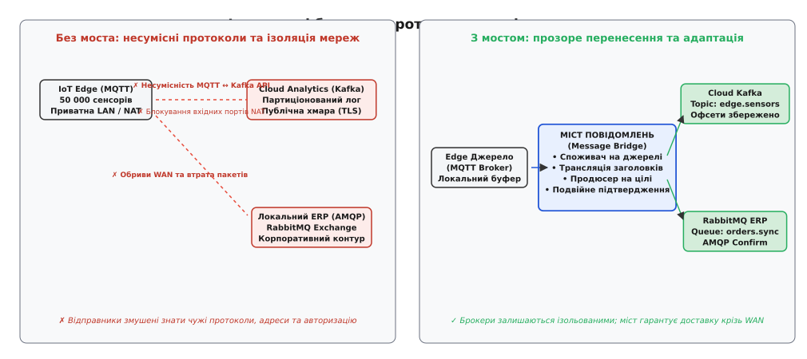
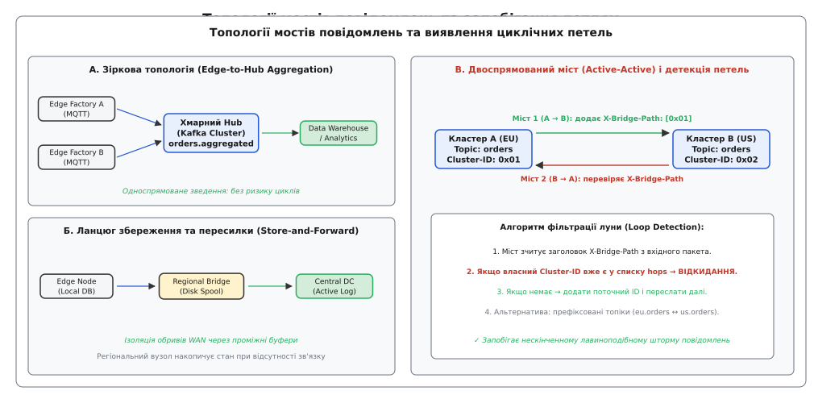
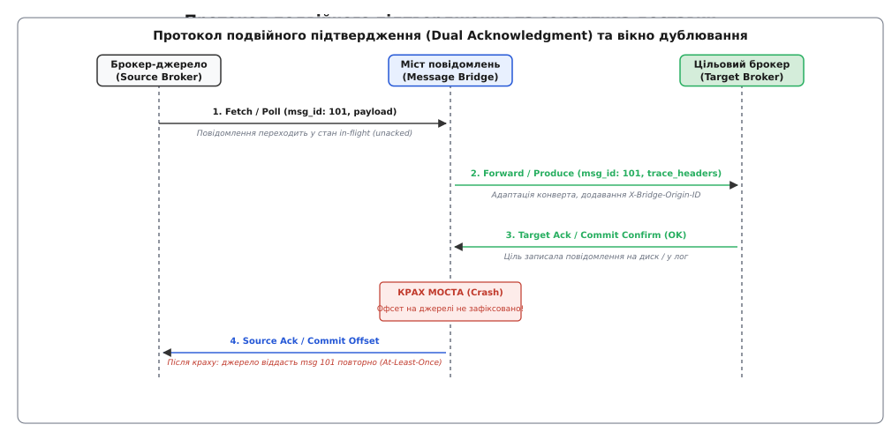

# Міст повідомлень: зв'язування гетерогенних брокерів та ізольованих середовищ

<preknowlist>
- [Черга повідомлень](topic:sf-distributed/message-queue) — передача повідомлень «точка-точка» між одним відправником та одним отримувачем через буфер.
- [Pub/sub (тема)](topic:sf-distributed/publish-subscribe) — розсилання подій багатьом невідомим підписникам без прямого зв'язку між компонентами.
- [Гарантії доставки](topic:sf-distributed/delivery-guarantees) — семантика at-most-once, at-least-once та exactly-once у ненадійній мережі.
- [Ідемпотентність](topic:sf-distributed/idempotency) — властивість операції давати однаковий результат при повторному виконанні.
- [Мертва черга](topic:sf-distributed/dead-letter-queue) — ізоляція повідомлень, які неможливо обробити чи доставити адресату.
</preknowlist>

Сучасне промислове підприємство експлуатує 50 000 телеметричних контролерів на виробничих лініях, які генерують 100 000 показників щосекунди. Датчики температури, вібрації верстатів та лічильники випуску продукції публікують дані в локальні брокери Eclipse Mosquitto за протоколом MQTT через ізольовану цехову мережу. Водночас аналітична платформа підприємства розгорнута в публічній хмарі на базі кластера Apache Kafka, де потоки подій обробляються моделями машинного навчання для завчасного виявлення поломок обладнання. Крім того, центральна система управління ресурсами (ERP) на базі реляційної СУБД та брокера RabbitMQ очікує підсумкових звітів про виконані замовлення через протокол AMQP 0-9-1.

Спроба змусити периферійні контролери напряму підключатися до хмарного кластера Kafka призводить до негайної відмови інфраструктури:
1. **Несумісність транспортних протоколів і форматів:** Контролери мають мікроскопічний стек пам'яті й підтримують лише двійкові пакети MQTT із фіксованими рівнями якості обслуговування (QoS 0, 1, 2), тоді як Kafka вимагає складного двійкового протоколу з координацією метаданих партицій, пакетуванням записів (Batching) та керуванням пулами з'єднань через SASL/TLS.
2. **Мережева ізоляція та блокування NAT:** Цехові шлюзи розташовані за корпоративними міжмережевими екранами (Firewall) і транслюють адреси (NAT). Хмарний кластер не має фізичної можливості ініціювати вхідне TCP-з'єднання до заводських серверів, а відкриття прямих портів назовні суворо заборонено політиками кібербезпеки підприємства.
3. **Нестійкість до обривів глобальної мережі (WAN Flapping):** Нестабільні канали зв'язку або супутникові лінки регулярно зазнають затримок і тимчасових обривів на десятки хвилин. Якщо відправник працює через синхронний мережевий виклик або очікує відповіді від віддаленої хмари в реальному часі, буфери оперативної пам'яті мікроконтролерів миттєво переповнюються, спричиняючи масову втрату критичних телеметричних даних.


*Зліва: спроба прямого зв'язування ізольованих брокерів зазнає краху через несумісність протоколів, блокування NAT та обриви WAN. Справа: міст повідомлень виступає прозорим ретранслятором, зберігаючи автономію кожного середовища.*

## Принцип функціонування та визначення моста

Щоб об'єднати фізично ізольовані або технологічно несумісні системи обміну повідомленнями без переписування прикладного коду відправників і одержувачів, на межі мережевих контурів розміщують автономний ретрансляційний компонент — **міст повідомлень** (англ. *Message Bridge*, від старофранцузького *pon*, латинського *pons, pontis* — штучна інженерна споруда для з'єднання двох берегів через прірву або водну перешкоду).

Міст повідомлень функціонує як активний посередник із подвійною роллю:
* Для вихідної системи повідомлень він виступає стандартним **споживачем** (Consumer / Subscriber), який безперервно вичитує дані з локальної черги чи топіка.
* Для цільової системи повідомлень він виступає стандартним **видавцем** (Producer / Publisher), який пересилає зчитані пакети у відповідну віддалену чергу чи партиціонований лог.

Головна архітектурна цінність моста полягає в **повному розчепленні інфраструктурних доменів**:
* **Ізоляція топології:** Локальні сенсори публікують дані в найближчий цеховий брокер MQTT, не знаючи про існування хмарної Kafka. Хмарні аналітичні сервіси вичитують дані з Kafka, не маючи жодного мережевого маршруту до заводських датчиків.
* **Адаптація протоколів і конвертів:** Міст бере на себе перетворення службових заголовків, адаптацію структур метаданих і перепакування корисного навантаження відповідно до вимог цільового транспорту.
* **Буферизація та подолання мережевих обривів:** При зникненні зв'язку з хмарою міст накопичує повідомлення на локальному дисковому накопичувачі й відновлює ретрансляцію після підняття каналу, гарантуючи відсутність прогалин у потоці подій.

Еволюція цієї концепції пройшла довгий шлях від перших каналів мейнфреймів IBM MQ до сучасних мультихмарних реплікаторів ([як розвивалася концепція від ранніх пропрієтарних MOM-каналів і патернів EIP до розподілених кластерних мостів](topic:sf-distributed/message-bridge-georeplication-topologies/hist-bridge-evolution.md)).

## Класифікація та різновиди мостів

Залежно від технологічного складу взаємодіючих підсистем, характеру напрямку трафіку та топології мережі мости поділяють на кілька чітких категорій.

```
                           МОСТИ ПОВІДОМЛЕНЬ
                                  │
         ┌────────────────────────┴────────────────────────┐
         ▼                                                 ▼
ГЕТЕРОГЕННІ МОСТИ                                 ГОМОГЕННІ МОСТИ
(Різні протоколи / технології)                    (Однакові брокери між регіонами)
• MQTT ↔ Apache Kafka                             • Kafka MirrorMaker 2 (KIP-382)
• RabbitMQ (AMQP) ↔ AWS SQS                       • RabbitMQ Federation & Shovel
• JMS ↔ NATS Streaming                            • Mosquitto Edge-to-Cloud Bridge
```

### 1. Гетерогенні мости (Heterogeneous Bridges)

Гетерогенний міст з'єднує дві принципово різні системи обміну повідомленнями, що різняться моделями доставки, двійковими протоколами та семантикою підтверджень:

* **Міст «IoT Edge ↔ Cloud Stream» (MQTT ↔ Kafka):** Вичитує двійкові телеметричні публікації з топіка `factory/berlin/temperature`, формує запис Kafka Record, додає мітку часу та ідентифікатор цеху в Kafka Headers і записує повідомлення в топік `telemetry.raw` із ключем, рівним `sensor_id`.
* **Міст «Корпоративна черга ↔ Хмарна черга» (RabbitMQ ↔ AWS SQS):** Зчитує AMQP-пакети з черги замовлень, адаптує JSON-структуру та публікує їх у чергу SQS через REST API Amazon Web Services.
* **Міст «Шина подій ↔ Черга завдань» (NATS ↔ RabbitMQ):** Перетворює легковики ефемерні сигнали NATS у персистентні повідомлення з гарантією збереження на диску для важких фонових обробників.

### 2. Гомогенні мости (Homogeneous Bridges)

Гомогенний міст з'єднує два фізично розділені екземпляри або кластери **однієї й тієї самої технології**. Застосовується для географічної реплікації, міграції між версіями або аварійного відновлення (Disaster Recovery):

* **Apache Kafka MirrorMaker 2 (MM2):** Реплікує партиції топіків між кластерами в різних дата-центрах (наприклад, `us-east-1` → `eu-central-1`), синхронізує зміщення груп споживачів (Consumer Group Offsets) та автоматично запобігає зацикленню через префіксацію імен.
* **RabbitMQ Shovel / Federation:** Плагін, що автоматично переміщує повідомлення з черги на одному брокері в чергу на іншому брокері через стандартний протокол AMQP, згладжуючи пікові навантаження та забезпечуючи локальну доступність даних.
* **Mosquitto Bridge:** Вбудований механізм брокера Eclipse Mosquitto, що дозволяє локальному екземпляру підключатися як клієнт до вищого брокера та ретранслювати піддерево топіків за маскою (наприклад, `sensors/#`).

## Топології передачі даних

За конфігурацією потоків даних виділяють чотири базові топології:

1. **Односпрямована зірка (Hub-and-Spoke / Edge-to-Core):** Десятки периферійних вузлів (Spokes) ретранслюють дані в єдиний центральний аналітичний кластер (Hub). Трафік рухається виключно в один бік. Ризик виникнення циклічних петель відсутній за побудовою.
2. **Ланцюгова ретрансляція (Store-and-Forward Chain):** Повідомлення передаються послідовно через проміжні вузли: `Локальний контролер -> Цеховий шлюз -> Регіональний дата-центр -> Центральна хмара`. Кожен проміжний міст має власний персистентний буфер, що захищає ланцюг від обривів на будь-якій ділянці.
3. **Двоспрямована реплікація (Bidirectional / Active-Active):** Кластери в двох регіонах (наприклад, Франкфурт і Сінгапур) одночасно приймають записи від локальних клієнтів і реплікують зміни один одному. Вимагає спеціальних алгоритмів виявлення та гасіння луни.
4. **Повністю зв'язна сітка (Mesh Topology):** Мережа з багатьох дата-центрів, де кожен вузол з'єднаний мостами з кількома сусідами для забезпечення відмовостійкості маршрутів.


*А: Зіркова агрегація периферійних даних. Б: Ланцюгова ретрансляція зі збереженням на проміжних вузлах. В: Двоспрямований міст із фільтрацією відлуння за заголовком X-Bridge-Path.*

## Анатомія протокольної трансляції та адаптація конвертів

При гетерогенному зв'язуванні міст повідомлень виконує глибоку адаптацію структур метаданих. Кожен брокер має власну модель представлення службових атрибутів:

```
+-----------------------------------------------------------------------------------+
|                        ПРОТОКОЛЬНА ТРАНСЛЯЦІЯ КОНВЕРТА                            |
|                                                                                   |
|  Вхід (MQTT v5 Packet)                    Вихід (Kafka Producer Record)           |
|  ├── Topic: "plant1/temp"        ───────► ├── Topic: "eu.plant1.telemetry"        |
|  ├── QoS: 1 (Ack required)       ───────► ├── Partition: hash(device_id) % 32     |
|  ├── User Property: "hw_v": "3"  ───────► ├── Header: "X-Origin-HW: 3"            |
|  ├── Correlation Data: [UUID]    ───────► ├── Header: "X-Correlation-ID: UUID"   |
|  └── Payload: binary bytes       ───────► └── Value: binary bytes (Unchanged)     |
+-----------------------------------------------------------------------------------+
```

### 1. Трансляція адресних шляхів і топіків (Topic Mapping)
Міст використовує правила відображення імен каналів:
* **Статичний мапінг 1:1:** Пряме відображення `source_queue_orders -> target_topic_orders`.
* **Динамічний мапінг на основі регулярних виразів (Regex Dynamic Routing):** Вхідний шлях вида `devices/(?<region>[^/]+)/(?<type>[^/]+)` транслюється у вихідний топік `iot.${region}.${type}`.
* **Префіксація просторів імен:** Додавання префікса вихідного кластера для запобігання колізіям імен (`orders -> us-east.orders`).

### 2. Узгодження часових міток і проблема дрейфу годинників (Clock Skew)
Кожне повідомлення в розподіленій системі супроводжується кількома різними часовими мітками:
* `Source Timestamp` — час створення події на фізичному датчику або в прикладній програмі.
* `Bridge Ingress Timestamp` — точний час прийому пакета мостом у момент читання з сокета.
* `Target Broker Timestamp` — час фізичного запису повідомлення в журнал цільового кластера.

Через відсутність глобальної синхронізації часу годинники на периферійних шлюзах можуть відставати або поспішати на секунди чи хвилини порівняно з серверами хмарного кластера. Промисловий міст не перезаписує первинну часову мітку бізнес-події, а зберігає її в окремому заголовку `X-Origin-Timestamp`, призначаючи полю часової мітки цільового брокера значення `Bridge Ingress Timestamp`. Це гарантує коректну роботу політик утримання даних (Retention Policies) у цільовому кластері.

## Безпека, шифрування та ізоляція контурів (DMZ & mTLS)

У корпоративних інфраструктурах міст повідомлень часто розгортається в демілітаризованій зоні (DMZ) і виконує функцію захисного бастіону між довіреними та недовіреними мережами.

Ключові аспекти безпеки моста:
* **Трансляція схем автентифікації:** На периферійному боці міст може приймати з'єднання через легкі симетричні API-токени або сертифікати локального внутрішнього центру сертифікації (Private CA). Для підключення до хмарного кластера міст використовує корпоративний протокол SASL/OAUTHBEARER або двосторонній mTLS з публічними комерційними сертифікатами.
* **Маскування та фільтрація конфіденційних даних (Data Redaction & PII):** Відповідно до вимог регуляторів безпеки (наприклад, GDPR або HIPAA) міст може бути налаштований на автоматичне видалення або хешування персональних даних клієнтів (номери телефонів, IP-адреси, банківські реквізити) до того, як пакет перетне межу корпоративного периметра й потрапить у публічну хмару.
* **Ізоляція від атак на відмову в обслуговуванні (DoS Protection):** Якщо один зі зламаних периферійних контролерів починає флудити брокер мільйонами сміттєвих пакетів, міст із механізмом обмеження швидкості (Rate Limiting) відсікає надлишковий трафік, захищаючи дорогий хмарний кластер від перевантаження.

## Надійність та протокол подвійного підтвердження (Dual Acknowledgment)

Головний теоретичний та інженерний виклик моста повідомлень полягає в забезпеченні гарантії доставки за умови, що вихідний і цільовий брокери є незалежними системами і не підтримують спільну розподілену транзакцію (Two-Phase Commit, 2PC).

Якщо міст вичитає повідомлення з черги джерела, негайно надішле джерелу підтвердження (`ACK`), а потім спробує записати пакет у цільовий брокер під час мережевого збою, повідомлення буде безповоротно втрачено (семантика [At-Most-Once](topic:sf-distributed/delivery-guarantees)).

Щоб унеможливити втрату даних, міст повідомлень зобов'язаний реалізовувати протокол **подвійного підтвердження** (Dual Acknowledgment):

```
+---------------+              +------------------+              +---------------+
| Source Broker |              |  Message Bridge  |              | Target Broker |
+---------------+              +------------------+              +---------------+
        │                               │                                │
        │ 1. Poll (msg, offset=101)     │                                │
        │──────────────────────────────>│                                │
        │    (msg у стані in-flight)    │                                │
        │                               │ 2. Forward / Produce (msg)     │
        │                               │───────────────────────────────>│
        │                               │                                │
        │                               │ 3. Target Write Ack (OK)       │
        │                               │<───────────────────────────────│
        │                               │    (Записано на диск/лог)      │
        │ 4. Source Commit Offset (101) │                                │
        │<──────────────────────────────│                                │
        │    (Видалено з черги/фіксація)│                                │
```

### Покроковий алгоритм:

1. **Отримання пакета (Fetch & Hold):** Міст зчитує повідомлення з вихідної черги. Повідомлення переходить у стан очікування (in-flight) або блокується сеансовим локом; офсет у вихідному брокері **не фіксується**.
2. **Адаптація та передача (Produce):** Міст перетворює метадані, додає службові мітки трасування та відправляє пакет у сокет цільового брокера.
3. **Очікування підтвердження від цілі (Wait Target Confirmation):** Міст блокує просування офсету до отримання синхронного підтвердження запису від цілі (наприклад, Kafka `acks=all` або AMQP `basic.ack`).
4. **Фіксація на джерелі (Commit Source Offset):** Лише після успішного підтвердження від цільового сховища міст надсилає команду підтвердження (`commit_offset` або `ack`) вихідному брокеру.


*Кроки 1–4 протоколу подвійного підтвердження. Крах моста після кроку 3 призводить до повторної доставки повідомлення при відновленні, вимагаючи ідемпотентності на боці кінцевих споживачів.*

### Аналіз відмов та природа At-Least-Once доставки

Розглянемо аварійний випадок: міст успішно виконав крок 3 (цільовий брокер зберіг повідомлення), але перед виконанням кроку 4 процес моста аварійно завершується (SIGKILL, падіння сервера, втрата живлення).

Після перезапуску міст відновлює читання з останнього зафіксованого зміщення на джерелі. Оскільки крок 4 не відбувся, вихідний брокер віддасть те саме повідомлення повторно. Міст знову перешле його цільовому брокеру.

Таким чином, будь-який відмовостійкий міст повідомлень за своєю математичною природою забезпечує семантику **[At-Least-Once](topic:sf-distributed/delivery-guarantees)** (доставка щонайменше один раз). Для запобігання побічним ефектам повторних операцій у цільовій системі споживачі повинні бути спроектовані як [ідемпотентні](topic:sf-distributed/idempotency) обробники.

## Синхронізація зміщень (Offset Translation) та прозорий Failover

У розподілених журналах (таких як Apache Kafka) кожне повідомлення ідентифікується монотонно зростаючим зміщенням (Offset) у межах партиції. Проте офсет повідомлення в кластері `EU` (наприклад, `offset = 120400`) практично ніколи не дорівнює офсету того самого повідомлення в дзеркальному кластері `US` (де воно може отримати `offset = 95210`).

Це пояснюється тим, що цільовий кластер створювався в інший час, міг пропускати службові транзакції або приймати локальні повідомлення від інших джерел.

Якщо сервіс-споживач у разі аварії європейського дата-центра має миттєво переключитися на читання з американського кластера, виникає дилема: з якого саме зміщення в кластері `US` продовжувати читання?
* Якщо почати читати з початку топіка (`earliest`), споживач заново вичитає терабайти вже обробленої історії, створюючи колосальне навантаження.
* Якщо почати читати з кінця топіка (`latest`), усі повідомлення, накопичені під час аварії, будуть безповоротно втрачені.

Для вирішення цієї проблеми сучасні мости реалізують механізм **двосторонньої трансляції зміщень** (Offset Translation):
1. Міст безперервно формує внутрішню таблицю відповідності:
```
(source_topic, partition, source_offset) -> (target_topic, partition, target_offset)
```
2. Спеціалізований фоновий потік (наприклад, `CheckpointConnector` у MirrorMaker 2) періодично зчитує зміщення груп споживачів (`consumer_group_id`) на джерелі, знаходить еквівалентні цільові зміщення у створеній таблиці та записує їх у системний топік `__consumer_offsets` цільового кластера.
3. Під час аварійного перемикання група споживачів підключається до резервного кластера і прозоро продовжує роботу з точної позиції, не втрачаючи жодного повідомлення і не дублюючи вже оброблені пакети.

## Запобігання нескінченним циклам (Loop Detection & Path Vectoring)

У двоспрямованих топологіях (Active-Active) виникає загроза циклічної луни:
1. Клієнт публікує повідомлення `M` у кластер `A`.
2. Міст `A -> B` зчитує `M` і записує його в кластер `B`.
3. Зворотний міст `B -> A` бачить нове повідомлення `M` у кластері `B`, вважає його локальною подією і записує назад у кластер `A`.
4. Міст `A -> B` знову вичитує `M` і пересилає в `B`.

Цей процес породжує експоненційний лавиноподібний шторм (Message Storm), який за лічені хвилини вичерпує дисковий простір брокерів і забиває гігабітні канали зв'язку.

### Методи розриву петель:

1. **Векторне маркування пройденого шляху (Hop Path Header):**
   * При створенні повідомлення йому присвоюється заголовок `X-Bridge-Origin-ID: 0x01` та `X-Bridge-Path: [0x01]`.
   * Кожен міст перед відправкою перевіряє умову:
   ```
   if (target_cluster_id ∈ msg.hop_path) {
       drop_message_and_ack_source(msg); // Виявлено петлю: відкидаємо луну
   } else {
       msg.hop_path.append(target_cluster_id);
       forward(msg);
   }
   ```
   * Якщо ідентифікатор цільового кластера вже присутній у списку відвіданих вузлів, міст негайно відкидає пакет і підтверджує його на джерелі, розриваючи нескінченне коло.

2. **Префіксація просторів імен топіків (Namespaced Topic Replication):**
   * Замість запису в однойменний топік міст створює префіксований топік на цілі: повідомлення з топіка `orders` кластера `us-east` записуються в топік `us-east.orders` у кластері `eu-central`.
   * Зворотний міст налаштований реплікувати лише локальні топіки `orders` (або `eu-central.orders`), повністю ігноруючи топіки з чужими префіксами `us-east.*`. Цей підхід є базовим стандартом у Kafka MirrorMaker 2.

3. **Обмеження максимальної кількості стрибків (Time-To-Live / Max Hops):**
   * Заголовок `X-Bridge-Hop-Count` інкрементується на кожному мості. При перевищенні ліміту (наприклад, `hops > 8`) повідомлення спрямовується до [мертвої черги](topic:sf-distributed/dead-letter-queue) як аномальне.

## Збереження порядку та мапінг партицій

При зв'язуванні систем із різними моделями організації черг виникає завдання збереження відносного порядку подій:

```
RabbitMQ (Single FIFO Queue) ───[ Message Bridge ]───► Kafka Topic (64 Partitions)
                                (Key Hash Dispatch)
```

Якщо міст читатиме чергу RabbitMQ і відправлятиме події в Kafka за круговим алгоритмом (Round-Robin), події одного клієнта (`OrderCreated`, `PaymentProcessed`, `OrderCancelled`) потраплять у різні партиції. Оскільки споживачі в Kafka читають різні партиції паралельно, скасування замовлення може бути виконане раніше за його створення.

Для гарантії порядку міст реалізує **детермінований мапінг за бізнес-ключем**:
1. Міст витягує з корисного навантаження бізнес-ідентифікатор сутності (`account_id`, `device_id` чи `order_id`).
2. Номер цільової партиції розраховується через детерміновану хеш-функцію:
```
target_partition = murmur3(entity_key) % num_partitions
```
3. Усі події з однаковим ключем завжди потрапляють у ту саму партицію, що гарантує суворий монотонний порядок їхнього читання цільовими споживачами.

## Обробка отруйних пакетів (Poison Messages) та ізоляція в Dead Letter Queue

Під час безперервної ретрансляції мільйонів повідомлень міст неминуче зіткнеться з пакетами, які цільовий брокер принципово не може прийняти:
* **Порушення лімітів розміру:** Розмір корисного навантаження перевищує максимальний ліміт цільового брокера (наприклад, пакет розміром 15 МБ при обмеженні `max.message.bytes = 1MB` у Kafka).
* **Пошкоджений бінарний формат:** Невалідний JSON або некоректний бінарний заголовок Protobuf, який відхиляється шлюзом перевірки схем.
* **Помилка прав доступу (Security / ACL Rejection):** Цільовий брокер відхиляє запис у топік через відсутність прав у сервісного облікового запису моста.

Якщо міст у разі такої помилки безкінечно повторюватиме спробу відправки (Infinite Retry Loop), черга повністю заблокується: всі наступні валідні повідомлення стоятимуть за цим «отруйним пакетом» (Poison Pill).

Для запобігання блокуванню міст реалізує політику безпечної ізоляції:
1. Міст виконує обмежену кількість повторів (наприклад, 3 спроби) з експоненційним відступом і випадковим джитером (Jittered Backoff).
2. Якщо помилка класифікована як непоправна (Non-Retryable Error, наприклад помилка валідації схеми чи розміру), пакет негайно перенаправляється до спеціалізованої [мертвої черги](topic:sf-distributed/dead-letter-queue) (Dead Letter Queue, DLQ).
3. До заголовків мертвого пакета додаються метадані розслідування: `X-DLQ-Original-Topic`, `X-DLQ-Error-Class`, `X-DLQ-Timestamp`, `X-DLQ-Retry-Count`.
4. Міст фіксує зміщення вихідного повідомлення на джерелі, дозволяючи черзі вільно просуватися далі без накопичення лагу.

## Керування пам'яттю, дискове скидання (Spooling) та протитиск

Якщо цільовий брокер сповільнює обробку (через перевантаження I/O або збої реплікації), швидкість вичитування з джерела перевищуватиме швидкість запису в ціль. Якщо міст буферизуватиме невідправлені пакети в необмеженій пам'яті процесу, він зазнає краху через помилку Out-Of-Memory (OOM).

Промисловий міст використовує багаторівневий захист:
* **Обмежена черга в пам'яті (Bounded In-Memory Queue):** Внутрішній буфер має фіксовану ємність (наприклад, 50 000 елементів). При його заповненні потік споживання блокується.
* **Наскрізний протитиск (Backpressure):** Заблокований споживач перестає вичитувати пакети з TCP-сокета вихідного брокера. Вихідний брокер бачить заповнення вікна TCP (Zero Window) і починає накопичувати повідомлення у своєму власному персистентному сховищі, захищаючи процес моста від вичерпання RAM.
* **Дискове скидання (Persistent Disk Spooler):** При тривалих обривах глобальної мережі (понад 10–30 секунд) міст автоматично скидає повідомлення на локальний SSD у вбудовану базу даних (наприклад, RocksDB чи SQLite). Після відновлення зв'язку фоновий процес вичитує накопичений дисковий пул і плавно ретранслює його в цільовий кластер.

Детальний приклад реалізації надійного моста повідомлень із потокобезпечним буфером, детекцією петель і семантикою подвійного підтвердження наведено в практичній вставці ([практична реалізація відмовостійкого моста повідомлень з подвійним підтвердженням, детекцією петель та захистом від переповнення буфера](topic:sf-distributed/message-bridge-georeplication-topologies/proj-reliable-bridge.md)).

## Мережеві розділення та теорема CAP у мостах

При розгортанні мостів між географічно віддаленими регіонами інженери безпосередньо стикаються з наслідками теореми CAP (узгодженість проти доступності за наявності мережевого розділення).

Якщо магістральний канал між двома дата-центрами розривається (Network Partition), система повинна обрати режим поведінки:
* **Режим високої доступності (AP Mode):** Кожен регіональний дата-центр продовжує приймати локальні операції запису. Мости з обох боків накопичують повідомлення у своїх дискових буферах скидання. Після відновлення зв'язку мости зшивають історію. Оскільки в цей період клієнти могли змінювати ті самі сутності в різних регіонах, виникають конфлікти паралельних версій, які вирішуються за алгоритмами останнього запису (Last-Write-Wins, LWW) або через конфліктно-вільні репліковані типи даних (CRDT).
* **Режим суворої узгодженості (CP Mode):** При втраті зв'язку з центральним кластером периферійний міст блокує вхідний потік або переводить локальні сервіси в режим «лише для читання» (Read-Only), гарантуючи, що жодна подія не буде прийнята без можливості її негайної централізованої фіксації.

## Низькорівнева оптимізація та продуктивність (Zero-Copy vs Transcoding)

Пропускна здатність моста повідомлень безпосередньо залежить від обсягу роботи процесора над кожним байтом:

1. **Гомогенна ретрансляція (Zero-Copy Passthrough):**
   Коли міст реплікує байти між двома кластерами Kafka або між двома чергами AMQP, корисне навантаження повідомлення не потребує десеріалізації. Міст оперує сирими двійковими фрагментами пам'яті (Memory Slices / `std::span`), передаючи їх у мережевий сокет цільового сервера через системні виклики `writev()` або `splice()`. Такий підхід дозволяє одному процесу моста насичувати канали зв'язку пропускною здатністю 10–40 Гбіт/с при мінімальному навантаженні на центральний процесор.

2. **Гетерогенне перекодування (Payload Transcoding Overhead):**
   Якщо міст змушений парсити JSON відправника, перевіряти його за схемою та перекодовувати у бінарний Protobuf або Avro для цільового сховища, продуктивність обмежена швидкістю роботи парсера й алокатора пам'яті. У таких сценаріях ядро моста проектують за моделлю пулу потоків-трансляторів (Worker Thread Pool) із повторним використанням буферів виділення пам'яті (Object Pooling), щоб усунути паузи на збирання сміття та накладні витрати системного менеджера пам'яті.

## Модель наскрізної затримки та конвеєризація (Pipelining)

Повна наскрізна затримка ретрансляції повідомлення через міст складається з кількох послідовних часових інтервалів:

```
T_total = T_poll + T_queue + T_transform + T_wan_rtt + T_target_fsync + T_source_ack
```

Де:
* `T_poll` — час вибірки пакета з джерела (мережевий запит + дискове читання брокера джерела).
* `T_queue` — час перебування повідомлення у внутрішній черзі оперативної пам'яті моста.
* `T_transform` — час адаптації заголовків та перевірки векторного шляху на відсутність петель.
* `T_wan_rtt` — мережевий час передачі пакета через глобальну мережу WAN до цільового дата-центра (наприклад, 80–120 мс між Європою та США).
* `T_target_fsync` — час фізичної фіксації запису цільовим брокером (дисковий скид fsync або кворумна реплікація між брокерами цілі).
* `T_source_ack` — час повернення підтвердження фіксації офсету у вихідний брокер.

Якщо міст працює в строго синхронному режимі «одне повідомлення за раз» (Stop-and-Wait), максимальна пропускна здатність буде жорстко обмежена величиною `1 / T_total`. При затримці `T_total = 100 ms` міст зможе передати лише 10 повідомлень на секунду через одне TCP-з'єднання.

Для подолання цього бар'єру міст використовує **асинхронну конвеєризацію з ковзним вікном (In-Flight Sliding Window)**:
* Відправник відправляє сотні пакетів безперервним потоком, не чекаючи підтвердження на кожен окремий пакет.
* Кількість повідомлень у польоті обмежується параметром `max_in_flight_requests` (наприклад, 1000–5000 запитів).
* Підтвердження від цільового брокера обробляються асинхронно в окремому потоці відповідей, що дозволяє повністю утилізувати смугу пропускання магістрального каналу WAN незалежно від географічної відстані.

## Порівняльний аналіз промислових рішень

Нижче наведено порівняльну характеристику провідних технологій створення мостів повідомлень у сучасних розподілених системах:

| Критерій | Apache Kafka MirrorMaker 2 | RabbitMQ Shovel / Federation | Mosquitto MQTT Bridge | AWS EventBridge Pipes |
|---|---|---|---|---|
| **Тип зв'язування** | Гомогенний (Kafka ↔ Kafka) | Гомогенний / Гетерогенний (AMQP ↔ AMQP) | Гомогенний (MQTT ↔ MQTT) | Гетерогенний (SQS/Kinesis ↔ EventBridge) |
| **Масштабованість** | Розподілений кластер Kafka Connect | Вбудований процес брокера / Erlang | Вбудований клієнт брокера C | Повністю безсерверний (Serverless) |
| **Захист від петель** | Префіксація імен топіків (`source.topic`) | Налаштування заголовків `x-hops` / exchange | Префіксація топіків (`prefix/topic`) | Фільтрація за метаданими джерела події |
| **Семантика доставки** | At-Least-Once (з точним мапінгом офсетів) | At-Least-Once (AMQP Confirms) | At-Least-Once (QoS 1/2) | At-Least-Once |
| **Трансляція схем** | Підтримка Schema Registry sync | Немає (прозоре перенесення байтів) | Немає (двійковий payload) | Вбудований JSON Schema Transformer |
| **Основне призначення** | Міжкластерна геореплікація Big Data | Зв'язування черг між дата-центрами | Передача IoT-даних з периферії в хмару | Хмарна інтеграція мікросервісів |

> 🔧 **Навіщо це.**
> У мікросервісній та периферійній розробці міст повідомлень дозволяє розділити системи за зонами відповідальності, мережевої безпеки та масштабування. Замість побудови монолітної шини, де кожен дрібний сервіс зобов'язаний підтримувати єдиний важкий протокол, міст дозволяє використовувати швидкий легкий MQTT на периферії, надійний транзакційний RabbitMQ у бізнес-сервісах та масштабовану Kafka в аналітичному контурі, забезпечуючи гарантований рух даних між ними без втрат і без спагеті-залежностей.
