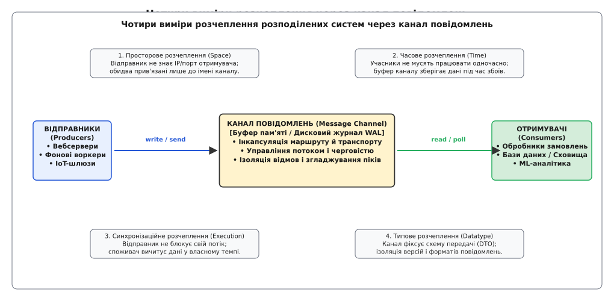
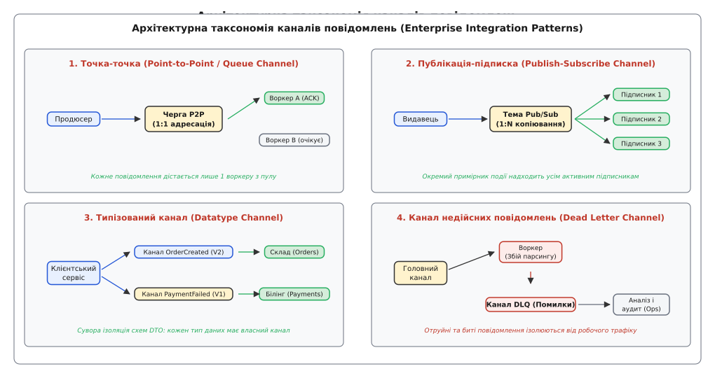
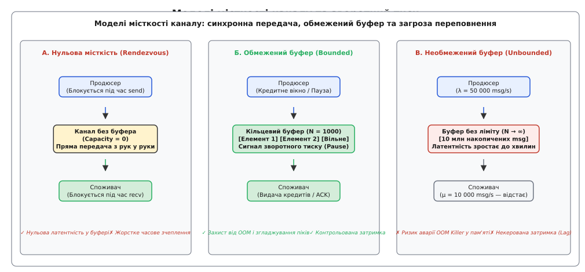
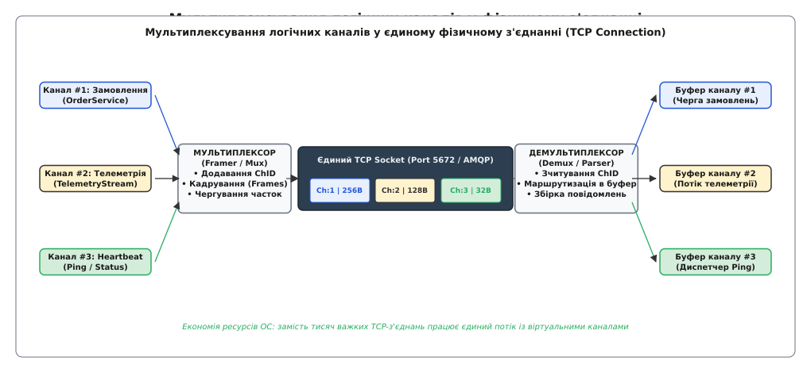

# Канал повідомлень: архітектурна абстракція зв'язку, моделі буферизації та мультиплексування

<preknowlist>
- [Омани розподілених обчислень](topic:sf-distributed/distributed-fallacies) — мережа ненадійна, затримка не нульова, а вузли системи зазнають раптових відмов.
- [Гарантії доставки](topic:sf-distributed/delivery-guarantees) — семантика передачі at-most-once, at-least-once та обробка effectively-once.
- [Таймаути й бюджет часу](topic:sf-distributed/timeouts-deadlines) — обмеження тривалості очікування мережевих операцій та запобігання каскадному блокуванню.
- [Черга повідомлень](topic:sf-distributed/message-queue) — модель зв'язку «точка-точка» з розподілом дискретних завдань між воркерами.
- [Pub/Sub](topic:sf-distributed/publish-subscribe) — розсилання подій багатьом незалежним підписникам за моделлю «видавець-підписник».
- [Черга FIFO](topic:sf-algorithms/queue-fifo) — структура даних із послідовною дисципліною вибірки «першим прийшов — першим пішов».
</preknowlist>

Розподілена система моніторингу промислового енергокомплексу збирає показники з 50 000 телеметричних контролерів, кожен із яких кожні 100 мілісекунд надсилає бінарні пакети вимірювань струму, напруги та температури трансформаторів. Загальний вхідний потік сягає 500 000 пакетів на секунду. Мережевий шлюз прийому після розбору заголовків викликає безпосередні функції запису в реляційну базу даних часових рядів, паралельно надсилаючи синхронні HTTP-запити до мікросервісу виявлення аварійних аномалій та модуля довготривалого архівування.

Коли дисковий масив сервера бази даних стикається з плановою операцією скидання журналу транзакцій (*fsync checkpoint*), час відповіді на операцію вставки стрибає з 2 до 450 мілісекунд. Через відсутність проміжного ізолюючого буфера потоки мережевого шлюзу миттєво блокуються в очікуванні сокетів бази даних. За 800 мілісекунд вичерпується пул із 1024 системних потоків операційної системи, ліміт відкритих дескрипторів файлів досягає стелі, а вхідний мережевий буфер мережевої карти переповнюється. Шлюз починає скидати пакети контролерів по тайм-ауту, система втрачає сигнал про критичний перегрів головного силового трансформатора, і аварійне відключення підстанції відбувається без попередження операторів.

Катастрофа сталася тому, що система спиралася на пряме процедурне зчеплення: компонент-відправник вимагав безпосередньої присутності, миттєвої готовності та узгодженого темпу роботи від усіх компонентів-отримувачів. Щоб усунути цю вразливість, між автономними вузлами розташовують фундаментальну архітектурну абстракцію зв'язку — **канал повідомлень** (лат. *canalis* — труба, жолоб; англ. *Message Channel*).

## Чотири виміри розчеплення: як канал ізолює компоненти

Канал повідомлень — це логічний або фізичний кондуїт (трубопровід), який зв'язує рівно одного або кількох відправників із одним чи кількома отримувачами, інкапсулюючи механіку збереження, передачі, маршрутизації та зворотного тиску.


*Чотири фундаментальні виміри розчеплення: канал повідомлень повністю ізолює відправників від топологічних адрес, часового розкладу, потокової синхронізації та внутрішніх структур даних отримувачів.*

Розміщення каналу повідомлень між компонентами розриває чотири критичні зв'язки:

1. **Просторове розчеплення (Spatial / Location Decoupling):**
   Відправник не знає IP-адреси, порту, мережевого хоста чи внутрішньої топології процесів-отримувачів. Продюсер адресує свої повідомлення виключно в іменований канал (наприклад, `telemetry.sensors.raw`). Отримувачі так само підключаються лише до каналу. Якщо сервіс аналітики переноситься на інший сервер або масштабується з 2 до 50 екземплярів, код відправника не змінюється.

2. **Часове розчеплення (Temporal Decoupling):**
   Продюсер та споживач не зобов'язані бути активними та доступними в один і той самий момент часу. Відправник може записати 100 000 повідомлень у канал і завершити свою роботу. Споживач може бути запущений через 2 години після перезавантаження кластера, зчитати всі накопичені повідомлення з буфера каналу в безпечному темпі й успішно зафіксувати результат.

3. **Синхронізаційне розчеплення (Execution / Threading Decoupling):**
   Операція передачі даних у канал виконується асинхронно або за фіксований час запису в буфер (10–50 мікросекунд). Потік відправника не блокується на час виконання важкої бізнес-логіки споживача. Обчислювальні пули відправника та отримувача функціонують у повністю незалежних контекстах планувальника операційної системи.

4. **Типове розчеплення (Datatype Decoupling):**
   Канал фіксує єдиний контракт схеми передачі даних (Data Transfer Object, DTO). Відправник та отримувач можуть бути написані різними мовами програмування (наприклад, C++ на контролері та Go або Java на бекенді), спілкуючись через бінарне серіалізоване тіло (Protocol Buffers, Avro).

Історія того, як інженерна думка відмовилася від спільної пам'яті на користь ізольованих каналів передачі повідомлень, детально висвітлена окремо: [як розвивалася концепція каналу від мереж Кана та моделі CSP Гоара до сучасних шин і брокерів](topic:sf-distributed/message-channel/hist-channel-abstraction.md).

## Анатомія каналу повідомлень: внутрішній конвеєр даних

На фізичному та програмному рівнях канал повідомлень не є монолітною чергою. Це багатошаровий конвеєр, що складається з шести взаємопов'язаних підсистем:

```
[ Продюсер ] ──► [ Вхідний фільтр ] ──► [ Буфер / WAL ] ──► [ Диспетчер ] ──► [ Вихідний фільтр ] ──► [ Споживач ]
                        │                     │                    ▲
                        ▼                     ▼                    │
                (Валідація схеми)     (Диск / Пам'ять)      (Управління потоком)
```

1. **Вхідний термінал (Ingress Endpoint):**
   Точка підключення відправників. Відповідає за прийом байтового потоку, десеріалізацію транспортних заголовків, перевірку прав доступу (ACL) та первинну валідацію ліміту розміру повідомлення.

2. **Вхідний фільтр та інтерцептори (Ingress Interceptors):**
   Конвеєр обробки метаданих: автоматичне проставлення часової мітки прийому (`timestamp_ns`), генерація або збереження наскрізного ідентифікатора трасування (*Trace ID* у форматі W3C TraceContext) та підрахунок вхідних метрик.

3. **Буферне сховище (Storage Engine):**
   Серце каналу. Залежно від вимог до надійності поділяється на два класи:
   - *Ефемерний буфер (In-Memory Ring Buffer):* кільцевий масив або зв'язний список у RAM. Забезпечує мікросекундну затримку передачі, проте втрачає дані при раптовому вимкненні живлення сервера.
   - *Стійкий журнал (Durable Log / Write-Ahead Log, WAL):* послідовний файл на енергонезалежному SSD-накопичувачі. Кожне повідомлення скидається на диск викликом `write()`/`fsync()` до надсилання підтвердження продюсеру, гарантуючи збереження транзакцій при збоях ОС.

4. **Диспетчер та арбітр черги (Queue Dispatcher & Scheduler):**
   Механізм, який відстежує стан підключених споживачів, вибирає наступного отримувача згідно з алгоритмом розподілу (Round-Robin, найменш завантажений, пріоритетний), контролює таймаути оренди (*Visibility Leases*) та обробляє сигнали підтвердження (`ACK`/`NACK`).

5. **Вихідний інтерцептор (Egress Interceptor):**
   Підсистема шифрування корисного навантаження, стиснення (Zstandard, Snappy) або додавання службових заголовків перед відправкою клієнту.

6. **Вихідний термінал (Egress Endpoint):**
   Мережевий або міжпроцесний інтерфейс, що транслює повідомлення в сокет споживача або сигналізує умовній змінній ядра ОС.

## Архітектурна таксономія каналів повідомлень

Каталог шаблонів корпоративної інтеграції (Enterprise Integration Patterns, EIP) виділяє чотири базові різновиди каналів залежно від кардинальності адрес, семантики доставки та типізації контрактів.


*Таксономія каналів: відмінності між P2P-розподілом задач (1:1), широкомовною розсилкою Pub/Sub (1:N), ізоляцією бізнес-схем у Datatype-каналах та ізоляцією помилок у Dead Letter Channel.*

### 1. Канал «Точка-точка» (Point-to-Point / Queue Channel)
Канал типу «точка-точка» гарантує, що **кожне відправлене повідомлення буде отримане та оброблене рівно одним споживачем**, навіть якщо до каналу одночасно підключено пул із десятків паралельних воркерів.

- *Призначення:* розподіл дискретних обчислювальних завдань (наприклад, обробка фінансової транзакції, кодування відеофрагмента).
- *Механізм:* воркери виступають конкурентними споживачами (*Competing Consumers*). Брокер видає елемент першому вільному воркеру, робить його невидимим для інших на час виконання, а після отримання квитанції `ACK` видаляє його з черги (руйнівне вичитування).

### 2. Канал «Публікація-підписка» (Publish-Subscribe / Topic Channel)
Канал типу «видавець-підписник» реалізує широкомовне розсилання подій: **кожне опубліковане повідомлення копіюється та доставляється всім активним підписникам**, зареєстрованим на цьому каналі.

- *Призначення:* трансляція незмінних фактів бізнес-домену (наприклад, подія `OrderCreated`, зміна курсу акцій).
- *Механізм:* канал підтримує внутрішній список підписок. При надходженні нового повідомлення диспетчер тиражує покажчик на нього в індивідуальні вихідні черги кожного зареєстрованого підписника (*Fan-Out*).

### 3. Типізований канал (Datatype Channel)
У великих мікросервісних системах поширеною помилкою є спроба спрямувати всі типи подій у єдиний загальний канал (`all.events`), змушуючи кожного отримувача десеріалізувати пакет, аналізувати текстовий рядок типу і викидати винятки при невідповідності полів.

**Типізований канал** жорстко прив'язується до однієї конкретної схеми даних (наприклад, канал `telemetry.temperature.v2` приймає виключно структури типу `TemperatureMetricV2`).
- *Перевага:* повністю усувається хаос поліморфного розбору, спрощується версіонування схем і зникає ризик пошкодження пам'яті через неправильну інтерпретацію двійкових полів.

### 4. Канал недійсних повідомлень та мертва черга (Invalid Message & Dead Letter Channel)
Якщо споживач вичитує з каналу повідомлення з пошкодженим тілом JSON або некоректним бізнес-значенням (наприклад, від'ємна сума платежу), спроба його повторної обробки приречена на провал. Якщо повернути таке повідомлення назад у чергу (`requeue`), воно негайно знову надійде на обробку, спричиняючи нескінченний цикл аварій воркера (отруйна пігулка, *Poison Pill*).

Для захисту робочого каналу недійсні повідомлення після вичерпання ліміту спроб (`K = 3`) автоматично вилучаються диспетчером і перенаправляються в спеціалізований **канал недійсних повідомлень (Dead Letter Channel, DLQ)**. Робочий конвеєр продовжує функціонувати без зупинок, а інженери експлуатації можуть безпечно дослідити збережені в DLQ пошкоджені пакети.

Повний перелік програмних сигнатур, матрицю переходів станів та формат бінарних кадрів детально стандартизовано в довідці: [повна специфікація інтерфейсних примітивів, переходів станів та протоколу кадрування каналу](topic:sf-distributed/message-channel/api-channel-primitives.md).

## Інфраструктурні патерни топології каналів: Адаптер, Міст та Шина

У реальних гетерогенних підприємствах окремі підсистеми не вміють підключатися безпосередньо до каналу або використовують несумісні брокери. Для їх зв'язування застосовують три інфраструктурні патерни:

### 1. Канальний адаптер (Channel Adapter)
Багато бізнес-додатків (застарілі реляційні СУБД, файлові сховища FTP, сторонні SaaS-сервіси) не мають вбудованого коду для роботи з брокерами повідомлень.
- **Канальний адаптер** підключається до вихідної системи через її рідний інтерфейс (наприклад, опитує таблицю бази даних або читає журнал транзакцій бази через Change Data Capture, CDC), перетворює зміни на структуровані повідомлення та записує їх у відповідний канал повідомлень. Для отримувачів адаптер діє у зворотному напрямку: вичитує повідомлення з каналу й виконує SQL-інструкції `INSERT`/`UPDATE` у цільову базу.

### 2. Міст повідомлень (Messaging Bridge)
Коли два незалежні підрозділи корпорації використовують різні брокери повідомлень (наприклад, хмарний сервіс AWS SQS та локальний кластер Apache Kafka або RabbitMQ), прямий зв'язок між ними неможливий через несумісність двійкових протоколів.
- **Міст повідомлень** — це спеціалізований шлюз, підключений одночасно до двох фізичних каналів. Він вичитує повідомлення з каналу брокера `A`, виконує перепакування заголовків і публікує його в канал брокера `B`, зберігаючи гарантії доставки та кореляційні ідентифікатори.

### 3. Шина повідомлень (Message Bus)
Шина повідомлень — це високорівнева архітектурна комбінація набору типізованих каналів, спільних канонічних схем даних та маршрутизаторів. Вона формує єдину магістраль зв'язку, дозволяючи сотням сервісів обмінюватися повідомленнями за принципом Plug-and-Play без створення заплутаних зв'язків типу «точка-точка».

## Моделі місткості та механіка зворотного тиску (Backpressure)

Місткість буфера каналу визначає його здатність згладжувати тимчасові сплески навантаження та накладає жорсткі обмеження на поведінку відправників.


*Три моделі місткості: пряма передача Rendezvous вимагає одночасної присутності обох сторін, обмежений буфер захищає пам'ять зворотним тиском, а необмежена черга веде до вичерпання пам'яті OOM.*

### 1. Канал нульової місткості (Rendezvous / Synchronous Handoff)
Канал не має внутрішнього буфера для зберігання елементів (`capacity = 0`).
- *Механіка:* відправник, викликаючи `send()`, блокується і чекає, поки споживач не викличе `recv()`. Передача об'єкта відбувається «з рук у руки» в момент рандеву потоків.
- *Застосування:* небуферизовані канали в мові Go (`make(chan T)`), Java `SynchronousQueue`.
- *Компроміс:* мінімальні накладні витрати на пам'ять та нульова затримка буферизації, проте максимальне часове зчеплення — швидкість продюсера жорстко обмежена найповільнішим споживачем.

### 2. Обмежений буфер (Bounded Buffer Channel)
Канал має фіксований ліміт пам'яті на `N` повідомлень.
- *Механіка:* поки кількість елементів менша за `N`, продюсер записує дані без затримок. Коли буфер заповнюється повністю (`count == N`), канал активує **зворотний тиск (Backpressure)**:
  - *Блокування:* потік продюсера призупиняється ядром ОС до вивільнення місця.
  - *Відхилення:* неблокуючий виклик `try_send()` негайно повертає код `ERR_BUFFER_FULL`.
  - *Політика витіснення (Drop Policy):* у потокових системах реального часу найстаріше повідомлення з голови черги відкидається на користь найсвіжішого (*Drop Oldest*), або відкидається новий пакет (*Tail Drop*).
- *Застосування:* високонавантажені черги (Ring Buffers, LMAX Disruptor), де стабільність пам'яті важливіша за прийом надлишкового трафіку.

### 3. Необмежений буфер (Unbounded Buffer Channel)
Канал динамічно виділяє нові блоки пам'яті в купі (*Heap*) у міру надходження даних, не обмежуючи максимальну кількість елементів.
- *Фатальна небезпека:* якщо темп надходження повідомлень `λ` перевищує темп їхньої обробки `μ` (`λ > μ`), черга монотонно зростає. Затримка проходження повідомлення (згідно з законом Літтла `W = L / λ`) зростає від мілісекунд до десятків хвилин, а накопичення мільйонів об'єктів неминуче призводить до вичерпання RAM та аварійного завершення процесу системним демоном `OOM Killer`.

### Кредитне управління потоком (Credit-Based Flow Control)
У мережевих каналах для запобігання переповненню сокетів застосовують кредитну модель:
1. Споживач виділяє буфер на `K` повідомлень і надсилає продюсеру кредитний сертифікат: `Credits = K`.
2. Продюсер зменшує лічильник кредитів на 1 при кожній відправці пакета.
3. Коли `Credits == 0`, продюсер автоматично припиняє передачу в мережу.
4. Обробивши `M` пакетів, споживач відправляє службовий кадр поповнення: `Credits += M`. Цей механізм повністю усуває втрати пакетів на мережевих інтерфейсах.

Практичну реалізацію потокобезпечного обмеженого каналу з кільцевим буфером та умовними змінними розібрано окремо: [реалізація потокобезпечного обмеженого каналу з блокуванням і тайм-аутами мовами C та C++](topic:sf-distributed/message-channel/proj-bounded-channel.md).

## Математичний розрахунок місткості каналу (Capacity Planning)

Щоб канал витримував пікові навантаження без переповнення та зайвого блокування продюсерів, його місткість `N` розраховується на основі закону Літтла та аналізу максимальної тривалості збоїв споживачів.

Нехай:
- `λ_peak` — максимальний темп надходження вхідних повідомлень у піковий період (повідомлень/с).
- `T_degradation` — максимальний очікуваний інтервал затримки або зависання споживача (наприклад, дисковий fsync або пауза збирача сміття GC тривалістю `T = 2.0` с).
- `μ_normal` — нормальний темп обробки пулом споживачів.

Мінімальна місткість буфера для безперервного поглинання сплеску обчислюється як:

```
N_buffer = lambda_peak * T_degradation
```

### Приклад інженерного розрахунку:
Для системи телеметрії з вхідним піковим потоком `λ_peak = 50 000` повідомлень/с та очікуваним максимальним часом блокування бази даних `T_degradation = 2.0` с:

```
N_buffer = 50 000 msg/s * 2.0 s = 100 000 msg
```

Якщо середній розмір серіалізованого повідомлення становить `S_msg = 256` байтів, а накладні витрати на покажчик дескриптора в кільцевому масиві дорівнюють `S_ptr = 8` байтів, загальний обсяг оперативної пам'яті для ізоляції збою складе:

```
M_total = 100 000 * (256 + 8) B = 26 400 000 B ≈ 25.17 МБ
```

Виділення 25.2 МБ пам'яті під кільцевий буфер гарантує, що система переживе 2-секундну повну зупинку бази даних без втрати жодного пакета та без активації блокування відправників.

## Гарантії черговості та масштабування паралелізму

Організація внутрішньої черговості в каналі визначає компроміс між пропускною здатністю та строгістю порядку обробки.

```
Модель черговості       Порядок обробки          Масштабування вичитування     Ціна синхронізації
Глобальний FIFO (Total) Строгий послідовний      Лише 1 активний воркер        Висока (вузьке місце)
Шардований FIFO (Keyed) FIFO в межах ключа entity N паралельних партицій       Мінімальна (ізоляція)
Пріоритетний канал      За рівнем важливості     Пул конкурентних воркерів     Середня (купа/бітові маски)
```

### 1. Глобальний FIFO (Total Order)
Канал гарантує абсолютно строгий порядок вичитування для всіх повідомлень у системі: якщо повідомлення `M₁` надійшло на 1 наносекунду раніше за `M₂`, `M₁` буде гарантовано вичитане першим.
- *Обмеження:* глобальний порядок унеможливлює паралельну обробку кількома воркерами. Якщо воркер `W₁` візьме `M₁`, а воркер `W₂` паралельно візьме `M₂`, воркер `W₂` може завершити роботу раніше через різницю в тривалості обчислень, порушивши бізнес-послідовність. Глобальний FIFO обмежує пропускну здатність каналу швидкістю одного ядра процесора.

### 2. Партиційований FIFO (Key-Based Partitioning)
У реальних бізнес-системах строгий порядок потрібен не між усіма подіями світу, а лише між подіями **одного конкретного об'єкта** (наприклад, транзакції одного банківського рахунку чи команди одного датчика).

Канал розділяється на `P` незалежних суб-каналів (партицій). Відправник прикріплює до повідомлення ключ сутності (*Partition Key*):
```
partition_index = hash(entity_key) % P
```
- *Результат:* усі події користувача `User_123` завжди потрапляють у партицію 3 і обробляються суворо послідовно. Події іншого користувача `User_456` потрапляють у партицію 7 і обробляються паралельно на іншому сервері. Це дозволяє лінійно масштабувати пропускну здатність системи до мільйонів операцій за секунду.

### 3. Пріоритетні канали (Priority Channels)
Коли канал використовується для передачі різнорідного трафіку, критичні повідомлення управління (наприклад, команда аварійної зупинки `EmergencyStop`) не повинні чекати, поки воркери розберуть чергу з 50 000 звичайних звітів.

Внутрішній буфер організовується у вигляді піраміди пріоритетів (Binary Heap або набір паралельних FIFO-кілець: `High`, `Normal`, `Low`). Диспетчер завжди вичитує елементи з черги найвищого пріоритету, доки вона не спорожніє, забезпечуючи час реакції на критичні події менше 1 мілісекунди.

## Мультиплексування віртуальних каналів у єдиному TCP-з'єднанні

У розподілених сервісах створення фізичного мережевого TCP-з'єднання є надзвичайно дорогою операцією операційної системи:
- Тристороннє рукостискання TCP (SYN, SYN-ACK, ACK) вимагає 1–1.5 обороту пакетів через мережу (*Round-Trip Time, RTT*).
- Встановлення захищеного сеансу TLS 1.3 додає ще 1 RTT та інтенсивні асиметричні криптографічні обчислення на процесорі.
- Кожен відкритий сокет утримує в ядрі Linux структури `struct sock`, черги передачі й прийому `sk_buff` та дескриптор у таблиці процесу, споживаючи від 40 до 200 КБ оперативної пам'яті.

Якщо мікросервісу потрібно обмінюватися даними за сотнею різних бізнес-призначень (замовлення, платежі, аналітика, службові логи), відкриття 100 окремих TCP-з'єднань швидко вичерпує ресурси ядра та ліміти сокетів.

Для вирішення цієї проблеми застосовують **мультиплексування каналів** (англ. *Channel Multiplexing*).


*Мультиплексування каналів: незалежні логічні потоки розбиваються на бінарні кадри з Channel ID, чергуються в єдиному фізичному TCP-сокеті та відновлюються демультиплексором на стороні сервера.*

### Механіка кадрування та демультиплексування:
1. **Мультиплексор (Framer / Mux):**
   На клієнтському боці кожен логічний канал отримує унікальний числовий ідентифікатор `Channel ID` (16-бітне ціле число). Коли бізнес-потік надсилає повідомлення у віртуальний канал 1, мультиплексор розбиває його на кадри фіксованого розміру (наприклад, 128 КБ), додає 12-байтний двійковий заголовок `[Channel ID = 1 | Length | Flags]` і передає кадр у загальний сокет.
2. **Чергування часток (Frame Interleaving):**
   Кадри з різних віртуальних каналів чергуються в одному байтовому потоці TCP. Якщо канал 2 передає масивний 10-мегабайтний файл, мультиплексор вставляє дрібні термінові кадри каналу 3 (Heartbeat) у проміжки між блоками файлу, унеможливлюючи монополізацію сокета одним потоком.
3. **Демультиплексор (Demux / Parser):**
   На стороні сервера фоновий потік вичитує байти з TCP-сокета, парсить заголовок кожного кадру, перевіряє контрольну суму CRC32 і миттєво перенаправляє корисне навантаження у відповідний внутрішній буфер каналу за його `Channel ID`.
4. **Ізоляція помилок канального рівня:**
   Якщо у віртуальному каналі 5 виникає помилка валідації схеми або закриття сесії, сервер надсилає кадр `CHANNEL_CLOSE(5)`. Канал 5 знищується, проте фізичне TCP-з'єднання та всі інші канали (1, 2, 3, 4) продовжують безперебійно функціонувати. Цей підхід є основою стандартів AMQP 0-9-1, HTTP/2 (Streams) та SSH.

## Динамічний життєвий цикл та двонаправлений зв'язок (Request-Reply)

Хоча канали повідомлень за своєю природою є односпрямованими асинхронними кондуїтами, на їхній основі будують повноцінний двонаправлений зв'язок за шаблоном **Request-Reply over Messaging**.

```
[ Клієнт ] ─── (1) Публікація запиту: ReplyTo = TempChan_99, CorrelationID = 4401 ───► [ Робочий канал ]
    │                                                                                           │
    │ (2) Очікування на TempChan_99                                                             ▼
    │                                                                                   [ Сервіс-обробник ]
    │                                                                                           │
    ▲                                                                                           │
    └──────── (3) Відправка відповіді: CorrelationID = 4401 ────────────────────────────────────┘
```

1. **Динамічне створення тимчасового каналу (Temporary Reply Channel):**
   Клієнт перед відправкою запиту створює в брокері унікальний анонімний тимчасовий канал із випадковим іменем (наприклад, `reply.client_node_77.tmp`). Цей канал автоматично знищується брокером після закриття з'єднання клієнта.
2. **Маркування кореляційним ідентифікатором (Correlation ID):**
   Клієнт генерує унікальне 64-бітне число або UUID (`Correlation ID = 4401`) і поміщає його разом із ім'ям тимчасового каналу `ReplyTo` у службові заголовки повідомлення запиту.
3. **Обробка та адресна відповідь:**
   Сервіс-виконавець вичитує запит із робочої черги, виконує обчислення, витягує заголовок `ReplyTo` і публікує результат безпосередньо в зазначений тимчасовий канал, зберігаючи вихідний `Correlation ID = 4401`.
4. **Асинхронна кореляція:**
   Клієнт вичитує відповідь зі свого тимчасового каналу, за `Correlation ID` знаходить відповідний об'єкт очікування (*Future/Promise*) у локальній таблиці пам'яті й миттєво повертає результат вихідному потоку.

### Протокол дедуплікації на межах каналу (Deduplication Cache)
У розподілених мережах будь-який обрив зв'язку під час передачі підтвердження `ACK` змушує відправника повторити відправку повідомлення, що породжує дублікати (*At-Least-Once Delivery*). Для захисту кінцевих споживачів канал повідомлень оснащують фільтром дедуплікації:
- На вході в канал розгортається ковзне вікно фільтра Блума (*Bloom Filter*) або кеш у Redis/RocksDB, який зберігає `Message ID` усіх прийнятих пакетів за останні `T` хвилин (наприклад, 10 хвилин).
- Якщо надходить пакет із відомим `Message ID`, канал негайно повертає відправнику статус успіху `ACK`, але не пропускає копію в чергу обробки, забезпечуючи еквівалент обробки *Effectively-Once*.

### Протокол безаварійного завершення роботи (Graceful Drain Protocol)
При зупинці вузла кластера (деплой нової версії, сигнал `SIGTERM` від Kubernetes) неприпустимо просто розривати з'єднання з каналами, оскільки це призведе до зависання незавершених транзакцій.

Промисловий протокол дренажу включає чотири обов'язкові кроки:
1. **Зняття реєстрації (Unsubscribe):** клієнт надсилає брокеру команду відмови від нових завдань (`basic.cancel`). Брокер припиняє видавати йому нові елементи з черги.
2. **Фаза дренажу (In-Flight Drain):** воркер продовжує роботу, доки повністю не завершить обробку всіх раніше завантажених у локальний буфер повідомлень і не відправить для них фінальні квитанції `ACK`.
3. **Скидання контрольних точок (Checkpointing):** фіксація зміщення (*Offset*) або завершення транзакцій бази даних.
4. **Закриття дескрипторів:** надсилання кадру `CHANNEL_CLOSE` та звільнення мережевого сокета.

## Спостережуваність, трасування та простеження каналів

Для надійної експлуатації каналів в умовах промислового навантаження інженери спираються на три рівні діагностики:

1. **Метрики насиченості та затримки (SRE Golden Signals):**
   - *Глибина каналу (Queue Depth / Backlog):* кількість невичитаних повідомлень у буфері.
   - *Відставання споживачів (Consumer Lag):* часова різниця між часовою міткою публікації повідомлення продюсером та моментом взяття його в обробку споживачем (`T_lag = t_consume - t_produce`). Якщо лаг зростає, потрібне горизонтальне автоскейлення пулу споживачів.
   - *Коефіцієнт утилізації буфера (Buffer Saturation):* відсоткове відношення `count / capacity`. Досягнення 80% свідчить про наближення активації зворотного тиску.

2. **Наскрізне розподілене трасування (Distributed Tracing):**
   Оскільки асинхронні канали розривають стек викликів, для зв'язування транзакцій використовують заголовки W3C TraceContext:
   - `traceparent` (версія, Trace ID, Parent ID, Trace Flags).
   - Продюсер вставляє контекст трасування в метадані повідомлення, а споживач витягує його й продовжує спан у системі спостережуваності (Jaeger, OpenTelemetry), формуючи єдиний граф проходження сигналу через усі черги.

3. **Низькорівневе простеження в ядрі Linux:**
   Діагностика каналів у просторі ядра здійснюється через інструменти eBPF та інтерфейс tracepoints:
   - `sock:sock_queue_rcv_skb` — відстеження заповнення сокетних буферів прийому.
   - `/proc/sys/fs/pipe-max-size` та `sysfs` — моніторинг лімітів системних конвеєрів між процесами.

## Архітектурні компроміси та межі застосування

Використання каналу повідомлень замість прямого виклику функцій чи синхронного HTTP-запиту є класичним інженерним компромісом, що має власну ціну:

```
Переваги каналу повідомлень                     Ціна та обмеження
Повне просторове й часове розчеплення           Додаткова латентність буферизації (0.1–5 мс)
Захист від пікових сплесків трафіку             Складність моніторингу та діагностики distributed tracing
Ізоляція відмов окремих сервісів                Необхідність адміністрування інфраструктури брокерів
Підтримка довільних мов і гетерогенних DTO      Неможливість негайної валідації відповіді в тому самому стеку
```

Канал повідомлень є незамінним фундаментом там, де надійність збереження даних, стійкість до відмов та масштабованість системи переважають вимогу до субмілісекундної синхронної відповіді.
