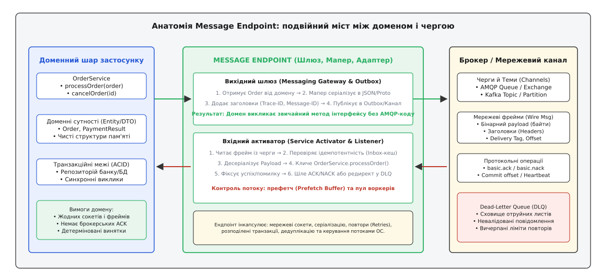
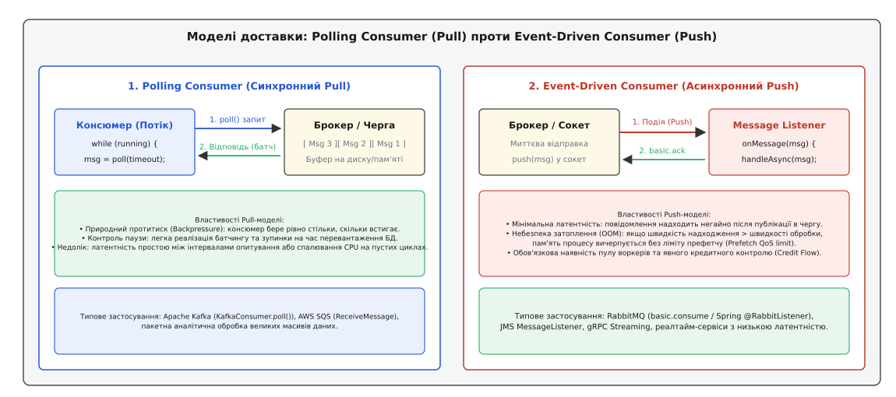
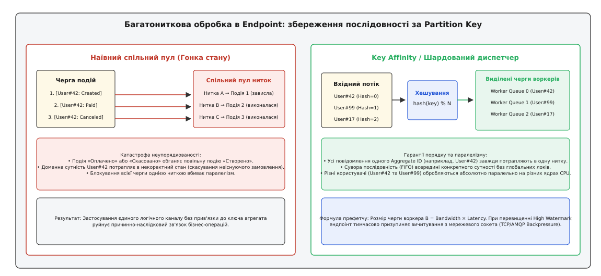
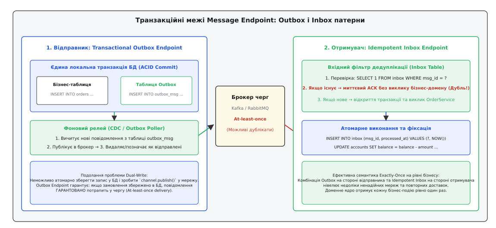

# Кінцева точка повідомлень: як з'єднати прикладний домен із чергою без спагеті залежностей

<preknowlist>
- [Порти й адаптери](root:sf-apps/hexagonal-architecture) — ізоляція ядра доменної логіки від зовнішніх протоколів та інфраструктури.
- [Черга повідомлень (point-to-point)](root:sf-distributed/message-queue) — асинхронна доставка повідомлень між незалежними компонентами через проміжний буфер.
- [Pub/sub (тема)](root:sf-distributed/publish-subscribe) — розсилка подій багатьом підписникам без прямого зв'язку відправника з отримувачами.
- [Ідемпотентність](root:sf-distributed/idempotency) — властивість операції давати однаковий результат при багаторазовому повторенні.
- [Transactional outbox](root:sf-distributed/outbox-pattern) — атомарне збереження стану в базі даних та публікація повідомлення через проміжну таблицю.
- [Мертва черга](root:sf-distributed/dead-letter-queue) — ізоляція та збереження пошкоджених або невалідованих повідомлень для діагностики.
- [Конкурентні споживачі](root:sf-distributed/competing-consumers) — паралельна обробка повідомлень із єдиного каналу кількома екземплярами обробників.
</preknowlist>

Розробник платіжного мікросервісу пише метод підтвердження банківської транзакції. Всередині бізнес-методу `processPayment(orderId, amount)` програма списує кошти з балансу клієнта в локальній базі даних PostgreSQL, а потім відкриває TCP-сокет до брокера черг RabbitMQ, вручну створює AMQP-канал, серіалізує об'єкт квитанції у JSON-рядок, загортає байти у транспортний фрейм і викликає метод публікації `basicPublish()`. У сусідньому класі той самий сервіс вичитує події поповнення рахунку: у нескінченному циклі опитування нитка блокується на виклику `basicGet()`, вручну розбирає заголовки, викликає бізнес-метод нарахування бонусів і викликає `basicAck()` для підтвердження.

Через два тижні в такій системі стається перший збій: мерехтіння мережі обриває TCP-з'єднання під час виклику `basicPublish()`. Локальна транзакція в базі даних успішно зафіксована (гроші списано), але повідомлення про оплату не надійшло до складської системи. Клієнт бачить списання коштів, проте замовлення зависає в статусі «Очікує оплати».

Ще через місяць черга надсилає пошкоджений JSON-документ із відсутнім полем `amount`. Метод розбору кидає виняток `NullPointerException`, потік-слухач аварійно завершується, повідомлення повертається в початок черги (requeue) і через мікросекунду знову викликає падіння нового потоку. За секунду процес робить 50 000 марних спроб розбору, забиває 100% ядер процесора й переповнює дисковий простір гігабайтами логів помилок.

Коли бізнес вирішує замінити RabbitMQ на Apache Kafka для збільшення пропускної здатності, з'ясовується, що низькорівневий код підключення до брокера, розбору байтів, повторних спроб та підтвердження доставки розкиданий по чотирьох десятках доменних класів.

Щоб прибрати залежність бізнес-правил від інфраструктури черг, застосовують архітектурний патерн **Кінцева точка повідомлень** (англ. *Message Endpoint* — кінцева точка повідомлень; лат. *finis* — межа, кінець).


*Message Endpoint виступає ізолювальним швом між чистим прикладним кодом і транспортною мережею брокера. Домен оперує звичайними об'єктами та методами, тоді як ендпоінт бере на себе керування з'єднаннями, серіалізацію, транзакції, контроль потоку та обробку аварійних ситуацій.*

## Чотири розриви між доменом та асинхронною чергою

Проблема прямого підключення доменної логіки до брокера повідомлень полягає не лише у складності заміни бібліотеки. Між світом прикладних об'єктів і світом мережевого обміну повідомленнями існує фундаментальна невідповідність концепцій, яку називають імпедансним розривом (англ. *impedance mismatch*). Він проявляється на чотирьох рівнях:

```
┌─────────────────────────────────────────────────────────────────────────────┐
│             ЧОТИРИ ІМПЕДАНСНІ РОЗРИВИ ІНТЕГРАЦІЇ З ЧЕРГОЮ                   │
├─────────────────────────────────────────────────────────────────────────────┤
│ 1. Розрив типів і подання (Objects vs Bytes)                                │
│    • Домен: типізовані структури в пам'яті, агрегати, інваріанти.           │
│    • Брокер: нетипізований двійковий масив байтів, заголовки, мітки зміщення.│
├─────────────────────────────────────────────────────────────────────────────┤
│ 2. Розрив моделі керування (Method Calls vs Asynchronous Buffers)           │
│    • Домен: послідовні синхронні виклики функцій із прямим результатом.     │
│    • Брокер: асинхронні канали, темпоральне розчеплення, черги очікування.  │
├─────────────────────────────────────────────────────────────────────────────┤
│ 3. Розрив транзакційних меж (ACID DB vs Dual-Write)                         │
│    • Домен: локальні транзакції бази даних (Commit/Rollback).               │
│    • Брокер: мережеві операції без спільних атомарних транзакцій.           │
├─────────────────────────────────────────────────────────────────────────────┤
│ 4. Розрив обробки помилок (Exceptions vs Poison Messages)                   │
│    • Домен: стек викликів, локальні перехоплення (try/catch).               │
│    • Брокер: повторна доставка (redelivery), отруйні повідомлення, DLQ.     │
└─────────────────────────────────────────────────────────────────────────────┘
```

Розглянемо механіку кожного розриву:

1. **Типи проти байтів.** Доменний шар мислить об'єктами з багатим станом та методами захисту інваріантів (`Order`, `Money`, `CustomerProfile`). Брокер повідомлень знає лише про потік двійкових байтів (`byte[]`) та таблицю рядкових метаданих (headers). Якщо змусити доменний шар самостійно серіалізувати об'єкти в JSON чи Protobuf, домен стає заручником конкретної схеми та версії формату даних.
2. **Прямі виклики проти асинхронних буферів.** У межах одного процесу виклик методу `service.execute()` передає керування негайно, повертаючи результат або кидаючи виняток у поточному стеку викликів. У системі повідомлень відправник кладе повідомлення в канал і не отримує миттєвої відповіді: отримувач може бути вимкненим або перевантаженим. Доменний клієнт не повинен вручну будувати цикли опитування чи кореляційні таблиці очікування.
3. **Локальні транзакції проти ненадійної мережі.** Бізнес-операція часто вимагає зберегти зміну в реляційній базі даних і сповістити інші сервіси через чергу. Прямий виклик `db.commit()` з наступним `broker.send()` створює класичну проблему подвійного запису (англ. *dual-write problem*): якщо мережа або брокер відмовлять між цими двома рядками, система втратить консистентність.
4. **Локальні винятки проти отруйних пакетів.** Якщо всередині доменного сервісу виникає помилка валідації, домен повертає виняток. Але якщо ця помилка виникла під час читання повідомлення з черги, простий відкат операції призводить до повторного надходження того самого зіпсованого повідомлення. Виникає нескінченний цикл аварій (англ. *poison pill loop*), який повністю блокує споживання корисних даних.

Кінцева точка повідомлень є архітектурним компонентом, який бере на себе подолання всіх чотирьох розривів, забезпечуючи двосторонню адаптацію між чистим прикладним доменом та брокером.

Історичний шлях розвитку цих концепцій від важких брокерів об'єктів 1990-х років до сучасних стандартів інтеграції викладено в нарисі про [народженням патернів інтеграції та еволюцією Message Endpoint](root:sf-distributed/message-endpoint/hist-enterprise-integration-patterns.md).

## Анатомія патерну: внутрішня будова Message Endpoint

Згідно з канонічною класифікацією патернів корпоративної інтеграції (Enterprise Integration Patterns, EIP), Message Endpoint не є монолітним класом. Це композиція чотирьох спеціалізованих функціональних ролей:

```
┌─────────────────────────────────────────────────────────────────────────────┐
│                    СКЛАДОВІ РОЛІ MESSAGE ENDPOINT                           │
├─────────────────────────────────────────────────────────────────────────────┤
│ 1. Канальний адаптер (Channel Adapter)                                      │
│    • Підключається безпосередньо до черги, сокета або топіка брокера.       │
│    • Відповідає за сокети, аутентифікацію, TLS, фреймування протоколу.      │
├─────────────────────────────────────────────────────────────────────────────┤
│ 2. Шлюз повідомлень (Messaging Gateway)                                     │
│    • Надає домену чистий об'єктний інтерфейс (порт виклику).                │
│    • Ховає весь факт існування черг за звичайними методами відправки.       │
├─────────────────────────────────────────────────────────────────────────────┤
│ 3. Мапер повідомлень (Messaging Mapper)                                     │
│    • Здійснює двостороннє перетворення: Domain Object ⇄ Message Envelope.   │
│    • Заповнює заголовки трасування (Traceparent), ID повідомлення, схему.   │
├─────────────────────────────────────────────────────────────────────────────┤
│ 4. Активатор сервісу (Service Activator / Inbound Listener)                 │
│    • Приймає розпаковане вхідне повідомлення від адаптера.                  │
│    • Викликає цільовий метод доменного сервісу та обробляє результат.       │
└─────────────────────────────────────────────────────────────────────────────┘
```

### 1. Канальний адаптер (Channel Adapter)

Канальний адаптер є найнижчим рівнем ендпоінта, що контактує з інфраструктурою передачі даних. Його обов'язок — керувати життєвим циклом фізичного з'єднання:
- Підтримувати пул TCP-з'єднань, керувати процедурою рукостискання TLS та повторно підключатися при розривах ліній (Auto-reconnect).
- Керувати віртуальними каналами (AMQP Channels, Kafka Consumer Sessions) та періодично відправляти сигнали живості (heartbeats).
- Приймати або передавати сирі бінарні пакети відповідно до специфікації мережевого протоколу.

Доменний шар ніколи не імпортує типи канального адаптера.

### 2. Шлюз повідомлень (Messaging Gateway)

Шлюз повідомлень — це фасад, орієнтований на відправника. Для решти програми він виглядає як звичайний доменний сервіс або інтерфейс порту:

```
// Доменний порт відправника
interface OrderNotificationPort {
    void notifyOrderCreated(Order order);
    PaymentConfirmation requestPayment(PaymentRequest request);
}
```

Коли доменний код викликає `notifyOrderCreated(order)`, шлюз непомітно для викликача виконує послідовність дій:
1. Звертається до Мапера для перетворення об'єкта `Order` на мережевий конверт (Message Envelope).
2. Генерує унікальний ідентифікатор `Message-Id` (UUIDv7) та мітку часу.
3. Витягує контекст розподіленого трасування (W3C `traceparent`) з поточного контексту виконання й додає його в заголовки.
4. Передає підготовлене повідомлення канальному адаптеру для відправки в чергу.

Якщо використовується синхронний запит-відповідь (Request-Reply), шлюз створює тимчасову чергу відповідей, вказує її адресу в заголовку `Reply-To`, генерує унікальний `Correlation-Id`, блокує викликальний потік на об'єкті синхронізації (`std::future` або `Promise`) і повертає результат після отримання відповіді.

### 3. Мапер повідомлень (Messaging Mapper)

Мапер гарантує незалежність внутрішньої моделі домену від публічного формату контракту. Він розділяє вхідні дані на дві частини:
- **Корисне навантаження (Payload):** серіалізоване бізнес-тіло документа (JSON, Protobuf, Avro).
- **Службові метадані (Headers):** системні атрибути, які потрібні маршрутизаторам, брокерам та кінцевим точкам для коректної обробки.

Мапер перевіряє сумісність версій схем даних, нормалізує числові типи та перетворює системні винятки десеріалізації на структуровані повідомлення про помилки.

Повні сигнатури інтерфейсів усіх цих компонентів та структуру службових заголовків зібрано в [довідником інтерфейсів і контрактів кінцевої точки](root:sf-distributed/message-endpoint/api-endpoint-contracts.md).

### 4. Активатор сервісу (Service Activator)

Активатор сервісу — це вхідний адаптер, що перетворює отримане з каналу повідомлення на виклик бізнес-методу існуючого доменного класу. 

Він слухає вхідний канал, витягує сирі дані, передає їх Маперу для відновлення доменного об'єкта, знаходить відповідний доменний сервіс (наприклад, `OrderFulfillmentService`), передає йому розпаковані параметри, а результат роботи (якщо метод щось повертає) відправляє назад у вихідний канал відповідей.

## Моделі отримання повідомлень: Polling Consumer проти Event-Driven Consumer

На стороні споживання повідомлень кінцева точка може працювати за однією з двох фундаментальних моделей: опитування (Pull) або керована подіями доставка (Push).


*Синхронний Polling Consumer контролює швидкість забору даних, але створює затримку очікування. Асинхронний Event-Driven Consumer забезпечує мінімальний час відгуку, проте вимагає суворого обмеження префетчу для захисту від переповнення пам'яті.*

### Polling Consumer (Синхронний Pull)

У моделі опитування кінцева точка самостійно звертається до брокера або черги за новою порцією даних тоді, коли вона готова їх обробити.

Механіка роботи опитувального циклу:
1. Потік консюмера викликає метод `poll(timeout)` або `receive()`.
2. Якщо в черзі є дані, брокер повертає одне повідомлення або пакет (batch).
3. Потік послідовно виконує бізнес-логіку над кожним елементом.
4. Після успішного завершення операцій потік фіксує зміщення (commit offset) або відправляє підтвердження `ack()`.
5. Цикл повторюється.

**Переваги:**
- **Природний протитиск (Natural Backpressure):** процес ніколи не отримає більше повідомлень, ніж здатний переварити. Якщо база даних сповільнюється, споживач автоматично зменшує частоту викликів `poll()`, не переповнюючи оперативну пам'ять.
- **Простота батчингу:** консюмер може за один запит отримати 500 повідомлень і зберегти їх в базу даних єдиною масовою вставкою `INSERT INTO ... VALUES (...)`, що на порядок ефективніше за поштучну обробку.

**Недоліки:**
- **Латентність простою:** якщо інтервал опитування становить 500 мс, нове повідомлення може чекати в черзі до пів секунди.
- **Спалювання ресурсів:** агресивне опитування з нульовим таймаутом у порожній черзі завантажує процесор холостими циклами перевірки.

### Event-Driven Consumer (Асинхронний Push / Message Listener)

У моделі, керованій подіями, клієнт реєструє в брокері функцію зворотного виклику (callback) або об'єкт `MessageListener`. Брокер самостійно шле мережеві пакети в сокет клієнта в момент їхньої появи.

Механіка роботи слухача:
1. Мережевий потік бібліотеки вичитує сокет і при надходженні фрейму викликає `onMessage(message)`.
2. Повідомлення передається у внутрішній пул робочих потоків (Worker Pool).
3. Після виконання обробки потік шле підтвердження `basic.ack`.

**Переваги:**
- **Мінімальна латентність:** повідомлення починає оброблятися через мікросекунди після надходження в чергу.
- **Економія процесора:** за відсутності повідомлень потік перебуває в стані сну на дескрипторі сокета (через `epoll`/`kqueue`/`IOCP`).

**Недоліки та загроза Out-Of-Memory:**
Якщо в чергу раптово надійде сплеск із 100 000 замовлень, брокер спробує негайно виштовхнути їх усі у відкритий сокет клієнта. Якщо обробка одного замовлення займає 50 мс, неконтрольований приплив переповнить чергу пам'яті застосунку, спричинить гігантські паузи збирача сміття і завершиться аварійним падінням процесу через нестачу пам'яті (OOM Crash).

### Ліміт префетчу (Prefetch QoS) та кредитний контроль

Щоб безпечно використовувати модель Push, кінцева точка зобов'язана встановити ліміт префетчу (англ. *Prefetch Count* або *Quality of Service, QoS*).

Ліміт префетчу вказує брокеру максимальну кількість непідтверджених повідомлень (unacknowledged messages), які дозволено одночасно надіслати клієнту:

```
[Брокер] ──( 1. Надіслати 10 повідомлень )──> [Prefetch Buffer (10)]
[Брокер] ──( 2. Зупинка: буфер заповнений )
   │
   ▲
   └───( 3. Клієнт обробив 1 шт. і надіслав ACK )─── [Worker Pool]
   │
[Брокер] ──( 4. Дозволено надіслати ще 1 повідомлення )──> [Буфер]
```

Оптимальний розмір вікна префетчу `B` розраховується через закон Літтла та добуток пропускної здатності на затримку (Bandwidth-Delay Product, BDP):

```
B = T_proc · R
```

де:
- `T_proc` — середній час обробки одного повідомлення воркером (у секундах);
- `R` — бажана пропускна здатність споживача (повідомлень на секунду).

Для пулу з `N` паралельних потоків розмір префетчу зазвичай обирають у діапазоні від `N` до `2 · N`. Значення `Prefetch = 1` забезпечує ідеальний розподіл навантаження між конкурентними споживачами, але знижує пропускну здатність через затримку мережевого підтвердження (RTT) між кожним повідомленням.

## Селективний споживач: фільтрація на межі

Коли в одну тему або чергу надходять події різних типів, кінцева точка може використовувати патерн **Селективний споживач** (англ. *Selective Consumer* або *Message Selector*).

Замість десеріалізації кожного об'єкта та його відсікання в середині доменного сервісу селектор перевіряє заголовки на рівні канального адаптера:
- **У брокерах із підтримкою селекторів (JMS/AMQP):** вираз фільтрації (наприклад, `region = 'EU' AND priority >= 3`) передається брокеру під час підписки. Брокер самостійно відсікає нерелевантні пакети на сервері, економлячи мережевий трафік клієнта.
- **У брокерах без підтримки селекторів (Kafka):** канальний адаптер розбирає лише таблицю заголовків `MessageHeaders`. Якщо атрибути не відповідають критеріям селектора, адаптер негайно фіксує зміщення без передачі задачі в пул воркерів і без виділення пам'яті під бізнес-об'єкт.

## Багатонитковість і збереження порядку: небезпека гонки стану

Утилізація сучасних багатоядерних процесорів вимагає паралельної обробки повідомлень багатьма потоками. Однак наївний розподіл повідомлень із загальної черги по вільному пулу потоків руйнує причинно-наслідковий порядок операцій.


*Наївний спільний пул спричиняє обгін подій одного клієнта швидшими потоками. Диспетчеризація з прив'язкою до ключа агрегата (Partition Affinity) гарантує строгий порядок FIFO для кожної сутності при збереженні високої паралельності.*

### Анатомія гонки стану за відсутності секціонування

Уявімо послідовність із трьох подій для банківського рахунку `Account#42`:
1. `Msg 1`: Створення рахунку (Balance = 0 грн).
2. `Msg 2`: Поповнення балансу (+10 000 грн).
3. `Msg 3`: Списання за покупку (-3 000 грн).

Якщо кінцева точка вичитує всі три повідомлення і скидає їх у спільний пул потоків:
- Потік A бере `Msg 1`, але через паузу ОС або блокування виділення пам'яті зависає на 100 мс.
- Потік B бере `Msg 2` і миттєво виконує поповнення, але репозиторій повертає помилку `AccountNotFoundException`, оскільки `Msg 1` ще не зафіксовано в базі.
- Потік C бере `Msg 3`, виконує перевірку балансу і відхиляє транзакцію через нульовий залишок.
- Потік A нарешті прокидається і створює рахунок.

У результаті бізнес-стан рахунку непоправно спотворений, хоча черга доставила всі повідомлення в ідеальному вихідному порядку.

### Диспетчеризація з прив'язкою до ключа (Partition / Key Affinity)

Для одночасного забезпечення високої паралельності та суворого збереження послідовності подій кінцева точка застосовує диспетчеризацію за ключем партиції (Key Affinity).

Алгоритм диспетчеризації:
1. Кінцева точка виділяє фіксований масив із `M` черг і закріплює за кожною чергою рівно один робочий потік (Worker Thread).
2. При отриманні повідомлення диспетчер витягує з заголовків бізнес-ключ агрегата (наприклад, `account_id` або `user_id`).
3. Номер цільової черги `idx` обчислюється через детерміновану хеш-функцію:

```
idx = hash(partition_key) % M
```

4. Повідомлення поміщається виключно в чергу з номером `idx`.

Оскільки всі повідомлення сутності `Account#42` дають однаковий хеш, вони гарантовано шикуються в одну послідовну чергу FIFO і обробляються одним потоком строго по черзі. Повідомлення іншого клієнта `Account#99` потрапляють в іншу чергу та обробляються паралельно на іншому ядрі без жодних блокувань і конфліктів.

## Межі надійності: стратегії підтвердження та захист від подвійного запису

Кінцева точка відповідає за узгодження статусів обробки між брокером та постійним сховищем даних застосунку.


*Комбінація Transactional Outbox на боці відправника та Idempotent Inbox на боці отримувача усуває проблему подвійного запису та забезпечує семантику Effectively-Once на рівні бізнес-логіки.*

### Режими підтвердження (Auto-ACK проти Manual-ACK)

Брокери повідомлень підтримують два базових режими підтвердження доставки:
1. **Автоматичне підтвердження (Auto-ACK / Fire-and-Forget):** брокер вважає повідомлення успішно обробленим у той самий момент, коли відправив байти в мережевий сокет. Якщо процес клієнта впаде через аварію живлення через мікросекунду після отримання, повідомлення буде безповоротно втрачено. Цей режим припустимий лише для некритичної телеметрії.
2. **Ручне підтвердження (Explicit Manual ACK):** повідомлення залишається заблокованим у брокері доти, доки клієнт явно не відправить підтвердження `basic.ack(delivery_tag)`. Якщо клієнт розірве з'єднання без підтвердження, брокер негайно поверне повідомлення іншим споживачам.

Правило надійної кінцевої точки: **ACK відправляється лише після повної фіксації змін у бізнес-сховищі (Database Commit).**

### Подолання проблеми Dual-Write: Transactional Outbox та Idempotent Inbox

Ручне підтвердження вирішує проблему втрати даних, але створює проблему дублювання (At-least-once delivery): якщо база даних успішно зафіксувала транзакцію, але процес впав до відправки `ack()` у мережу, брокер після перезапуску надішле те саме повідомлення повторно.

Для досягнення семантики фактично одноразової обробки (Effectively-Once) кінцеві точки реалізують два симетричні патерни:

#### 1. Transactional Outbox (На стороні вихідного шлюзу)

Замість прямої відправки в мережу шлюз зберігає вихідне повідомлення в спеціальну службову таблицю `outbox` у тій самій локальній транзакції бази даних, що й бізнес-сутність:

```sql
BEGIN TRANSACTION;
  UPDATE accounts SET balance = balance - 1000 WHERE id = 42;
  INSERT INTO outbox_messages (id, topic, payload, created_at)
  VALUES ('msg-uuid-7', 'orders.paid', '{"accountId":42, "amount":1000}', NOW());
COMMIT;
```

Окремий фоновий процес кінцевої точки (Relay / Poller) або конектор захоплення змін даних (Change Data Capture, CDC) асинхронно вичитує записи з таблиці `outbox_messages`, публікує їх у брокер і після успішного підтвердження від брокера видаляє або маркує як відправлені.

#### 2. Idempotent Inbox (На стороні вхідного активатора)

Вхідна кінцева точка перехоплює кожне повідомлення до виклику бізнес-сервісу й перевіряє його `Message-Id` у локальній таблиці `inbox`:

```sql
BEGIN TRANSACTION;
  -- Спроба зафіксувати отримання повідомлення з унікальним первинним ключем
  INSERT INTO inbox_messages (message_id, processed_at) VALUES ('msg-uuid-7', NOW());
  
  -- Якщо вставка вдалася — виконуємо доменну логіку
  UPDATE orders SET status = 'PAID' WHERE id = 101;
COMMIT;
```

Якщо внаслідок повторної доставки надходить дублікат `msg-uuid-7`, операція `INSERT` кидає помилку порушення унікального обмеження (Unique Constraint Violation). Кінцева точка перехоплює цей конфлікт, пропускає виконання бізнес-логіки та негайно відправляє в чергу `basic.ack()`, підтверджуючи видалення дубліката.

## Обробка великих документів: патерн Claim Check на кінцевій точці

Коли розмір корисного навантаження перевищує максимальний ліміт брокера (наприклад, 1 МБ у Kafka або 256 КБ у RabbitMQ), пряма публікація документа в чергу завершується аварією `PayloadTooLargeException`.

Кінцева точка автоматизує роботу патерну **Claim Check** (Квитанція у камері схову):
1. **Вихідний шлюз:** якщо розмір серіалізованого об'єкта перевищує поріг (наприклад, 256 КБ), шлюз асинхронно завантажує байти в об'єктне сховище (Amazon S3 / MinIO). Шлюз замінює велике тіло повідомлення на короткий покажчик (URI збереженого файлу) у заголовку `x-claim-check-uri`, а саме повідомлення розміром у 300 байтів відправляє в чергу брокера.
2. **Вхідний активатор:** при отриманні повідомлення активатор перевіряє наявність заголовка `x-claim-check-uri`. Якщо заголовок присутній, адаптер прозоро завантажує повне бінарне тіло з об'єктного сховища, відновлює доменний об'єкт і передає його бізнес-методу. Доменний шар працює з повноцінною сутністю, не знаючи про факт використання зовнішнього S3-сховища.

## Поширення контексту розподіленого трасування (Context Propagation)

В асинхронних архітектурах HTTP-запит клієнта породжує подію, яка проходить крізь десятки мікросервісів і черг. Якщо кінцева точка не подбає про зв'язок метаданих, ланцюжок розподіленого трасування (Distributed Trace) буде розірвано.

Кінцева точка реалізує стандартизоване поширення контексту OpenTelemetry / W3C Trace Context:
- **При відправці:** вихідний шлюз витягує активний спан із локального контексту нитки та інжектує його у службовий заголовок `traceparent` (наприклад, `00-4bf92f3577b34da6a3ce929d0e0e4736-00f067aa0ba902b7-01`).
- **При отриманні:** вхідний активатор витягує заголовок `traceparent` з конверта, створює новий дочірній спан (Consumer Span) і прив'язує його до батьківського сліду. Завдяки цьому інженери в системі моніторингу (Jaeger / Zipkin) бачать наскрізний таймлайн: від первинного кліку користувача у браузері через чергу RabbitMQ до фінального запису в базу даних складського сервісу.

## Небезпека перебалансування партицій (Consumer Rebalance Hazards)

У системах із динамічними групами споживачів (Apache Kafka Consumer Groups) додавання нового вузла або короткочасне мерехтіння мережі ініціює процедуру перебалансування (Rebalance). Під час перебалансування брокер забирає партицію в одного вузла і призначає її іншому.

Якщо кінцева точка має внутрішній пул воркерів, виникає небезпека «зомбі-виконання» (Zombie Processing):
1. Воркери Вузла A прямо зараз виконують довгі транзакції для 50 повідомлень із партиції 3.
2. Координатор групи вирішує, що Вузол A повільний, і передає партицію 3 Вузлу B.
3. Вузол B починає читати ті самі повідомлення, поки Вузол A ще не завершив їхню обробку.

Для запобігання дублюванню транзакцій канальний адаптер реєструє зворотний виклик перебалансування (Rebalance Listener):
- При отриманні сигналу `onPartitionsRevoked` адаптер негайно блокує взяття нових завдань із сокета.
- Адаптер чекає дренування активних черг воркерів протягом короткого таймауту (наприклад, 3 секунди).
- Адаптер фіксує фінальні зміщення (Commit Offset) і лише після цього підтверджує відкликання партиції. Якщо воркери не встигли завершити роботу, незавершені задачі скасовуються без фіксації зміщень, а сховище ідемпотентності на новому вузлі відсікає можливі дублікати.

## Стійкість на межі: ретраї, експоненційне відтермінування та запобіжник

Кінцева точка є першим рубежем оборони застосунку від збоїв зовнішніх систем та внутрішніх компонентів.

### Класифікація помилок: тимчасові проти постійних

Усі збої під час обробки повідомлення поділяються на два неперетинні класи:

```
┌─────────────────────────────────────────────────────────────────────────────┐
│                    КЛАСИФІКАЦІЯ ПОМИЛОК ОБРОБКИ                             │
├─────────────────────────────────────────────────────────────────────────────┤
│ 1. Тимчасові помилки (Transient Failures)                                   │
│    • Причини: таймаут блокування БД, короткочасний розрив мережі, 503 HTTP. │
│    • Стратегія: Повторні спроби з експоненційним відтермінуванням і джитером.│
├─────────────────────────────────────────────────────────────────────────────┤
│ 2. Постійні / Отруйні помилки (Poison / Permanent Failures)                │
│    • Причини: синтаксична помилка JSON, порушення схеми, ділення на нуль.   │
│    • Стратегія: Негайне вилучення, збагачення заголовками помилки та DLQ.    │
└─────────────────────────────────────────────────────────────────────────────┘
```

Для тимчасових помилок кінцева точка обчислює інтервал затримки наступного повтору `t_retry` за формулою експоненційного відтермінування з повним джитером (Exponential Backoff with Full Jitter):

```
t_retry = random(0, min(T_max, T_base · 2ⁿ))
```

де:
- `T_base` — початкова затримка (наприклад, 100 мс);
- `n` — номер поточної спроби;
- `T_max` — максимальна стеля затримки (наприклад, 30 000 мс);
- `random(0, ...)` — випадковий розподіл для запобігання синхронному напливу повторів (Thundering Herd).

### Внутрішній запобіжник кінцевої точки (Endpoint Circuit Breaker)

Якщо база даних виходить із ладу, 100% вхідних повідомлень починають завершуватися помилками. Якщо кінцева точка продовжить вичитувати чергу, вона витратить усі доступні повтори для тисяч повідомлень і відправить їх у мертву чергу (DLQ), хоча самі повідомлення були абсолютно коректними.

Для запобігання катастрофі кінцева точка інтегрує механізм запобіжника (Circuit Breaker):
- Якщо частка невдалих спроб за останні 10 секунд перевищує 50%, кінцева точка переходить у стан `OPEN`.
- У стані `OPEN` кінцева точка викликає метод `channel.pause()` або зупиняє опитування черги. Жодне повідомлення більше не вичитується із сокета.
- Через визначений період очікування (наприклад, 30 с) ендпоінт переходить у стан `HALF-OPEN` і бере на пробу рівно одне повідомлення.
- Якщо пробне повідомлення успішно збережено в базі даних, робота каналу автоматично відновлюється (`CLOSED`).

Робочу реалізацію кінцевої точки з внутрішнім пулом потоків, дедуплікацією та транзакційними межами мовами C++ та TypeScript наведено в [повною реалізацією асинхронного Message Endpoint](root:sf-distributed/message-endpoint/proj-message-endpoint.md).

## Безпечне завершення роботи (Graceful Shutdown)

Аварійна зупинка процесу (наприклад, при розгортанні нової версії в Kubernetes через сигнал `SIGTERM`) не повинна призводити до втрати або подвійної обробки транзакцій.

Протокол безпечного завершення роботи Message Endpoint:

```
[Сигнал SIGTERM]
       │
       ▼
1. Зупинка прийому:
   • Скасування підписки в брокері (basic.cancel / consumer.pause)
   • Брокер перестає надсилати нові фрейми
       │
       ▼
2. Дренування буферів (Drain):
   • Очікування завершення повідомлень, які вже виконуються воркерами
   • Встановлення жорсткого таймауту очікування (наприклад, 25 секунд)
       │
       ▼
3. Фіксація стану:
   • Відправка останніх накопичених ACK/NACK у мережевий канал
   • Завершення фонового релею Outbox
       │
       ▼
4. Закриття каналів та сокетів:
   • Закриття віртуальних сесій
   • Коректне закриття TCP-з'єднань із брокером
       │
       ▼
[Вихід із процесу з кодом 0]
```

Дотримання цієї послідовності гарантує, що жодне повідомлення не зависне в проміжному стані без підтвердження і не спричинить каскадних помилок під час планового перезапуску кластера.

> 🔧 **Навіщо це.**
>
> Пряме використання SDK брокерів (RabbitMQ/Kafka) всередині бізнес-коду перетворює мікросервіс на моноліт, прибитий до конкретного транспорту. Будь-яка спроба додати розподілене трасування (OpenTelemetry), дедуплікацію повідомлень, захист від отруйних пакетів або обмеження швидкості вимагає переписування сотень місць у системі.
>
> Message Endpoint створює стабільний архітектурний шов: бізнес-домен працює з чистими інтерфейсами портів і нічого не знає про сокети, ACK та двійкові байти. Вся інженерна складність — гарантії At-least-once, подолання подвійного запису через Outbox/Inbox, шардування потоків за ключем агрегата та плавне скидання навантаження — інкапсулюється в єдиному місці на межі застосунку.
