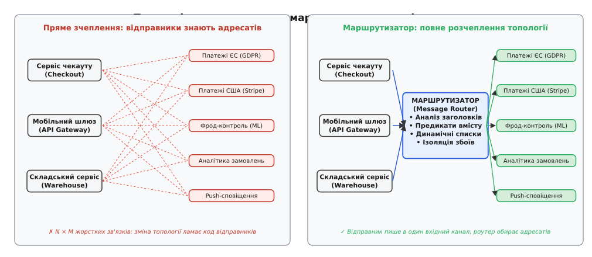
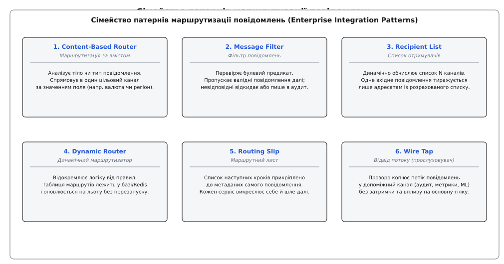
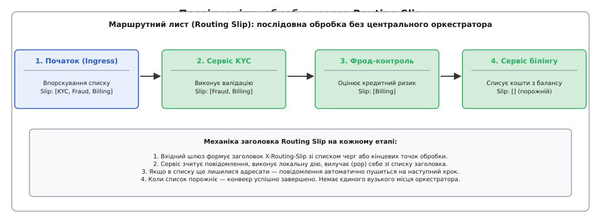
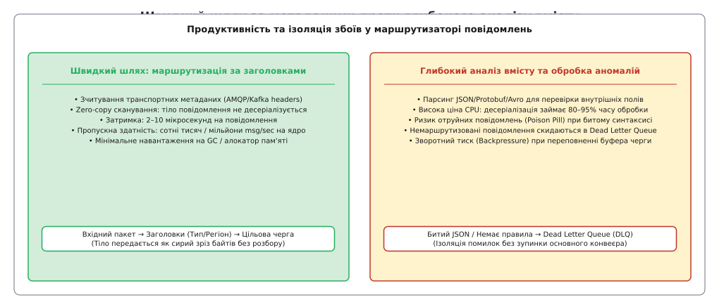

# Маршрутизатор повідомлень: розв'язання шляхів у розподілених потоках

<preknowlist>
- [Черга повідомлень](root:sf-distributed/message-queue) — передача повідомлень «точка-точка» між одним відправником та одним отримувачем через буфер.
- [Pub/sub (тема)](root:sf-distributed/publish-subscribe) — розсилання подій багатьом невідомим підписникам без прямого зв'язку між компонентами.
- [Гарантії доставки](root:sf-distributed/delivery-guarantees) — семантика at-least-once, at-most-once та exactly-once у ненадійній мережі.
- [Мертва черга](root:sf-distributed/dead-letter-queue) — ізоляція повідомлень, які неможливо обробити чи доставити адресату.
</preknowlist>

Міжнародна платформа електронної комерції приймає 120 000 транзакційних подій щосекунди: підтвердження замовлень, списання коштів із банківських карток, оновлення складських залишків, геолокаційні мітки кур'єрів та сигнали зміни статусу доставки. Сервіс чекауту створює подію про оплату замовлення і має доставити її зацікавленим підсистемам. Проте кожен кінцевий споживач висуває власні, часто несумісні вимоги до одержуваного трафіку:

1. Європейські замовлення згідно з регламентом GDPR мають оброблятися виключно серверами у франкфуртському дата-центрі, тоді як американські платежі мають прямувати до шлюзу Stripe у північноамериканському регіоні.
2. Транзакції на суму понад 10 000 доларів або замовлення з підозрілих IP-адрес вимагають негайної перевірки кластером машинного навчання антифроду в реальному часі, тоді як дрібні побутові покупки не повинні навантажувати цю дорогу підсистему.
3. Логістичний сервіс потребує лише замовлень із фізичними товарами, тоді як покупки цифрових аудіокниг чи підписок мають оминати складський конвеєр і негайно активувати генерацію ліцензійних ключів.
4. Аналітичний відділ хоче прослуховувати 100% потоку даних у фоновому режимі, не впливаючи на затримку основних фінансових транзакцій.

Якщо відправник самостійно намагається з'ясувати адреси всіх отримувачів і відправляти повідомлення в конкретні черги кожного сервісу, система зазнає архітектурного колапсу зв'язності (англ. *tight coupling*). Будь-яка зміна в інфраструктурі одержувачів — додавання нової аналітичної черги, поділ європейського кластера на два підрегіони чи оновлення формату фрод-контролю — змушує інженерів змінювати код, тестувати та повторно розгортати критичний сервіс чекауту.

Якщо ж піти іншим шляхом і змусити сервіс чекауту транслювати всі події в єдину загальну тему [публікації-підписки](root:sf-distributed/publish-subscribe), де кожен підписник самостійно фільтрує непотрібні йому 95% повідомлень, мережа дата-центру та процесорні ресурси витрачаються марно. Кожен дрібний мікросервіс змушений вичитувати гігабайти чужого трафіку, десеріалізувати важкі структури даних і викидати їх у смітник, створюючи колосальний оверхед на збирач сміття та навантажуючи шину вводу-виводу.


*Зліва: пряме зчеплення породжує заплутану мережу N × M залежностей, де зміна топології отримувача вимагає модифікації коду відправників. Справа: маршрутизатор ізолює відправника в єдиному вхідному каналі та самостійно керує потоками.*

## Розчеплення відправника та адресата

Щоб усунути пряму залежність між джерелом даних і кінцевими одержувачами, між вхідним каналом та мережею споживачів розміщують спеціалізований посередник — **маршрутизатор повідомлень** (англ. *Message Router*, від латинського *rupta [via]* — пробитий шлях, розчищена дорога, та старофранцузького *routier*).

Маршрутизатор споживає повідомлення з одного або кількох вхідних каналів, аналізує їхні критерії (службові заголовки, контекст сесії або внутрішній вміст корисного навантаження) і спрямовує кожне повідомлення у відповідні вихідні канали без модифікації його сутнісного бізнес-змісту.

Ключова архітектурна властивість маршрутизатора — **асиметрія знань про топологію**:
* **Відправник нічого не знає про споживачів:** він публікує повідомлення в єдину абстрактну точку входу (наприклад, чергу `orders.raw`), знаючи лише схему власних даних.
* **Отримувачі нічого не знають про відправника:** вони слухають власні спеціалізовані черги (наприклад, `orders.eu.settlement` або `fraud.high_risk`), отримуючи лише релевантний, попередньо відфільтрований трафік.
* **Маршрутизатор володіє картою доріг:** лише цей компонент знає правила відображення критеріїв повідомлень на фізичні адреси черг або топіків.

Історично ця концепція виросла з подолання хаосу перших корпоративних інтеграцій та епохи важких сервісних шин ([як розвивалася концепція від спагеті-інтеграції та ESB до каталогу патернів Хопа](root:sf-distributed/message-router/hist-eip-origins.md)).


*Шість фундаментальних шаблонів маршрутизації корпоративної інтеграції: від простого вибору одного каналу до динамічних супровідних листів та неінвазивного відводу потоку.*

## Анатомія патернів маршрутизації

Каталог шаблонів корпоративної інтеграції (Enterprise Integration Patterns, EIP) виділяє кілька спеціалізованих різновидів маршрутизації залежно від характеру правил, кількості вихідних цілей та способу управління маршрутом.

### 1. Маршрутизатор за вмістом (Content-Based Router)

**Маршрутизатор за вмістом** (англ. *Content-Based Router*, CBR) приймає рішення про вибір єдиного цільового каналу на основі глибокого або поверхневого аналізу даних усередині повідомлення.

Механізм роботи:
1. Повідомлення надходить із вхідного каналу до черги маршрутизатора.
2. Маршрутизатор зчитує вхідний пакет і витягує з нього контрольні параметри:
   * З транспортних метаданих (заголовків): наприклад, HTTP-заголовок `X-Region: EU` або AMQP property `content-type: application/protobuf`.
   * Зі структури корисного навантаження (payload): наприклад, поле `order.total_amount` у JSON чи бінарний тег у Protobuf.
3. Отримані значення порівнюються з таблицею предикатів за принципом першого збігу (first-match) або за таблицею точного збігу ключів.
4. Повідомлення передається в обраний вихідний канал.

```
Вхід: OrderCreated{id: 412, currency: "EUR", amount: 1500}
Предикат: if (currency == "EUR") -> Orders_EU_Queue
           else if (currency == "USD") -> Orders_US_Queue
           else -> Orders_Default_Queue
```

Якщо жодне з правил не спрацювало, маршрутизатор не має права мовчки знищувати повідомлення: воно спрямовується до каналу за замовчуванням (Default Channel) або до спеціальної [мертвої черги](root:sf-distributed/dead-letter-queue) для ручного розбору інженерами.

### 2. Фільтр повідомлень (Message Filter)

**Фільтр повідомлень** (англ. *Message Filter*) є окремим випадком маршрутизатора з одним вхідним і одним вихідним каналом, де рішення ухвалюється на основі бінарного булевого предиката `P(msg) ∈ {true, false}`.

Якщо повідомлення задовольняє критерію (предикат повертає `true`), воно негайно пересилається у вихідний канал. Якщо предикат повертає `false`, повідомлення безумовно відкидається (або спрямовується в ізольований лог аудиту).

Застосування фільтрації:
* **Захист від застарілих даних:** відсікання телеметричних пакетів від датчиків IoT, часова мітка яких старша за допустимий поріг затримки (наприклад, `event.timestamp < now() - 30s`).
* **Фільтрація тестового трафіку:** видалення синтетичних подій, згенерованих синтетичними моніторами чи автотестами (наявність заголовка `X-Synthetic-Test: true`).
* **Селекція за типом підписки:** пропуск лише критичних помилок `level == ERROR`, ігноруючи інформаційні логи `DEBUG` та `INFO`.

Фільтр дозволяє зберегти пропускну здатність подальших компонентів конвеєра, відсікаючи сміттєвий трафік на найранішому етапі.

### 3. Список отримувачів (Recipient List)

На відміну від Content-Based Router, який обирає **рівно один** цільовий канал, **список отримувачів** (англ. *Recipient List*) динамічно обчислює **множину вихідних каналів** `R = f(msg)` для кожного вхідного повідомлення.

Одне повідомлення розмножується і публікується в усі канали, що увійшли до розрахованого списку `R`:

```
Вхід: Transaction{type: "WIRE_TRANSFER", amount: 250000, cross_border: true}

Розрахунок списку отримувачів R:
- Умова "amount > 10000" -> Додати channel: "FRAUD_AUDIT"
- Умова "cross_border == true" -> Додати channel: "SWIFT_GATEWAY"
- Базова умова -> Додати channel: "CORE_LEDGER"

Результат R = ["FRAUD_AUDIT", "SWIFT_GATEWAY", "CORE_LEDGER"]
Маршрутизатор відправляє 3 копії в 3 вказані черги.
```

**Чим Recipient List відрізняється від статичного Pub/Sub:**
* У моделі [Pub/Sub](root:sf-distributed/publish-subscribe) зв'язок пасивний: споживачі самі підписуються на фіксовану тему, і брокер транслює подію всім підписникам без урахування контексту окремого повідомлення.
* У патерні Recipient List маршрутизатор виконує **активне динамічне обчислення**: склад одержувачів може варіюватися від нуля до десятків адрес для кожного окремого пакета залежно від бізнес-правил, стану зовнішніх баз даних чи прав клієнта.

### 4. Динамічний маршрутизатор (Dynamic Router)

У статичних маршрутизаторах правила переходів жорстко зашиті в конфігураційний файл або код програми. Зміна правила вимагає перезапуску процесу або повторного розгортання контейнера.

**Динамічний маршрутизатор** (англ. *Dynamic Router*) відокремлює логіку маршрутизації від самої таблиці правил (Routing Table). Таблиця правил виноситься в зовнішню площину управління ([Control Plane](root:sf-distributed/control-data-plane)): розподілене сховище ключ-значення (Redis, etcd, Apache ZooKeeper) або базу даних правил.

Коли повідомлення надходить до маршрутизатора:
1. Двигун маршрутизації звертається до локального кешу правил у пам'яті (L1 Cache).
2. Якщо правило відсутнє або прапорець версії змінився через механізм підписки на події інвалідації, двигун запитує актуальну конфігурацію зі сховища.
3. Маршрут застосовується без жодної мілісекунди простою системи.

Це дозволяє операторам платформи на льоту перемикати трафік між дата-центрами під час технічного обслуговування, активувати канарейкові релізи (Canary Releases) для 5% користувачів або миттєво відсікати скомпрометовані API-ключі.

### 5. Маршрутний лист (Routing Slip)

Коли повідомлення має пройти через послідовність із кількох обробників (наприклад: 1. Валідація особи KYC → 2. Оцінка платоспроможності → 3. Резервування ліміту → 4. Підписання контракту), класичний підхід вимагає створення централізованого диспетчера процесів — оркестратора саги ([Saga Orchestrator](root:sf-distributed/saga-pattern)), який зберігає стан у базі даних і викликає кожен сервіс по черзі.

**Маршрутний лист** (англ. *Routing Slip*) вирішує це завдання без збереження стану в центральному вузлі. Маршрут прикріплюється безпосередньо до метаданих самого повідомлення у вигляді впорядкованого списку кроків:

```http
X-Routing-Slip: ["service.kyc", "service.credit_scoring", "service.funds_reserve"]
```


*Послідовна передача повідомлення між автономними сервісами. Кожен сервіс вилучає свою адресу з маршрутного листа в заголовку й пересилає пакет наступному вузлу.*

Покрокова механіка:
1. Вхідний шлюз формує повідомлення, обчислює необхідний для цього типу клієнта маршрут і записує його в заголовок `X-Routing-Slip`.
2. Повідомлення надсилається на адресу першого елемента списку (`service.kyc`).
3. Сервіс `service.kyc` отримує повідомлення, виконує перевірку документів, вилучає (pop) себе зі списку заголовка:
   `X-Routing-Slip: ["service.credit_scoring", "service.funds_reserve"]`
4. Сервіс зчитує нову першу адресу в списку (`service.credit_scoring`) і публікує модифіковане повідомлення в її чергу.
5. Процес повторюється, доки список у заголовку не стане порожнім, що свідчить про успішне завершення всього конвеєра.

Перевага Routing Slip — **повна відсутність центрального вузького місця**: якщо оркестратор може впасти або стати жертвою перевантаження бази даних станів, повідомлення з маршрутним листом автономно рухається крізь розподілену чергу.

### 6. Відвід потоку (Wire Tap)

Під час експлуатації розподілених систем часто виникає потреба підключитися до живого виробничого потоку повідомлень:
* Для запису повного аудиторського сліду фінансових операцій у незмінне сховище (Compliance & Audit Log);
* Для навчання моделей машинного навчання на реальних користувацьких транзакціях;
* Для тестування нової версії сервісу на тіньовому трафіку (Shadow Traffic / Dark Launching).

**Відвід потоку** (англ. *Wire Tap*, буквально — підслуховувач проводів, відвід лінії) створює прозору фіксовану точку розгалуження: він приймає повідомлення з основного каналу, дублює його й безумовно надсилає копію у вторинний діагностичний канал, пропускаючи оригінал далі основним трактом без затримок.

Головний інженерний принцип Wire Tap — **ізоляція відмов і нульовий вплив на основний потік**:
* Якщо черга аудиту переповнена, диск лог-сервера заповнений на 100% або тіньовий сервіс впав із винятком, це **не повинно зупиняти чи сповільнювати основний бізнес-транзит**.
* Запис у вторинний канал виконується в неблокуючому режимі (Drop-on-Overflow або через асинхронний відокремлений потік).

> 🔧 **Навіщо це.** Завдяки використанню патерна Wire Tap команди безпеки та аудиту можуть у будь-який момент підключити нову аналітичну підсистему чи сканер аномалій до критичного платіжного конвеєра компанії. Розробникам основного платіжного шлюзу при цьому не потрібно вносити жодних змін у власний репозиторій або зупиняти прийом платежів.

Повну програмну архітектуру всіх описаних патернів продемонстровано в коді ([практичну реалізацію конвеєра маршрутизації з підтримкою предикатів, маршрутних листів та мертвої черги на C та C++](root:sf-distributed/message-router/proj-router-pipeline.md)).

---

## Ієрархічні топіки та префіксні дерева маршрутизації (Trie)

Коли кількість правил маршрутизації зростає від кількох одиниць до десятків тисяч (наприклад, у брокерах MQTT для мільйонів датчиків IoT або в темах AMQP Topic Exchange), лінійний перебір правил `O(N)` стає неприйнятно повільним.

Для швидкого зіставлення ключів маршрутизації (наприклад, `sensors.eu.germany.temperature` або `orders.retail.eu.*`) маршрутизатор організовує таблицю правил у вигляді **префіксного дерева (Radix Tree / Trie)**:

```
                  (корінь)
                 /        \
             sensors      orders
             /     \         \
           eu       us      retail
          /           \        \
      germany        texas     [wildcard: *]
        /              \
  temperature        pressure
```

Кожен сегмент теми, відокремлений крапкою або слешем, відповідає вузлу дерева:
1. **Точний збіг (Exact Match):** шлях від кореня до листа за фіксованими іменами сегментів обчислюється за час `O(k)`, де `k` — кількість сегментів у назві топіка (зазвичай від 3 до 6), абсолютно не залежачи від загальної кількості підписок у системі.
2. **Одинарний шаблон (Single-Level Wildcard `*` або `+`):** зіставляє рівно один будь-який сегмент на поточному рівні ієрархії.
3. **Багаторівневий шаблон (Multi-Level Wildcard `#`):** охоплює будь-яку кількість дочірніх підсегментів аж до кінця шляху.

Використання дерева префіксів дозволяє маршрутизатору миттєво знаходити сотні релевантних вихідних черг для одного пакета за кілька мікросекунд навіть при наявності 500 000 активних динамічних правил.

---

## Продуктивність, ціна серіалізації та зворотний тиск

Побудова маршрутизатора в системах високого навантаження вимагає жорсткого контролю витрат процесорного часу та пам'яті. Помилковий вибір точки аналізу даних може знизити пропускну здатність вузла з мільйона операцій до кількох тисяч на секунду.


*Зліва: маршрутизація за транспортними заголовками працює за лічені мікросекунди без копіювання пам'яті. Справа: десеріалізація всього тіла повідомлення створює колосальний оверхед на CPU та вимагає ізоляції помилок у DLQ.*

### Швидкий шлях (Fast Path) проти повільного шляху (Slow Path)

1. **Швидкий шлях: Маршрутизація за заголовками (Header-Based Zero-Copy)**
   * Сучасні протоколи обміну повідомленнями (AMQP 1.0, Apache Kafka Record Headers, MQTT v5.0 User Properties, специфікація CloudEvents) дозволяють передавати службові мітки маршрутизації у фіксованому блоці метаданих на початку бінарного кадру.
   * Маршрутизатору не потрібно десеріалізувати корисне навантаження (payload). Він зчитує лише перші кілька байтів бінарного кадру, знаходить необхідний заголовок за фіксованим зміщенням і спрямовує сирий масив байтів безпосередньо в сокет вихідної черги через системний виклик `sendfile` або механізм нульового копіювання (Zero-Copy Splicing за допомогою системного виклику `splice()` або `vmsplice()` у ядрі Linux).
   * Завдяки вирівнюванню сторінок пам'яті, оптимізації розмірів системних сокетних буферів (`SO_RCVBUF`, `SO_SNDBUF`) та утриманню сторінкового кешу ядра (Page Cache) дані перетікають між мережевими інтерфейсними картами без копіювання в простір користувача.
   * Затримка: **2–10 мікросекунд**. Пропускна здатність: **500 000 – 2 000 000 повідомлень/сек** на одне процесорне ядро.

2. **Повільний шлях: Глибока десеріалізація тіла (Deep Payload Inspection)**
   * Якщо правило вимагає аналізу внутрішнього поля JSON-документа розміром 50 КБ (наприклад, `order.customer.address.country == 'DE'`), маршрутизатор змушений:
     1. Виділити динамічну пам'ять під буфер розбору;
     2. Виконати синтаксичний аналіз рядків, чисел та вкладених об'єктів;
     3. Побудувати об'єктне дерево в пам'яті;
     4. Звільнити пам'ять або віддати її збирачу сміття (GC).
   * Десеріалізація займає **85–95% усього часу обробки** повідомлення.
   * Затримка: **200–1200 мікросекунд**. Пропускна здатність падає до **10 000 – 40 000 повідомлень/сек** на ядро.

**Архітектурне правило:** Проектуйте системи так, щоб усі атрибути, необхідні для ухвалення рішення про маршрутизацію (регіон, тип події, пріоритет, ідентифікатор орендаря), впорскувалися відправником у **транспортні заголовки** повідомлення під час публікації. Тіло повідомлення має залишатися непрозорим бінарним масивом байтів для всіх проміжних вузлів.

---

## Збереження порядку повідомлень і партиціонування

У багатьох предметних областях повідомлення, пов'язані з одним бізнес-об'єктом (наприклад, банківським рахунком користувача), повинні оброблятися в строгому хронологічному порядку FIFO (First-In, First-Out). Порушення черговості — коли подія «Списання коштів» обробляється раніше, ніж подія «Поповнення балансу» — веде до фінансових помилок.

Маршрутизатор, розподіляючи повідомлення між пулом паралельних черг або споживачів ([конкурентні споживачі](root:sf-distributed/competing-consumers)), застосовує **хеш-маршрутизацію за ключем сутності (Key-Based Partition Routing)**:

```
Номер цільового каналу = Hash(Message.EntityKey) mod TotalPartitions
```

1. Як ключ `EntityKey` обирається ідентифікатор, для якого критичний порядок (наприклад, `user_id` або `account_id`).
2. Хеш-функція (наприклад, MurmurHash3 або xxHash) генерує стабільне псевдовипадкове число.
3. Операція взяття за модулем визначає точний номер вихідної черги або партиції.

**Гарантія:** Усі події конкретного користувача завжди потрапляють у ту саму чергу і обробляються послідовно одним споживачем, тоді як події мільйонів різних користувачів рівномірно балансуються між десятками паралельних каналів.

---

## Липке узгоджене хешування (Consistent Sticky Routing)

У розподілених сервісах, які підтримують локальний стан у пам'яті (наприклад, сесії користувачів в ігрових бекендах або L1-кеші профілів), зміна кількості цільових вузлів (масштабування від `N` до `N+1`) при звичайній операції `Hash mod N` призводить до масштабного знецінення кешу: переміщується до `N / (N+1)` усіх ключів (тобто 80–90% трафіку раптово змінює цільовий сервер).

Для запобігання «холодному старту» та сплескам навантаження на базу даних маршрутизатор застосовує **узгоджене хешування (Consistent Hashing)** на віртуальному кільці:
* Кожен цільовий вузол розміщується на хеш-кільці `[0, 2³² - 1]` у вигляді кількох сотень віртуальних точок (Virtual Nodes).
* Ключ повідомлення відображається на кільце, і маршрутизатор спрямовує пакет до найближчого вузла за годинниковою стрілкою.
* При додаванні або видаленні одного сервера перемаршрутизовується лише дрібна частка `1 / (N+1)` ключів, а решта 90%+ трафіку продовжує надходити на ті самі сервери з «гарячим» кешем.

---

## Зворотний тиск (Backpressure) та асиметрія споживачів

Реальна проблема маршрутизатора у схемах з багатьма виходами — **асиметрія швидкості споживачів**:
* Канал A (Аналітика) може приймати 100 000 повідомлень/сек;
* Канал B (Застарілий мейнфрейм обліку) здатний обробити лише 500 повідомлень/сек.

Якщо маршрутизатор надсилає копію кожної вхідної транзакції в обидва канали, вихідний буфер черги каналу B миттєво переповниться.

Маршрутизатор використовує одну з трьох стратегій реакції на переповнення:
1. **Буферизована ізоляція з порогом (Persistent Queue Spooling):** вихідний канал скидає надлишковий потік на диск брокера. Якщо глибина черги перевищує граничний ліміт (наприклад, 1 000 000 повідомлень або 10 ГБ), спрацьовує алерт моніторингу.
2. **Зворотний тиск на джерело (Backpressure Propagation):** маршрутизатор сповільнює вичитування з вхідного сокета. Це змушує відправника знизити темп генерації подій, запобігаючи неконтрольованому вичерпанню пам'яті процесу.
3. **Вибіркове скидання за пріоритетом (Selective Load Shedding):** для некритичних даних (метрики, діагностика) вмикається відкидання повідомлень за політикою Tail Drop або Random Early Detection (RED), тоді як фінансові події продовжують гарантовано зберігатися.

---

## Ідемпотентність та фільтрація дублікатів

У розподілених мережах гарантія доставки за замовчуванням є семантикою [at-least-once](root:sf-distributed/delivery-guarantees) (доставка хоча б один раз). Через повторні відправки після мережевих таймаутів (Network Retries) один і той самий пакет може надійти до маршрутизатора двічі або тричі.

Якщо маршрутизатор розмножує події через Recipient List, дублювання вхідного повідомлення помножиться на кількість отримувачів, викликаючи лавину повторних списань коштів або надсилання подвійних SMS-сповіщень клієнтам.

Маршрутизатор впроваджує вхідний **фільтр дедуплікації (Idempotent Message Filter)**:
1. Кожне повідомлення містить унікальний ідентифікатор `Message-ID` (UUIDv7 або комбінацію `ProducerID + SequenceNumber`).
2. Маршрутизатор перевіряє наявність цього `Message-ID` у ковзному вікні оперативної пам'яті або в швидкому фільтрі Блума (Bloom Filter) з часом життя TTL (наприклад, 10 хвилин).
3. Якщо ідентифікатор уже зустрічався, маршрутизатор маркує повідомлення як дублікат, підтверджує отримання джерелу (ACK) і негайно знищує пакет без передачі в цільові черги.

Це гарантує, що вниз за течією конвеєра потрапляють лише унікальні бізнес-факти.

---

## Інтеграція з Control Plane та протоколами xDS

У хмарних мікросервісних середовищах топологія підсистем змінюється кожні кілька хвилин: сервіси автоматично масштабуються, контейнери перезапускаються на нових IP-адресах, створюються тимчасові тестові оточення.

Сучасні динамічні маршрутизатори інтегруються з площиною управління ([Control Plane](root:sf-distributed/control-data-plane)) через уніфіковані протоколи виявлення конфігурації (наприклад, сімейство протоколів **xDS**, розроблене для проксі-сервера Envoy):
* **LDS (Listener Discovery Service):** динамічне відкриття або закриття портів прослуховування трафіку.
* **RDS (Route Discovery Service):** оновлення таблиць правил зіставлення префіксів шляхів та заголовків у реальному часі.
* **CDS (Cluster Discovery Service):** динамічне додавання нових пулів цільових черг та мікросервісів.
* **EDS (Endpoint Discovery Service):** актуалізація списку живих IP-адрес та портів для кожного бекенда.

Маршрутизатор встановлює постійний двонаправлений gRPC-потік з сервером управління (Control Plane Server). Щойно оператор вносить зміни до топології мережі в панелі керування або оркестратор Kubernetes реєструє нову репліку споживача, сервер управління транслює оновлений знімок конфігурації (Configuration Snapshot) усім екземплярам маршрутизатора. Заміна таблиць маршрутизації відбувається атомарно без розриву активних з'єднань і без втрати жодного пакета.

---

## Каскади помилок та багатошарова топологія повторів

Коли цільовий мікросервіс тимчасово недоступний (наприклад, через перезавантаження бази даних або деградацію мережевого інтерфейсу), маршрутизатор не повинен скидати повідомлення безпосередньо в мертву чергу чи аварійно завершувати роботу.

Промислова архітектура маршрутизації реалізує **багатошарову топологію повторів (Retry Exchange Pattern)**:

```
[Вхід: orders.raw] 
       │
       ▼
 [Маршрутизатор] ──► [Ціль: orders.payment] ──► {Помилка 503 / Timeout}
                            │
                            ▼ (Перенаправлення)
                  [Черга: orders.retry.10s] (Повідомлення чекає із TTL = 10s)
                            │
                            ▼ (Після закінчення TTL)
                  [Маршрутизатор повторної спроби]
                            │
                            ├──► Успіх ──► [Завершено]
                            │
                            └──► {Знову помилка (Спроба 2)}
                                      │
                                      ▼
                            [Черга: orders.retry.60s] (TTL = 60s)
                                      │
                                      ▼ (Спроба 3 вичерпана)
                            [Мертва черга: orders.payment.dlq]
```

1. **Миттєвий повтор (Immediate Retry):** маршрутизатор робить 1–2 повторні спроби передачі з невеликим інтервалом (10–50 мілісекунд) на випадок короткочасного перемикання TCP-сокета.
2. **Відкладена черга з TTL (Delayed Retry Topic):** якщо помилка зберігається, повідомлення спрямовується до проміжної черги затримки з часом життя пакета (TTL). Після закінчення таймера брокер автоматично повертає пакет у головний конвеєр маршрутизатора.
3. **Експоненційне зростання інтервалу (Exponential Backoff):** для запобігання лавинному навантаженню на несправний сервіс створюються черги із затримками 10 секунд, 1 хвилина, 5 хвилин і 30 хвилин.
4. **Мертва черга (DLQ):** лише після вичерпання ліміту спроб (наприклад, 5 разів) повідомлення переміщується в мертву чергу для діагностики інженерами чергової зміни.

Така структура дозволяє маршрутизатору автономно нівелювати 99% тимчасових мережевих збоїв без залучення людини.

---

## Порівняльна таблиця стратегій маршрутизації

| Стратегія маршрутизації | Критерій вибору каналу | Кількість виходів | Ціна CPU / Затримка | Залежність від схеми даних | Основне призначення |
| :--- | :--- | :--- | :--- | :--- | :--- |
| **Content-Based (Header)** | Заголовки (Metadata) | 1 | Мікросекунди (Zero-Copy) | Нульова (не залежить від тіла) | Високонавантажений регіональний та тип-роутинг |
| **Content-Based (Body)** | Поля корисного навантаження | 1 | Мілісекунди (Десеріалізація) | Висока (знає структуру JSON/Proto) | Тонка бізнес-селекція за сумами, статусами |
| **Message Filter** | Булевий предикат | 0 або 1 | Мікросекунди | Низька / Середня | Відсікання спаму, тестів, застарілих подій |
| **Recipient List** | Динамічний розрахунок | N (0..k) | Середня (розмноження пакетів) | Середня | Багатоцільове сповіщення за матрицею правил |
| **Dynamic Router** | Зовнішня таблиця (DB/Redis) | 1..N | Середня (мережеве читання або кеш) | Низька | Canary-релізи, динамічний failover інфраструктури |
| **Routing Slip** | Заголовок у повідомленні | 1 на крок | Мінімальна (pop першого елемента) | Нульова | Послідовні пайплайни без центрального оркестратора |
| **Wire Tap** | Безумовне копіювання | 1 основний + 1 такт | Мінімальна (асинхронна копія) | Нульова | Неінвазивний аудит, збір ML-датасетів, тіньовий трафік |

---

## Пастка ESB: Чому маршрутизатор не повинен містити бізнес-логіку

Головний урок трьох десятиліть розвитку розподілених систем полягає в суворому дотриманні межі відповідальності. Найбільша небезпека під час проектування маршрутизатора — спокуса перетворити його на «розумну шину», додавши всередину правила бізнес-розрахунків, виклики зовнішніх баз даних для збагачення інформації чи перетворення складних бізнес-схем.

Коли маршрутизатор починає виконувати бізнес-код, виникають незворотні деградаційні процеси:
* **Втрата продуктивності:** очікування мережевої відповіді від бази даних блокує конвеєр обробки тисяч інших транзакцій.
* **Розмивання меж володіння кодом:** бізнес-логіка виявляється розмазаною між репозиторіями мікросервісів та конфігураціями брокера. Жодна команда не може протестувати свій функціонал локально без підняття всього монструозного роутера.
* **Каскадні падіння:** помилка в бізнес-формулі одного другорядного відділу кладе ядро маршрутизації для всієї компанії.

Архітектурний канон мікросервісів залишається непохитним: **«Розумні кінцеві точки, прості канали зв'язку» (Smart endpoints, dumb pipes)**. Маршрутизатор повинен залишатися швидким, надійним регулювальником на перехресті, чиє єдине завдання — прочитати дорожній покажчик і спрямувати потік даних у потрібне русло.
