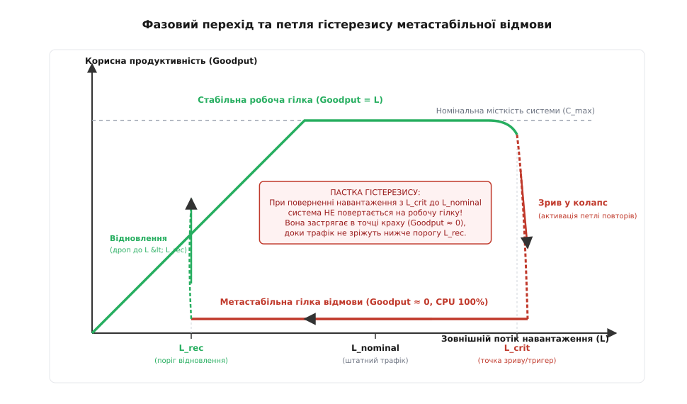
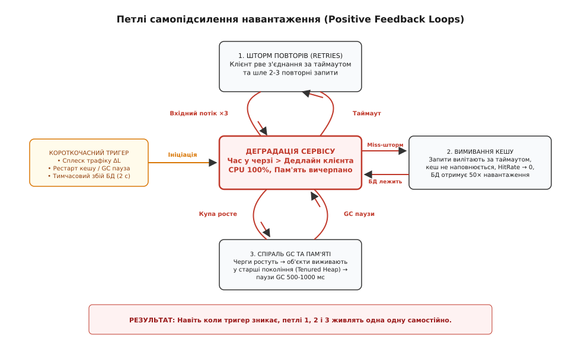
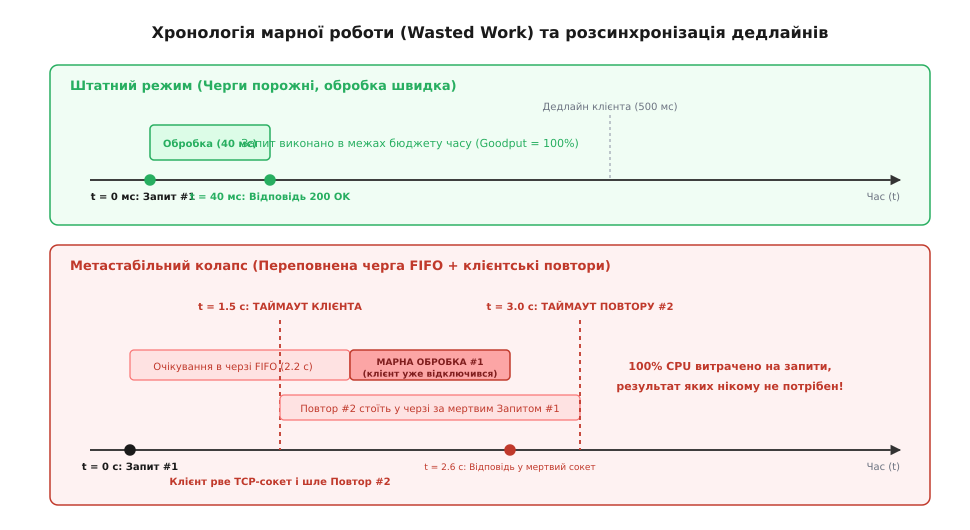
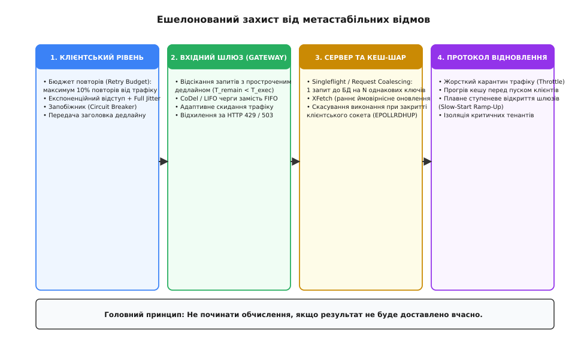

# Метастабільні відмови

<preknowlist>
- [Таймаути і бюджет часу](topic:sf-distributed/timeouts-deadlines) — дедлайни запитів, клієнтські таймаути та бюджет часу наскрізного виклику.
- [Скидання навантаження і плавна деградація](topic:sf-distributed/load-shedding) — активне скидання надлишкового трафіку для збереження корисної пропускної здатності.
- [Повторні спроби та експоненційний відступ](topic:sf-distributed/retries-backoff) — небезпека шторму повторів під час деградації серверних вузлів.
- [Запобіжник](topic:sf-distributed/circuit-breaker-pattern) — клієнтський захист від повільних і збійних залежностей.
- [Стратегії кешування](topic:sf-data/caching-strategies) — каскадне кешування, інвалідація та наслідки вимивання гарячих даних.
- [Перебірки (bulkhead)](topic:sf-distributed/bulkhead-isolation) — ізоляція пулів потоків, черг і семафорних квот між різними операціями.
</preknowlist>

Під час планового перемикання репліки PostgreSQL у високонавантаженому платіжному сервісі виникає секундна затримка обробки транзакцій. Кластер із 64 вузлів застосунку, розрахований на штатне навантаження у 20 000 запитів на секунду, миттєво накопичує чергу з 40 000 завдань. Клієнтські застосунки на смартфонах мають таймаут у 1 500 мілісекунд; не отримавши відповіді, кожен клієнт автоматично робить до трьох повторних спроб через кожні 200 мілісекунд. Через 2 секунди база даних успішно завершує процедуру перемикання і повністю готова до роботи, але сервіс не повертається до життя. Вхідний потік зростає з 20 000 до 75 000 запитів на секунду, черги сокетів ядра Linux переповнюються, процесори всіх серверів наглухо завантажені на 100%, а частка успішних відповідей падає з 99,99% до 0,1%. Сервери витрачають усі ресурси на виконання операцій для клієнтів, які вже давно розірвали TCP-з'єднання. Зовнішній тригер аварії зник кілька хвилин тому, але система залишається паралізованою годинами — вона увійшла в стан самопідтримуваної метастабільної відмови.


*Фазовий простір та петля гістерезису: короткочасний сплеск навантаження виштовхує систему через критичну точку L_crit на верхню гілку відмови, повернення з якої вимагає глибокого примусового скидання трафіку нижче порогу L_rec.*

> 🔧 **Навіщо це.** У масштабованих архітектурах більшість катастрофічних аварій викликані не фізичним руйнуванням серверів чи перманентними помилками в коді, а прихованими петлями позитивного зворотного зв'язку. Коли сервіс потрапляє в метастабільний стан, традиційні інженерні рефлекси — перезапуск процесів або автоматичне додавання нових серверів — лише поглиблюють колапс. Розуміння механіки метастабільності дозволяє спроєктувати бар'єри стійкості, які фізично унеможливлюють замикання петлі самопідсилення.

## Фізична сутність та класифікація відмов

Термін **метастабільність (від грец. *meta* — після, за межами, зміна, та лат. *stabilis* — стійкий, нерухомий)** прийшов у розподілені системи з квантової фізики та напівпровідникової схемотехніки. У фізичній системі метастабільним називають стан відносної рівноваги, який не відповідає глобальному енергетичному мінімуму, але захищений локальним потенційним бар'єром.

В інженерії програмного забезпечення цим терміном позначають фазовий стан розподіленої системи, за якого вона не здатна самостійно відновити нормальну працездатність після зникнення первинного збурення.

Щоб точно діагностувати стан системи під час інциденту, необхідно розрізняти три фундаментальні класи збоїв:

1. **Транзиторне перевантаження (Transient Overload):** вхідний потік запитів тимчасово перевищує номінальну місткість кластера (`L > C`). Черги зростають, час відповіді збільшується, частина запитів скидається. Щойно вхідний потік повертається до штатного рівня (`L < C`), сервери вичитують залишки черги, і система автоматично повертається до субмілісекундних затримок.
2. **Каскадна відмова (Cascading Failure):** збій одного вузла призводить до механічного перенесення його навантаження на сусідні вузли. Ті також зазнають перевантаження й виходять з ладу, спричиняючи ланцюгову реакцію падіння кластера. Якщо ліквідувати першопричину та підняти вузли, каскад припиняється.
3. **Метастабільна відмова (Metastable Failure):** короткочасний тригер активує внутрішню петлю позитивного зворотного зв'язку, яка генерує додаткову внутрішню роботу (Work Amplification). Навіть коли зовнішній тригер повністю зникає, а вхідний потік падає до звичайного або навіть нижчого за звичайний рівня, система залишається в режимі повної непрацездатності безстроково.

Детальний аналіз зародження теорії метастабільності від апаратних тригерів 1950-х років до аварій Facebook, AWS та Roblox викладено у вставці [📜 Від тригерів Шмідта до хмарних колапсів: історія дослідження метастабільності](topic:sf-distributed/metastable-failures/hist-metastable-failures.md).

## Анатомія метастабільності: тригер проти петлі підсилення

Будь-яка метастабільна катастрофа складається з двох суворо відокремлених компонентів:
* **Первинний тригер (The Trigger):** короткочасна, минуща подія, яка вибиває систему зі стабільного стану. Тригером може бути пауза на збирання сміття (Garbage Collection Pause) на 800 мс, планове оновлення сертифіката TLS, короткочасне розділення мережі (Network Partition), рестарт ноди кешу Redis або маркетинговий сплеск трафіку. Тригер триває секунди або хвилини і неминуче зникає.
* **Петля самопідтримуваного зв'язку (The Sustaining Feedback Loop):** внутрішній механізм системи, який перетворює високу затримку або переповнення черги на додаткову обчислювальну роботу.

Поки система перебуває на нормальній робочій гілці, коефіцієнт підсилення роботи дорівнює одиниці: на один вхідний запит виконується рівно одна порція обчислень (`W = 1 · W_0`).

Коли тригер зсуває затримку або чергу за критичний поріг, вмикається підсилювач навантаження. Кожен вхідний запит починає породжувати `A(q)` одиниць внутрішньої роботи, де `A(q) >> 1`.


*Схема замикання петель позитивного зворотного зв'язку: короткочасний тригер ініціює деградацію затримок, яка активує шторми повторів, вимивання кешів та паузи GC, утримуючи систему в колапсі після зникнення тригера.*

### Математика фазового простору та поріг відновлення

Поведінка системи описується рівнянням балансу між сукупною згенерованою роботою та реальною пропускною здатністю серверів `C`:

```
dq/dt = L · A(q) - C
```

де `q(t)` — рівень завантаженості (довжина черги), `L` — вхідний трафік, `A(q)` — коефіцієнт підсилення роботи.

Залежність системи від навантаження утворює замкнену петлю гістерезису:
1. **Точка зриву `L_crit`:** максимальний рівень трафіку, який система здатна витримати на стабільній гілці. За перевищення `L_crit` відбувається зрив у колапс.
2. **Поріг відновлення `L_rec`:** мінімальний рівень вхідного потоку, до якого необхідно примусово зрізати зовнішній трафік, щоб система вийшла з метастабільного стану.

Математичне виведення величини `L_rec` показує фундаментальну небезпеку гістерезису:

```
L_rec = C / A_max
```

Якщо через клієнтські повтори та вимивання кешу коефіцієнт підсилення становить `A_max = 5.0`, то кластер з номінальною місткістю `C = 10 000` RPS зможе самостійно відновитися лише тоді, коли зовнішнє навантаження впаде нижче `2 000` RPS. Повернення трафіку до штатного рівня в `7 000` RPS триматиме систему намертво заблокованою у стані відмови.

Повне математичне виведення рівнянь динаміки, лінеаризацію за Ляпуновим та аналіз біфуркацій наведено у вставці [🧮 Математична модель підсилення навантаження, біфуркацій та гістерезису](topic:sf-distributed/metastable-failures/math-feedback-and-hysteresis.md).

## П'ять головних механізмів самопідсилення навантаження

У сучасних розподілених архітектурах метастабільний зворотний зв'язок реалізується через п'ять основних системних пасток.

### 1. Шторм повторних спроб та спіраль марної роботи

Найпоширеніша причина метастабільності — неузгодженість між клієнтськими таймаутами та часом очікування в серверних чергах FIFO (First-In, First-Out).


*Хронологія виникнення марної роботи: клієнтський таймаут розриває з'єднання, після чого сервер витрачає дорогі ресурси CPU та вводу-виводу на обслуговування мертвого запиту, відсуваючи виконання свіжих повторів.*

Динаміка колапсу розгортається наступним чином:
1. Клієнт надсилає Запит #1 з таймаутом `T_client = 1.0` с.
2. Через тимчасову затримку черга сервера розтягується, і Запит #1 чекає на виконання `1.8` с.
3. На позначці `1.0` с клієнт фіксує таймаут, закриває TCP-сокет і відправляє Запит #2 (повтор).
4. На позначці `1.8` с звільнений серверний потік витягує з голови черги Запит #1 і сумлінно витрачає 50 мс CPU та дискового I/O на його обробку. Сформована відповідь надсилається в уже мертвий сокет. Вся виконана робота є **марною (англ. *wasted work*)**.
5. Поки сервер марнував ресурси на мертвий Запит #1, надісланий Запит #2 старіє в хвості черги і також неминуче прострочується.

Корисна пропускна здатність (**Goodput**) падає до нуля, тоді як процесори серверів завантажені на 100% виконанням обчислень, результати яких ніколи не дійдуть до користувача.

### 2. Вимивання кешу та лавина звернень до бази даних (Cache Stampede)

У багатоярусних вебсервісах кеш в оперативній пам'яті (Memcached, Redis) бере на себе 95–99% операцій читання, захищаючи реляційні або документоорієнтовані бази даних.

Якщо вузол кешу перезавантажується або зазнає масової інвалідації ключів:
1. Частка влучань у кеш (Hit Rate) падає, наприклад, з 99% до 50%.
2. Навантаження на дискову підсистему та процесори бази даних зростає у 50 разів.
3. База даних миттєво вичерпує пули з'єднань (`max_connections`) та блокування рядків. Час виконання запитів збільшується з 2 мс до 5 000 мс.
4. Сервери застосунків, які намагаються зчитати дані для наповнення кешу, вилітають за таймаутом і повертають клієнтам помилки HTTP 500/504.
5. Оскільки невдалі запити не записуються в кеш, кеш залишається порожнім (холодним).

Виникає стійка метастабільна петля: база даних занадто перевантажена, щоб відповісти на запити наповнення кешу, а кеш не може наповнитися, тому що база даних лежить.

### 3. Спіраль деградації пам'яті та пауз збирача сміття (GC Death Spiral)

У керованих середовищах виконання (Java Virtual Machine, Go, .NET, Node.js) тривалість та частота циклів збирання сміття прямо залежать від обсягу довгоживучих об'єктів у купі (Heap).

1. Коли вхідні черги накопичують сотні тисяч очікуючих запитів, виділені під них буфери пам'яті, дескриптори та DTO-структури живуть довше, ніж триває короткий цикл збирання сміття (Young Generation GC).
2. Об'єкти масово переміщуються у старше покоління купи (Tenured / Old Generation), викликаючи фрагментацію пам'яті.
3. Рантайм запускає важкі фази повного збирання сміття (Full GC / Stop-the-World), які призупиняють виконання потоків застосунку на 500–2 000 мілісекунд.
4. Під час паузи Stop-the-World сервер не читає байти з мережевих сокетів. Черги сокетів ядра Linux (`listen backlog`) переповнюються, клієнти отримують обриви з'єднань і генерують нові повтори.
5. Нові запити виділяють ще більше пам'яті, провокуючи негайний наступний цикл Full GC. Процес впадає в кому постійного збирання сміття, доки його не вб'є OOM Killer операційної системи.

### 4. Каскадні реконнекти та шторм службових протоколів (Gossip / Discovery Churn)

Сучасні мікросервісні кластери спираються на розподілені реєстри служб (Consul, Eureka, ZooKeeper, etcd) та механізми перевірки працездатності (Health Checks).

1. Коли серверний вузол сповільнюється через перевантаження, він перестає вчасно відповідати на запити `/healthz` від балансувальника навантаження.
2. Балансувальник маркує вузол як «мертвий» і виключає його з пулу активних серверів.
3. Весь вхідний трафік перенаправляється на решту вузлів, які миттєво зазнають ще більшого дефіциту ресурсів і також провалюють свої перевірки працездатності.
4. Одночасно тисячі мікросервісів-клієнтів фіксують зміну топології кластера і починають масово опитувати реєстр служб та перевстановлювати TCP-з'єднання з новими TLS-рукостисканнями.
5. Витрати процесора на криптографію TLS та обробку протоколу узгодження (Gossip / Raft) витісняють виконання корисної бізнес-логіки.

### 5. Контенція блокувань та виснаження пулів потоків

Під час високої щільності одночасних транзакцій час виконання бізнес-операцій перестає бути константним:
1. Зростання кількості одночасних потоків призводить до контенції (змагання) за м'ютекси, спинлоки та блокування рядків у базі даних (`SELECT ... FOR UPDATE`).
2. Замість корисних обчислень процесори витрачають такти на перемикання контекстів ядра Linux (`sys_switch`) та очікування на примітивах синхронізації (`futex`).
3. Пропускна спроможність системи не просто виходить на плато, а деградує за експоненційним законом: чим більше запитів надходить одночасно, тим повільніше обробляється кожен з них.

## Чому традиційні засоби порятунку погіршують ситуацію

Коли інженери стикаються з метастабільною аварією без розуміння її природи, стандартні експлуатаційні процедури перетворюються на каталізатори катастрофи.

### Пастка автоскейлінгу (The Autoscaling Trap)

Перша автоматична реакція хмарної платформи (Kubernetes HPA, AWS Auto Scaling Group) на 100% завантаження CPU — створення десятків нових вузлів (Pod / EC2 Instance).

Проте під час метастабільної відмови нові вузли:
* Стартують з абсолютно **холодними локальними кешами**, створюючи додатковий піковий шторм читань до вже мертвої бази даних.
* Одночасно відкривають сотні нових TCP-з'єднань до пулів бази даних та черг повідомлень, виснажуючи ліміти пам'яті ядра на брокерах.
* Вимагають проходження важких процедур ініціалізації, з'їдаючи спільну пропускну здатність мережі.

Додавання обчислювальних ресурсів під час аварії підкидає дрова у вогонь зворотного зв'язку, прискорюючи колапс інфраструктури.

### Пастка «сліпого» перезапуску (The Blind Reboot Trap)

Спроба одночасного перезапуску всіх процесів кластера застосунків призводить до так званого ефекту здичавілого натовпу (Thundering Herd Effect).

Щойно процеси піднімаються, мільйони накопичених запитів від мобільних клієнтів та шлюзів миттєво вдаряють у кластер. Сервери падають на першій секунді життя, не встигнувши навіть завантажити конфігурацію та прогріти JIT-компілятори або кеші зв'язків.

## Ешелонований архітектурний захист

Запобігання метастабільним відмовам вимагає побудови багатошарових захисних контурів, які розривають петлі підсилення на кожному рівні системи.


*Чотири контури ешелонованого захисту: клієнтські бюджети повторів, шлюзовий контроль життєздатності дедлайнів, дедуплікація кешу Singleflight та адміністративний карантин відновлення.*

### 1. Наскрізне прокидання дедлайнів та перевірка скасувань

Золоте правило захисту від марної роботи: **ніколи не виконувати обчислення, якщо клієнт уже не чекає на відповідь**.

Для цього в системі впроваджуються два обов'язкові механізми:
* **Прокидання дедлайну (Deadline Propagation):** клієнт передає абсолютний час закінчення операції через заголовок `X-Request-Deadline-Ms` або `grpc-timeout`. Кожен мікросервіс у ланцюжку викликів вираховує залишок бюджету часу:
  ```
  T_remaining = T_deadline - now()
  ```
  Якщо `T_remaining < T_min_execution`, запит негайно скидається без звернення до бази даних.
* **Перевірка активності сокета перед важкою роботою:** сервер перед початком дорогої операції викликає неблокуючий системний виклик `poll()` з прапорцями `POLLIN | POLLHUP` та перевіряє сокет через `recv(..., MSG_PEEK)`. Якщо клієнт розірвав з'єднання, виконання переривається негайно.

### 2. Бюджети повторних спроб на стороні клієнтів (Retry Budgets)

Клієнтським бібліотекам та проксі-серверам (Envoy, Linkerd) категорично забороняється виконувати повторні спроби на основі простих локальних лічильників.

Впроваджується алгоритм **Retry Budget**:
* Клієнт веде облік успішних первинних запитів за допомогою алгоритму токен-бакета.
* Повторні спроби дозволяються лише за рахунок накопичених токенів, при цьому частка повторів жорстко обмежується максимум 10% від загального обсягу викликів:
  ```
  RPS_retry ≤ 0.10 · RPS_primary
  ```
* Якщо сервіс починає масово віддавати помилки або таймаути, бюджет повторів вичерпується за частки секунди, повністю блокуючи виникнення шторму повторів.

### 3. Дисципліни черг LIFO та алгоритм CoDel на сервері

Класична черга FIFO під час перевантаження живить метастабільність, подаючи на обробку найстаріші, вже прострочені запити.

У разі виявлення зростання затримки перебування в черзі (**Sojourn Time**) вхідний конвеєр автоматично перемикається на дисципліну **LIFO (Last-In, First-Out)** або вмикає скидання на базі алгоритму CoDel (Controlled Delay). Воркери беруть у роботу найсвіжіші запити з хвоста черги, гарантуючи для них 100% успішне виконання в межах таймауту, тоді як старий хвіст скидається.

### 4. Захист кешу: дедуплікація запитів (Singleflight / Coalescing)

Для запобігання колапсу бази даних при промахах кешу застосовується патерн **Singleflight (Request Coalescing)**:
* Якщо 1 000 паралельних потоків одночасно запитують один і той самий відсутній у кеші ключ, система виконує рівно **один** реальний запит до бази даних.
* Решта 999 потоків блокуються на умовному семафорі та отримують результат першого запиту, щойно він повертається з БД.

Додатково застосовується алгоритм **XFetch (Probabilistic Early Refresh)**, який ініціює фонове асинхронне оновлення гарячого ключа до того, як спливе його реальний TTL, унеможливлюючи утворення дірок у кеші.

Повну програмну реалізацію бюджету повторів, перевірки життєздатності дедлайнів на сокетах та алгоритму запобігання марній роботі мовами C та C++ наведено у вставці [⚙️ Реалізація адаптивного захисту від метастабільних петель](topic:sf-distributed/metastable-failures/proj-metastable-circuit-breaker.md).

Специфікацію HTTP/gRPC заголовків, конфігураційні схеми та адміністративні інтерфейси деталізовано у вставці [📋 Специфікація політик та протоколів захисту від метастабільності](topic:sf-distributed/metastable-failures/api-resilience-policy.md).

## Протокол екстреного виведення системи з метастабільного стану

Якщо система все ж увійшла в метастабільний колапс (Goodput ≈ 0, CPU 100%), вивести її назад стандартними засобами неможливо. Чергова зміна інженерів повинна виконувати строгий протокол екстреного відновлення:

```
                  ┌──────────────────────────────────────────────────────────┐
                  │   ПРОТОКОЛ ВИВЕДЕННЯ З МЕТАСТАБІЛЬНОГО КОЛАПСУ           │
                  └────────────────────────────┬─────────────────────────────┘
                                               │
                                               ▼
                  ┌──────────────────────────────────────────────────────────┐
                  │ 1. ВСТАНОВЛЕННЯ ЖОРСТКОГО КАРАНТИНУ ТРАФІКУ              │
                  │    Скидання зовнішнього трафіку до L < L_rec (10-20% max)│
                  │    або повне відсікання на рівні CDN/Edge Gateway        │
                  └────────────────────────────┬─────────────────────────────┘
                                               │
                                               ▼
                  ┌──────────────────────────────────────────────────────────┐
                  │ 2. ПРИМУСОВЕ ОЧИЩЕННЯ ЧЕРГ ТА БУФЕРІВ                    │
                  │    Скидання listen backlog, дроп накопичених повідомлень │
                  │    у брокерах RabbitMQ/Kafka, рестарт воркерів           │
                  └────────────────────────────┬─────────────────────────────┘
                                               │
                                               ▼
                  ┌──────────────────────────────────────────────────────────┐
                  │ 3. СИНТЕТИЧНИЙ ПРОГРІВ КЕШІВ ТА ПУЛІВ                    │
                  │    Наповнення Redis/Memcached ключами першої необхідності│
                  │    в ізоляції від користувацького трафіку                │
                  └────────────────────────────┬─────────────────────────────┘
                                               │
                                               ▼
                  ┌──────────────────────────────────────────────────────────┐
                  │ 4. СТУПЕНЕВЕ ВІДКРИТТЯ ШЛЮЗІВ (SLOW-START RAMP-UP)       │
                  │    Поступове підвищення лімітів: 10% → 25% → 50% → 100%  │
                  │    з інтервалом у 2-5 хвилин під контролем затримок      │
                  └──────────────────────────────────────────────────────────┘
```

1. **Жорсткий карантин трафіку (Traffic Quarantine):** на прикордонних маршрутизаторах (Edge Gateway / CDN) вмикається примусовий ліміт, що зрізає вхідний потік нижче розрахункового порогу відновлення `L_rec` (зазвичай залишають 10–20% від штатного трафіку або повністю перемикають користувачів на статичну сторінку-заглушку).
2. **Очищення внутрішніх черг (Queue Purge):** примусово спорожняються всі черги повідомлень (RabbitMQ, Redis Streams, Kafka backlog) та черги завдань воркерів. Обробляти старі накопичені транзакції заборонено, оскільки їхні дедлайни давно минули.
3. **Холодний старт та синтетичний прогрів кешів:** піднімаються базові сервіси та сховища даних. За допомогою скриптів прогріву (Warm-up jobs) в кеші завантажуються ключі першої необхідності (сесії, довідники, конфігурації).
4. **Ступеневе відкриття шлюзів (Slow-Start Ramp-Up):** вхідний трафік відкривається малими порціями (10% → 25% → 50% → 75% → 100%) з паузами у 2–5 хвилин між кроками. Це дає системі змогу природно наповнювати локальні кеші та пули з'єднань, не створюючи ударних хвиль перевантаження.

Головний урок метастабільності простий: стабільність розподіленої системи визначається не її піковою обчислювальною потужністю, а здатністю вчасно відмовлятися від виконання непотрібної роботи.
