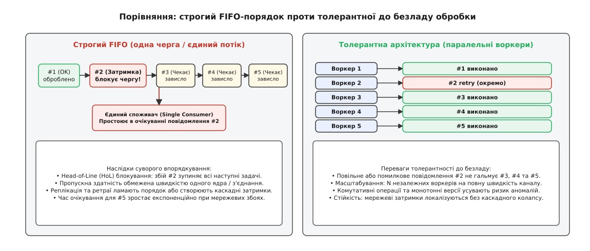
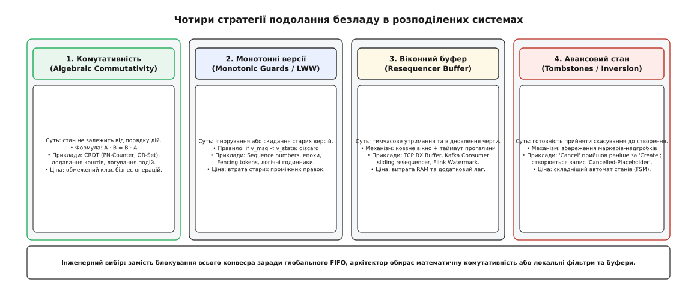
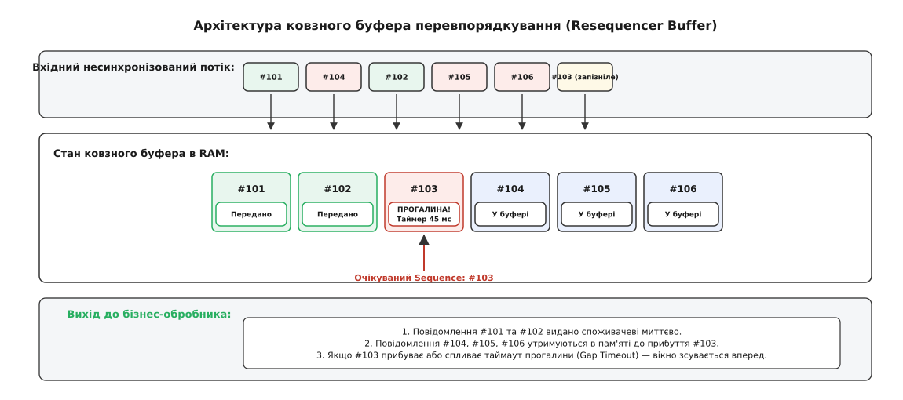
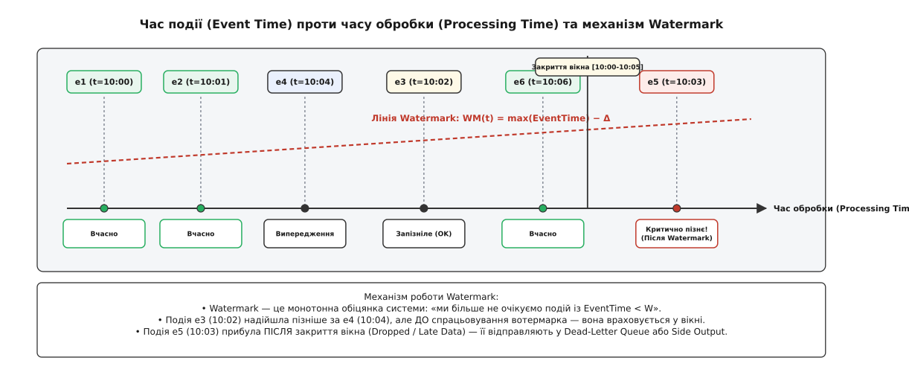

# Толерантність до безладу: чому строгий порядок не масштабується і як проєктувати системи без нього

<preknowlist>
- [Омани розподілених обчислень](topic:sf-distributed/distributed-fallacies) — мережа затримує, губить і переставляє пакети; часова однорідність є ілюзією.
- [Гарантії доставки](topic:sf-distributed/delivery-guarantees) — доставка щонайменше один раз неминуче призводить до повторів і перевпорядкування.
- [Ідемпотентність](topic:sf-distributed/idempotency) — багаторазове застосування операції не змінює фінального стану системи.
- [Векторні годинники](topic:sf-distributed/vector-clocks) — фіксація причинно-наслідкових зв'язків між подіями за відсутності єдиного фізичного годинника.
- [Журнал подій](topic:sf-distributed/event-log) — лінійний незмінний потік фактів як фундаментальна основа узгодженості.
</preknowlist>

Користувач маркетплейсу замовляє товар вартістю 4500 грн і через тридцять секунд вирішує скасувати покупку. Клієнтський застосунок генерує три послідовні події: `OrderCreated` (замовлення створено), `PaymentAuthorized` (платіж заблоковано) та `OrderCancelled` (замовлення скасовано). Події надсилаються через розподілений брокер повідомлень. Проте через тимчасовий збій мережевого маршрутизатора та повторні спроби відправки пакет `OrderCancelled` обганяє попередні повідомлення і надходить до мікросервісу комплектації складу першим. Обробник складу перевіряє базу даних, не знаходить замовлення з таким ідентифікатором і відкидає повідомлення як нечинне. Через 120 мілісекунд надходить запізнілий пакет `OrderCreated`. Обробник вважає його новим активним замовленням, записує в базу даних і відправляє завдання пакувальникам. Товар збирається, пакується і передається кур'єру для замовлення, яке покупець скасував, а гроші повернув банк.

Інший типовий прояв тієї самої проблеми виникає в системах збору телеметрії. Промисловий давач фіксує температуру реактора `T = 85.2 °C` о 14:00:01, а о 14:00:04 фіксує аварійний стрибок до `T = 112.8 °C`. Якщо пакет із міткою 14:00:04 прибуває на моніторинговий сервер за 10 мс, а пакет із міткою 14:00:01 через затримку на базовій станції доходить за 500 мс і сліпо перезаписує поточне значення в базі даних, оператор на панелі управління бачить безпечні `85.2 °C` замість реальної критичної аварії.

Ці дві катастрофи мають спільну першопричину: розробники спроєктували бізнес-логіку з прихованим припущенням, що послідовність обробки подій на вузлі-отримувачі буде дзеркальним відображенням послідовності їх виникнення у фізичному світі.

## Ціна тотального порядку: чому глобальний FIFO — це пастка масштабованості

Природна перша реакція інженера на подібні аномалії — спробувати примусово відновити строгий глобальний FIFO-порядок (англ. *First-In, First-Out* — перший прийшов, перший пішов). Здається достатнім змусити брокер повідомлень передавати всі події строго по черзі через одну чергу або єдину партицію.

Проте за це рішення доводиться платити катастрофічну ціну в пропускній здатності, латентності та відмовостійкості всієї системи.


*Строгий FIFO-порядок створює блокування початку лінії (Head-of-Line Blocking): єдине затримане повідомлення #2 заморожує обробку всіх наступних задач. Толерантна архітектура дозволяє паралельним воркерам миттєво виконувати незалежні задачі.*

Спроба нав'язати строгий глобальний порядок породжує три непереборні інженерні бар'єри:

1. **Блокування початку лінії (Head-of-Line Blocking):**
   `(англ. *head-of-line blocking*, від давн.-англ. *heafod* — голова, та франц. *bloquer* — перешкоджати)`.
   Якщо обробка повідомлення #2 вимагає повторної спроби, звернення до повільного зовнішнього API або зависає через блокування рядка в базі даних, уся черга за ним повністю зупиняється. Повідомлення #3, #4 та #5, які можуть стосуватися абсолютно інших користувачів чи товарів, вимушені простоювати. Затримка на хвості розподілу (*tail latency*) експоненційно зростає для всієї системи.

2. **Втрата горизонтального паралелізму:**
   Строгий порядок вимагає, щоб усі залежні повідомлення проходили через єдиний обчислювальний потік або єдиного споживача на партицію. Замість того, щоб утилізувати 64 ядра сучасного сервера та сотні вузлів у кластері, система впирається в швидкодію одного процесорного ядра.

3. **Неможливість міжрегіональної масштабованості:**
   Швидкість поширення світла в оптоволокні накладає фізичне обмеження: круговий час затримки (RTT) між дата-центрами у Франкфурті та Вірджинії становить приблизно 75 мілісекунд. Щоб забезпечити узгоджений порядок кожного запису між континентами, кожен запит повинен пройти повний цикл координації (наприклад, консенсус Raft чи Paxos), що обмежує продуктивність системи кількома десятками операцій на секунду.

Замість того, щоб витрачати ресурси на безуспішну боротьбу з законами фізики та мережевою нестабільністю, надійна архітектура спирається на іншу парадигму — **толерантність до безладу** (англ. *out-of-order tolerance*, від лат. *tolerare* — витримувати, терпіти, та *ordo* — ряд, порядок). 

Це підхід до проєктування моделей даних, автоматів станів та алгоритмів, за якого коректність фінального стану системи гарантується навіть тоді, коли повідомлення прибувають у довільному порядку, дублюються або зазнають значних запізнень.

> 🔧 **Навіщо це.** Якщо ваш сервіс обробляє понад 50 000 операцій на секунду, збереження глобального порядку на рівні всієї бази даних коштуватиме сотні тисяч доларів щомісяця на міжсерверні блокування та координацію. Перехід до толерантних моделей дозволяє розпаралелити обробку на довільну кількість незалежних воркерів без ризику спотворення бізнес-даних.

## Таксономія стратегій: чотири стовпи толерантної архітектури

Щоб система функціонувала коректно без зовнішнього глобального координатора, архітектор обирає один із чотирьох фундаментальних механізмів залежно від природи бізнес-операцій.


*Архітектурна таксономія: комутативність робить порядок неважливим математично; монотонні перевірки відкидають застарілі версії; ковзні буфери локально відновлюють чергу; авансові стани поглинають інвертовані події.*

### 1. Алгебраїчна комутативність та структури CRDT

Найпотужніший спосіб подолати безлад — це спроєктувати стан так, щоб результат операцій взагалі не залежав від послідовності їх застосування.

Якщо дві операції `A` та `B` мають властивість **комутативності** (від лат. *commutare* — змінювати, міняти місцями), то:

```
State · A · B = State · B · A
```

Якщо до цього додати властивість **асоціативності** `(A · B) · C = A · (B · C)` та **ідемпотентності** `A · A = A`, ми отримуємо математичну структуру — [комутативну напівґратку злиття](topic:sf-distributed/out-of-order-tolerance/math-commutativity-and-semilattices.md).

**Практичні приклади в інженерії:**
- **Адитивні лічильники (PN-Counter):** Замість команди «встанови баланс = 100 грн», клієнти надсилають відносні дельти: «додай +50 грн», «відніми -20 грн». Оскільки операція додавання в полі чисел комутативна `(+50) + (-20) = (-20) + (+50)`, баланс буде ідентичним незалежно від того, яка дельта надійде першою.
- **Розподілені множини (G-Set, OR-Set):** Додавання унікальних ідентифікаторів у множину через операцію математичного об'єднання `∪`. Об'єднання множин ідемпотентне й комутативне.
- **Незмінні журнали фактів (Event Sourcing):** Замість перезапису поточного рядка система лише додає нові факти в кінець журналу. Зріз стану обчислюється як згортка (*fold / reduce*) над множиною подій.

Детальний математичний апарат напівґраток, часткових порядків та доведення сходження наведено у вставці про [математичні засади комутативності](topic:sf-distributed/out-of-order-tolerance/math-commutativity-and-semilattices.md).

### 2. Монотонні перевірки версій та обмежений LWW

Якщо операція за своєю природою не є комутативною (наприклад, повне оновлення профілю користувача або зміна адреси доставки), система повинна контролювати напрямок зміни стану за допомогою **монотонних перевірок** (від грец. *μονοτονία* — один тон, незмінний рух).

Кожна сутність у сховищі маркується строго зростаючим номером версії:
- Номером послідовності (*sequence number*);
- Монотонним номером епохи (*epoch / generation number*);
- Логічним годинником Лампорта або [векторним годинником](topic:sf-distributed/vector-clocks);
- Огороджувальним токеном (*fencing token*).

Правило оновлення стану в базі даних формулюється як атомарний предикат:

```sql
-- Оновлення стану виконується лише тоді, коли вхідна версія строго новіша за поточну
UPDATE user_profiles
SET 
    email = :new_email,
    address = :new_address,
    version = :incoming_version,
    updated_at = NOW()
WHERE user_id = :user_id 
  AND version < :incoming_version;
```

Якщо через затримку мережі версія `v=2` надходить після того, як база вже успішно записала версію `v=3`, запит `UPDATE` оновлює `0` рядків. Обробник фіксує, що повідомлення є застарілим, і спокійно підтверджує його обробку (ACK), запобігаючи спотворенню свіжих даних.

#### Пастка небезпечного LWW за фізичним часом
Класична помилка — використання фізичного настінного часу (англ. *Last-Write-Wins, LWW* за `system_clock`) замість логічних версій. Фізичні годинники на різних серверах зазнають неминучого розсинхрону (англ. *clock skew*), викликаного стрибками NTP, температурним дрейфом кварцових резонаторів або секундами координації (*leap seconds*). 

Якщо сервер `A` відстає від сервера `B` на 200 мілісекунд, будь-яке свіже оновлення, згенероване сервером `A`, буде назавжди стерте або проігнороване старішим оновленням із сервера `B`. LWW за фізичним часом припустимий лише в некритичних системах (кеші, лічильники переглядів), де втрата окремих правок не веде до фінансових чи безпекових збитків.

### 3. Буфери перевпорядкування та ковзні вікна (Resequencer)

Коли прикладна логіка категорично вимагає послідовного виконання (наприклад, декомпресія відеопотоку, виконання фінансових проводок подвійного запису або конвеєр відновлення TCP-потоку), безлад не можна ігнорувати. Але його можна локалізувати.

Замість глобальної зупинки системи впроваджується локальний компонент — **буфер перевпорядкування** (англ. *resequencer*, від лат. *re-* — знову, та *sequentia* — послідовність).


*Ковзний буфер утримує забігаючі наперед повідомлення в оперативній пам'яті. Щойно прогалина заповнюється або спливає таймаут очікування, впорядкований ланцюжок повідомлень виштовхується прикладному обробнику.*

Механізм роботи буфера складається з таких кроків:
1. Вузол підтримує внутрішній монотонний лічильник `expected_seq` (номер наступного очікуваного повідомлення).
2. Якщо надходить повідомлення з `seq == expected_seq`, воно негайно передається бізнес-обробнику, а лічильник збільшується `expected_seq++`.
3. Якщо надходить повідомлення з `seq > expected_seq` (забігання наперед), воно зберігається в оперативній пам'яті у відсортованій структурі (кільцевий буфер або мапа). Запускається таймер прогалини (*gap deadline timer*).
4. Якщо запізніле повідомлення прибуває до вичерпання таймауту, буфер виштовхує весь неперервний накопичений ланцюг і просуває `expected_seq`.
5. Якщо таймаут прогалини спливає, система фіксує втрату пакета, сповіщає пропуск через окремий канал або метрику, примусово збільшує `expected_seq` і скидає наступні готові повідомлення.

Повну виробничу реалізацію ковзного буфера мовами C та C++ з детальним аналізом структур пам'яті наведено у [проєктній вставці про ковзний буфер](topic:sf-distributed/out-of-order-tolerance/proj-resequencer-buffer.md).

### 4. Авансовий стан та надгробки (Inverted State & Tombstones)

Найпідступніший випадок позачергової доставки — це коли операція життєвого циклу завершення (скасування, видалення, закриття) надходить **раніше** за операцію створення.

У наївних кінцевих автоматах (FSM) такий стан вважається неможливим: обробник повертає помилку `404 Not Found` або створює виняток, оскільки сутність ще не існує. Але коли через 50 мілісекунд приходить запізнілий пакет створення, система записує активну сутність, яка назавжди зависає у стані «зомбі».

Толерантний автомат станів вирішує це через **авансові стани** та **надгробки** (англ. *tombstone*, від грец. *τύμβος* — могильний насип, та давн.-англ. *stan* — камінь):

```
                        ┌───────────────────────────────┐
                        │   ПОЧАТКОВИЙ СТАН: None       │
                        └───────────────┬───────────────┘
                                        │
             ┌──────────────────────────┴──────────────────────────┐
             │ Прибула подія 'OrderCancelled'                      │ Прибула подія 'OrderCreated'
             ▼ (раніше за створення)                               ▼ (штатний порядок)
┌─────────────────────────────────────────┐           ┌─────────────────────────────────────────┐
│ СТАН: CANCELLED_PREMATURELY (Надгробок) │           │ СТАН: CREATED                           │
│ Зберігає: { order_id, reason, ts }      │           │ Зберігає: { order_id, items, amount }   │
└────────────────────┬────────────────────┘           └────────────────────┬────────────────────┘
                     │                                                     │
                     │ Прибула запізніла                                   │ Прибула штатна
                     │ подія 'OrderCreated'                                │ подія 'OrderCancelled'
                     ▼                                                     ▼
┌─────────────────────────────────────────┐           ┌─────────────────────────────────────────┐
│ Запізніле створення ігнорується,        │           │ СТАН: CANCELLED                         │
│ або статус фіксується як скасований     │           │ Замовлення коректно закрито             │
└─────────────────────────────────────────┘           └─────────────────────────────────────────┘
```

Якщо `OrderCancelled` приходить першим:
1. База даних вносить запис-заготовку з унікальним ідентифікатором замовлення та статусом `CANCELLED_PREMATURELY`.
2. Коли запізнілий пакет `OrderCreated` нарешті дістається бази даних, операція `INSERT` трансформується у злиття: система бачить, що надгробок уже існує, зберігає корисні атрибути (якщо потрібно для аудиту), але залишає фінальний стан замовлення скасованим.

> 🔧 **Навіщо це.** Шаблон надгробків є обов'язковим для розподілених саг і систем довготривалих транзакцій (Durable Workflows). Якщо ваша сага надсилає команду компенсації через таймаут, ця компенсація може прийти на цільовий сервіс раніше за первинну команду, що застрягла у черзі. Без авансового стану компенсація завершиться вхолосту, а первинна дія виконається після неї, створивши незворотний витік ресурсів.

## Потокова обробка: Час події проти часу обробки та концепція Watermark

У розподіленій аналітиці та потоковій обробці (Apache Flink, Apache Beam, Kafka Streams) проблема безладу набуває фундаментального характеру через розрив між двома часовими шкалами:
1. **Час події (Event Time):** Фізичний момент, коли дія сталася на джерелі (наприклад, клік користувача в мобільному додатку або відлік сенсора літака).
2. **Час обробки (Processing Time):** Момент часу, коли обчислювальний вузол кластера реально виконує програмний код над отриманим повідомленням.

Через втрату зв'язку, батчинг на шлюзах або затримки в чергах події з однаковим часом події можуть прибувати на сервер із запізненням у хвилини, години або навіть дні.


*Механізм Watermark: водяний знак рухається монотонно вперед за часом події, відсікаючи запізнілі дані. Події, що прибули до вотермарка, потрапляють у вікно; події після вотермарка відправляються у Dead-Letter Queue.*

Щоб коректно обчислювати агрегації за часовими вікнами (наприклад, «порахувати кількість транзакцій за інтервал 14:00–14:05»), система не може чекати вічно. Вона використовує спеціальний керівний сигнал — **Watermark (водяний знак)**.

### Математична сутність Watermark
Watermark `W(t)` — це монотонно зростаюча часова мітка, яка транслюється всередині потоку даних і декларує системне твердження:
> «З імовірністю `1 - ε` система вважає, що всі події з `EventTime ≤ W(t)` уже прибули й були оброблені».

Найпоширеніша модель генерації вотермарків — **евристика обмеженого запізнення** (англ. *bounded out-of-orderness*):

```
W(t) = max_{e ∈ Processed}(e.EventTime) - Δ
```
де `Δ` — наперед визначений часовий запас (наприклад, 5 секунд або 2 хвилини), який покриває 99.9% типових мережевих коливань.

### Життєвий цикл часового вікна:
1. Потік накопичує події у відкритому буфері вікна `[14:00, 14:05)`.
2. Події з часом `14:02`, `14:04`, `14:01`, що надходять упереміш, спокійно додаються до поточного агрегату.
3. Щойно значення Watermark досягає або перевищує `14:05:00`, вікно вважається **математично закритим**. Система обчислює фінальний результат вікна (суму, середнє значення) та емітує його в наступний сервіс.
4. Якщо після закриття вікна прибуває критично запізніла подія з `EventTime = 14:03` (англ. *late data*), вона більше не може бути включена в закритий розрахунок. Залежно від конфігурації система або скидає її в побічний потік (*Side Output / Dead-Letter Queue*), або генерує коригувальне сповіщення (англ. *retraction*).

Історію виникнення цієї моделі від мікропроцесорів IBM до алгоритмів Google MillWheel та Flink викладено у вставці про [історію позачергової обробки](topic:sf-distributed/out-of-order-tolerance/hist-out-of-order-execution.md).

## Архітектурні пастки та ціна толерантності

Толерантність до безладу суттєво підвищує масштабованість, проте накладає власні технічні компроміси та приховані ризики:

### 1. Витік оперативної пам'яті на прогалинах буферів
Якщо ковзний буфер перевпорядкування стикається з катастрофічною втратою пакета (наприклад, видавець зазнав аварії і ніколи не надішле повідомлення #103), а в системі не налаштовано жорсткий таймаут прогалини (*gap timeout*), буфер буде безкінечно накопичувати всі наступні мільйони повідомлень `#104, #105, ...`, що неминуче завершиться падінням процесу з помилкою *OutOfMemory*.

### 2. Накопичення та прибирання надгробків (Tombstone Garbage Collection)
Маркери видалення та авансові записи не можуть жити в базі даних вічно, оскільки вони збільшують розмір індексів і уповільнюють запити. Проте передчасне видалення надгробка створює критичну вразливість: якщо старий пакет видалення буде стерто з пам'яті, запізнілий пакет створення знову створить видалений об'єкт («воскресіння мертвого запису»). 

Безпечне прибирання надгробків вимагає витримки часу життя (*TTL*), який гарантовано перевищує максимальний час життя повідомлень у чергах брокера та мережевих буферах.

### 3. Складність налагодження та тестування
Тестування толерантних систем на звичайних синтетичних даних у локальному середовищі часто маскує помилки, оскільки на локальному комп'ютері повідомлення майже завжди приходять по порядку. 

Надійне тестування вимагає спеціальних інструментів хаос-інжинірингу (Chaos Engineering), які штучно затримують випадкові пакети, інвертують послідовність викликів та симулюють екстремальні мережеві розриви.

## Чекліст проєктування толерантного сервісу

Перед тим як розгортати розподілений обробник повідомлень у промислове середовище, перевірте архітектуру за таким списком критеріїв:

- [ ] **Семантика операцій:** Чи можна замінити операції абсолютного перезапису на відносні дельти або комутативне додавання фактів?
- [ ] **Контроль версій:** Чи містить кожне повідомлення монотонний ідентифікатор версії (епоху, sequence number або логічну мітку), за яким база даних може відкинути застаріле оновлення?
- [ ] **Захист від інверсії:** Як система реагує, якщо команда скасування або видалення приходить до створення? Чи передбачено створення надгробка?
- [ ] **Обмеження буферів:** Якщо використовується локальний resequencer, чи встановлено максимальний ліміт розміру вікна в мегабайтах і таймаут скидання прогалини?
- [ ] **Обробка пізніх даних:** У потоковій аналітиці — чи налаштовано маршрутизацію критично запізнілих подій у Dead-Letter Queue для аудиту?
- [ ] **Стійкість до годинників:** Чи відмовляється бізнес-критична логіка від покладання на `System.currentTimeMillis()` серверів на користь логічного часу або версійності?
