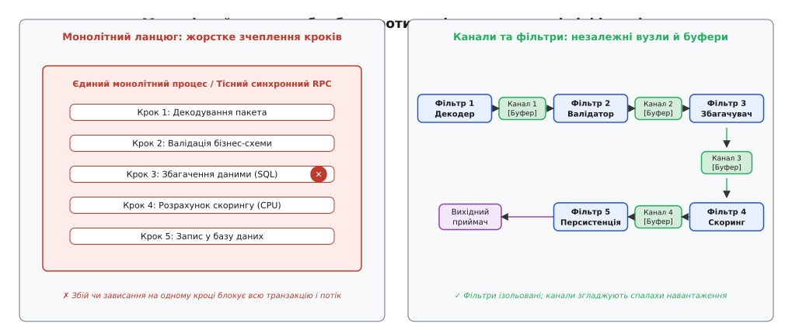
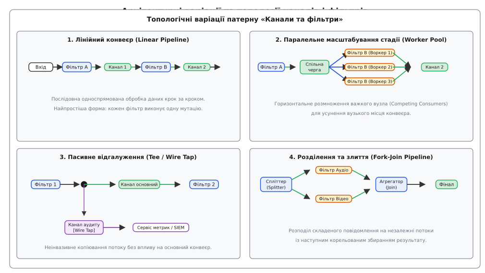
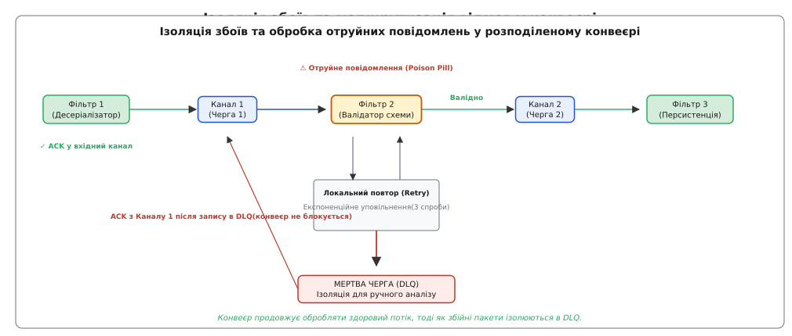
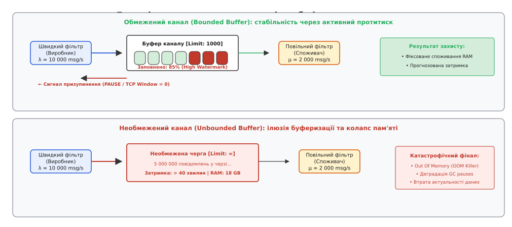

# Канали та фільтри: архітектура конвеєрної обробки розподілених потоків

<preknowlist>
- [Черга повідомлень](topic:sf-distributed/message-queue) — передача повідомлень «точка-точка» між одним відправником та одним отримувачем через буфер.
- [Pub/sub (тема)](topic:sf-distributed/publish-subscribe) — розсилання подій багатьом невідомим підписникам без прямого зв'язку між компонентами.
- [Гарантії доставки](topic:sf-distributed/delivery-guarantees) — семантика at-least-once, at-most-once та exactly-once у ненадійній мережі.
- [Мертва черга](topic:sf-distributed/dead-letter-queue) — ізоляція повідомлень, які неможливо обробити чи доставити адресату.
</preknowlist>

Платформа фінансового моніторингу та обробки телеметрії щосекунди приймає 80 000 вхідних подій: сигнатури банківських транзакцій, логи авторизацій користувачів, телеметрію платіжних терміналів та сигнали зміни балансів. Кожна сира транзакція перед остаточним збереженням у головній книзі зобов'язана пройти шість послідовних кроків: десеріалізацію бінарного пакета, валідацію криптографічного підпису, перевірку бізнес-схеми, перевірку прав доступу, розрахунок коефіцієнта фрод-ризику через модель машинного навчання та збагачення контекстом клієнтського профілю з бази даних.

Якщо всю цю послідовність реалізовано всередині єдиної монолітної функції або жорстко зв'язаного ланцюга синхронних RPC-викликів (англ. *Remote Procedure Call*), система стикається з трьома непереборними інженерними кризами:

1. **Каскадна затримка та блокування ресурсів:** Десеріалізація та валідація займають 0.2 мілісекунди процесорного часу, тоді як розрахунок моделі ризику вимагає 8 мілісекунд, а звернення до віддаленої бази даних — 15 мілісекунд мережевого очікування. У синхронній моделі один потік виконання блокується на сумарні 23.2 мілісекунди. Під час раптового сплеску трафіку пул потоків вичерпується за лічені секунди, черги вхідних TCP-з'єднань переповнюються, і сервер починає масово відкидати нові запити.
2. **Неможливість диференційованого масштабування:** Щоб збільшити пропускну здатність важкої стадії розрахунку ризиків, інженери змушені горизонтально масштабувати весь монолітний сервіс цілком. Це призводить до марного розмноження легких стадій валідації та надмірного споживання оперативної пам'яті.
3. **Крихкість і висока ціна збоїв:** Якщо на останньому шостому кроці тимчасово падає база даних збагачення або трапляється пошкоджений запис, уся транзакція завершується аварійно. Процесорні ресурси, витрачені на перші п'ять кроків, виявляються змарнованими, а повторна спроба вимагає проходження всього ланцюга з самого початку.


*Зліва: монолітний або тісно зв'язаний ланцюг обробки, де збій або затримка одного кроку паралізує всю транзакцію. Справа: архітектура «Канали та фільтри», де незалежні вузли обробки розв'язані через буферизовані односпрямовані канали.*

## Анатомія патерну: фільтри та канали

Для усунення жорсткої зв'язності та досягнення максимального паралелізму обробка розбивається на послідовність самостійних кроків за архітектурним патерном **Канали та фільтри** (англ. *Pipes and Filters*).

Патерн базується на двох фундаментальних абстракціях:

### 1. Фільтр (Filter)

**Фільтр** (від середньовічного латинського *filtrum* — повсть, повстяне полотно для проціджування рідин) — це повністю ізольований, автономний компонент обробки даних, який виконує рівно одну чітко визначену трансформацію (принцип єдиної відповідальності, Single Responsibility Principle).

Фундаментальні властивості фільтра:
* **Абсолютна ізоляція від сусідів:** Фільтр нічого не знає про те, які компоненти розташовані перед ним або після нього. Він не викликає методи сусідніх модулів і не посилається на їхній код.
* **Єдиний інтерфейс взаємодії:** Увесь зовнішній світ для фільтра зводиться до двох точок: зчитування повідомлення з вхідного порту/каналу та запис трансформованого результату у вихідний порт/канал.
* **Незмінність схеми виконання:** Фільтр отримує повідомлення, виконує обробку (декодування, фільтрацію, збагачення, перевірку) та продукує нове повідомлення. Якщо вхідний пакет не відповідає критеріям або містить помилку, фільтр може відкинути його або спрямувати у спеціальний канал помилок.

### 2. Канал (Pipe)

**Канал** (від латинського *pipa* — трубка, дудка, порожнистий циліндр для транспортування рідин або газів) — це односпрямований комунікаційний провідник, який з'єднує вихід одного фільтра з входом іншого.

Канал бере на себе всі низькорівневі задачі передачі даних:
* **Буферизація повідомлень:** Згладжує різницю у швидкості роботи між швидким постачальником і повільним споживачем.
* **Часове розчеплення (Temporal Decoupling):** Дозволяє фільтрам працювати в асинхронному режимі з різною інтенсивністю.
* **Управління протитиском (Backpressure):** Контролює наповненість внутрішнього буфера та сигналізує попередньому фільтру про необхідність сповільнити генерацію даних.
* **Ізоляція збоїв:** Якщо фільтр-отримувач зазнає аварії, канал накопичує дані, не дозволяючи збою поширитися вгору за течією потоку.

Історичну еволюцію цієї концепції — від появи перших системних каналів у лабораторіях Bell Labs до сучасних хмарних потокових топологій — детально описано в історичній довідці: [як патерн еволюціонував від однобайтових буферів ядра Unix до глобальних потокових конвеєрів](topic:sf-distributed/pipes-and-filters/hist-unix-to-cloud-pipelines.md).

## Топологічні варіації конвеєра

Хоча класична модель передбачає просту послідовну лінію передачі, у розподілених системах застосовують чотири основні топологічні конфігурації залежно від вимог до продуктивності та бізнес-логіки.


*Чотири базові топології конвеєра: від простого лінійного ланцюжка до паралельного пулу воркерів на вузькому місці, пасивного відгалуження (Wire Tap) та паралельного розділення й агрегації.*

### 1. Лінійний конвеєр (Linear Pipeline)

Найпростіша форма організації: фільтри з'єднані послідовно ланцюжком «один-до-одного». Повідомлення проходить через стадії `F₁ → P₁ → F₂ → P₂ → F₃` у суворо визначеному порядку. Кожен фільтр модифікує повідомлення та передає його далі. Підходить для задач лінійної нормалізації, трансляції форматів чи послідовної валідації.

### 2. Паралельне масштабування стадії (Worker Pool / Competing Consumers)

У реальних конвеєрах час обробки на різних стадіях рідко буває однаковим. Якщо фільтр `F₂` виконує складні математичні розрахунки або звертається до зовнішньої платіжної системи, він стає вузьким місцем усього конвеєра.

Щоб ліквідувати затор, вихідний канал перед повільною стадією перетворюють на чергу конкуруючих споживачів (англ. *Competing Consumers*). До цієї черги підключають пул із `K` паралельних екземплярів фільтра `F₂`. Кожен вільний воркер забирає чергове повідомлення, обробляє його незалежно й записує результат у спільний вихідний канал `P₂`. Це дозволяє горизонтально масштабувати саме ту стадію, яка обмежує загальну пропускну здатність.

### 3. Пасивне відгалуження (Tee / Wire Tap)

Конфігурація, запозичена з утиліти Unix `tee`. На певному етапі конвеєра встановлюється спеціальний трійник (англ. *Wire Tap*), який створює точну копію потоку повідомлень і спрямовує її у вторинний канал.

Основний конвеєр продовжує обробку без найменших затримок, тоді як відгалужений потік споживається сервісами аудиту безпеки, системами збору метрик реального часу або сховищами аналітики (Data Lake). Збій чи зависання підсистеми аудиту ніяк не впливає на стабільність основного бізнес-процесу.

### 4. Розділення та злиття (Splitter-Aggregator / Fork-Join)

Складні складені повідомлення часто містять незалежні блоки даних, які вигідно обробляти паралельно:
1. **Спліттер (Splitter):** Розбиває одне велике повідомлення на `M` незалежних фрагментів (наприклад, окремо аудіодоріжку та відеокадри з медіафайлу, або окремі позиції товарів у великому замовленні).
2. **Паралельні підконвеєри:** Кожен фрагмент прямує у власний спеціалізований ланцюг фільтрів.
3. **Агрегатор (Aggregator / Join):** Очікує завершення обробки всіх пов'язаних частин (використовуючи спільний ідентифікатор кореляції `Correlation ID`), збирає трансформовані фрагменти в єдине фінальне повідомлення та передає його наступній стадії.

## Семантика каналів у розподіленому середовищі

У межах одного процесу операційної системи канал найчастіше реалізується як потокобезпечний кільцевий буфер в оперативній пам'яті (англ. *in-memory ring buffer*). Проте в розподілених архітектурах канали розгортаються на базі мережевого проміжного програмного забезпечення (Message Brokers та Event Logs).

Вибір транспортного рівня каналу визначає фундаментальні характеристики конвеєра:

| Тип каналу | Технологічні приклади | Семантика впорядкування | Персистентність | Механіка протитиску |
| :--- | :--- | :--- | :--- | :--- |
| **In-Memory Channel** | Go channels, C++ bounded queue, LMAX Disruptor | Суворе FIFO в пам'яті | Втрачається при перезапуску процесу | Блокування потоку через умовні змінні (Mutex/CV) |
| **Черга брокера (Message Queue)** | RabbitMQ, Amazon SQS, ActiveMQ | FIFO в межах черги (можливі перестановки при ретраях) | Збереження на диск брокера (Durable Queues) | Керування лімітом попередньої вибірки (Prefetch / QoS limit) |
| **Журнал подій (Event Log)** | Apache Kafka, Apache Pulsar, AWS Kinesis | Суворе FIFO в межах однієї партиції | Довготривале незмінне збереження на диску (Append-only log) | Клієнтський Pull-механізм (споживач сам регулює темп читання) |

### Межі транзакційності та підтвердження (ACK)

У розподіленому конвеєрі передача повідомлення між фільтрами вимагає чіткого визначення моменту підтвердження обробки (англ. *Acknowledgement*, ACK):

* **Поетапний ACK (Stage-by-Stage ACK):** Фільтр `F_i` вичитує повідомлення з вхідного каналу `P_{i-1}`, виконує роботу і записує результат у вихідний канал `P_i`. **Лише після успішного запису в `P_i`** фільтр відправляє сигнал `ACK` у вхідний канал `P_{i-1}`. Якщо фільтр падає під час виконання розрахунку, повідомлення повертається в чергу `P_{i-1}` і підхоплюється іншим воркером.
* **Наскрізний ACK (End-to-End ACK):** Джерело зберігає повідомлення в пам'яті або буфері доти, доки фінальний приймач конвеєра не підтвердить повний запис. Вимагає прокидання наскрізного ідентифікатора кореляції крізь усі стадії.

## Управління станом: безстанні проти станних фільтрів

За способом взаємодії з даними всі фільтри поділяються на дві принципово різні категорії:

### 1. Безстанні фільтри (Stateless Filters)
Безстанні фільтри не зберігають пам'ять про попередні повідомлення. Результат обробки поточного пакета залежить виключно від його власного вмісту та статичної конфігурації.
* **Приклади:** валідація JSON-схеми, розпакування gzip-стиснення, розрахунок криптографічного хешу SHA-256, мапінг полів DTO.
* **Масштабування та відмовостійкість:** такі фільтри масштабуються тривіально шляхом додавання довільної кількості паралельних екземплярів без координації. У разі аварії вузол перезапускається миттєво без потреби відновлення даних.

### 2. Станні фільтри (Stateful Filters)
Станні фільтри накопичують та модифікують внутрішній стан упродовж часу. Результат обробки повідомлення залежить як від самого повідомлення, так і від накопиченої історії попередніх подій.
* **Приклади:**
  * **Віконні агрегації (Windowing):** підрахунок кількості невдалих спроб входу за останні 5 хвилин (ковзні та перекидні вікна, sliding / tumbling windows).
  * **Дедуплікація (Deduplication):** відсікання повторних транзакцій за унікальним `event_id` упродовж доби.
  * **Сесіоналізація (Sessionization):** групування дій користувача на сайті до настання 30-хвилинного періоду бездіяльності.
  * **Обмеження швидкості (Rate Limiting):** алгоритми Token Bucket та Leaky Bucket для контролю споживання API.

### Збереження та відновлення стану (State Checkpointing)
Станні фільтри вимагають використання локальних вбудованих сховищ даних (наприклад, **RocksDB**) у поєднанні з періодичним асинхронним зняттям знімків стану (англ. *checkpoints* за алгоритмом Чанді-Лампорта, Chandy-Lamport).

Коли станний фільтр зазнає збою:
1. Оркестратор запускає новий екземпляр фільтра на іншому вузлі.
2. Фільтр відновлює свій локальний стан RocksDB з останнього збереженого знімка у віддаленому сховищі (наприклад, S3).
3. Фільтр перечитує потік повідомлень із вхідного каналу, починаючи з позиції збереженого чекпоїнту, відновлюючи точний стан на момент аварії.

## З'єднання потоків (Stream Joins) у конвеєрних топологіях

У складних розподілених конвеєрах виникає потреба об'єднання кількох незалежних потоків даних. Виділяють два фундаментальні різновиди з'єднань:

### 1. З'єднання потоку з таблицею (Stream-Table Join)
Найчастіший сценарій збагачення: потік швидких транзакцій з'єднується з повільно змінюваною довідковою таблицею (наприклад, клієнтськими профілями або довідником валютних курсів).
* **Механізм реалізації:** Довідкова таблиця кешується в локальній пам'яті фільтра (RocksDB / HashMap). Оновлення таблиці транслюються окремим каналом через патерн Change Data Capture (CDC).
* **Синхронізація:** При обробці повідомлення фільтр виконує локальний пошук у кеші з мікросекундною затримкою, не навантажуючи зовнішню реляційну базу даних.

### 2. Часове з'єднання двох потоків (Stream-Stream Join)
З'єднання подій із двох різних потоків, які відбуваються з близькими часовими мітками (наприклад, зіставлення кліку на рекламу з фактом здійснення покупки в межах 30-хвилинного часового вікна `|t_click - t_buy| ≤ 30 min`).
* **Механізм реалізації:** Фільтр підтримує два внутрішні буфери станів (для лівого та правого потоків). При надходженні події з лівого потоку вона зберігається в лівому буфері й одночасно перевіряється на перетин із подіями правого буфера.
* **Очищення застарілих даних (Watermarks):** Спеціальні службові маркери часу (водяні знаки, Watermarks) визначають прогрес часової шкали подій, дозволяючи фільтру безпечно видаляти з буфера записи, для яких гарантовано сплив часовий ліміт з'єднання.

## Динамічна маршрутизація: Маршрутний лист (Routing Slip) та Composable DAG

У гетерогенних корпоративних середовищах не всі повідомлення потребують проходження однакового набору фільтрів. Наприклад, транзакції юридичних осіб вимагають перевірки податкового номера, тоді як транзакції фізичних осіб — скорингу через мобільний додаток.

Для гнучкого управління траєкторією застосовують патерн **Маршрутний лист** (англ. *Routing Slip*):
1. **Ініціалізація маршруту:** На вході до конвеєра вхідний шлюз формує в метаданих повідомлення впорядкований список стадій обробки:
```json
{
  "trace_id": "tx-88412-a",
  "routing_slip": ["Decoder", "TaxValidator", "FraudScorer", "LedgerSink"]
}
```
2. **Децентралізоване просування:** Кожен фільтр після завершення своєї операції зчитує з метаданих список, викреслює власне ім'я та пересилає повідомлення у вхідний канал наступного зазначеного фільтра.
3. **Гнучкість графа (DAG):** Така архітектура перетворює жорсткий статичний конвеєр на динамічний спрямований ациклічний граф (Directed Acyclic Graph, DAG), у якому порядок і склад стадій можна модифікувати індивідуально для кожного пакета без перебудови інфраструктури.

## Компенсаційні конвеєри та інтеграція з патерном Saga

Хоча конвеєр оптимізовано під односпрямований потік даних (Forward Flow), у розподілених бізнес-транзакціях виникають ситуації, коли пізніший фільтр стикається з невиправною бізнес-помилкою (наприклад, банківський шлюз на стадії 5 відхиляє списання коштів через відсутність ліміту, хоча стадія 2 вже забронювала товар на складі).

Для вирішення цієї суперечності застосовують **компенсаційний зворотний конвеєр** (Compensating Pipeline):
* Кожен прямий фільтр `F_i`, який виконує модифікацію зовнішнього стану (наприклад, резервування балансу), реєструє компенсуючу дію (наприклад, розблокування балансу).
* У разі критичної бізнес-відмови повідомлення з міткою `ROLLBACK` спрямовується у зворотний компенсаційний канал.
* Компенсаційні фільтри вичитують історію виконання у зворотному порядку (`F_{k-1}^{-1} → F_{k-2}^{-1} → … → F_1^{-1}`), повертаючи розподілену систему до узгодженого стану без використання важких двофазних блокувань бази даних.

## Надійність, ідемпотентність та ізоляція отруйних повідомлень

Розподілений конвеєр працює в умовах ненадійної мережі та можливих збоїв вузлів. Забезпечення безперервної роботи вимагає врахування трьох критичних факторів:

### 1. Ідемпотентність фільтрів

Оскільки канали на базі черг повідомлень забезпечують гарантію доставки [at-least-once](topic:sf-distributed/delivery-guarantees), фільтр може отримати одне й те саме повідомлення двічі (наприклад, якщо фільтр успішно записав результат у вихідну чергу, але впав до відправки `ACK` у вхідну).

Кожен фільтр повинен бути спроєктований як ідемпотентний обробник. Для цього використовують складений ключ ідемпотентності:

```
Stage_Idempotency_Key = Hash(Message_ID + Stage_Name + Stage_Version)
```

Перед виконанням мутації стану фільтр перевіряє у швидкому сховищі (наприклад, Redis або локальному RocksDB), чи не оброблявся цей ключ раніше. Якщо запис існує, фільтр пропускає повторні обчислення і негайно пересилає збережений результат у вихідний канал.

### 2. Гарантія точно-один-раз (Exactly-Once Semantics, EOS)

Для досягнення семантики «точно-один-раз» у багатостадійних конвеєрах (наприклад, у Kafka Streams та Apache Flink) застосовують **двофазну транзакційну фіксацію** (Two-Phase Commit, 2PC):

```
Транзакція на стадії N:
1. Begin Transaction
2. Вичитати вхідні повідомлення з Каналу (N - 1)
3. Оновити локальний стан фільтра (RocksDB)
4. Записати вихідні повідомлення в Канал N
5. Зафіксувати зміщення (offsets) вхідного Каналу (N - 1)
6. Commit Transaction
```

Якщо на будь-якому з кроків 2–5 стається аварія, вся транзакція відкочується: вихідні повідомлення не стають видимими для наступного фільтра (завдяки рівню ізоляції `read_committed`), а зміщення вхідної черги не пересувається. Для запобігання дублюванню від зомбі-процесів під час мережевого розділення (Split-Brain) брокери використовують монотонні номери епох транзакцій (`producer_epoch`).

### 3. Отруйні повідомлення (Poison Pills) та мертва черга (DLQ)

Якщо повідомлення містить пошкоджену структуру даних або викликає неперехоплене виключення (ділення на нуль, помилка пам'яті), стандартна спроба повторної обробки призведе до нескінченного циклу аварій: фільтр падає → брокер повертає повідомлення в початок черги → фільтр перезапускається і знову падає. Увесь конвеєр виявляється заблокованим одним пакетом.


*Схема ізоляції збоїв: при виявленні отруйного повідомлення фільтр вичерпує ліміт повторних спроб і скидає пакет у мертву чергу (DLQ), повертаючи ACK вхідному каналу, щоб не зупиняти основний потік.*

Для захисту конвеєра кожна стадія обладнується політикою повторів з обмеженням спроб:
1. При виникненні помилки фільтр повторює спробу фіксовану кількість разів (наприклад, 3 спроби з експоненційним відступом).
2. Якщо ліміт вичерпано, повідомлення вилучається з основного потоку і маршрутизується до спеціальної [мертвої черги](topic:sf-distributed/dead-letter-queue) (Dead-Letter Queue, DLQ), прив'язаної до цієї стадії.
3. У вхідний канал повертається `ACK`, дозволяючи конвеєру продовжувати безперебійну обробку наступних здорових повідомлень. Інженери аналізують вміст DLQ у фоновому режимі без зупинки системи.

## Протитиск (Backpressure) та динаміка буферів

Головна небезпека асинхронних конвеєрів криється в ілюзії нескінченної буферизації. Якщо джерело генерує 10 000 повідомлень щосекунди, а один із проміжних фільтрів здатен обробити лише 2 000, між ними починає рости черга.


*Вгорі: обмежений канал із порогом High Watermark генерує сигнал протитиску, стабілізуючи пам'ять і затримку. Внизу: необмежений буфер роздуває чергу до мільйонів пакетів, спричиняючи OOM-крах системи.*

### Наслідки необмежених каналів (Unbounded Buffers)
* **Роздування черги (Bufferbloat):** Повідомлення проводять у черзі хвилини або години, перш ніж дійти до обробки. Дані безнадійно втрачають актуальність.
* **Катастрофічний крах пам'яті (Out Of Memory, OOM):** Накопичення мільйонів об'єктів у RAM призводить до деградації збирача сміття (GC pauses на секунди) та аварійної зупинки процесу операційною системою (Linux OOM Killer).

### Механізм обмеженого буфера (Bounded Buffer)
Стабільний розподілений конвеєр зобов'язаний використовувати виключно **канали з фіксованою максимальною місткістю** `K`.

Коли кількість повідомлень у буфері перетинає поріг високої позначки (High Watermark, наприклад 80% від `K`), канал активує механізм протитиску:
* **У багатопотоковому режимі:** Потік відправника блокується на умовній змінній до моменту, доки споживач не вичитає частину даних.
* **У мережевих протоколах (TCP / gRPC):** Зменшується розмір ковзного вікна TCP Window або припиняється надсилання HTTP/2 кредитів потоку (WINDOW_UPDATE).
* **У чергах повідомлень:** Фільтр-постачальник тимчасово призупиняє вичитування зі свого вхідного каналу, транслюючи сигнал протитиску вгору за течією потоку аж до первинного джерела даних.

Математичне обґрунтування пропускної здатності конвеєра, розрахунок оптимального розміру буферів, аналіз мереж Джексона та застосування закону Літтла для оцінки затримок наведено у математичній вставці: [математичний апарат аналізу пропускної здатності, закону Літтла та динаміки буферів конвеєра](topic:sf-distributed/pipes-and-filters/math-pipeline-throughput.md).

Практичну програмну реалізацію багатопотокового конвеєра з обмеженими буферами та протитиском на мовах C та C++ подано у практичній вставці: [робоча реалізація багатостадійного конвеєра з обмеженими буферами та протитиском на C та C++](topic:sf-distributed/pipes-and-filters/proj-distributed-pipeline.md).

## Спостережуваність і розподілене трасування

Управління розподіленим конвеєром неможливе без постійного моніторингу трьох ключових груп метрик:

1. **Інтенсивність потоку (Rate):** Вхідна інтенсивність `Inflow Rate` проти вихідної `Egress Rate` для кожного окремого фільтра. Якщо для фільтра `F_i` вхідний потік становить 5000 msg/s, а вихідний — 1000 msg/s, це однозначно вказує на внутрішнє накопичення черги або масове відсікання помилок.
2. **Насиченість черги та відставання (Queue Saturation & Consumer Lag):** Кількість необроблених повідомлень у кожному проміжному каналі. Зростання лагу є випереджальним сигналом про деградацію стадії ще до того, як вичерпається оперативна пам'ять.
3. **Гістограма затримок стадій (Latency Histogram):** Розподіл часу обробки на кожній стадії за процентилями (p50, p95, p99, p99.9). Це дозволяє миттєво локалізувати фільтр, який спричиняє хвостові затримки всієї системи.

### Прокидання контексту (Context Propagation)
Щоб відстежити шлях окремої транзакції крізь асинхронні черги та гетерогенні фільтри, використовують стандарт **W3C TraceContext**. Заголовки трасування (`traceparent`, `tracestate`) записуються в метадані повідомлення (AMQP Message Headers, Kafka Record Headers). Кожен фільтр витягує ідентифікатор траси, створює власний дочірній спан (Span), фіксує тривалість своєї роботи та передає оновлений контекст у вихідний канал.

## Практичний розбір: архітектура конвеєра SIEM та телеметрії

Розглянемо реальну промислову архітектуру системи збору та аналізу подій безпеки (SIEM):

1. **Джерело подій (Edge Ingestion):** 50 000 серверів та мережевих комутаторів транслюють логи через syslog / TCP у брокер черг повідомлень (Канал 1: Kafka топік `raw.logs`, 64 партиції).
2. **Фільтр 1 (Парсинг і нормалізація):** Пул безстанних воркерів на базі Vector / Fluentbit десеріалізує неструктурований текст, витягує IP-адреси, порти, коди помилок та приводить записи до єдиної схеми ECS (Elastic Common Schema). Результат публікується в Канал 2 (`normalized.logs`).
3. **Фільтр 2 (GeoIP та збагачення контекстом):** Станний фільтр виконує Stream-Table Join із локальною базою MaxMind GeoIP та довідником активів підприємства, додаючи координати, країну та назву департаменту-власника IP. Результат записується в Канал 3 (`enriched.logs`).
4. **Фільтр 3 (Віконне виявлення атак):** Кластер Apache Flink аналізує події у 5-хвилинних ковзних вікнах: якщо для однієї IP-адреси фіксується понад 50 невдалих спроб входу через SSH, генерується критичний алерт безпеки (Splitter). Алерти відправляються в Канал 4 (`security.alerts`), а загальний потік — у Канал 5 (`storage.logs`).
5. **Приймачі (Sinks):** Алерти споживаються ботом оперативного реагування SOC, а загальний потік пакетно записується в аналітичне сховище ClickHouse / Elasticsearch.

Коли пошуковий кластер ClickHouse тимчасово переходить у режим обслуговування (підвищення затримки запису з 2 мс до 5000 мс), конвеєр реагує штатно:
* Буфер Каналу 5 накопичує повідомлення;
* Споживачі ClickHouse автоматично знижують темп вичитування;
* Стадії парсингу, валідації та генерації критичних алертів безпеки продовжують функціонувати з повною швидкістю без жодних затримок.

## Порівняння: конвеєри проти оркестрації та хореографії

| Архітектурний критерій | Канали та фільтри (Pipes & Filters) | Оркестрація (Saga / Workflow Orchestrator) | Хореографія (Choreography / Event-Driven) |
| :--- | :--- | :--- | :--- |
| **Тип навантаження** | Неперервні односпрямовані потоки даних (High Throughput Streams) | Довготривалі дискретні бізнес-транзакції (Stateful Workflows) | Слабкозв'язані реактивні події доменної моделі |
| **Координація** | Децентралізована через топологію каналів (без спільного координатора) | Централізований оркестратор (Temporal, Camunda, Step Functions) | Децентралізована через глобальну шину подій (Pub/Sub) |
| **Пропускна здатність** | Максимальна (мільйони подій на секунду) | Середня (обмежена базою даних стану оркестратора) | Висока (залежить від кількості підписників) |
| **Обробка компенсацій** | Скидання збійних пакетів у DLQ або компенсаційні канали | Автоматичний запуск компенсуючих транзакцій оркестратором | Кожен сервіс самостійно слухає події відкату |

> 🔧 **Навіщо це.**
> Патерн «Канали та фільтри» є архітектурним фундаментом для будь-яких систем потокової обробки даних (Logstash, Fluentd, Apache Flink, Kafka Streams), конвеєрів машинного навчання (ML data ingestion), систем кодування та обробки відео/аудіо (GStreamer, FFmpeg), а також платіжних шлюзів і ETL-конвеєрів. Він перетворює заплутаний монолітний код на набір незалежних, легко тестованих та диференційовано масштабованих модулів.

## Ціна архітектури та антипатерни

Розбиття обробки на розподілений конвеєр не є безкоштовним і створює специфічні інженерні накладні витрати:

1. **Ціна серіалізації та десеріалізації (SerDe Overhead):** Кожен перехід повідомлення крізь мережевий канал між фільтрами вимагає маршалінгу структури даних у бінарний або текстовий формат (JSON, Protobuf, Avro) і зворотного парсингу. Якщо фільтри виконують надто дрібні операції, витрати CPU на SerDe можуть перевищити корисний час бізнес-обчислень.
2. **Накладна мережева затримка (Network Hop Latency):** Якщо кожен канал — це окрема черга в брокері повідомлень, час доставки між стадіями збільшується на мережевий RTT (1–5 мс на кожен крок). Для систем із вимогами до ультранизьких затримок (Ultra-low latency < 1 мс) конвеєр організовують виключно всередині одного процесу через спільну пам'ять (наприклад, LMAX Disruptor).
3. **Складність трасування та налагодження:** Відстежити шлях одного проблемного повідомлення через десяток незалежних асинхронних черг неможливо без наскрізного розподіленого трасування (Distributed Tracing). Необхідно прокидати заголовки контексту W3C TraceContext (`traceparent`, `tracestate`) крізь кожен фільтр та канал конвеєра.
4. **Антипатерн «Мікрофільтри» (Over-fragmentation):** Розбиття елементарних операцій (наприклад, зміна регістру рядка чи додавання одного поля) на окремі розподілені мікросервіси з власними чергами створює колосальну інфраструктурну складність без жодної архітектурної користі. Фільтр має інкапсулювати змістовну бізнес- або технічну стадію трансформації.
