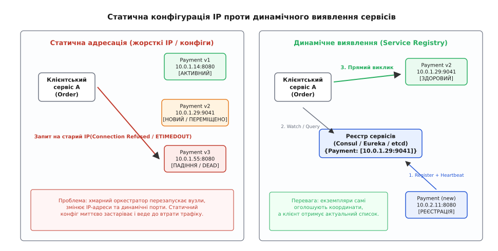
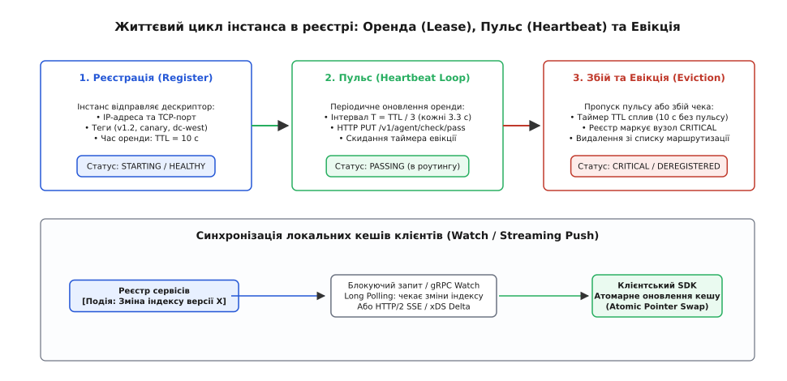
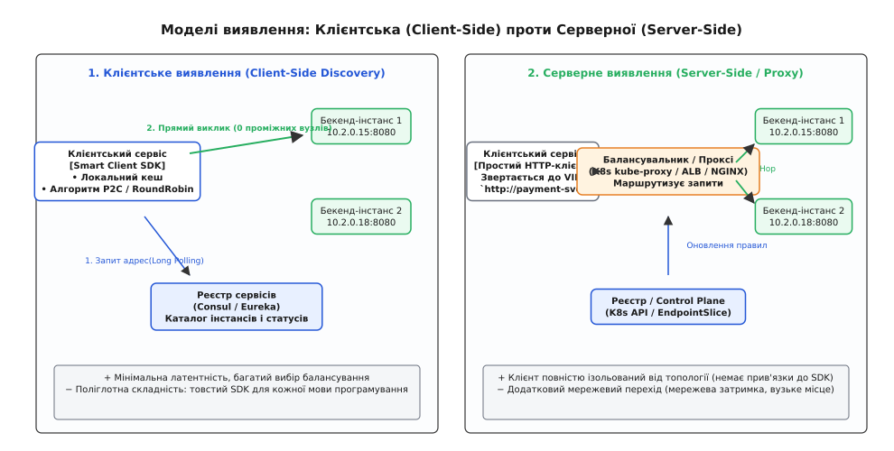
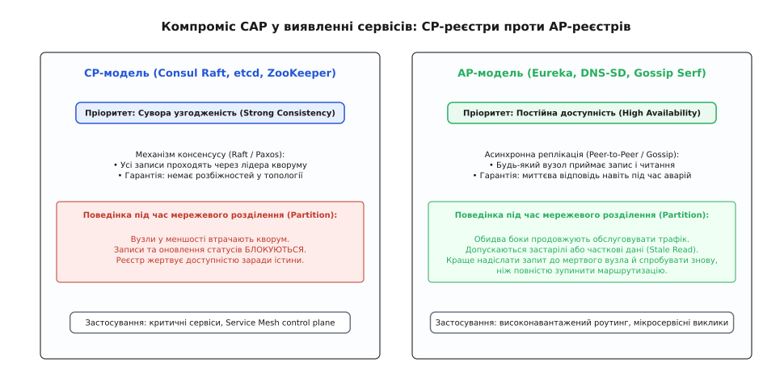

# Виявлення сервісів: динамічна адресація у розподілених системах

<preknowlist>
- [Омани розподілених обчислень](root:sf-distributed/distributed-fallacies) — мережа ненадійна, затримка ненульова, а топологія кластера постійно змінюється.
- [Зворотний проксі](root:sf-web/reverse-proxy) — пересилання вхідних запитів клієнтів до внутрішніх серверів без прямого доступу до бекенда.
- [Перевірки живості й готовності](root:sf-distributed/health-checks) — визначення працездатності екземплярів перед спрямуванням на них трафіку.
- [Сервісна сітка](root:sf-distributed/service-mesh) — прозоре керування трафіком і динамічним виявленням через сайдкар-проксі.
</preknowlist>

У великому інтернет-магазині під час святкового розпродажу сервіс обробки платежів `payment-service` зазнає несподіваного витоку пам'яті. Хмарний оркестратор Kubernetes або автоскейлер віртуальних машин примусово завершує роботу трьох деградованих контейнерів і запускає чотири нові екземпляри на інших фізичних серверах кластера. Нові процеси отримують динамічні IP-адреси `10.244.3.18`, `10.244.4.92`, `10.244.5.11` та випадкові високі TCP-порти `31842`, `32109`, `30915`. 

У цей самий момент сервіс оформлення замовлень `order-service` намагається провести транзакції тисяч покупців. Якщо адреси платіжного бекенда були зашиті статично в конфігураційний файл `/etc/hosts` або передані як статичні змінні середовища під час деплою, 100% вихідних TCP-пакетів негайно б'ються об мертві сокети з системною помилкою `ECONNREFUSED` або зависають на 30 секунд до вичерпання таймауту `ETIMEDOUT`. Платежі блокуються, кошики покупців залишаються неоплаченими, а бізнес зазнає колосальних збитків, хоча нові здорові екземпляри платіжного сервісу вже працюють і марно очікують навантаження на сусідніх серверах.

Ця аварія демонструє фізичну реальність сучасних хмарних систем: у динамічній інфраструктурі статична мережева топологія більше не існує. Екземпляри сервісів постійно народжуються, мігрують між серверами, падають і масштабуються. 

Щоб розподілена система функціонувала автономно, їй потрібен автоматизований механізм, який дозволяє сервісам знаходити актуальні мережеві координати одне одного без участі інженера та без перезапуску конфігурацій — **виявлення сервісів (англ. *service discovery*, від лат. *discooperire* — відкривати, виявляти, та лат. *servitium* — служіння, послуга)**.


*Зліва: статична прив'язка до IP-адрес ламається при першому перезапуску контейнерів і призводить до відмов зв'язку. Справа: динамічний реєстр сервісів автоматично публікує координати нових екземплярів і сповіщає клієнтів про зміни.*

## Чому традиційний DNS ламається у динамічних кластерах

Перша інтуїтивна відповідь, яка виникає в мережевого інженера: «Чому б просто не використовувати стандартну систему доменних імен (DNS)?». Адже DNS створювалася саме для зіставлення символічних імен машин із числовими IP-адресами.

Проте класичний DNS проектувався для статичного інтернету 1980-х років, де сервери жили роками на незмінних фізичних машинах. Спроба застосувати класичний DNS як єдиний механізм виявлення у мікросервісних кластерах розбивається об чотири фундаментальні обмеження:

### 1. Багаторівневе некероване кешування (Stale DNS Caches)
DNS базується на концепції часу життя запису — `TTL` (англ. *Time to Live*). Клієнтська операційна система (системний резолвер `glibc getaddrinfo`), проміжні DNS-сервери дата-центру та локальні резолвери застосунків кешують отриману IP-адресу на час `TTL`. 
* Якщо встановити великий `TTL` (наприклад, 60 секунд), то після падіння екземпляра клієнти ще цілу хвилину надсилатимуть трафік на мертву адресу, генеруючи тисячі клієнтських помилок («чорна діра» трафіку).
* Якщо встановити `TTL = 0`, щоб уникнути кешування, кожен міжсервісний HTTP-запит вимагатиме попереднього DNS-запиту через UDP. При навантаженні 100 000 RPC на секунду локальний DNS-сервер (CoreDNS або BIND) миттєво впаде під шквалом пакетів.
* Багато рантаймів мов програмування мають власні дефекти кешування. Наприклад, віртуальна машина Java (JVM) за наявності `SecurityManager` за замовчуванням кешує DNS-відповіді **назавжди** (`networkaddress.cache.ttl = -1`), що вимагає ручного переналаштування параметрів віртуальної машини.
* Системний виклик `getaddrinfo()` у стандартній бібліотеці C `glibc` є синхронним і блокуючим. Він читає конфігурацію `/etc/nsswitch.conf` та `/etc/resolv.conf`, відкриває UDP-сокет і блокує потік виконання процесу. У багатопотокових серверах це породжує черги на рівні операційної системи та сплески латентності.

### 2. Пул з'єднань нівелює DNS-резолвінг (Connection Pooling Trap)
Сучасні високоефективні HTTP/2 та gRPC клієнти повторно використовують відкриті TCP-з'єднання (**HTTP Keep-Alive**), щоб не витрачати ресурси на постійні TCP-рукостискання та TLS-шифрування. 

Клієнт резолвить доменне ім'я лише один раз під час відкриття сокета. Якщо сервіс масштабується з 2 до 20 екземплярів, клієнт продовжить ганяти весь трафік по двох раніше відкритих TCP-тунелях, повністю ігноруючи 18 нових екземплярів. DNS сам по собі не має жодного механізму повідомити клієнту: «З'явилися нові сервери, перебалансуй свої сокети».

### 3. Відсутність інформації про динамічні порти
Класичні DNS-записи типу `A` (IPv4) та `AAAA` (IPv6) повертають виключно IP-адресу. У контейнерних середовищах (Mesos, Nomad, старі Docker-хости) кілька екземплярів одного мікросервісу розгортаються на одному хості з єдиною IP-адресою, але на різних випадкових портах (наприклад, `10.0.1.15:31042` та `10.0.1.15:31099`). Запис типу `A` принципово не здатний передати номер порту.

Для передачі портів існує стандарт DNS-записів типу **SRV** (RFC 2782), проте стандартні клієнтські бібліотеки більшості мов програмування не вміють прозоро працювати з SRV без спеціалізованого коду.

### 4. Відсутність контексту працездатності (Health Status)
DNS-сервер не знає, чи здатний процес обробляти запити. Якщо вебсервер завис у безкінечному блокуванні потоків (deadlock) або вичерпав пул з'єднань із базою даних, на рівні мережевого стека операційної системи хост залишається доступним для ICMP ping, і DNS продовжує видавати його IP-адресу клієнтам.

Історичну еволюцію від файлу `/etc/hosts` і систем BIND DNS до ZooKeeper, Eureka, Consul та Envoy xDS детально розібрано у вставці [📜 Від /etc/hosts і DNS до ZooKeeper, Eureka, Consul та Envoy xDS: як народилося виявлення сервісів](root:sf-distributed/service-discovery/hist-service-discovery-evolution.md).

## Реєстр сервісів: серце динамічної архітектури

Щоб подолати обмеження DNS, у розподілену систему вводиться виділений компонент — **Реєстр сервісів (Service Registry)**.

Реєстр сервісів — це високодоступна, спеціалізована база даних у пам'яті, що містить актуальний каталог усіх запущених екземплярів сервісів, їхні мережеві координати (IP та порт), стан здоров'я і додаткові метадані (версія релізу, зона доступності, вагові коефіцієнти).

```
Реєстр сервісів (Каталог у пам'яті)
{
  "payment-service": [
    { "id": "pay-01", "ip": "10.244.1.12", "port": 8080, "status": "UP", "zone": "eu-central-1a", "version": "v2.1" },
    { "id": "pay-02", "ip": "10.244.2.45", "port": 8080, "status": "UP", "zone": "eu-central-1b", "version": "v2.1" }
  ],
  "inventory-service": [
    { "id": "inv-01", "ip": "10.244.1.88", "port": 9090, "status": "UP", "zone": "eu-central-1a", "version": "v1.0" }
  ]
}
```


*Життєвий цикл екземпляра в реєстрі: реєстрація з орендою TTL, фонове підтримання пульсу (Heartbeat) та автоматична евікція з оновленням клієнтських кешів у разі збою.*

### Патерни реєстрації екземплярів

Як саме інформація про новий сервіс потрапляє в реєстр? Існує два принципові підходи:

#### 1. Самореєстрація (Self-Registration Pattern)
Екземпляр сервісу бере відповідальність за свою реєстрацію на себе:
* Під час старту процес викликає API реєстру (наприклад, `PUT /v1/agent/service/register` у Consul або `POST /eureka/apps/{appName}` у Eureka), передаючи свій IP, порт і метадані.
* Під час штатного завершення (`SIGTERM`) сервіс надсилає команду дереєстрації (`DELETE`).
* **Перевага:** простота архітектури, немає потреби в додаткових інфраструктурних компонентах.
* **Недолік:** прив'язка коду застосунку до конкретного API реєстру; якщо процес гине аварійно (kernel panic, вибивання OOM Killer, апаратне знеструмлення), він не встигає надіслати запит на дереєстрацію і зависає в каталозі «примарою».

#### 2. Реєстрація стороннім агентом (Third-Party Registration Pattern)
Застосунок нічого не знає про існування реєстру. Реєстрацією керує виділений інфраструктурний процес:
* В оркестраторі Kubernetes цю роль виконує **Kubelet** та контролер `EndpointSlice`: щойно контейнер переходить у статус `Ready`, оркестратор автоматично додає його IP до списку ендпоінтів сервісу.
* У середовищах Docker/Nomad працюють спеціалізовані демони (наприклад, Registrator), які слухають події сокета демона контейнеризації (`docker.sock`) і автоматично реєструють/дереєструють контейнери при їх старті та зупинці.
* **Перевага:** повна мовна незалежність застосунків, гарантована дереєстрація в разі падіння хоста.

### Управління станом: Оренда (Lease) та Пульс (Heartbeat)

Щоб каталог не засмічувався мертвими серверами, реєстр використовує концепцію **тимчасової оренди (Lease / TTL)**:
1. Під час реєстрації екземпляру видається оренда на фіксований час (наприклад, `TTL = 10 секунд`).
2. Працюючий екземпляр запускає легкий фоновий потік, який періодично (кожні `TTL / 3 = 3.3 секунди`) надсилає в реєстр короткий сигнал — **пульс (heartbeat)**.
3. Отримавши пульс, реєстр скидає таймер зворотного відліку оренди назад до 10 секунд.
4. Якщо екземпляр завис або втратив зв'язок і не надіслав пульс до вичерпання TTL, реєстр переводить його в статус `CRITICAL`, виключає зі списку маршрутизації та через заданий таймаут видаляє з пам'яті (**Eviction**).

### Децентралізоване виявлення збоїв через SWIM Gossip (Consul Serf)

У великих кластерах із тисяч вузлів відправка пульсів від кожного процесу до центрального кластера реєстру може перевантажити центральні сервери. Для масштабування перевірок працездатності сучасні системи (зокрема HashiCorp Consul) використовують протокол **SWIM (Structured Weakly-Consistent Infection-Style Process Group Membership Protocol)**:
1. Кожен вузол періодично обирає випадковий інший вузол кластера і надсилає йому легкий UDP-пінг.
2. Якщо прямий пінг не повернув відповіді за визначений таймаут (через локальну втрату пакетів), вузол обирає `k` випадкових сусідів і просить їх виконати **непрямий пінг (Indirect Ping)** до цільової машини.
3. Якщо й непрямий пінг не пройшов, вузол оголошується **підозрілим (Suspect)**, і це повідомлення поширюється кластером за моделлю пліткування (Gossip).
4. Якщо підозрюваний вузол не спростує свій статус протягом таймера спростування (Refutation Timer), він остаточно позначається мертвим і видаляється з топології. Це запобігає хибним спрацьвуванням через короткочасні асиметричні мережеві збої.

Детальні структури дескрипторів, REST API виклики Consul, формат DNS SRV та маніфести Kubernetes EndpointSlice зібрано у вставці [📋 Протоколи та контракти: Consul HTTP API, DNS-SD (RFC 2782) та Kubernetes EndpointSlice](root:sf-distributed/service-discovery/api-consul-and-dns-sd.md).

## Клієнтське проти Серверного виявлення

Коли актуальний список екземплярів знаходиться в реєстрі, постає головне архітектурне питання: **хто саме виконує пошук у реєстрі та обирає кінцевий сервер для кожного запиту?**


*Зліва: Клієнтське виявлення — клієнт завантажує адреси з реєстру у локальний кеш і надсилає запити безпосередньо (0 додаткових хопів). Справа: Серверне виявлення — клієнт звертається до проміжного балансувальника, який перенаправляє трафік на бекенди.*

### 1. Клієнтське виявлення (Client-Side Discovery)
У цій моделі клієнтський застосунок використовує розумну бібліотеку (**Smart Client SDK**, наприклад, Netflix Ribbon, Finagle або gRPC Resolver):
1. Клієнт у фоновому режимі звертається до реєстру сервісів і завантажує повний список адрес доступних екземплярів цільового сервісу у свій локальний кеш у пам'яті.
2. Коли бізнес-коду потрібно виконати запит, клієнтський SDK безпосередньо в процесі виконує алгоритм балансування навантаження (Round Robin, Random або Power of Two Choices).
3. Запит летить безпосередньо з клієнта на обраний бекенд-вузол через пряме TCP/HTTP-з'єднання.

* **Переваги:** 
  * **Нульова додаткова мережева затримка (Zero Network Hops):** пакети не проходять крізь проміжні проксі-сервери.
  * **Відсутність вузьких місць:** трафік децентралізований по всій мережі.
  * **Гнучкість маршрутизації:** клієнт може реалізувати складні алгоритми вибору бекенда з урахуванням локальності (той самий дата-центр або зона доступності).
* **Недоліки:** 
  * **Поліглотне пекло:** для кожної мови програмування в компанії (Go, Java, Python, Rust, Node.js) потрібно писати та підтримувати власну версію складної клієнтської бібліотеки.

### 2. Серверне виявлення (Server-Side Discovery)
У цій моделі клієнт залишається максимально простим:
1. Клієнт надсилає звичайний HTTP-запит на стабільну віртуальну адресу балансувальника навантаження (AWS Application Load Balancer, NGINX або віртуальний IP сервісу Kubernetes `ClusterIP`).
2. Балансувальник сам тримає зв'язок із реєстром або підсистемою оркестрації.
3. Балансувальник обирає здоровий бекенд і проксіює запит далі.

* **Переваги:** 
  * Повна мовна незалежність застосунків (будь-який cURL чи базовий HTTP-клієнт працює з коробки).
  * Код бізнес-логіки повністю ізольований від інфраструктурної топології.
* **Недоліки:** 
  * Додатковий мережевий стрибок (+1 network hop), що додає затримку від 0.5 до 3 мілісекунд.
  * Балансувальник навантаження може стати центральною точкою відмови (SPOF) та вимагає окремого автомасштабування.

### 3. Внутрішньоядерна маршрутизація (In-Kernel Server-Side: kube-proxy та eBPF)
У Kubernetes знайдено елегантний компроміс між простотою клієнта та затримкою:
* **kube-proxy у режимі iptables / IPVS:** Кожен робочий вузол кластера має налаштовані правила Netfilter/iptables. Коли застосунок звертається до віртуального `ClusterIP`, ядро Linux безпосередньо в мережевому стеку підміняє IP-адресу призначення на реальний IP одного з доступних Pod за допомогою DNAT (Destination Network Address Translation). Додаткового проксі-процесу в просторі користувача немає, а затримка становить менше 0.05 мс.
* **Cilium eBPF Host-Routing:** Програми eBPF, підключені до сокетних хуків ядра `sock_ops`, перехоплюють системний виклик `connect()` і підміняють IP-адресу ще до формування мережевого TCP-пакета, усуваючи накладні витрати на таблиці трансляції адрес.

Детальне інженерне зіставлення клієнтського, серверного та mesh-підходів за шістьма осями наведено у вставці [🔌 Порівняння архітектур: Клієнтське проти Серверного та Mesh-виявлення](root:sf-distributed/service-discovery/comp-client-vs-server-discovery.md).

## Топологічна маршрутизація та оптимізація витрат (Topology-Aware Routing)

У хмарних дата-центрах фізичні машини розподілені між кількома ізольованими зонами доступності (Availability Zones, AZ) або регіонами. 

Хмарні провайдери (AWS, GCP, Azure) тарифікують мережевий трафік за правилом:
* Трафік усередині однієї зони доступності: **безкоштовний** або з мінімальною затримкою (менше 0.3 мс).
* Трафік між різними зонами доступності: **платний** ($0.01 за гігабайт в один бік) із затримкою 1–2 мс.
* Трафік між географічними регіонами: висока затримка (20–80 мс) та найвищий тариф.

Сучасний клієнт виявлення сервісів використовує **топологічну маршрутизацію (Topology-Aware Routing / Locality-Weighted Load Balancing)**.

```
Клієнт (Order Service, Zone A)
   │
   ├── 99% запитів ──► Payment Service (Zone A)  [0.3 ms, $0]
   │
   └── 1% failover ──► Payment Service (Zone B)  [1.8 ms, $$$]
```

### Алгоритм розрахунку локальних ваг:
1. Клієнт визначає власну зону (`Zone A`).
2. При отриманні списку екземплярів із реєстру клієнт фільтрує бекенди, обчислюючи доступну ємність (Capacity) у зоні `Zone A`.
3. Якщо локальних бекендів достатньо для обробки поточного потоку запитів, клієнт призначає локальним серверам вагу 100%, а віддаленим серверам із `Zone B` — вагу 0%.
4. Якщо локальні екземпляри починають падати або перевантажуватися (частка здорових серверів у зоні падає нижче 50%), алгоритм плавно переливає надлишковий відсоток трафіку на сервери в сусідніх зонах, запобігаючи каскадній відмові.

## Компроміс CAP: Консистентність проти Доступності

Реєстр сервісів сам є розподіленою системою. Отже, відповідно до теореми CAP, під час мережевого розділення (Network Partition) розробники реєстру змушені обирати між **суворою узгодженістю (Consistency, CP)** та **високою доступністю (Availability, AP)**.


*Компроміс CAP у реєстрах: CP-моделі (Consul Raft, etcd) зупиняють реєстрацію при втраті кворуму, тоді як AP-моделі (Eureka, Gossip) продовжують маршрутизувати трафік за локальними закешованими даними.*

### CP-реєстри (Consul, etcd, ZooKeeper)
Ці системи ставлять на перше місце непорушну істинність даних:
* Стан синхронізується через протоколи консенсусу (Raft або Paxos).
* Якщо дата-центр розпадається на два ізольовані сегменти, та частина кластера, яка втратила кворум більшості (менше 50% + 1 вузлів), **повністю блокує будь-які операції запису**.
* Сервіси в ізольованому сегменті не можуть зареєструватися або оновити свій статус.
* **Ціна вибору:** абсолютна гарантія відсутності розбіжностей у топології ціною повної відмови в реєстрації під час аварій зв'язку.

### AP-реєстри (Eureka, DNS-SD, Gossip Serf)
Розробники Eureka та систем на базі Gossip зробили інший вибір:
* Для маршрутизації міжсервісного трафіку краще повернути трохи застарілий список екземплярів, ніж не повернути нічого і повністю зупинити систему.
* Реплікація між вузлами реєстру відбувається асинхронно за моделлю кінцевої узгодженості (Eventual Consistency).
* Якщо клієнт звертається до вузла Eureka в ізольованому сегменті, він отримує локальний список адрес. Навіть якщо один із серверів у списку вже впав, клієнтський запобіжник ([Circuit Breaker](root:sf-distributed/circuit-breaker-pattern)) або механізм повторних спроб ([Retries](root:sf-distributed/retries-backoff)) швидко перемкне виклик на інший вузол.
* **Режим самозбереження (Self-Preservation Mode):** Якщо понад 15% екземплярів одночасно перестають надсилати heartbeat (що свідчить про розрив мережі між дата-центрами, а не про масову загибель серверів), сервер Eureka блокує видалення екземплярів, продовжуючи видавати закешовані адреси клієнтам.
* **Ціна вибору:** система працює завжди, але клієнти повинні бути готові до обробки тимчасово невалідних адрес.

## Механізми синхронізації та проблема натовпу

Як клієнти дізнаються про зміни в реєстрі без створення надмірного навантаження?

### 1. Періодичне опитування (Short Polling)
Клієнт надсилає запит кожні `N` секунд:
```
Клієнт  ─── GET /services/payment ───►  Реєстр (без змін)
Клієнт  ◄── [10.0.1.10, 10.0.1.11] ───  Реєстр
```
*Найпростіший підхід, але створює постійний фоновий шум і має затримку реакції на падіння вузла, рівну інтервалу опитування.*

### 2. Блокуючі запити (Long Polling / Blocking Queries)
Клієнт надсилає запит із зазначенням номера останньої відомої версії каталогу:
`GET /services/payment?index=42&wait=30s`.
* Якщо в реєстрі нічого не змінилося, сервер утримує TCP-з'єднання відкритим до 30 секунд.
* Щойно стан змінюється (індекс стає 43), сервер миттєво відправляє відповідь.
* *Забезпечує мінімальну затримку реакції (мілісекунди) при мінімальній кількості HTTP-пакетів.*

### 3. Потокові підписки (Streaming Push / gRPC xDS / Watches)
Клієнт відкриває постійний двонаправлений gRPC-стрім або WebSocket. Реєстр надсилає дельта-оновлення в режимі реального часу. Це основа сучасних сервісних сіток на базі Envoy (EDS — Endpoint Discovery Service).

### Проблема натовпу, що набігає (Thundering Herd Problem)

Уявімо кластер із 5 000 клієнтських мікросервісів, які тримають відкриті Long Polling з'єднання до реєстру. В один момент падає один екземпляр популярного сервісу аутентифікації.

Реєстр фіксує падіння, змінює індекс версії та **одночасно відправляє відповідь усім 5 000 клієнтам**. Отримавши оновлення, всі 5 000 клієнтів миттєво роблять новий HTTP-запит до реєстру, щоб знову стати в чергу очікування.

Цей одночасний сплеск трафіку здатний перевантажити процесори серверів реєстру та покласти підсистему виявлення.

#### Як боротися з натовпом:
1. **Випадковий зсув таймерів (Jitter):** Клієнти додають випадкову затримку (наприклад, `±20%` від базового інтервалу) перед повторним підключенням, розмазуючи пік запитів у часі.
2. **Дельта-оновлення (Incremental / Delta Updates):** Замість передачі масиву з 500 адрес передається лише зміна: `{ "action": "remove", "id": "auth-42" }`.
3. **Атомарна заміна кешу (Atomic Pointer Swap):** Клієнтський SDK готує новий масив адрес у фоновій пам'яті й атомарно змінює вказівник через механізм Read-Copy-Update (RCU) або Read-Write Lock, усуваючи блокування потоків виконання бізнес-логіки.

## Координація розгортань без простоїв (Zero-Downtime Coordination)

Під час оновлення сервісу (Rolling Update) виникає тонка часова гонка між оркестратором, реєстром та клієнтськими кешами.

Якщо контейнер зупиняється миттєво після отримання сигналу `SIGTERM`, у мережі обов'язково виникне затримка поширення інформації:
1. Контейнер відправляє дереєстрацію в реєстр.
2. Реєстр оновлює свій стан і сповіщає контролер.
3. Клієнти завантажують оновлений список адрес через Long Polling.

Цей процес займає від 100 мілісекунд до кількох секунд. Якщо старий контейнер одразу закриє сокети, всі клієнти, які ще не встигли оновити свій локальний кеш, отримають помилку `Connection Refused`.

### Правильний життєвий цикл виведення з експлуатації:
1. **Дереєстрація в реєстрі (Deregister):** Процес надсилає запит на видалення себе з каталогу або переводить статус у `Draining`.
2. **Пауза очікування синхронізації (preStop Hook):** Контейнер продовжує приймати нові з'єднання і чекає фіксований час (наприклад, 5–15 секунд), поки всі клієнти в кластері оновлять свої локальні кеші.
3. **Завершення відкритих з'єднань (Graceful Connection Draining):** Процес перестає слухати нові з'єднання, завершує обробку всіх поточних HTTP/gRPC транзакцій і лише після цього коректно закриває сокети та завершує процес із кодом 0.

## Демпфування коливань топології (Flapping Mitigation)

Якщо сервіс зазнає частих пауз збирача сміття (Garbage Collection Pauses у Java/Go) або відчуває короткочасні сплески затримки CPU, він може періодично пропускати відправку пульсу (Heartbeat).

Без додаткового захисту виникає явище **коливання (Flapping)**:
* Сервіс запізнився з пульсом на 100 мс → Реєстр маркує його мертвим → Сповіщає 5 000 клієнтів.
* Через 200 мс сервіс надсилає пульс → Реєстр маркує його здоровим → Знову сповіщає 5 000 клієнтів.
* За хвилину генеруються сотні тисяч інвалідацій кешу, перевантажуючи клієнтські процесори.

Для демпфування коливань реєстри застосовують **гістерезис станів**:
* Для переведення сервісу зі здорового стану в нездоровий вимагається `M` послідовних пропусків пульсу (наприклад, `M = 3` пропуски).
* Для повернення в здоровий стан вимагається `K` успішних послідовних перевірок здоров'я (наприклад, `K = 2` перевірки).

### Розрахунок часу збіжності топології під час збою (Convergence Latency)

Скільки часу минає від моменту фізичного падіння бекенда до моменту, коли жоден клієнт у кластері більше не надішле на нього жодного запиту?

Загальний час збіжності `T_total` складається з чотирьох послідовних часових інтервалів:

```
T_total = T_detect + T_hysteresis + T_propagate + T_client_drain
```

Розгляньмо типовий розрахунок для продакшен-кластера з параметрами: `TTL = 10 с`, інтервал пульсу `T_interval = 3.3 с`, таймаут сокета `T_timeout = 1.0 с`, `M = 3` пропуски, затримка Long Polling `T_propagate = 0.05 с`:

1. **Інтервал фіксації першого пропуску (`T_detect`):** Час до першої невдалої спроби перевірки становить у середньому `T_interval / 2 + T_timeout = 1.65 + 1.0 = 2.65 с`.
2. **Інтервал гістерезису (`T_hysteresis`):** Очікування ще `M - 1 = 2` послідовних невдалих перевірок додає `2 · 3.3 = 6.6 с`.
3. **Затримка поширення реєстру (`T_propagate`):** Реєстр переводить статус у `CRITICAL` та відправляє сповіщення клієнтам через Long Polling за `0.05 с` (50 мс).
4. **Оновлення клієнтського кешу (`T_client_drain`):** Клієнтський потік за `0.001 с` (1 мс) виконує атомарну підміну кешу і припиняє обирати мертвий вузол для нових запитів.

```
T_total = 2.65 с + 6.60 с + 0.05 с + 0.001 с ≈ 9.30 с
```

Протягом цих 9.3 секунд клієнти можуть продовжувати надсилати запити на впалий вузол. Саме тому виявлення сервісів не замінює, а **доповнює** клієнтські запобіжники (Circuit Breakers) та швидкі таймаути підключення (Connection Timeout 50–100 мс): запобіжник відсікає мертвий сокет уже на 2-му збійному запиті за перші 100 мс, не чекаючи 9.3 секунд повної синхронізації реєстру.

## Золоте правило відмовостійкості: Stale Cache Routing

Найважливіший інженерний принцип побудови надійних систем виявлення:

> **Якщо реєстр сервісів повністю впав або став недоступним через мережеве розділення, клієнтський застосунок У ЖОДНОМУ РАЗІ НЕ ПОВИНЕН скидати свій локальний кеш.**

Повна відмова реєстру сервісів — це надзвичайна ситуація, проте вона не повинна спричиняти каскадну аварію всього бізнесу. 

Якщо клієнт зберігає останній отриманий перелік адрес (**Stale Cache**), він продовжує надсилати запити на реальні бекенд-сервери, які чудово працюють у дата-центрі. Навіть якщо 5% із цих бекендів уже встигли впасти, решта 95% продовжуватимуть успішно обробляти транзакції користувачів. Локальний запобіжник (Circuit Breaker) клієнта тимчасово відсіче мертві адреси, забезпечуючи життєздатність системи під час відновлення реєстру.

Повну працюючу реалізацію стійкого клієнта з підтримкою P2C-балансування, фонового оновлення та роботи на закешованій топології під час збоїв наведено у вставці [⚙️ Стійкий клієнт виявлення сервісів з локальним кешем, пульсом TTL та алгоритмом P2C](root:sf-distributed/service-discovery/proj-client-side-discovery.md).

> 🔧 **Навіщо це.** Без динамічного виявлення сервісів неможливо реалізувати жодну сучасну хмарну практику: автоматичне масштабування за навантаженням (Autoscaling), розгортання без простоїв (Zero-Downtime Rolling Updates), синє-зелене перемикання трафіку (Blue-Green Deployment) та канареєчні релізи (Canary Releases). Виявлення сервісів перетворює крихке павутиння статичних IP-адрес на еластичну, самовідновлювану тканину розподіленої системи.
