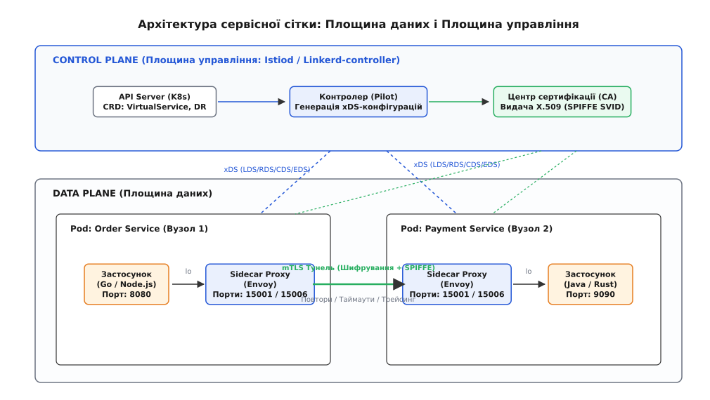
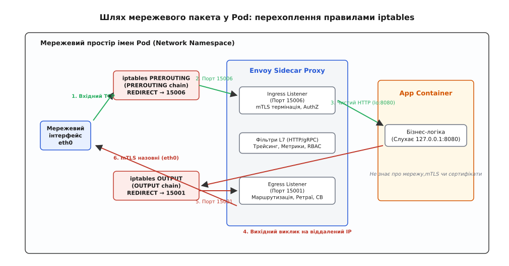
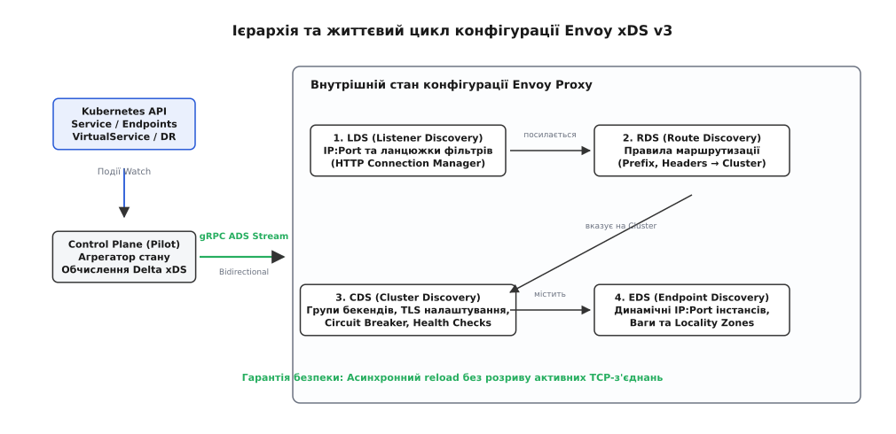
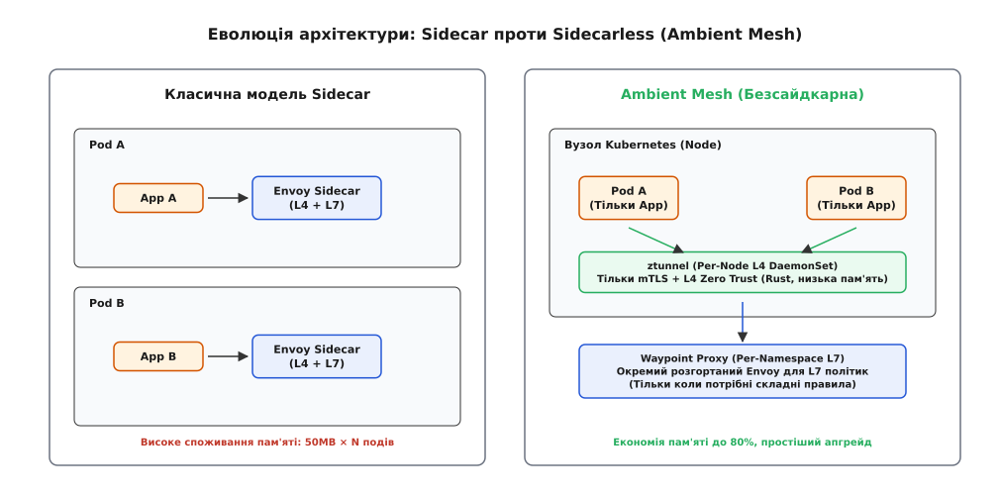

# Сервісна сітка

<preknowlist>
- [Sidecar і Ambassador](topic:sf-distributed/sidecar) — розміщення допоміжного проксі-процесу поруч із основним контейнером застосунку.
- [Площина управління і площина даних](topic:sf-distributed/control-data-plane) — фундаментальний поділ системи на шлях проходження пакетів і механізм конфігурації.
- [Виявлення сервісів](topic:sf-distributed/service-discovery) — динамічна реєстрація та пошук мережевих адрес інстансів у кластері.
- [Запобіжник](topic:sf-distributed/circuit-breaker-pattern) — автоматичне розривання викликів до збійного вузла для запобігання каскадним аваріям.
- [Розподілений трейсинг](topic:sf-release/distributed-tracing) — наскрізне відстеження запитів крізь розподілену систему за допомогою заголовків контексту.
</preknowlist>

У великому інтернет-банкінгу під час пікового навантаження один із мікросервісів перевірки кредитних лімітів починає деградувати: час його відповіді зростає зі звичних п'ятнадцяти мілісекунд до шести секунд через блокування таблиць у реляційній базі даних. Десять різних сервісів-клієнтів, написаних різними командами на Go, Java, Python та Node.js, реагують на цю затримку по-різному: Java-сервіс використовує стару бібліотеку з агресивними повторами без експоненційного відступу і потроює потік запитів до мертвого вузла; Go-сервіс зависає, вичерпуючи пул горутин через відсутність глобального таймауту; Python-сервіс обриває з'єднання і не передає заголовки розподіленого трейсингу, через що інженери втрачають слід транзакції; а Node.js-сервіс взагалі падає через вичерпання дескрипторів сокетів. Одночасно планова ротація TLS-сертифікатів на трьох вузлах завершується збоєм, і частина міжсервісних викликів починає сипати помилками перевірки підпису `SSL_do_handshake()`.

Ця аварія розкриває фундаментальну проблему першого покоління мікросервісних архітектур: перекладання мережевих гарантій — безпеки, стійкості, динамічної маршрутизації та спостережності — на прикладні бібліотеки всередині коду застосунку. Коли система розростається до сотень поліглотних сервісів, підтримувати однакову поведінку таймаутів, ретраїв, запобіжників і взаємного шифрування стає організаційно неможливо. Будь-яка зміна політики безпеки або виправлення вразливості в мережевому стеку вимагає перекомпіляції та скоординованого перерозгортання сотень репозиторіїв десятками автономних продуктових команд.

Виходом із цієї кризи стало повне вилучення мережевої взаємодії з коду застосунків у виділений прозорий інфраструктурний шар — **сервісну сітку (англ. *service mesh*, від лат. *servitium* — служіння та давньоангл. *masc* — петля, сітка)**.

## Концептуальна модель: Площина даних та Площина управління

Сервісна сітка реалізує фундаментальний розподіл обов'язків між двома автономними контурами системи:

1. **Площина даних (Data Plane):** масив високопродуктивних легковажних мережевих L4/L7 проксі-серверів (найчастіше Envoy або Linkerd2-proxy), які розгортаються як [сайдкари](topic:sf-distributed/sidecar) в одному мережевому просторі імен із кожним екземпляром застосунку. Усі вхідні та вихідні мережеві пакети програми прозоро перехоплюються сайдкаром. Проксі здійснює взаємне шифрування трафіку (mTLS), маршрутизацію, балансування навантаження, виконання повторів, розривання збійних ланцюгів ([запобіжник](topic:sf-distributed/circuit-breaker-pattern)) та генерацію детальних метрик і спанів трейсингу.
2. **Площина управління (Control Plane):** централізований контролер (наприклад, `istiod` або Linkerd Control Plane), що не бере безпосередньої участі в обробці клієнтських байтів. Контролер транслює високорівневі декларативні правила інженерів (політики безпеки, правила маршрутизації, канареечні спліти) у динамічні інструкції низького рівня та транслює їх тисячам сайдкарів через потокові gRPC-з'єднання. Також площина управління містить вбудований центр сертифікації (Certificate Authority), що автоматично генерує та ротує короткоживучі криптографічні сертифікати робочих навантажень.


*Архітектура сервісної сітки: поділ на площину даних (сайдкар-проксі коло кожного сервісу з mTLS-тунелями) та централізовану площину управління (розсилка конфігурації через xDS).*

Історичний шлях від бібліотек Twitter Finagle і Netflix Hystrix до створення Envoy, Linkerd та сучасних безсайдкарних архітектур докладно розібрано у вставці [📜 Від Finagle і Hystrix до Envoy, Linkerd та Ambient Mesh: як народилася сервісна сітка](topic:sf-distributed/service-mesh/hist-linkerd-and-envoy.md).

## Механізм перехоплення трафіку (Traffic Interception)

Для того щоб сервісна сітка залишалася повністю прозорою для коду застосунку, мережевий стек операційної системи Linux налаштовується таким чином, щоб будь-який TCP-пакет, адресований застосунку або відправлений ним назовні, непомітно перенаправлявся на локальні порти проксі-сайдкара.

У моделі контейнеризації Kubernetes усі контейнери всередині одного Pod ділять між собою єдиний мережевий простір імен (**Network Namespace**), спільну таблицю маршрутизації та інтерфейс локальної петлі `lo` (127.0.0.1).


*Шлях мережевого пакета всередині мережевого простору імен Pod: перехоплення вхідного та вихідного трафіку правилами iptables/eBPF через локальні порти сайдкар-проксі.*

### Покроковий шлях пакета крізь ланцюжки Linux iptables

Під час запуску Pod ініціалізуючий контейнер (`istio-init` з привілеєм ядра `CAP_NET_ADMIN`) конфігурує правила в таблиці `nat` підсистеми Netfilter:

1. **Вхідний шлях (Ingress):**
   * Мережевий пакет надходить на віртуальний інтерфейс `eth0` Pod із зовнішнього вузла на порт призначення застосунку (наприклад, TCP порт 8080).
   * Ядро направляє пакет у ланцюжок `PREROUTING` таблиці `nat`, який передає керування користувацькому ланцюжку `ISTIO_INBOUND`.
   * Правило `REDIRECT` переписує заголовок TCP/IP і перенаправляє пакет на локальний порт `15006` (Ingress Listener Envoy).
   * Envoy приймає з'єднання, виконує TLS-рукостискання та вичитує початкову адресу й порт призначення за допомогою виклику `getsockopt(fd, SOL_IP, SO_ORIGINAL_DST, ...)`.
   * Перевіривши політики авторизації, Envoy відкриває локальне з'єднання через інтерфейс петлі `lo` на адресу `127.0.0.1:8080`, де його очікує контейнер бізнес-логіки.

2. **Вихідний шлях (Egress):**
   * Застосунок виконує системний виклик `connect()` до віддаленого сервісу за IP-адресою `10.244.2.45:9090`.
   * Пакет потрапляє в ланцюжок `OUTPUT` таблиці `nat`, звідки перенаправляється в ланцюжок `ISTIO_OUTPUT`.
   * **Запобігання нескінченному зацикленню (Loop Prevention):** Правило перевіряє системний ідентифікатор користувача, який створив сокет (`-m owner --uid-owner 1337`). Якщо пакет згенеровано процесом Envoy (UID 1337), правило виконує дію `RETURN` і пропускає пакет напряму у фізичний інтерфейс `eth0`.
   * Якщо пакет створено будь-яким іншим користувачем (процесом застосунку), спрацьовує дія `REDIRECT` на порт `15001` (Egress Listener Envoy).
   * Envoy вилучає оригінальний IP призначення (`10.244.2.45:9090`), шукає відповідний кластер у внутрішній таблиці маршрутизації CDS/RDS, обирає здоровий екземпляр бекенда, пакує запит у mTLS-сесію та відправляє його від імені UID 1337 у зовнішню мережу.

```
+-----------------------------------------------------------------------------------+
| Мережевий простір імен Pod (Network Namespace)                                     |
|                                                                                   |
|  [eth0] ---> nat:PREROUTING ---> ISTIO_INBOUND ---> REDIRECT 15006 (Envoy Ingress)|
|                                                              |                    |
|                                                     (mTLS Term + RBAC)            |
|                                                              |                    |
|  [Застосунок :8080] <==== lo (127.0.0.1:8080) <=============+                    |
|         |                                                                         |
|  (connect :9090)                                                                  |
|         |                                                                         |
|         v                                                                         |
|  nat:OUTPUT ---> ISTIO_OUTPUT ---> [UID == 1337?] --(Так)--> Прямий вихід на eth0 |
|                                           |                                       |
|                                         (Ні)                                      |
|                                           v                                       |
|                                  REDIRECT 15001 (Envoy Egress)                    |
|                                           |                                       |
|                                  (Маршрутизація + mTLS)                           |
|                                           |                                       |
|                                  UID 1337 -> eth0 -> Мережа кластера              |
+-----------------------------------------------------------------------------------+
```

### Прискорення перехоплення за допомогою eBPF

Незважаючи на надійність iptables, проходження кожного пакета крізь повний мережевий стек ядра (розбір заголовків IP/TCP, обчислення контрольних сум, переходи між чергами сокетів) додає від 0.3 до 0.8 мілісекунди на кожен виклик.

Сучасні сітки (Cilium, Istio з eBPF bypass) замінюють правила iptables програмами **eBPF (Extended Berkeley Packet Filter)** типу `sockops` та `sk_msg`. Програма eBPF завантажується безпосередньо в хуки сокетів ядра Linux:

* Під час виклику `connect()` програма `sockops` перехоплює подію встановлення з'єднання на сокеті і зберігає відповідність сокетів у спільній хеш-таблиці ядра `BPF_MAP_TYPE_SOCKHASH`.
* Коли застосунок або проксі записує байти у дескриптор сокета, програма `sk_msg` за допомогою системного виклику ядра `bpf_msg_redirect_hash()` перенаправляє покажчик на системний буфер повідомлення (`sk_buff`) безпосередньо у чергу вичитування парного сокета.
* Пакет повністю оминає стек протоколів TCP/IP, генерацію контрольних сум і сокетні черги локальної петлі loopback, скорочуючи внутрішньовузлову затримку в 3–5 разів.

## Модель безпеки нульової довіри (Zero Trust) та SPIFFE/SPIRE

Традиційна безпека монолітів базувалася на концепції «периметра»: усе, що знаходилося всередині корпоративної мережі або приватного кластера, вважалося довіреним. У великих мікросервісних системах ця модель є неприпустимою: компрометація одного другорядного сервісу відкриває зловмиснику прямий неавторизований доступ до всіх внутрішніх баз даних і платіжних шлюзів.

Сервісна сітка впроваджує архітектуру **нульової довіри (Zero Trust Network Architecture)**, де кожен окремий виклик між двома подами автентифікується та шифрується криптографічно.

### Криптографічна ідентифікація робочих навантажень (SPIFFE ID)

Основою автентифікації є стандарт **SPIFFE (Secure Production Identity Framework for Everyone)**. Кожен сервіс отримує унікальний стандартизований ідентифікатор у форматі уніфікованого ресурсу (URI):

```
spiffe://<trust-domain>/ns/<namespace>/sa/<service-account-name>
```

Наприклад: `spiffe://cluster.local/ns/prod/sa/payment-service-account`.

### Взаємна автентифікація через mTLS

1. Центр сертифікації площини управління випускає для кожного пода короткоживучий X.509-сертифікат (SVID — SPIFFE Verifiable Identity Document), у розширення `Subject Alternative Name (SAN)` якого вшито SPIFFE ID цього пода.
2. Сертифікат і закритий ключ динамічно передаються сайдкар-проксі через локальний сокет протоколу **SDS (Secret Discovery Service)** і ротуються щогодини без перезапуску контейнерів.
3. Під час встановлення TCP-з'єднання між двома сайдкарами виконується двостороннє рукостискання **mTLS (Mutual TLS)**:
   * Клієнтський сайдкар перевіряє сертифікат сервера за кореневим публічним ключем CA і переконується, що сервер має легітимний SPIFFE ID.
   * Серверний сайдкар одночасно вимагає та валідує клієнтський сертифікат, встановлюючи точну ідентичність ініціатора виклику.
4. Після завершення рукостискання серверний проксі зіставляє вилучений SPIFFE ID клієнта з декларативними правилами авторизації (L7 Authorization Policy): наприклад, дозволити метод `POST /v1/charge` виключно клієнту з ідентифікатором `spiffe://cluster.local/ns/prod/sa/order-service-account`. Усі інші виклики скидаються зі статусом HTTP 403 Forbidden безпосередньо сайдкаром, не навантажуючи бізнес-код застосунку.

### Режими міграції: Permissive проти Strict

Під час поступового впровадження сервісної сітки в працюючий кластер виникає ситуація, коли частина сервісів уже працює з сайдкарами, а інша частина ще надсилає звичайний відкритий TCP/HTTP трафік. Для забезпечення безперебійної роботи сітка підтримує два режими автентифікації:

* **Режим сумісності (Permissive Mode):** Ingress-проксі аналізує перший вхідний пакет. Якщо клієнт ініціює TLS-рукостискання з розширенням ALPN `istio`, проксі встановлює зашифроване mTLS-з'єднання. Якщо пакет містить сирий відкритий текст (Plaintext HTTP), проксі пропускає його без шифрування. Це дозволяє впроваджувати сітку поступово сервіс за сервісом без ризику зламати сумісність.
* **Суворий режим (Strict Mode):** Ingress-проксі вимагає обов'язкового проходження взаємного TLS-рукостискання з валідним клієнтським сертифікатом. Будь-який відкритий TCP-трафік або спроба підключення без довіреного SPIFFE ID негайно обривається на рівні сокета. Цей режим є обов'язковим для промислових контурів із підвищеними вимогами до безпеки.

## Динамічна конфігурація та сімейство протоколів Envoy xDS

Головною інженерною перевагою сервісної сітки є здатність адаптуватися до змін кластера в режимі реального часу: видалення збійних подів, поява нових версій сервісу або зміна правил маршрутизації відбуваються за мілісекунди без переривання активного трафіку.

Це забезпечується завдяки універсальному протоколу динамічного виявлення **Envoy xDS v3 (Discovery Services)**, що працює поверх двонаправлених gRPC-потоків між Control Plane та кожним сайдкаром.


*Динамічний конвеєр конфігурації xDS: відстеження змін у Kubernetes API, генерація ресурсів LDS, RDS, CDS, EDS та потокова доставка до Envoy без переривання трафіку.*

### Ієрархія шарів xDS-конфігурації

* **LDS (Listener Discovery Service):** передає налаштування точок входу (IP/порт) та фільтри обробки (HTTP Connection Manager).
* **RDS (Route Discovery Service):** динамічно оновлює правила маршрутизації (зіставлення URI, префіксів, заголовків запиту та правил розподілу ваг).
* **CDS (Cluster Discovery Service):** описує логічні групи бекендів (Upstream Clusters), їхні протоколи (HTTP/2, gRPC), параметри пулів з'єднань та конфігурацію запобіжників.
* **EDS (Endpoint Discovery Service):** доставляє точні списки IP-адрес і портів працездатних контейнерів, їхні зони доступності (Locality) та ваги для балансування.
* **SDS (Secret Discovery Service):** відповідає за безпечну передачу та ротацію сертифікатів mTLS.

Повну специфікацію повідомлень protobuf, формат запитів і відповідей та опис поведінки протоколу узгодження ACK/NACK наведено у вставці [📋 Специфікація динамічного протоколу Envoy xDS v3 та декларативних маніфестів](topic:sf-distributed/service-mesh/api-envoy-xds.md).

Практичну роботу L7 сайдкар-проксі з розбором протоколу, балансуванням навантаження та алгоритмом ізоляції хостів продемонстровано у вставці [⚙️ Реалізація прозорого L7 сайдкар-проксі з запобіжником і балансуванням навантаження](topic:sf-distributed/service-mesh/proj-sidecar-proxy.md).

## Стійкість та управління трафіком (Resilience & Traffic Engineering)

Сервісна сітка централізує ключові механізми стійкості розподілених систем, перетворюючи їх на декларативні інфраструктурні примітиви:

### 1. Виявлення викидів (Outlier Detection) та Запобіжники

Замість пасивного очікування, поки віддалений вузол повністю перестане відповідати, сайдкар-проксі безперервно аналізує статистику відповідей кожного окремого бекенда в кластері:
* **Послідовні помилки (Consecutive 5xx):** якщо певний Pod повертає 3 помилки HTTP 5xx поспіль, Egress-проксі автоматично виключає (eject) його з пулу балансування на фіксований час охолодження (наприклад, 30 секунд).
* **Статистичний аналіз затримок (Success Rate Ejection):** проксі обчислює середній відсоток успішних запитів за ковзним вікном. Інстанси, чий відсоток успіху суттєво відхиляється від середнього по кластеру (наприклад, на 2 стандартні відхилення), тимчасово ізолюються.
* **Ліміти пулів з'єднань (Connection Pool Limiting):** проксі обмежує максимальну кількість одночасних TCP-з'єднань, активних HTTP-запитів і запитів у черзі очікування до конкретного сервісу. Якщо бекенд перевантажений, надлишковий трафік скидається з кодом 503 локально сайдкаром, не дозволяючи перевантаженню зруйнувати цільовий процес.

### 2. Балансування з урахуванням географічної близькості (Locality-Aware Routing)

У хмарних середовищах із багатьма зонами доступності (Availability Zones) передача трафіку між зонами не лише збільшує затримку виклику на 1–3 мілісекунди, але й тарифікується хмарними провайдерами за кожен переданий гігабайт.

Сервісна сітка використовує метадані топології вузлів Kubernetes (регіон, зона, субрегіон):
* За замовчуванням Egress-проксі направляє 100% викликів на екземпляри сервісу, розташовані в тій самій зоні доступності (Zone-Local).
* Якщо локальні екземпляри починають деградувати або вичерпують ємність, проксі плавно перенаправляє частину трафіку на сусідні зони доступності відповідно до налаштованих пріоритетів і ваг, забезпечуючи високу доступність без зайвих витрат на передачу даних.

### 3. Гранульоване управління трафіком

Оскільки проксі аналізує трафік на прикладному рівні (L7), сервісна сітка дозволяє реалізовувати складні патерни постачання коду:
* **Канареечне розгортання (Canary Deployment):** поділ трафіку у пропорції (наприклад, 95% на стабільну версію `v1` та 5% на нову версію `v2`).
* **Маршрутизація за заголовками (Header-Based Routing):** перенаправлення на тестову версію виключно запитів із заголовком `x-user-role: beta-tester` або внутрішніх співробітників компанії.
* **Тінізація трафіку (Traffic Shadowing / Mirroring):** дублювання 100% реального виробничого трафіку на нову експериментальну версію сервісу в асинхронному режимі (відповіді експериментального сервісу ігноруються і не впливають на користувача, але навантажують його бізнес-код реальними даними).
* **Ін'єкція збоїв (Chaos Engineering / Fault Injection):** штучне внесення затримок (наприклад, 2 секунди для 10% викликів) або генерація HTTP 500 для перевірки реакції клієнтських сервісів на аварії без вимикання реальних серверів.
* **Хеджовані запити (Hedged Requests):** якщо відповідь від обраного інстанса затримується понад 95-й перцентиль (наприклад, понад 100 мс), проксі паралельно відправляє дублікат запиту до іншого екземпляра і повертає клієнту результат того, хто відповів першим, нівелюючи хвостові сплески затримки.

## Спостережність: «Золоті сигнали» без модифікації коду

Оскільки весь трафік проходить крізь стандартизовані проксі-вузли, сервісна сітка автоматично формує повну телеметрію розподіленої системи:

1. **Чотири золоті сигнали SRE (Golden Signals):**
   * **Кількість запитів (Traffic / Rate):** точна кількість запитів на секунду (RPS) у розрізі методів, шляхів і статусів.
   * **Помилки (Errors):** співвідношення відповідей 2xx/3xx/4xx/5xx та класифікація мережевих збоїв (скидання з'єднання, таймаут).
   * **Затримка (Latency):** детальний гістограмний розподіл часу обробки (p50, p90, p99, p99.9).
   * **Насичення (Saturation):** завантаження пулів з'єднань, черг очікування та дескрипторів сокетів.
2. **Розподілений трейсинг:** Сайдкар автоматично генерує спани для вхідних (`SERVER`) та вихідних (`CLIENT`) запитів, фіксує точний час перебування в мережі та надсилає дані до колекторів (OpenTelemetry, Jaeger). Єдиний обов'язок бізнес-коду застосунку — зчитати вхідні заголовки контексту (`traceparent`, `x-request-id`) і скопіювати їх у вихідні HTTP-запити.

## Ціна архітектури та еволюція до безсайдкарних сіток (Ambient Mesh)

Впровадження сервісної сітки не є безкоштовним: класична модель із виділеним сайдкаром на кожен Pod накладає суттєві накладні витрати на ресурси та інфраструктуру.


*Порівняння класичної сайдкар-моделі (L4+L7 проксі в кожному Pod) та безсайдкарної архітектури Ambient Mesh (вузловий L4 ztunnel і виділений L7 Waypoint-проксі).*

### Накладні витрати класичного підходу (Sidecar Tax)

1. **Затримка (Latency Overhead):** Додавання двох проксі-вузлів (Egress і Ingress) на кожен міжсервісний виклик додає від 1.5 до 4 мілісекунд затримки на 99-му перцентилі через подвійне перемикання контексту ядра та парсинг протоколів.
2. **Споживання оперативної пам'яті (Memory Footprint):** Кожен екземпляр Envoy споживає від 40 до 120 МБ оперативної пам'яті на зберігання таблиць кластерів, маршрутів і буферів з'єднань. У великому кластері з 5000 подів лише сайдкари вимагають від 200 до 600 Гігабайтів RAM. При зростанні кількості сервісів у кластері без оптимізації обсяг пам'яті зростає квадратично `O(N²)`.
3. **Операційне тертя:** Оновлення версії Envoy вимагає перезапуску або поетапного редеплою кожного клієнтського поду в кластері.

Математичний апарат оцінки затримок у чергах M/G/1, мультиплікацію хвостових затримок у графах викликів та точний розрахунок масштабування оперативної пам'яті викладено у вставці [🧮 Математична модель затримок, каскадної деградації та витрат пам'яті в сервісній сітці](topic:sf-distributed/service-mesh/math-sidecar-latency-and-overhead.md).

### Безсайдкарна архітектура: Ambient Mesh

Для подолання ресурсних обмежень індустрія розробила безсайдкарну (Sidecarless) архітектуру, що розділяє функції безпеки L4 та маршрутизації L7:

1. **Базовий L4-рівень (Secure Overlay / ztunnel):** На кожному фізичному вузлі кластера запускається єдиний спільний демон `ztunnel` (написаний на Rust для максимальної швидкодії та безпеки пам'яті). Він перехоплює трафік на рівні L4, виконує взаємну автентифікацію mTLS і перевірку SPIFFE ID, споживаючи лише лінійну пам'ять `O(N)` порядку кількох десятків мегабайтів на весь сервер.
2. **Вибірковий L7-рівень (Waypoint Proxies):** Повнофункціональні L7-проксі Envoy більше не впроваджуються в кожен Pod. Вони розгортаються окремо як виділені пули (наприклад, один Waypoint на простір імен) і підключаються до обробки трафіку виключно тоді, коли для цього сервісу явно налаштовано складні L7-правила (канареечні спліти, ін'єкцію помилок або фільтрацію заголовків).

> 🔧 **Навіщо це.** Сервісна сітка позбавляє команди розробників необхідності власноруч писати, тестувати та підтримувати мережеву «обв'язку» (mTLS, повтори, запобіжники, розподілений трейсинг) у коді застосунків на різних мовах програмування. Вона перетворює мережу мікросервісів на єдину керовану, спостережувану та захищену площину, дозволяючи змінювати правила маршрутизації та безпеки в реальному часі через декларативні маніфести без перекомпіляції чи перезапуску бізнес-сервісів.

## Порівняльний аналіз підходів до мережевої стійкості

| Характеристика | Спільна клієнтська бібліотека (Finagle / Hystrix) | Централізований API Gateway | Класична сайдкар-сітка (Istio Sidecar) | Безсайдкарна сітка (Ambient Mesh) |
| :--- | :--- | :--- | :--- | :--- |
| **Місце виконання** | У процесі застосунку | Окремий центральний шлюз | Сайдкар у кожному Pod | Вузловий ztunnel + Waypoint |
| **Підтримка поліглотного стеку** | Погана (дублювання коду на кожній мові) | Повна (не залежить від мови) | Повна (прозоре L4/L7 перехоплення) | Повна (перехоплення на рівні ядра / CNI) |
| **Додаткова затримка (RTT)** | 0 мс (без додаткових мережевих стрибків) | 1–2 мс на вході в периметр | 1.5–4 мс на кожен міжсервісний стрибок | 0.2–0.5 мс для L4, 1.5–3 мс для L7 |
| **Витрати пам'яті на кластер** | Мінімальні (розподілені в пам'яті програми) | Фіксовані на пул шлюзів | Високі: квадратичні `O(N²)` або `O(N · S)` | Низькі: лінійні `O(N)` на вузол |
| **Складність оновлення** | Перекомпіляція і редеплой усіх сервісів | Незалежне оновлення пулу шлюзів | Почерговий перезапуск усіх контейнерів | Безшовне оновлення вузлового демона |
| **Гранулярність безпеки** | Немає (або ручна реалізація TLS у коді) | Тільки на зовнішньому периметрі | Zero Trust mTLS між кожною парою подів | Zero Trust mTLS між усіма вузлами кластера |

## Підсумок: Критерії вибору архітектурного рішення

Впровадження повнофункціональної сервісної сітки є виправданим кроком лише за певної зрілості та масштабу інфраструктури:

* **Сітка необхідна:** коли система налічує понад 20–30 поліглотних мікросервісів; коли стандарти комплаєнсу (PCI DSS, HIPAA, ISO 27001) вимагають обов'язкового взаємного криптографічного шифрування всього внутрішнього трафіку (East-West traffic); коли продуктовий процес спирається на часті релізи з автоматизованим канареечним тестуванням і статистичним аналізом помилок.
* **Сітка надлишкова:** для монолітних застосунків або невеликих стеків із 3–7 сервісів на одній мові програмування; для систем із критичними вимогами до затримок субмілісекундного рівня (High-Frequency Trading, обробка потокового відео в реальному часі); для інженерних команд, які не мають експертизи в експлуатації та діагностиці складних розподілених площин управління.
