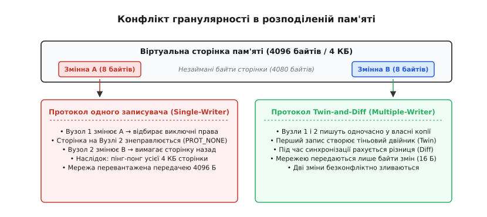
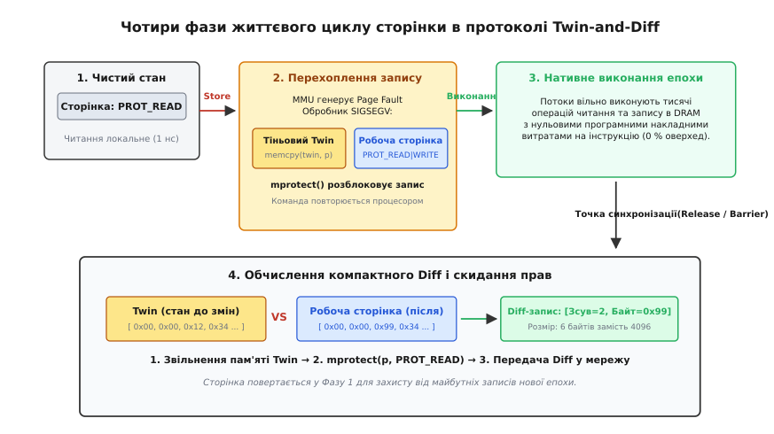
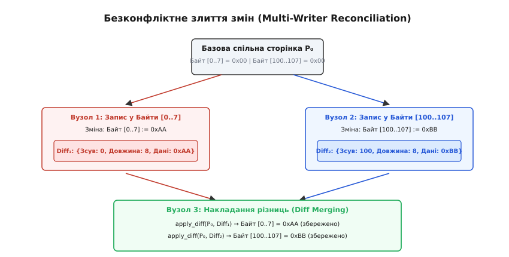
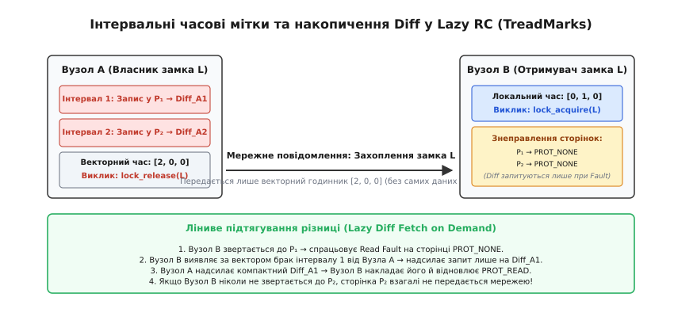

# Software DSM та механізм Twin-and-Diff

<preknowlist>
- [Віртуальна пам'ять](topic:hw-arch/virtual-memory) — як сторінкова трансляція та блок MMU керують правами доступу до сторінок пам'яті.
- [Когерентність кешів](topic:hw-arch/cache-coherence) — як апаратні протоколи інвалідації та оновлення синхронізують локальні копії даних.
- [Хибне спільне використання кеш-лінії](topic:hw-arch/false-sharing) — чому зміна незалежних змінних в одній неподільній одиниці пам'яті паралізує паралельні вузли.
- [Розподілена спільна пам'ять](topic:sf-distributed/distributed-shared-memory) — принципи побудови логічно єдиного адресного простору над фізично розділеними серверами.
- [Системний виклик](topic:hw-arch/system-call) — механізм переходу в ядро ОС для перехоплення сигналів і зміни атрибутів захисту пам'яті.
- [Бар'єри пам'яті](topic:hw-arch/memory-barrier-instructions) — точки впорядкування доступу до пам'яті та синхронізації паралельних потоків.
- [SIMD і векторизація](topic:hw-arch/simd-vectorization) — обробка декількох слів пам'яті за одну інструкцію векторного регістра.
</preknowlist>

Коли два обчислювальні вузли на 16-серверному кластері паралельно обробляють суміжні поля однієї великої матриці й записують 8-байтні числа у змінні `matrix[12]` та `matrix[13]`, ці два незалежні числа потрапляють у межі однієї 4096-байтної віртуальної сторінки пам'яті. У класичному протоколі розподіленої спільної пам'яті з одним записувачем перший вузол відбирає виключні права, надсилає мережний запит на знеправлення копії другого вузла через виклик `mprotect(PROT_NONE)` і блокує роботу сусіда. За чверть мікросекунди другий вузол намагається записати своє 8-байтне значення, стикається з апаратним збоєм захисту, змушує систему передати всі 4096 байтів назад через мережу Ethernet із затримкою у 50 мікросекунд і забирає сторінку собі. Обидва сервери витрачають 99.9% процесорного часу не на обчислення, а на безперервне перекидання кілобайтів пам'яті туди й назад через мережні дроти.

Цей катастрофічний ефект — сторінковий пінг-понг унаслідок хибного спільного використання — виникає через фундаментальний розрив між апаратним та програмним рівнями: апаратний блок керування пам'яттю (MMU, англ. *Memory Management Unit*) оперує блоками по 4096 байтів (або 16–64 КБ у сучасних архітектурах), тоді як команди процесора оперують словами розміром від одного до восьми байтів. Щоб подолати цей глухий кут, програмна розподілена пам'ять (Software DSM, англ. *Distributed Shared Memory*) перейшла від протоколів одного записувача до протоколів множинних записувачів, серцем яких став витончений механізм **Twin-and-Diff** (від англ. *twin* — «двійник, тіньова копія» та *diff* / *difference* — «різниця, журнал змін»).


*Конфлікт гранулярності в розподіленій пам'яті. Сторінка розміром 4096 байтів містить незалежні змінні двох вузлів. Протокол одного записувача паралізує роботу через пінг-понг усієї сторінки, тоді як механізм Twin-and-Diff дозволяє паралельний запис з обміном виключно модифікованими байтами.*

Детальний аналіз історичної еволюції систем розподіленої пам'яті від найпершої платформи IVY до революційних систем Munin і TreadMarks наведено у статті про [історію появи протоколів множинних записувачів у системах Munin та TreadMarks](topic:sf-distributed/software-dsm-twin-diff/hist-origins-munin-treadmarks.md).

## Чому апаратна модель когерентності руйнує мережний стек

У симетричних багатоядерних процесорах (SMP) апаратні протоколи когерентності кешів сімейства MESI працюють за принципом одного записувача: ядро, яке бажає записати значення, повинно отримати лінію кешу (типово 64 байти) у виключний стан `Modified` (`M`) або `Exclusive` (`E`), надіславши сигнал інвалідації через внутрішньокристальну шину. На кремнії це займає 10–20 наносекунд.

Спроба перенести цю саму логіку на рівень мережного кластера через системні сторінки віртуальної пам'яті породжує три нездоланні перешкоди:

1. **Мережна затримка:** Час проходження пакета через мережний комутатор, мережні адаптери (NIC) і стек протоколів операційної системи становить від 10 до 100 мікросекунд, що на три-чотири порядки довше за звернення до локальної оперативної пам'яті DRAM (60–80 наносекунд).
2. **Надмірний обсяг передачі:** Якщо потік змінює один 4-байтний прапорець статусу, протокол змушений надсилати всю 4096-байтну сторінку. Коефіцієнт корисного використання пропускної здатності каналу становить менше ніж 0.1%.
3. **Хибне спільне використання (False Sharing):** Ймовірність того, що дві абсолютно незалежні змінні різних потоків опиняться в межах одного 64-байтного рядка кешу, помірна. Але ймовірність того, що вони потраплять у межі 4096-байтного вікна віртуальної пам'яті, зростає у 64 рази.

Якщо два вузли одночасно пишуть у різні ділянки однієї сторінки, послідовна узгодженість (Sequential Consistency) вимагає миттєвої глобальної серіалізації кожного запису. Програма зупиняється, і продуктивність кластера падає нижче за продуктивність одного комп'ютера.

Вихід із цієї кризи вимагав двох взаємопов'язаних рішень: по-перше, послабити модель узгодженості пам'яті, дозволивши розбіжність локальних копій між точками синхронізації; по-друге, розробити алгоритм, який дозволяє кільком вузлам одночасно писати в одну й ту саму сторінку без перехоплення кожного запису компілятором.

## Послаблена узгодженість як фундамент множинного запису

У моделі узгодженості за звільненням (Release Consistency, RC) операції доступу до пам'яті поділяються на звичайні читання/записи та спеціальні операції синхронізації: захоплення замка (`Acquire`) та звільнення замка (`Release`).

Головний інваріант моделі: **зміни пам'яті, виконані вузлом A, не зобов'язані бути видимими вузлу B миттєво**. Вони повинні стати видимими для вузла B лише тоді, коли вузол B успішно виконає операцію `Acquire` над тим самим замком, який вузол A відпустив через `Release`, або коли обидва вузли пройдуть спільний бар'єр синхронізації (`Barrier`).

Проміжок між двома операціями синхронізації утворює незалежну **епоху виконання** (або часовий інтервал). Під час цієї епохи:
- Вузол 1 може вільно модифікувати початок сторінки (байти 0..63).
- Вузол 2 може одночасно модифікувати кінець тієї самої сторінки (байти 4000..4095).
- Жоден вузол не надсилає жодних повідомлень знеправлення в мережу під час виконання окремих інструкцій запису.

Коли епоха добігає кінця, середовище виконання DSM повинно з'ясувати: які саме байти всередині 4096-байтної сторінки були змінені локальним вузлом, сформувати компактний список модифікацій і передати його іншим вузлам. Але як операційна система може дізнатися точні байти змін, якщо процесор виконував звичайні апаратні інструкції `mov [rax], rbx` безпосередньо в кремнії, оминаючи будь-які програмні обгортки?

Саме це завдання розв'язує механізм **Twin-and-Diff**.

## Анатомія механізму Twin-and-Diff: чотири фази життя сторінки

Механізм Twin-and-Diff поєднує можливості апаратного блоку керування пам'яттю (MMU) процесора з швидким двійковим аналізом пам'яті на межах епох синхронізації.


*Послідовність станів сторінки у протоколі Twin-and-Diff. (1) Сторінка перебуває в режимі PROT_READ; (2) Перший запис викликає Page Fault, створюється тіньовий двійник Twin і надаються повні права; (3) Усі наступні записи відбуваються нативно на швидкості пам'яті; (4) У точці синхронізації сторінка порівнюється з двійником, формується журнал Diff, права скидаються до PROT_READ.*

Життєвий цикл кожної спільної сторінки під час епохи обчислень розгортається у чотири послідовні фази:

### 1. Початковий стан захисту від запису (Clean Read-Only)
На початку епохи всі спільні сторінки пам'яті, які вузол має у своїй локальній оперативній пам'яті, захищаються від запису за допомогою системного виклику:
```
mprotect(page_address, PAGE_SIZE, PROT_READ)
```
Будь-яка команда читання виконується процесором за 1 наносекунду без жодного втручання ядра операційної системи чи середовища DSM.

### 2. Перехоплення першого запису та створення двійника (Write Fault & Twin Allocation)
Коли потік програми вперше намагається виконати машинну інструкцію запису за адресою всередині захищеної сторінки, процесор виявляє відсутність біта запису (`W`) у дескрипторі таблиці сторінок і генерує апаратне виключення Page Fault (#PF, переривання 14 в архітектурі x86-64).

Ядро операційної системи перехоплює це виключення й надсилає процесу сигнал порушення захисту пам'яті `SIGSEGV`. Зареєстрований середовищем DSM обробник сигналу виконує такі критичні кроки:

1. **Ідентифікація сторінки:** Зі структури `siginfo_t` витягується точна адреса пам'яті `si_addr`, яка спричинила збій, і обчислюється базова адреса 4096-байтної сторінки:
```
page_base = (uintptr_t)info->si_addr & ~(PAGE_SIZE - 1);
```
2. **Створення тіньового двійника (Twin):** Середовище DSM виділяє буфер пам'яті розміром 4096 байтів зі спеціального попередньо виділеного пулу й виконує побайтове копіювання поточного чистого стану сторінки:
```
memcpy(twin_buffer, (void*)page_base, PAGE_SIZE);
```
Цей двійник фіксує еталонний знімок даних сторінки на момент початку локальних модифікацій.
3. **Розблокування сторінки:** Обробник відкриває повні права на читання та запис для робочої сторінки:
```
mprotect((void*)page_base, PAGE_SIZE, PROT_READ | PROT_WRITE);
```
4. **Реєстрація у списку «брудних» сторінок:** Вказівник на сторінку та її двійник додаються до локального списку сторінок, змінених у поточній епосі.
5. **Прозоре повернення:** Обробник сигналу завершує роботу. Ядро ОС відновлює контекст процесора й повертає керування на ту саму інструкцію запису, яка викликала збій.

### 3. Нативне виконання епохи (Zero-Overhead Hardware Execution)
Оскільки в таблиці сторінок встановлено права `PROT_READ | PROT_WRITE`, процесор повторно виконує перервану інструкцію запису — цього разу абсолютно успішно й без затримок.

Усі наступні операції читання та запису в цю сторінку (тисячі чи мільйони ітерацій циклу) виконуються процесором безпосередньо в локальній пам'яті DDR на швидкості кремнію. Не відбувається жодних системних викликів, сигналів чи звернень до мережі. Програмний накладний оверхед на виконання окремих інструкцій дорівнює нулю.

### 4. Генерація різниці та скидання прав на межі епохи (Diff Computation)
Коли потік досягає точки синхронізації (викликає `lock_release` або `barrier_wait`), середовище DSM ініціює процедуру генерації різниці (Diff) для всіх сторінок, зареєстрованих у списку брудних:

1. **Порівняння слів:** Робоча сторінка, яка зазнала модифікацій, побайтово або пословно (64-бітними словами) порівнюється з її двійником `twin`.
2. **Кодування журналу змін:** Усі розбіжності між сторінкою та двійником кодуються у компактну послідовність неперервних діапазонів модифікованих байтів:
```
[Зсув від початку сторінки (2 байти)] + [Довжина зміни (2 байти)] + [Самі байти нових даних]
```
3. **Знищення двійника:** Пам'ять двійника `twin` звільняється або повертається в пул повторного використання.
4. **Скидання захисту:** Робоча сторінка знову переводиться у стан лише для читання:
```
mprotect((void*)page_base, PAGE_SIZE, PROT_READ);
```
5. **Розсилка або збереження Diff:** Сформований журнал Diff передається іншим вузлам мережі або зберігається в локальному журналі інтервалів для лінивого надсилання за запитом.

Повний працюючий код середовища перехоплення сторінкових сигналів, керування пулом двійників і генерації журналів різниці наведено у вставці про [повну практичну реалізацію рушія Twin-and-Diff](topic:sf-distributed/software-dsm-twin-diff/proj-diff-engine.md).

## Алгоритм обчислення різниці: від наївного циклу до SIMD-сканування

Швидкість обчислення різниці безпосередньо впливає на час проходження бар'єрів синхронізації.

У наївному побайтовому варіанті функція порівняння перевіряє 4096 ітерацій циклу. Якщо змінено лише одне число, побайтовий перебір виконує 4096 порівнянь байтів і 4096 умовних переходів, створюючи навантаження на конвеєр процесора.

Оптимальна реалізація розбиває сторінку на 64-бітні слова (`uint64_t`, 512 слів на 4 КБ сторінку). Більшість сторінок містять локалізовані зміни, тому переважна більшість слів збігаються з двійником (`p64[i] == t64[i]`). Перевірка цілого 64-бітного слова виконується за один такт ALU, що дозволяє миттєво пропускати незмінені 8-байтні ділянки.

:::tabs
```c
#include <stdint.h>
#include <stddef.h>
#include <string.h>

#define PAGE_SIZE 4096

typedef struct {
    uint16_t offset;
    uint16_t length;
} DiffHeader;

size_t generate_page_diff(const uint8_t *page, const uint8_t *twin, uint8_t *diff_out) {
    const uint64_t *p64 = (const uint64_t*)page;
    const uint64_t *t64 = (const uint64_t*)twin;
    size_t num_words = PAGE_SIZE / sizeof(uint64_t);
    size_t out_idx = 0;
    size_t i = 0;

    while (i < num_words) {
        /* Швидкий пропуск незмінених 64-бітних слів */
        if (p64[i] == t64[i]) {
            i++;
            continue;
        }

        /* Знайдено змінене слово: визначаємо межі неперервного блоку змін */
        size_t start_byte = i * sizeof(uint64_t);
        while (start_byte < PAGE_SIZE && page[start_byte] == twin[start_byte]) {
            start_byte++;
        }

        size_t end_byte = (i + 1) * sizeof(uint64_t);
        if (end_byte > PAGE_SIZE) end_byte = PAGE_SIZE;

        /* Розширюємо кінець блоку змін вперед */
        while (end_byte < PAGE_SIZE && page[end_byte] != twin[end_byte]) {
            end_byte++;
        }

        size_t run_len = end_byte - start_byte;

        /* Записуємо дескриптор: зсув, довжина та байти даних */
        DiffHeader hdr;
        hdr.offset = (uint16_t)start_byte;
        hdr.length = (uint16_t)run_len;

        memcpy(&diff_out[out_idx], &hdr, sizeof(DiffHeader));
        out_idx += sizeof(DiffHeader);

        memcpy(&diff_out[out_idx], &page[start_byte], run_len);
        out_idx += run_len;

        i = end_byte / sizeof(uint64_t) + 1;
    }

    return out_idx; /* Повертає загальний розмір згенерованого Diff-пакета в байтах */
}
```
```cpp
#include <cstdint>
#include <cstddef>
#include <cstring>
#include <span>
#include <vector>

constexpr size_t PageSize = 4096;

struct DiffSegment {
    uint16_t offset{0};
    std::vector<std::byte> payload;
};

class DiffGenerator {
public:
    static std::vector<DiffSegment> compute(std::span<const std::byte, PageSize> page,
                                           std::span<const std::byte, PageSize> twin) noexcept {
        std::vector<DiffSegment> segments;
        const auto* p64 = reinterpret_cast<const uint64_t*>(page.data());
        const auto* t64 = reinterpret_cast<const uint64_t*>(twin.data());
        constexpr size_t numWords = PageSize / sizeof(uint64_t);

        size_t i = 0;
        while (i < numWords) {
            if (p64[i] == t64[i]) {
                ++i;
                continue;
            }

            size_t startByte = i * sizeof(uint64_t);
            while (startByte < PageSize && page[startByte] == twin[startByte]) {
                ++startByte;
            }

            size_t endByte = (i + 1) * sizeof(uint64_t);
            if (endByte > PageSize) endByte = PageSize;

            while (endByte < PageSize && page[endByte] != twin[endByte]) {
                ++endByte;
            }

            size_t runLen = endByte - startByte;
            DiffSegment seg;
            seg.offset = static_cast<uint16_t>(startByte);
            seg.payload.resize(runLen);
            std::memcpy(seg.payload.data(), page.data() + startByte, runLen);

            segments.push_back(std::move(seg));
            i = (endByte / sizeof(uint64_t)) + 1;
        }

        return segments;
    }
};
```
:::

У високопродуктивних реалізаціях порівняння прискорюють за допомогою векторних інструкцій SIMD (AVX2 або AVX-512). Інструкція `_mm256_cmpeq_epi8` порівнює 32 байти робочої сторінки та двійника за один такт процесора, генеруючи 32-бітну бітову маску через `_mm256_movemask_epi8`. Якщо маска дорівнює `0xFFFFFFFF`, усі 32 байти ідентичні й пропускаються миттєво. Вся 4096-байтна сторінка перевіряється всього за 128 векторних операцій, що займає менше ніж 0.3 мікросекунди на сучасному процесорі.

## Безконфліктне злиття паралельних різниць (Diff Merging)

Головна перевага передачі відмінностей (Diff) над передачею цілих сторінок полягає у **комутативності операції накладання неперетинних різниць**.

Нехай на початку епохи вузли 1, 2 і 3 мали ідентичну копію сторінки `P₀`.
- Вузол 1 змінив байти зсуву `[0..7]` на значення `0xAA` і згенерував різницю `Δ₁`.
- Вузол 2 одночасно змінив байти зсуву `[100..107]` на значення `0xBB` і згенерував різницю `Δ₂`.

Коли настає час синхронізації, вузол 3 (або координатор бар'єра) отримує обидва пакети `Δ₁` та `Δ₂`.


*Безконфліктне злиття змін. Вузли 1 і 2 паралельно модифікують неперетинні діапазони тієї самої 4 КБ сторінки. Вузол 3 послідовно застосовує diff-пакети до своєї базової копії, отримуючи коректний об'єднаний стан без втрати жодного запису.*

Функція накладання різниці на базову сторінку визначається через копіювання байтів за зсувом:
```
apply_diff(page, diff) = memcpy(page + diff.offset, diff.data, diff.length)
```

Оскільки зміщені діапазони `Δ₁` та `Δ₂` не перетинаються (`[0..7] ∩ [100..107] = ∅`), результат накладання не залежить від порядку отримання повідомлень:

```
apply_diff(apply_diff(P₀, Δ₁), Δ₂)
= apply_diff(apply_diff(P₀, Δ₂), Δ₁)        [комутативність неперетинних діапазонів]
= P_merged                                  [фінальний узгоджений стан сторінки]
```

Обидві паралельні модифікації успішно об'єднуються на всіх вузлах кластера без єдиного блокування та без сторінкового пінг-понгу.

### Що відбувається при справжніх конфліктах запису (Data Race)?
Що станеться, якщо вузол 1 і вузол 2 одночасно запишуть різні значення в один і той самий байт сторінки (наприклад, обидва запишуть у `matrix[12]`) без використання м'ютексів чи замків?

У моделі Release Consistency така ситуація класифікується як **стан гонитви за даними** (Data Race). За формальним контрактом пам'яті (Data-Race-Free-0 / DRF), якщо програма містить гонитву за даними без явного впорядкування через примітиви синхронізації, результат її виконання є невизначеним.

Середовище DSM накладе різниці в довільному порядку надходження або за часовою міткою, і один із записів перезапише інший. Це не є помилкою протоколу Twin-and-Diff: у коректній паралельній програмі будь-який доступ до спільної змінної, яка змінюється кількома потоками, зобов'язаний бути захищений замком або бар'єром.

## Лінива передача різниць та накопичення в ланцюжки (Lazy RC)

У ранніх реалізаціях Multiple-Writer протоколів (як-от Munin з моделлю *Eager Release Consistency*) обчислені Diff-пакети негайно розсилалися широкомовними повідомленнями всім вузлам кластера в момент виклику `Release`.

Це створювало надмірне мережне навантаження: якщо вузол B ніколи в майбутньому не звернеться до сторінки `P₁`, надсилання йому різниці `Δ₁` було марною витратою трафіку.

Система **TreadMarks** зробила наступний концептуальний крок, об'єднавши механізм Twin-and-Diff з моделлю **лінивої узгодженості за звільненням** (Lazy Release Consistency, LRC).


*Інтервальні векторні позначки та ліниве підтягування Diff у Lazy RC. При відпусканні замка вузол A передає лише векторний час. Вузол B знеправляє сторінки й надсилає запит на отримання компактного Diff лише тоді, коли звертається до конкретної адреси.*

У Lazy RC передача даних працює за таким принципом:

1. **Інтервальні часові мітки:** Час розбивається на інтервали, які індексуються векторними годинниками (Vector Clocks).
2. **Нульова передача даних при Release:** Коли вузол A відпускає замок, він взагалі не надсилає Diff-пакети. Він лише зберігає створені різниці у своїй локальній структурі даних і передає новому власникові замка (вузлу B) свій векторний час.
3. **Локальне знеправлення:** Вузол B, побачивши за векторним часом, що вузол A виконав зміни в сторінках `P₁` та `P₂`, не завантажує їх із мережі. Він лише скидає локальні права цих сторінок у `PROT_NONE` (Invalid).
4. **Запит різниці за вимогою (On-Demand Fault):** Коли потік на вузлі B намагається прочитати змінну на сторінці `P₁`, спрацьовує Read Fault. Середовище DSM бачить, що на цій сторінці бракує змін від інтервалу вузла A, надсилає вузлу A запит саме на `Δ_A1`, отримує компактні кілька байтів, накладає їх на свою копію сторінки, переводить її в `PROT_READ` і продовжує роботу.

Якщо вузол B протягом усієї своєї роботи жодного разу не торкнеться сторінки `P₂`, різниця `Δ_A2` ніколи не перетне мережні кабелі, заощаджуючи пропускну здатність каналу.

### Накопичення різниць у ланцюжки (Diff Chains) та збирання сміття
Якщо сторінка змінюється декількома вузлами протягом кількох епох поспіль без повної інвалідації, для неї формується впорядкований список відмінностей — **ланцюжок Diff** (`Δ₁ → Δ₂ → Δ₃ ...`).

Коли віддалений вузол, чия базова сторінка відстала на кілька епох, нарешті звертається до пам'яті, він може завантажити всі накопичені різниці й накласти їх послідовно.

Проте нескінченне зростання ланцюжків Diff створює дві проблеми: вичерпання оперативної пам'яті на збереження старих різниць і зростання часу накладання багатьох дрібних змін.

Для розв'язання цієї проблеми середовище DSM реалізує періодичне **збирання сміття та консолідацію сторінок** (Full Page Consolidation / Garbage Collection):
- Коли довжина ланцюжка різниць перевищує поріг або загальний розмір різниць наближається до 4096 байтів, координатор застосовує всі накопичені `Δ` до базової сторінки, створюючи новий чистий еталон `P_clean`.
- Усі старі двійники та дескриптори Diff видаляються з пам'яті.
- Вузлам розсилається повідомлення про те, що еталон оновлено, і наступні запити повертатимуть чисту сторінку `P_clean` замість довгого ланцюжка.

## Порівняльний аналіз витрат: коли Twin-and-Diff перемагає

Чи завжди створення двійника та обчислення різниці є найшвидшим рішенням?

Щоб відповісти на це питання, зіставимо часові компоненти обробки змін:

1. **Накладні витрати створення Twin:**
   - Сигнал ОС `SIGSEGV` та перемикання контексту: приблизно 1.5–2.5 мкс.
   - Копіювання 4096 байтів у пам'яті (`memcpy`): приблизно 0.2 мкс.
   - Системний виклик `mprotect(PROT_READ | PROT_WRITE)`: приблизно 0.8–1.5 мкс.
   - Сумарний оверхед першого запису `T_fault` становить приблизно 2.5–4.2 мкс.

2. **Накладні витрати обчислення Diff:**
   - Сканування 4096 байтів (512 64-бітних слів): приблизно 0.3–0.6 мкс.
   - Формування пакетів: приблизно 0.1 мкс.
   - Сумарний оверхед `T_diff` становить приблизно 0.4–0.7 мкс.

3. **Мережна затримка передачі:**
   - Передача повного 4 КБ кадру через Gigabit/10G Ethernet з урахуванням заголовків і часу обороту (RTT): приблизно 30–80 мкс.
   - Передача компактного 32-байтного Diff-пакета: приблизно 10–25 мкс (або частки мікросекунди в мережах RDMA/InfiniBand).

Порівняння показує: сумарні витрати на виділення двійника та програмне обчислення різниці (`T_fault + T_diff ≈ 3–5 мкс`) у десятки разів менші за мережну затримку повторного перекидання 4-кілобайтної сторінки між серверами (50–100 мкс).

Повні математичні формули розрахунку коефіцієнтів компресії трафіку, ймовірності хибного спільного використання та точки беззбитковості алгоритму наведено у статті про [математичну модель мережного трафіку та аналіз точки беззбитковості](topic:sf-distributed/software-dsm-twin-diff/math-traffic-and-overhead.md).

Повний опис програмного інтерфейсу та сигнатур функцій для інтеграції механізму Twin-and-Diff у призначені для користувача бібліотеки наведено у статті про [специфікацію програмного інтерфейсу середовища виконання DSM](topic:sf-distributed/software-dsm-twin-diff/api-dsm-runtime.md).

## Еволюція та сучасні апаратні альтернативи

Хоча класичний механізм Twin-and-Diff створювався в епоху UNIX-систем на базі сигналів `SIGSEGV` та викликів `mprotect`, його фундаментальні ідеї отримали розвиток у сучасному системному програмуванні:

- **Linux `userfaultfd`:** Сучасне ядро Linux надає системний інтерфейс `userfaultfd` з прапорцем `UFFDIO_WRITEPROTECT`. Замість повільного переривання через сигнал `SIGSEGV`, збій захисту сторінки обробляється через неблокуючий файловий дескриптор у спеціальному потоці обробки, що зменшує накладні витрати перехоплення запису в 3–5 разів.
- **Відстеження «брудних» сторінок через Soft-Dirty Bits:** Ядро Linux підтримує механізм відстеження модифікацій пам'яті через прапорці в `/proc/self/pagemap` та `/proc/self/clear_refs`. Це дозволяє фіксувати модифіковані сторінки безпосередньо апаратними бітами dirty-bit у таблицях сторінок процесора (PTE), оминаючи `mprotect`.
- **RDMA (Remote Direct Memory Access):** Сучасні мережні адаптери InfiniBand та RoCE здатні виконувати пряме читання та запис у пам'ять віддаленого сервера за 1–2 мікросекунди без участі центрального процесора віддаленого вузла. У таких надшвидких мережах накладні витрати на обчислення програмних Diff іноді можуть зрівнятися з прямою передачею сторінки, тому гібридні сучасні DSM-системи адаптивно обирають між передачею Diff та прямою атомарною RDMA-модифікацією.

> 🔧 **Навіщо це.**
> 
> Принцип Twin-and-Diff виходить далеко за межі академічних розподілених систем 90-х років і є базовим патерном у сучасній інфраструктурі:
> 
> 1. **Жива міграція віртуальних машин (QEMU/KVM Live Migration):** Під час перенесення працюючої віртуальної машини з одного фізичного сервера на інший гіпервізор фіксує початковий стан RAM, захищає сторінки гостя від запису й копіює тільки дельти (Diff) сторінок, змінених гостьовою ОС під час передачі, зводячи час зупинки сервісу до кількох мілісекунд.
> 2. **Розподілені бази даних та дельта-стан CRDT:** Системи реплікації без конфліктів передають не весь документ чи стан таблиці, а компактні бінарні дельти змін (Delta-State Replicated Data Types), об'єднуючи паралельні редагування за тими самими математичними правилами комутативного злиття.
> 3. **Знімки пам'яті та транзакційні рушії (Memory Snapshots / CoW):** СУБД у пам'яті (in-memory databases) використовують тіньові копії сторінок для підтримки ізоляції транзакцій Snapshot Isolation (MVCC), де двійник гарантує узгоджене читання минулого стану без блокування пишучих потоків.
