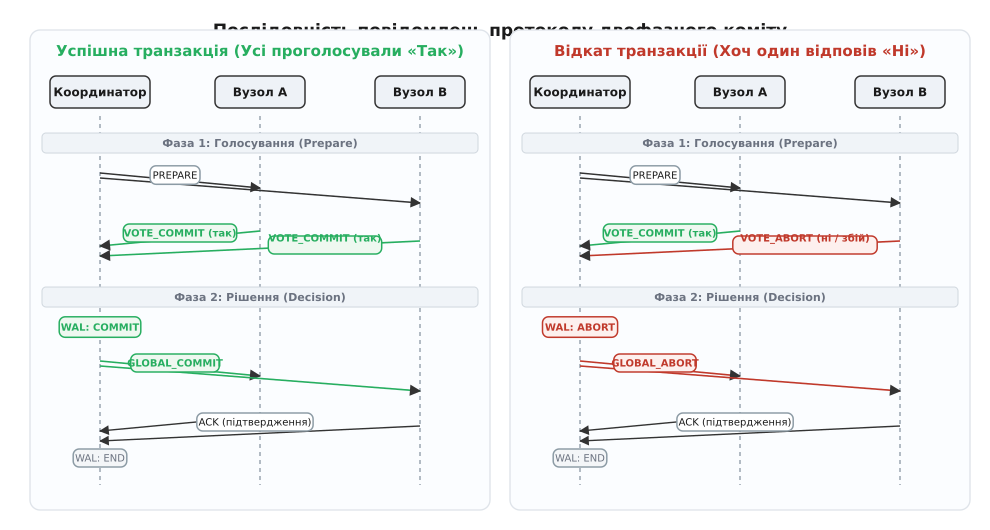
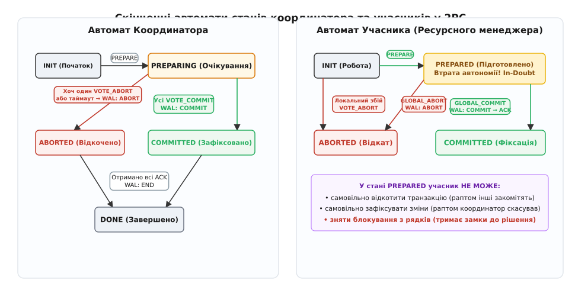
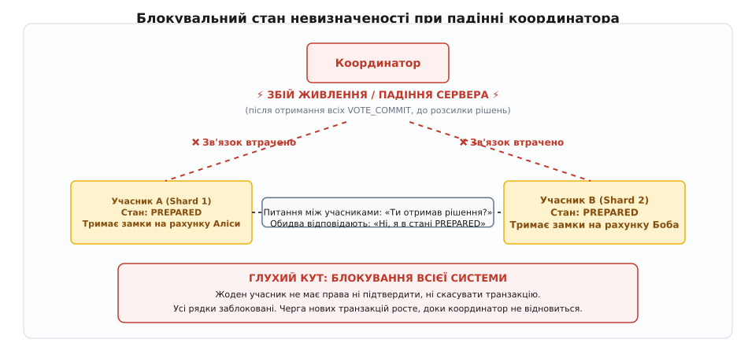
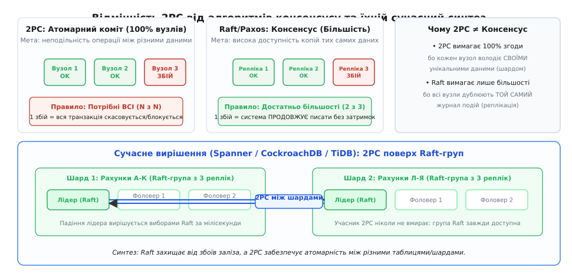

# Двофазний коміт (2PC) та розподілені транзакції

<preknowlist>
- [Задача консенсусу](root:sf-distributed/consensus-problem) — домовленість між незалежними вузлами за наявності відмов та затримок у мережі.
- [Raft](root:sf-distributed/raft) — консенсусний протокол на основі виділеного лідера та реплікованого журналу подій.
- [Годинники Лампорта](root:sf-distributed/lamport-clocks) — логічний час для часткового впорядкування подій у розподіленій системі.
- [Безконфліктні типи даних (CRDT)](root:sf-distributed/crdt) — реплікація з кінцевою узгодженістю без блокувальних протоколів.
</preknowlist>

Користувач ініціює банківський переказ на суму `100` доларів: списати кошти з рахунку Аліси на сервері в Нью-Йорку (шард A) і зарахувати їх на рахунок Боба на сервері у Франкфурті (шард B). Сервер A успішно зменшує баланс Аліси й фіксує операцію на локальному диску. Але в ту саму мілісекунду трансатлантичний магістральний кабель зазнає обриву, або на сервері B вибиває блок живлення ще до того, як туди дійшов мережевий пакет із командою зарахування. Гроші зникли з рахунку Аліси, проте так і не з'явилися в Боба: сума в `100` доларів безслідно розчинилася між континентами. Якби сервер B встиг зарахувати кошти, а сервер A впав через нестачу коштів на рахунку, гроші навпаки виникли б із нічого.

Цей приклад ілюструє фундаментальну проблему розподілених обчислень: як гарантувати неподільність бізнес-операції (атомарність; лат. *atomus* — неподільний), коли дані фізично розташовані на різних обчислювальних вузлах, розділених ненадійною мережею без спільної оперативної пам'яті та без єдиного апаратного тактового генератора.

В окремій базі даних на єдиному сервері атомарність досягається просто: система пише зміни в локальний журнал випереджального запису (англ. *Write-Ahead Log*, WAL) і в момент фіксації змінює єдиний вказівник у заголовку журналу на диску. Але коли в транзакції беруть участь кілька автономних серверів, жоден окремий вузол не має фізичної змоги атомарно змінити стан на інших машинах. Потрібен спеціальний протокол розподіленого атомарного коміту.

## Чому наївні рішення гарантують розрив узгодженості

Спроби розв'язати проблему координації наївними засобами неминуче розбиваються об асинхронну природу мережі та випадкові відмови обладнання.

**«Послідовна фіксація клієнтом».** Клієнтська програма спочатку надсилає команду `COMMIT` серверу A, чекає підтвердження, а потім надсилає `COMMIT` серверу B. Якщо клієнтський процес зазнає аварійної зупинки (збій операційної системи, перезавантаження контейнера, відключення зв'язку) рівно між першим і другим викликом, сервер A зафіксував списання, а сервер B ніколи не дізнається про необхідність зарахування. Система назавжди зависає в розірваному стані.

**«Опитування перед виконанням без блокувань».** Клієнт запитує сервер A і сервер B: «Чи готові ви виконати транзакцію?». Обидва відповідають «Так». Після цього клієнт розсилає команду `COMMIT`. Але між моментом, коли сервер B сказав «Так», і моментом, коли до нього дійшла команда фіксації, на ньому може статися апаратний збій, переповнення диска або паралельна транзакція може захопити потрібні кошти. Відповідь «Так», дана без фіксації ресурсів на диску, ні до чого не зобов'язує і не гарантує успіху в майбутньому.

Проблема розподіленого коміту (англ. *Atomic Commit Problem*, ACP) полягає в тому, що всі вузли-учасники зобов'язані прийти до **абсолютно ідентичного термінального рішення**: або абсолютно всі фіксують транзакцію (`COMMIT`), або абсолютно всі скасовують її (`ABORT`). Якщо хоча б один вузол не здатен виконати свою частину роботи, вся транзакція має бути скасована скрізь без винятку.

Історичні передумови появи таких механізмів, шлях створення перших транзакційних систем у 1970-х роках під керівництвом Джима Грея та становлення промислового стандарту детально висвітлені окремо — [як банківські катастрофи та збої мейнфреймів породили двофазний коміт](root:sf-distributed/two-phase-commit/hist-two-phase-commit.md).

## Анатомія протоколу: дві фази та втрата автономії

Класичним алгоритмічним вирішенням цієї задачі є **протокол двофазного коміту** (англ. *Two-Phase Commit*, 2PC). Протокол чітко розмежовує ролі в системі:
* **Координатор (Transaction Coordinator / Transaction Manager):** вузол або процес, який керує ходом транзакції, опитує учасників і ухвалює глобальне рішення.
* **Учасники (Participants / Resource Managers):** сервери баз даних або шарди, на яких зберігаються безпосередні дані і які виконують локальні операції читання та запису.

*Послідовність повідомлень у 2PC: підготовка (фаза 1) перевіряє можливість виконання, а рішення (фаза 2) транслює остаточний вердикт.*

### Фаза 1: Голосування та підготовка (Voting / Prepare Phase)

1. Коли клієнтська програма завершує формування транзакції, вона викликає команду завершення у координатора.
2. Координатор надсилає службове повідомлення `PREPARE` («Приготуватися») усім учасникам транзакції.
3. Отримавши `PREPARE`, кожен учасник виконує повну локальну перевірку:
   - перевіряє бізнес-правила та обмеження цілісності (наявність коштів, унікальність ключів, зовнішні ключі);
   - захоплює необхідні блокування рядків або таблиць у пам'яті за протоколом строгого двофазного блокування (Strict Two-Phase Locking, S2PL), щоб захистити дані від паралельних транзакцій;
   - генерує всі необхідні записи скасування (undo) та повторення (redo) операції;
   - **скидає свій стан у локальний WAL-журнал на диску** за допомогою системного виклику `fsync()`.
4. Якщо всі перевірки успішні й стан зафіксовано на диску, учасник відправляє координатору відповідь `VOTE_COMMIT` (голос «Так»).
5. Якщо сталася будь-яка локальна помилка або брак ресурсів, учасник локально відкочує транзакцію, звільняє пам'ять і відправляє координатору `VOTE_ABORT` (голос «Ні»).

> ⚠️ **Втрата автономії учасника:** відправляючи голос `VOTE_COMMIT`, учасник публічно й безповоротно **відмовляється від права самостійно скасувати транзакцію**. Він входить у спеціальний стан підготовки — `PREPARED` (відомий також як стан невизначеності, *In-Doubt*). Учасник гарантує: навіть якщо через мікросекунду вимкнеться живлення, впаде ядро ОС або згорить накопичувач, після перезапуску вузол зможе виконати команду `COMMIT`, якщо її накаже координатор.

### Фаза 2: Ухвалення рішення та фіксація (Decision / Commit Phase)

1. Координатор збирає відповіді від усіх учасників:
   - **Успішний сценарій (All Yes):** якщо **абсолютно всі** учасники відповіли `VOTE_COMMIT`, координатор ухвалює глобальне рішення про фіксацію. Він записує запис `COMMIT` у свій власний журнал на диску (`fsync`), після чого розсилає всім учасникам команду `GLOBAL_COMMIT`.
   - **Сценарій відкату (Any No or Timeout):** якщо хоча б один учасник відповів `VOTE_ABORT` або не відповів протягом встановленого таймауту, координатор ухвалює рішення про скасування. Він записує `ABORT` у свій журнал і розсилає всім учасникам команду `GLOBAL_ABORT`.
2. Учасники, отримавши команду від координатора:
   - застосовують зміни до основного сховища або відкочують їх за журналом;
   - записують фінальний статус (`COMMITTED` або `ABORTED`) у свій дисковий журнал;
   - **знімають усі утримувані блокування з рядків**;
   - відправляють координатору підтвердження `ACK` (англ. *acknowledgment*).
3. Отримавши `ACK` від усіх учасників, координатор записує у свій журнал мітку завершення `END` (або `DONE`) і повертає клієнту успішний статус операції.

## Журналювання випереджального запису та оптимізації журналу

Ключовим елементом надійності 2PC є суворе журналювання кожного кроку (англ. *Write-Ahead Logging*, WAL). Жодне повідомлення протоколу не має права вийти в мережевий сокет доти, доки відповідний факт не опинився у фізичних секторах накопичувача.

*Скінченні автомати станів 2PC: координатор ухвалює рішення, а учасник переходить через стан втрати автономії PREPARED.*

Розглянемо точну послідовність дискових операцій:

1. **Координатор:** перед відправкою `PREPARE` записує в журнал запис `START_2PC` зі списком усіх вузлів-учасників.
2. **Учасник:** перед відправкою `VOTE_COMMIT` записує в журнал запис `PREPARED`. У цей момент журнал скидається на диск через `fsync()`.
3. **Точка неповернення (Commit Point):** коли координатор отримує всі голоси «Так», він робить дисковий запис `GLOBAL_COMMIT` і викликає `fsync()`. **Саме в момент завершення цього запису на диску координатора транзакція вважається офіційно зафіксованою.** Навіть якщо координатор миттєво згорить до того, як відправить хоча б одне повідомлення `GLOBAL_COMMIT` у мережу, транзакція вже не може бути відкочена: під час відновлення координатор вичитає свій журнал і доведе фіксацію до кінця.

### Оптимізації Presumed Abort та Presumed Commit

Класичний 2PC вимагає великої кількості синхронних операцій запису на диск (`fsync`) та мережевих підтверджень (`ACK`). Для зниження накладних витрат дослідники IBM розробили дві оптимізації:

* **Presumed Abort (презумпція відкату):** вважається стандартом де-факто в більшості сучасних СУБД. Згідно з цим правилом, якщо після аварії координатор або учасник знаходить транзакцію без фінального запису коміту, вона за замовчуванням вважається скасованою (`ABORT`). Це дозволяє координатору:
  1. Не скидати примусово журнал на диск при ухваленні рішення про відкат (`ABORT`).
  2. Не вимагати підтверджень `ACK` від учасників у разі скасування транзакції.
  3. Негайно видаляти інформацію про скасовану транзакцію з оперативної пам'яті.
* **Presumed Commit (презумпція коміту):** орієнтована на системи, де понад 99% транзакцій завершуються успішно. Координатор примусово записує список учасників на початку (`START`), але не записує фінальний запис `END` при успішному коміті й не чекає фінальних `ACK`. Якщо запис про транзакцію зникає з журналу — вважається, що вона була успішно зафіксована.

Практична реалізація цього рушія на мовах C та C++ із повною емуляцією мережевого обміну та збереженням бінарного журналу розібрана в матеріалі — [реалізація рушія двофазного коміту з журналюванням та відновленням після збоїв](root:sf-distributed/two-phase-commit/proj-two-phase-commit.md).

## Блокування та двофазне блокування (Distributed 2PL)

Розподілена транзакція вимагає узгодженості не лише при фіксації, а й під час паралельного виконання багатьох операцій. Для забезпечення ізоляції (рівень Serializable або Repeatable Read) застосовується **розподілене строге двофазне блокування** (Distributed Strict 2PL):

1. **Фаза росту (Growing Phase):** під час виконання SQL-запитів учасники захоплюють спільні замки читання (S-locks) та ексклюзивні замки запису (X-locks) на відповідні рядки даних.
2. **Фаза утримання (Holding Phase):** усі захоплені замки утримуються протягом усієї першої фази 2PC (голосування) та зберігаються у стані `PREPARED`.
3. **Фаза стиснення (Shrinking Phase):** усі замки одночасно знімаються **лише після того, як учасник отримав команду `GLOBAL_COMMIT` або `GLOBAL_ABORT`** і зафіксував свій локальний стан у WAL.

Якщо будь-який вузол зніме замки раніше (наприклад, одразу після відправки голосу `VOTE_COMMIT`), інша паралельна транзакція може прочитати або змінити проміжні дані. Якщо перша транзакція згодом буде скасована через відмову іншого шарда, система отримає аномалію «брудного читання» (dirty read) або каскадний відкат (cascading abort), що неприпустимо.

### Проблема розподілених взаємоблокувань (Distributed Deadlocks)

Поєднання 2PC та двофазного блокування створює ризик **розподілених дедлоків** (взаємоблокувань). Уявімо дві паралельні транзакції $T_1$ та $T_2$:
* Транзакція $T_1$ захопила рядок на Шарді 1 і чекає на блокування рядка на Шарді 2.
* Транзакція $T_2$ захопила той самий рядок на Шарді 2 і чекає на блокування рядка на Шарді 1.

Жоден локальний менеджер блокувань на Шарді 1 чи Шарді 2 не бачить повного графа очікувань (Wait-For Graph), оскільки цикл очікувань замикається через мережу. Для виявлення розподілених дедлоків застосовують алгоритм зондування Чанді — Місри — Гааса (англ. *Chandy-Misra-Haas probe algorithm*) або централізований сервіс детекції дедлоків. Якщо виявлено цикл, одна з транзакцій примусово переривається координатором.

## Матриця поведінки при збоях у різних точках виконання

Щоб зрозуміти, як протокол 2PC витримує відмови обладнання, розглянемо повну матрицю можливих збоїв та алгоритмів відновлення:

| Точка виникнення збою | Поведінка системи | Алгоритм відновлення |
| :--- | :--- | :--- |
| **Координатор падає до розсилки `PREPARE`** | Учасники не отримали запит. Транзакція не розпочата. | Координатор після перезапуску скасовує транзакцію локально. Учасники нічого не знають. |
| **Учасник падає до отримання `PREPARE`** | Координатор не отримує відповідь за таймаутом. | Координатор ухвалює `GLOBAL_ABORT` і розсилає решті. Учасник після рестарту відкочує тимчасові дані. |
| **Учасник падає після відправки `VOTE_COMMIT`** | Учасник у стані `PREPARED`. Координатор ухвалює рішення. | Координатор надсилає рішення. Учасник після рестарту вичитує стан `PREPARED`, опитує координатора й застосовує рішення. |
| **Координатор падає після запису `COMMIT` у WAL, до розсилки** | Учасники зависають у стані `PREPARED` (In-Doubt). | Координатор після рестарту вичитує `COMMIT` із WAL і завершує розсилку `GLOBAL_COMMIT`. |
| **Координатор падає до запису `COMMIT` у WAL (під час збору голосів)** | Учасники чекають рішення за таймаутом. | За правилом Presumed Abort координатор після рестарту відкочує транзакцію та розсилає `GLOBAL_ABORT`. |

## Головний страх 2PC: блокувальна природа та стан невизначеності

Чому інженери з розподілених систем бояться класичного двофазного коміту? Відповідь полягає в одному слові: **блокування** (англ. *blocking protocol*).

У протоколі 2PC існує критичне часове вікно, у якому збій єдиного вузла (координатора) повністю паралізує роботу всієї системи без можливості автоматичного виходу.

*Падіння координатора після отримання голосів блокує учасників: вони не мають права ані зафіксувати, ані скасувати транзакцію самостійно.*

Уявімо послідовність подій:
1. Усі учасники успішно виконали підготовку, скинули WAL на диск, перейшли в стан `PREPARED` і відправили координатору `VOTE_COMMIT`.
2. Координатор отримав усі голоси, записав `COMMIT` у свій журнал, але перед тим, як надіслати хоча б один пакет у мережу, його сервер раптово втрачає живлення.
3. Учасники залишаються в стані `PREPARED`. Вони чекають рішення від координатора.

Що можуть зробити учасники після закінчення таймауту очікування?

* **Чи може учасник самостійно вирішити скасувати транзакцію (`ABORT`)?**
  **Ні, категорично заборонено.** Координатор міг встигнути відправити `GLOBAL_COMMIT` іншому учаснику до свого падіння. Якщо перший учасник відкотиться, а другий зафіксує зміни, система отримає катастрофічний розрив цілісності (порушення атомарності).
* **Чи може учасник самостійно вирішити зафіксувати транзакцію (`COMMIT`)?**
  **Ні, категорично заборонено.** Можливо, координатор насправді не отримав голос від якогось іншого учасника (або той проголосував `VOTE_ABORT`) і встиг прийняти рішення про скасування.

Учасники опиняються в пастці стану **In-Doubt** (стан невизначеності). Вони позбавлені автономії і змушені **нескінченно довго чекати оживання координатора**, утримуючи всі ексклюзивні замки на рядках бази даних.

### Каскадне блокування та параліч кластера

Поки транзакція висить у стані `PREPARED`:
1. Усі рядки таблиць, які брали участь у транзакції (наприклад, банківські рахунки, залишки товарів на складі, профілі користувачів), заблоковані на запис і читання.
2. Нові транзакції, які намагаються звернутися до цих самих рядків, стають у чергу очікування замків (lock queue).
3. Пул з'єднань з базою даних поступово заповнюється заблокованими потоками.
4. За лічені секунди вичерпуються всі доступні з'єднання та дескриптори сокетів.
5. Сервіс перестає відповідати на будь-які запити користувачів: падіння одного координатора призводить до повної зупинки всього розподіленого кластера.

Формальний математичний аналіз цього явища та доведення неможливості побудови неблокувального протоколу атомарного коміту в асинхронних мережах наведено у статті — [неможливість неблокувального атомарного коміту та теорема Скіна](root:sf-distributed/two-phase-commit/math-atomic-commit.md).

## Кооперативне відновлення та евристичні рішення

Якщо координатор не відповідає, чи можуть учасники зв'язатися між собою напряму, щоб розблокувати систему? Цей підхід називається **кооперативним протоколом завершення** (англ. *cooperative termination protocol*).

Учасник `A`, який застряг у стані `PREPARED`, опитує сусіднього учасника `B`: «Чи знаєш ти долю транзакції?».
* Якщо учасник `B` уже отримав від координатора `GLOBAL_COMMIT` або `GLOBAL_ABORT`, він повідомляє це учаснику `A`, і той безпечно завершує транзакцію.
* Якщо учасник `B` ще не встиг проголосувати (перебуває в стані `INIT`), це означає, що координатор ніколи не міг ухвалити рішення `COMMIT`. Учасник `B` може негайно проголосувати проти, і обидва вузли безпечно виконують `ABORT`.
* Але якщо учасник `B` відповідає: **«Я теж перебуваю в стані PREPARED і нічого не знаю»**, кооперативний протокол заходить у безвихідь. Усі живі вузли знають лише те, що всі вони були готові, але не знають, що встиг вирішити мертвий координатор. Якщо координатор і один із учасників одночасно недоступні через мережевий розріз, кооперативний протокол безсилий.

### Евристичний коміт та евристичний відкат (Heuristic Decisions)

Коли кластер заблоковано на тривалий час, а бізнес зазнає збитків щосекунди, системний адміністратор або автоматичний аварійний сторож (watchdog) може вдатися до відчайдушного кроку — примусово виконати **евристичне рішення** (англ. *heuristic commit / heuristic rollback*).

Адміністратор вручну виконує команду розблокування на вузлі бази даних, примусово скасовуючи завислу транзакцію. Якщо згодом з'ясується, що координатор до свого падіння насправді зафіксував цю транзакцію на інших вузлах, виникає найнебезпечніша системна аварія — **евристичний розрив цілісності** (англ. *Heuristic Hazard / Heuristic Mixed outcome*). У такому разі виправляти дані доводиться вручну, через бухгалтерські звірки та ручні коригувальні проведення.

Промисловий контракт між менеджером транзакцій та базами даних, включно з обробкою кодів евристичних помилок, описано у специфікації — [специфікація X/Open XA: інтерфейс менеджера транзакцій та ресурсів](root:sf-distributed/two-phase-commit/api-xa-protocol.md).

## Чому трифазний коміт (3PC) не став порятунком

Щоб подолати блокувальну природу 2PC, Дейл Скін у 1981 році запропонував **протокол трифазного коміту** (англ. *Three-Phase Commit*, 3PC).

Головна ідея 3PC полягає в тому, щоб усунути безпосередній перехід зі стану невизначеності у стан фіксації шляхом додавання проміжної фази — `PRE-COMMIT`.

1. **Фаза 1 (Can-Commit?):** координатор опитує учасників, чи готові вони. Усі відповідають `YES`.
2. **Фаза 2 (Pre-Commit):** координатор надсилає команду `PRE-COMMIT`. Учасники знають: раз отримана ця команда, отже **всі без винятку учасники проголосували «Так»**, і відкат через внутрішні помилки вже неможливий.
3. **Фаза 3 (Do-Commit):** координатор розсилає остаточну команду `COMMIT`.

Якщо координатор падає у фазі `PRE-COMMIT`, учасники обирають нового тимчасового координатора. Оскільки стан `PRE-COMMIT` гарантує, що жоден вузол не міг вирішити `ABORT`, учасники можуть безпечно завершити фіксацію без ризику суперечності.

### Чому 3PC не працює в реальних мережах

Трифазний коміт ідеально працює в математичній моделі *Crash-Stop* (вузли або працюють ідеально, або вмирають назавжди) за умови **ідеального синхронного зв'язку** (де затримка повідомлень строго обмежена відомою константою).

Проте в реальних мережах затримки непередбачувані, а мережа може зазнати розрізу (англ. *network partition*). Якщо мережа розділяє кластер на дві частини:
* Перша половина учасників не отримує повідомлень від координатора, обирає свого координатора і через таймаут скасовує транзакцію (`ABORT`).
* Друга половина встигла отримати `PRE-COMMIT`, обирає власного лідера і фіксує транзакцію (`COMMIT`).

Система отримує катастрофічний поділ мозку (англ. *split-brain*). Оскільки 3PC не захищає від мережевих розрізів, у промисловій розробці розподілених систем від нього практично повністю відмовилися.

## 2PC проти Консенсусу (Paxos / Raft): у чому фундаментальна різниця

Часто виникає плутанина: чому для розподілених баз даних потрібен і двофазний коміт, і алгоритми консенсусу на кшталт Paxos або [Raft](root:sf-distributed/raft)? Хіба це не одне й те саме?

Ні, це дві принципово різні математичні задачі, що мають протилежні вимоги до кворуму та призначені для різних цілей.

*2PC вимагає 100% одностайності між різними даними, тоді як Raft вимагає більшості для реплікації однакових даних.*

### Порівняльна таблиця характеристик

| Характеристика | Двофазний коміт (2PC) | Алгоритми консенсусу (Raft / Paxos) |
| :--- | :--- | :--- |
| **Мета протоколу** | **Атомарність між різними даними** (All-or-Nothing across shards). | **Висока доступність копій тих самих даних** (High Availability Replication). |
| **Вимога до згоди** | **100% одностайність (`N` з `N`).** Кожен вузол має право вето. | **Проста більшість (кворум: `(N/2) + 1`).** |
| **Поведінка при відмові 1 вузла** | **Транзакція блокується або відкочується.** Система втрачає доступність на запис. | **Система продовжує працювати без зупинки.** Відмова одного вузла непомітна. |
| **Природа даних на вузлах** | Кожен вузол володіє **своєю унікальною частиною** даних (шардом). | Усі вузли зберігають **ідентичні репліки** єдиного журналу операцій. |
| **Властивість CAP** | Обирає узгодженість (Consistency), жертвуючи доступністю (Availability). | Забезпечує строгу лінеаризовність за наявності зв'язку в більшості. |

## Сучасний синтез: 2PC поверх консенсусних груп Raft/Paxos

Сучасні розподілені реляційні бази даних класу NewSQL (Google Spanner, CockroachDB, TiDB, YugabyteDB) поєднали обидва протоколи в єдину архітектуру:

1. **Консенсус на рівні кожного шарда (Raft/Paxos):** таблиця ділиться на шарди (діапазони рядків). Кожен шард реплікується між кількома фізичними серверами за допомогою протоколу Raft або Multi-Paxos. Якщо один сервер або цілий дата-центр виходить із ладу, консенсусна група автоматично обирає нового лідера за 100–300 мілісекунд. З точки зору зовнішніх клієнтів шард практично **ніколи не вмирає й не втрачає доступності**.
2. **2PC між шардами (Cross-Shard 2PC):** коли транзакція зачіпає рядки з двох різних шардів (наприклад, рахунок Аліси в шарді 1 і рахунок Боба в шарді 2), лідери цих Raft-груп виконують класичний протокол 2PC. Один із шардів обирається координатором.

Оскільки координатором і учасниками 2PC виступають не окремі вразливі сервери, а відмовостійкі Raft-групи, ймовірність зависання системи в блокувальному стані `In-Doubt` зводиться практично до нуля. Навіть якщо лідер шарда загине під час фази підготовки, новообраний лідер вичитає реплікований журнал Raft і негайно продовжить виконання 2PC.

### Оптимізація латентності: TrueTime та Parallel Commits

Головним викликом 2PC поверх Raft є сумарна мережева затримка: два раунди 2PC, помножені на раунди консенсусу Raft, можуть вимагати 5–10 пересилань пакетів між дата-центрами.

Для мінімізації цієї затримки застосовують передові інженерні оптимізації:
* **Google Spanner (TrueTime):** використовує синхронізацію фізичного часу за допомогою GPS-приймачів та атомних годинників. Це дозволяє призначати транзакціям монотонні часові мітки без додаткового раунду координації та гарантувати лінеаризовність читання без захоплення замків.
* **CockroachDB (Parallel Commits):** застосовує техніку конвеєризації. Запис рішення `COMMIT` на координаторі та запис стану `PREPARED` на учасниках виконуються паралельно через журнал Raft. Це скорочує видиму латентність коміту з 2 RTT (раундів мережі) до 1 RTT, зрівнюючи швидкість розподіленої транзакції зі звичайним записом у локальну репліку.

## Альтернативи в мікросервісах: патерн Saga та компенсації

У розподілених сервісно-орієнтованих та мікросервісних архітектурах пряме використання 2PC найчастіше є антипатерном через високу латентність мережі між дата-центрами та небезпеку тривалого утримання транзакційних замків.

Якщо сервіс замовлень відкриє транзакцію 2PC між сервісом оплати Stripe, складом і службою доставки, час утримання замків у базі даних вимірюватиметься секундами, що призведе до колапсу під навантаженням.

Замість 2PC у високонавантажених мікросервісах застосовують патерн **Saga** (сага):
1. Глобальна бізнес-транзакція розбивається на послідовність незалежних **локальних транзакцій** у кожному мікросервісі.
2. Кожен мікросервіс миттєво фіксує свої зміни у власній локальній базі даних і публікує подію в чергу повідомлень (Kafka, RabbitMQ).
3. Якщо на певному кроці стається помилка (наприклад, банк відхилив картку), координатор саги запускає зворотний ланцюг **компенсувальних транзакцій** (англ. *compensating transactions*): повернути товар на склад, анулювати бронювання, надіслати клієнту сповіщення.

Плата за відмову від 2PC на користь саг — перехід від строгої миттєвої узгодженості (ACID) до моделі **кінцевої узгодженості** (англ. *eventual consistency*), де система тимчасово може перебувати в проміжному стані.

> 🔧 **Навіщо це.**
> Розуміння механіки 2PC та його обмежень визначає вибір архітектури сучасного бекенду:
> * Якщо вам потрібна абсолютна строга узгодженість фінансових балансів у межах шардованої реляційної СУБД — обирайте розподілені бази даних із механізмом **2PC поверх консенсусу (Raft/Paxos)**.
> * Якщо ви проектуєте взаємодію між незалежними бізнес-доменами, мікросервісами або зовнішніми API — відмовтеся від блокувального 2PC на користь **асинхронних саг з ідемпотентними компенсувальними діями**.
