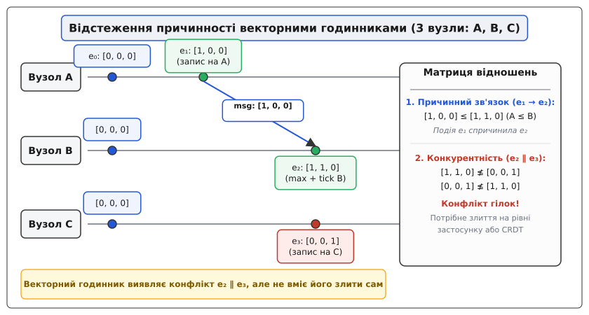
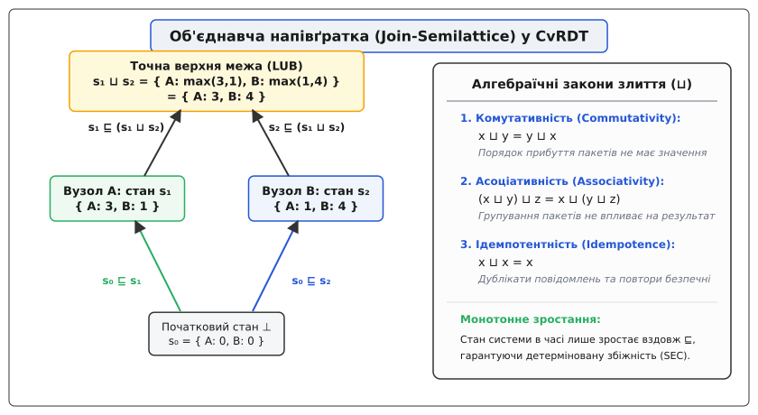
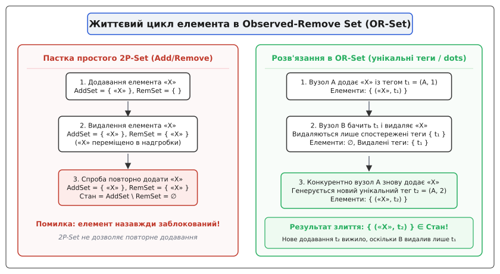
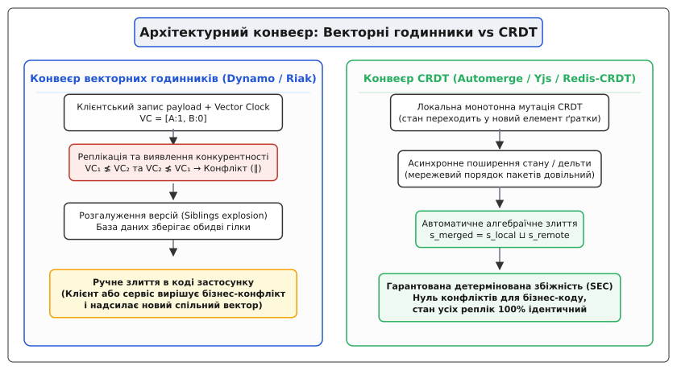

# Векторні годинники та CRDT: відстеження причинності проти автоматичної збіжності

<preknowlist>
- [Мережевий поділ і теорема CAP](topic:sf-distributed/cap-theorem) — неминучий компроміс між доступністю та узгодженістю в ненадійних мережах.
- [Кінцева узгодженість на практиці](topic:sf-distributed/eventual-consistency) — модель BASE, реплікаційний лаг та ймовірнісні аномалії читання.
- [Лідер-фоловер / мультилідер / leaderless](topic:sf-distributed/replication-leader-follower) — топології поширення даних і паралельні точки запису.
- [Ідемпотентність](topic:sf-distributed/idempotency) — збереження стану системи при повторному застосуванні однакових мутацій.
- [Мультилідерна реплікація](topic:sf-distributed/multi-leader-replication) — виникнення конфліктів запису на географічно розподілених вузлах.
</preknowlist>

Користувач корпоративного таск-трекера сідає в літак у Варшаві, відкриває ноутбук в автономному режимі й додає тег «Терміново» до завдання з ідентифікатором `TASK-402`. Одночасно його колега в офісі в Києві відкриває це саме завдання і змінює його статус із «В роботі» на «Виконано». Після приземлення ноутбук підключається до мережі аеропорту, і обидві репліки відправляють свої зміни на центральний сервер.

Якщо система синхронізації покладається на фізичний час і сліпо застосовує правило «перемагає останній запис» (Last-Write-Wins, LWW), оновлення з Києва безслідно знищує тег «Терміново», доданий у Варшаві, через те, що системний годинник ноутбука відставав на три секунди. Команда втрачає критичний пріоритет завдання, менеджер не отримує сповіщення, а база даних мовчки фіксує некоректний стан без жодного попередження про конфлікт.

Цей збій викриває центральну дилему розподілених систем без єдиного координатора: як одночасно приймати записи на багатьох вузлах без блокувань, не втрачати паралельні зміни користувачів і забезпечити гарантовану збіжність стану на всіх серверах.

Історичний шлях розвитку цих ідей від перших алгоритмів логічного часу до сучасної алгебри збіжності викладено в історичній довідці [Еволюція відстеження причинності: від логічного часу Лампорта до безконфліктних типів CRDT](topic:hist-causality-to-convergence.md).

---

## 1. Пастка фізичного часу та ілюзія одночасності

У розподіленій системі не існує концепції «абсолютного теперішнього часу». Кварцові генератори серверів піддаються температурному дрейфу (термічна похибка типового кварцового резонатора становить від 10 до 50 частин на мільйон, що накопичує від 1 до 4 секунд розбіжності на добу). 

Протокол синхронізації часу NTP (Network Time Protocol) зменшує розбіжність через мережу, проте в публічних хмарах затримки пакетів та фазові стрибки таймера (Clock Jitter) регулярно призводять до розбіжності від 5 до 250 мілісекунд.

Якщо два вузли генерують події паралельно, фізичні мітки часу не дають жодної відповіді на питання, яка подія передувала іншій:

```
[Порівняння фізичного часу двох паралельних подій]
Вузол A (Варшава): Запис W_A  (фізичний час t_A = 14:00:00.120)
Вузол B (Київ):    Запис W_B  (фізичний час t_B = 14:00:00.115)
Похибка NTP між вузлами:  Δ = ±15 мс

Дійсний часовий інтервал:
t_A ∈ [14:00:00.105; 14:00:00.135]
t_B ∈ [14:00:00.100; 14:00:00.130]

Інтервали перетинаються: неможливо визначити, яка подія була першою.
```

Застосування евристики Last-Write-Wins (LWW) за фізичним часом є операцією з утратою інформації: пізніший за фізичним таймером запис затирає попередній, навіть якщо між ними не було жодного причинного зв'язку. Щоб зберегти цілісність даних, розподілені системи змушені перейти від фізичного часу до логічного відстеження причинності (causality, від латинського *causa* — причина).

---

## 2. Логічний час Лампорта та межа скалярних лічильників

У 1978 році Леслі Лампорт запропонував фундаментальне відношення «сталося раніше» (happened-before relation, позначається як `→`). Для будь-яких двох подій `a` та `b` у розподіленій системі запис `a → b` означає, що подія `a` могла причинно вплинути на подію `b`.

Відношення `→` строго визначається трьома правилами:
1. Якщо `a` і `b` сталися в межах одного процесу, і `a` виконалася раніше за `b`, то `a → b`.
2. Якщо `a` — це надсилання повідомлення одним процесом, а `b` — його отримання іншим процесом, то `a → b`.
3. Якщо `a → b` та `b → c`, то `a → c` (транзитивність).

Якщо ані `a → b`, ані `b → a` не виконується, події називаються **конкурентними** (concurrent, позначається як `a ∥ b`). Конкурентні події не мають між собою інформаційного обміну, тому жодна з них не може вважатися причиною іншої.

Лампорт запропонував реалізацію логічного годинника у вигляді скалярного монотонного лічильника `L`:
* Перед кожною локальною подією вузол інкрементує: `L = L + 1`;
* При надсиланні повідомлення вузол додає своє значення `L` у заголовок пакета;
* При отриманні повідомлення з міткою `L_msg` вузол оновлює свій стан: `L = max(L_local, L_msg) + 1`.

Годинник Лампорта гарантує пряму умову монотонності:
```
a → b  ⇒  L(a) < L(b)
```

Проте скалярний годинник має критичну ваду: **зворотне твердження є хибним**. Якщо ми спостерігаємо `L(a) < L(b)`, ми не маємо права стверджувати, що `a → b`. Події `a` та `b` можуть бути конкурентними (`a ∥ b`), але скалярний годинник спрощує багатовимірний граф причинності до одновимірної числової прямої. 

Скалярний годинник не здатний виявити конфлікт паралельних записів.

---

## 3. Векторні годинники: повна ізоморфність причинності

Щоб розрізняти причинну залежність і паралелізм, розподілена система має зберігати знання про прогрес кожного учасника кластера окремо. Цю задачу розв'язують векторні годинники (Vector Clocks).

Нехай у системі бере участь `N` вузлів з ідентифікаторами `1, 2, ..., N`. Векторний годинник `V` — це масив із `N` невід'ємних цілих чисел, де елемент `V[i]` позначає кількість логічних подій, виконаних вузлом `i`, про які відомо поточному володарю вектора.

### Алгоритм функціонування векторного годинника

1. **Ініціалізація:** кожен вузол стартує з вектором, заповненим нулями: `V = [0, 0, ..., 0]`.
2. **Локальна подія або запис:** вузол `i` збільшує лише власну компоненту:
```
V[i] = V[i] + 1
```
3. **Надсилання повідомлення:** вузол `i` прикріплює копію свого поточного вектора `V` до корисного навантаження повідомлення.
4. **Отримання повідомлення:** отримавши вектор `V_msg` від віддаленого вузла, вузол `i` виконує покомпонентний максимум і збільшує свою позицію:
```
∀ k ∈ 1..N: V[k] = max(V[k], V_msg[k])
V[i] = V[i] + 1
```


*Відстеження причинності векторними годинниками: повідомлення між вузлами A і B встановлює причинний зв'язок e₁ → e₂, тоді як незалежний запис на вузлі C породжує конкурентну гілку e₂ ∥ e₃.*

### Правила порівняння векторних годинників

Для двох векторів `V_A` та `V_B` визначено частковий порядок:

* **Частковий порядок (V_A ≤ V_B):**
```
V_A ≤ V_B  ⇔  (∀ k ∈ 1..N: V_A[k] ≤ V_B[k])
```
* **Строгий причинний зв'язок (V_A < V_B):**
```
V_A < V_B  ⇔  (V_A ≤ V_B  ∧  V_A ≠ V_B)
```
Це означає, що подія `A` гарантовано передувала події `B` (`A → B`), і стан `B` містить у собі всі зміни стану `A`.

* **Конкурентність / Конфлікт (V_A ∥ V_B):**
```
V_A ∥ V_B  ⇔  (V_A ≰ V_B  ∧  V_B ≰ V_A)
```
Це означає, що ані `A` не знала про `B`, ані `B` не знала про `A`. Виникла паралельна розвилка історії (конфлікт гілок).

Векторні годинники дають двосторонню еквівалентність, якої бракувало годинникам Лампорта:
```
a → b  ⇔  V(a) < V(b)
a ∥ b  ⇔  V(a) ∥ V(b)
```

---

## 4. Межа векторних годинників: детекція замість злиття

Головне концептуальне обмеження векторних годинників полягає в тому, що **вони лише виявляють конфлікт, але не містять жодного механізму для його розв'язання**.

Коли розподілена база даних (наприклад, Amazon Dynamo або Riak KV) фіксує два записи з конкурентними векторами `V_1 ∥ V_2`, вона не має математичного права перезаписати жоден із них. База даних змушена створити розгалуження і зберегти обидва значення як «близнюків» (siblings / concurrent branches).

```
Вузол 1: Запис key="cart", val=["Book"],    VC=[Node1: 1, Node2: 0]
Вузол 2: Запис key="cart", val=["Laptop"],  VC=[Node1: 0, Node2: 1]

Результат читання з кворуму:
Знайдено 2 siblings для ключа "cart":
1) ["Book"]   з вектором [1, 0]
2) ["Laptop"] з вектором [0, 1]

База даних повертає клієнту ОБИДВА значення.
```

### Практичні наслідки перекладання конфліктів на користувача

1. **Вибух розгалужень (Siblings Explosion):**
   Якщо клієнтські застосунки читають дані без негайного злиття й відправляють нові паралельні записи, кількість збережених версій для одного ключа зростає як лавина (відомі випадки в продакшені Riak, коли один ключ накопичував понад 5000 паралельних гілок, спричиняючи переповнення пам'яті Java Heap або Erlang VM).
2. **Семантичні пастки наївного злиття:**
   Якщо застосунок намагається автоматично злити два списки простим об'єднанням множин (`Union`), видалені елементи неминуче «воскресають». Якщо користувач видалив товар із кошика на одному пристрої, а на іншому змінив кількість іншого товару, операція `Union` знову повертає видалений товар у замовлення.
3. **Роздування метаданих (Vector Bloat) та відсікання (Pruning):**
   Розмір вектора пропорційний кількості акторів `N`. У веб-застосунках із мільйонами мобільних клієнтів збереження `O(N)` чисел для кожного рядка стає неможливим. Бази даних застосовують механізм відсікання старих записів вектора за часом (Vector Pruning). Однак обрізання вектора руйнує строгу транзитивність відношення `≤`, що перетворює причинно залежні оновлення на фальшиві конфлікти (Phantom Conflicts).

Векторний годинник — це пасивний метаданий аудит. Він сигналізує про пожежу, але не має інструментів для її гасіння.

---

## 5. Парадигма CRDT: сильна кінцева узгодженість без координації

Щоб усунути необхідність ручного злиття гілок і позбутися паузи на синхронний консенсус (Paxos / Raft), у 2011 році дослідницька група під керівництвом Марка Шапіри сформулювала концепцію **безконфліктних реплікованих типів даних (Conflict-free Replicated Data Types, CRDT)**.

Фундаментальна ідея CRDT полягає в зміні точки зору: **замість зберігання довільного бінарного стану з постфактум-детекцією колізій, структури даних проектуються так, щоб будь-які паралельні операції природно сходилися до однакового результату завдяки алгебраїчним законам**.

CRDT реалізують модель **сильної кінцевої узгодженості (Strong Eventual Consistency, SEC)**:
* Репліки негайно приймають операції запису та читання локально, без блокувань і без очікування мережевих відповідей;
* Оновлення поширюються між вузлами асинхронно;
* **Теорема SEC:** Щойно будь-які дві репліки отримують один і той самий набір оновлень (у довільному порядку та з можливими дублюваннями), їхній внутрішній стан стає строго ідентичним.

Повне формальне доведення теореми збіжності на базі теорії порядку наведено в математичній статті [Математика збіжності: напівґратки, монотонність та сильна кінцева узгодженість](topic:math-semilattices-and-convergence.md).

---

## 6. Дві фундаментальні форми CRDT: стани проти операцій

Математична класифікація поділяє всі CRDT на дві фундаментальні архітектурні моделі: на основі стану (State-based) та на основі операцій (Operation-based).

```
┌───────────────────────────────────────┬────────────────────────────────────────┐
│ State-based CRDT (CvRDT)              │ Operation-based CRDT (CmRDT)           │
├───────────────────────────────────────┼────────────────────────────────────────┤
│ Репліки обмінюються повним станом     │ Репліки розсилають атомарні операції   │
│ або його частиною (дельтами).         │ модифікації (add, remove, inc).        │
├───────────────────────────────────────┼────────────────────────────────────────┤
│ Злиття виконується оператором         │ Усі операції в просторі станів мусять  │
│ точної верхньої межі: s = s_A ⊔ s_B.  │ бути строго комутативними: op1 ∘ op2.  │
├───────────────────────────────────────┼────────────────────────────────────────┤
│ Вимоги до мережі: будь-який транспорт │ Вимоги до мережі: надійне каузальне    │
│ (допускає безлад і дублікати пакетів).│ доставлення (Causal Delivery, at-least)│
├───────────────────────────────────────┼────────────────────────────────────────┤
│ Обсяг трафіку: O(стан) або O(дельта). │ Обсяг трафіку: O(операція) (мінімальний│
└───────────────────────────────────────┴────────────────────────────────────────┘
```

### Об'єднавча напівґратка в CvRDT

У State-based CRDT (Convergent Replicated Data Types, CvRDT) множина всіх можливих станів утворює **обмежену об'єднавчу напівґратку** (Join-Semilattice) `(S, ⊔, ⊑, ⊥)`.

Операція злиття станів двох реплік `merge(s_1, s_2) = s_1 ⊔ s_2` гарантовано збігається завдяки трьом властивостям:
1. **Комутативність (Commutativity):** `x ⊔ y = y ⊔ x` (порядок отримання реплік не змінює кінцевий результат);
2. **Асоціативність (Associativity):** `(x ⊔ y) ⊔ z = x ⊔ (y ⊔ z)` (пакети можна об'єднувати довільними групами);
3. **Ідемпотентність (Idempotence):** `x ⊔ x = x` (повторне надсилання того самого повідомлення чи старого стану не спотворює дані).


*Діаграма об'єднавчої напівґратки (Join-Semilattice): локальні мутації монотонно рухають стан реплік вгору вздовж часткового порядку ⊑, а оператор точної верхньої межі (LUB ⊔) детерміновано обчислює спільний стан.*

---

## 7. Анатомія базових типів CRDT

Розгляньмо, як абстрактна алгебра перетворюється на практичні структури даних.

### 1. Лічильники (Counters)

#### G-Counter (Grow-Only Counter)
Лічильник, який можна лише збільшувати. Кожен із `N` вузлів володіє власною коміркою у векторі розміром `N`.
* Локальне збільшення на вузлі `i`: `P[i] = P[i] + val`;
* Злиття двох векторів: покомпонентний максимум:
```
∀ k ∈ 1..N: P_merged[k] = max(P_1[k], P_2[k])
```
* Читання значення: сума всіх елементів вектора:
```
Value = ∑_{k=1}^N P[k]
```

#### PN-Counter (Positive-Negative Counter)
Лічильник із підтримкою додавання та віднімання. Складається з пари двох незалежних G-Counter: вектора додавання `P` та вектора віднімання `N`.
* Збільшення інкрементує `P[i]`;
* Зменшення інкрементує `N[i]`;
* Злиття: `P_merged = max(P_1, P_2)` та `N_merged = max(N_1, N_2)`;
* Підсумкове значення: `Value = ∑ P[k] - ∑ N[k]`.

### 2. Регістри (Registers)

Регістр зберігає одне скалярне або об'єктне значення.

#### LWW-Element-Register (Last-Write-Wins Register)
Зберігає пару `(значення, мітка_часу)`. При злитті виграє запис із більшою міткою часу (за рівності порівнюються унікальні ідентифікатори вузлів як tie-breaker). Це простий CRDT, але він втрачає паралельні дані, якщо мітки збігаються або годинники розсинхронізовані.

#### Multi-Value Register (MV-Register)
Зберігає множину пар `{(val_1, VC_1), (val_2, VC_2), ...}`. Коли записується нове значення, воно перекриває всі попередні версії, вектори яких строго менші за новий вектор (`VC_old < VC_new`). Якщо під час злиття зустрічаються два вектори `VC_1 ∥ VC_2`, регістр зберігає обидва значення. 

Тут проявляється глибокий зв'язок: **MV-Register є CRDT, який використовує векторні годинники як внутрішній математичний механізм для побудови напівґратки**.

### 3. Множини (Sets)

#### G-Set (Grow-Only Set)
Множина, елементи з якої не можна видаляти. Злиття двох станів — звичайне теоретико-множинне об'єднання `S_merged = S_1 ∪ S_2`.

#### 2P-Set (Two-Phase Set)
Містить дві внутрішні множини: `AddSet` (додані елементи) та `RemoveSet` (видалені елементи, надгробки / tombstones). Елемент вважається присутнім, якщо `e ∈ AddSet ∧ e ∉ RemoveSet`. 
*Критичне обмеження:* якщо елемент видалено одного разу, його неможливо додати знову, оскільки запис у `RemoveSet` є незворотним.

#### OR-Set (Observed-Remove Set)
Найбільш гнучка множина, що дозволяє повторне додавання та видалення елементів без блокувань. Кожне додавання елемента супроводжується генерацією унікального причинного тегу (Dot або UUID). При видаленні елемента вузол поміщає в набір надгробків **лише ті теги, які він реально спостерігав на момент видалення**.


*Життєвий цикл в OR-Set: паралельне видалення спостереженого тегу t₁ та додавання нового тегу t₂ детерміновано зберігає елемент у множині (Add-Wins семантика).*

Якщо Вузол A видалив елемент із тегом `t_1`, а Вузол B паралельно додав той самий елемент із новим тегом `t_2`, то при злитті тег `t_2` виживає, і елемент залишається в множині. Ця семантика називається **Add-Wins** (або Observed-Remove).

---

## 8. Системне порівняння: Векторні годинники vs CRDT

Часто розробники помилково сприймають векторні годинники та CRDT як взаємовиключні альтернативи. Насправді вони займають різні рівні в ієрархії розподілених абстракцій.


*Порівняння архітектурних конвеєрів: Векторні годинники перекладають розв'язання конфліктів на прикладний код користувача, тоді як CRDT гарантують математичну збіжність на рівні структури даних.*

Нижче наведено зведену матрицю інженерних компромісів між підходами:

```
┌───────────────────────────────┬───────────────────────────────┬──────────────────────────────┐
│ Критерій порівняння           │ Векторні годинники            │ Безконфліктні типи (CRDT)    │
├───────────────────────────────┼───────────────────────────────┼──────────────────────────────┤
│ Основна функція               │ Детекція причинності та       │ Детерміноване злиття та      │
│                               │ фіксація конфлікту (∥).       │ автоматична збіжність (SEC). │
├───────────────────────────────┼───────────────────────────────┼──────────────────────────────┤
│ Відповідальність за злиття    │ Користувач / прикладний код   │ Алгебраїчна структура типу   │
│                               │ мікросервісу.                 │ (напівґратка / комутативність│
├───────────────────────────────┼───────────────────────────────┼──────────────────────────────┤
│ Модель даних                  │ Довільний неструктурований    │ Спеціалізовані типи:         │
│                               │ масив байтів (JSON/Blob).     │ Set, Map, Counter, Text.     │
├───────────────────────────────┼───────────────────────────────┼──────────────────────────────┤
│ Стійкість до вибуху версій    │ Низька: ризик лавиноподібного │ Висока: стан завжди сходиться│
│                               │ накопичення siblings.         │ до єдиного об'єкта.          │
├───────────────────────────────┼───────────────────────────────┼──────────────────────────────┤
│ Накладні витрати пам'яті      │ O(N) на запис (N — кількість  │ O(елементи + надгробки/теги);│
│                               │ активних вузлів/клієнтів).    │ вимагає сміттєзбору (GC).    │
├───────────────────────────────┼───────────────────────────────┼──────────────────────────────┤
│ Складність інваріантів        │ Дозволяє будь-яку довільну    │ Обмежено монотонними         │
│                               │ бізнес-логіку злиття.         │ операціями напівґратки.      │
└───────────────────────────────┴───────────────────────────────┴──────────────────────────────┘
```

Повний робочий код векторних годинників, MV-регістра та OR-Set на мовах C та C++ наведено у практичному проєкті [Реалізація рушія збіжних станів: векторні годинники, MV-регістр та OR-Set](topic:proj-crdt-state-engine.md).

---

## 9. Де CRDT безсилі: межа монотонності та необхідність консенсусу

Попри свою математичну елегантність, CRDT не є універсальною панацеєю для всіх розподілених завдань. Існує фундаментальний клас бізнес-інваріантів, які **неможливо виразити у вигляді напівґратки без синхронної координації**.

### Приклад: Обмеження балансу банківського рахунку (`Balance ≥ 0`)

Уявімо банківський рахунок, на якому лежить 100 доларів. 
* Користувач 1 на Вузлі A намагається зняти 80 доларів;
* Користувач 2 на Вузлі B одночасно намагається зняти 70 доларів.

Обидва вузли локально бачать, що `100 ≥ 80` і `100 ≥ 70`, та підтверджують операцію в режимі офлайн-доступності CRDT. Після злиття станів за допомогою PN-Counter підсумковий баланс становить:
```
Balance = 100 - (80 + 70) = -50
```

Інваріант «баланс не може бути від'ємним» порушено. 

Причина полягає в тому, що перевірка глобального обмеження вимагає взаємного виключення (Mutual Exclusion) або кворумної резервації (Escrow / Bounded Counters), що за теоремою CAP неминуче вимагає консенсусу (Raft, Paxos або двофазного коміту) за наявності мережевого поділу.

### Критерій вибору архітектурного рішення

```
1. Чи потрібні глобальні неподільні обмеження (унікальний логін, неподільний ліміт грошей)?
   ├── ТАК ──► Потрібен суворий консенсус (Raft / Paxos / Spanner).
   └── НІ
       │
2. Чи можна описати предметну область як монотонне накопичення фактів (додавання, видалення, текст, лічильники)?
   ├── ТАК ──► Використовуємо CRDT (Automerge, Yjs, Riak DT, Redis CRDT).
   └── НІ
       │
3. Чи потрібне довільне ручне злиття бізнес-документів користувачем (як у Git)?
   └── ТАК ──► Використовуємо Векторні годинники / Версійні графи (CouchDB, Dynamo siblings).
```

---

## 10. Інженерні виклики експлуатації CRDT

Перехід на CRDT у високошвидкісних системах вимагає вирішення трьох головних інженерних проблем:

1. **Сміттєзбір надгробків (Tombstone Garbage Collection):**
   У множинах OR-Set та послідовностях для спільного редагування тексту (RGA, YATA) видалені символи й елементи позначаються як видалені (надгробки). Якщо документ інтенсивно редагується протягом місяців, обсяг надгробків може в 50 разів перевищувати корисний текст. Для їх очищення застосовують протоколи стабільності причинного контексту: вузол може фізично видалити надгробок із пам'яті лише тоді, коли за векторним годинником підтверджено, що всі активні репліки гарантовано отримали операцію видалення.
2. **Дельта-реплікація (Delta-State CRDTs):**
   Класичний CvRDT вимагає надсилання повного стану об'єкта під час кожного оновлення. Для великих карт або JSON-документів це створює гігабайти мережевого трафіку. Сучасні бібліотеки реалізують Delta-CRDT: вузол генерує мутацію у вигляді крихітного стану `Δ` (напівґратка дельт), який зливається з локальним станом і передається сусідам.
3. **Еволюція схем і безпека типів:**
   Оскільки операція `merge` виконується асинхронно і без центрального сервера, зміна структури полів CRDT-документа вимагає суворої зворотної сумісності серіалізації, інакше старі репліки не зможуть обчислити точну верхню межу з новими вузлами.

---

> 🔧 **Навіщо це в реальній розробці.**
> 
> Розуміння межі між векторними годинниками та CRDT визначає архітектуру сучасних автономних (local-first) та глобально розподілених застосунків:
> * **Колаборативні редактори (Figma, Notion, Google Docs):** відмовилися від складних централізованих серверів операційної трансформації (OT) на користь текстових CRDT (Yjs, Automerge), що забезпечує миттєвий відгук інтерфейсу навіть під час польоту в літаку з наступною гарантованою збіжністю без конфліктних вікон.
> * **Мультирегіональні георозподілені сховища (Redis Enterprise CRDT, Azure Cosmos DB, AWS DynamoDB Global Tables):** вбудовують готові типи PN-Counter та OR-Set, що дозволяє інженерам оновлювати лічильники переглядів і кошики покупців у п'яти дата-центрах одночасно з нульовим часом очікування трансокеанських мережевих блокувань.
> * **Розподілений аудит та версіонування (Git, CouchDB):** свідомо використовують векторні годинники та спрямовані ациклічні графи (DAG), коли злиття конфлікту вимагає свідомого інтелектуального рішення людини, а не автоматичного математичного схлопування.
