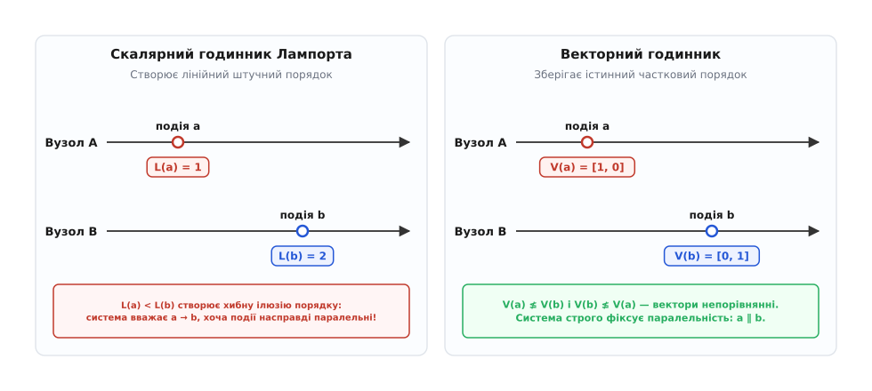
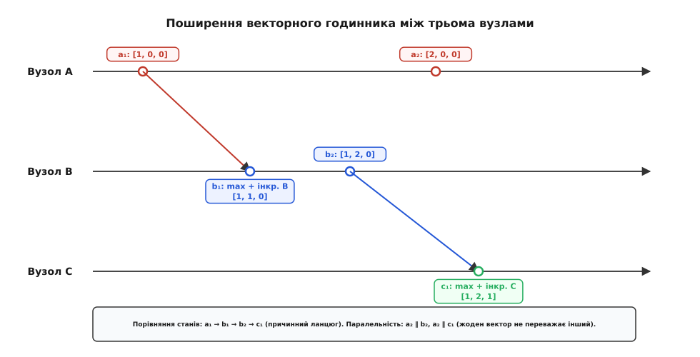
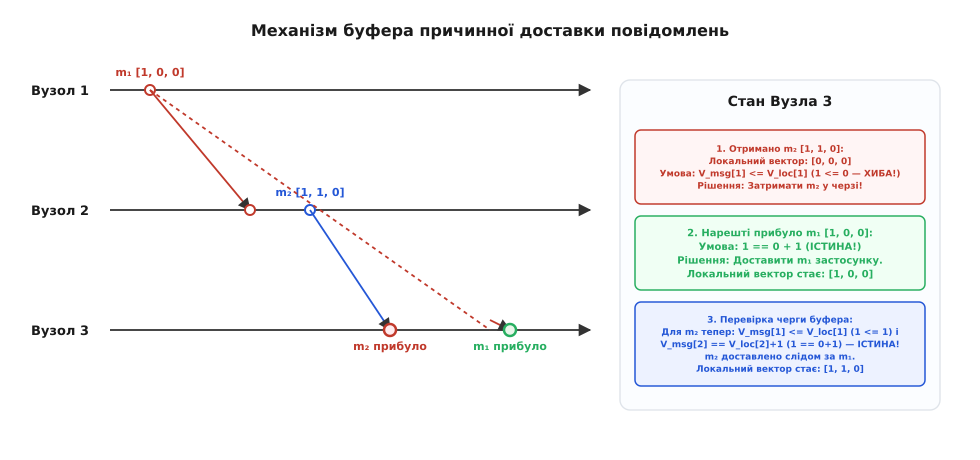
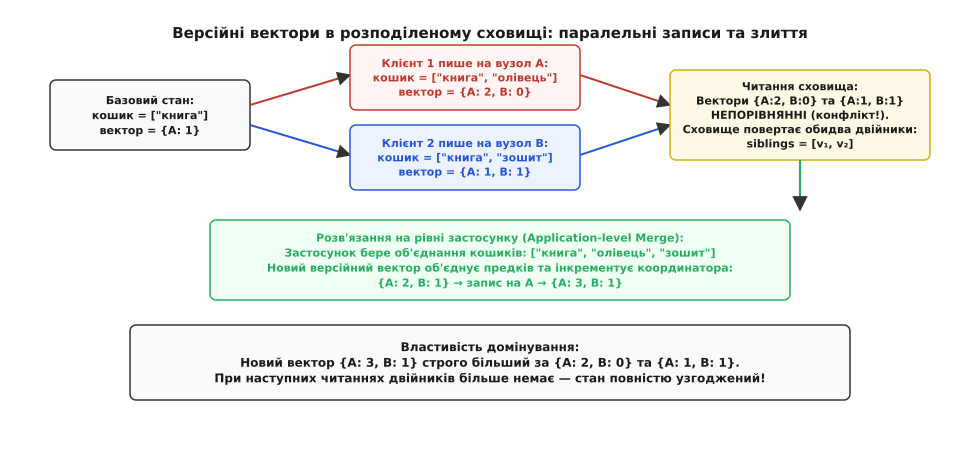

# Векторні годинники та обхід розбіжностей у розподілених сховищах (Vector Clocks)

<preknowlist>
- [Годинник Лампорта](topic:sf-distributed/lamport-clocks) — скалярний логічний час та відношення «трапилося раніше».
- [Кінцева узгодженість](topic:sf-distributed/eventual-consistency) — модель реплікації, де копії сходяться після завершення обміну.
- [Теорема CAP](topic:sf-distributed/cap-theorem) — компроміс між узгодженістю та доступністю під час мережевих розділень.
- [Безконфліктні типи даних (CRDT)](topic:sf-distributed/crdt) — структури даних з автоматичним детерміністичним злиттям.
- [Напіврешітка](topic:math-algebra/semilattice) — частковий порядок з операцією найменшої верхньої межі (join).
</preknowlist>

Два сервери в різних дата-центрах одночасно приймають запити на зміну того самого запису в базі даних. Мережевий канал між ними тимчасово розірвано, тому жоден із них не може попередити іншого про свою дію. Коли зв'язок відновлюється, сховище має вирішити: яке з двох значень є новішим і має зберегтися, а яке застаріло? Якщо порівняти покази фізичних годинників серверів, вузол із годинником, що поспішає на кілька мілісекунд, безповоротно затре правку сусіда, навіть якщо реальна дія на сусідньому вузлі відбулася пізніше.

Ця проблема виникає через фундаментальну властивість розподілених систем: **відсутність єдиного фізичного часу**. Кварцові резонатори серверів дрейфують під впливом температури, а протоколи мережевої синхронізації на зразок NTP залишають непереборну похибку в одиниці чи десятки мілісекунд через мінливість мережевих затримок. Настінний час не дозволяє розрізнити, чи спричинила одна дія іншу, чи вони відбулися незалежно й паралельно.

Спроба замінити фізичний час простим лічильником створює іншу пастку: скалярний годинник штучно накладає строгий лінійний порядок на незалежні події, маскуючи конфлікти замість того, щоб їх виявляти. **Векторні годинники** (англ. *vector clocks*) та **версійні вектори** розв'язують цю кризу в корені: кожен вузол веде не одне число, а цілий масив лічильників знань про весь кластер. Це дозволяє математично точно зафіксувати причинно-наслідкові зв'язки (лат. *causa* — причина), безпомилково виявити паралельні конкурентні записи та надати застосунку всі розбіжні гілки для об'єднання без втрати даних.

## Фізичні обмеження часу та криза впорядкування

У класичних монолітних комп'ютерах усі процесорні ядра синхронізовані спільною шиною та єдиним генератором тактових імпульсів. Якщо потік `A` записав значення в комірку оперативної пам'яті до того, як потік `B` прочитав її, апаратний контролер пам'яті гарантує строгу послідовність операцій.

У розподілених системах вузли фізично рознесені на сотні й тисячі кілометрів, позбавлені спільної оперативної пам'яті та взаємодіють виключно шляхом асинхронного обміну повідомленнями.

### Дрейф кварцових резонаторів та межі протоколу NTP

Кожен комп'ютерний сервер має власний апаратний годинник реального часу (англ. *Real-Time Clock*, RTC), тактова частота якого задається коливаннями п'єзоелектричного кристала кварцу. Точність таких резонаторів обмежена: типова похибка становить від 10 до 50 ppm (частин на мільйон). Похибка у 20 ppm означає, що за відсутності постійної корекції годинник сервера зміщуватиметься на 1.7 секунди щодня:

```
20 ppm = 20 · 10⁻⁶
Зсув за добу = 20 · 10⁻⁶ · 86400 с ≈ 1.728 с
```

Для синхронізації часу в комп'ютерних мережах використовують протокол NTP (англ. *Network Time Protocol*). NTP-клієнт періодично обмінюється UDP-пакетами з серверами точного часу Stratum-1, вимірює кругову затримку сигналу (англ. *Round-Trip Time*, RTT) і підлаштовує локальний годинник.

Проте NTP не здатен усунути похибку повністю. Мережева затримка в каналах зв'язку є принципово асиметричною: час проходження пакета від клієнта до сервера майже ніколи не дорівнює часу зворотного шляху через різне завантаження буферів маршрутизаторів. У публічному інтернеті похибка синхронізації NTP зазвичай коливається в межах від 10 до 100 мілісекунд, а всередині одного дата-центру — від 0.5 до 5 мілісекунд.

Крім того, періодично виникає явище стрибків часу (англ. *clock steps*), коли демон синхронізації різко переводить годинник назад, щоб компенсувати накопичений лаг або врахувати високосну секунду (Leap Second). Якщо в цей момент сервер фіксує транзакції, пізніша транзакція отримує фізичний таймстемп менший за попередню, порушуючи монотонність.

Це створює непереборне вікно невизначеності: якщо дві транзакції відбулися з різницею в кілька мілісекунд на різних серверах, фізичні мітки часу не дають жодної гарантії щодо того, яка з них насправді сталася раніше.

### Небезпека стратегії «Останній запис перемагає» (LWW)

Найпростіший і водночас найбільш руйнівний спосіб вирішення конфліктів у розподілених базах даних — вибір версії з найбільшою фізичною міткою часу (англ. *Last-Write-Wins*, LWW).

Уявімо розподілене сховище профілів користувачів із двома репліками:
1. На сервері `A` годинник відстає на 8 мілісекунд;
2. На сервері `B` годинник поспішає на 7 мілісекунд;
3. Користувач о `14:00:00.010` надсилає запит на сервер `B`, змінюючи прізвище на *«Шевченко»*. Сервер `B` зберігає запис із міткою `14:00:00.017`;
4. Через 5 мілісекунд (о `14:00:00.015`) користувач усвідомлює помилку й надсилає виправлення на сервер `A`, змінюючи прізвище на *«Коваленко»*. Сервер `A` зберігає запис із міткою `14:00:00.007`.

Коли сервери синхронізуються, правило LWW порівнює мітки `14:00:00.017` та `14:00:00.007`. Сервер `B` оголошується переможцем, а новіше виправлення користувача на сервері `A` мовчки видаляється. Система перейшла в застарілий стан, порушивши базову інтуїцію користувача.

Стратегія LWW перетворює розв'язання конфліктів на лотерею кварцових резонаторів. Вона допустима лише для телеметрії та лічильників датчиків, де втрата окремих замірів не критична, але неприйнятна для бізнес-даних, фінансових реєстрів чи спільних документів.

### Відносність одночасності в розподілених системах

У 1978 році американський вчений Леслі Лампорт зазначив, що концепція фізичного часу в розподілених системах аналогічна спеціальній теорії відносності: просторово розділені спостерігачі не мають універсального способу встановити абсолютну одночасність подій. Подія `A` може фізично вплинути на подію `B` лише тоді, коли інформація про `A` встигла дійти до `B` до моменту її настання (перебуває у світловому конусі минулого).

У комп'ютерній мережі роль швидкості світла відіграє передача повідомлень. Єдиним об'єктивним мірилом є **причинно-наслідковий зв'язок** (інформація, передана повідомленнями).

Історичний шлях розвитку цих ідей — від світлових конусів теорії відносності до створення векторних годинників та їх впровадження у хмарні сховища — докладно описано у вставці: [Історія логічного часу: від конусів причинності до векторних годинників](topic:sf-distributed/vector-clocks/hist-vector-clocks.md).

## Скалярний годинник Лампорта та його сліпа зона

Щоб позбутися залежності від фізичних годинників, Лампорт формалізував відношення **«трапилося раніше»** (англ. *happened-before*, позначається `→`). Подія `a` передує події `b` (`a → b`), якщо:
1. `a` і `b` відбулися в одному процесі, і `a` сталася раніше за `b`;
2. `a` — це відправлення повідомлення, а `b` — отримання цього ж повідомлення іншим процесом;
3. Існує подія `c` така, що `a → c` і `c → b` (транзитивність).

Лампорт запропонував підтримувати на кожному вузлі простий цілочисельний лічильник `L`. Перед виконанням локальної дії процес інкрементує `L = L + 1`, додає поточне значення `L` до вихідних повідомлень, а при отриманні повідомлення зі значенням `L_msg` обчислює:
```
L_local = max(L_local, L_msg) + 1
```

Годинник Лампорта гарантує фундаментальну властивість узгодженості:
```
a → b ⟹ L(a) < L(b)
```

Але головна вада скалярного годинника полягає в тому, що **зворотна імплікація не виконується**:
```
L(a) < L(b) ⇏ a → b
```

Якщо дві події `a` та `b` відбулися на ізольованих серверах, між якими не було обміну повідомленнями, їхні скалярні мітки можуть бути довільними (наприклад, `L(a) = 3`, `L(b) = 7`). Скалярний годинник стверджуватиме, що `L(a) < L(b)`, створюючи фальшиву ілюзію того, що подія `a` спричинила подію `b`.


*Скалярний годинник накладає штучний лінійний порядок, маскуючи конкурентність; векторний годинник відображає істинний частковий порядок простору подій.*

Щоб подолати однакові значення міток, Лампорт доповнив скалярний годинник ідентифікатором вузла: кортеж `(L(e), NodeId)` дозволяє побудувати повний детерміністичний порядок над усіма подіями кластера.

Проте цей штучний повний порядок є небезпечним: він стискає багаторівневий граф причинності в одновимірну числову шкалу. Він не здатний розрізнити два принципово різні випадки:
- **Причинну залежність:** подія `b` знала про подію `a` і базувалася на ній;
- **Конкурентність (паралельність `a ∥ b`):** події сталися незалежно, і система зобов'язана зберегти обидва результати.

## Механізм векторного годинника

Векторний годинник усуває сліпу зону скалярного лічильника, замінюючи одне число вектором лічильників розміром у кількість процесів у системі:
```
V = [v₁, v₂, ..., v_N]
```
де значення `V[k]` позначає кількість подій процесу `k`, про які відомо поточному спостерігачу.

Кожен вузол кластера підтримує вектор, елементи якого відповідають усім відомим учасникам розподіленої системи.

### Формальні правила оновлення векторів (Фідж — Маттерн)

Нехай у системі функціонує `N` процесів `P₁, P₂, ..., P_N`. Кожен процес `P_i` ініціалізує локальний вектор нулями: `V_i = [0, 0, ..., 0]`.

Алгоритм базується на трьох строгих правилах:

1. **Локальна подія процесу `P_i`:**
   Перед виконанням будь-якої внутрішньої операції (запис у базу даних, зміна локального стану) процес `P_i` збільшує на одиницю **виключно власну координату** у векторі:
   ```
   V_i[i] = V_i[i] + 1
   ```
2. **Відправлення повідомлення процесом `P_i`:**
   Процес `P_i` спершу інкрементує власний лічильник `V_i[i] = V_i[i] + 1`, фіксуючи подію відправлення, після чого прикріплює повну копію вектора `V_i` до заголовка повідомлення `m`:
   ```
   m.clock = V_i
   ```
3. **Отримання повідомлення процесом `P_j`:**
   Отримавши повідомлення `m` із вектором `m.clock`, процес `P_j` виконує дві послідовні дії:
   - Обчислює покомпонентний максимум між локальним вектором `V_j` та вектором із повідомлення `m.clock` (алгебраїчна операція Join / супремум):
     ```
     ∀ k ∈ {1, ..., N}: V_j[k] = max(V_j[k], m.clock[k])
     ```
   - Збільшує власний локальний лічильник, фіксуючи факт обробки події прийому:
     ```
     V_j[j] = V_j[j] + 1
     ```


*Поширення знань про події в кластері з трьох вузлів: повідомлення передають вектори, що зливаються операцією покомпонентного максимуму.*

### Покроковий числовий приклад

Простежимо зміну векторів у системі з трьох вузлів `A`, `B`, `C` (початковий стан `[0, 0, 0]` на всіх вузлах):

```
Крок 1. Вузол A виконує локальну дію a₁:
        V_A = [1, 0, 0]

Крок 2. Вузол A відправляє повідомлення m₁ до B:
        V_A стає [2, 0, 0] (інкремент перед відправленням)
        m₁.clock = [2, 0, 0]

Крок 3. Вузол B отримує m₁ (подія b₁):
        V_B = max([0, 0, 0], [2, 0, 0]) = [2, 0, 0]
        Інкремент B: V_B[B] = 0 + 1 = 1
        Підсумок події b₁: V_B = [2, 1, 0]

Крок 4. Одночасно Вузол C у повній ізоляції виконує дію c₁:
        V_C = [0, 0, 1]

Крок 5. Вузол B відправляє повідомлення m₂ до C:
        V_B стає [2, 2, 0]
        m₂.clock = [2, 2, 0]

Крок 6. Вузол C отримує m₂ (подія c₂):
        V_C = max([0, 0, 1], [2, 2, 0]) = [2, 2, 1]
        Інкремент C: V_C[C] = 1 + 1 = 2
        Підсумок події c₂: V_C = [2, 2, 2]
```

### Алгебра порівняння векторів та виявлення паралельності

Маючи два вектори `V(a)` та `V(b)`, зняті в моменти подій `a` та `b`, система однозначно визначає відношення між ними:

1. **Нестрогий частковий порядок (`≤`):**
   ```
   V(a) ≤ V(b) ⟺ ∀ k ∈ {1, ..., N}: V(a)[k] ≤ V(b)[k]
   ```
2. **Строгий причинний порядок (`<`):**
   ```
   V(a) < V(b) ⟺ (V(a) ≤ V(b)) ∧ (V(a) ≠ V(b))
   ```
   Якщо `V(a) < V(b)`, то подія `a` гарантовано **причинно передувала** події `b` (`a → b`).
3. **Конкурентність / паралельність (`∥`):**
   ```
   V(a) ∥ V(b) ⟺ ¬(V(a) ≤ V(b)) ∧ ¬(V(b) ≤ V(a))
   ```
   Вектори непорівнянні тоді й лише тоді, коли існують такі індекси `i` та `j`, де `V(a)[i] < V(b)[i]`, але `V(a)[j] > V(b)[j]`. Події `a` і `b` відбулися паралельно, утворивши розвилку станів.

У наведеному числовому прикладі порівняємо подію `a₁` (`[1, 0, 0]`) та `c₂` (`[2, 2, 2]`):
```
[1, 0, 0] < [2, 2, 2]  ⟹  a₁ → c₂ (a₁ причинно передувала c₂)
```

Тепер порівняємо подію `a₂` (`[2, 0, 0]`) та подію `c₁` (`[0, 0, 1]`):
```
[2, 0, 0] ≰ [0, 0, 1]  (бо 2 > 0)
[0, 0, 1] ≰ [2, 0, 0]  (бо 1 > 0)
⟹  a₂ ∥ c₁ (події абсолютно паралельні!)
```

Векторні годинники реалізують двосторонній строгий ізоморфізм (грец. *isos* — рівний + *morphe* — форма) між причинністю та числовими векторами:
```
a → b ⟺ V(a) < V(b)
a ∥ b ⟺ V(a) ∥ V(b)
```

Математичні властивості векторних ґраток, конусів причинності та доведення теореми ізоморфізму наведено в математичній вставці: [Математичні основи причинного порядку та векторних ґраток](topic:sf-distributed/vector-clocks/math-causal-order.md).

> 🔧 **Навіщо це.** У розподілених системах контролю версій (як-от Git), спільних редакторах документів (Google Docs, Figma) або георозподілених базах даних векторні годинники дозволяють системі автоматично зливати гілки, якщо одна версія є прямим нащадком іншої (`V_A < V_B`), і сигналізувати про справжній конфлікт лише тоді, коли вектори непорівнянні (`V_A ∥ V_B`).

## Буфер причинної доставки (Causal Broadcast)

Векторні годинники є основою протоколів **причинного мовлення** (англ. *causal broadcast*), які гарантують, що жодне повідомлення не буде передано користувачу раніше за повідомлення, від яких воно логічно залежить.

### Проблема порушення причинного порядку в мережі

Протокол TCP гарантує збереження черговості передачі байтів лише в межах одного двоточкового з'єднання між двома комп'ютерами. Якщо в системі взаємодіють три або більше вузлів, прямих гарантій TCP недостатньо.

Розглянемо сценарій соціальної мережі:
1. Користувач `A` публікує пост: *«Мій кіт навчився відкривати двері!»* (повідомлення `m₁`);
2. Користувач `B` бачить `m₁` і публікує коментар: *«Неймовірно, покажи відео!»* (повідомлення `m₂`);
3. Користувач `C` підключений через мобільну мережу з нестабільним зв'язком. Пакет `m₁` застряє в буфері стільникової вежі, тоді як пакет `m₂` прибуває негайно.

Без контролю причинності екран користувача `C` відобразить відірваний від контексту коментар *«Неймовірно, покажи відео!»* до поста, якого користувач іще не бачив.

### Алгоритм причинного буфера

Для запобігання цій аномалії приймальний вузол перехоплює вхідний трафік через **буфер причинної доставки**.

Кожне повідомлення `m` передається разом із вектором `m.clock` та ідентифікатором відправника `S`. Вузол `J`, маючи локальний вектор `V_local`, застосовує **правило допуску**:

```
Повідомлення m від вузла S готове до видачі застосунку, якщо:

1. m.clock[S] == V_local[S] + 1
   [це наступне безпосереднє повідомлення від відправника S; немає пропусків]

2. ∀ k ≠ S: m.clock[k] ≤ V_local[k]
   [вузол J вже отримав і застосував усі повідомлення сторонніх вузлів k,
    які бачив вузол S перед відправленням повідомлення m]
```


*Вузол 3 затримує повідомлення m₂ у буфері до моменту надходження m₁, після чого доставляє обидва в істинному причинному порядку.*

Якщо умови виконано:
1. Повідомлення негайно передається прикладному рівню;
2. Локальний годинник оновлюється: `V_local[S] = m.clock[S]`;
3. Буфер ініціює каскадну перевірку всіх раніше відкладених повідомлень — поява відсутньої ланки може розблокувати цілу чергу залежних пакетів.

Якщо хоча б одна умова не виконується, пакет поміщається в чергу очікування буфера.

Робочу реалізацію рушія векторного годинника та алгоритму буферизації мовами C та C++ наведено у проектній вставці: [Реалізація рушія векторних годинників та буфера причинної доставки](topic:sf-distributed/vector-clocks/proj-vector-clocks.md).

## Версійні вектори в розподілених сховищах даних

У розподілених базах даних векторні мітки застосовуються для контролю версій збережених об'єктів. Тут вони відомі як **версійні вектори** (англ. *version vectors*).

Різниця між векторним годинником процесу та версійним вектором об'єкта є суто функціональною:
- **Векторний годинник** живе в оперативній пам'яті процесу та відстежує потік повідомлень між потоками виконання;
- **Версійний вектор** зберігається на диску поряд із кожним значенням (ключем) бази даних і відстежує історію модифікацій саме цього об'єкта.

### Архітектура Amazon Dynamo та поява двійників (Siblings)

У 2007 році компанія Amazon представила архітектуру сховища Dynamo, розроблену для забезпечення абсолютної доступності операцій запису в умовах частих мережевих збоїв та відключень дата-центрів.

У Dynamo будь-яка репліка може прийняти запис від клієнта. Розглянемо сценарій додавання товарів до корзини покупця:

1. **Початковий запис:** Клієнт додає книгу через сервер `A`. Сервер `A` створює запис `v₀ = ["книга"]` із версійним вектором `{A: 1}`.
2. **Послідовне оновлення:** Клієнт додає блокнот через сервер `A`. Створюється стан `v₁ = ["книга", "блокнот"]` із вектором `{A: 2}`. Оскільки `{A: 2} > {A: 1}`, стара версія без конфліктів перезаписується новою.
3. **Паралельні записи під час мережевого розділення:**
   - Клієнт із мобільного телефону додає ручку через сервер `A` ⟶ створюється версія `v₂ = ["книга", "блокнот", "ручка"]` із вектором `{A: 3, B: 0}`;
   - Той самий клієнт із ноутбука одночасно додає маркер через сервер `B` ⟶ сервер `B` (який ще не отримав оновлення `{A: 3}`) створює версію `v₃ = ["книга", "блокнот", "маркер"]` із вектором `{A: 2, B: 1}`.
4. **Детекція розбіжності:** Коли мережеве розділення ліквідовано, клієнт надсилає запит на читання корзини. Координатор зчитує обидва вектори й порівнює їх:
   ```
   {A: 3, B: 0} ≰ {A: 2, B: 1}  (бо 3 > 2)
   {A: 2, B: 1} ≰ {A: 3, B: 0}  (бо 1 > 0)
   ```
   Вектори непорівнянні (`v₂ ∥ v₃`). База даних фіксує наявність конкурентних правок. Замість того, щоб знищити одну з них правилом LWW, сховище повертає клієнту **обидва значення одночасно** як список двійників (англ. *siblings*).
5. **Злиття на рівні застосунку (Application Merge):** Клієнтський застосунок отримує дві корзини, обчислює об'єднання списків товарів `["книга", "блокнот", "ручка", "маркер"]` і відправляє результат назад на сервер `A`.
6. **Створення нового домінуючого вектора:** Сервер `A` обчислює покомпонентний максимум предків і збільшує власний лічильник:
   ```
   V_merged = max({A: 3, B: 0}, {A: 2, B: 1}) = {A: 3, B: 1}
   V_final  = {A: 3, B: 1} + {A: 1} = {A: 4, B: 1}
   ```
   Новий вектор `{A: 4, B: 1}` строго домінує над обома попередніми гілками (`{A: 4, B: 1} > {A: 3, B: 0}` та `{A: 4, B: 1} > {A: 2, B: 1}`). Конфлікт ліквідовано.


*Конкурентні записи породжують двійників (siblings), яких клієнтський код об'єднує новим домінуючим вектором.*

Повну бінарну специфікацію протоколу, двійкові структури даних та формати серіалізації наведено в довіднику інтерфейсу: [Специфікація бінарного протоколу та інтерфейсу версійних векторів](topic:sf-distributed/vector-clocks/api-version-vector.md).

## Проблема масштабування O(N) та точкові вектори (DVV)

Головне обмеження векторних годинників — лінійне зростання їхнього розміру `O(N)` від кількості учасників системи.

У статичних кластерах із 3–5 репліками розмір вектора становить усього 20–40 байтів. Проте якщо ідентифікатори у вектор вносять безпосередньо клієнтські пристрої (веб-браузери, мобільні телефони) або вузли динамічних хмарних кластерів, розмір вектора починає невпинно зростати, споживаючи мегабайти пам'яті на дисках і перевантажуючи мережу.

### Аномалія обрізання векторів (Vector Pruning)

Ранні версії систем Dynamo та Riak намагалися боротися зі зростанням векторів шляхом їх **примусового обрізання** (англ. *pruning*): коли кількість елементів у векторі перевищувала поріг (наприклад, 10), найстаріший за часом компонент просто видалявся.

Це призвело до критичної аномалії — **воскресіння видалених конфліктів**:

```
1. Вектор v₁ = {A: 10, B: 4, C: 2} обрізається до v₁' = {A: 10, B: 4} (викинуто C).
2. У системі з'являється стара копія v₂ = {A: 9, B: 4, C: 2}.
3. При порівнянні v₁' та v₂:
   v₁'[A] = 10 > v₂[A] = 9
   v₁'[C] = 0  < v₂[C] = 2  (компонент C відсутній у v₁'!)
4. Система помилково вважає, що v₁' ∥ v₂, і створює двійників,
   хоча насправді v₁ був прямим нащадком v₂!
```

Ще гірше, коли при видаленні запису система створює «надгробок» (tombstone) із прапорцем видалення. Якщо вектор надгробка було обрізано, стара репліка, що відновилася після збою, може повторно внести видалені дані до активного стану як нібито новий паралельний запис (аномалія зомбі-записів).

### Точкові версійні вектори (Dotted Version Vectors)

Для подолання цієї проблеми у 2012 році було створено **точкові версійні вектори** (англ. *Dotted Version Vectors*, DVV).

DVV розбиває опис версії на два окремі компоненти:
1. **Причинний контекст (Causal Context):** Компактний вектор `V`, що описує монотонно зростаючу історію оновлень;
2. **Точка запису (Dot):** Пара `(NodeId, Counter)`, яка ідентифікує конкретну останню дискретну подію запису.

Коли репліка `A` приймає запис на основі контексту `V`, вона генерує точку `d = (A, V[A] + 1)`. При злитті кількох версій контексти об'єднуються операцією `max`, а множина точок дозволяє однозначно визначити, які саме записи є новими, а які вже включені до контексту.

Відокремлення точки запису від контексту дозволило системам (зокрема Riak 2.0) коректно розрізняти паралельні записи та безпечно видаляти старі компоненти векторів, запобігаючи неконтрольованому розростанню двійників.

## Порівняння розподілених моделей узгодженості

Векторні годинники займають чітке місце в спектрі інструментів проектування розподілених систем:

```
                           Архітектурний вибір
                                    │
         ┌──────────────────────────┴──────────────────────────┐
         ▼                                                     ▼
  Строга узгодженість (CP)                              Висока доступність (AP)
         │                                                     │
 ┌───────┴───────┐                             ┌───────────────┴───────────────┐
 ▼               ▼                             ▼                               ▼
Алгоритми      Гібридні логічні            Автоматичне злиття              Виявлення гілок
консенсусу     годинники (HLC)             без участі клієнта              злиття застосунком
(Raft, Paxos)  (Google Spanner)                    │                               │
                                            Безконфліктні типи             Векторні годинники /
                                            даних (CRDT)                   Версійні вектори
```

1. **Raft / Paxos (Строгий консенсус):** Вимагають згоди кворуму перед кожним записом. Забезпечують лінеаризовність, але блокують запис під час мережевих розділень.
2. **Гібридні логічні годинники (HLC / TrueTime):** Поєднують показання GPS/атомних годинників із логічними лічильниками, обмежуючи невизначеність фізичного часу апаратними засобами.
3. **Векторні годинники та версійні вектори:** Дозволяють вузлам приймати записи локально під час будь-яких мережевих аварій. Вони точно фіксують причинний порядок та передають розбіжні гілки клієнтському коду для усвідомленого доменного злиття.
4. **Безконфліктні типи даних (CRDT):** Будують структури даних на основі алгебраїчних напівґраток, забезпечуючи автоматичне математичне злиття без утворення двійників і без втручання людини.
