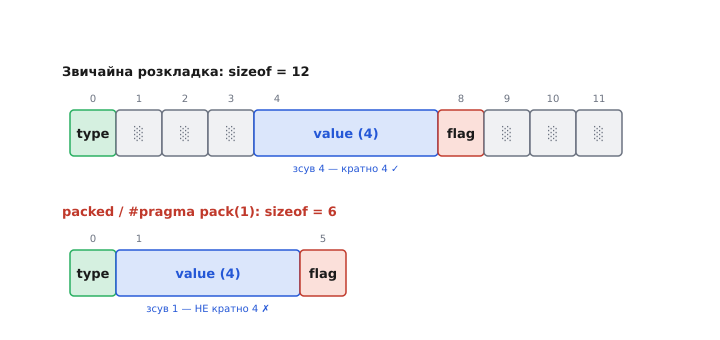

# ⚙️ Пакування структур: як прибрати набивку й не впасти в hard fault

## Задача

Два пристрої мають обмінятися пакетом по дроту. На одному кінці — ваш мікроконтролер, на іншому — приймач: інша плата, інше ядро, а то й той самий чип, але прошивка зібрана іншим компілятором чи під інший рік. Ви описуєте пакет структурою C:

```c
#include <stdint.h>

struct SensorPacket {
    uint8_t  msg_id;      // тип повідомлення
    uint32_t timestamp;   // мітка часу, мілісекунди
    int16_t  temperature; // температура ×100
    uint8_t  flags;       // біти стану
};
```

Наївно ви очікуєте, що по дроту піде **8 байтів**: 1 + 4 + 2 + 1. Ви берете `sizeof(struct SensorPacket)`, віддаєте цей блок у передавач одним махом — `uart_send((uint8_t*)&pkt, sizeof pkt)` — і чекаєте, що приймач прочитає ті самі 8 байтів у свою таку саму структуру.

Не піде. `sizeof` поверне **12**, не 8. А коли ви спробуєте це полагодити директивою пакування — `#pragma pack` або `__attribute__((packed))` — воно нарешті стане 8, пакет полетить правильно… а через тиждень прошивка на Cortex-M0 почне падати в **hard fault** у місці, яке до пакування працювало бездоганно. І впаде не там, де ви пакували, а там, де хтось невинно взяв **адресу одного поля**.

Ця вставка — про те, що саме роблять директиви пакування, звідки береться та зникла набивка, чому запакована структура — це набита міна на ядрах без невирівняного доступу, і як передати пакет байт-у-байт так, щоб він летів правильно й **нікого не ронив**.

## Ідея: набивка — це вирівнювання, застигле в структурі

Перше, що треба зрозуміти: 4 зайві байти взялися не з примхи компілятора. Це **набивка** (англ. *padding*) — невидимі байти-заповнювачі, які він вставляє між полями, щоб кожне поле лягло на адресу, зручну для процесора.

Правило одне й воно з заліза: поле розміром N байтів має починатися з адреси, кратної своєму [вирівнюванню](root:sf-apps/memory-alignment) — для простих типів це зазвичай і є N. `uint32_t` хоче адресу, кратну 4; `int16_t` — кратну 2; `uint8_t` бере будь-яку. Компілятор розкладає поля по порядку й **посуває кожне вперед** до найближчої підхожої адреси, а діру між ними затикає набивкою.

Пройдімо по `SensorPacket` байт за байтом. Хай структура починається з адреси, кратної 4 (компілятор це гарантує):

```
Зсув  Поле          Чому саме тут
  0    msg_id        uint8_t — будь-яка адреса годиться
  1    ░ ░ ░         3 байти набивки: timestamp хоче адресу, кратну 4,
                     а наступна вільна — 1. Найближча кратна 4 — це 4.
  4    timestamp     uint32_t лягло на 4 ✓ (займає 4..7)
  8    temperature   int16_t хоче кратну 2; 8 кратне 2 ✓ (займає 8..9)
 10    flags         uint8_t на 10 ✓
 11    ░             1 байт набивки: sizeof мусить бути кратним
                     вирівнюванню структури (4), тож 11 → 12
 ────
 12    sizeof = 12, а не 8
```

Дві речі варто окремо назвати. Перша: набивка **між** полями (зсуви 1–3) — щоб догодити вирівнюванню наступного поля. Друга: набивка **в кінці** (зсув 11) — «хвостова». Вона потрібна, щоб у масиві таких структур **кожен наступний елемент** теж починався з вирівняної адреси: якби `sizeof` був 11, другий елемент почався б зі зсуву 11, і його `timestamp` виявився б на адресі 15 — не кратній 4. Тому структуру добивають до кратної її найбільшому вирівнюванню.

> 🔧 **Навіщо це.** Набивка — не марнотратство, а плата за швидкість і за саму можливість доступу. На ядрі, що вміє невирівняний доступ, вирівняне поле читається однією інструкцією замість кількох; на ядрі, що **не вміє** (Cortex-M0), вирівнювання — це різниця між «прочиталося» і «hard fault». Компілятор за замовчуванням розкладає структуру так, щоб кожне поле було доступне безпечно й швидко. Пакування цю гарантію **знімає** — і всю відповідальність перекладає на вас.

Тепер стає видно, що робить директива пакування: вона наказує компілятору **вирівнювання полів = 1**, тобто «клади поля впритул, ніякої набивки». Набивка зникає, `sizeof` падає до 8 — рівно стільки, скільки корисних байтів. Але разом із набивкою зникає й **вирівнювання**: `timestamp` тепер починається зі зсуву 1, а не 4.


*Пакування прибирає набивку — `sizeof` падає, поля лягають впритул. Ціна: поле, що раніше лежало на вирівняній адресі (кратній 4), тепер починається з довільного зсуву. Тут показано меншу структуру `{uint8; uint32; uint8}`: звичайно — 12 байтів із набивкою, запаковано — 6, але `value` тепер зі зсуву 1, не кратного 4.*

## Робочий код: та сама структура з набивкою і без

Подивімося на це в реальному коді, який можна закинути в прошивку. Обидва варіанти — та сама структура, різниця лише в директиві.

**Синтаксис пакування — два діалекти.** GCC і Clang розуміють атрибут `__attribute__((packed))`; він переносний між цими компіляторами й типовий у прошивковому коді. MSVC та частина вбудованих компіляторів воліють `#pragma pack`. Часто в кодовій базі бачать обидва, огорнуті в макрос, щоб код збирався скрізь. Тримаймося атрибута GCC/Clang — це те, з чим ви найчастіше стрінетеся на ARM-прошивці.

```c
#include <stdint.h>
#include <stddef.h>   // offsetof

// ── Звичайна структура: компілятор вставляє набивку ──
struct SensorPacket {
    uint8_t  msg_id;
    uint32_t timestamp;
    int16_t  temperature;
    uint8_t  flags;
};

// ── Та сама структура, запакована: набивки нема ──
struct __attribute__((packed)) SensorPacketPacked {
    uint8_t  msg_id;
    uint32_t timestamp;
    int16_t  temperature;
    uint8_t  flags;
};
```

Що покаже `sizeof` і `offsetof` (макрос, що повертає зсув поля в байтах):

```c
// Звичайна:
sizeof(struct SensorPacket)                       == 12
offsetof(struct SensorPacket, msg_id)             == 0
offsetof(struct SensorPacket, timestamp)          == 4    // ← посунуте набивкою
offsetof(struct SensorPacket, temperature)        == 8
offsetof(struct SensorPacket, flags)              == 10

// Запакована:
sizeof(struct SensorPacketPacked)                 == 8
offsetof(struct SensorPacketPacked, msg_id)       == 0
offsetof(struct SensorPacketPacked, timestamp)    == 1    // ← впритул, НЕ кратне 4
offsetof(struct SensorPacketPacked, temperature)  == 5
offsetof(struct SensorPacketPacked, flags)        == 7
```

Ось воно, чорним по білому. Пакування зробило рівно те, чого ви хотіли для дроту: 8 щільних байтів, кожне поле на передбачуваному зсуві, жодної діри. Здавалося б — перемога. Насправді ви щойно заклали під код відкладену бомбу, і щоб побачити її, треба спуститися на рівень інструкцій.

## Пастка: коли зникає набивка, зникає й гарантія доступу

`timestamp` у запакованій структурі лежить на зсуві 1. Якщо сама структура опинилася за адресою, кратною 4 (скажімо, `0x2000_0000`), то `timestamp` — за адресою `0x2000_0001`. Це **непарна, зовсім не кратна 4** адреса. І тепер усе залежить від того, **як** ви до цього поля торкаєтеся.

Тут ключова, найменш очевидна річ у всій темі, тож зупинімося на ній ретельно.

**Прямий доступ через структуру — компілятор рятує вас сам.** Коли ви пишете `pkt->timestamp`, компілятор **знає**, що структура запакована й що поле невирівняне. Тому він **не** генерує звичайне читання слова (`LDR`) — він розкладає доступ на **чотири окремі читання байтів** (`LDRB`) і збирає з них 32-бітне число зсувами. Повільніше — але **безпечно навіть на Cortex-M0**, бо кожне окреме читання байта вирівняне за визначенням (байт можна взяти з будь-якої адреси).

**Взяття адреси члена — рятунок зникає.** А тепер ви пишете невинне:

```c
uint32_t *p = &pkt->timestamp;   // ← ось тут закладено міну
```

Ви взяли **адресу** поля `timestamp` і поклали її у звичайний `uint32_t*`. З погляду типів усе ніби гаразд — `timestamp` таки `uint32_t`. Але значення цього вказівника — `0x2000_0001`, адреса **не кратна 4**. А тип `uint32_t*` каже всьому подальшому коду: «за цією адресою лежить нормальний, вирівняний `uint32_t`». Компілятор **забув**, що поле було запаковане: ця інформація жила в типі структури, а звичайний `uint32_t*` її не несе.

Тепер будь-хто, хто розіменує `p`, згенерує **звичайне** читання слова — `LDR`. Наприклад:

```c
uint32_t t = *p;   // компілятор бачить звичайний uint32_t* → інструкція LDR
```

На Cortex-M3/M4/M7 (архітектура ARMv7-M) це, найімовірніше, **пройде** — ці ядра вміють невирівняне читання слова й тихо його виконають (повільніше, ніж вирівняне, але без збою). І саме тому пастка така підступна: ви розробляєте й тестуєте на «жирному» ядрі, все працює, ви перекидаєте той самий код на дешевий Cortex-M0 у серійному виробі — і **hard fault**.

Бо Cortex-M0 (архітектура ARMv6-M) невирівняного доступу до слова **не вміє взагалі**. Не «повільно», а ніяк: інструкція `LDR`/`STR` за адресою, не кратною 4, **завжди** породжує помилку вирівнювання, яка на цьому ядрі одразу стає hard fault. Тут немає навіть перемикача, яким можна дозволити невирівняний доступ (на ARMv7-M є біт `CCR.UNALIGN_TRP`, що керує пасткою; на ARMv6-M керувати нічим — заборонено назавжди). Читання `*p` за адресою `0x2000_0001` — миттєвий крах.


*Та сама запакована структура, два способи торкнутися поля. Прямий доступ `p->value`: компілятор знає, що поле невирівняне, і розкладає читання на побайтові `LDRB` — безпечно навіть на Cortex-M0. Взяття адреси `&p->value` кладе невирівняний вказівник у звичайний `uint32_t*` — тип «забув» про пакування, і будь-яке розіменування піде звичайним словним `LDR` → hard fault на ядрі без невирівняного доступу.*

Найгидкіше в цьому — **де воно вилазить**. Рядок `&pkt->timestamp` сам по собі не падає: взяти адресу можна завжди. Падає той, хто пізніше цю адресу розіменує, — і часто це геть інша функція, якій ви передали вказівник як аргумент за [угодою про виклик](root:hw-arch/calling-convention):

```c
void log_timestamp(const uint32_t *ts) {
    printf("t = %lu\n", (unsigned long)*ts);  // ← LDR тут → hard fault на M0
}

// десь у коді:
log_timestamp(&pkt->timestamp);   // передали невирівняний вказівник
```

`log_timestamp` не має жодного уявлення, що їй підсунули невирівняну адресу: у її сигнатурі — звичайнісінький `const uint32_t*`. Вона чесно робить `LDR` — і валиться. Причина в одному файлі, крах — в іншому, а стек-трейс показує невинну функцію логування. Класичний збій, що не ловиться поглядом: кожен шматок коду сам по собі коректний.

## Компілятор попереджає — не глушіть попередження

На щастя, сучасні GCC (з версії 9, 2019 рік) і Clang уміють помітити цю пастку в місці її закладання. Коли ви берете адресу члена запакованої структури, компілятор видає застереження:

```
warning: taking address of packed member of 'struct SensorPacketPacked'
         may result in an unaligned pointer value [-Waddress-of-packed-member]
```

Прочитайте його дослівно: «взяття адреси запакованого члена може дати невирівняний вказівник». Це рівно наша ситуація. Попередження вмикається саме тому, що з `&pkt->timestamp` витік невирівняний вказівник у тип, який про невирівняність не знає.

Спокуса, у яку раз у раз падають, — заглушити це попередження прапорцем `-Wno-address-of-packed-member` або локальною прагмою, бо «воно шумить». На платформах, що прощають невирівняний доступ, воно й справді часто нешкідливе, тому багато проєктів його вимикають гуртом. Але якщо ваш код може опинитися на Cortex-M0 (чи будь-де без невирівняного доступу до слова), це попередження — **не шум, а точна вказівка на майбутній hard fault**. Не глушіть його — усувайте причину.

## Правильне рішення: серіалізація байт за байтом

Найнадійніший спосіб взагалі не залежати ні від набивки, ні від вирівнювання, ні від ABI компілятора на тому кінці — **не слати структуру пам'яттю як є**. Замість `(uint8_t*)&pkt` описати формат пакета **вручну, байт за байтом**: викласти кожне поле у визначеному порядку й визначеній розрядності, самотужки розклавши багатобайтові числа на байти.

Це зветься **серіалізація** (англ. *serialization* — «вишикувати в послідовність»): перетворення структури в плаский потік байтів за явним, записаним правилом, яке **не залежить** від того, як конкретний компілятор розкладає пам'ять.

Ось надійний серіалізатор для нашого пакета. Він приймає **звичайну** структуру (з набивкою — байдуже, ми її не шлемо як блок) і викладає 8 байтів у буфер у форматі **little-endian** (молодший байт першим — так домовилися обидва боки):

:::tabs
```c
#include <stdint.h>
#include <stddef.h>

// helper: покласти uint32 у буфер молодшим байтом уперед (little-endian)
static void put_u32_le(uint8_t *buf, uint32_t v) {
    buf[0] = (uint8_t)(v      );
    buf[1] = (uint8_t)(v >>  8);
    buf[2] = (uint8_t)(v >> 16);
    buf[3] = (uint8_t)(v >> 24);
}

static void put_u16_le(uint8_t *buf, uint16_t v) {
    buf[0] = (uint8_t)(v     );
    buf[1] = (uint8_t)(v >> 8);
}

// Серіалізація: структура → рівно 8 байтів дроту. Порядок і розрядність — наші.
// Повертає кількість записаних байтів.
size_t pack_sensor(const struct SensorPacket *p, uint8_t *out) {
    out[0] = p->msg_id;                                  // 1 байт
    put_u32_le(&out[1], p->timestamp);                   // 4 байти
    put_u16_le(&out[5], (uint16_t)p->temperature);       // 2 байти
    out[7] = p->flags;                                   // 1 байт
    return 8;
}
```
```python
import struct

# Серіалізація: поля → рівно 8 байтів дроту. Порядок і розрядність — наші.
# Формат "<B I h B": < — little-endian, БЕЗ набивки/вирівнювання;
# B=uint8, I=uint32, h=int16 (temperature знакове ×100).
def pack_sensor(msg_id, timestamp, temperature, flags):
    return struct.pack("<B I h B", msg_id, timestamp, temperature, flags)
```
```go
package sensor

import "encoding/binary"

type SensorPacket struct {
	MsgID       uint8
	Timestamp   uint32
	Temperature int16
	Flags       uint8
}

// Серіалізація: структура → рівно 8 байтів дроту. Порядок і розрядність — наші.
// binary.LittleEndian кладе молодший байт уперед; байти пишемо по одному —
// жодного припущення про розкладку структури в пам'яті.
func PackSensor(p SensorPacket, out []byte) int {
	out[0] = p.MsgID                                            // 1 байт
	binary.LittleEndian.PutUint32(out[1:], p.Timestamp)        // 4 байти
	binary.LittleEndian.PutUint16(out[5:], uint16(p.Temperature)) // 2 байти
	out[7] = p.Flags                                            // 1 байт
	return 8
}
```
```js
// Серіалізація: поля → рівно 8 байтів дроту. Порядок і розрядність — наші.
// DataView з прапорцем littleEndian=true кладе молодший байт уперед;
// setInt16 знакове (temperature ×100).
function packSensor(msgId, timestamp, temperature, flags) {
  const buf = new Uint8Array(8);
  const dv = new DataView(buf.buffer);
  dv.setUint8(0, msgId);                 // 1 байт
  dv.setUint32(1, timestamp, true);      // 4 байти
  dv.setInt16(5, temperature, true);     // 2 байти
  dv.setUint8(7, flags);                 // 1 байт
  return buf;
}
```
:::

І симетричний розбір на приймачі — теж байт за байтом, з жодним припущенням про розкладку структури відправника:

:::tabs
```c
static uint32_t get_u32_le(const uint8_t *buf) {
    return  (uint32_t)buf[0]
         | ((uint32_t)buf[1] <<  8)
         | ((uint32_t)buf[2] << 16)
         | ((uint32_t)buf[3] << 24);
}

static uint16_t get_u16_le(const uint8_t *buf) {
    return (uint16_t)(buf[0] | (buf[1] << 8));
}

// Десеріалізація: 8 байтів дроту → структура. Заповнюємо ЗВИЧАЙНУ структуру.
void unpack_sensor(const uint8_t *in, struct SensorPacket *p) {
    p->msg_id      = in[0];
    p->timestamp   = get_u32_le(&in[1]);
    p->temperature = (int16_t)get_u16_le(&in[5]);
    p->flags       = in[7];
}
```
```python
import struct

# Десеріалізація: 8 байтів дроту → кортеж полів. Той самий формат "<B I h B".
# h повертає знакове int16 (temperature ×100) автоматично.
def unpack_sensor(data):
    msg_id, timestamp, temperature, flags = struct.unpack("<B I h B", data)
    return msg_id, timestamp, temperature, flags
```
```go
package sensor

import "encoding/binary"

// Десеріалізація: 8 байтів дроту → структура. Читаємо побайтово,
// binary.LittleEndian збирає багатобайтові числа з молодшого байта.
func UnpackSensor(in []byte) SensorPacket {
	return SensorPacket{
		MsgID:       in[0],
		Timestamp:   binary.LittleEndian.Uint32(in[1:]),
		Temperature: int16(binary.LittleEndian.Uint16(in[5:])),
		Flags:       in[7],
	}
}
```
```js
// Десеріалізація: 8 байтів дроту → об'єкт полів. littleEndian=true;
// getInt16 повертає знакове (temperature ×100).
function unpackSensor(data) {
  const dv = new DataView(data.buffer, data.byteOffset, data.byteLength);
  return {
    msgId:       dv.getUint8(0),
    timestamp:   dv.getUint32(1, true),
    temperature: dv.getInt16(5, true),
    flags:       dv.getUint8(7),
  };
}
```
:::

Розберімо, чому це — правильна відповідь, а не просто «довший спосіб зробити те саме».

**Доступ завжди вирівняний.** Ми читаємо й пишемо **лише окремі байти** (`buf[0]`, `buf[1]`…). Байт можна взяти з будь-якої адреси на будь-якому ядрі — жодного `LDR` за невирівняною адресою, жодного hard fault ні на M0, ні деінде. Складання числа зі зсувів (`<< 8`, `<< 16`) відбувається **в регістрах**, а не через невирівняний доступ до пам'яті.

**Формат не залежить від ABI.** Порядок байтів (little-endian), розрядність кожного поля (`u32`, `u16`), відсутність набивки — усе це **зашито в код серіалізатора**, а не віддано на розсуд компілятора. Той, хто пише розбір на іншому кінці, читає той самий формат — і йому байдуже, який у нього `sizeof(struct)`, чи є набивка, LP64 чи LLP64, GCC чи MSVC. Обидва боки домовилися про **байти на дроті**, а не про розкладку пам'яті. Це і є суть: контракт — це послідовність байтів, а структура в пам'яті — приватна справа кожного боку.

**Порядок байтів під контролем.** Слати структуру блоком означало б ще й мовчки прив'язатися до порядку байтів відправника. Якби один пристрій був little-endian, а інший big-endian, `timestamp`, надісланий блоком, прочитався б із перевернутими байтами. У серіалізаторі ми **явно** обрали little-endian — і обидва боки читають однаково незалежно від власного порядку байтів процесора.

> 🔧 **Навіщо це.** Ручна серіалізація виглядає марудною поруч із «шльопнув структуру в UART», але вона знімає **весь** клас проблем одразу: невирівняний доступ, розбіжність набивки між компіляторами, порядок байтів, розмір `long`. Ви пишете десяток рядків `put_*`/`get_*` — і пакет летить однаково між будь-якими двома пристроями, зібраними будь-чим. У серйозних протоколах саме так і роблять: формат описаний у байтах, а код серіалізації часто **генерується** з опису повідомлення, щоб обидва боки гарантовано збігалися.

## Коли пакування все ж доречне — і як тоді не впасти

Ручна серіалізація — золотий стандарт для дроту й диска. Але буває, що запакована структура — виправданий інструмент: коли ви **накладаєте** її на вже готовий буфер сирих байтів (регістрова карта периферії, кадр, який дав вам DMA, заголовок формату файлу) і хочете читати поля **за іменами**, а не рахувати зсуви руками. Тоді пакування дає читабельність — але тільки якщо ви граєте за правилами невирівняного доступу.

Головне правило одне: **звертайтеся до полів лише прямим доступом через структуру** (`hdr->length`) і **ніколи не беріть адресу поля** в звичайний вказівник. Прямий доступ компілятор зробить побайтово й безпечно (бо він пам'ятає, що структура запакована); взяття адреси — зруйнує цю гарантію, бо звичайний вказівник про пакування «не знає».

Наприклад, безпечно:

```c
struct __attribute__((packed)) FrameHeader {
    uint8_t  version;
    uint32_t length;   // невирівняне поле (зсув 1)
    uint16_t crc;
};

void handle(const uint8_t *raw) {
    const struct FrameHeader *hdr = (const struct FrameHeader *)raw;

    uint32_t len = hdr->length;   // OK: компілятор читає побайтово, вирівняно
    if (len > MAX_FRAME) reject();
    // ...працюємо з len (це вже звичайне число в регістрі)
}
```

А ось так — **зась**, навіть якщо `hdr->length` поруч працює:

```c
    uint32_t *lenp = &hdr->length;   // ← невирівняний вказівник; попередження
    process(lenp);                   // process зробить LDR → hard fault на M0
```

Різниця лише в тому, чи взяли ви **адресу**. Одне й те саме поле: читати його прямо — безпечно; взяти на нього вказівник — закласти міну. Тримайте це правило в голові щоразу, коли бачите `packed`, і половина hard fault-ів у прошивці з бінарними протоколами обійде вас стороною.

Є ще тонкість, про яку варто знати, навіть якщо ви уникаєте M0. Навіть на ядрах, що загалом вміють невирівняний доступ (ARMv7-M: M3/M4/M7), частина інструкцій вимагає вирівнювання **завжди**, незалежно від будь-яких перемикачів: багатослівні пересилання `LDM`/`STM` і подвійні `LDRD`/`STRD` фолтять на невирівняній адресі беззастережно. Оптимізатор іноді сам обирає такі інструкції — скажімо, згорнути копіювання двох сусідніх полів у один `LDRD`. Тому невирівняний вказівник — ризик **навіть там, де поодинокий `LDR` пройшов би**: не факт, що компілятор згенерує саме поодинокий `LDR`. Це ще один доказ, що покладатися на «наше ядро прощає невирівняний доступ» — крихка стратегія; безпечний доступ (прямий до поля або побайтовий) не залежить від того, яку інструкцію обере оптимізатор.

## Реальний слід у дикій природі: MAVLink на Cortex-M0

Це не гіпотетична страшилка. Точнісінько такий hard fault зловили в бібліотеці **pymavlink** — реалізації протоколу [MAVLink](root:embedded/mavlink-commands), яким дрони говорять із наземними станціями. MAVLink задля стиснення каналу шле повідомлення **щільними, запакованими структурами** — набивки в них нема за задумом, бо кожен байт на тонкій рації коштує. На «жирних» польотних контролерах (Cortex-M4) усе роками працювало. А на дешевому Cortex-M0 код падав у hard fault рівно на доступі до невирівняного поля запакованої структури повідомлення — той самий механізм, що ми розібрали: невирівняне поле, звичайний словний доступ, ядро без невирівняного доступу, крах.

Мораль інженерна, не книжкова: пакування — це **свідомий компроміс**, а не безкоштовна кнопка «зроби компактно». Ви виграєте байти на дроті — і берете на себе обов'язок жодного разу не торкнутися запакованого поля способом, що згенерує невирівняний словний доступ. На платформі, що прощає, борг може роками не пред'являтися. На Cortex-M0 його стягнуть з першого ж невирівняного `LDR`.

## Складність і пастки — стисло

Зберімо докупи те, об що спотикаються найчастіше.

- **`sizeof` не дорівнює сумі полів.** Між полями й у хвості структури компілятор вставляє набивку заради вирівнювання. Наївний підрахунок «1+4+2+1 = 8» дає 12. Ніколи не покладайтеся на розмір «в умі» — беріть `sizeof` і `offsetof`.

- **Пакування прибирає набивку разом із гарантією доступу.** `__attribute__((packed))` / `#pragma pack(1)` дає щільні `sizeof` байтів, але кладе поля на довільні зсуви. Виграш у розмірі оплачений втратою вирівнювання.

- **Прямий доступ до запакованого поля — безпечний; взяття його адреси — ні.** `pkt->field` компілятор читає побайтово (безпечно навіть на M0). `&pkt->field` дає невирівняний вказівник у тип, що про пакування не знає, — і подальше розіменування піде словним `LDR`.

- **Cortex-M0 (ARMv6-M) не вміє невирівняний доступ до слова взагалі.** Невирівняний `LDR`/`STR` — беззастережний hard fault, вимкнути це не можна. На M3/M4/M7 (ARMv7-M) поодинокий невирівняний `LDR`/`STR` за замовчуванням проходить (керується бітом `CCR.UNALIGN_TRP`), але `LDM`/`STM`/`LDRD`/`STRD` фолтять на невирівняній адресі **завжди**.

- **Крах вилазить не там, де причина.** `&pkt->field` не падає сам; падає функція, якій ви віддали цей вказівник і яка зробила `LDR`. Стек-трейс покаже невинного споживача, а не місце, де витік невирівняний вказівник.

- **Не глушіть `-Waddress-of-packed-member`.** Це попередження — точна вказівка на майбутній невирівняний доступ. `-Wno-address-of-packed-member` ховає симптом, а не причину.

- **Для дроту й диска серіалізуйте байт за байтом.** Явний формат (порядок байтів, розрядність кожного поля, жодної набивки) знімає одразу весь клас проблем: невирівнювання, розбіжність набивки між компіляторами, порядок байтів, розмір `long`. Структура в пам'яті лишається приватною справою кожного боку; контракт — це послідовність байтів.

Одним рядком: **набивка — це вирівнювання, застигле в структурі; пакування його розморожує й перекладає борг вирівнювання на вас — а на Cortex-M0 цей борг стягують негайно й безжально.**
