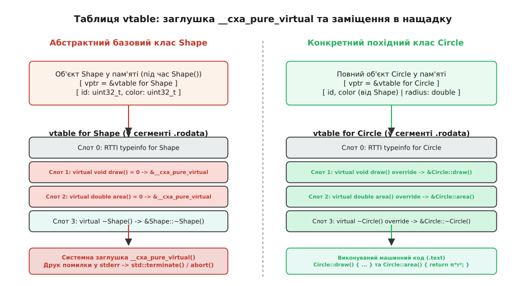
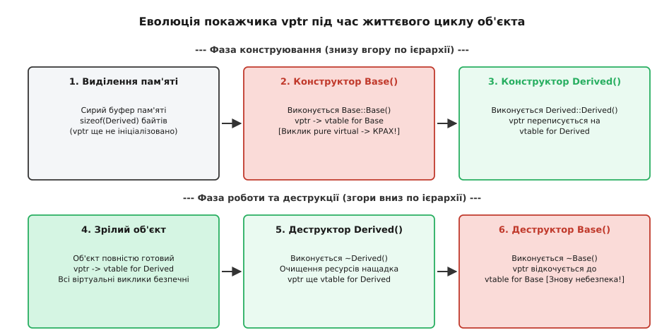
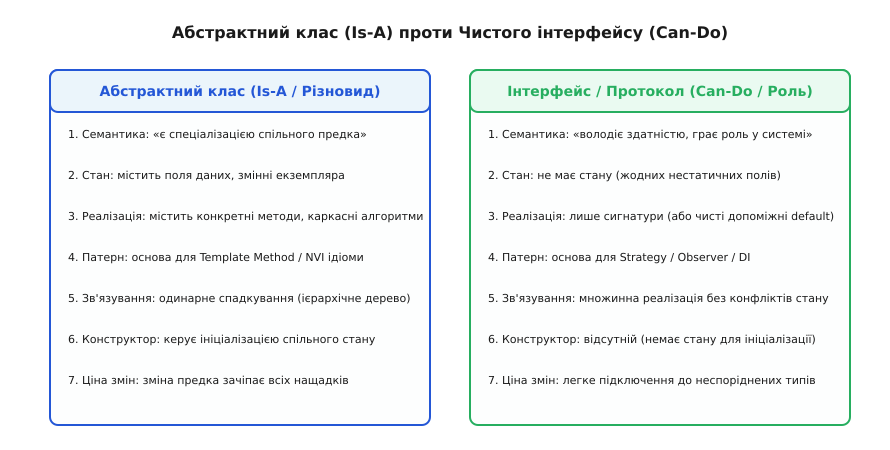
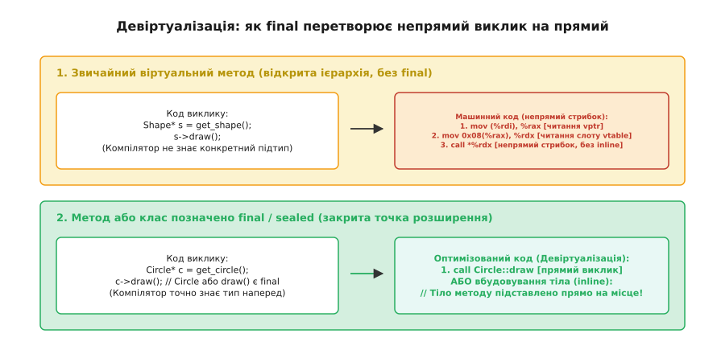

# Абстрактний клас і метод

<preknowlist>
- [Поліморфізм і динамічне зв'язування](root:sf-lang/polymorphism) — віртуальні методи, dynamic dispatch та непрямий виклик через покажчик.
- [Спадкування](root:sf-lang/inheritance) — розширення структури предка та перевизначення поведінки в підкласах.
- [Таблиця віртуальних методів C++](root:sf-devices/virtual-dispatch-cpp) — внутрішня будова vtable, покажчик vptr у пам'яті об'єкта.
- [Конструктор і деструктор](root:sf-lang/constructors-destructors) — порядок народження й знищення об'єктів у ланцюгу спадкування.
- [Шаблонний метод](root:sf-apps/template-method) — каркасний алгоритм у базовому класі з точками розширення для підкласів.
</preknowlist>

Коли програма моделює відкриту систему — наприклад, обробник мережевих протоколів, графічний рушій або звуковий конвеєр, — у коді неминуче з'являється узагальнена сутність, яка знає, *що* потрібно зробити, але фізично не може знати, *як* це зробити. У графічному редакторі базовий тип `Shape` повинен мати операцію обчислення площі `area()` та метод малювання `draw()`. Проте для абстрактної геометричної фігури без конкретної форми ані площа, ані алгоритм растеризації не мають математичного чи програмного змісту. Спроба повернути фіктивне значення `0.0` або залишити тіло порожнім створює небезпечну ілюзію працездатності: об'єкт можна створити, але його поведінка буде хибною або мовчазно зламає розрахунки.

Якщо покластися на перевірку під час виконання — наприклад, викидати виняток «метод не реалізовано», — дефект виявиться лише у продакшені або під час виконання конкретного тестового сценарію. Мова програмування повинна надати статичний важіль: виразити неповноту сутності на рівні системи типів, категорично заборонити створення беззмістовних об'єктів і змусити компілятор вимагати від нащадків заповнення кожної білої плями. Цей інструмент складається з двох взаємопов'язаних понять: **абстрактного класу** (лат. *abstractus* — відірваний від конкретного, витягнутий) та **чистого віртуального методу** (англ. *pure virtual method*).

## Проблема неповної форми та ціна фіктивних заглушок

У наївній об'єктній моделі без підтримки абстрактності розробник змушений створювати базові класи із «заглушками». Розглянемо систему аудіоефектів, де базовий клас `AudioFilter` обробляє буфер семплів.

:::tabs
```c
#include <stdio.h>
#include <stdlib.h>

/* Ручна таблиця функцій без підтримки перевірки абстрактності */
typedef struct AudioFilter AudioFilter;

typedef struct AudioFilterVTable {
    void (*process)(AudioFilter* self, float* buffer, size_t frames);
    double (*get_latency_ms)(const AudioFilter* self);
} AudioFilterVTable;

struct AudioFilter {
    const AudioFilterVTable* vptr;
    int sample_rate;
};

/* Фіктивні функції-заглушки базового класу */
static void base_process_dummy(AudioFilter* self, float* buffer, size_t frames) {
    (void)self; (void)buffer; (void)frames;
    /* Порожнє тіло: звук проходить без змін або псується */
}

static double base_latency_dummy(const AudioFilter* self) {
    (void)self;
    return 0.0; /* Фіктивне значення, яке може спотворити таймінги мікшера */
}

static const AudioFilterVTable g_base_audio_vtable = {
    .process = base_process_dummy,
    .get_latency_ms = base_latency_dummy
};

void audio_filter_init(AudioFilter* filter, int sample_rate) {
    filter->vptr = &g_base_audio_vtable;
    filter->sample_rate = sample_rate;
}
```
```cpp
#include <cstddef>
#include <iostream>
#include <vector>

class AudioFilter {
public:
    explicit AudioFilter(int sample_rate) : m_sample_rate(sample_rate) {}
    virtual ~AudioFilter() = default;

    // Фіктивні реалізації за замовчуванням
    virtual void process(float* buffer, std::size_t frames) {
        // Порожнє тіло: не робить нічого
    }

    virtual double get_latency_ms() const {
        return 0.0; // Фіктивне значення
    }

protected:
    int m_sample_rate;
};
```
:::

Такий підхід несе чотири системні вади:

1. **Дозвіл створення беззмістовного об'єкта.** Програміст може випадково написати `AudioFilter filter(48000);` або виділити пам'ять через фабрику. Об'єкт не виконує жодної фільтрації, але займає ресурси й успішно проходить перевірки типів.
2. **Тихий дефект перевизначення.** Якщо розробник похідного класу `LowPassFilter` помилився в типах аргументів — наприклад, оголосив `void process(double* buffer, size_t frames)` замість `float*`, — компілятор сприйме це як перевантаження нового методу. Віртуальний виклик через покажчик на базовий клас продовжить мовчки викликати порожню базову функцію.
3. **Розмивання контракту.** Читач коду не може відрізнити метод, який *навмисно* має стандартну порожню поведінку (гачок-hook), від методу, який *обов'язково* вимагає унікальної математики для кожного конкретного фільтра.
4. **Невизначеність стану в динамічних мовах.** У динамічно типізованих середовищах відсутність методу виявляється лише тоді, коли потік виконання реально дійде до відповідного рядка (викидаючи `AttributeError` у Python або `TypeError` у JavaScript), що перетворює помилку проєктування на міну сповільненої дії.

Щоб усунути ці дефекти, мова переводить вимогу реалізації зі статусу документації або runtime-винятку у статус **статичного інваріанта компілятора**.

## Чисті віртуальні методи та синтаксис чистоти

У мовах зі статичною типізацією метод, який не має реалізації в базовому класі й зобов'язує кожного конкретного нащадка надати власну версію, називають **чистим віртуальним методом** (або абстрактним методом).

У C++ для цього використовується спеціальний синтаксис присвоєння нуля в кінці сигнатури: `= 0`.

```cpp
class AudioFilter {
public:
    explicit AudioFilter(int sample_rate) : m_sample_rate(sample_rate) {}
    virtual ~AudioFilter() = default;

    // Чисті віртуальні методи: клас більше не має реалізації за замовчуванням
    virtual void process(float* buffer, std::size_t frames) = 0;
    virtual double get_latency_ms() const = 0;

protected:
    int m_sample_rate;
};
```

Синтаксис `= 0` виглядає незвично на тлі ключових слів `abstract` у Java або C#. Він виник через жорстку вимогу зворотної сумісності з мовою C під час розробки C++ наприкінці 1980-х років. Детальніше про дискусії довкола вибору цього позначення й відмову від окремого ключового слова можна дізнатися в [історії введення чистої віртуальності в C++](root:sf-lang/abstract-class/hist-pure-virtual.md).

> 🔧 **Навіщо це.** Синтаксис `= 0` перекладає тягар перевірки повноти архітектури на компілятор. Якщо нащадок не реалізує хоча б один чистий метод предка, він сам автоматично стає абстрактним, і спроба його створити викликає помилку компіляції ще до запуску програми.

### Внутрішнє представлення в компіляторі (AST)

Під час синтаксичного та семантичного аналізу компілятор (зокрема Clang або GCC) зустрічає лексему `= 0` і викликає внутрішній обробник `CXXMethodDecl::setPure(true)`. Одночасно батьківська структура класу `CXXRecordDecl` позначається прапорцем `isAbstract()`.

Цей прапорець впливає на всі наступні стадії компіляції:
1. **Перевірка оголошення змінних.** Забороняється генерація коду виділення пам'яті для об'єктів абстрактного типу на стеку, у купі та у глобальній пам'яті.
2. **Генерація таблиці vtable.** Компілятор формує спеціальний макет таблиці віртуальних функцій, де замість адреси звичайного коду генерується виклик системної заглушки.
3. **Аналіз викликів конструкторів.** Будь-який прямий виклик конструктора поза межами ланцюга спадкування нащадків відхиляється на рівні типізації AST.

### Механізм компіляторної заборони інстанціювання

Щойно клас отримує хоча б один нереалізований чистий віртуальний метод (або успадковує його від предка і не надає власного визначення), спроба створити його прямий екземпляр призводить до категоричної відмови компілятора:

```cpp
AudioFilter f(44100);       // Помилка: cannot allocate an object of abstract type 'AudioFilter'
auto p = new AudioFilter(); // Помилка: invalid new-expression of abstract class type 'AudioFilter'
```

Ця заборона діє незалежно від того, як виділяється пам'ять: на автоматичному стеку, у динамічній купі чи всередині статичного буфера за допомогою placement new. Компілятор аналізує тип на етапі перевірки семантики виразів і блокує будь-яке пряме звернення до конструкторів такого типу для створення самостійних об'єктів.

Водночас оголошення покажчиків і посилань на абстрактний клас є абсолютно законним і становить основу поліморфного коду:

```cpp
void apply_effect(AudioFilter& filter, float* buffer, std::size_t frames) {
    // Безпечний поліморфний виклик: filter гарантовано посилається
    // на конкретний завершений об'єкт підкласу!
    filter.process(buffer, frames);
}
```

Компілятор гарантує інваріант: якщо існує живий об'єкт, адреса якого передана в `AudioFilter&`, цей об'єкт належить повноцінному конкретному класу, де всі віртуальні слоти заміщені реальними функціями.

### Розмір у пам'яті та захист від зрізання об'єкта

Варто звернути увагу на важливу системну деталь: абстрактний клас у C++ має цілком визначений розмір у байтах (`sizeof(AudioFilter)`). Він містить покажчик на таблицю методів (`vptr`, 8 байтів на 64-бітній платформі), власні поля даних (`m_sample_rate`) та вирівнювання (padding). Попри наявність відомого розміру, створення змінної за значенням заборонено.

Це правило одночасно захищає програму від небезпечного дефекту **зрізання об'єкта** (англ. *object slicing*). Якщо функція помилково приймала б абстрактний базовий клас за значенням `void process(AudioFilter filter)`, компілятору довелося б скопіювати лише базову частину конкретного об'єкта `LowPassFilter`, відкинувши поля нащадка й створивши спотворений примірник без конкретної логіки. Заборона інстанціювання абстрактних класів гарантує, що поліморфні об'єкти передаються виключно за посиланням або покажчиком.

## Анатомія пам'яті: vtable та системна заглушка `__cxa_pure_virtual`

Щоб зрозуміти, як абстрактні класи існують у скомпільованому двійковому файлі, зазирнемо у структуру [таблиці віртуальних методів](root:sf-devices/virtual-dispatch-cpp) (vtable).

Для кожного класу, що має віртуальні методи, компілятор створює статичну таблицю покажчиків на функції в сегменті константних даних (`.rodata`). За специфікацією Itanium C++ ABI таблиця містить метадані типу:
* Зміщення до вершини об'єкта (`offset-to-top`).
* Покажчик на структуру RTTI (`typeinfo for ClassName`).
* Масив адрес віртуальних функцій у порядку їхнього оголошення в класі.

Але що записується у слот таблиці, якщо метод оголошено як `= 0` і він не має адреси виконуваного коду?

Покласти нульовий покажчик (`nullptr`) небезпечно: якщо непрямий виклик випадково відбудеться, процесор спробує виконати інструкцію за адресою `0x0`, що викличе загальну помилку захисту пам'яті (Segmentation Fault / Page Fault) без жодного пояснення причин.

Тому за стандартом ABI (зокрема Itanium C++ ABI, який використовують Clang і GCC у Linux та macOS) компілятор записує у слот чистої віртуальної функції адресу спеціальної функції зі стандартної бібліотеки середовища виконання — `__cxa_pure_virtual` (у середовищі MSVC на Windows аналогічна функція має назву `_purecall`).


*Таблиця vtable абстрактного класу Shape містить покажчики на заглушку __cxa_pure_virtual, тоді як vtable конкретного класу Circle заміщує їх адресами скомпільованих методів Circle::draw() та Circle::area().*

Реалізація цієї функції в бібліотеці `libstdc++` або `libc++` надзвичайно проста й безкомпромісна:

```cpp
extern "C" void __cxa_pure_virtual() {
    // Запис діагностичного повідомлення у системний потік помилок
    fputs("pure virtual method called\n", stderr);
    // Миттєве аварійне завершення без виклику деструкторів
    std::terminate();
}
```

Коли створюється конкретний клас-нащадок `Circle`, компілятор генерує для нього власну окрему таблицю `vtable for Circle`. У ній слот чистого методу заміщується адресою реальної скомпільованої функції `Circle::draw()`.

## Життєвий цикл об'єкта: пастка виклику в конструкторах і деструкторах

Якщо компілятор забороняє створювати екземпляри абстрактного класу, як програма взагалі може потрапити у функцію `__cxa_pure_virtual`?

Відповідь криється у механізмі покрокового конструювання об'єктів у C++.

Об'єкт похідного класу не з'являється в пам'яті миттєво. Його народження відбувається суворо пошарово — знизу вгору по дереву спадкування:
1. Виділяється сира пам'ять розміром `sizeof(Derived)`.
2. Викликається конструктор базового класу `Base::Base()`.
3. Усередині конструктора `Base::Base()` об'єкт ще **не є** екземпляром `Derived`! Поля нащадка ще не ініціалізовані, а прихований покажчик `vptr` у пам'яті об'єкта вказує на `vtable for Base`.
4. Лише після повного завершення `Base::Base()` керування переходить до `Derived::Derived()`, і тільки тоді компілятор переписує `vptr` на `vtable for Derived`.


*Під час виконання конструктора базового класу Base() покажчик vptr налаштований на таблицю vtable for Base, тому непрямий виклик віртуального методу неминуче потрапляє у системну заглушку __cxa_pure_virtual і спричиняє аварійний крах процесу.*

Прямий виклик чистої віртуальної функції всередині конструктора базового класу сучасні компілятори зазвичай розпізнають ще під час компіляції:

```cpp
class Base {
public:
    Base() {
        draw(); // Попередження компілятора або помилка: pure virtual call
    }
    virtual void draw() = 0;
};
```

Проте якщо виклик відбувається **непрямо** — через допоміжний метод або інший об'єкт, — компілятор безсилий помітити пастку:

```cpp
class Base {
public:
    Base() {
        setup(); // Виклик невіртуального методу предка
    }

    void setup() {
        // Непрямий виклик: на момент виконання setup() vptr вказує на vtable for Base!
        draw(); 
    }

    virtual void draw() = 0;
    virtual ~Base() = default;
};

class Derived : public Base {
public:
    void draw() override {
        std::cout << "Derived::draw()\n";
    }
};
```

Під час виконання виразу `Derived d;`:
1. Викликається `Base()`, покажчик `vptr` налаштовується на `vtable for Base`.
2. `Base()` викликає `setup()`.
3. `setup()` виконує віртуальний виклик `draw()`, зчитуючи адресу зі слота `vtable for Base`.
4. Слот містить адресу `__cxa_pure_virtual`. Програма миттєво падає з повідомленням `pure virtual method called`.

Точно така ж картина розгортається під час знищення об'єкта у деструкторі: деструктор `~Derived()` очищує поля нащадка, після чого `vptr` відкочується назад до `vtable for Base`. Будь-який віртуальний виклик усередині `~Base()` знову потрапляє у `__cxa_pure_virtual`.

### Чому C++ не викликає метод нащадка з конструктора предка

У мовах на кшталт Java або C# виклик віртуального методу з конструктора базового класу відправляється в метод похідного класу (`Derived::draw()`). Чому C++ обрав іншу поведінку, яка призводить до виклику `__cxa_pure_virtual`?

Це принципове рішення творців мови щодо безпеки пам'яті. У C++ конструктор нащадка виконується *після* конструктора предка. Якби з `Base::Base()` викликався метод `Derived::draw()`, цей метод спробував би звернутися до полів класу `Derived` (рядків, векторів, вказівників, м'ютексів), які на цей момент **ще не ініціалізовані** і містять сміття в пам'яті. У мовах із керованою пам'яттю (Java, C#) усі поля перед конструюванням автоматично зануляються, тому такий виклик звертається до `null` або `0`. У C++ звернення до неініціалізованого ресурсу спричинило б [невизначену поведінку](root:sf-lang/undefined-behavior) та пошкодження пам'яті. Тому динамічний тип об'єкта під час виконання конструктора базового класу чесно зафіксовано як `Base`.

Як дослідити такий збій під зневаджувачем у багатопотоковому коді та безпечно усунути його через фабричний метод, докладно розглянуто в [практичному розборі аварії __cxa_pure_virtual у реальному проекті](root:sf-lang/abstract-class/proj-pure-virtual-crash.md).

## Чиста віртуальна функція з тілом

Поширене хибне уявлення полягає в тому, що чистий віртуальний метод нібито принципово не може мати виконуваного коду. У мові C++ це не так: метод можна оголосити чистим (`= 0`) в описі класу, але надати йому повноцінне тіло за межами класу:

```cpp
class MessageHandler {
public:
    virtual ~MessageHandler() = default;

    // Чистий метод із визначенням за межами класу
    virtual void log_event(const std::string& msg) = 0;
};

// Визначення базової поведінки
void MessageHandler::log_event(const std::string& msg) {
    std::cout << "[DEFAULT LOG]: " << msg << "\n";
}
```

Навіщо потрібна така конструкція? Вона розв'язує дві архітектурні задачі.

### 1. Примусове перевизначення зі збереженням базової логіки

Якщо зробити метод звичайним віртуальним із базовим тілом, нащадок може легко «забути» надати власну специфічну обробку. Зробивши метод чистим віртуальним із тілом, ми досягаємо подвійного ефекту:
* Нащадок **зобов'язаний** явно оголосити перевизначення `override`, інакше він не скомпілюється.
* Водночас нащадок може явно викликати базову логіку за потреби: `MessageHandler::log_event(msg)`.

```cpp
class NetworkHandler : public MessageHandler {
public:
    void log_event(const std::string& msg) override {
        // Явний виклик базової логіки предка
        MessageHandler::log_event(msg);
        // Додаткова специфічна дія
        send_to_remote_syslog(msg);
    }
private:
    void send_to_remote_syslog(const std::string& msg) { /* ... */ }
};
```

Цей патерн часто використовується у великих фреймворках (наприклад, у підсистемах ядра Chromium та компілятора LLVM), коли базовий клас надає складний алгоритм валідації або збору статистики, але категорично вимагає, щоб кожен підтип зареєстрував власну назву та виконав локальні дії.

### 2. Чистий віртуальний деструктор

Іноді виникає ситуація, коли клас є концептуально абстрактним, але всі його методи вже мають готову спільну реалізацію, і зробити чистим віртуальним нема чого.

У такому разі чистим віртуальним оголошують **деструктор**:

```cpp
class AbstractTransaction {
public:
    virtual void commit() { /* спільна логіка */ }
    virtual void rollback() { /* спільна логіка */ }

    // Робимо клас абстрактним через деструктор
    virtual ~AbstractTransaction() = 0;
};

// Тіло чистого деструктора ОБОВ'ЯЗКОВЕ!
AbstractTransaction::~AbstractTransaction() {
    // Очищення спільних ресурсів транзакції
}
```

> ⚠️ **Критичне правило:** чистий віртуальний деструктор **мусить мати тіло**. Коли знищується об'єкт похідного класу, компілятор після виконання `~Derived()` неявно генерує виклик деструктора базового класу `AbstractTransaction::~AbstractTransaction()`. Якщо тіло не визначене, компонувальник (linker) видасть помилку нерозв'язаного символу (`undefined reference to AbstractTransaction::~AbstractTransaction()`).

## Часткова реалізація та патерн Template Method

Головна архітектурна сила абстрактного класу — здатність нести **часткову реалізацію**. Абстрактний клас — це не просто перелік вимог; це діючий каркас (скелет) алгоритму, який поєднує спільні поля стану, інваріанти та незмінний порядок дій.

Цю ідею формалізує класичний патерн проєктування [Шаблонний метод](root:sf-apps/template-method) (Template Method). Базовий клас описує загальний потік виконання у відкритому невіртуальному методі, а окремі варіативні кроки робить чистими або перевизначуваними віртуальними методами.

У сучасному C++ це правило оформлюється як **ідіома невіртуального інтерфейсу** (англ. *Non-Virtual Interface*, NVI):
* **Публічний інтерфейс — невіртуальний.** Він відповідає за контракт виклику, перевірку вхідних параметрів, взяття блокувань, облік часу та підтримання загальних інваріантів.
* **Точки розширення — приватні або захищені віртуальні методи.** Вони відповідають виключно за варіативні деталі конкретного нащадка.

:::tabs
```cpp
#include <iostream>
#include <memory>
#include <chrono>
#include <string_view>

class DataPipeline {
public:
    virtual ~DataPipeline() = default;

    // Каркасний невіртуальний метод (NVI): задає незмінний порядок
    void execute_pipeline(std::string_view raw_payload) {
        std::cout << ">>> Початок обробки транзакції\n";
        auto start = std::chrono::steady_clock::now();

        // Крок 1: обов'язкова перевірка інваріанта
        if (raw_payload.empty()) {
            throw std::invalid_argument("Порожнє корисне навантаження");
        }

        // Крок 2: делегування специфічного кроку нащадку
        parse_and_transform(raw_payload);

        // Крок 3: опціональний гачок (hook)
        if (should_audit()) {
            record_audit_log();
        }

        auto end = std::chrono::steady_clock::now();
        std::cout << "<<< Завершено за "
                  << std::chrono::duration_cast<std::chrono::microseconds>(end - start).count()
                  << " мкс\n";
    }

private:
    // Чистий віртуальний метод: нащадок ЗОБОВ'ЯЗАНИЙ надати синтаксичний аналіз
    virtual void parse_and_transform(std::string_view payload) = 0;

    // Віртуальний гачок із типовою поведінкою: нащадок МОЖЕ змінити за потреби
    virtual bool should_audit() const {
        return true;
    }

    void record_audit_log() {
        std::cout << "[AUDIT]: Запис успішно збережено в журнал\n";
    }
};

class JsonPipeline final : public DataPipeline {
private:
    void parse_and_transform(std::string_view payload) override {
        std::cout << "  Парсинг JSON-дерева: " << payload << "\n";
    }

    bool should_audit() const override {
        return false; // Вимикаємо аудит для високошвидкісного JSON
    }
};
```
```c
#include <stdio.h>
#include <stdlib.h>
#include <stdbool.h>
#include <string.h>

typedef struct DataPipeline DataPipeline;

typedef struct DataPipelineVTable {
    void (*parse_and_transform)(DataPipeline* self, const char* payload);
    bool (*should_audit)(const DataPipeline* self);
} DataPipelineVTable;

struct DataPipeline {
    const DataPipelineVTable* vptr;
};

/* Невіртуальний каркас NVI мовою C */
void data_pipeline_execute(DataPipeline* self, const char* payload) {
    printf(">>> Початок обробки транзакції\n");
    if (!payload || strlen(payload) == 0) {
        fprintf(stderr, "Помилка: порожні дані\n");
        return;
    }

    /* Виклик обов'язкового кроку нащадка */
    self->vptr->parse_and_transform(self, payload);

    /* Виклик опціонального гачка */
    if (self->vptr->should_audit(self)) {
        printf("[AUDIT]: Запис успішно збережено в журнал\n");
    }
    printf("<<< Завершено\n");
}

/* Конкретний нащадок мовою C */
typedef struct JsonPipeline {
    DataPipeline base;
} JsonPipeline;

static void json_parse_impl(DataPipeline* self, const char* payload) {
    (void)self;
    printf("  Парсинг JSON-дерева: %s\n", payload);
}

static bool json_audit_impl(const DataPipeline* self) {
    (void)self;
    return false;
}

static const DataPipelineVTable g_json_vtable = {
    .parse_and_transform = json_parse_impl,
    .should_audit = json_audit_impl
};

void json_pipeline_init(JsonPipeline* pipeline) {
    pipeline->base.vptr = &g_json_vtable;
}
```
:::

За такої організації нащадок `JsonPipeline` не може спотворити таймінги або випадково пропустити перевірку вхідних даних: скелет алгоритму замкнений у публічному методі предка, а нащадок оперує виключно виділеними йому слотами варіативності.

## Абстрактний клас проти інтерфейсу (чистого протоколу)

В об'єктно-орієнтованому проєктуванні вибір між абстрактним класом та інтерфейсом (протоколом/трейтом) визначається відношенням сутностей у предметній області.


*Абстрактний клас представляє відношення класифікації «is-a» зі спільним станом і частковою реалізацією, тоді як інтерфейс визначає контракт здатності «can-do» без прив'язки до внутрішнього стану екземпляра.*

Головна відмінність зводиться до двох понять:
1. **Семантика спорідненості (Is-A проти Can-Do).** Абстрактний клас моделює онтологічну сутність: `Dog` *є різновидом* `Animal`. Інтерфейс моделює здатність або роль у системі: `Dog` *вміє грати роль* `Serializable` або `Comparable`. Класи, абсолютно не споріднені між собою (наприклад, `Document` та `AudioStream`), можуть одночасно реалізовувати один і той самий інтерфейс `Streamable`.
2. **Наявність стану.** Інтерфейс у класичному розумінні є безстанним (stateless): він не може містити нестатичних полів даних екземпляра. Абстрактний клас інкапсулює спільні змінні стану (`id`, `mutex`, `buffer_size`) та керує їхньою ініціалізацією у своєму конструкторі.

### Системні механізми диспетчеризації інтерфейсів

На рівні машинного коду та віртуальних машин різниця між абстрактним класом та інтерфейсом проявляється у швидкодії виклику:

* **Абстрактний клас (одинарне спадкування):** зміщення методу в таблиці `vtable` є **фіксованою константою часу компіляції**. Процесор робить прямий непрямий перехід `call *offset(%rax)`. Це найшвидший поліморфний виклик.
* **Множинне спадкування інтерфейсів у C++ (Thunks):** коли клас реалізує кілька абстрактних інтерфейсів (`class SocketStream : public IReadable, public IWritable`), об'єкт містить кілька покажчиків `vptr`. Звернення через покажчик `IWritable*` вимагає зміщення адреси `this`. Компілятор генерує спеціальні мікрофункції — перехідники (thunks), які коригують регістр покажчика об'єкта перед стрибком у цільовий метод нащадка.
* **Інтерфейси у віртуальних машинах (JVM / .NET CLR):** оскільки клас може реалізовувати довільну кількість інтерфейсів у довільному порядку, один і той самий метод інтерфейсу може знаходитися на різних зміщеннях у різних класах. JVM використовує спеціальну інструкцію `invokeinterface`, яка виконує пошук у таблиці інтерфейсів (`itable`) або спирається на оптимізацію мономорфного інлайн-кешування (Monomorphic Inline Caching, MIC).
* **Товсті покажчики в Rust (`&dyn Trait`):** у мові Rust поліморфізм реалізовано через товстий покажчик (fat pointer) розміром у два слова (16 байтів): одне слово вказує на сирі дані структури, а друге — на статично згенеровану таблицю віртуальних методів саме для цієї пари (тип, типаж).
* **Інтерфейси в Go (`iface`):** значення інтерфейсу в Go містить покажчик на структуру опису типу `itab` (яка містить хеш типу й адреси методів) та покажчик на дані. Таблиця `itab` генерується динамічно під час першого присвоєння типу інтерфейсу.

### Моделі інтерфейсів у різних екосистемах

Різні мови програмування підходять до цього розмежування по-різному:

:::tabs
```cpp
// C++: немає ключового слова interface;
// Інтерфейс — це абстрактний клас без полів і лише з чистими віртуальними методами
class ISerializable {
public:
    virtual ~ISerializable() = default;
    virtual std::vector<uint8_t> serialize() const = 0;
    virtual void deserialize(const std::vector<uint8_t>& data) = 0;
};
```
```java
// Java: чіткий поділ на abstract class та interface
// Інтерфейс підтримує множинне наслідування поведінки (через default-методи),
// але категорично не має стану екземпляра (полів)
public interface SerializableProtocol {
    byte[] serialize();
    void deserialize(byte[] data);

    // Допоміжний метод за замовчуванням
    default int getVersion() { return 1; }
}
```
```rust
// Rust: повна відмова від успадкування класів на користь типажів (traits)
pub trait Serializable {
    fn serialize(&self) -> Vec<u8>;
    fn deserialize(&mut self, data: &[u8]) -> Result<(), String>;
}
```
```go
// Go: неявна структурна типізація інтерфейсів
// Тип автоматично задовольняє інтерфейс, якщо реалізує потрібні методи
type Serializable interface {
    Serialize() ([]byte, error)
    Deserialize(data []byte) error
}
```
:::

Чому мови зі спадкуванням класів (Java, C#, Swift) заборонили множинне успадкування абстрактних класів, але дозволили множинну реалізацію інтерфейсів?

Причина — **проблема ромба** (англ. *diamond problem*): якщо клас спадкує стан від двох різних абстрактних предків, які мають спільного пращура, у пам'яті об'єкта дублюються поля стану, що призводить до неоднозначності зміщень і потреби у складних механізмах віртуального спадкування (`virtual public Base` у C++). Оскільки інтерфейси не мають стану, множинна реалізація багатьох інтерфейсів не створює жодних конфліктів у пам'яті.

## Статичний поліморфізм як альтернатива абстрактним класам

Динамічний поліморфізм через абстрактні класи та таблиці `vtable` незамінний тоді, коли набір об'єктів невідомий на етапі компіляції (наприклад, поліморфний контейнер `std::vector<std::unique_ptr<AudioFilter>>`). Проте за цю гнучкість доводиться платити непрямими викликами та неможливістю інлайнінгу.

Якщо ж конкретний тип відомий у місці використання під час компіляції, аналогічний контрактний поділ можна реалізувати за допомогою **статичного поліморфізму** через шаблонний патерн CRTP (Curiously Recurring Template Pattern):

```cpp
template <typename Derived>
class StaticAudioFilter {
public:
    void process(float* buffer, std::size_t frames) {
        // Статичний NVI-каркас: нуль накладних витрат у рантаймі
        static_cast<Derived*>(this)->process_impl(buffer, frames);
    }
};

class FastLowPass : public StaticAudioFilter<FastLowPass> {
public:
    void process_impl(float* buffer, std::size_t frames) {
        // Прямий виклик: компілятор повністю вбудовує цей код!
        for (std::size_t i = 0; i < frames; ++i) buffer[i] *= 0.5f;
    }
};
```

У C++20 цю задачу ще елегантніше розв'язують **концепти** (`concepts`), які перевіряють наявність потрібних методів і типів узагалі без спадкування. Вибір між абстрактним класом та концептом зводиться до питання часу зв'язування: чи потрібна гетерогенна колекція в рантаймі (абстрактний клас), чи достатньо мономорфізації під час компіляції (концепти).

## Закриття точок розширення: `final` та `sealed`

Поліморфізм і віртуальні методи дають гнучкість, але надмірна або безконтрольна відкритість шкодить архітектурі та продуктивності. Коли розробник проєктує бібліотеку, йому часто необхідно зафіксувати поведінку певного методу або заборонити подальше спадкування від конкретного класу, щоб гарантувати збереження інваріантів безпеки.

Для цього використовуються механізми **запечатування ієрархій**:
* `final` у C++ та Java.
* `sealed` у C#, Kotlin та Scala.

```cpp
// Заборона подальшого спадкування від класу
class Sha256Engine final : public CryptographicHash {
public:
    void update(const uint8_t* data, size_t len) override;
    std::vector<uint8_t> finalize() override;
};

// Спроба успадкувати викликає помилку компіляції:
// class CustomSha : public Sha256Engine {}; // Error: cannot derive from 'final' class
```

Також ключове слово `final` можна застосувати до окремого віртуального методу:

```cpp
class BaseProtocol : public Protocol {
public:
    // Нащадок реалізує метод і забороняє своїм підкласам змінювати його
    void authenticate() override final {
        perform_strict_handshake();
    }
};
```

### Оптимізація девіртуалізації (Devirtualization)

Крім захисту архітектури, `final` є критично важливим для швидкодії компілятора та реалізації принципу [абстракцій без витрат](root:sf-lang/zero-cost-abstractions).

Звичайний віртуальний виклик вимагає щонайменше трьох машинних операцій:
1. Завантаження адреси `vtable` за покажчиком `vptr` з пам'яті об'єкта: `mov (%rdi), %rax`.
2. Зчитування адреси методу за відповідним зміщенням: `mov 0x10(%rax), %rdx`.
3. Непрямий стрибок за адресою: `call *%rdx`.

Непрямий виклик навантажує блок передбачення переходів процесора (branch target buffer) і принципово **блокує вбудовування коду** (`inline`), оскільки компілятор не знає конкретного адресата на етапі збирання.


*Ключове слово final повідомляє компілятору про неможливість подальшого перевизначення методу, дозволяючи оптимізатору замінити непрямий виклик через vtable на прямий перехід або повне вбудовування коду (inline).*

Коли компілятор бачить, що клас або метод позначено `final`, він виконує **девіртуалізацію**:
* Непрямий виклик замінюється прямим машинним переходом: `call Sha256Engine::update`.
* За увімкненої оптимізації (`-O2` / `-O3`) тіло методу може бути повністю вбудоване безпосередньо в місце виклику.
* Зникає звернення до пам'яті за таблицею `vtable`, а оптимізатор отримує можливість виконати згортання констант і векторизацію циклів.

Крім явного ключового слова `final`, сучасні компілятори виконують девіртуалізацію під час оптимізації на етапі компонування (Link-Time Optimization, LTO): якщо аналіз усієї програми показує, що абстрактний клас має рівно одного нащадка у всьому двійковому файлі, компілятор автоматично девіртуалізує всі виклики.

### Запечатані ієрархії та вичерпний аналіз відповідностей

У сучасних мовах (Kotlin, Scala, Java 17+, C# 11+) концепція запечатування перетворилася на інструмент побудови **алгебраїчних типів даних** (суми типів / discriminated unions).

Коли базовий абстрактний клас оголошується як `sealed`, мова вимагає, щоб усі можливі його прямі нащадки були перелічені в тому ж модулі або файлі:

```java
// Java 17: запечатаний інтерфейс з фіксованим списком нащадків
public sealed interface Result<T> permits Success, Failure {}

public final class Success<T> implements Result<T> {
    private final T value;
    public Success(T value) { this.value = value; }
    public T value() { return value; }
}

public final class Failure<T> implements Result<T> {
    private final String error;
    public Failure(String error) { this.error = error; }
    public String error() { return error; }
}
```

Головна перевага запечатаної ієрархії — **вичерпний аналіз відповідностей** (exhaustive pattern matching). Компілятор точно знає весь замкнений набір типів, тому у конструкції сортування `switch` / `match` не потрібна гілка `default`. Якщо розробник додасть новий підтип у запечатану ієрархію, компілятор знайде всі місця в системі, де цей новий випадок не оброблено, і видасть помилку.

## Практичні правила та інженерні антипатерни

Робота з абстрактними класами вимагає суворої дисципліни, сформульованої десятиліттями промислової розробки:

1. **Завжди оголошуйте віртуальний деструктор у базовому абстрактному класі.** Якщо об'єкт буде знищено через покажчик на базовий тип `delete base_ptr;` (або через `std::unique_ptr<Base>`), за відсутності `virtual ~Base()` викличеться лише деструктор предка. Поля нащадка залишаться незнищеними, що призведе до витоку пам'яті, дескрипторів або блокувань відповідно до принципу [RAII](root:sf-lang/raii).
   * Виняток: якщо поліморфне видалення через базовий покажчик заборонене за задумом, деструктор базового класу роблять `protected non-virtual`.
2. **Забороняйте або захищайте операції копіювання та переміщення в базовому абстрактному класі.** Копіювання абстрактного базового класу через `Base b1 = derived;` або присвоєння `base1 = base2;` веде до часткового копіювання стану й зрізання полів нащадка. Базовий клас повинен або явно видалити конструктор копіювання та оператор присвоєння (`= delete`), або перенести їх у секцію `protected`.
3. **Уникайте антипатерну «Божественний абстрактний клас» (God Abstract Class).** Якщо базовий клас містить десятки методів і поля для всіх мислимих потреб усіх можливих нащадків, порушується принцип розділення інтерфейсів (Interface Segregation Principle). Нащадки змушені тягнути зайвий стан і залежати від методів, які їм непотрібні. Базовий клас повинен містити лише той стан і методи, які необхідні для функціонування його власного каркасного алгоритму.
4. **Надавайте перевагу композиції перед спадкуванням.** Якщо вам потрібна лише поведінка іншого класу, використовуйте патерн Стратегія (через інтерфейс або функціональний об'єкт), а не успадковуйте важкий абстрактний клас заради двох допоміжних функцій. Спадкування створює найжорсткіший вид зв'язності (coupling) у кодовій базі.
5. **Ніколи не викликайте віртуальні методи з конструкторів і деструкторів.** Ця дія або призведе до аварійного виклику `__cxa_pure_virtual`, або викличе базову версію замість очікуваної версії нащадка, порушивши логіку ініціалізації об'єкта.
