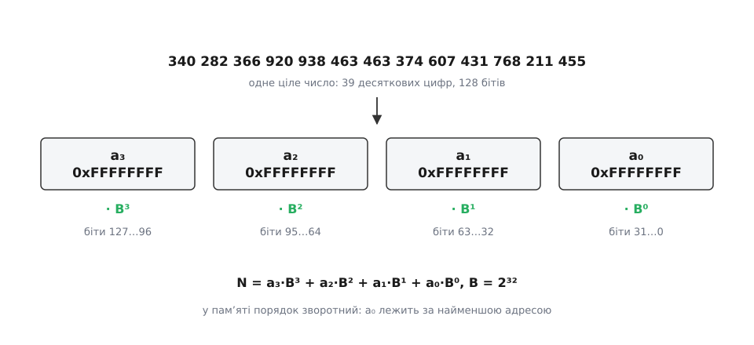
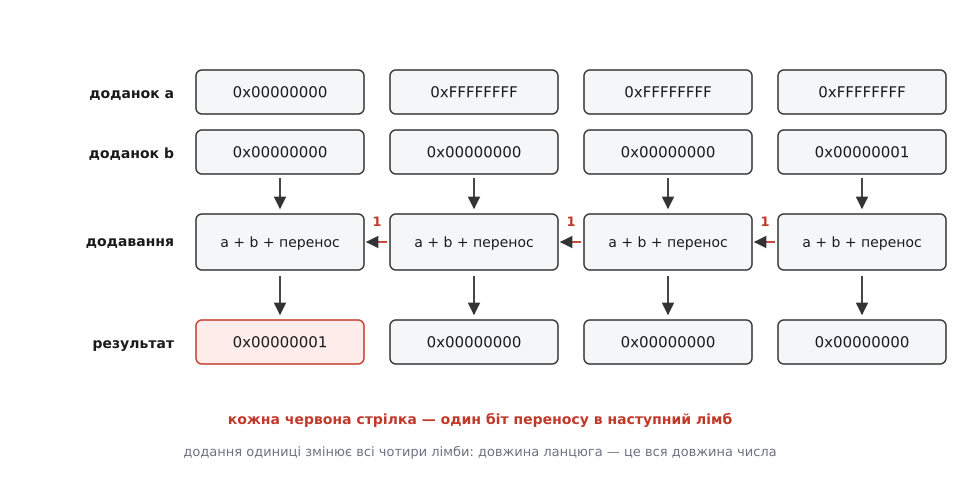
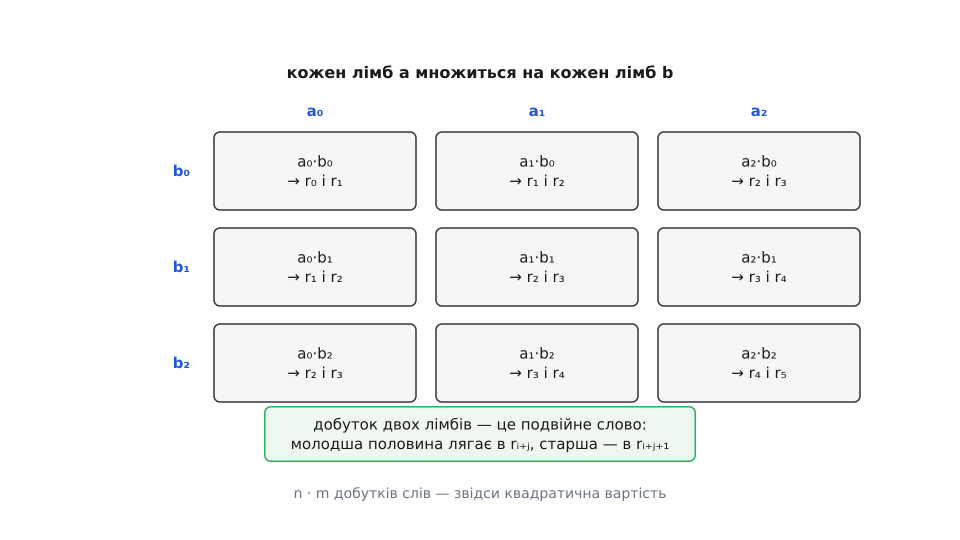
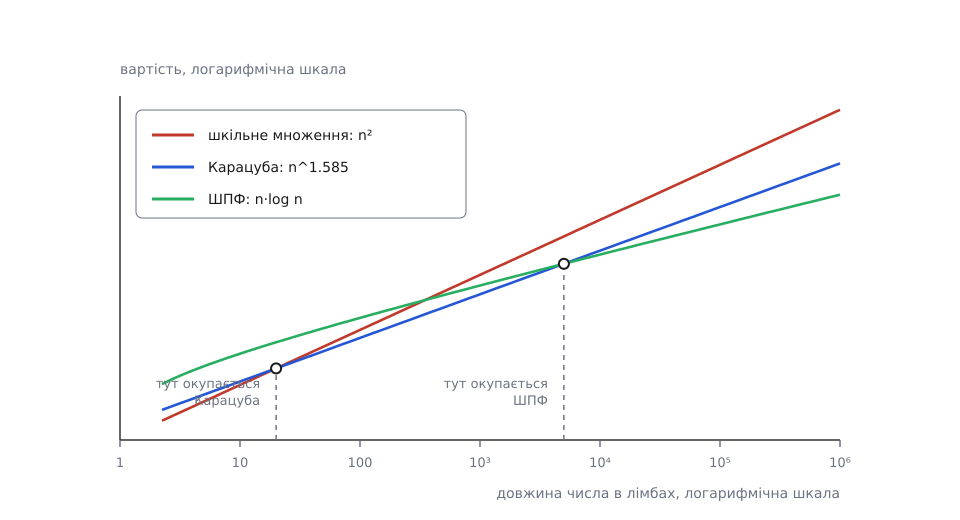

# Довга арифметика

<preknowlist>
- [Біти й порядок байтів](root:sf-algorithms/bits-bytes-endianness) — що таке машинне слово, з яких байтів воно складається і в якому порядку лежить у пам'яті.
- [Позиційні системи](root:math-number-theory/positional-systems) — запис числа цифрами за основою: значення дорівнює сумі цифр, помножених на степені основи.
- [Переповнення](root:sf-lang/overflow-wraparound) — що робить машина, коли результат не влазить у розрядну сітку, і чому беззнакове додавання загортається за модулем.
- [Цілі типи в C/C++](root:sf-lang/integer-types-c) — ширина типів, беззнакові й знакові, що саме гарантує стандарт.
- [Прапорці АЛП](root:hw-arch/alu-flags) — прапорець переносу як окремий вихід суматора й команди, що його читають.
- [Асимптотична складність](root:computability/asymptotic-complexity) — що означають O(n) і O(n²) і як міряють вартість алгоритму від розміру входу.
</preknowlist>

Ключ RSA на 2048 бітів — це одне ціле число з 617 десяткових цифр. Процесор, який щохвилини перевіряє такі підписи, уміє додавати числа завширшки 64 біти — це двадцять цифр, і жодним прапорцем його не вмовити взяти двадцять першу. Два факти живуть поруч лише тому, що між ними стоїть окремий шар коду, який складає велике число з маленьких і виконує над ним арифметику вручну — так само, як людина рахує стовпчиком, тільки «цифрами» тут є цілі машинні слова.

Напрошується простіше: зробити регістри ширшими. Але ширина в процесорі не одна — це ширина регістрів, ширина суматора в АЛП, ширина шин даних, ширина полів в [кодуванні інструкцій](root:hw-arch/isa-encoding), розмір кожної комірки кеша. Подвоїти її означає подвоїти площу кристала й затримку кожної операції — заради задач, яких у типовому потоці коду майже немає: індекси, лічильники, адреси, розміри чудово вміщуються у 32 чи 64 біти. Тому апаратура фіксує **одну** зручну ширину — машинне слово — і робить її швидкою, а все, що ширше, віддає програмі. Це рішення не тимчасове й не помилкове: саме фіксована ширина дозволяє додавати за один такт.

Отже правила гри задані. Є операції, які машина виконує за один крок над словами фіксованої ширини. З них і тільки з них треба скласти арифметику чисел довільної довжини — таку, де довжина обмежена не залізом, а пам'яттю. Англійською цей шар називають *arbitrary-precision arithmetic* («арифметика довільної точності»), у побуті — *bignum* (від *big number*); українською прижилася «довга арифметика», і слово «довга» тут буквальне: число займає не регістр, а масив.

## Число, яке не влазить у слово

Спосіб зберігання випливає з єдиної вимоги: кожен шматок числа має бути таким, щоб апаратура вміла з ним працювати однією командою. Значить, шматок — це рівно одне машинне слово. Число розкладаємо на послідовність слів, і кожне слово стає **цифрою за основою B = 2ᵂ**, де W — розрядність слова:

```
N = a₀·B⁰ + a₁·B¹ + a₂·B² + … + aₙ₋₁·Bⁿ⁻¹,   0 ≤ aᵢ < B,   B = 2ᵂ
```

Це звичайний позиційний запис, тільки з дуже великою основою: цифр не десять, а 2ᵂ — на 64-бітній машині це 18 446 744 073 709 551 616 різних «цифр». Такий шматок називають **лімбом** (англ. *limb* — «кінцівка, частина»; термін закріпила бібліотека GMP), і далі зручно казати саме так, щоб не плутати з десятковими цифрами.


*Число 2¹²⁸−1 у вигляді чотирьох лімбів по 32 біти. Кожен лімб — звичайне беззнакове слово, з яким апаратура працює однією командою; його вага — степінь основи, що дорівнює позиції. Ніякого «розрізання» насправді немає: біти й так лежать у пам'яті підряд, а поділ на лімби — це просто спосіб дивитися на них по слову.*

Чому основа — саме степінь двійки, а не, скажімо, 10⁹? Бо тоді межа між лімбами збігається з межею машинного слова. Витягти лімб — це прочитати слово за адресою; перенести одиницю в наступний розряд — це просто наступне слово; «взяти залишок за основою» — це взагалі нічого не робити, бо слово фізично не може містити більше. Якби основою було 10⁹, кожен такий крок вимагав би справжнього ділення на 10⁹ — найдорожчої цілочисельної команди. Натомість десяткова основа дає одну приємну властивість: перевести таке число в текст можна миттєво, бо його лімби вже й є групами десяткових цифр. Тому бібліотеки, яким важлива швидкість арифметики, беруть 2⁶⁴, а ті, кому важливий вивід тексту (наприклад, десяткові типи для фінансів), інколи беруть 10⁹ або 10¹⁸ і свідомо платять діленнями.

Основа може бути й трохи меншою за слово. CPython зберігає цілі в лімбах по **30 бітів усередині 32-бітних комірок**: чотири вільні біти зверху дають місце для переносів і проміжних сум, тож код лишається чистим C без залежності від розширень компілятора. GMP, навпаки, використовує слово повністю й вилучає перенос машинними командами. Обидва рішення правильні — вони просто про різне: переносність проти швидкості.

Два поля ще потрібні. Перше — **довжина**: скільки лімбів справді значущі. Ведучі нулі не зберігають, і після кожної операції результат «підрізають», інакше число з двома значущими лімбами тягало б за собою сотню порожніх і коштувало б як сотня. Друге — **знак**, і його тримають окремим прапорцем біля модуля. Причина в тому, що звичний машині [доповняльний код](root:hw-arch/twos-complement) — код, у якому від'ємне число записують як доповнення до 2ᵂ, а старший біт стає знаковим, — прив'язаний до **фіксованої** ширини: у ньому знак живе у старшому біті слова, а в довгого числа немає постійного старшого біта, бо довжина змінюється з кожною операцією. Тож довгі числа майже завжди зберігають як «знак + модуль».

Уже тут видно головний зсув. Число перестало бути значенням у регістрі й стало **структурою даних**: покажчик на масив, довжина, знак — і кожна арифметична дія працює тепер не з регістром, а з цим набором.

## Додавання: один біт, який не можна загубити

Складаємо два лімби. Кожен менший за B, тож сума найбільша можлива — це (B−1) + (B−1) + 1 = 2B−1, якщо ще й прийшов перенос. Число 2B−1 не влазить у W бітів: йому потрібно рівно W+1. Цей зайвий біт і є **перенос** — усе, чим сусідні лімби пов'язані між собою.

Апаратура віддає його прямо. Суматор фізично обчислює W+1 біт, і зайвий біт АЛП кладе у прапорець переносу, а команда «додати з переносом» (на x86 це `adc`, на ARM — `adcs`) бере його як третій доданок. Тому в машинному коді додавання довгих чисел виглядає буквально як ланцюжок однакових команд: одне `add` для наймолодших лімбів і `adc` для всіх інших. Нічого більше там немає.


*Найгірший випадок додавання: число з усіх одиниць плюс одиниця. Перенос народжується в наймолодшому лімбі й доходить до найстаршого, змінюючи кожен по дорозі. Це й показує природу довгого додавання: воно дешеве (один прохід), але принципово послідовне — лімб не можна дорахувати, доки не відомий перенос від сусіда справа.*

У мовах високого рівня прапорця немає. Зате є точно визначена поведінка беззнакового переповнення: результат — це справжня сума за модулем 2ᵂ. Отже перенос можна відновити порівнянням: якщо сума вийшла **меншою** за доданок, значить, вона загорнулася, а це буває тільки при переносі.

```c
// один лімб: a + b + cin, повертає суму, cout — перенос назовні
static uint64_t add3(uint64_t a, uint64_t b, uint64_t cin, uint64_t *cout) {
    uint64_t s  = a + b;
    uint64_t c1 = (s < a);      // загорнулося на першому додаванні
    uint64_t t  = s + cin;
    uint64_t c2 = (t < s);      // загорнулося на додаванні переносу
    *cout = c1 | c2;
    return t;
}
```

Тут ховається питання, повз яке легко пройти: чи не може бути так, що переповнення сталося **двічі** і сумарний перенос дорівнює двом? Ні, і це видно з арифметики:

```
a, b ≤ B−1        ⇒  a + b ≤ 2B−2
c1 = 1            ⇒  s = a + b − B ≤ B−2
s + cin ≤ B−2+1 = B−1                 ⇒  c2 = 0
```

Якщо перше додавання загорнулося, залишок гарантовано не більший за B−2, тож додавання одиниці вже не може вилізти за межу. Тому `c1` і `c2` ніколи не бувають одиницями одночасно, і `|` — не наближення, а точний вираз для переносу.

Компілятори добре впізнають цей візерунок і зазвичай перетворюють його назад на `adc`. Ще надійніше — попросити прямо: у GCC й Clang для 64-бітних цілей є тип `unsigned __int128`, і `(unsigned __int128)a + b + cin` дає обидві половини суми однією командою; є й вбудовані функції на кшталт `__builtin_addcll` та `_addcarry_u64`. Але вся ця техніка нічого не змінює в головному — у ціні.

А ціна така: **один прохід по n лімбах**, тобто O(n). Дешево, але з незручною властивістю — прохід послідовний. Лімб номер i не можна порахувати, не знаючи переносу від лімба i−1, тож два ядра чи дві смуги векторного регістра не поділять цю роботу навпіл. Наслідки помітні аж у наборах команд: Intel у мікроархітектурі Broadwell (2014) додала пару `adcx`/`adox` — те саме додавання з переносом, але одна команда несе перенос у прапорці CF, а друга в OF, тож процесор може вести **два незалежні ланцюги переносів** одночасно й не чекати на один спільний прапорець. Криптографічні бібліотеки йдуть іншим шляхом: вони беруть **надлишкову основу** — наприклад, 2⁵¹ у 64-бітних словах для арифметики Curve25519 — і кілька операцій поспіль складають лімби, не переносячи нічого, бо вільні верхні біти терплять накопичення; перенос розкидують потім, одним окремим проходом. Це, зокрема, робить обчислення придатним до [векторизації](root:hw-arch/simd-vectorization) — SIMD-регістри рахують смуги незалежно й прапорця переносу між ними не мають узагалі.

> 🔧 **Навіщо це.** Якщо у вашому коді трапляється «швидко скласти два 128-бітні лічильники» — не пишіть цикл по байтах і не зберігайте число рядком. На 64-бітній цілі `unsigned __int128` дає рівно дві машинні команди й правильний перенос; на 32-бітному мікроконтролері та сама пара порівнянь із `add3` компілюється в `adds`/`adcs`. Помилка, яку роблять найчастіше, — перевіряти переповнення **після** того, як воно сталося у вужчому типі: `uint32_t s = a + b; if (s < 0)` не спрацює ніколи, бо беззнакове не буває від'ємним, а справжній перенос уже втрачено.

## Віднімання і знак: чому мінус коштує порівняння

Віднімання дзеркальне: замість переносу — **позика**, і рахують її так само порівнянням, `borrow = (a < b + borrow_in)`. Один прохід, O(n), нічого нового.

Нове приносить знак. Оскільки число зберігається як «знак + модуль», операція «плюс» над числами різних знаків насправді є відніманням модулів, а «мінус» над різними знаками — додаванням. Гірше того: щоб відняти модулі, треба спершу знати, який із них більший, бо віднімати завжди доводиться менше від більшого, інакше позика вилізе за найстарший лімб. Тому перед відніманням стоїть **порівняння** — ще один прохід по лімбах, згори вниз, до першої різниці. Ось чому бібліотеки будують внутрішній шар із двох чесних функцій над модулями (додати, відняти-менше-від-більшого), а публічні «плюс» і «мінус» роблять диспетчерами, які дивляться на знаки, за потреби порівнюють і вибирають, кого від кого віднімати та який знак поставити результату.

## Множення: чому апаратура віддає подвійне слово

Перемножимо два лімби. Найбільший добуток — (B−1)² ≈ B², тобто результату потрібно **вдвічі більше** бітів, ніж кожному співмножнику. Це не дрібниця реалізації, а те, від чого залежить уся конструкція: якби машина віддавала лише молодшу половину добутку, старша половина була б утрачена, і множити довелося б півсловами — учетверо більше операцій.

Апаратура це знає й віддає обидві половини. На x86-64 команда `mul` кладе 128-бітний добуток у пару регістрів RDX:RAX; на AArch64 молодшу половину дає `mul`, старшу — окрема команда `umulh`; у RISC-V так само пара `mul`/`mulhu`. У C доступ до цього дає той-таки `unsigned __int128`.

Далі — те саме множення стовпчиком, що й у школі, тільки цифри великі. Кожен лімб першого числа множимо на кожен лімб другого; добуток `a[i]·b[j]` має вагу B^(i+j), тобто його молодша половина лягає в позицію i+j результату, а старша — в i+j+1.


*Три лімби на три лімби дають дев'ять часткових добутків, і кожен займає дві позиції результату. Загальна кількість добутків слів — добуток довжин, і саме звідси береться квадратична вартість: подвоїли довжину чисел — учетверо більше роботи.*

Практично це роблять не так, як на папері (усі добутки окремо, потім сума), а одним накопичувальним проходом: беремо лімб `b`, множимо на все число `a` й одразу додаємо в потрібне місце результату.

```c
// r[0..n-1] += a[0..n-1] * b, повертає перенос назовні
static uint64_t mul_add_limb(uint64_t *r, const uint64_t *a, size_t n, uint64_t b) {
    uint64_t carry = 0;
    for (size_t i = 0; i < n; i++) {
        unsigned __int128 t = (unsigned __int128)a[i] * b + r[i] + carry;
        r[i]  = (uint64_t)t;          // молодше слово лишається на місці
        carry = (uint64_t)(t >> 64);  // старше стає переносом далі
    }
    return carry;
}
```

У цьому циклі є місце, на якому спотикаються всі, хто пише таке вперше: до добутку двох лімбів додаються ще два лімби — старе значення `r[i]` і перенос. Чи не переповниться накопичувач? Ні, і запас навіть не потрібно вигадувати — він точно вміщується у подвійне слово:

```
(B−1)·(B−1)             = B² − 2B + 1
     + (B−1)  ← r[i]    = B² −  B
     + (B−1)  ← перенос = B² − 1     < B²
```

Найбільший можливий добуток плюс два найбільші можливі доданки дають рівно B²−1 — на одиницю менше, ніж вміщує подвійне слово. Тому 128-бітного накопичувача досить завжди, без жодної перевірки; це не щаслива випадковість, а властивість позиційного запису, і саме на ній тримається компактність внутрішнього циклу.

Порахуємо ціну. Множення числа з n лімбів на число з m лімбів — це n·m множень слів плюс стільки ж додавань. Для ключа RSA-2048 модуль займає 32 лімби по 64 біти, тож одне множення коштує 32² = 1024 множень слів.

> 🔧 **Навіщо це.** Звідси видно, чому криптографія має саме такі порядки часу. [Піднесення до степеня за модулем](root:math-number-theory/modular-exponentiation) — обчислення виду xᵉ mod n, серце RSA — розкладається на послідовність піднесень до квадрата й множень: для 2048-бітного показника це близько трьох тисяч великих множень, тобто мільйони множень слів, і ще стільки ж на зведення за модулем. Мільйони машинних операцій — це одиниці мілісекунд, а не наносекунд. Тому підпис RSA не роблять у гарячому циклі на кожен пакет: ним обмінюються ключем один раз, а далі говорять симетричним шифром, який працює зі словами напряму.

Три дії — додавання, віднімання, множення — разом із порівнянням і нормалізацією довжини складають ядро будь-якої бібліотеки довгих чисел; воно вміщується в кількасот рядків C, і корисно один раз побачити його цілком, з усіма пастками аліасингу й ведучих нулів: [робоча реалізація довгих цілих](root:sf-lang/arbitrary-precision/proj-bignum-c.md) розібрана покроково, з оцінкою вартості кожної операції.

## Ділення: єдина дія, де доводиться вгадувати

У додаванні й множенні кожен лімб результату виходить із локального правила: узяв доданки, порахував, передав перенос далі. Ділення так не вміє, і причина глибша за реалізацію. Цифра частки в позиції j залежить не від сусідніх лімбів, а від **усього залишку**, що набіг згори, — тобто від результату всіх попередніх кроків. Формули, яка дала б цю цифру прямо, немає; є тільки спосіб її **оцінити** і потім **виправити**.

Оцінюють за старшими лімбами, точно як людина ділить стовпчиком, дивлячись на першу цифру дільника. Беремо два старші лімби поточного залишку, ділимо на старший лімб дільника — це вже операція, яку машина вміє: поділити подвійне слово на слово. Дістаємо пробну цифру q̂. Далі множимо дільник на q̂, віднімаємо — і якщо залишок вийшов від'ємним, зменшуємо q̂ і додаємо дільник назад.

Уся якість алгоритму залежить від того, наскільки груба ця оцінка. Якщо старший лімб дільника малий (скажімо, одиниця), то оцінка за ним нікуди не годиться — правильна цифра може бути далеко, і виправляти доведеться довго. Тому перед діленням роблять **нормалізацію** (лат. *norma* — «взірець, правило»): зсувають **обидва** числа ліворуч на стільки бітів, щоб у старшому лімбі дільника старший біт став одиницею. Спільний множник 2ᵏ на частку не впливає — він скорочується, а залишок наприкінці зсувають назад. Після такого зсуву пробна цифра ніколи не буває меншою за правильну і перевищує її щонайбільше на два, тож виправлень на кожному кроці не більше двох. Це класичний результат Дональда Кнута з другого тому «The Art of Computer Programming» (1969), де ділення довгих чисел має номер «алгоритм D»; [чому саме два, а не десять](root:sf-lang/arbitrary-precision/math-division-estimate.md) — короткий і повчальний доказ на нерівностях, який заразом показує, що без нормалізації похибка нічим не обмежена.

Ділення дороге не тільки алгоритмічно (n·m кроків, кожен із множенням і відніманням), а й апаратно. Команда «поділити подвійне слово на слово» є не всюди: x86-64 має `div` для 128 на 64, а AArch64 й RISC-V уміють ділити тільки слово на слово, і навіть там, де команда є, вона в десятки разів повільніша за множення. Тому сучасні бібліотеки апаратного ділення уникають: вони один раз рахують обернену величину до старшого лімба дільника й далі кожну пробну цифру дістають **множенням** на неї. Та сама причина стоїть за [множенням за Монтгомері](root:sf-algorithms/montgomery-multiplication) — прийомом, який замінює зведення за модулем на зсуви й множення, щоб у циклі піднесення до степеня не було жодного ділення.

Є в ділення й побічний обов'язок, про який згадують рідко: **друк**. Щоб показати довге число десятковими цифрами, треба ділити його на степінь десятки (у 64-бітне слово найбільша така вміщується — 10¹⁹), записувати залишок і повторювати з часткою. Кожен крок — прохід по всьому числу, тож перевести число з n лімбів у текст коштує O(n²). Для ключа це непомітно, для мільйона цифр — секунди. Наслідки бувають несподівані: у CPython через це з'явилося обмеження на перетворення int↔рядок (типово 4300 цифр, знімається викликом `sys.set_int_max_str_digits`), бо запит із мільйоном цифр у полі вводу клав сервер на коліна — квадратичний друк виявився вразливістю до відмови в обслуговуванні. На шістнадцятковий вивід обмеження не поширюється, і причина вже зрозуміла: основа 16 — степінь двійки, тож цифри просто нарізаються з бітів без жодного ділення.

## Коли квадрат стає задорогим

Квадратична вартість терпима, поки в числах десятки лімбів. Але є задачі, де числа мають мільйони цифр: обчислення π чи інших констант із високою точністю, перевірка гіпотез теорії чисел, точна арифметика в системах символьних обчислень. Там n² — це вирок, і питання стає прямим: чи справді треба n² множень слів?

Виявляється, ні. Розіб'ємо кожне число навпіл: x = x₁·Bᵏ + x₀, y = y₁·Bᵏ + y₀. Прямий шлях вимагає чотирьох множень половинок — x₁y₁, x₁y₀, x₀y₁, x₀y₀. Але подивімося, як вони входять у відповідь: два середні добутки потрібні **лише як сума**, і саме цю суму можна дістати одним додатковим множенням замість двох.

```
x·y = x₁y₁·B²ᵏ + (x₁y₀ + x₀y₁)·Bᵏ + x₀y₀
(x₁ + x₀)·(y₁ + y₀) = x₁y₁ + (x₁y₀ + x₀y₁) + x₀y₀
x₁y₀ + x₀y₁ = (x₁ + x₀)·(y₁ + y₀) − x₁y₁ − x₀y₀
```

Три множення половинної довжини замість чотирьох — і, якщо застосувати той самий фокус рекурсивно, вартість падає з n² до n^log₂3 ≈ n^1.585. Це [множення Карацуби](root:sf-algorithms/karatsuba-multiplication), класичний приклад підходу [«розділяй і володарюй»](root:sf-algorithms/divide-and-conquer) — розбити задачу на менші копії себе й склеїти відповіді. З'явився він так: 1960 року на семінарі в Московському університеті Андрій Колмогоров висловив здогад, що n² — це нижня межа, тобто швидше принципово не можна; Анатолій Карацуба, тодішній студент, спростував здогад за тиждень. Стаття вийшла 1962 року в «Доповідях АН СРСР» за підписом Карацуби й Офмана, хоча написав її сам Колмогоров, а Офманів результат у ній був окремий. Це задокументований, а не легендарний епізод, і він добре показує, як [довга арифметика перетворилася з ремесла на дисципліну](root:sf-lang/arbitrary-precision/hist-bignum.md).

Нижче за показником є ще сходинки. Узагальнення того самого прийому на більше частин (Тоом, Кук) знижує показник ще трохи. Шьонгаге й Штрассен 1971 року побудували множення через [швидке перетворення Фур'є](root:com-signal/fft): числа розглядають як многочлени, множення многочленів — це згортка коефіцієнтів, а згортка через перетворення Фур'є коштує майже лінійно. Їхня оцінка — O(n·log n·log log n), і вони ж припустили, що межа має бути O(n·log n). Здогад підтвердили аж 2021 року: Девід Гарві (Університет Нового Південного Уельсу) і Йоріс ван дер Гувен (CNRS) опублікували в *Annals of Mathematics* алгоритм саме такої складності. Практичного значення він поки не має — константа при ньому астрономічна, і виграш починається на числах, яких ніхто не рахує.


*Логарифмічні шкали, тому кожен алгоритм — пряма, а показник степеня — її нахил. Асимптотично кращий алгоритм програє на коротких числах: у нього більша константа, тож криві перетинаються. Точні пороги залежать від процесора й кешу — у GMP перехід на Карацубу настає приблизно з десятка-двох лімбів, а на ШПФ — з десятків тисяч.*

Ось чому справжня бібліотека — це не один алгоритм, а драбина: до порогу — шкільне множення, далі Карацуба, далі Тоом–Кук, далі ШПФ. Пороги підбирають вимірюванням під кожен процесор. І причина, чому вони так високо, теж архітектурна, а не математична: шкільний цикл — це щільний потік однакових команд по сусідніх словах, з ідеальною локальністю й без жодного розгалуження, тоді як рекурсія додає виклики, тимчасові буфери, зайві додавання й промахи [кеша](root:hw-arch/cache). Асимптотика рахує множення, а процесор платить ще й за пам'ять.

## Число, що стало структурою даних

У всіх цих дій є спільна властивість, якої немає у слова в регістрі: розмір результату наперед невідомий і змінюється від значень. Сума двох n-лімбових чисел має n або n+1 лімб, добуток — до n+m, частка — скільки вийде. Значить, кожна операція потребує **пам'яті**, а не лише регістрів. Звідси все, чого не буває у звичайного `int`.

По-перше, розподіл пам'яті стає частиною вартості. Просте `c = a + b` у бібліотеці довгих чисел — це виклик до [купи](root:sf-lang/heap-dynamic-memory), і в циклі з мільйона додавань саме він, а не арифметика, може виявитися вузьким місцем. Тому серйозні бібліотеки дають операції у формі «записати результат у наперед відведений буфер» і дозволяють, щоб результат збігався з аргументом; звідси й обов'язок реалізації бути коректною при аліасингу — коли `r` і `a` вказують на ту саму пам'ять. Тому ж короткі числа тримають **усередині** самого об'єкта, без окремого масиву: у CPython, де кожне ціле — довге, малі значення від −5 до 256 узагалі створені наперед і роздаються за покажчиком.

По-друге, з'являється ієрархія пам'яті. Ключ на 2048 бітів — це 32 лімби, 256 байтів, чотири лінії кеша: він живе в регістрах і L1, і його вартість чесно рахується множеннями. Число на мільйон десяткових цифр — це вже близько 52 тисяч лімбів, тобто 415 кілобайтів, що не вміщується в кеш другого рівня; там алгоритм упирається не в АЛП, а в пропускну здатність пам'яті, і виграє той, хто ходить по масиву блоками, а не наскрізь. Асимптотична оцінка про це мовчить, а вимірювання показує різницю в рази.

По-третє — час як витік інформації. Довга арифметика природно хоче бути «розумною»: відкинути ведучі нулі, вискочити з циклу раніше, коли решта лімбів нульові, вибрати коротший шлях за значенням. Для криптографії кожна така розумність — щілина: тривалість операції починає залежати від таємного числа, і [атака за часом](root:sf-security/timing-attack) відновлює ключ із мільйонів вимірювань. Тому криптографічний код працює з **фіксованою** довжиною, без залежних від даних розгалужень і без ранніх виходів, свідомо витрачаючи зайві такти. У документації GMP про це сказано прямо: звичайні функції не призначені для роботи з таємницями, для цього є окрема гілка `mpn_sec_*`. Той самий алгоритм, та сама відповідь — інша вимога до **форми** обчислення.

І звідси ж — різниця між мовами, яку зазвичай сприймають як смак. У Python кожне ціле довге, тож `a + b` завжди є викликом функції над масивом лімбів із можливим розподілом пам'яті; програміст ніколи не бачить переповнення, але й ніколи не отримує додавання за один такт. У C вибір роблять руками, і саме тому він усвідомлений: машинне слово, коли значення точно вміщується, і бібліотека довгих чисел, коли ні. [RSA](root:sf-security/rsa) чи точний фінансовий облік вимагають другого; лічильник подій — категорично першого.

Ціна точності, отже, вимірюється не лише тактами. Змінюється сам **рід** об'єкта: там, де була одна команда над значенням у регістрі, тепер стоїть структура з довжиною й власником пам'яті, а за кожним знаком «+» — цикл, буфер і алгоритм, вибраний за розміром. Усі питання, які архітектура машини колись вирішила за нас — скільки це коштує, де воно лежить, чи вміщується в кеш, чи стабільний час виконання — повертаються назад до програміста, бо кожна з них тепер знову має відповідь, що залежить від даних.
