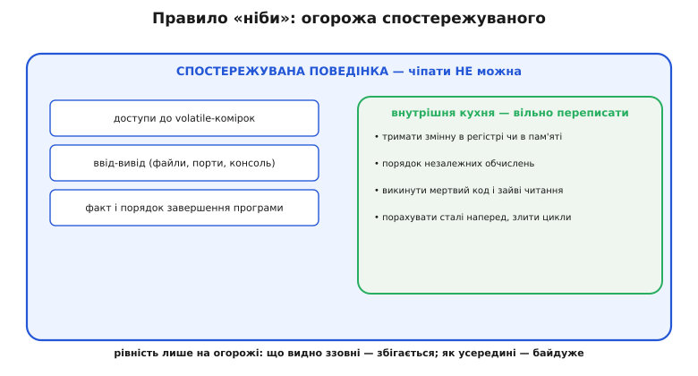
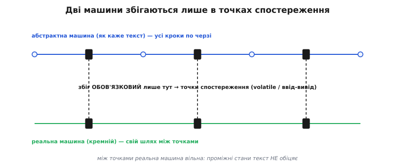
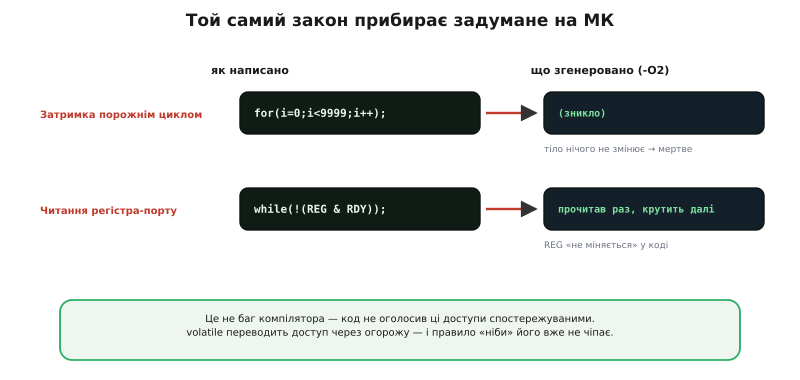

# Правило «ніби» (as-if rule): що компіляторові вільно міняти

Ви пишете `int y = 2 + 3;`, а в готовій прошивці немає ані додавання, ані двійки з трійкою — просто десь лежить готова п'ятірка. Ви пишете акуратний цикл, а компілятор його розгортає, зливає з сусіднім або взагалі викидає. І це не свавілля й не помилка — це його **законне право**, окреслене одним коротким принципом, на якому тримається вся оптимізація мов C і C++. Англійською його звуть **as-if rule**, українською — **правило «ніби»**: компілятор може переписувати вашу програму як завгодно, **аби лиш вона поводилася так, ніби** виконує саме те, що ви написали. Слово «ніби» тут ключове: збігатися має не код, а **видима поведінка**.

Це правило варте окремої розмови, бо саме воно пояснює найзагадковіші речі у вбудованому програмуванні: чому зникає порожній цикл-затримка, чому читання апаратного регістра «застигає», чому той самий код працює в debug і ламається в release. Усе це — не примхи компілятора, а прямі наслідки правила «ніби» плюс нерозуміння, **що** саме воно зобов'язане зберегти, а що вільне переписати. Розберімо цю межу до кінця.

### Компілятор — перекладач, який вільний обрати дорогу

Уявіть перекладача, якому дали речення й попросили передати **зміст** іншою мовою. Він не зобов'язаний перекладати слово в слово — він зобов'язаний, щоб слухач зрозумів **те саме**. Може переставити слова, замінити довгий зворот коротким, викинути тавтологію — доки думка ціла, усе чесно. Оцінюють його не за дослівністю, а за тим, чи збігся сенс на виході.

Компілятор — рівно такий перекладач між [вихідним кодом і машинними командами](topic:sf-lang/compilation). Ваш текст — це **опис наміру**, а не інструкція «згенеруй буквально оці операції». Намір такий: «нехай програма, якщо її запустити, поводиться ось так». А **як** саме кремній цього досягне — двома командами чи двадцятьма, через регістр чи через пам'ять, у тому порядку чи в іншому — його власний клопіт. Правило «ніби» і є формальним записом цієї свободи: результат зобов'язаний збігтися, дорога до нього — вільна.

> 🔧 **Навіщо це.** Без цього правила оптимізація була б **незаконною**: якби компілятор мусив дослівно відтворювати кожну написану дію, `x = 2 + 3;` завжди породжувало б реальне додавання під час виконання, а порожній цикл крутився б намарно. Уся швидкість сучасного коду — від того, що компілятор має **право** не робити зайвого. Ви пишете зрозуміло для людини; правило «ніби» дозволяє машині виконувати це ефективно.

### Що саме зобов'язане збігтися: спостережувана поведінка

Якщо збігатися має «видима поведінка», треба точно знати, **що видно**. Тут криється вся суть, тож не відкладаймо: стандарт мови окреслює вузьке, чітко перелічене коло — **спостережувану поведінку** (англ. *observable behavior*). До неї належить рівно три речі:

- **доступи до `volatile`-комірок** — кожне читання й запис такої змінної;
- **ввід-вивід** — усе, що програма пише у файли, шле в порти, друкує на консоль чи читає ззовні;
- **факт і порядок завершення** програми (чи вона взагалі доходить до кінця).

І це **все**. Більше зовнішній світ від вашої програми нічого не «бачить». А раз не бачить — то компіляторові вільно робити з рештою що завгодно, доки ці три речі лишаються незмінними.


*Правило «ніби» проводить огорожу. Зовні лишається те, що бачить світ: доступи до `volatile`, ввід-вивід, факт завершення — це недоторканне. Всередині — внутрішня кухня: тримати змінну в регістрі чи в пам'яті, у якому порядку рахувати незалежні дії, чи викидати мертвий код — усе вільно переписати. Рівність вимагається лише на огорожі.*

Звідси випливає найважливіше практичне спостереження: **проміжні стани вашої програми ніхто не гарантує**. Значення локальної змінної в якийсь момент, порядок двох незалежних обчислень, чи взагалі існує в машинному коді те додавання, що ви написали, — усе це **внутрішня кухня**, яку правило «ніби» лишає компіляторові. Гарантується тільки те, що перетинає огорожу спостережуваного. Тому питання «а що там насправді в цю мить у пам'яті?» здебільшого не має відповіді, бо стандарт її й не обіцяв — він обіцяв лише збіг на межі.

Окрема тонка деталь: коли ваш код викликає бібліотечну функцію, вихідний текст якої компілятор **не бачить** (вона в іншому, уже скомпільованому модулі), він мусить припустити, що всередині може бути й ввід-вивід, і доступ до `volatile`. А отже — не має права ані викинути цей виклик, ані переставити його. Непрозорість рятує: чого компілятор не бачить, того він і не чіпає.

### Дві машини, що збігаються лише в точках спостереження

Щоб думати про це чітко, корисна така картина. Ваш текст описує ідеальну, покрокову **абстрактну машину** (англ. *abstract machine*) — вигадану обчислювальну машину зі стандарту, яка виконує кожен ваш оператор по черзі, чесно й буквально. Це «еталонне» виконання: саме з ним стандарт порівнює все інше. А реальний кремній — інша машина, зі своїм конвеєром, регістрами й хитрощами. Правило «ніби» вимагає, щоб реальна машина збіглася з абстрактною **не всюди, а лише в точках спостереження** — там, де є доступ до `volatile` чи ввід-вивід. Між цими точками реальна машина вільна йти власною, коротшою дорогою.


*Абстрактна машина (як каже текст) проходить усі кроки по черзі. Реальна машина (кремній) мусить збігтися з нею лише в точках спостереження — де стоять доступи до `volatile` чи ввід-вивід. Між цими точками її шлях власний: проміжні стани текст не обіцяє.*

Аналогія з абстрактною машиною точна, але має межу, де ламається, — і про неї варто знати одразу. Здається, ніби програма «насправді проходить» усі описані кроки, просто швидше. Це не так: проміжних кроків може **взагалі не бути** в машинному коді. Якщо компілятор довів, що результат циклу — стала, самого циклу в прошивці не буде — не «швидкий цикл», а **жодного**. Абстрактна машина — це модель для міркувань про **правильність**, а не опис того, що фізично відбувається в кремнії. Плутати ці два рівні — і є корінь більшості непорозумінь із оптимізатором.

### Той самий результат — багато законних доріг

Побачмо правило на найпростішому. Візьмімо звичайне підсумовування:

**Цикл, що додає трійку чотири рази.**

```c
int y = 0;
for (int i = 0; i < 4; i++)
    y += 3;
return y;
```

Абстрактна машина проходить це чесно: занулила `y`, чотири рази додала по три, повернула `12`. Що зобов'язаний компілятор? Рівно одне — щоб функція **повернула 12** (це видимий результат, він перетинає огорожу через `return`). А як він до цього дійде — його справа, і законних доріг тут щонайменше три:

```
// «у лоб» (-O0): чесний цикл
y=0; loop i=0..3: y=y+3; ret y

// розгорнуто: без лічильника, чотири додавання поспіль
y=0; y=y+3; y=y+3; y=y+3; y=y+3; ret y

// пораховано наперед (згортання сталих)
ret 12
```

Усі три однаково правильні, бо всі три повертають `12`. Лічильник `i`, проміжні значення `y` — то внутрішня кухня, її ніхто не спостерігає, тож компілятор вільний прибрати. Найагресивніша дорога — просто `ret 12` — викидає весь цикл: якщо результат відомий на етапі компіляції, навіщо рахувати його під час виконання? [Конкретні прийоми, якими компілятор це робить](topic:sf-lang/compiler-optimizations) — згортання сталих, прибирання мертвого коду, інлайн, розгортання циклів — заслуговують окремої розмови; тут важлива сама рамка, що робить їх **дозволеними**: правило «ніби».

### Де це кусає: зникла затримка й «застигле» читання регістра

Тепер — плата за цю свободу, і саме тут вбудований програміст спотикається найчастіше. Правило «ніби» не знає про ваше залізо. Воно судить про «однакову поведінку» **лише** за спостережуваним — а якщо ви не оголосили доступ спостережуваним, компілятор має повне право його прибрати. Два канонічні випадки:


*Обидва випадки — не баг компілятора, а точне застосування правила. Порожній цикл-затримка нічого не змінює у спостережуваному, тож його викидають цілком. Читання регістра `REG` компілятор бачить незмінним у коді й читає раз, кешуючи в регістрі. `volatile` переводить доступ через огорожу спостережуваного — і правило «ніби» його вже не чіпає.*

Перший — **затримка порожнім циклом**. Ви пишете `for (volatile int i = 0; i < 9999; i++);`, щоб «згаяти час». Без `volatile` компілятор міркує бездоганно: тіло циклу нічого спостережуваного не робить, результат нікуди не йде — отже, цикл **мертвий**, і його немає в прошивці. Затримка зникла, а разом із нею — і ваша пауза між двома діями із залізом.

Другий — **очікування апаратного прапорця**: `while (!(REG & READY));`. Компілятор бачить, що всередині циклу `REG` ніхто не записує, тож слушно (для звичайної пам'яті!) вирішує читати його **один раз**, а далі звіряти [закешовану в регістрі копію](topic:sf-lang/volatile). Але `REG` — це апаратний [регістр периферії](topic:hw-arch/memory-mapped-io), який міняє **саме залізо**, поза видимим кодом. Копія застигає на старому значенні, і цикл крутиться вічно.

В обох випадках виною — **не** оптимізатор. Він чесно застосував правило «ніби»: у межах того, що він вважає спостережуваним, поведінка не змінилася. Проблема в тому, що ви **не сказали** йому вважати ці доступи спостережуваними. Рятунок — [ключове слово `volatile`](topic:sf-lang/volatile): воно оголошує кожен доступ до змінної спостережуваним, тобто **переводить його через огорожу**. А доступи по той бік огорожі правило «ніби» чіпати не сміє — їх не вільно ані викинути, ані переставити, ані закешувати. Ось чому `volatile` працює надійно на будь-якому компіляторі: він не «просить бути обережним», а формально виводить доступ з-під дії оптимізацій.

> 🔧 **Навіщо це.** Зрозумівши правило «ніби», ви перестаєте дивуватися цілому класу багів і починаєте їх **передбачати**. Побачили порожній цикл-затримку — одразу питання: а він `volatile`? Чи ліпше апаратний таймер? Побачили очікування апаратного прапорця — чи оголошено регістр `volatile`? «Працює в debug, ламається в release» — це майже завжди воно: на `-O0` оптимізацій нема, тож недооголошений доступ випадково лишається; на `-O2` правило «ніби» безжально прибирає все, що ви не захистили. Захист — не «про всяк випадок», а точне знання, які саме доступи мусять бути спостережуваними.

### Де правило перестає вас захищати

Правило «ніби» звучить як тверда гарантія: «видима поведінка збережеться». Але у трьох місцях ця гарантія тоншає або зникає — і не знати про них небезпечно.

**Невизначена поведінка (UB) знімає всі гарантії.** Правило обіцяє зберегти видиму поведінку **лише для коректної програми**. Щойно ваш код чіпає [невизначену поведінку](topic:sf-lang/undefined-behavior) — переповнення знакового цілого, читання за межами масиву, розіменування нульового вказівника — стандарт більше **нічого** не гарантує. А раз спостережувана поведінка стала невизначеною, то будь-яке перетворення її «зберігає» (зберігати нема чого). Тому за наявності UB компілятор може згенерувати геть несподіване: викинути перевірку, «довести» неможливе, зламати код у місці, далекому від помилки. Парадокс, але важливий: правило «ніби» — сумлінний захисник рівно доти, доки ви граєте за правилами; порушили — і воно обертається проти вас.

**Числа з рухомою комою — окремий випадок «однаковості».** Переставити `(a + b) + c` на `a + (b + c)` для цілих — безпечно, результат той самий. Для [чисел із рухомою комою](topic:hw-arch/floating-point) — **ні**: округлення робить ці два вирази різними, тож за замовчуванням компілятор такі перестановки **не** робить (вони змінили б видимий результат, а отже, заборонені правилом «ніби»). Але прапорцем `-ffast-math` ви кажете: «вважай наближену рівність достатньою» — і тим самим **розширюєте**, що для вас означає «та сама поведінка». Це може дати помітно швидший, але числово інший код. Тобто межу спостережуваного подекуди рухає й сам програміст своїми ключами.

**«Ніби» визначене для одного спостерігача.** Правило зберігає поведінку так, як її бачить **один потік виконання**, що йде по програмі сам. Про інший потік чи обробник переривання, що зазирає в ту саму пам'ять «збоку», воно нічого не знає. Тому перестановка й кешування, цілком законні для одинокого спостерігача, для **другого** спостерігача виглядають як хаос. Саме звідси ростуть [гонки даних](topic:sf-tasks/atomicity-races): правило «ніби» їх не порушує — воно просто не про них. Захист від другого спостерігача — то вже `volatile` для свіжості й атомарні операції для неподільності, окремий шар поверх правила «ніби».

### Звідки взялося саме таке формулювання

Правило «ніби» — не самоочевидна істина, а свідоме інженерне рішення авторів мови. Його формалізували в першому стандарті C ([ANSI C89, він же ISO C90](topic:sf-lang/as-if-rule/hist-as-if.md)), запровадивши поняття абстрактної машини й спостережуваної поведінки саме для того, щоб примирити дві потреби: переносність (програма має означати те саме скрізь) і швидкість (компіляторові треба волі переписувати код під конкретне залізо). Пізніше те саме формулювання, майже слово в слово, перейшло в перший стандарт C++.

> 📜 **Як народилося правило «ніби».** Чому комітетові C наприкінці 1980-х знадобилося вигадати «абстрактну машину», що змінилося з нею для оптимізаторів і чому точне формулювання «як **ніби**» виявилося таким вдалим — в [історії про стандартизацію правила](topic:sf-lang/as-if-rule/hist-as-if.md).

Побачити правило «ніби» в дії — і навмисне його перехитрити — можна на живому коді: змусити компілятор показати зниклу затримку, а тоді повернути її правильними інструментами. Це корисна вправа, бо переводить абстрактний принцип у відчутні на дотик асемблерні рядки.

> ⚙️ **Спіймати правило за руку.** Як під `-O2` побачити, що затримка зникла, а читання регістра «застигло»; як `volatile`, апаратний таймер і бар'єр пам'яті (`asm volatile("" ::: "memory")`) повертають задумане, не відбираючи оптимізацій деінде, — з робочим кодом у вставці [Правило «ніби» під мікроскопом](topic:sf-lang/as-if-rule/proj-as-if-defeat.md).

Отже, правило «ніби» — це контракт, на якому тримається вся оптимізація C і C++: компілятор вільний переписувати вашу програму як завгодно, аби її **спостережувана поведінка** — доступи до `volatile`, ввід-вивід, факт завершення — лишалася тією самою. Усе інше, включно з проміжними станами й самим існуванням написаних вами операцій, — внутрішня кухня, яку він переписує заради швидкості. Знати цю межу — означає перестати бачити в оптимізаторі свавільного ворога й почати з ним співпрацювати: захищати `volatile` те, що мусить бути видимим, не збуджувати [невизначеної поведінки](topic:sf-lang/undefined-behavior) — і дозволяти йому робити свою роботу з рештою.
