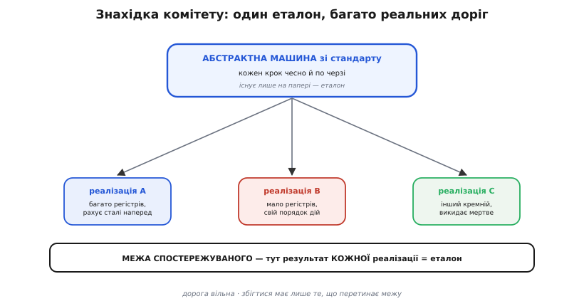
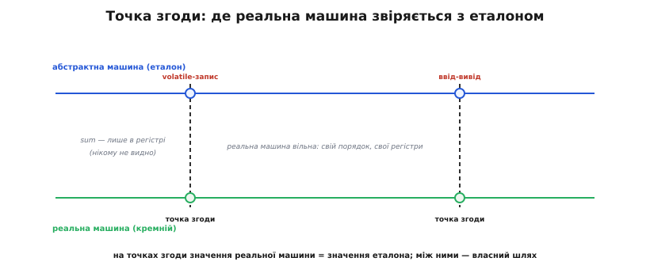

# 📜 Як народилося правило «ніби»: абстрактна машина комітету ANSI C

Здавалося б, правило «ніби» — очевидна річ: ну звісно, компіляторові можна переписувати код, аби результат був той самий. Але очевидним воно здається лише **заднім числом**, як усі вдалі ідеї. Насправді до кінця 1980-х такого правила в мові C **не існувало** — його не було ані записано, ані навіть чітко сформульовано. Мова десять років жила без нього, компілятори оптимізували хто як умів, і ніхто не міг сказати напевно, де межа дозволеного. Хтось мусив сісти й **вигадати** цю межу — а тоді знайти для неї слова, які працюватимуть однаково для крихітного мікроконтролера й для велетенського мейнфрейма. Ця історія — про те, як група інженерів наприкінці 1980-х зробила і те, і те, і чому вирішальним виявилося одне маленьке слово: **as if**, «ніби».

Історія варта уваги не заради дат. Вона показує рідкісну річ — **момент, коли невисловлене припущення стає законом**. Роками компілятори мовчки припускали, що можна не робити зайвого; комітет ANSI C узяв це припущення, витяг на світло й перетворив на формальний контракт, що діє й донині — у кожному сучасному C- і C++-компіляторі. Побачити, **як** саме вони це зробили, — означає зрозуміти правило «ніби» глибше, ніж із будь-якого підручникового означення.

## Мова, що втекла від своїх авторів

Щоб зрозуміти, навіщо взагалі знадобився стандарт, треба уявити, чим була C на початку 1980-х. Її створили **Денніс Рітчі** (*Dennis Ritchie*) і **Браян Керніган** (*Brian Kernighan*) у Bell Labs у 1970-х, а єдиним «законом» мови була їхня книжка **«The C Programming Language»** (1978) — знаменита «K&R» на ім'я авторів. Але книжка — це книжка, а не специфікація: вона пояснювала мову людині, а не приписувала машині, що саме та **мусить** робити. У багатьох тонких місцях вона просто мовчала або говорила туманно.

І поки C жила при одному компіляторі Рітчі, цього вистачало. Та мова виявилася **надто вдалою**, щоб лишитися при одному компіляторі. До середини 1980-х C працювала всюди: на мейнфреймах, на міні-комп'ютерах, на перших персоналках, на мікроконтролерах — на десятках несхожих архітектур, кожна зі своїм компілятором, який писали різні люди з різним розумінням туманних місць K&R. Мова, по суті, **втекла від своїх авторів** і розповзлася світом швидше, ніж хтось устигав узгоджувати, що вона взагалі означає.

Звідси й виросла потреба, яку мовою «навіщо» можна сформулювати гостро. Уявіть, що ви пишете код на одному компіляторі, а він має працювати на десятьох інших — на залізі, якого ви й у вічі не бачили. Що вам гарантовано? Що однаково означає ваша програма скрізь, а що віддано на відкуп конкретному компіляторові? Без відповіді **переносність** (portability) — сама причина популярності C — трималася на чесному слові. Треба було записати правила гри так, щоб код, написаний тут, поводився передбачувано **там**.

> 🔧 **Навіщо це.** Ця сама напруга жива й сьогодні, щойно ваша прошивка має зібратися двома компіляторами — скажімо, GCC і компілятором виробника чипа. Усе, на що ви можете покластися між ними, — це те, що **гарантує стандарт**; усе інше кожен компілятор робить по-своєму. Правило «ніби» народилося саме як відповідь на питання «що спільного зобов'язані робити всі компілятори світу» — і тому воно й досі ваша єдина тверда опора, коли код мусить жити не на одному компіляторі.

## Комітет, який не мав права винаходити

У 1983 році **Американський національний інститут стандартів** (ANSI) зібрав комітет із назвою-шифром **X3J11**, щоб дати C офіційний стандарт. Скликав його й очолив **Джим Броуді** (*Jim Brodie*) з компанії Motorola; заступником став **Том Плам** (*Tom Plum*), секретарем — **Ф. Дж. Плоґер** (*P. J. Plauger*), відомий автор книжок про C. За столом сиділи люди від виробників компіляторів, від великих користувачів мови, від виробників заліза — тобто рівно ті, кого туманні місця K&R боліли найдужче.

І тут — ключова деталь, без якої не зрозуміти всього подальшого. Комітетові **прямо заборонили винаходити нову мову**. Його статут (charter), як згодом дослівно зафіксує офіційне обґрунтування стандарту, наказував «**кодифікувати наявну спільну практику**» (*codify common existing practice*). Не покращувати, не вигадувати — **записати те, що вже є**. Основою для розділу про мову взяли навіть не саму книжку K&R, а внутрішній «C Reference Manual» того ж Рітчі, яким кілька років користувалися в Bell Labs.

Це обмеження — «документуй, а не вигадуй» — і є пружиною всієї нашої історії. Бо воно ставило комітет перед справжньою дилемою. З одного боку, наявна практика **вимагала**, щоб компілятори агресивно оптимізували: тримали змінні в регістрах, викидали зайве, переставляли обчислення — без цього C не була б швидкою мовою, за яку її любили. З іншого боку, ту саму мову треба було зробити **переносною** — тобто твердо сказати, що вона означає, однаково для всіх. А це дві протилежні сили: свобода оптимізації тягне «дозвольте компіляторові робити що завгодно», переносність тягне «припишіть точно, що він мусить». Як задовольнити обидві разом?

> 🔧 **Навіщо це.** Обмеження «кодифікувати, а не винаходити» пояснює характер усього C — і те, чому мова місцями «дірява» на вигляд. Багато рішень у ній — не ідеал з чистого аркуша, а спроба **чесно описати** те, що вже робили десятки різних компіляторів, не зламавши гори наявного коду. Знаючи це, ви інакше читаєте стандарт: він не диктатор, що вигадав правила, а радше літописець, що зафіксував угоду між реальними реалізаціями. Правило «ніби» — найелегантніший запис такої угоди.

## Хибний шлях: описати саму машину

Перш ніж оцінити знахідку комітету, варто побачити шлях, яким він **не** пішов, — бо саме на його тлі видно всю дотепність обраного.

Найпростіший на вигляд спосіб описати, що робить програма, — приписати **послідовність кроків**: спершу обчисли це, потім те, поклади результат сюди, тоді туди. Так працює будь-який рецепт. Але для стандарту мови цей шлях — пастка. Варто написати «компілятор мусить обчислити `2 + 3`, а тоді записати `5` у змінну» — і ви щойно **заборонили** найпростішу оптимізацію: адже хороший компілятор порахує `5` наперед і ніякого додавання під час виконання не зробить. Опишіть кроки буквально — і вб'єте всю швидкість, за яку C цінували. А не опишіть нічого — і втратите переносність, бо кожен компілятор тлумачитиме мову по-своєму.

Комітет опинився між двох вогнів, і обидва прямі виходи були поганими:

```
Описати точні кроки машини  →  переносність є, АЛЕ оптимізація вбита
Не описувати нічого точно    →  оптимізація вільна, АЛЕ переносності нема
```

Пастка глибша, ніж здається. Річ у тім, що заліза, для якого пишуть стандарт, — **безліч видів**, і кожне «робить кроки» по-своєму: одне має багато регістрів, інше мало; одне вміє множити апаратно, інше емулює множення; одне рахує з рухомою комою інакше, ніж сусіднє. Якщо стандарт опише кроки **однієї** уявної машини надто конкретно, він або скує руки половині заліза, або зробить код на різних машинах різним. Потрібен був опис, який каже, **що має вийти**, не приписуючи, **як саме** до цього дійти на конкретному кремнії. Опис результату, а не процесу.

## Знахідка: уявна машина, з якою треба збігтися

І тут комітет зробив розумний хід, що розрубав вузол. Замість описувати справжню машину — з її кроками, регістрами й швидкістю — вони описали **вигадану**. Ту саму, яку сьогодні звемо **абстрактною машиною** (*abstract machine*): ідеальний, суто теоретичний виконавець, що робить кожен оператор вашої програми чесно й по черзі, буквально так, як написано. Ця машина існує **лише на папері стандарту**. Ніхто ніколи її не будував і будувати не збирався. Її єдине призначення — бути **еталоном**, з яким звіряють усе інше.

А далі — головний трюк, заради якого все й затівалося. Стандарт **не** вимагає, щоб реальний компілятор повторював кроки абстрактної машини. Він вимагає значно менше: щоб реальна програма давала **той самий видимий результат**, який дала б абстрактна машина. Збігатися має не дорога — збігатися має те, що **бачить зовнішній світ**. А як реальний кремній дійде до цього результату — двома командами чи двадцятьма, через регістр чи через пам'ять, порахувавши наперед чи чесно в циклі, — стандартові байдуже.

Ось як це сформульовано в офіційному обґрунтуванні стандарту — і варто прочитати саме мовою першоджерела, бо тут кожне слово важить:

> «Поведінку описано в термінах *абстрактної машини*, щоб іще раз підкреслити: Стандарт приписує **результати**, **ніби** застосовано певні механізми, не вимагаючи цих механізмів у реалізації.»
> (*the Standard mandates results as if certain mechanisms are used, without requiring those actual mechanisms in the implementation*)

У цьому одному реченні — розв'язок дилеми. «Результати, **ніби** застосовано механізми» — а не самі механізми. Переносність тримається на еталонній абстрактній машині: вона одна для всіх, і кожна коректна програма означає скрізь те саме, що на ній. Свобода оптимізації тримається на слові **«ніби»**: реальному компіляторові вільно робити що завгодно, доки результат виходить **такий, ніби** абстрактна машина відпрацювала чесно. Дві протилежні сили примирені — і примирені елегантно, без жодного компромісу між ними.


*Знахідка комітету однією картинкою. Угорі — вигадана абстрактна машина зі стандарту: вона робить кожен крок чесно й по черзі, та існує лише на папері. Унизу — три несхожі реальні реалізації (різне залізо, різні компілятори), кожна йде власною коротшою дорогою. Стандарт вимагає від них лише одного — щоб видимий результат збігся з еталоном. Дорога вільна, збігтися має тільки те, що перетинає межу спостережуваного.*

## Чому саме «as if» — а не «однаково» чи «еквівалентно»

Може здатися, що вибір слова — дрібниця стилю. Насправді формулювання «as if» несе точний технічний зміст, якого не дали б очевидніші кандидати, — і саме тому воно виявилося таким вдалим і живучим.

Порівняймо з тим, що напрошувалося. Якби стандарт сказав, що реальна програма мусить бути «**однаковою**» (*the same*) з абстрактною, — це неправда: вони не однакові, реальна може взагалі не мати кроків, які абстрактна проходить. Якби сказав «**еквівалентною**» (*equivalent*) — це вимагало б доводити якусь рівність крок за кроком, а компілятор нічого не доводить, він просто генерує код. Якби сказав «дай **той самий вихід**» — залишилося б питання: той самий *для кого*, за яким спостерігачем?

Слово **«ніби»** розв'язує все це одним махом, бо воно за самою своєю природою говорить про **уявний, контрфактичний** стан справ. «Зроби так, **ніби** абстрактна машина відпрацювала» — це не «зроби те саме» й не «доведи рівність». Це: «поводься так, щоб **не можна було відрізнити** твій результат від результату еталона — дивлячись **ззовні**». Уся сила — в цьому «не відрізнити ззовні». Правило не каже, що всередині; воно каже лише, що **межа спостереження** має виглядати однаково. А що коїться за межею — вільна воля компілятора.

Формально це той самий принцип, що й у пізнішому стандарті C++, де його виписали ще прозоріше: реалізація вільна **знехтувати будь-якою вимогою стандарту**, якщо результат виходить такий, **ніби** вимогу було виконано — наскільки це можна визначити зі спостережуваної поведінки програми. Тобто «ніби» перетворює всі докладні приписи стандарту на **необов'язкові до буквального виконання** — обов'язковий лише видимий підсумок. Це надзвичайно сильне звільнення, і трималося воно рівно на одному влучно обраному слові.

Тут напрошується аналогія — і корисно одразу показати, де вона ламається. Правило «ніби» схоже на іспит, де оцінюють лише **відповідь**, а не чернетку: як ти дійшов до `12`, нікого не обходить, аби в клітинці стояло `12`. Аналогія точна в головному — важливий результат, не шлях. Але вона ламається в одному: на іспиті чернетка все-таки **існує**, просто її не дивляться. А тут проміжних кроків може **взагалі не бути** — компілятор, побачивши, що відповідь завжди `12`, не пише жодного обчислення, він одразу кладе `12`. Немає «швидкої чернетки» — немає чернетки зовсім. Абстрактна машина проходить кроки лише **в уяві стандарту**, щоб було з чим звіряти результат; у справжньому коді їх може не лишитися й сліду.

## Що комітет вирішив вважати «видимим»

Знахідка з абстрактною машиною ставила негайне питання: якщо збігатися має лише **видиме**, то що ж саме видиме? Провести цю межу було не менш тонкою роботою, ніж вигадати саму машину, — бо від неї залежало геть усе. Малюй межу надто широко (видно кожну проміжну змінну) — і знову вб'єш оптимізацію. Надто вузько — і збіг стане беззмістовним.

Комітет провів межу так. **Спостережуваним** оголосили рівно те, чим програма впливає на зовнішній світ: доступи до особливих, помічених `volatile` комірок; увесь увід-вивід (файли, порти, консоль); і те, як розгортається діалог з інтерактивним пристроєм — щоб запит устигав з'явитися, перш ніж програма чекатиме на відповідь. Усе інше — проміжні значення змінних, порядок незалежних обчислень, саме існування написаних вами дій — оголосили **невидимим**, внутрішньою кухнею компілятора.

Щоб пояснити, **де** реальна машина зобов'язана збігтися з абстрактною, комітет увів гарний технічний образ — **точку згоди** (*agreement point*). Це така мить у виконанні (одна з так званих **точок послідовності**, *sequence points*), у якій значення в реальній машині **мусить збігтися** зі значенням, що його приписує абстрактна машина. Між точками згоди реальна машина вільна йти власною дорогою й тримати проміжні стани де завгодно; а от **на** точці згоди — звірка з еталоном.

Обґрунтування ілюструє це двома прикладами, які варто побачити, бо вони — праобраз усіх пізніших пояснень правила. Перший — звичайне підсумовування масиву:

```
sum = 0;
for (i = 0; i < N; ++i)
    sum += a[i];
```

Тут, каже комітет, компіляторові вільно тримати і `sum`, і `i` **в регістрах** протягом усього циклу, ні разу не оновлюючи їхні копії в пам'яті, — бо ніхто ззовні цих проміжних станів не бачить. Це чудово для швидкості. Але — ось де народжується причина існування `volatile` — така свобода «**надто вільна для орієнтованих на залізо задач**», як-от драйвери й робота з відображеною в пам'ять периферією. І комітет одразу дає другий приклад — той, де змінну помічено `volatile`:

```
volatile short *ttyport;
/* ... */
for (i = 0; i < N; ++i)
    *ttyport = a[i];
```

Тут кожен запис у `*ttyport` — це запис у **порт**, у справжнє залізо, і його **видно**. Тому `volatile` змушує компілятор виконати всі ці записи «**у тій самій послідовності й з тими самими значеннями, що зробила б абстрактна машина**». Помітка `volatile` — це, по суті, спосіб сказати компіляторові: «**ця комірка — по видимий бік межі, звіряйся з еталоном на кожному доступі**». Отак, одним і тим самим апаратом абстрактної машини, комітет пояснив і **чому** оптимізація законна, і **чому** для заліза потрібен запобіжник проти неї — [ключове слово `volatile`](topic:sf-lang/volatile), що оголошує кожен доступ до комірки спостережуваним і тим виводить його з-під дії оптимізацій.


*Образ «точки згоди» з обґрунтування стандарту. Горизонталь — плин виконання. У точках згоди (доступ до `volatile`, увід-вивід) значення реальної машини мусить збігтися зі значенням абстрактної — це звірка з еталоном. Між ними реальна машина вільна: тримає змінні в регістрах, переставляє незалежні дії, викидає непотрібне. Саме тому в лівому відрізку `sum` живе лише в регістрі, а на `volatile`-записі праворуч — обов'язкова згода з еталоном.*

## Слово, що майже дослівно перейшло в C++

Робота комітету завершилася наприкінці 1989 року: **14 грудня 1989-го** стандарт ратифіковано як **ANSI X3.159-1989** — той самий, який програмісти й досі звуть **C89**. Друком він вийшов навесні 1990-го. Майже одразу його перейняла міжнародна організація **ISO**, видавши **ISO/IEC 9899:1990** — це **C90**; текст той самий, різниця лише в оформленні й нумерації розділів (саме через це переупорядкування розділ про виконання програми, що в ANSI-виданні мав номер §2.1.2.3, у ISO-виданні став §5.1.2.3 — той самий текст, інший номер). Отак невисловлене припущення десятиліття нарешті стало **записаним законом**: абстрактна машина, спостережувана поведінка й рятівне «ніби» дістали офіційний статус.

Але справжнє свідчення того, наскільки вдалою вийшла знахідка, — не в тому, що її прийняли для C. А в тому, що коли за кілька років настав час стандартизувати **C++**, її взяли **майже слово в слово**.

C++ Б'ярне Стропструпа (*Bjarne Stroustrup*) виріс із C і успадкував її дух — зокрема принцип «не платиш за те, чим не користуєшся». Коли 1998 року вийшов перший стандарт мови, **ISO/IEC 14882:1998** (той самий **C++98**), його розділ про виконання програми — **§1.9 [intro.execution]** — переніс усю конструкцію C майже без змін. Та сама «параметризована недетермінована абстрактна машина». Той самий перелік спостережуваного: доступи до `volatile`, стан файлів на завершенні, вчасність діалогу з інтерактивним пристроєм. І та сама, дослівно, серцевина у формі виноски:

> «…реалізація вільна знехтувати будь-якою вимогою цього Міжнародного стандарту, якщо результат виходить такий, **ніби** вимогу було виконано — наскільки це можна визначити зі спостережуваної поведінки програми.»
> (*an implementation is free to disregard any requirement of this International Standard as long as the result is as if the requirement had been obeyed…*)

Те, що інший комітет, інша мова, інші люди взяли формулювання **без переробки**, — найкращий доказ його якості. Вдалі інженерні рішення так і впізнаються: їх переймають, не чіпаючи. Формулювання «ніби» виявилося настільки точним і повним, що переписувати його не було потреби — його просто взяли й поставили в основу другої великої мови. Відтоді обидві мови — C і C++ — стоять на тому самому фундаменті, закладеному комітетом X3J11 наприкінці 1980-х.

Статус усього викладеного — **усталений**: це не спірна атрибуція й не легенда, а задокументована історія стандартів. Дати ратифікації (14 грудня 1989) і видання ISO (1990), склад і мандат комітету X3J11, тексти §5.1.2.3 C та §1.9 C++ — усе це зафіксовано в самих стандартах та в офіційному обґрунтуванні (Rationale) до C89, звідки й наведено прямі цитати.

## Що з цього винести

За сухими датами й номерами розділів ховається насправді красива інженерна історія — і кілька уроків, ширших за саме правило «ніби».

Перший: **найсильніші правила часто лише впорядковують те, що всі й так робили**. Компілятори оптимізували код і до 1989 року — комітет не винайшов оптимізацію, він дав їй **законні межі** й спільну мову. Це типовий шлях зрілої технології: спершу практика, потім її акуратний опис, який робить практику передбачуваною для всіх.

Другий: **точне формулювання — це теж інженерія**. Комітет міг обрати «однаково», «еквівалентно», «той самий вихід» — і кожен варіант або скував би оптимізацію, або лишив би діри. Вони знайшли слово «ніби», що говорить про **невідрізнюваність ззовні**, — і рівно тому воно вмістило все потрібне й нічого зайвого. Іноді доля великої ідеї залежить від одного влучно дібраного слова.

І третій, найпрактичніший: кожного разу, коли компілятор викидає ваш порожній цикл-затримку чи змушує «застигнути» читання апаратного регістра, ви бачите в дії рішення, ухвалене за столом комітету наприкінці 1980-х. Він тоді провів **межу спостережуваного** — і все, що по невидимий бік, віддав компіляторові. Зрозуміти цю історію — значить перестати сприймати правило «ніби» як загадкову примху й почати бачити в ньому те, чим воно є: свідомий, ретельно виважений контракт між переносністю й швидкістю, що працює на вас уже понад тридцять років.
