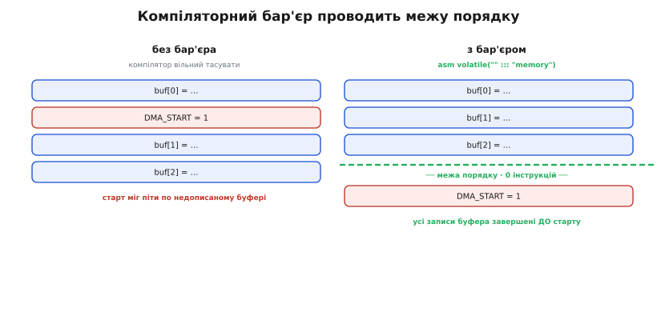

# ⚙️ Правило «ніби» під мікроскопом

Абстрактний принцип легко кивнути головою й забути. Тож зробімо його відчутним: візьмемо код, який працює в debug і мовчки ламається в release, покажемо **точний** асемблер, у який його переписав компілятор, — а тоді повернемо задумане, розуміючи щоразу, **чому** саме цей інструмент повертає його, а не сусідній. Наприкінці у вас має бути не «список порад проти оптимізатора», а вміння **читати** його рішення й розмовляти з ним однією мовою.

Задача звучить просто: моргнути світлодіодом і дочекатися апаратного прапорця готовності. Дві дії, які будь-хто напише за хвилину. І обидві мовчки зникнуть під `-O2`. Розберімо їх по черзі, з дизасемблером у руках.

## Задача: побачити правило за руку і не програти йому

Розкладімо мету на три частини, бо змішувати їх — і є корінь плутанини.

**Що зробити.** Спочатку — навмисне **спіймати** оптимізатор: написати найтиповіший вбудований код (порожня затримка циклом, очікування прапорця) так, як його пишуть новачки, і показати на асемблері, що від нього лишилося. Потім — **повернути** задумане, кожним інструментом окремо, і знову подивитися на асемблер: переконатися, що тепер там саме те, що треба, і **тільки** те.

**Ідея розв'язку.** Правило «ніби» прибирає все, що не перетинає огорожу спостережуваного. Отже, щоб **повернути** дію, є рівно два ходи: або **завести доступ за огорожу** (оголосити його спостережуваним через `volatile` — тоді правило його чіпати не сміє), або **не боротися з оптимізатором зовсім**, а виміряти час залізом, якому байдуже до C-коду (апаратний таймер). Плюс третій, тонший інструмент — **компіляторний бар'єр пам'яті** `asm volatile("" ::: "memory")`, який ставить огорожу *порядку* в одному місці, не забираючи оптимізацій деінде.

**Чому це важливо на дотик.** «Працює в debug, ламається в release» — найдорожчий клас вбудованих багів, бо він не відтворюється там, де ви його шукаєте. Хто вміє прочитати асемблер і сказати «ось тут оптимізатор законно викинув мій доступ», лагодить його за п'ять хвилин. Хто ні — тижнями міняє випадкові рядки й молиться. Ця вправа переводить вас із другого табору в перший.

> 🔧 **Навіщо це.** Читати вивід компілятора — навичка, яку недооцінюють, а вона окупається щодня. Не треба знати асемблер напам'ять; треба вміти впізнати три речі: чи є мій цикл у машинному коді взагалі, чи читає він пам'ять **щоразу** чи закешував копію в регістрі, і в **якому порядку** стоять мої записи в залізо. Цих трьох питань вистачає, щоб діагностувати майже будь-який «оптимізатор з'їв мій код».

## Як подивитися, що згенерував компілятор

Перш ніж ловити — треба чим дивитися. Не вгадуйте, що зробив компілятор: **подивіться**. Три робочі способи, від найпростішого.

Найшвидший — онлайн-дизасемблер **Compiler Explorer** (godbolt.org): вставляєте функцію, обираєте `arm-none-eabi-gcc` (для Cortex-M) чи `xtensa-esp32-elf-gcc` (для ESP32), додаєте прапорці `-O2`, і праворуч бачите асемблер поряд із рядками C. Це найкраще місце для експериментів із цієї статті.

Локально з тулчейну — той самий результат двома командами:

```
# 1) скомпілювати в об'єктний файл з тими прапорцями, що й прошивку
arm-none-eabi-gcc -O2 -mcpu=cortex-m4 -c delay.c -o delay.o

# 2) розібрати назад в асемблер, упереміш із рядками C
arm-none-eabi-objdump -d -S delay.o
```

Ключова умова: дизасемблюйте **з тими самими прапорцями**, що йдуть у реальну збірку. `-O0` покаже вам чесний цикл і збреше — саме тому баг «не відтворюється в debug». Дивитися треба на `-O2`/`-Os`, бо саме їх бачить залізо.

> 🔧 **Навіщо це.** Дизасемблер — не «для гуру». Це перша дія, коли поведінка розходиться між рівнями оптимізації. П'ять хвилин у Compiler Explorer відповідають на питання, над яким інакше сидиш день: мій код тут чи його немає? Заведіть звичку дивитися **до** того, як почати міняти код навмання.

## Пастка перша: затримка порожнім циклом зникає

Класика. Треба витримати коротку паузу між двома діями із залізом — скажімо, між подачею живлення на давач і першим читанням. Хтось згадує, що «просто цикл нічого не робить деякий час», і пише:

```c
void delay_crude(void)
{
    for (unsigned i = 0; i < 100000u; i++) {
        /* нічого — просто гаємо час */
    }
}
```

На `-O0` це працює: компілятор чесно генерує лічильник, порівняння, стрибок — цикл крутиться, час іде. Ви тестуєте на debug-збірці, усе гаразд, комітите. А в release під `-O2` компілятор міркує так: тіло циклу не робить нічого спостережуваного, результат `i` після циклу нікуди не йде, отже, весь цикл — **мертвий код**. Дизасемблер під `-O2` показує моторошне:

```
delay_crude:
        bx      lr        @ і все — просто повернення, циклу немає
```

Уся функція — одна інструкція повернення. Затримки немає. І — це головне — **компілятор має рацію**: за буквою правила «ніби» він зберіг усю спостережувану поведінку функції, бо спостережуваної поведінки в ній **нуль**. Баг не в компіляторі. Баг у тому, що «згаяти час» — це намір щодо **фізичного часу**, а фізичний час — не спостережувана поведінка. Мова C про нього просто не знає: [у стандартній моделі мови немає поняття «скільки це триває»](root:sf-lang/undefined-behavior) — є лише «що видно на огорожі». Ви попросили те, чого мовою й не висловиш, і компілятор законно викинув порожнечу.

### Наївний рятунок і його прихована пастка

Порада, яку чути найчастіше: «додай `volatile`». І тут криється тонка, дуже повчальна пастка — бо **куди** саме додати `volatile`, вирішує все.

Хтось пише `volatile` на **весь намір** невдало — оголошує змінну, але це не рятує, якщо доступів до неї в тілі немає. А хтось робить правильно — робить `volatile` **саму лічильну змінну**:

```c
void delay_volatile(void)
{
    for (volatile unsigned i = 0; i < 100000u; i++) {
        /* тепер кожні читання й запис i — спостережувані */
    }
}
```

Тепер `i` — `volatile`, тобто **кожен** її доступ став спостережуваним і перетнув огорожу. А доступи по той бік огорожі правило «ніби» чіпати не сміє: їх не вільно ані викинути, ані злити. Дизасемблер під `-O2` це підтверджує — цикл повернувся:

```
delay_volatile:
        movs    r3, #0
        str     r3, [sp, #4]      @ i = 0  (у пам'яті на стеку, бо volatile)
.L2:
        ldr     r3, [sp, #4]      @ читаємо i  (щоразу, бо volatile)
        cmp     r3, #0x1869F      @ i < 100000 ?  (0x1869F = 99999)
        bhi     .L3               @ вийти, якщо більше
        ldr     r3, [sp, #4]      @ читаємо i знову
        adds    r3, #1            @ i + 1
        str     r3, [sp, #4]      @ записуємо i  (щоразу, бо volatile)
        b       .L2
.L3:
        bx      lr
```

Зверніть увагу: `i` живе **в пам'яті на стеку** (`[sp, #4]`), а не в регістрі, і на кожній ітерації її **читають і пишуть** справжніми `ldr`/`str`. Компілятор більше не сміє тримати копію в регістрі й крутити порожнечу — бо `volatile` каже, що кожен доступ видимий світові. Затримка є.

Але ось **пастка**, про яку майже ніколи не попереджають: **скільки** ця затримка триває — **невідомо й непереносно**. Правило «ніби» тепер зобов'язане зберегти самі *доступи* (стільки-то читань і записів `i`), але воно нічого не обіцяє про те, **скільки часу** візьме кожна ітерація. На Cortex-M4 з кешем інструкцій це один час, на M0 без кешу — інший, на ESP32 з доступом до флешу через кеш — третій, і той самий бінарник на іншій тактовій частоті дасть четвертий. Ви полагодили «зникло», але не полагодили «триває рівно X мікросекунд». Порожній `volatile`-цикл — це **не таймер**, а лічильник ітерацій із випадковим множником часу.

> 🔧 **Навіщо це.** `volatile` на лічильнику — законний спосіб **не дати циклу зникнути**, але кепський спосіб **відміряти час**. Він рятує від «нуль інструкцій», але не дає передбачуваної тривалості: ту саму прошивку перенесеш на інший кристал чи іншу частоту — і пауза попливе. Тримайте це в голові як правило: `volatile`-цикл годиться хіба для грубого «трохи почекати» у прикиді, ніколи — для точного таймінгу протоколу.

## Пастка друга: читання апаратного регістра «застигає»

Друга дія ще підступніша, бо тут баг тихий: код не «нічого не робить», а робить, але **не те**. Треба дочекатися, поки периферія (скажімо, АЦП) виставить біт готовності в своєму регістрі статусу. Пишемо очевидне:

```c
#define ADC_STATUS  (*(uint32_t *)0x40012000u)   /* регістр статусу АЦП */
#define ADC_READY   (1u << 0)                     /* біт «дані готові» */

void wait_ready_broken(void)
{
    while (!(ADC_STATUS & ADC_READY)) {
        /* крутимося, доки залізо не виставить біт */
    }
}
```

На `-O0` працює. На `-O2` компілятор бачить: усередині циклу ніхто не пише в `ADC_STATUS`, отже (за його моделлю звичайної пам'яті) значення там **не міняється**. Раз не міняється — навіщо читати сто разів? Прочитаймо **один раз**, покладімо в регістр і звіряймо копію. Дизасемблер показує катастрофу:

```
wait_ready_broken:
        ldr     r3, =0x40012000
        ldr     r3, [r3]          @ прочитали ADC_STATUS РАЗ
        lsls    r3, r3, #31       @ виділили біт 0
.L2:
        bmi     .L3               @ якщо біт стоїть — вийти
        b       .L2               @ інакше — вічний стрибок сам на себе
.L3:
        bx      lr
```

Читання регістра — **поза** циклом. Усередині `.L2` — `b .L2`, стрибок сам на себе: якщо на момент єдиного читання біт готовності ще не стояв, цикл крутиться **вічно**, звіряючи застиглу копію, яка ніколи не зміниться. Прошивка «зависла». І знову: компілятор **не помилився** — для звичайної пам'яті кешувати незмінне значення абсолютно законно за правилом «ніби». Помилка ваша: `ADC_STATUS` — не звичайна пам'ять, а вікно в [апаратний регістр](root:hw-arch/memory-mapped-io), який міняє **саме залізо**, поза видимим для компілятора кодом. Ви не сказали йому цього — і він обґрунтовано припустив стале.

### Рятунок: `volatile` на самому доступі до регістра

Тут `volatile` — точний і достатній інструмент, треба лиш поставити його **на тип доступу**, а не абикуди:

```c
#define ADC_STATUS  (*(volatile uint32_t *)0x40012000u)   /* тепер кожне читання видиме */
#define ADC_READY   (1u << 0)

void wait_ready_ok(void)
{
    while (!(ADC_STATUS & ADC_READY)) {
        /* тепер компілятор перечитує регістр щоразу */
    }
}
```

`volatile` у приведенні типу оголошує **кожне читання** цієї комірки спостережуваним. А спостережуваний доступ правило «ніби» не сміє ані викинути, ані винести з циклу, ані закешувати. Дизасемблер під `-O2` — саме те, що треба:

```
wait_ready_ok:
        ldr     r2, =0x40012000
.L2:
        ldr     r3, [r2]          @ читаємо ADC_STATUS ЩОРАЗУ (усередині циклу!)
        lsls    r3, r3, #31       @ виділили біт 0
        bpl     .L2               @ біт не стоїть → читати знову
        bx      lr
```

`ldr [r2]` тепер **усередині** циклу: кожна ітерація йде до заліза по свіже значення. Щойно периферія виставить біт — наступне читання це побачить, і цикл вийде. Це вже правильне очікування прапорця, і воно надійне на **будь-якому** компіляторі, бо `volatile` не «просить бути обережним», а формально виводить доступ з-під оптимізацій. Саме тому в реальних заголовках виробників (CMSIS, ESP-IDF) **усі** визначення регістрів периферії — через [`volatile`](root:sf-lang/volatile): інакше жодне очікування прапорця не працювало б під оптимізацією.

> 🔧 **Навіщо це.** Правило просте, і воно рятує від найпідступнішого класу зависань: **будь-яка комірка, яку міняє щось поза вашим кодом** — регістр периферії, змінна, яку пише обробник переривання, спільна пам'ять — мусить читатися через `volatile`. Забули `volatile` на регістрі статусу — отримали вічний цикл на застиглій копії, і він зависне **лише** в оптимізованій збірці, там, де ви його не шукаєте.

## Правильний інструмент для часу: апаратний таймер

Полагодивши «зникло» через `volatile`, ми лишили відкритим «триває рівно стільки». Розв'язати його циклом узагалі не можна — і не треба. Витягніть висновок із першої пастки до кінця: **міряти час циклом — хибний шлях у принципі**, бо C не знає про час, а тривалість інструкцій пливе від кристала, частоти й кешу. Правильний хід — не боротися з оптимізатором, а **прибрати час із-під його влади зовсім**: віддати відлік залізу, яке цокає з відомою частотою незалежно від того, що компілятор зробив із вашим C-кодом.

На ARM Cortex-M для цього є вбудований лічильник **SysTick** — простий 24-бітний таймер, що зменшується від заданого значення з тактовою частотою ядра. Замість «покрутитися N разів» ви питаєте його «скільки часу минуло» й чекаєте, доки набіжить потрібне. Робочий приклад точної мікросекундної затримки:

```c
#include <stdint.h>

/* Регістри SysTick (усі — volatile, бо їх крутить залізо) */
#define SYST_CSR   (*(volatile uint32_t *)0xE000E010u) /* контроль/статус */
#define SYST_RVR   (*(volatile uint32_t *)0xE000E014u) /* значення перезавантаження */
#define SYST_CVR   (*(volatile uint32_t *)0xE000E018u) /* поточне значення */

#define SYST_ENABLE     (1u << 0)   /* увімкнути лічильник */
#define SYST_CLKSOURCE  (1u << 2)   /* джерело — тактова ядра */

static uint32_t cpu_hz = 168000000u;   /* частота ядра, напр. 168 МГц */

void systick_init(void)
{
    SYST_RVR = 0x00FFFFFFu;                       /* макс. період (24 біти) */
    SYST_CVR = 0u;                                /* скинути лічильник */
    SYST_CSR = SYST_CLKSOURCE | SYST_ENABLE;      /* пуск від тактової ядра */
}

void delay_us(uint32_t us)
{
    /* скільки тактів ядра відповідає заданим мікросекундам */
    uint32_t ticks   = us * (cpu_hz / 1000000u);
    uint32_t start   = SYST_CVR;                  /* знімок лічильника */
    uint32_t elapsed = 0u;

    /* SysTick рахує ВНИЗ і загортається через 0; маска 0xFFFFFF робить
       віднімання коректним і на переході через нуль */
    while (elapsed < ticks) {
        uint32_t now = SYST_CVR;
        elapsed = (start - now) & 0x00FFFFFFu;
    }
}
```

Різниця з циклом — принципова, не косметична. Тіло `while` читає `SYST_CVR` — а це `volatile`-доступ до апаратного лічильника, тобто **спостережуваний**, тож правило «ніби» його не викине (як не викидало читання регістра статусу вище). Але головне не це: тривалість тепер задає **залізо**, що цокає з відомою `cpu_hz`, а **не** невідомий час C-інструкцій. Перенесіть цей код на інший кристал — поправте одну `cpu_hz`, і затримка знову точна. Оптимізатор може переписувати арифметику навколо як завгодно — на **виміряний** час це не впливає, бо час читається з заліза, а не набігає з ітерацій.

Той самий підхід на **ESP32** — інша периферія, ідентична ідея. Замість крутити цикл, питаємо системний таймер `esp_timer_get_time()` (мікросекунди від старту) і чекаємо:

```c
#include "esp_timer.h"

void delay_us_esp(uint32_t us)
{
    int64_t start = esp_timer_get_time();          /* мкс від старту */
    while ((esp_timer_get_time() - start) < (int64_t)us) {
        /* чекаємо; час дає таймер, не цикл */
    }
}
```

`esp_timer_get_time()` — виклик функції з іншого, уже скомпільованого модуля; компілятор її тіла **не бачить**, тож мусить припустити, що всередині може бути спостережуване, — і не сміє ані викинути виклик, ані переставити. Непрозорість грає нам на руку: чого компілятор не бачить, того й не чіпає. І знову тривалість дає залізний таймер, а не хиткий час інструкцій.

> 🔧 **Навіщо це.** Це головний висновок усієї вправи: **точний час — не завдання для C-коду, а для периферії таймера**. `volatile` рятує окремий *доступ* від викидання; апаратний таймер рятує *таймінг* від непередбачуваності. Не плутайте ці дві проблеми. У продакшн-прошивці порожні затримки циклом допустимі хіба для найгрубішого «трохи почекати»; усе, де тривалість важлива (протоколи, імпульси, вікна), меряють таймером. Готові `HAL_Delay`, `ets_delay_us`, `esp_rom_delay_us` під капотом роблять саме це.

## Тонкий інструмент: компіляторний бар'єр порядку

Лишився третій випадок, найтонший, — коли з окремими доступами все гаразд (вони `volatile`), а хибним стає **порядок** між ними та звичайним кодом. Тут `volatile` замало, а робити `volatile` пів програми — задорого. Потрібна **точкова огорожа порядку**.

Ось задача. Ви налаштували DMA (пряме перекачування пам'яті периферією): спершу наповнили буфер у звичайній RAM, **потім** записали в апаратний регістр команду «старт». Порядок критичний: якщо старт піде до того, як дані ляжуть у буфер, DMA перекачає сміття. У коді:

```c
extern uint8_t dma_buf[64];
#define DMA_START  (*(volatile uint32_t *)0x40020000u)

void kick_dma(void)
{
    for (int i = 0; i < 64; i++)
        dma_buf[i] = compute(i);   /* 1) заповнюємо буфер (звичайна RAM) */

    DMA_START = 1u;                /* 2) команда старт (volatile-регістр) */
}
```

Пастка тонка. `DMA_START` — `volatile`, тож **сам запис** правило «ніби» не викине й не перенесе відносно **інших volatile-доступів**. Але записи в `dma_buf` — **звичайна** пам'ять, **не** `volatile`. А стандарт упорядковує `volatile`-доступи лише між собою; щодо звичайних доступів компілятор вільний тасувати. Гірше: з його погляду `dma_buf` після циклу ніхто в цій функції не читає — тож він має право взагалі **відкласти** або переставити частину записів у буфер відносно запису в регістр, якщо вирішить, що так швидше. Результат: старт піде по недописаному буферу. І це не UB, не «баг компілятора» — знову **законне** застосування правила, просто ваш намір «спершу дані, потім старт» ніде в спостережуваному не виражений.

Робити весь `dma_buf` через `volatile`? Можна, але дорого: тоді **кожен** його байт читатиметься й писатиметься без жодної оптимізації, назавжди, по всій програмі — ви вб'єте швидкість заповнення заради одного бар'єра в одному місці. Точний інструмент — **компіляторний бар'єр пам'яті**:

```c
void kick_dma_ok(void)
{
    for (int i = 0; i < 64; i++)
        dma_buf[i] = compute(i);          /* 1) заповнюємо буфер */

    asm volatile("" ::: "memory");        /* ── огорожа порядку ── */

    DMA_START = 1u;                        /* 2) старт — гарантовано ПІСЛЯ */
}
```

Розберімо цей рядок по частинах, бо кожен його шматок несе вагу. `asm volatile("")` — вбудований асемблер із **порожнім** рядком інструкцій: він не породжує **жодного** машинного коду. Наказ `"memory"` у списку затирань (clobber) каже компіляторові: «ця вставка може прочитати чи змінити будь-яку пам'ять, і я не кажу яку». Наслідок точний — за [документацією GCC](root:hw-arch/memory-barrier-instructions): компілятор мусить **скинути в пам'ять** усе, що тримав у регістрах, **до** бар'єра, і не сміє припускати, що значення в пам'яті лишилися ті самі **після** — мусить перечитати. А `volatile` на самому `asm` забороняє викинути порожню вставку як «безкорисну» чи винести її з циклу. Разом це ставить **стіну порядку**: жоден доступ до пам'яті з-перед бар'єра компілятор не пересуне за нього, і навпаки. Записи в `dma_buf` **гарантовано** завершені до запису в `DMA_START`.

Асемблер до й після — найкраще пояснення, чому це саме огорожа, а не гальмо. **Без** бар'єра компілятор вільний перемежати обчислення буфера із записом старту (чи навіть винести запис уперед). **З** бар'єром усі `str` у буфер стоять **вище** рядка, а `str` у регістр старту — **нижче**, і жоден не перестрибнув межу:

```
kick_dma_ok:
        ...
        str     r0, [r4, r5]      @ dma_buf[i] = ...   ┐
        ...                       @ (усі записи буфера) │ усе ДО бар'єра
        str     r0, [r4, r5]      @ останній байт      ┘
        @ ── asm volatile("" ::: "memory") — коду нуль, але межу проведено ──
        movs    r3, #1
        ldr     r2, =0x40020000
        str     r3, [r2]          @ DMA_START = 1  — гарантовано ПІСЛЯ буфера
        bx      lr
```

Порожній рядок асемблера **не додав жодної інструкції** — між останнім записом буфера й записом старту немає нічого зайвого. Він лише **заборонив** компіляторові переставляти доступи через себе. Ось чому це ідеальний інструмент точкового порядку: коштує **нуль** інструкцій, діє **лише** в цій точці, і **не** забирає оптимізацій ніде інде в програмі. Ви не оголошуєте пів системи `volatile` — ви ставите одну огорожу рівно там, де порядок важливий.


*Компіляторний бар'єр `asm volatile("" ::: "memory")` не породжує жодної інструкції — він лише проводить межу порядку. Без нього записи в буфер і команду старт компілятор вільний тасувати; з ним усі записи буфера завершені до старту. Коштує нуль байтів коду, діє тільки в цій точці.*

### Важлива межа: компіляторний бар'єр — не апаратний

Одну річ треба сказати прямо, бо на ній спотикаються навіть досвідчені. `asm volatile("" ::: "memory")` — бар'єр для **компілятора**, а не для **процесора**. Він упорядковує те, як компілятор **розставляє** інструкції в потоці, але нічого не каже самому кремнію про те, як той їх **виконує**. На простих одноядерних мікроконтролерах (Cortex-M0/M3/M4 з їхньою моделлю пам'яті) цього зазвичай досить: ядро виконує доступи до пам'яті в порядку програми, тож упорядкувати компілятор — упорядкувати все.

Але на процесорі, що переставляє доступи **сам** апаратно (багатоядерні застосункові CPU, деякі Cortex-A), компіляторного бар'єра **замало**: кремній може виконати записи в іншому порядку, ніж вони стоять у коді. Тоді потрібен **апаратний** бар'єр — окрема інструкція на кшталт `DMB` (Data Memory Barrier) на ARM, яка змушує впорядкуватися й **сам процесор**. Це вже [окремий шар — бар'єри пам'яті на рівні заліза](root:hw-arch/memory-barrier-instructions), і плутати два рівні небезпечно: код, що покладається на компіляторний бар'єр там, де треба апаратний, знову працюватиме «майже завжди» й ламатиметься зрідка й невідтворювано.

> 🔧 **Навіщо це.** Тримайте в голові драбину з трьох щаблів, і ви не візьмете зайвого молотка й не забудете потрібного. **Окремий доступ** має лишитися й бути свіжим → `volatile`. **Порядок** доступів між собою в очах компілятора → компіляторний бар'єр `asm volatile("" ::: "memory")`. **Порядок у самому залізі** на процесорі, що переставляє доступи → апаратний бар'єр (`DMB` тощо) чи [атомарні операції](root:sf-tasks/atomicity-races). Кожен щабель розв'язує свою задачу; узяти нижчий, коли треба вищий, — і отримаєш баг, що ловиться роками.

## Складність і пастки: короткий підсумок

Тепер, коли ви бачили асемблер до й після на всіх трьох випадках, зберімо граблі в одному місці — бо на них наступають знову й знову.

**`volatile` на весь цикл проти `volatile` на змінну.** Це найтонша з пасток. `volatile` на **лічильній змінній** не дає циклу зникнути (доступи до неї стають спостережувані) — але не робить тривалість передбачуваною. Оголосити «цикл `volatile`» не можна взагалі: `volatile` — властивість **доступу до комірки**, а не блоку коду. Хто плутає ці рівні, ставить `volatile` не туди й дивується, чому не помогло. Правило: `volatile` рятує окремий доступ; для часу є таймер, для порядку — бар'єр.

**`volatile`-цикл — не таймер.** Навіть коли `volatile` повернув цикл, його тривалість пливе від частоти, кешу й кристала. Ту саму прошивку перенесеш — пауза попливе. Для будь-якого точного таймінгу — апаратний таймер (SysTick/DWT на ARM, `esp_timer` на ESP32), ніколи не порожній цикл.

**Забутий `volatile` на регістрі периферії.** Найпідступніший зависон: читання регістра статусу без `volatile` компілятор кешує в регістрі, і цикл очікування крутиться вічно на застиглій копії. Ловиться **лише** під оптимізацією — саме там, де ви не дивитеся. Усе, що міняє щось поза вашим кодом (регістри, змінні з обробників переривань, спільна пам'ять) — читати через `volatile`.

**Компіляторний бар'єр — не апаратний.** `asm volatile("" ::: "memory")` упорядковує компілятор, але не сам процесор. На простих МК цього досить; там, де кремній переставляє доступи сам, треба апаратний бар'єр (`DMB`). Плутанина цих рівнів дає баг, що спрацьовує зрідка й невідтворювано.

**Дивитися на асемблер із правильними прапорцями.** `-O0` збреше: покаже чесний цикл, якого не буде в release. Дизасемблюйте завжди з тими самими прапорцями, що йдуть у прошивку (`-O2`/`-Os`). Це перша дія, коли поведінка розходиться між рівнями оптимізації, — а не остання.

Спільна нитка всіх п'яти граблів одна. Оптимізатор **не ворог і не помиляється** — він точно виконує правило «ніби», зберігаючи рівно те, що ви оголосили спостережуваним. Уся справа в тому, щоб **сказати** йому правду про ваш намір потрібним інструментом: `volatile` для доступу, який мусить лишитися й бути свіжим; таймер для часу, якого мова не знає; бар'єр для порядку, який інакше ніде не записаний. Скажете правильно — і оптимізатор зробить рівно те, що треба, і **тільки** те. Це й означає перехитрити правило «ніби»: не подолати його силою, а розмовляти з ним його ж мовою.
