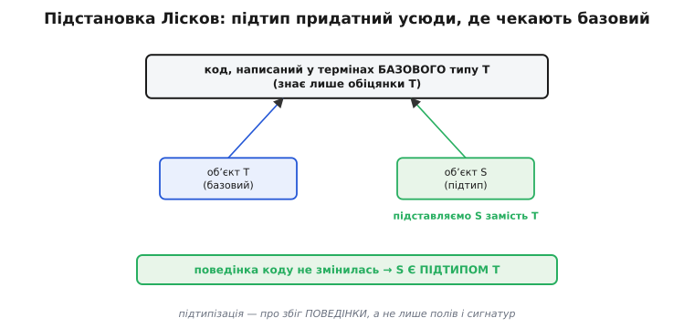
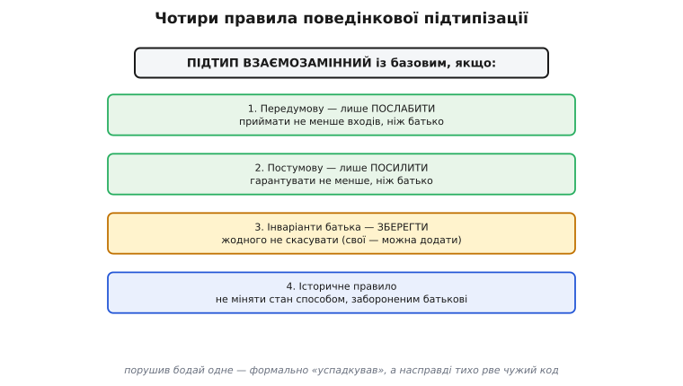
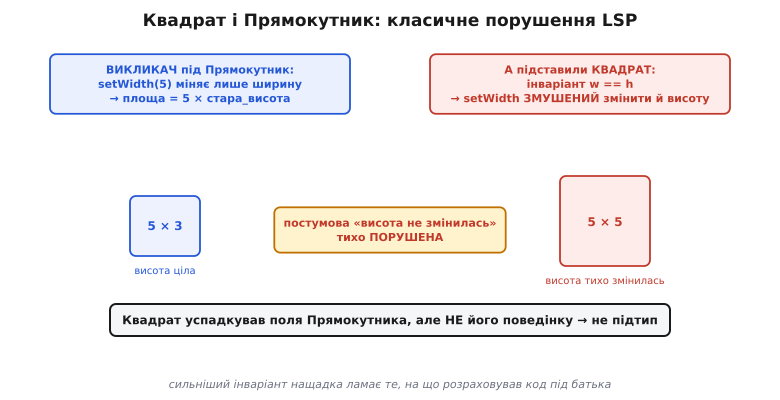

# Поведінкова підтипізація

Ви написали функцію, яка приймає «давач» і знає про нього лише одне: його можна ввімкнути й прочитати число в межах десяти бітів. Через рік хтось підсунув туди новий, «розумніший» давач — формально того самого роду, з тими самими методами. І ваша функція, яку ви рік не торкалися, раптом почала падати. Код її не змінився ні на рядок. Змінилося те, що новий тип **поводиться** не так, як обіцяв старий, — і саме про цю пастку йдеться в поведінковій підтипізації.

Питання, на яке вона відповідає, просте: коли один тип **по-справжньому** є різновидом іншого? Не на папері — а так, щоб його можна було без страху підставити скрізь, де чекають предка. Інтуїція «успадкував — отже різновид» тут зраджує, бо успадкування копіює **поля й сигнатури методів**, а взаємозамінність вимагає збігу **поведінки**. Можна успадкувати все до останнього методу й усе одно не бути придатним замість предка.

## Властивість підстановки

Сформулювала строге правило **Барбара Лісков** (Barbara Liskov) — звідси й назва, **принцип підстановки Лісков** (англ. *Liskov substitution principle*, скорочено LSP). У програмній доповіді 1987 року вона дала умову так: якщо для кожного об'єкта `o₁` типу `S` знайдеться об'єкт `o₂` типу `T` такий, що для **будь-якої** програми, написаної в термінах `T`, її поведінка не зміниться, коли замість `o₂` підставити `o₁`, — тоді `S` є підтипом `T`.

Розпакуймо це людською мовою. Уявіть код, який знає лише про тип `T` і покладається тільки на його обіцянки. Беремо будь-який такий код і всюди, де він працював з об'єктом `T`, підсовуємо об'єкт `S`. Якщо **жодна** така програма не помітила підміни — поведінка та сама, результати ті самі, — то `S` чесно є підтипом `T`. Якщо ж хоч одна програма зламалася, `S` лише вдає різновид `T`, а насправді ним не є.



*Суть підстановки. Є код, який знає лише обіцянки базового типу T. Об'єкт підтипу S мусить підходити в той самий «отвір», що й об'єкт T, — і код не повинен помітити підміни. Збіг тут потрібен не полів і сигнатур (це синтаксична сумісність), а саме поведінки: підтип зобов'язаний поводитися так, щоб старий код лишився правильним.*

Ключове слово — «будь-якої програми». Підтип має бути придатним не в одному зручному сценарії, а **скрізь**, де законно вживають предка, навіть у коді, написаному задовго до появи цього підтипу й нічого про нього не знає. Саме тому це називають **поведінковою підтипізацією**: вимога не до структури типу, а до його поведінки під чужими очікуваннями.

> 🔧 **Навіщо це.** Підтип — це **обіцянка сумісності**, яку дає не лише автор предка, а й кожен, хто колись напише новий різновид. Коли ви заводите інтерфейс драйвера й кілька реалізацій під нього, LSP — це чек-ліст, який рятує від найгидкішого класу багів: «з цим драйвером працює, з тим падає», де падає не там, де причина. Старий код, написаний під інтерфейс узагальнено, ламає не він сам, а несумісна реалізація, підсунута через спільний вказівник.

## Чотири правила взаємозамінності

З умови підстановки прямо випливає, що **вільно** змінювати в підтипі, а що — ні. Підтип успадковує від предка [контракт](topic:sf-release/design-by-contract) — передумови, постумови, інваріанти, — і кожну частину можна зсувати лише в один бік, той, що лишає старий код працездатним.

**Передумову можна лише послаблювати.** Передумова — це вимога до входу. Код під предка готує вхід рівно під **його** вимогу. Якщо підтип **посилить** передумову (зажадає більше), цей код передасть вхід, законний для предка, але вже недостатній для підтипу, — і дістане відмову там, де мав успіх. А **послаблення** безпечне: підтип, що приймає **ширший** діапазон входів, прийме й усе, що готував старий код.

**Постумову можна лише посилювати.** Постумова — це гарантія результату. Код під предка покладається на **його** гарантію й будує на ній далі. Якщо підтип **послабить** постумову (пообіцяє менше), цей код дістане слабший результат, ніж розраховував, і його подальша логіка зламається. А **посилення** безпечне: підтип, що гарантує **більше**, дає старому викликачеві щонайменше очікуване, та ще й понад те.

**Інваріанти предка треба зберігати.** Якщо предок гарантував якусь властивість стану на всіх своїх межах, код під нього на неї спирається. Підтип може **додати** свої інваріанти, але **жодного предкового не має права скасувати**.

**Історичне правило** (англ. *history constraint*). Найтонше з чотирьох: підтип не сміє міняти стан способом, **забороненим** для предка. Підтип нерідко додає власні методи й поля, яких у предка не було, — і через них може дозволити такі переходи стану, яких предок не дозволяв ніколи. Якщо предок гарантував, наприклад, що певна величина лише зростає, підтип не сміє завести метод, який її зменшує: код під предка спирається на цю історію змін, навіть якщо ніколи не бачив нового методу.



*Чотири правила, без яких підтип не взаємозамінний. Перші два — про контракт методу: вхід можна лише розширити, гарантію лише підсилити. Третє боронить інваріанти предка від скасування. Четверте, історичне, стереже спосіб, у який міняється стан у часі: підтип не сміє через свої нові методи робити з об'єктом те, що предкові було заборонено. Порушив бодай одне — формально «успадкував», а насправді тихо рве код, написаний під предка.*

Те саме у звичних термінах сигнатур звучить так: параметри методу в підтипі можуть бути **контраваріантні** (ширші, бо це послаблення вимоги до входу), а тип повернення — **коваріантний** (вужчий, бо це посилення гарантії на виході). Обидва напрямки — лише різні обличчя тих самих двох перших правил.

## Worked-приклад: чому Квадрат не підтип Прямокутника

Класичний контрприклад, що робить правило відчутним, — квадрат і прямокутник. У математиці квадрат **є** прямокутником, тож спокуса успадкувати `Square` від `Rectangle` величезна. Подивімось, як вона ламає чужий код.

Хай прямокутник має незалежні ширину й висоту, і кожну можна виставити окремо. Постумова `set_width` тиха, але цілком конкретна: «ширина стала заданою, **висота не змінилась**». Саме на неї покладається код, написаний під прямокутник.

:::tabs
```cpp
struct Rect {
    uint16_t w, h;
    void set_width (uint16_t nw) { w = nw; }   // висоту НЕ чіпає
    void set_height(uint16_t nh) { h = nh; }
    uint32_t area() const { return (uint32_t)w * h; }
};
```
```python
class Rect:
    def __init__(self, w: int, h: int):
        self.w = w
        self.h = h

    def set_width(self, w: int) -> None:   # висоту НЕ чіпає
        self.w = w

    def set_height(self, h: int) -> None:
        self.h = h

    def area(self) -> int:
        return self.w * self.h
```
```java
class Rect {
    protected int w, h;

    public void setWidth(int w)  { this.w = w; }   // висоту НЕ чіпає
    public void setHeight(int h) { this.h = h; }
    public int  area()           { return w * h; }
}
```
```typescript
class Rect {
    constructor(protected w: number, protected h: number) {}

    setWidth(w: number): void  { this.w = w; }   // висоту НЕ чіпає
    setHeight(h: number): void { this.h = h; }
    area(): number             { return this.w * this.h; }
}
```
:::

Тепер «підтип» Квадрат. У квадрата є власний, **сильніший** інваріант: ширина завжди дорівнює висоті, `w == h`. Щоб його втримати, `set_width` змушений міняти **обидві** сторони — інакше квадрат перестане бути квадратом:

:::tabs
```cpp
// «Квадрат як підтип Прямокутника»: щоб утримати w == h, set_width міняє й висоту.
struct Square : Rect {
    void set_width (uint16_t s) { w = s; h = s; }   // ← і висота!
    void set_height(uint16_t s) { w = s; h = s; }
};
```
```python
# «Квадрат як підтип Прямокутника»: щоб утримати w == h, set_width міняє й висоту.
class Square(Rect):
    def set_width(self, s: int) -> None:
        self.w = s
        self.h = s   # ← і висота!

    def set_height(self, s: int) -> None:
        self.w = s
        self.h = s
```
```java
// «Квадрат як підтип Прямокутника»: щоб утримати w == h, set_width міняє й висоту.
class Square extends Rect {
    @Override public void setWidth(int s)  { w = s; h = s; }   // ← і висота!
    @Override public void setHeight(int s) { w = s; h = s; }
}
```
```typescript
// «Квадрат як підтип Прямокутника»: щоб утримати w == h, set_width міняє й висоту.
class Square extends Rect {
    setWidth(s: number): void  { this.w = s; this.h = s; }   // ← і висота!
    setHeight(s: number): void { this.w = s; this.h = s; }
}
```
:::

А ось код, написаний **під прямокутник** — давно, не знаючи про квадрат. Він спирається рівно на ту постумову, що `set_width` не чіпає висоту:

:::tabs
```cpp
// Викликач знає лише Прямокутник. Виставляє сторони незалежно
// й чекає площу 5 × 4 = 20.
uint32_t resize_and_area(Rect &r) {
    r.set_height(4);
    r.set_width (5);          // постумова: висота лишилась 4
    return r.area();          // очікувано 20
}
```
```python
# Викликач знає лише Прямокутник. Виставляє сторони незалежно
# й чекає площу 5 × 4 = 20.
def resize_and_area(r: Rect) -> int:
    r.set_height(4)
    r.set_width(5)            # постумова: висота лишилась 4
    return r.area()           # очікувано 20
```
```java
// Викликач знає лише Прямокутник. Виставляє сторони незалежно
// й чекає площу 5 × 4 = 20.
int resizeAndArea(Rect r) {
    r.setHeight(4);
    r.setWidth (5);           // постумова: висота лишилась 4
    return r.area();          // очікувано 20
}
```
```typescript
// Викликач знає лише Прямокутник. Виставляє сторони незалежно
// й чекає площу 5 × 4 = 20.
function resizeAndArea(r: Rect): number {
    r.setHeight(4);
    r.setWidth(5);            // постумова: висота лишилась 4
    return r.area();          // очікувано 20
}
```
:::

Підставимо сюди квадрат — через спільний інтерфейс, де `set_width` указує на `square_set_width`. Виклик `set_width(5)` тихо переписав висоту на 5, і площа стала `5 × 5 = 25` замість очікуваних `20`. Функція `resize_and_area` не змінилася ні на рядок, а результат тепер хибний — бо підтип **послабив постумову** `set_width` (тепер вона вже не гарантує сталу висоту) і тим самим зламав те, на що розраховував викликач.



*Механізм порушення. Викликач, написаний під прямокутник, виставляє сторони незалежно й чекає, що ширина не зачепить висоту. Квадрат має сильніший інваріант `w == h`, тож його `set_width` змушений змінити й висоту — і тиха постумова прямокутника «висота не змінилась» порушується. Квадрат успадкував поля прямокутника, але не його поведінку, тож підтипом не є.*

Виправлення не в тому, щоб «акуратніше» написати квадрат, — порушення тут **неусувне**, поки квадрат претендує бути прямокутником із незалежними сторонами. Правильний хід — **визнати, що спадкування тут хибне**. Квадрат не є поведінковим підтипом мутовного прямокутника, тож їх не зв'язують успадкуванням узагалі: або це два окремі типи, або спільний предок дає лише те, що чесно тримають обидва (наприклад, **незмінну** фігуру з обчисленням площі, без сетерів, які й створюють конфлікт). Зникає мутація, що ламала інваріант, — зникає й порушення.

> 🔧 **Навіщо це.** Спокуса «X математично є Y, тож успадкую» — найчастіше джерело прихованих LSP-багів. Перш ніж зв'язати типи спадкуванням, спитайте не «чи X є різновидом Y на папері», а «чи витримає підтип **усі** тихі обіцянки предка, зокрема постумови його сетерів». Якщо сильніший інваріант підтипу змушує порушити бодай одну — спадкування хибне, хай би яким очевидним здавалося в підручнику геометрії.

## Місце в SOLID і зв'язок із контрактом

Буква **«L»** у наборі принципів **SOLID** — це саме принцип Лісков. SOLID зібрав і назвав **Роберт Мартін** (Robert C. Martin) на межі 2000-х як п'ять засад супровідного об'єктно-орієнтованого коду; LSP стоїть у ньому третім і відповідає за те, щоб ієрархії типів не перетворювалися на мінне поле, де кожен новий нащадок може тихо зламати старий код.

Зв'язок із [проєктуванням за контрактом](topic:sf-release/design-by-contract) прямий: LSP — це і є правило про те, **як контракт переживає успадкування**. Контракт каже, хто за що відповідає в межах одного типу; LSP додає, що нащадок не сміє цю відповідальність переписати на гірше. Тому чотири правила вище — це не окрема теорія, а контракт, прочитаний крізь призму спадкування.

## Як це виглядає в C — без класів

У C немає класів і `extends`, але є все, що потрібне для поліморфізму, а отже й для LSP: **таблиці вказівників на функції** (свого роду vtable) та набори реалізацій під один інтерфейс. Коли під єдиний інтерфейс транспорту — скажімо, `read()` і `write()` — пишуть кілька реалізацій (UART, SPI, TCP), кожна з них грає роль «підтипу» спільного інтерфейсу, і LSP діє так само строго.

```c
typedef struct {
    int  (*read) (void *ctx, uint8_t *buf, size_t n);   // контракт: читає до n байтів
    int  (*write)(void *ctx, const uint8_t *buf, size_t n);
} transport_t;
```

Контракт інтерфейсу — спільна домовленість для **всіх** реалізацій: не вимагати на вході більше за неї і не гарантувати на виході менше. Реалізація, чий `read()` потай вимагає, щоб перед ним покликали якийсь її власний `setup()`, **посилила передумову** інтерфейсу — і код, що працює з транспортом узагальнено, через цей вказівник зламається саме на ній, тоді як з іншими реалізаціями працюватиме бездоганно. Баг виявиться не там, де причина, а в загальному коді, який нічого не порушував.

Тут LSP працює пліч-о-пліч із [обробкою помилок](topic:sf-apps/error-handling): спільний контракт інтерфейсу задає не лише, що повертати за успіху, а й **як** повідомляти про збій, — і реалізація, що сигналить помилку інакше (мовчки повертає нуль замість коду помилки), теж тихо несумісна, бо порушує постумову інтерфейсу про спосіб звітування.

## Звідки взялося поняття

Інтуїцію підстановки сформулювала Барбара Лісков у згаданій доповіді 1987 року «Data Abstraction and Hierarchy» на конференції OOPSLA. Строгу, математичну форму поняття дістало пізніше — у праці Лісков і **Жаннетт Вінг** (Jeannette Wing) «A Behavioral Notion of Subtyping» (1994), де й закріпився сам термін «поведінкова підтипізація» та з'явилося **історичне правило** як окрема, нетривіальна умова, якої проста перевірка перед- і постумов не покриває. Усталений факт: ідея підстановки — від Лісков (1987), її поведінкова формалізація з історичним правилом — від Лісков і Вінг (1994), а назву «L» у SOLID їй дав Роберт Мартін.

Поведінкова підтипізація відповідає на питання «чи це справді той самий тип» **наперед** — ще до того, як новий нащадок мовчки зламає старий код. Перевірити саму поведінку без запуску, читаючи код, допомагає [статичний аналіз](topic:sf-release/static-analysis), а підпирає її дисципліна [захисного програмування](topic:sf-apps/defensive-programming) на межі з недовіреним світом, де жодному контрактові вірити не можна.

---
