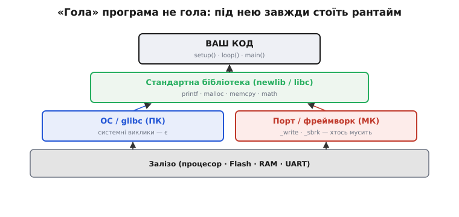
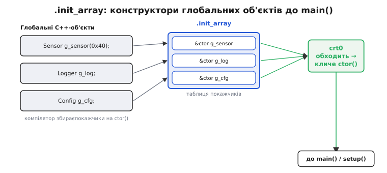
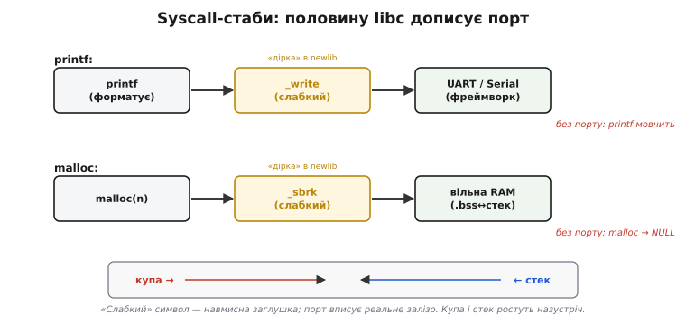
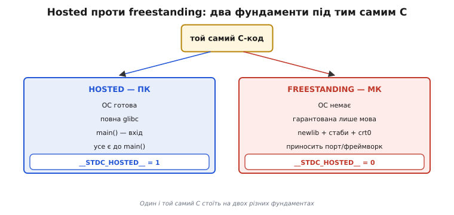
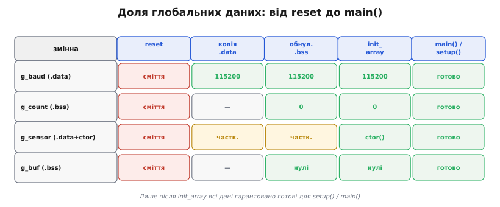

# C-рантайм на голому залізі: що виконується до main()

Шлях [reset → завантажувачі → C-стартап → `main()`](topic:hw-arch/bootloader) зазвичай описують одним рядком: крихітний crt0 копіює `.data`, обнуляє `.bss`, ставить стек — і лише тоді передає керування фреймворку. За цим рядком ховається ціла машинерія. Варто відкрити цю коробку до дна: що насправді є той «C-рантайм», звідки він береться, чому без нього глобальні змінні — сміття, конструктори C++ — мовчать, а `printf` / `malloc` / `time` — взагалі не знають, куди подіти результат. Хто це зрозумів, той перестає дивуватися «чому така проста функція не працює на голому залізі».

### Що таке рантайм мови: невидимий фундамент

Рантайм (*runtime*, англ. «час виконання» — період, коли програма вже працює, на противагу часу компіляції) можна описати просто: це все те, що мова **мовчки вважає наявним**, але чого ви самі не писали. Пишете `int x = 5;` на рівні файлу — очікуєте, що при запуску `x` справді дорівнює 5. Пишете `malloc(100)` — очікуєте шматок пам'яті, а не `NULL`. Пишете `printf("hi\n")` — очікуєте, що текст кудись вийде. Жоден із цих «результатів» не виникає сам: хтось підготував початкові значення, хтось знає, де взяти пам'ять, хтось знає, куди послати байти.

На ПК цей «хтось» — операційна система в парі зі стандартною бібліотекою C (glibc). Про це ніхто не думає: при кожному запуску звичайної програми ОС тихо проганяє службовий код перед `main()`. Цей код — той самий crt0, який і є предметом теми, лише на ПК він прозорий настільки, що не помічається. На голому МК ОС немає — і хтось усе одно мусить це зробити. Цей «хтось» і є **C-рантайм** (*C runtime*, CRT): службовий шар між мовою й залізом, що готує середовище, яке мова вважає даністю.

Рантайм не є частиною самого **стандарту мови C**. Стандарт описує, **що** мова гарантує (наприклад, що неініціалізований глобал дорівнює нулю), але не каже, **як саме** ця гарантія реалізована. Реалізація — справа рантайму конкретної платформи. Тому написати переносний код, що рівно поводиться і на ПК, і на МК, означає знати, які гарантії є скрізь (мовні), а які — лише в hosted-середовищі (системні).


*«Гола» програма зовсім не гола: під нею завжди тихо стоїть рантайм. На ПК нижні шари дає ОС; на МК ОС немає — опору доносить порт або фреймворк.*

> 🔧 **Навіщо це.** Перша ж нова платформа без готового SDK ставить руба питання «що під моїм кодом». Поки рантайм для вас невидимий, кожна нестача (мовчазний `printf`, ранній `NULL` від `malloc`) виглядає як містика. Щойно ви бачите шари — діагностика стає механічною: піднімаєтесь по піраміді знизу вгору й питаєте, який рівень не принесено.

### Crt0 зблизька: чому кожен крок потрібен

Назва crt0 розкладається буквально: *C RunTime, file zero* — «нульовий» об'єктний файл рантайму, що лінкується найпершим, ще перед вашим кодом. Три його дії варто читати не як список кроків, а як **набір передумов**: що саме зламається, якщо кожну з них не зробити.


*Кожна дія crt0 — не ритуал, а необхідна умова. Без копії .data ініціалізований глобал недосяжний; без обнулення .bss нульовий глобал — сміття; без вказівника стека будь-який виклик функції валить машину.*

**Копія `.data` з Flash у RAM.** В [образі прошивки](topic:sf-lang/firmware-image) секція `.data` (англ. *data* — «дані»: ініціалізовані дані) містить глобальні змінні з ненульовим початковим значенням. «Ініціалізовані» тут означає дві речі заразом: **початкові значення** зберігаються у Flash (вони частина образу й не зникають після вимкнення), а самі змінні мусять жити в RAM (бо лише RAM записується під час роботи). Тобто Flash зберігає копію-зразок, а crt0 при кожному старті **переписує** її в RAM. Без цього кроку рядок `int baud = 115200;` читатиметься як сміття — адреса в RAM ще порожня.

**Обнулення `.bss`.** Секція `.bss` тримає неініціалізовані глобальні й статичні змінні. Сама назва — історична: *Block Started by Symbol*, псевдооператор асемблера UA-SAP для IBM 704 (середина 1950-х), що резервував блок неініціалізованого простору під символ. Стандарт C чітко гарантує: такі змінні дорівнюють нулю на початку виконання. Цю гарантію реалізує crt0, явно обнулюючи діапазон пам'яті `.bss`. Без цього там лежав би непередбачуваний вміст — те, що зосталося після попереднього запуску або не записувалося ніколи.

Тут прихована й та різниця, на яку вказує [статичний аналіз](topic:sf-release/static-analysis): **глобал** `int count;` стартує з нуля (crt0 обнулив), а **локал** `int count;` у функції — ні (стек не обнуляється, там лежить те, що зосталося від попереднього виклику). Ворнінг «uninitialized variable» стосується саме локальних — глобали захищені crt0 і стандартом.

Це пояснює й чому **нульовий глобал «безплатний» за розміром образу**. Глобал `int count;` (нуль) попадає в `.bss`, а `.bss` у Flash **не зберігається зовсім** — в образі лежить лише її адреса й довжина, а самі нулі crt0 насипає в RAM при старті. Натомість `int count = 7;` попадає в `.data`, і число 7 мусить фізично лежати у Flash, щоб crt0 мав звідки його скопіювати. Звідси практичне правило: великий буфер, що однаково обнуляється на старті, дешевше лишити неініціалізованим (`static uint8_t buf[8192];`), ніж явнописати `= {0}` і ризикувати, що компілятор покладе вісім кілобайтів нулів у `.data` й роздує образ.

**Ініціалізація вказівника стека.** Стек — неявна машинерія викликів — потребує коректного SP (stack pointer) ще до **першого** виклику функції. Навіть сам crt0 є функцією й виконує виклики. Тому SP треба встановити раніше, ніж crt0 почне щось робити — зазвичай це робить ще векторний обробник [reset](topic:hw-arch/bootloader). Без цього перший же `push` на стек запише дані в невідоме місце пам'яті, і машина «падає» в першу мілісекунду.

Три кроки crt0 виконуються у строгому порядку. Спершу стек (інакше самі виклики неможливі), потім — копія `.data` й обнулення `.bss`. Порушений порядок дав би crt0 шанс зруйнувати власний стек при запису в RAM-діапазон `.bss`. Ця послідовність — не деталь реалізації, а необхідна логіка.

### init_array: конструктори до main()

Окрім трьох обов'язкових кроків підготовки пам'яті, crt0 виконує ще одну дію, про яку часто не здогадуються: обходить спеціальну секцію **`.init_array`** (англ. *init array* — «масив ініціалізації»: масив покажчиків на передстартові функції).


*Так конструктори глобальних C++-об'єктів відпрацьовують до main() / setup(): компілятор склав покажчики в таблицю, crt0 пройшов її й покликав кожен.*

**Що таке `.init_array`.** Коли ви пишете в C++:

```cpp
Adafruit_Sensor g_sensor(0x40);   // глобальний об'єкт
Logger          g_log;
```

компілятор знає, що при старті треба **викликати конструктори** цих об'єктів. Але `main()` ще не почався — хто їх викличе? Компілятор збирає покажчики на всі такі конструктори в секцію `.init_array` (або схожі секції залежно від ABI). Crt0 обходить цей масив покажчиків і кличе кожен запис по черзі. Саме так `g_sensor` отримує повністю сконструйований стан **до** того, як `setup()` уперше виконається.

**Пастка: static initialization order fiasco.** Порядок викликів конструкторів між різними **файлами** стандартом C++ **не визначений**. Якщо `Logger g_log` у `log.cpp` користується у своєму конструкторі об'єктом `Config g_cfg` із `config.cpp` — не гарантовано, що `g_cfg` уже сконструйований у той момент. Це і є «static initialization order fiasco»: підступна помилка, що проявляється лише тоді, коли лінкер склав файли в певному порядку. Рецепт уникнення — або не залежати в конструкторах глобалів від інших глобалів, або вживати «конструкцію при першому зверненні» (singleton через статичну локальну змінну).

Поряд із `.init_array` існує й `.fini_array` (англ. *finish* — «завершити») — та сама механіка, але для **деструкторів** глобальних об'єктів при завершенні програми. На МК «завершення програми» як такого зазвичай немає: чіп або перезавантажується, або лишається в нескінченному циклі. Тому `.fini_array` на МК здебільшого порожня й ігнорується — але знати про неї корисно, бо в деяких RTOS-портах (при коректному завершенні задачі) деструктори таки викликаються.

### newlib: компактна стандартна бібліотека для МК

Crt0 — це стартовий код. Але C-рантайм — не лише старт, а й **стандартна бібліотека**: `printf`, `malloc`, `memcpy`, `strlen`, математика, робота з рядками. На ПК це glibc — велика, потужна, розрахована на наявність ОС. На МК потрібне щось інше.

**newlib** — саме це «щось інше» (назва читається буквально: *new libc*, «нова бібліотека C»). Це компактна реалізація стандартної бібліотеки C (libc), створена спеціально для вбудованих систем без ОС. ESP-IDF і Arduino-ядро для ESP32 тягнуть саме її (або newlib-nano — ще урізану версію для систем із дуже малою Flash). За природою newlib — той самий «склад готових об'єктних файлів», який бере [лінкер](topic:sf-lang/linking), але для стандартних мовних функцій, нижче за [фреймворк](root:embedded/baremetal-vs-framework).

Навіщо взагалі newlib, а не просто написати `printf` самому: стандартна бібліотека — величезний обсяг перевіреної роботи. Лише `printf` обробляє десятки специфікаторів форматування, знаки, ширини, доповнення, числа з плаваючою комою — і всі крайові випадки. Розробники newlib зробили це один раз для всіх архітектур. Ваш тулчейн отримує newlib уже скомпільованою, [лінкер](topic:sf-lang/linking) добирає лише потрібне, а ваша Flash платить лише за використане. Тому новий порт на незнайомий МК часто починається не з власного `printf`, а зі «підключити newlib і написати стаби».

Та є одна принципова відмінність від glibc: newlib **не знає**, де саме живе ваше залізо. Вона вміє форматувати рядки, керувати пам'яттю, реалізовувати алгоритми — але не знає, **куди** виводити символи й **звідки** брати пам'ять на конкретному МК. Для цього вона лишає «дірки».

### Syscall stubs: та половина libc, що її дописує порт

Це серце теми, і хто його зрозумів — назавжди перестає дивуватися «чому printf мовчить».


*Слабкі символи newlib — навмисні заглушки. Порт або фреймворк вписує туди реальне залізо: _write → UART, _sbrk → вільна RAM між .bss і стеком.*

**Слабкі символи — навмисні дірки.** У newlib функції на кшталт `_write`, `_read`, `_sbrk`, `_close`, `_fstat`, `_exit` оголошені як **слабкі** (*weak* — «слабкий» символ) — це той самий механізм, що стоїть за знайомими «undefined reference» і «multiple definition». Слабкий символ означає: [лінкер](topic:sf-lang/linking) підставить заглушку newlib лише тоді, коли ніде немає «сильнішого» означення. Дав порт власну `_write` — вона перемагає заглушку без жодної помилки.

**`_write` → куди йде printf.** Коли `printf("hi\n")` відформатував рядок, він кличе `write()`, а та — `_write(fd, buf, len)`. Заглушка newlib нічого не робить — і саме тому на голому залізі без порту `printf` мовчить: байти нікуди не йдуть. Фреймворк ESP-IDF / Arduino підставляє `_write`, що передає буфер до UART (того самого, за яким стоїть `Serial`). Ось чому `printf` і `Serial.println` обидва з'являються в моніторі порту — врешті вони приходять до одного UART.

**`_sbrk` → звідки malloc бере пам'ять.** Коли `malloc(n)` потребує виділити пам'ять із динамічної купи (*heap*), він зрештою кличе `_sbrk(increment)` — «попросити в операційної системи ще трохи пам'яті». ОС немає — тому `_sbrk` у порті реалізують вручну: він повертає наступний шматок вільної RAM між кінцем `.bss` і низом стека (за [картою пам'яті](topic:sf-lang/firmware-image)). Коли купа «впирається» в стек — `_sbrk` повертає `-1`, і `malloc` повертає `NULL`. Це пряме відлуння [переповнення стека](topic:sf-lang/stack-overflow): купа і стек ростуть **назустріч** одне одному, і якщо обидва великі — зустрінуться в аварії.

Звідси важлива практична річ: `malloc` на МК не «просто забуває» повертати пам'ять — у нього немає звідки взяти нову, якщо купу вичерпано. Тому в критичних системах на МК або уникають динамічного виділення взагалі (усі буфери й структури — статичні, розмір відомий на етапі компіляції), або ретельно стежать за купою. Якщо ж `free()` справно кликати, newlib поверне пам'ять у купу — але гарантії проти фрагментації немає: з часом великі виклики можуть провалюватися навіть при «достатній» кількості вільних байтів, бо купа роздроблена дрібними шматками й суцільного відрізка немає.

Окремо про `_sbrk` і FreeRTOS. Коли на ESP32 працює RTOS зі стеками завдань, кожне завдання має **власний** стек у heap. Тобто динамічне виділення іде не лише з вашого `malloc`, а й із системних викликів FreeRTOS. Тому ESP-IDF замінює стандартний `_sbrk` власним менеджером купи, що тримає кілька регіонів пам'яті (DRAM, IRAM, PSRAM). Але принцип той самий: хтось реалізував дірку, і без неї `malloc` не знав би, де брати байти.

> ⚙️ **Глибше — повний набір стабів newlib і потокова безпека.** Які саме виклики обов'язкові й що в кожному писати (`_sbrk`/`_write`/`_read`/`_close`/`_fstat`/`_getpid`/`_kill`/`_exit`), чим newlib-nano відрізняється від повного newlib (агресивніше усічення `printf`/`scanf`), і як newlib тримає `errno` потоково-безпечним через окрему `struct _reent` на задачу в контексті FreeRTOS на ESP-IDF — у вставці [Стаби newlib і syscalls](topic:sf-lang/c-runtime/proj-newlib-syscalls.md).

### freestanding проти hosted

Усьому описаному є точне ім'я. Стандарт C визначає два **середовища виконання** (*execution environments*):

- **Hosted** (англ. «з господарем», гостьове): є операційна система, є повна реалізація стандартної бібліотеки C, `main()` — точка входу, і ОС сама все підготувала до вашого першого рядка. Ваш ПК.
- **Freestanding** (англ. «самостійне, без опори»): гарантовано лише сама мова й мінімум стандартних заголовків. Немає ОС, немає повної libc автоматично, немає навіть обов'язкового `main()` як точки входу (фреймворк може кликати свою точку). МК — завжди freestanding.


*На ПК (hosted) ОС і glibc готують усе до main(). На МК (freestanding) гарантована лише мова; решту — newlib, стаби, crt0 — мусить принести порт або фреймворк.*

Ось чому один і той самий C-код на ПК і на МК **поводиться по-різному**: не тому що мова інша, а тому що **фундамент під нею інший**. [Крос-компіляція](topic:sf-lang/compilation) і вибір тулчейну перемикають не лише набір машинних команд, а й увесь рантайм-фундамент.

Практичний наслідок: портативна бібліотека, що мусить працювати і на ПК, і на МК, не покладається на «справжні» системні виклики (`open`, `mmap`, `clock_gettime`) поза явними `#ifdef`-гілками. На freestanding їх або немає, або це заглушки, що завжди повертають помилку. Перевіряйте стандартний макрос `__STDC_HOSTED__` (1 для hosted, 0 для freestanding) або власний `EMBEDDED`-дефайн із системи збірки.

### ESP32-специфіка: що вже за вас зробив фреймворк

На ESP32 crt0, `.init_array`, newlib і всі стаби вже надані ESP-IDF або Arduino-ядром. Ви не пишете `_write`, не реалізуєте `_sbrk`, не обходите `.init_array` вручну. Власний `main()` у фреймворку — теж їхній (він стартує FreeRTOS, ставить системні завдання й аж тоді кличе вашу `setup()`). Але **розуміти**, що все це є і як влаштовано, — цінно: коли `printf` раптом мовчить (нова платформа, інший порт), коли `malloc` рано повертає `NULL` (купа не виросла до потрібного розміру, або стек-бар налаштований не так), коли глобальний об'єкт C++ «порожній» у першому рядку `setup()` (init_array не відпрацював через неправильний лінкер-скрипт) — ви знаєте, де копати.

Ще один практичний момент: ESP-IDF дозволяє **налаштувати** купу через `menuconfig` (родина параметрів `CONFIG_HEAP_*`). Якщо `malloc` повертає `NULL` раніше, ніж очікуєте — можливо, купа просто замала або сильно фрагментована від попередніх виділень. Функція `heap_caps_get_free_size(MALLOC_CAP_DEFAULT)` покаже, скільки вільного лишилося. Це вже конкретний ESP32-інструмент поверх тієї самої `_sbrk`-механіки.

**Життя глобальних даних до main().** Чотири змінні різного роду:

```cpp
int    g_baud   = 115200;      // .data  — початкове значення лежить у Flash
int    g_count;                // .bss   — стандарт C гарантує 0
Sensor g_sensor(0x40);         // .data + конструктор у .init_array
char   g_buf[256];             // .bss   — обнулиться crt0
```


*Лише після обходу init_array всі дані гарантовано готові для setup() / main().*

```
Момент             g_baud          g_count     g_sensor        g_buf

reset              сміття          сміття      сміття          сміття
після копії .data  115200 ✓        сміття      часткове        сміття
після обнул. .bss  115200 ✓        0 ✓         часткове        нулі ✓
після init_array   115200 ✓        0 ✓         сконструйов. ✓  нулі ✓
setup() / main()   готовий ✓       готовий ✓   готовий ✓       готовий ✓
```

`g_count` не потребує `= 0` — crt0 обнулить. Але покладатися на `g_sensor` у ранньому глобальному конструкторі **іншого** файлу — небезпечно: init_array ще не добіг туди.

**Чому printf мовчав.**

```cpp
// Голий МК без фреймворку: _write — заглушка, що нічого не робить
// → printf форматує, але байти нікуди не йдуть.

// Щоб printf запрацював — вписати стаб під ваш UART:
extern "C" int _write(int fd, const char* buf, int len) {
    (void)fd;
    uart_send(UART_NUM_0, (const uint8_t*)buf, (size_t)len);
    return len;
}
// Тепер printf("hi\n") → _write → uart_send → UART → монітор порту.
// На ESP32 фреймворк уже поставив цю «підпірку» за вас.
```

> 🔧 **Навіщо це.** Коли на голому залізі або в новому порті `printf` мовчить, `malloc` рано повертає `NULL`, глобальний C++-об'єкт «порожній» на початку `setup()` — не шукайте спочатку баг у власному коді. Спитайте: чи стоїть рантайм? Чи заповнені `_write` / `_sbrk`? Чи відпрацював `.init_array`? На ESP32 з ESP-IDF або Arduino-ядром відповідь на всі три — «так»; але знати про ці питання означає не впасти в паніку, коли одного дня відповідь виявиться «ні».

«Магії старту» немає зовсім — ні в [ланцюгу завантажувачів](topic:hw-arch/bootloader), ні в самому рантаймі, що тихо готує дані, кличе конструктори й дає стандартним функціям опору в залізі. Між reset і вашим першим рядком стоїть не диво, а дописана (вами або фреймворком) бібліотека-фундамент.

Щоб відчути ціну цього знання, уявіть перенос ESP32-прошивки на новий МК без готового фреймворку. Зібрати [образ](topic:sf-lang/firmware-image) і залити ви вмієте; знаєте й те, як виглядає [reset-послідовність](topic:hw-arch/bootloader). Лишається суто рантаймова частина: на новій платформі написати crt0 (або взяти готовий `crt0.o` від newlib), налаштувати `.init_array`, написати стаби `_write` / `_sbrk` / `_read` — і аж тоді ваш `printf` заговорить. Це не абстракція, а покроковий рецепт першого запуску на будь-якому голому залізі. Саме так починали всі embedded-порти, що ви тепер безтурботно вживаєте в готовому вигляді.

І це не дрібне знання: розуміючи весь шлях від тексту до ожилого чипа, ви бачите, **де** що може зламатися, і знаєте, **яким** інструментом це полагодити. Така прозорість і відрізняє того, хто впевнено робить вбудовані системи, від того, хто наосліп тицяє кнопки в надії, що «якось запрацює».
