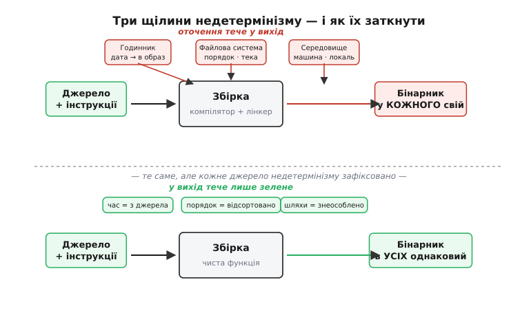

# 🔌 Відтворювані збірки: коли той самий код дає той самий байт у кожного

Уявіть, що ви завантажили готову прошивку — скажімо, оновлення для радіомодуля — і поряд лежить її вихідний код. Розробник присягається: «оцей бінарник зібрано саме з цього коду, нічого зайвого». Як **перевірити** присягу, не вірячи розробникові на слово? Єдиний чесний спосіб — зібрати код **самому** й порівняти результат. Але тут чигає підступність: якщо ваша збірка дасть бінарник, який відрізняється від чужого хоч на один байт, ви не знатимете, чому. Може, туди хтось уплів закладку. А може, просто ваш комп'ютер записав у файл **іншу дату**, і насправді все чисто. Ця невизначеність убиває саму ідею перевірки.

**Відтворювана збірка** (*reproducible build*) — це коли така двозначність неможлива за побудовою. Той самий вихідний код, зібраний тими самими інструкціями, дає **біт-у-біт однаковий** бінарник у кого завгодно, на будь-якій машині, у будь-який день. Збіглося — джерело чесне; розійшлося — щось не так, і треба з'ясовувати що. Ніякого «майже однаково». Це не абстрактна чистота заради краси — це **клас інженерних систем**, зі своєю типовою будовою, своїми «розпіновками» й своїми граблями, які повторюються від проєкту до проєкту незалежно від мови й платформи. Саме тому про відтворювані збірки варто говорити як про **річ**, а не як про побажання: у них є впізнаваний устрій, який працює однаково всюди.

## Клас: детермінована функція «джерело → бінарник»

Що це за клас систем? Придивімося до звичайної збірки й побачимо, що зазвичай вона **не** є тим, чим здається. Компілятор і [лінкер](root:sf-lang/linking) начебто перетворюють текст на бінарник — і ми уявляємо це як чисту математичну функцію: подав вхід, отримав вихід, той самий вхід завжди дає той самий вихід. Але справжня збірка тихцем підмішує до входу купу всього, чого ви не писали: котра зараз година, як звати вашу машину, у якій теці лежить проєкт, у якому порядку файлову систему повернула список файлів. Формально це вже **не функція від джерела** — це функція від джерела **плюс усього оточення**, а оточення в усіх різне.

> 🔧 **Навіщо це.** У прошивках це не дрібниця. Ваш бінарник, що керуватиме мотором чи гальмами, зазвичай **підписують** криптографічно перед заливанням ([secure boot](root:sf-security/firmware-secure-boot) впустить лише підписаний образ). Підпис засвідчує «це саме той бінарник» — але **не** «цей бінарник відповідає саме цьому коду». Розрив між «підписано» і «відповідає джерелу» закриває тільки відтворюваність: лише вона дає змогу незалежно довести, що підписаний образ виріс саме з відкритого коду, а не з чогось із дописаним рядком.

Клас відтворюваних збірок — це збірки, зведені назад до **чистої функції**: усе, що не є джерелом і оголошеними інструкціями, з входу **прибрано або зафіксовано**. Тоді вихід залежить лише від того, що видно всім, — і будь-хто, маючи те саме джерело, відтворює той самий байт. Ось точний критерій, яким користується спільнота Reproducible Builds: *збірка відтворювана, якщо, маючи той самий вихідний код, те саме оточення збірки й ті самі інструкції збірки, будь-хто може відтворити біт-у-біт однакові копії всіх зазначених артефактів*. Три «те саме» — джерело, оточення, інструкції — і жодного прихованого четвертого.

Тест, чи річ належить цьому класу, простий і не залежить від виробника: зберіть двічі на **двох різних** машинах у **різні дні** й порівняйте хеші файлів. Однакові — маєте відтворювану збірку. Різні — маєте звичайну, і десь усередину протекло оточення. Цей тест той самий для C, Rust, Go, для прошивки й для веб-застосунку; тому й опис класу — узагальнений, без прив'язки до конкретного компілятора чи системи збирання.

## Блок-схема: де в збірку протікає оточення

Щоб зробити збірку чистою, треба спершу **побачити всі щілини**, крізь які просочується недетермінізм. Їх насправді небагато, і вони ті самі скрізь. Ось потік від джерела до бінарника з позначеними точками протікання.


*Джерело й інструкції — те, що бачать усі (зелене). Але дорогою в бінарник збірка запитує **годинник** (яка зараз дата — і вона осідає в образі), **файлову систему** (у якому порядку йдуть файли, у якій теці ми зараз) і **середовище** (ім'я машини, користувач, мова системи). Кожен такий запит домішує до виходу щось, чого нема в джерелі, — і бінарник у кожного виходить свій. Нижня гілка — той самий потік, але кожне джерело недетермінізму або **прибрано**, або **прибито до сталої**: годинник замінено на дату з джерела, порядок файлів відсортовано, шляхи знеособлено. Тоді вихід залежить лише від зеленого — і збігається в усіх.*

Схема показує головне: **джерел протікання рівно три роди**, і всі три — це звертання збірки по щось поза джерелом. Розберемо кожне, бо саме на них тримається весь клас, і кожне усувається своїм характерним прийомом.

## «Розпіновка» класу: три канонічні джерела недетермінізму

Як у будь-якого класу пристроїв є типова розпіновка — набір «ніжок», однаковий у всіх представників, — так і у відтворюваних збірок є канонічний набір джерел недетермінізму. Їх варто знати напам'ять: зустрівши незібрану збірку, ви перебиратимете саме ці «ніжки» одну за одною.

### Часові мітки — найгучніша ніжка

Найпоширеніше протікання — **час**. Безліч інструментів під час збірки питають системний годинник і вписують поточну дату в результат: компілятор може вкласти дату збірки через макроси `__DATE__` і `__TIME__`, архіватор — записати час модифікації кожного файлу в заголовок, генератор документації — проставити «згенеровано такого-то числа». Наслідок очевидний: зберіть той самий код завтра — і всі ці дати зміняться, а отже, зміняться байти.

```c
// Класичне протікання часу прямо в код:
const char *build_stamp = __DATE__ " " __TIME__;
// Сьогодні:  "Jul  2 2026 14:31:07"
// Завтра:    "Jul  3 2026 09:15:42"   ← інші байти, хоч код той самий
```

Лікування цієї ніжки стало стандартом. Замість «котра зараз» збірці кажуть узяти **одну фіксовану** мітку — час останньої зміни самого джерела — через узгоджену змінну оточення **`SOURCE_DATE_EPOCH`**. Це просто число: скільки секунд минуло від початку Unix-епохи (1 січня 1970, 00:00:00 UTC). Її запровадив проєкт Reproducible Builds близько 2015 року, і відтоді десятки інструментів навчилися: якщо ця змінна виставлена — беру дату з неї, а не з годинника (усталений факт; специфікація опублікована на reproducible-builds.org).

```c
// Замість системного годинника — фіксована мітка з оточення.
// Значення однакове в кожного, хто збирає це джерело,
// тож і байти в усіх однакові.
time_t t = 0;
const char *s = getenv("SOURCE_DATE_EPOCH");
if (s) t = (time_t)strtoll(s, NULL, 10);   // напр. 1719931200
// далі форматуємо саме t, а не time(NULL)
```

Тонкість, яку варто відчути: мова **не** про те, щоб узагалі викинути дату з бінарника (іноді вона потрібна). Мова про те, щоб дата була **функцією джерела**, а не функцією моменту збірки. Тоді вона в усіх однакова — і перестає заважати перевірці.

### Порядок файлів — тиха, але злюча ніжка

Друга ніжка підступніша, бо не впадає в око. Коли збірка обробляє **набір** файлів — компонує їх у бібліотеку, пакує в архів, зшиває об'єктні файли, — вона мусить пройти їх **у якомусь порядку**. І дуже часто цей порядок береться таким, яким його повернула файлова система, — а стандарт POSIX **не обіцяє** жодного визначеного порядку для системного виклику `readdir(3)`, що читає вміст теки. На одній машині файли повернуться в одному порядку, на іншій — в іншому (залежить від типу файлової системи, історії створення файлів, навіть від версії ядра).

Чому це псує байти? Бо порядок часто **осідає у виході**: у якому порядку символи лягли в таблицю бібліотеки, у якому файли записані в архів, у якому секції йдуть у бінарнику. Той самий набір, зібраний у різному порядку, дає різні байти — хоч жоден файл не змінився.

```c
// НЕДЕТЕРМІНОВАНО: обробляємо у «сирому» порядку файлової системи.
DIR *d = opendir("src");
struct dirent *e;
while ((e = readdir(d)) != NULL)      // порядок НЕ визначений стандартом
    add_to_archive(e->d_name);        // → архів у кожного свій

// ДЕТЕРМІНОВАНО: спершу зібрати список, відсортувати, тоді обробляти.
collect_names(names, "src");
qsort(names, n, sizeof(char*), cmp_str);   // однаковий порядок скрізь
for (size_t i = 0; i < n; i++)
    add_to_archive(names[i]);          // → архів у всіх однаковий
```

Лікування — завжди **сортувати** перед обробкою (за іменем, за якимось стабільним ключем — байдуже, аби детерміновано). Прийом дешевий, а виловлює цілий клас «мерехтіння» збірок, яке інакше здається містикою: та сама команда на двох машинах дає два різні файли, і причина — лише в порядку.

### Шляхи збірки — ніжка, що видає вашу машину

Третя ніжка — **шляхи файлової системи**, у яких відбувалася збірка. Здавалося б, до бінарника вони стосунку не мають; насправді протікають щедро. Компілятор вписує абсолютний шлях до файлу через макрос `__FILE__` (він потрапляє в повідомлення `assert`, у логи, у налагоджувальну інформацію). Лінкер лишає в ELF-бінарнику записи **RPATH** — шляхи, де шукати бібліотеки. Налагоджувальні символи прямо посилаються на теки з вихідним кодом.

```c
// __FILE__ несе АБСОЛЮТНИЙ шлях складача — а він у кожного свій:
if (x < 0)
    fprintf(stderr, "bad x at %s:%d\n", __FILE__, __LINE__);
// у вас:   "/home/andrij/proj/src/motor.c:88"
// у мене:  "/build/ci/9f3a/src/motor.c:88"   ← інші байти, той самий код
```

Наслідок: бінарник несе відбиток **вашого домашнього каталогу** чи випадкового шляху білд-сервера. У двох людей теки різні — байти різні. Лікування — **знеособити** шляхи: збирати з відносних шляхів або наказати компіляторові переписати префікс шляху на щось стале (як-от порожній рядок чи умовне `.`). Тоді в бінарнику лишається `src/motor.c` замість `/home/андрій/...`, і він перестає видавати, на чиїй машині зібраний.

> 🔧 **Навіщо це.** Ці три ніжки — не абстрактний перелік, а **чекліст діагностики**. Коли ваша прошивка «раптом» збирається щоразу інакше й підпис не сходиться, ви не гадаєте навмання: перебираєте час → порядок → шляхи, і майже завжди винна одна з трьох. Знання класу економить години: замість шукати містичну причину, ви одразу дивитеся в три відомі щілини.

Є й дрібніший «периферійний» набір ніжок — ім'я користувача й машини, мова системи (локаль впливає на сортування рядків!), кодування, версія самих інструментів. Але переважну більшість незібраних збірок пояснюють саме **три головні**: час, порядок, шляхи.

## «Підключення»: як увімкнути відтворюваність у наявній збірці

Знаючи розпіновку, підключити відтворюваність до звичайного проєкту нескладно — і послідовність та сама для будь-якої мови й системи збирання. Це і є «типове підключення» класу.

```
1. Зафіксуй час      → виставити SOURCE_DATE_EPOCH (напр. час коміту з git),
                        навчити код/інструменти брати дату з неї, не з годинника
2. Впорядкуй набори   → сортувати файли/символи перед пакуванням; вимкнути
                        «сирий» порядок файлової системи всюди, де він тече у вихід
3. Знеособ шляхи      → збирати з відносних шляхів; переписати префікс складача
                        на сталий; прибрати RPATH з абсолютними теками
4. Прибий оточення    → фіксована локаль (LC_ALL=C), фіксовані версії інструментів,
                        не вписувати ім'я машини/користувача у вихід
```

Ключова думка підключення — **усе змінне або прибрати з входу, або зробити функцією джерела**. Час стає функцією джерела (мітка коміту). Порядок стає детермінованим (сортування). Шляхи стають сталими (знеособлення). Після цих чотирьох кроків вихід залежить лише від того, що бачать усі, — і збірка входить у клас відтворюваних.

## «Перший байт»: як переконатися, що збірка справді відтворювана

Найменша осмислена перевірка нового представника класу — зібрати **двічі** й порівняти. Це аналог «першого байта» для будь-якого пристрою: найдрібніша дія, що доводить — воно живе.

**Умова: маємо джерело й команду збірки. Треба — переконатися, що збірка біт-у-біт стала.**

```c
// Найпростіший тест відтворюваності — власними руками, без жодних рамок:

// 1. Зібрати перший раз, відкласти хеш результату
build()  ->  out_A
sha256(out_A)  =  H_A

// 2. Змінити оточення якомога сильніше: інша тека, інша дата,
//    інша машина — усе, що НЕ є джерелом
cd /somewhere/else ; date -s "next week"   // умовно
build()  ->  out_B
sha256(out_B)  =  H_B

// 3. Порівняти хеші
H_A == H_B ?  Так → збірка відтворювана: оточення у вихід не тече.
              Ні  → десь протікання; шукати різницю в out_A vs out_B.
```

Уся суть — у кроці 2: перевірку робить осмисленою саме **навмисна зміна всього зайвого**. Якщо ви зберете двічі поспіль на одній машині в одну хвилину, збіг нічого не доведе — оточення не встигло змінитися. Треба навпаки: змінити дату, теку, машину — і подивитися, чи вистояв бінарник. Вистояв — оточення справді відрізане.

Коли хеші **не** збіглися, наступний крок — знайти, **де саме** розійшлися байти. Для цього є діагностичний прийом, теж однаковий для всіх: розкласти обидва бінарники на людиночитний вигляд (розібрати архіви, показати заголовки, дизасемблювати) і порівняти рядок за рядком. Різниця майже завжди тицьне пальцем у конкретну ніжку: «ось тут дата», «ось тут інший порядок файлів у таблиці», «ось тут чийсь домашній каталог». Далі — лікування відповідної ніжки за розпіновкою вище.

## Навіщо цей клас узагалі існує: захист ланцюга постачання

Тепер — головне «навіщо», без якого клас лишається технічною забавкою. Відтворюваність — це фундамент **захисту ланцюга постачання ПЗ** (*software supply chain*). Ланцюг постачання — це весь шлях коду до вашого пристрою: розробник пише джерело, білд-сервер його збирає, хтось підписує, хтось роздає бінарник, ви заливаєте. Атака на ланцюг постачання — це підміна на **будь-якому** проміжному кроці, найпідступніше — **на самій збірці**: джерело чисте, а бінарник, який вам дали, несе закладку, бо скомпрометовано білд-сервер.

Звичайний підпис від цієї атаки не рятує: він засвідчує, що бінарник **не змінили після** збірки, але не каже нічого про те, чи бінарник **відповідає** відкритому джерелу. Якщо отруту вписали під час збірки, підпис чесно засвідчить отруєний бінарник. Ось де вмикається відтворюваність: якщо збірка відтворювана, **будь-хто** може взяти те саме джерело, зібрати сам і звірити байти з тим, що роздають. Збіглося — джерело справді відповідає бінарнику, білд-сервер нічого не дописав. Розійшлося — тривога. Перевірку може зробити хто завгодно, незалежно, не довіряючи ні розробникові, ні білд-серверу.

Саме цей страх — «шкідник, що атакує **сам процес збирання**, аби роздати себе мільйонам машин одним офіційно підписаним оновленням» — і підняв рух відтворюваних збірок. Історично першими були криптовалюти: інструмент Gitian для детермінованих збірок з'явився в проєкті Bitcoin близько 2011 року, бо користувачам треба було довіряти завантаженому гаманцю, не вірячи роздавачеві на слово. Далі, близько 2013 року, Gitian підхопив проєкт Tor — Майк Перрі (Mike Perry) зробив збірку браузера Tor відтворюваною саме зі страху перед атакою на процес збирання. Того ж 2013 року проєкт Debian розгорнув відтворювані збірки на **весь** свій архів пакунків — і це стало каталізатором для всієї галузі (усталені факти; хронологію веде reproducible-builds.org).

## Родич по духу: подвійна компіляція проти отруєного компілятора

Є один особливий випадок, де відтворюваність б'є в найглибший корінь довіри, і його варто відокремити. Найлихіша уявна атака на ланцюг постачання — коли отруєно **сам компілятор**: він тихцем вписує закладку в усе, що збирає, і вписує її навіть у **власний** новий бінарник, коли компілює сам себе. Тоді отрута живе не в жодному джерелі, а лише в бінарнику компілятора, передаючись із покоління в покоління; жоден аудит вихідного коду її не знайде, бо в коді її просто нема. Цей моторошний сценарій описав Кен Томпсон у лекції з нагоди премії Тюрінга 1984 року «Роздуми про довіру до довіри» (*Reflections on Trusting Trust*) — усталений факт.

Проти цієї, здавалося б, невиліковної атаки Девід Вілер (David A. Wheeler) показав захист, що спирається саме на відтворюваність, — **подвійну компіляцію різними компіляторами** (*diverse double-compiling*, DDC). Ідея гострих ліктів: візьмемо **другий, незалежний** компілятор (інший, від інших людей, зроблений іншим шляхом) і зберемо ним те саме джерело підозрюваного компілятора. Отримаємо якийсь бінарник — можливо, зовсім не схожий на підозрюваний, бо компілятори різні. Але тепер **цим** щойно зібраним бінарником зберемо джерело ще раз — і якщо джерело чесне, результат має **біт-у-біт** збігтися з підозрюваним бінарником. Двом різним отрутам не сховатися однаково: якби підозрюваний був отруєний, а незалежний — ні, байти б розійшлися.

```
Підозрюваний бінарник компілятора:            C_susp
Незалежний, довірений компілятор:             C_trust
Джерело перевірюваного компілятора:           src

Крок 1:  C_trust( src )   ->  A     // проміжний, може бути геть інакший
Крок 2:  A( src )         ->  B     // а ось B — того ж роду, що й C_susp

Порівняння:
  B == C_susp ?  Так → джерело чесно відповідає бінарнику: отрути нема,
                       навіть якщо C_susp колись збирав сам себе.
                 Ні  → джерело НЕ пояснює бінарник: підозрюваного отруєно.
```

Уся сила — у **двох незалежних шляхах до того самого байта**. Отрута Томпсона тримається на тому, що ланцюг збирання **один** і замкнений сам на себе; варто ввести **другий**, незалежний шлях і зажадати біт-у-біт збігу — і закладка викривається, бо не змогла причаїтися однаково в обох. Вілер оприлюднив цей прийом у праці на конференції ACSAC 2005 року й розгорнув у докторській дисертації 2009 року, де формально довів, що атаку можна виявити, і показав це на чотирьох реальних компіляторах (усталений факт).

Тут видно, що DDC — не окрема магія, а **застосунок** того самого класу: він працює лише тому, що збірка компілятора **відтворювана**, тобто дає біт-у-байт сталий результат. Без відтворюваності крок «порівняти B з C_susp» не мав би сенсу — байти й так розходилися б від часу, порядку й шляхів, і закладку неможливо було б відрізнити від безневинного дрейфу. Відтворюваність — це та сталість тла, на якій **будь-яка** підміна стає видимою: чи то дописаний зловмисником рядок, чи то отрута в самому компіляторі.

## Варіації класу: наскільки суворою буває відтворюваність

Наостанок — як не сплутати різні ступені суворості всередині класу, бо «відтворювано» кажуть про кілька різних речей.

**Відтворювано за фіксованого оточення.** Найм'якший ступінь: та сама збірка дає той самий байт, **якщо** зафіксувати ще й версії інструментів, локаль, змінні оточення. Це найпоширеніший практичний рівень: більшість проєктів досягають саме його, домовившись про однакове оточення (часто через контейнер чи заморожений набір інструментів). Тут вихід — функція джерела **й** узгодженого оточення.

**Відтворювано незалежно від оточення.** Суворіший ідеал: байт той самий навіть за різних версій компонування, аби головні джерела недетермінізму (час, порядок, шляхи) відрізано. На практиці дається важче — надто версії самих інструментів схильні лишати відбиток, — але саме до нього тягнуться, коли хочуть, щоб перевірити збірку міг **геть будь-хто** зі своїм набором інструментів.

**Детерміновано, але не переносно.** Окрема пастка термінології: збірка може бути **детермінованою** (той самий байт при повторі на **тій самій** машині), але не **відтворюваною** (на іншій машині байт інший). Детермінізм — необхідна, але не достатня умова; він прибирає випадковість у межах однієї машини, а відтворюваність вимагає ще й незалежності від машини. Плутати їх — типова помилка: «у нас збирається однаково» часто означає лише детермінізм на одному сервері, а не справжню відтворюваність, яку може перевірити сторонній.

**Відтворюваність похідних, не лише бінарника.** Ширший погляд: у клас входять не тільки виконувані файли, а будь-які **артефакти** — архіви пакунків, образи прошивки, документація, навіть контейнери. Скрізь ті самі три ніжки й той самий критерій біт-у-біт. Тому прийоми з розпіновки вище переносяться без змін: пакуєте ви ELF-образ для мікроконтролера, `tar`-архів чи образ файлової системи — час, порядок і шляхи течуть однаково, і затикаються однаково.

Звідси й проста стратегія роботи з будь-якою збіркою, яку хочеться зробити перевірюваною: спершу визнач **ступінь**, якого прагнеш (фіксоване оточення — легко; повна незалежність — важко), потім перебери **три канонічні ніжки** й затки кожну, і лише тоді покладайся на біт-у-біт звірку як на доказ. Відтворювана збірка не робить код безпечнішим сама собою — вона робить його **перевірюваним**, а перевірюваність і є те, на чому тримається довіра до всього, що ви заливаєте в пристрій.
