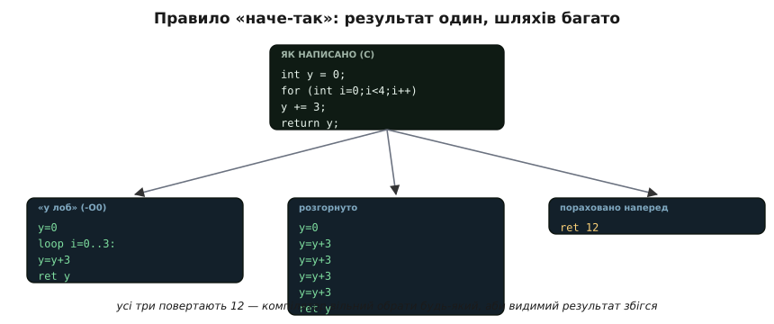
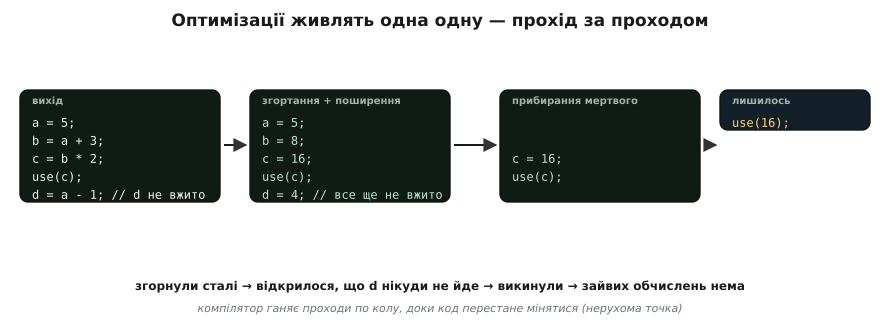
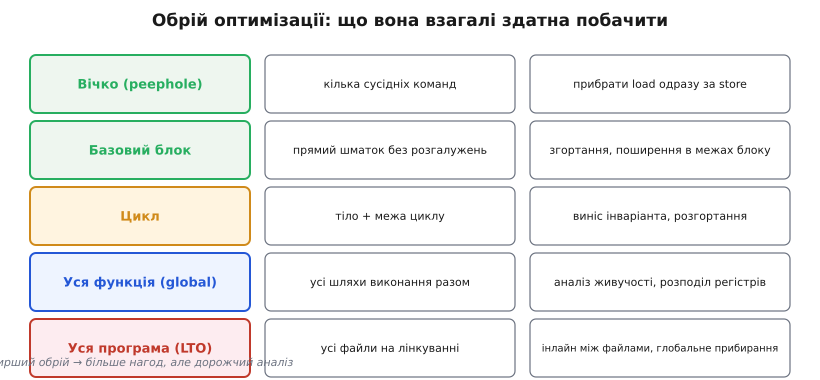

# Оптимізації компілятора

Напишіть найпростіший рядок — скажімо, `x = 2 + 3;` — і попросіть компілятор показати, який машинний код він видав. Множення й додавання там не буде: у програмі одразу з'явиться число `5`. Компілятор порахував вираз замість вас, ще на своєму столі, бо результат від цього не змінився, а роботи процесорові поменшало. Це і є **оптимізація** (лат. *optimus* — «найкращий»): переписування вашого коду в код, що робить **те саме**, тільки швидше, менше або й те, й те.

Ключове слово тут — «те саме». Компілятор не має права зробити програму іншою; він має право лише зробити її **кращою при незмінному видимому результаті**. Уся сила й уся підступність оптимізатора виростають із цього одного дозволу, тож із нього й почнімо.

## Дозвіл, на якому все тримається

Уявіть, що ви замовили майстрові табурет і сказали, з якого дерева та якої висоти. Вам байдуже, у якому порядку він пиляв ніжки й скільки разів переставляв рубанок, — вам важливий готовий табурет. Рівно таку свободу має компілятор: ви задаєте **видиму поведінку** програми (що вона виводить, що пише в пам'ять, які виклики робить), а **як** саме процесор до цього дійде — його клопіт. Це правило зветься «наче-так» ([as-if](topic:sf-lang/as-if-rule) — «наче все так і було»): компілятор може переписати код як завгодно, аби спостережуваний ззовні результат лишився тим самим.

> 🔧 **Навіщо це.** Саме тому згенерований асемблер **не лягає рядок-у-рядок** на ваш текст: майстер має право переставити свої дії. Коли ви відлагоджуєте прошивку й дивуєтесь, що змінна «зникла», а два рядки помінялися місцями, — це не збій, це «наче-так» у дії. Знати про цей дозвіл — значить не сваритися на компілятор, а розуміти, що він у своєму праві.


*Один цикл `y += 3` чотири рази можна перекласти буквально, розгорнути в чотири додавання підряд або порахувати наперед у `12`. Усі три варіанти повертають те саме число, тож усі три компіляторові дозволені — він обере той, що вигідніший за обраним критерієм.*

Межа цього дозволу окреслена строго: усе, що програма робить **видимого**, зберігається, а все інше — на розсуд компілятора. Тому обчислення, чий результат нікуди не йде, він може просто викинути: воно нічого видимого не робить. А от запис у пам'ять, виклик функції, вивід — це видимі дії, і чіпати їх він не сміє. Уся дальша розмова — про те, які саме переписування вкладаються в цю межу.

## Що оптимізатор насправді робить

Перетворень десятки, але майже всі стоять на кількох простих ідеях. Варто знати їх на ім'я — тоді згенерований код перестає лякати.

**Рахувати наперед усе стале.** Якщо значення виразу відоме вже під час компіляції, його рахують там-таки, а в програму кладуть готове число. Це **згортання сталих** (*constant folding*): `60 * 60 * 24` перетвориться на `86400` ще в компіляторі — жодного множення в машинному коді не буде. Поряд іде **поширення сталих і копій** (*constant / copy propagation*): якщо `a = 5; b = a + 1;`, компілятор бачить, що `a` — це просто `5`, і пише `b = 6`, а зайве `a` викидає.

**Викидати те, що ні на що не впливає.** Обчислення, результат якого ніде не читають, — це **мертвий код** (*dead code*), і оптимізатор його прибирає. Оголосили змінну й не вжили; порахували проміжок, що нікуди не пішов, — усе це зникне безслідно, бо з погляду «наче-так» його наче й не було. Так само викидається **недосяжний код** — гілка після `return` чи умова, що завжди хибна.

**Не повторювати ту саму роботу.** Якщо один і той самий вираз рахується двічі, а між обчисленнями нічого в ньому не змінилося, друге обчислення замінюють на вже готовий результат першого — це **усунення спільних підвиразів** (*common subexpression elimination*). Окремий випадок для циклів: обчислення, що на кожній ітерації дає **те саме**, виносять **за** цикл, щоб не повторювати його даремно, — **виніс інваріанта** (*loop-invariant code motion*).

**Прибирати накладні витрати.** Тіло маленької функції можна вставити прямо в місце виклику — це **інлайн** (*inlining*, від *in line* — «у рядок»). Зникає сам виклик із його підготовкою аргументів і поверненням, а головне — на місці вставленого тіла відкривається купа нових нагод усе те саме згорнути й повикидати. Короткий цикл на кілька проходів компілятор інколи розписує **підряд**, без лічильника й переходів, — **розгортання циклу** (*loop unrolling*): виходить довший код, зате без витрат на керування циклом.

**Тримати гаряче в регістрах.** Звертатися до пам'яті повільно, тож змінні, з якими триває активна робота, компілятор намагається тримати в регістрах процесора — це **розподіл регістрів** (*register allocation*). Часто ваша локальна змінна взагалі не отримує комірки в пам'яті: вона все життя проводить у регістрі, а в пам'ять не потрапляє жодного разу. Ось чому в оптимізованій збірці її буває не видно налагоджувачеві — її фізично ніде немає.

Багато з цих перетворень мають глибший другий шар — як компілятор доводить, що переписування безпечне (аналіз потоку даних, форма з єдиним присвоєнням SSA, графи), і як він вибирає порядок проходів. Хто хоче спуститися туди — [окремий розгляд механіки оптимізацій](topic:sf-lang/compiler-optimizations/detail) веде від інтуїції до самих алгоритмів. Тут же нам вистачить самих ідей.

## Чому вони живлять одна одну

Найцікавіше починається, коли перетворення зчіпляються. Кожне з них не просто прибирає трохи роботи — воно **відкриває нагоду** для наступного. Порахували сталу наперед — і раптом стало видно, що змінна, яка від неї залежала, більше нікуди не йде. Викинули цю змінну — і виявилося, що цикл, який її наповнював, тепер порожній. Викинули цикл — зникла й підготовка до нього. Одна ниточка тягне за собою всю плутанину.


*Ланцюжок присвоєнь тане на очах. Згортання й поширення обертають вирази на сталі; тоді стає видно, що `d` нікуди не йде, і воно зникає; лишається один-єдиний виклик `use(16)`. Кожен прохід відкриває роботу для наступного.*

Саме тому компілятор проганяє оптимізації не раз, а **по колу**: прогнав усі проходи, і якщо код від цього змінився — прогнав іще раз, бо зміна могла відкрити нові нагоди. Так триває, доки черговий прохід уже нічого не міняє, — цей стан звуть **нерухомою точкою** (*fixpoint*, «нерухома точка»). Тому й буває, що з десятка ваших рядків лишається два: не одне могутнє перетворення їх стерло, а низка дрібних, де кожне готувало ґрунт наступному. І тому ж інлайн такий цінний — вставивши тіло функції на місце виклику, він викидає цілий пласт коду на поживу всім іншим оптимізаціям одразу.

## Обрій: чим ширше видно, тим більше можна

Різні оптимізації дивляться на код із різної висоти. Деякі бачать лише кілька сусідніх команд, інші — цілу функцію, а найпотужніші — усю програму разом. Що ширший цей **обрій**, то більше нагод відкривається — але то й дорожчий аналіз.


*Знизу вгору росте те, що оптимізація здатна охопити за раз: від кількох сусідніх команд («вічко») до всіх файлів разом на лінкуванні (LTO). Ширший обрій відмикає сильніші перетворення, але коштує більше часу на аналіз.*

На найвужчому обрії працює **вічко** (*peephole*, «вічко») — воно ковзає віконцем у кілька команд і прибирає локальні дурниці, як-от читання одразу за записом у ту саму комірку. Трохи ширше — **базовий блок**, прямий шматок коду без розгалужень: у його межах зручно згортати сталі й поширювати копії. Ще ширше — **цикл**, де живуть виніс інваріанта й розгортання. На рівні **цілої функції** компілятор бачить усі шляхи виконання разом і може розумно розподілити регістри та простежити, де змінна ще «жива», а де вже ні. І найширший обрій — **уся програма**: це **оптимізація на етапі лінкування** ([LTO](topic:sf-lang/linking), *link-time optimization*), коли компілятор бачить усі файли одразу й може, скажімо, вставити інлайном функцію з одного файлу у виклик з іншого — те, чого при роздільному компілюванні кожного файлу окремо він побачити не міг.

## Скільки старатися — ваш вибір

Силу оптимізації регулюють **рівнем**, і ви задаєте його прапорцем компіляторові. `-O0` — не оптимізувати нічого: код виходить великий і повільний, зате **прозорий** для відлагодження — рядки на місці, змінні видно. `-O2` — переписувати заради **швидкості**, це звичний робочий рівень. `-Os` — заради **малого розміру**, що на мікроконтролері особливо важить, бо Flash-пам'ять там тісна. Є й агресивніші режими на кшталт `-O3`, але вони не завжди виграшні: розгорнуті цикли й масовий інлайн роздувають код, і на тісному чіпі це може вийти боком.

Компроміс тут чесний і його треба прийняти свідомо: що агресивніше компілятор переписує код, то він швидший і менший — але то й **важче його відлагоджувати**, бо асемблер уже мало схожий на ваш текст. Розумна практика — не боятися оптимізації, а **тримати два режими** під рукою: релізну збірку женуть на `-O2` чи `-Os`, а коли з'являється загадковий баг, той самий код тимчасово перезбирають на `-O0`, ловлять причину й повертаються на бойовий рівень.

## Де це кусає прошивку

Тепер найважливіше для того, хто пише під залізо. «Наче-так» стереже **видиму** поведінку — але видиму **з погляду мови C**. А в прошивці частина поведінки видима не мові, а **залізу**, і про неї компілятор не здогадується. Отут і криється ціла родина граблів.

**Порожній цикл-затримка зникає.** Написали `for (i = 0; i < 1000; i++);` як паузу — оптимізатор бачить цикл без жодного видимого ефекту й **викидає** його цілком. Затримки немає, і поведінка стала іншою — але не з погляду C, для якого цикл справді нічого не робив.

**Читання регістра «кешується».** Опитуєте в циклі апаратний прапорець, а компілятор вирішує, що змінна сама собою не міняється, читає її **один раз** і крутить порівняння зі старим значенням. Прошивка «зависає» на рівному місці, хоч залізо давно готове. Ось як це виглядає:

**Умова: чекаємо, доки апаратура виставить біт готовності в регістрі статусу.**

```c
// ПОМИЛКА: компілятор має право прочитати STATUS лише раз
#define STATUS (*(uint32_t *)0x3FF44004)   // ілюстративна адреса регістра

void wait_ready(void) {
    while ((STATUS & 0x01) == 0) {          // крутимося, доки біт 0 не стане 1
        ;                                    // тіло порожнє — просто чекаємо
    }
}
```

З погляду оптимізатора `STATUS` — звичайна комірка пам'яті, яку **ніхто в цьому коді не змінює**. За правилом «наче-так» він має повне право прочитати її раз, покласти в регістр процесора й далі порівнювати вже зі **сталим** значенням. Якщо біт був нуль, цикл стає **нескінченним**, хоча апаратура давно виставила готовність.

Ліки — сказати компіляторові, що ця комірка може змінитися **сама**, поза його полем зору. Це робить ключове слово [`volatile`](topic:sf-lang/volatile): воно забороняє кешувати доступ і змушує **щоразу** читати з пам'яті.

```c
// ВІРНО: volatile змушує читати регістр на кожній ітерації
#define STATUS (*(volatile uint32_t *)0x3FF44004)

void wait_ready(void) {
    while ((STATUS & 0x01) == 0) {
        ;
    }
}
```

Загальне правило просте: усе, що чіпає **залізо** або **спільне з перериванням**, має бути `volatile` — інакше оптимізатор чесно, у своєму праві, зробить із вашим кодом те, чого ви не хотіли.

І ще одна пастка, згубніша за попередні, бо тиха. Оптимізатор вважає, що [**невизначеної поведінки**](topic:sf-lang/undefined-behavior) (*undefined behavior*, UB) у коректній програмі **не буває**, і будує машинний код, спираючись на це припущення. Тому переповнення знакового числа, вихід за межі масиву чи розіменування `nullptr` під `-O2` дають не «передбачуваний збій», а химерну, непередбачувану поведінку: компілятор міг викинути цілу перевірку, бо «за правилами» ситуація, яку вона ловить, неможлива. Тут немає одного ключового слова-ліків — є лише дисципліна не допускати UB узагалі.

> 🔧 **Навіщо це.** Звичка час від часу зазирати в згенерований асемблер (`gcc -O2 -S file.c` дає його у `file.s`, а `objdump -d file.o` розбирає готовий об'єктний файл) — те, що відрізняє впевнену роботу з МК від ворожіння. Коли затримка «не затримує», а опитування «висить», справжню причину видно саме там: зник цикл, читання винесено за межу. Один погляд туди економить години гадання.

## Чому це варте вивчення

Легко прочитати перелік пасток як вирок оптимізатору: мовляв, підступний, тримаймося подалі. Це хибний висновок. На мікроконтролері з тісним Flash і скромним ядром **без** оптимізації часто просто не обійтися — код `-O0` буває вдвічі більший і помітно повільніший, і програма або не влазить у пам'ять, або не встигає за реальним часом. Оптимізатор задарма дає те, що інакше довелося б вимучувати руками, дизасемблюючи власний код і переставляючи команди самому.

Сучасний оптимізатор майже завжди генерує **кращий** машинний код, ніж написала б людина вручну, — недарма фундамент цього ремесла заклала [Френсіс Аллен, перша жінка-лауреатка премії Тюрінга](topic:sf-lang/compiler-optimizations/hist-frances-allen.md), ще коли компілятори тільки вчилися переписувати код. Тому давнє мистецтво «писати критичні шматки прямо в асемблері заради швидкості» нині майже відмерло: простіше скласти ясний код мовою високого рівня й довіритися компіляторові. Ваша справа — ясність задуму; його справа — ефективність виконання. А знати, за якими правилами він грає, треба лише для того, щоб не заважати йому там, де він має рацію, і поставити `volatile` там, де рацію маєте ви.
