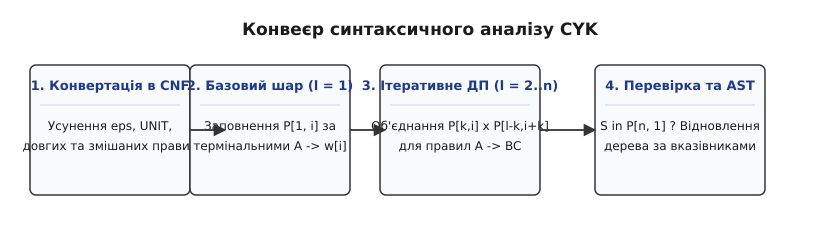
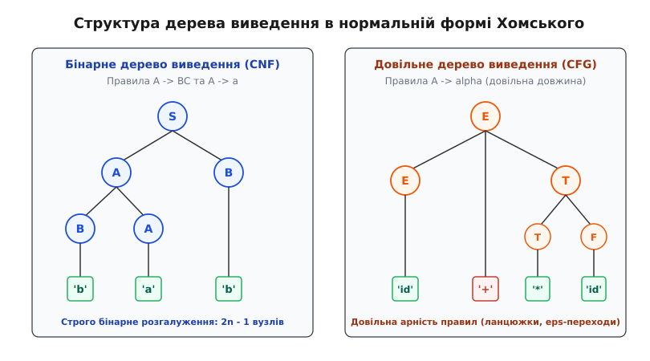
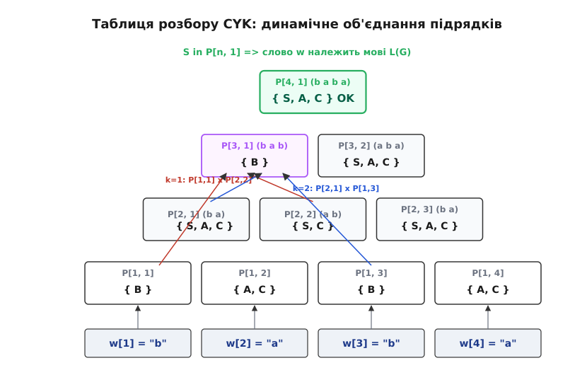

# Алгоритм Кока–Янгера–Касамі (CYK)

<preknowlist>
- [Формальна мова](topic:computability/formal-language) — алфавіт Σ, вхідні слова та мова як підмножина множини всіх слів Σ*.
- [Ієрархія Хомського](topic:computability/chomsky-hierarchy) — чотири класи граматик, контекстно-вільні мови та їхні розпізнавачі.
- [Магазинні автомати](topic:computability/pushdown-automata) — автомати зі стековою пам'яттю (LIFO) для недетермінованого розпізнавання КВ-мов.
- [Асимптотична складність](topic:computability/asymptotic-complexity) — класи складності, оцінки O(n³), просторова та часова вартість алгоритмів.
</preknowlist>

Коли синтаксичний аналізатор отримує на вхід вихідний текст програми або речення природної мови, він повинен відповісти на фундаментальне питання: чи може задана послідовність термінальних символів бути породжена правилами певної контекстно-вільної граматики, і якщо так, то яку структуру має дерево її виведення. Якщо граматика містить неоднозначності, ліву рекурсію або численні альтернативні правила розгалуження, наївні алгоритми розбору з поверненням (backtracking) стикаються з комбінаторним вибухом і витрачають експоненційний час `O(kⁿ)` на перебір тупикових гілок.

Спеціалізовані детерміновані методи розбору на зразок `LL(k)` та `LR(k)` працюють за лінійний час `O(n)`, проте вони принципово вимагають строгого детермінізму і неспроможні обробляти довільні контекстно-вільні граматики з недетермінованим вибором, які регулярно виникають в обробці природної мови (NLP), біоінформатичному моделюванні вторинної структури РНК та аналізі складних форматів даних.

Алгоритм Кока–Янгера–Касамі (Cocke–Younger–Kasami, CYK) вирішує цю проблему за поліноміальний час: спираючись на парадигму динамічного програмування (грец. *dynamis* — сила, рух), він розпізнає належність довільного слова довжини `n` будь-якій контекстно-вільній граматиці за час `O(n³ · |G|)` та пам'ять `O(n² · |V_N|)` без жодного ризику зациклення чи експоненційного сповільнення.


*Конвеєр синтаксичного аналізу CYK: від зведення граматики до нормальної форми Хомського через ітеративне динамічне програмування до побудови синтаксичного дерева.*

## Нормальна форма Хомського (CNF) як фундамент бінарного розбиття

Алгоритм CYK працює не з довільним синтаксичним записом, а вимагає попереднього зведення граматики до строго нормованого вигляду. **Контекстно-вільна граматика** (грец. *grammatikē* — мистецтво читання й письма) `G = (V_N, V_T, R, S)` складається з множини нетермінальних символів `V_N` (лат. *terminus* — межа; синтаксичні змінні), множини термінальних символів `V_T` (алфавіт підсумкової мови), множини правил виведення `R` та виділеного початкового нетермінала `S` (аксіоми; грец. *axioma* — прийняте положення).

Граматика перебуває в **нормальній формі Хомського** (Chomsky Normal Form, CNF), якщо кожне її правило з множини `R` належить до одного з трьох суворих типів:
1. `A → BC` — нетермінал розпадається строго на **два** нетермінали (`A, B, C ∈ V_N`, причому `B, C ≠ S`);
2. `A → a` — нетермінал породжує строго **один** термінальний символ (`A ∈ V_N`, `a ∈ V_T`);
3. `S → ε` — аксіома породжує порожнє слово (дозволяється лише якщо `ε ∈ L(G)`, при цьому `S` не може стояти в правих частинах інших правил).

```
Довільне правило CFG:    A → B C D e F
Канонічний вигляд CNF:    A → B C       або    A → a
```

Вимога нормальної форми Хомського — це не формальне спрощення, а математичний ключ до детермінізації структури виведення. У довільній граматиці виведення слова довжини `n` може містити довільну кількість кроків через ланцюгові заміни `A → B → C` та стискання `A → ε`. На противагу цьому, у граматиці CNF кожне непорожнє слово довжини `n` виводиться **рівно за `2n - 1` кроків**:
- `n - 1` застосувань бінарних правил `A → BC` (кожне додає рівно один новий нетермінал);
- `n` застосувань термінальних правил `A → a` (кожне перетворює один нетермінал на конкретну літеру).

Будь-яка контекстно-вільна граматика ефективно трансформується в еквівалентну форму CNF за 5 кроків (додавання нової аксіоми `START`, винесення терміналів `TERM`, бінаризація довгих правил `BIN`, видалення `ε`-переходів `DEL` та усунення ланцюгових правил `UNIT`). Строге математичне доведення цієї еквівалентності та збереження мови наведено у вставці [математичні основи, доведення та теорему Вальянта](topic:sf-lang/cyk-algorithm/math-cnf-and-complexity.md).


*Структура дерева виведення: зліва — бінарне дерево у формі CNF зі строго подвійним розгалуженням на 2n − 1 вузлів; справа — довільне КВ-дерево з довільною арністю вузлів.*

Головна властивість форми CNF полягає в принципі бінарного розбиття: якщо нетермінал `A` породжує підрядок `w[i .. j]` довжини `l = j - i + 1 ≥ 2`, то першим правилом виведення обов'язково є `A → BC`. Це означає, що підрядок `w[i .. j]` гарантовано розпадається на два суміжні неперервні непорожні шматки:
- лівий префікс `w[i .. i+k-1]` довжини `k` (`1 ≤ k < l`), що виводиться з нетермінала `B`;
- правий суфікс `w[i+k .. j]` довжини `l - k`, що виводиться з нетермінала `C`.

Цей розпад перетворює глобальну задачу пошуку синтаксичного дерева на локальну задачу оптимальної підструктури: розпізнавання підрядка довжини `l` зводиться до перевірки всіх можливих точок його розбиття на пари менших підрядків.

## Механіка динамічного програмування: піраміда підрядків

Алгоритм CYK використовує підхід знизу-вгору (bottom-up parsing; лат. *pars [orationis]* — частина мови, розбір). Замість спроб передбачити послідовність правил від аксіоми `S` вниз до тексту, алгоритм починає з окремих термінальних літер вхідного рядка і поступово обчислює множини нетерміналів для підрядків дедалі більшої довжини.

Нехай на вхід подано слово `w = a₁ a₂ ... aₙ` довжини `n`.
Для збереження проміжних результатів будується двовимірна таблиця (або чарт; лат. *charta* — аркуш паперу):

```
P[l, i] ⊆ V_N
```

де:
- `l` — довжина аналізованого підрядка (`1 ≤ l ≤ n`);
- `i` — початкова позиція підрядка у вхідному слові (`1 ≤ i ≤ n - l + 1`);
- `P[l, i]` — множина всіх нетерміналів `A ∈ V_N`, з яких можна вивести підрядок `w[i .. i+l-1]`.

Таблиця має трикутну (пірамідальну) форму. Нижній рівень піраміди містить `n` клітинок для одиничних символів, а верхній — рівно одну клітинку `P[n, 1]`, яка охоплює все вхідне слово від початку до кінця.


*Піраміда динамічного програмування алгоритму CYK: нижній шар l = 1 ініціалізується термінальними правилами, а вищі шари обчислюються комбінуванням результатів менших підрядків для всіх точок розбиття k.*

### Крок 1: Ініціалізація базового шару (l = 1)
Для кожного одиничного символу `a_i` (де `1 ≤ i ≤ n`) клітинка `P[1, i]` заповнюється всіма нетерміналами `A`, для яких у граматиці існує пряме термінальне правило `A → a_i`:

```
P[1, i] = { A ∈ V_N | (A → a_i) ∈ R }
```

### Крок 2: Ітеративне заповнення за зростанням довжини (l = 2, 3, ..., n)
Коли всі клітинки для довжин, менших за `l`, уже обчислені, переходимо до рівня `l`.

Для кожної початкової позиції `i` від `1` до `n - l + 1`:
1. Розглядаємо всі можливі точки розбиття підрядка на дві частини. Довжина лівої частини `k` може набувати значень від `1` до `l - 1`. Відповідно, довжина правої частини дорівнює `l - k`.
2. Ліва частина підрядка починається в позиції `i` і має довжину `k`. Множина нетерміналів, що її породжують, уже обчислена і міститься в клітинці `P[k, i]`.
3. Права частина підрядка починається в позиції `i + k` і має довжину `l - k`. Її нетермінали збережено в клітинці `P[l - k, i + k]`.
4. Для кожної пари нетерміналів `B ∈ P[k, i]` та `C ∈ P[l - k, i + k]` шукаємо в граматиці бінарні правила вигляду `A → BC`. Якщо таке правило існує, нетермінал `A` додається до поточної клітинки `P[l, i]`:

```
P[l, i] = ⋃_{k=1}^{l-1} { A ∈ V_N | ∃ (A → BC) ∈ R, де B ∈ P[k, i] ∧ C ∈ P[l - k, i + k] }
```

### Крок 3: Критерій розпізнавання слова
Після обчислення верхівки піраміди `P[n, 1]` перевіряється головна умова:

```
w ∈ L(G)  ⟺  S ∈ P[n, 1]
```

Якщо стартовий символ граматики `S` міститься у множині `P[n, 1]`, вхідне слово успішно виводиться в заданій граматиці. Якщо `S ∉ P[n, 1]`, слово не належить мові `L(G)`.

> 🔧 **Навіщо це.** Класичний рекурсивний спуск без мемоізації повторно розбирає той самий фрагмент виразу сотні разів у різних гілках виведення. Піраміда CYK гарантує, що кожен можливий підрядок аналізується строго один раз, а результат його розбору зберігається в клітинці `P[l, i]` для миттєвого використання вищими рівнями.

## Покроковий трасувальний приклад

Щоб наочно побачити внутрішню динаміку обчислень, розберемо роботу алгоритму на конкретній граматиці та вхідному рядку.

Нехай задано граматику `G` у формі CNF зі стартовим символом `S`:
- **Бінарні правила:**
  - `S → AB | BC`
  - `A → BA | a`
  - `B → CC | b`
  - `C → AB | a`
- **Термінальні правила:**
  - `A → a`
  - `B → b`
  - `C → a`

Вхідне слово: `w = "b a b a"` (довжина `n = 4`).

### Етап 1: Базовий шар (довжина l = 1)
- `i = 1`: символ `w[1] = 'b'`. Правила з терміналом `'b'`: `B → b`.
  `P[1, 1] = { B }`
- `i = 2`: символ `w[2] = 'a'`. Правила з терміналом `'a'`: `A → a`, `C → a`.
  `P[1, 2] = { A, C }`
- `i = 3`: символ `w[3] = 'b'`. Правила з терміналом `'b'`: `B → b`.
  `P[1, 3] = { B }`
- `i = 4`: символ `w[4] = 'a'`. Правила з терміналом `'a'`: `A → a`, `C → a`.
  `P[1, 4] = { A, C }`

### Етап 2: Підрядки довжини l = 2
- **`P[2, 1]` (підрядок "b a", позиції 1..2):**
  Єдина точка розбиття `k = 1`: ліва частина `P[1, 1] = { B }`, права частина `P[1, 2] = { A, C }`.
  Можливі пари `(B, A)` та `(B, C)`:
  - для `(B, A)` є правило `A → BA` `⇒` додаємо `A`;
  - для `(B, C)` є правило `S → BC` `⇒` додаємо `S`.
  `P[2, 1] = { S, A }` (також `C → AB` не підходить, бо пара `(B, A)`, а не `(A, B)`). Отримуємо `P[2, 1] = { S, A }`.

- **`P[2, 2]` (підрядок "a b", позиції 2..3):**
  Точка розбиття `k = 1`: ліва частина `P[1, 2] = { A, C }`, права `P[1, 3] = { B }`.
  Пари: `(A, B)` та `(C, B)`.
  - для `(A, B)` є правила `S → AB` та `C → AB` `⇒` додаємо `S` та `C`.
  `P[2, 2] = { S, C }`

- **`P[2, 3]` (підрядок "b a", позиції 3..4):**
  Точка розбиття `k = 1`: ліва `P[1, 3] = { B }`, права `P[1, 4] = { A, C }`.
  Аналогічно до `P[2, 1]`:
  `P[2, 3] = { S, A }`

### Етап 3: Підрядки довжини l = 3
- **`P[3, 1]` (підрядок "b a b", позиції 1..3):**
  Дві точки розбиття `k = 1` та `k = 2`:
  - `k = 1`: `P[1, 1] × P[2, 2] = { B } × { S, C } = { (B, S), (B, C) }`.
    Правило для `(B, C)`: `S → BC` `⇒` додаємо `S`.
  - `k = 2`: `P[2, 1] × P[1, 3] = { S, A } × { B } = { (S, B), (A, B) }`.
    Правила для `(A, B)`: `S → AB`, `C → AB` `⇒` додаємо `S`, `C`.
  `P[3, 1] = { S, C }`

- **`P[3, 2]` (підрядок "a b a", позиції 2..4):**
  Дві точки розбиття `k = 1` та `k = 2`:
  - `k = 1`: `P[1, 2] × P[2, 3] = { A, C } × { S, A } = { (A, S), (A, A), (C, S), (C, A) }` (жодне правило не підходить).
  - `k = 2`: `P[2, 2] × P[1, 4] = { S, C } × { A, C } = { (S, A), (S, C), (C, A), (C, C) }`.
    Правило для `(C, C)`: `B → CC` `⇒` додаємо `B`.
  `P[3, 2] = { B }`

### Етап 4: Верхівка піраміди (підрядок "b a b a", l = 4, i = 1)
Перевіряємо три точки розбиття `k = 1, 2, 3`:
- `k = 1`: `P[1, 1] × P[3, 2] = { B } × { B } = { (B, B) }` (правил немає).
- `k = 2`: `P[2, 1] × P[2, 2] = { S, A } × { S, C } = { (S, S), (S, C), (A, S), (A, C) }` (правил немає).
- `k = 3`: `P[3, 1] × P[1, 4] = { S, C } × { A, C } = { (S, A), (S, C), (C, A), (C, C) }`.
  Правило для `(C, C)`: `B → CC` `⇒` додаємо `B`.

Таким чином, `P[4, 1] = { B }`.
Оскільки початковий символ `S ∉ P[4, 1]`, підсумковий вердикт: рядок `"b a b a"` **не породжується** цією граматикою від аксіоми `S` (хоча породжується від нетермінала `B`).

Якщо ж замінити стартовий символ на `B`, слово було б визнане правильним. Табличний підхід дозволяє одночасно визначити вивідність слова з будь-якого нетермінала граматики без додаткових обчислень.

## Побудова дерева синтаксичного розбору (AST) за зворотними вказівниками

Сам по собі базовий алгоритм CYK є **розпізнавачем** (recognizer) — він відповідає «так/ні» на питання належності слова мові. Однак для практичного застосування у трансляторах та компіляторах необхідно побудувати конкретне синтаксичне дерево (Concrete Syntax Tree / AST; лат. *arbor* — дерево).

Для перетворення розпізнавача на повноцінний синтаксичний генератор дерева структуру клітинки таблиці доповнюють списком **зворотних вказівників** (backpointers).

Коли алгоритм на рівні `l` знаходить правило `A → BC` для точки розбиття `k`, він записує в клітинку `P[l, i]` четвірку:
```
Backpointer = (A, k, B, C)
```

```
                        [ P[l, i] : A ]
                         /           \
               довжина k/             \довжина l-k
                       /               \
              [ P[k, i] : B ]     [ P[l-k, i+k] : C ]
```

Після завершення заповнення таблиці побудова дерева виконується рекурсивною функцією `BuildTree(l, i, Symbol)`:
1. Якщо `l = 1`, створюється термінальний листок дерева з міткою `Symbol` та літерою `w[i]`.
2. Якщо `l > 1`, у клітинці `P[l, i]` знаходиться зворотний вказівник для `Symbol`, який вказує на точку розбиття `k` та пару нетерміналів `(B, C)`.
3. Рекурсивно викликаються `left = BuildTree(k, i, B)` та `right = BuildTree(l - k, i + k, C)`.
4. Створюється внутрішній вузол дерева з лівим піддеревом `left` та правим піддеревом `right`.

Якщо граматика є **неоднозначною** (ambiguous), у клітинці `P[l, i]` для одного нетермінала `A` може існувати кілька різних зворотних вказівників (з різними точками `k` або різними парами `BC`). У такому разі алгоритм може або згенерувати всі можливі дерева виведення (ліс синтаксичних дерев, Parse Forest), або обрати одне за певним критерієм.

Повну виробничу реалізацію парсера на C та C++ з відновленням дерева розбору, керуванням пам'яттю та обробкою неоднозначностей наведено у вставці [практичну реалізацію парсера CYK на C та C++](topic:sf-lang/cyk-algorithm/proj-cyk-parser.md).

## Асимптотичний аналіз: просторова та часова вартість

Алгоритм CYK характеризується суворо детермінованими межами складності, що не залежать від форми розгалужень у граматиці.

### Часова складність
Час роботи алгоритму визначається кількістю комбінацій трійки індексів `(l, i, k)`:
- Зовнішній цикл за довжиною `l` виконується `n - 1` разів (для `l = 2 .. n`).
- Середній цикл за початковою позицією `i` виконується `n - l + 1` разів.
- Внутрішній цикл за точкою розбиття `k` виконується `l - 1` разів.
- У тілі внутрішнього циклу перевіряються всі бінарні правила граматики `|R_{bin}|`.

Загальна кількість елементарних кроків становить:
```
T(n)
= ∑_{l=2}^n (n - l + 1) · (l - 1) · |R_{bin}| + n · |R_{term}|    [сума за рівнями l та позиціями i, k]
= ((n³ - n) / 6) · |R_{bin}| + n · |R_{term}|                     [підсумовування квадратів та лінійних членів]
= O(n³ · |G|)                                                     [асимптотична оцінка за домінуючим членом]
```

Кубічна залежність `O(n³)` від довжини вхідного рядка `n` є платою за здатність розбирати абсолютно будь-які контекстно-вільні граматики без обмежень на детермінізм.

### Просторова складність
Таблиця динамічного програмування містить `n(n + 1) / 2` клітинок. У найгіршому випадку кожна клітинка зберігає всі нетермінали граматики `|V_N|` та відповідні списки зворотних вказівників:
```
S(n) = O(n² · |V_N|)
```

### Субкубічна межа Вальянта: зв'язок із множенням матриць
Довгий час вважалося, що кубічний бар'єр `O(n³)` є фундаментальним для контекстно-вільного розбору. Проте у 1975 році Леслі Вальянт (Leslie Valiant) довів, що обчислення таблиці CYK можна формалізувати як серію множень розріджених булевих матриць над напівкільцем граматики.

Завдяки цьому розпізнавання КВ-мов зводиться до алгоритмів швидкого матричного множення:
```
T_{Valiant}(n) = O(M(n) · log n · |G|) = O(n^{2.372} · |G|)
```
де `M(n)` — часова складність множення двох матриць `n × n` (сучасна межа за методом Дюана–Ву–Чжоу становить `O(n^{2.371552})`).

## Практичне застосування та модифікації

Незважаючи на те, що для компіляторів мов програмування найчастіше обирають вужчі лінійні парсери (`LL`, `LR`, `LALR`), алгоритм CYK залишається незамінним у галузях, де мова є природно неоднозначною або не дозволяє детермінованого передбачення.

### 1. Ймовірнісний розбір (Probabilistic CYK / PCFG)
В обробці природної мови (Natural Language Processing, NLP) майже кожне речення має десятки граматично коректних, але семантично абсурдних дерев виведення (наприклад, відома дилема прив'язки прийменникового звороту: *«I saw the man with a telescope»*).

У стохастичних граматиках (PCFG) кожному правилу приписується ймовірність `P(A → BC) ∈ [0, 1]`. Алгоритм CYK розширюється за схемою алгоритму Вітербі: у клітинку `P[l, i, A]` записується не просто булевий прапорець, а максимальна ймовірність виведення підрядка з нетермінала `A`:

```
Score(A, l, i) = max_{k, B, C} [ P(A → BC) · Score(B, k, i) · Score(C, l - k, i + k) ]
```

Для запобігання втраті точності з рухомою комою (underflow) добуток замінюють на суму логарифмів ймовірностей:
```
log_score = log P(A → BC) + log_score(B) + log_score(C)
```
Це дозволяє поліноміально знайти найбільш правдоподібне дерево синтаксичного розбору (Maximum A Posteriori, MAP).

### 2. Біоінформатика: Передбачення вторинної структури РНК
Молекула одноланцюгової РНК згортається у просторі, утворюючи вторинну структуру завдяки утворенню водневих зв'язків між комплементарними основами (аденін–урацил `A-U`, гуанін–цитозин `G-C`, гуанін–урацил `G-U`).

Цей процес вкладеного спарювання петель і стебел формалізується контекстно-вільною граматикою, де правило `S → a S u` моделює спарювання крайніх нуклеотидів, а правило `S → S S` — злиття двох незалежних вторинних доменів. Алгоритми Нуссінов (Nussinov) та Зукера (Zuker), що є прямими модифікаціями CYK, знаходять конфігурацію молекули з мінімальною вільною енергією Гіббса за час `O(n³)`.

### 3. Порівняння з іншими методами розбору

| Властивість / Алгоритм | CYK | Earley Parser | LL(k) / LR(k) | GLR (Generalized LR) |
| :--- | :--- | :--- | :--- | :--- |
| **Клас граматик** | Довільні CFG | Довільні CFG | Тільки детерміновані | Довільні CFG |
| **Вимога до граматики** | Тільки CNF | Довільна CFG | Без лівої рекурсії / конфліктів | Довільна CFG |
| **Складність у гіршому разі** | `O(n³ · \|G\|)` | `O(n³ · \|G\|)` | `O(n)` | `O(n^{k+1})` (до `O(n³)`) |
| **Складність на однозначних мовах** | `O(n³)` | `O(n²)` | `O(n)` | `O(n)` |
| **Складність на LR-мовах** | `O(n³)` | `O(n)` | `O(n)` | `O(n)` |
| **Пам'ять** | `O(n² · \|V_N\|)` | `O(n² · \|G\|)` | `O(n)` (стек) | `O(n²)` (граф станів) |
| **Основна сфера** | NLP, біоінформатика | Дослідження, DSL | Компілятори мов програмування | Складні мови з неоднозначностями (C++, SQL) |

Алгоритм CYK поступається парсеру Ерлі (Earley) у гнучкості на однозначних компіляторних граматиках, проте володіє неперевершеною простотою матричної структури даних, що робить його ідеальним кандидатом для паралелізації на GPU та бітових апаратних прискорювачах.

Повну історію незалежного створення алгоритму в Токіо, Кембриджі та Нью-Йорку викладено у вставці [історію незалежного відкриття алгоритму CYK](topic:sf-lang/cyk-algorithm/hist-cocke-younger-kasami.md).

Повний програмний контракт типів, функцій і форматів даних для інтеграції парсера в сторонні системи наведено у вставці [специфікацію інтерфейсу та структур даних CNF-парсера](topic:sf-lang/cyk-algorithm/api-cnf-grammar.md).
