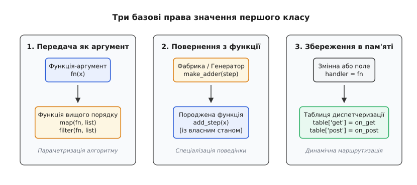
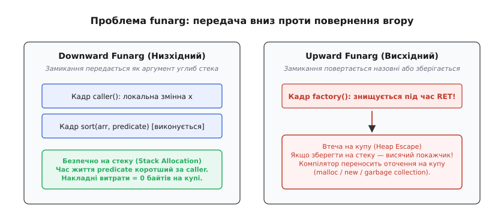
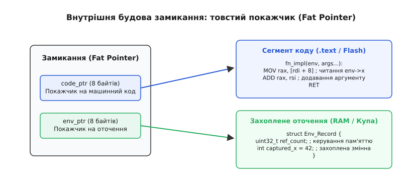

# Функції як значення першого класу

<preknowlist>
- [Стек](topic:sf-lang/stack-lifo) — кадри виклику та час життя локальних змінних.
- [Купа](topic:sf-lang/heap-dynamic-memory) — динамічне виділення пам'яті довільного розміру.
- [Адреси й покажчики](topic:sf-lang/addresses-pointers) — адресація пам'яті та розіменування покажчиків.
- [ABI та calling convention](topic:sf-lang/abi-calling-convention) — передача параметрів і повернення значень через регістри процесора.
</preknowlist>

Коли програміст пише універсальний алгоритм сортування масиву чи фільтрації списку датчиків, він неминуче стикається з фундаментальною перешкодою. Сам алгоритм сортування — перебір елементів, розбиття на частини, перестановка комірок — абсолютно однаковий для чисел, текстових рядків чи телеметричних пакетів. Але критерій сортування (який саме з двох елементів вважати меншим) або предикат фільтрації (чи перевищила температура поріг) щоразу унікальний. Якщо мова програмування трактує функцію лише як фіксовану адресу в пам'яті програм, розробник змушений або копіювати весь цикл сортування для кожного нового типу даних, або вдаватися до небезпечних макросів і хаків із пам'яттю.

Щоб алгоритм став по-справжньому універсальним, операція порівняння має бути не жорстко вшита в текст циклу, а передана в нього ззовні як аргумент — точно так само, як передається довжина масиву чи початковий індекс. Це означає, що функція в мові програмування повинна отримати ті самі права й можливості, якими володіють звичайні числа, символи чи структури даних.

Здатність мови трактувати обчислювальні процедури як повноцінні дані лежить в основі концепції, що докорінно змінила дизайн сучасного програмного забезпечення.

## Громадянські права сутностей у мові: Крістофер Стрейчі

У класичних процедурних мовах 1950–1960-х років (Fortran, COBOL, ранніх версіях ALGOL) існував жорсткий поділ програми на два окремі світи: «дані» (пасивні величини, що зберігаються в комірках пам'яті) та «код» (активні інструкції процесора, які маніпулюють даними). Дані можна було обчислювати, комбінувати, повертати з підпрограм і зберігати у структурах. Функції ж були прикуті до фіксованих точок у машинному коді.

У 1967 році британський вчений [Крістофер Стрейчі](topic:sf-lang/first-class-functions/hist-strachey.md) сформулював систематичну класифікацію того, як мови програмування поводяться зі своїми конструкціями. Стрейчі запропонував метафору громадянських прав (англ. *rights of citizenship* / лат. *civis* — громадянин): кожна сутність у мові має певний рівень привілеїв щодо операцій, які програмістові дозволено над нею виконувати.

Сутність називається **значенням першого класу** (англ. *first-class citizen*, або *first-class value*), якщо вона володіє повним набором із чотирьох базових прав:

1. **Передача як аргумент:** її можна передавати у функцію як фактичний параметр під час виклику.
2. **Повернення з функції:** функція може обчислити її та повернути як результат своєї роботи через інструкцію `return`.
3. **Збереження в структурах:** її можна присвоювати змінним, записувати в поля структур, зберігати в масивах, списках чи хеш-таблицях.
4. **Динамічне створення:** її можна конструювати безпосередньо під час виконання програми як анонімний вираз, без обов'язкового оголошення глобального імені в коді.


*Три базові права значення першого класу: передача в алгоритм як аргументу для параметризації поведінки; генерація й повернення нової функції з фабрики; збереження у структурах даних і таблицях диспетчеризації для динамічної маршрутизації викликів.*

Якщо сутність позбавлена частини цих прав, вона опускається в ієрархії:
- **Другий клас (Second-class):** сутність можна передавати як аргумент, але не можна повертати з функції чи зберігати у структурах даних (типовий приклад — процедурні параметри в ALGOL 60 і Pascal).
- **Третій клас (Third-class):** сутність не можна навіть передати як аргумент (мітки переходів `goto`, службові ключові слова, синтаксичні цикли `for` і `while`).

Коли мова надає функціям статус першого класу, межа між «кодом» і «даними» зникає: код стає значенням, яким можна маніпулювати так само вільно, як цілим числом `42` чи рядком тексту.

## Функції вищого порядку: параметризація дій

Першим практичним наслідком першокласності функцій є поява **функцій вищого порядку** (англ. *higher-order functions*). Функцією вищого порядку називають будь-яку функцію, яка або приймає одну чи кілька функцій як аргументи, або повертає іншу функцію як результат.

Розгляньмо класичну тріаду операцій над послідовностями, що виникла у функційному програмуванні й стала стандартом у системних і прикладних мовах:

1. **`map` (відображення):** застосовує передану функцію трансформації до кожного елемента колекції, формуючи нову колекцію результатів однакової довжини:
```
map(f, [x₁, x₂, x₃]) = [f(x₁), f(x₂), f(x₃)]
```
2. **`filter` (фільтрація):** приймає функцію-предикат (яка повертає булеве значення) і відбирає лише ті елементи, для яких предикат повертає істину:
```
filter(p, [x₁, x₂, x₃]) = [xᵢ | p(xᵢ) == true]
```
3. **`fold` / `reduce` (згортка):** комбінує всі елементи колекції за допомогою бінарної функції та акумулятора, згортаючи список в одне підсумкове значення:
```
fold(⊕, acc, [x₁, x₂, x₃]) = ((acc ⊕ x₁) ⊕ x₂) ⊕ x₃
```

Без функцій першого класу кожне таке перетворення вимагало б написання окремого імперативного циклу з локальними змінними-лічильниками. З функціями вищого порядку алгоритм обходу структури даних повністю відокремлюється від операції, яка виконується над кожним елементом.

У низькорівневих мовах без автоматичного керування пам'яттю (таких як C) передача поведінки традиційно реалізується через покажчики на функції. Проте чистий покажчик на функцію має суттєве обмеження: він не несе з собою жодного стану. Якщо функції зворотного виклику потрібні додаткові контекстні дані, їх доводиться передавати окремим «сліпим» покажчиком `void *user_data`.

:::tabs
```c
#include <stdio.h>
#include <stddef.h>

/* Функція вищого порядку: фільтрує масив за предикатом з контекстом */
typedef int (*predicate_fn)(int value, void *ctx);

size_t filter_integers(const int *src, size_t len, int *dst,
                       predicate_fn pred, void *ctx) {
    size_t out_count = 0;
    for (size_t i = 0; i < len; ++i) {
        if (pred(src[i], ctx)) {
            dst[out_count++] = src[i];
        }
    }
    return out_count;
}

/* Конкретний предикат: перевірка на перевищення порогу */
static int is_greater_than(int val, void *ctx) {
    int threshold = *(int *)ctx;
    return val > threshold;
}

int main(void) {
    int data[] = {12, 45, 3, 89, 23, 67, 8};
    int results[7];
    int threshold = 25;

    size_t count = filter_integers(data, 7, results, is_greater_than, &threshold);

    for (size_t i = 0; i < count; ++i) {
        printf("%d ", results[i]); /* 45 89 67 */
    }
    printf("\n");
    return 0;
}
```
```cpp
#include <iostream>
#include <span>
#include <vector>
#include <algorithm>

/* В ідіоматичному C++ функція вищого порядку приймає довільний callable */
template <typename Predicate>
std::vector<int> filter_integers(std::span<const int> src, Predicate pred) {
    std::vector<int> dst;
    for (int val : src) {
        if (pred(val)) {
            dst.push_back(val);
        }
    }
    return dst;
}

int main() {
    std::vector<int> data = {12, 45, 3, 89, 23, 67, 8};
    int threshold = 25;

    // Лямбда-вираз автоматично захоплює поріг без ручного void*
    auto results = filter_integers(data, [threshold](int val) {
        return val > threshold;
    });

    for (int val : results) {
        std::cout << val << " "; /* 45 89 67 */
    }
    std::cout << "\n";
    return 0;
}
```
:::

Як видно з порівняння, у чистому C розробник змушений самостійно підтримувати дві незалежні сутності: покажчик на машинний код `predicate_fn` та покажчик на дані `void *ctx`. Щойно ми об'єднуємо код і дані в одне ціле, виникає концепція замикання.

## Каррінг та часткове застосування

Можливість повертати функції з інших функцій відкриває шлях до двох фундаментальних прийомів композиції обчислень: **каррінгу** та **часткового застосування**.

### Каррінг (Currying)

Прийом названо на честь американського математика й логіка Гаскелла Каррі (англ. *Haskell Curry*, хоча раніше цю концепцію запропонував Мозес Шейнфінкель).

**Каррінг** — це перетворення функції від кількох аргументів $f(a, b, c)$ на ланцюжок вкладених функцій, кожна з яких приймає рівно один аргумент і повертає наступну функцію:

```
f: (A × B × C) → R   ==>   curry(f): A → (B → (C → R))
```

Якщо звичайна функція додавання трьох чисел викликається як `add(1, 2, 3)`, то її каррована версія викликається послідовними кроками: `curried_add(1)(2)(3)`.

Кожен крок цього ланцюжка створює проміжне замикання. Перший виклик `curried_add(1)` фіксує перший аргумент у своєму оточенні й повертає нову одномісну функцію; другий виклик додає другий аргумент до збереженого стану; і лише останній виклик виконує кінцеве підсумовування.

### Часткове застосування (Partial Application)

Часткове застосування — це споріднена, але практично більш гнучка техніка. Вона полягає у фіксації довільної підмножини аргументів функції для отримання нової функції зі зменшеною кількістю параметрів (меншою арністю):

```
g(y, z) = f(fixed_x, y, z)
```

Це дозволяє створювати вузькоспеціалізовані обробники із загальних алгоритмів без дублювання коду. Наприклад, маючи загальну функцію надсилання мережевого логу `send_log(level, subsystem, message)`, можна зафіксувати `level = ERROR` та `subsystem = "AUTH"` і отримати готовий спеціалізований логер `auth_error(message)`, що приймає лише текст повідомлення.

## Вільні змінні та лексична область видимості

Щоб з'ясувати, чому звичайного покажчика на функцію недостатньо для повноцінного першого класу, необхідно проаналізувати походження змінних всередині тіла функції.

У математичній логіці та теорії мов програмування всі змінні всередині виразу поділяються на дві категорії:

- **Зв'язані змінні (Bound variables):** це формальні параметри самої функції або її власні локальні змінні, оголошені безпосередньо всередині її тіла. Їхній зміст і область життя повністю визначаються самою функцією під час її виклику.
- **Вільні змінні (Free variables):** це імена змінних, які функція використовує у своїх обчисленнях, але які не є ані її параметрами, ані її локальними змінними. Вони приходять із зовнішнього контексту — середовища, в якому функція була визначена.

У виразі `f(x) = x + y` змінна `x` є зв'язаною (це аргумент функції), а змінна `y` — вільною. Щоб виконати функцію `f(x)`, комп'ютер мусить знати, звідки взяти значення для `y`.

Історично існували два принципово різні підходи до пошуку значень вільних змінних:

1. **Динамічна область видимості (Dynamic scope):** значення вільної змінної шукається в активному [кадрі стека](topic:sf-lang/stack-lifo) у момент *виклику* функції. Якщо функцію `f` викликали з функції `A`, де є змінна `y = 10`, вона візьме `10`; якщо з функції `B`, де `y = 99`, вона візьме `99`. Це призводить до крихкого коду, де поведінка функції непередбачувано змінюється залежно від імен внутрішніх змінних тих підпрограм, які її викликають.
2. **Лексична (статична) область видимості (Lexical scope):** значення вільної змінної фіксується за тим контекстом, де функція була *написана в тексті програми* (лексично оголошена), незалежно від того, звідки й коли її згодом викличуть.

Лексична область видимості є стандартом для переважної більшості сучасних мов. Але саме вона створює головний інженерний виклик: якщо функція посилається на змінну `y` зі свого лексичного оточення, а виконується в іншому місці програми, вона мусить нести це оточення із собою.

## Замикання: союз коду та середовища

Конструкція, яка об'єднує виконуваний машинний код із лексичним середовищем захоплених вільних змінних, називається **замиканням** (англ. *closure* / лат. *claudere* — замикати, закривати).

Термін походить від операції «замикання відкритого виразу»: функція, що містить вільні змінні, називається «відкритою» (англ. *open expression*), оскільки її значення неможливо обчислити самостійно. Зв'язуючи кожну вільну змінну з конкретною коміркою пам'яті в оточенні, система «замикає» вираз (робить його *closed expression*), перетворюючи його на самодостатнє значення, готове до обчислення.

Замикання завжди складається з двох частин:

```
Замикання = Покажчик на код (Code Pointer) + Покажчик на оточення (Environment Pointer)
```

Залежно від семантики мови, захоплення змінних з оточення відбувається в один із двох способів:

### 1. Захоплення за значенням (Capture by Value)

Під час створення замикання значення кожної вільної змінної копіюється в окремий блок пам'яті, що належить цьому замиканню. 

- **Переваги:** повна ізоляція. Замикання володіє власними копіями даних, тому зміни зовнішніх змінних після створення замикання не впливають на його роботу. Таке замикання абсолютно безпечно передавати між різними потоками виконання, оскільки відсутній спільний доступ до змінної пам'яті (відсутні стани гонитви — *data races*).
- **Недоліки:** витрати пам'яті й часу на копіювання великих структур даних; неможливість модифікувати оригінальну змінну зсередини замикання.

### 2. Захоплення за посиланням (Capture by Reference)

Замикання зберігає не копію значення, а адресу (покажчик) оригінальної комірки пам'яті, де живе змінна.

- **Переваги:** нульові витрати на копіювання; замикання та зовнішній код бачать зміни змінної в реальному часі й можуть спільно її модифікувати.
- **Недоліки:** якщо замикання переживає функцію, в якій було створено, покажчик на локальну змінну стає «висячим» (англ. *dangling pointer*); за паралельного виконання виникає ризик несинхронізованого одночасного запису.

## Проблема funarg та аналіз втечі на купу

Коли замикання взаємодіє зі стековою пам'яттю традиційних мов програмування, виникає фундаментальний конфлікт життєвих циклів, відомий у комп'ютерних науках як **проблема функціонального аргументу** (англ. *Funarg problem*, скорочення від *functional argument*).

У класичній моделі виконання мов на кшталт C або Pascal кожен виклик функції створює на стеку **кадр активації** (англ. *stack frame*), де зберігаються її аргументи та локальні змінні. Коли функція завершує роботу й виконує процесорну інструкцію повернення `RET`, вказівник стека зміщується назад, і весь кадр активації вважається знищеним. Будь-яка адреса пам'яті, що вказувала всередину цього кадру, стає недійсною.

Проблема funarg ділиться на дві абсолютно різні за складністю ситуації:

### Низхідний funarg (Downward Funarg)

Замикання передається як аргумент *углиб* стека викликів (наприклад, у функцію сортування чи обходу масиву):

```
main() ──створює змінні й замикання──> sort(arr, predicate)
```

У цьому випадку кадр функції `main`, яка створила замикання, гарантовано залишається живим на стеку протягом усього часу виконання функції `sort`. Замикання нікуди «не втікає» за межі життя свого батьківського кадру. Тому оточення такого замикання можна безпечно розмістити прямо на стеку — накладні витрати на динамічне виділення пам'яті дорівнюють нулю.

### Висхідний funarg (Upward Funarg)

Замикання *повертається* з функції назовні або зберігається у глобальній змінній чи асинхронній черзі подій:

```
make_multiplier(factor) ──повертає замикання──> caller()
```

Коли функція `make_multiplier` завершується, її кадр стека знищується. Але повернуте замикання продовжує жити в програмі й потребує доступу до параметра `factor`. Якщо змінна `factor` була розміщена на стеку, перший же виклик повернутого замикання призведе до читання сміття або збою адресації (Segmentation Fault), оскільки та сама ділянка стека вже буде перезаписана наступними викликами інших функцій.


*Ліворуч: Downward Funarg — передача замикання вниз по стеку; кадр батьківської функції залишається активним, оточення безпечно живе на стеку без динамічної алокації. Праворуч: Upward Funarg — повернення замикання вгору; кадр знищується інструкцією RET, тому компілятор через аналіз втечі змушений переносити захоплені змінні на купу.*

### Аналіз втечі (Escape Analysis)

Щоб розв'язати проблему висхідного funarg, компілятори мов із функціями першого класу (таких як Go, Swift, Java Virtual Machine, OCaml, V8 JavaScript) застосовують алгоритм **аналізу втечі** (англ. *escape analysis*):

1. Компілятор будує граф потоку даних і перевіряє, чи виходить покажчик на замикання або його захоплені змінні за межі часу життя поточного кадру стека.
2. Якщо замикання передається тільки вниз (не втікає), компілятор алокує структуру замикання на стеку.
3. Якщо замикання повертається назовні або зберігається в довгоживучій структурі даних (втікає), компілятор автоматично перенаправляє виділення пам'яті під захоплені змінні на [купу](topic:sf-lang/heap-dynamic-memory) (`malloc` / `new`), а керування цим блоком передається системному збирачеві сміття (Garbage Collector) чи лічильнику посилань.

> 🔧 **Навіщо це.** Втеча на купу — це головна причина, чому функції першого класу в мовах зі збирачем сміття (наприклад, створення лямбд усередині гарячих циклів у JavaScript чи Go) можуть раптово викликати сплески навантаження на підсистему пам'яті. Розуміння межі між downward і upward funarg дозволяє інженеру писати код так, щоб замикання залишалися на стеку й не створювали тиску на купу.

## Механізми трансляції замикань у сучасних рантаймах

Різні мовні платформи реалізують збереження та виклик замикань відповідно до своїх архітектурних вимог:

### Go: Перенесення змінних у купу через `runtime.newobject`

У Go функції є значеннями першого класу з лексичним замиканням за посиланням. Коли компілятор `gc` виявляє, що внутрішня функція звертається до локальної змінної зовнішньої функції, і це замикання втікає назовні (наприклад, запускається через `go func()` або повертається з функції), він замінює розміщення цієї змінної на стеку на системний виклик `runtime.newobject`. Локальна змінна стає покажчиком на блок у купі, а всі звернення до неї всередині батьківської функції та всередині замикання перетворюються на непряме розіменування покажчика.

### Java Virtual Machine: `invokedynamic` та `LambdaMetafactory`

До появи Java 8 кожна анонімна функція вимагала створення окремого анонімного внутрішнього класу (англ. *anonymous inner class*), для якого компілятор генерував окремий байткод-файл `ClassName$1.class` на диску. Це роздувало розмір дистрибутивів і завантажувало завантажувач класів.

Починаючи з Java 8, для реалізації лямбда-виразів застосовується байткод-інструкція `invokedynamic`. Під час першого виконання точки виклику JVM звертається до методу начального завантаження (англ. *bootstrap method*) `LambdaMetafactory`, який динамічно генерує в оперативній пам'яті легковісний клас-перехідник (на базі `MethodHandle`). Якщо лямбда не захоплює змінних, JVM повертає єдиний статичний екземпляр-одинак (Singleton), повністю усуваючи будь-яке виділення пам'яті під час повторних викликів.

### JavaScript V8: Об'єкти контексту (Context Objects)

У рушії V8 (Node.js, Chromium) кожна функція має внутрішнє поле `[[Scope]]`. Коли функція оголошує вкладену функцію, V8 створює спеціальний об'єкт `Context` у купі. Замість того щоб копіювати весь стек, V8 аналізує абстрактне синтаксичне дерево (AST) і розміщує в `Context` **виключно ті змінні, які реально використовуються внутрішніми замиканнями**. Завдяки цьому змінні, які не були захоплені, безпечно звільняються разом зі стеком.

## Машинне представлення замикання: товстий покажчик

На рівні двійкового коду та регістрів процесора замикання представляється структурою, яку в системному програмуванні називають **товстим покажчиком** (англ. *fat pointer*). На відміну від звичайного скалярного покажчика (розміром 8 байтів на 64-бітній архітектурі), товстий покажчик складається щонайменше з двох слів (16 байтів):

```
┌───────────────────────────────────────────────┐
│               Fat Pointer (16B)               │
├───────────────────────┬───────────────────────┤
│   code_ptr (8 байтів) │   env_ptr (8 байтів)  │
└───────────┬───────────┴───────────┬───────────┘
            │                       │
            ▼                       ▼
    ┌───────────────┐       ┌───────────────┐
    │ .text-сегмент │       │ Блок у RAM    │
    │ Інструкції    │       │ x = 42        │
    │ функції       │       │ y = 3.14      │
    └───────────────┘       └───────────────┘
```


*Машинна структура замикання: ліворуч товстий покажчик із двох слів; code_ptr адресує статичні інструкції в пам'яті програм, env_ptr адресує блок стану на купі чи стеку. Під час виклику рантайм передає env_ptr як прихований перший параметр.*

Коли програма викликає замикання через товстий покажчик, виконується чітко визначений протокол:

1. Процесор зчитує `env_ptr` і записує його в перший регістр передачі аргументів згідно з угодою про виклики (наприклад, у регістр `RDI` для System V AMD64 ABI).
2. Фактичні аргументи користувача зсуваються в наступні регістри (`RSI`, `RDX` тощо).
3. Процесор зчитує `code_ptr` у регістр `RAX` і виконує непрямий перехід `CALL RAX`.
4. Скомпільоване тіло функції розглядає `RDI` як покажчик на свою внутрішню структуру оточення й вичитує звідти значення захоплених змінних через фіксовані зміщення.

Детальний покроковий аналіз такої структури, генерації асемблерного коду та ручного керування пам'яттю блоку оточення розглянуто у вставці [машинна реалізація замикань на системному рівні](topic:sf-lang/first-class-functions/proj-closure-runtime.md).

## Функціональні об'єкти (Functors) та лямбди в OOP

Об'єктно-орієнтовані мови програмування (зокрема C++ та Java) історично будувалися навколо класів, де стан і поведінка зв'язуються в об'єкти. Коли виникла потреба інтегрувати функції першого класу в ці мови, розробники стандартів виявили дивовижну симетрію:

```
Об'єкт — це дані, до яких прикріплено методи.
Замикання — це функція, до якої прикріплено дані.
```

На рівні компілятора ці дві сутності абсолютно еквівалентні. Саме тому в C++ замикання було реалізовано без додавання нової сутності в рантайм: через концепцію **функціонального об'єкта** (англ. *functor*).

Функтор — це звичайний примірник класу чи структури, в якому перевантажено оператор виклику функції `operator()`.

Коли програміст пише в сучасному C++ компактний лямбда-вираз:

```cpp
int factor = 3;
auto multiply = [factor](int x) { return x * factor; };
```

Компілятор під час трансляції автоматично виконує синтаксичне перетворення (децукрування — *desugaring*), перетворюючи цей вираз на унікальний анонімний клас:

```cpp
class __Lambda_Unique_Generated_Name {
private:
    int factor; // Захоплена змінна стає полем класу
public:
    __Lambda_Unique_Generated_Name(int f) : factor(f) {}

    int operator()(int x) const {
        return x * factor;
    }
};

// Створення об'єкта-функтора на стеку
__Lambda_Unique_Generated_Name multiply(factor);
```

У такій моделі:
- Захоплені змінні стають **полями структури**.
- Тіло лямбди стає **методом `operator()`**.
- Покажчиком на оточення виступає стандартний покажчик на поточний об'єкт **`this`**.

### Типізація замикань: статична проти динамічної

Оскільки кожне замикання захоплює різний набір змінних, кожна лямбда в C++ породжує **унікальний, невидимий тип**, розмір якого точно дорівнює сумі розмірів захоплених полів. Це дозволяє реалізувати два абсолютно різні режими роботи із замиканнями:

1. **Статичний режим (Zero-cost templates):** якщо функція приймає замикання як шаблонний параметр `template <typename F> void run(F f)`, компілятор генерує спеціалізований код під цей конкретний тип функтора. Метод `operator()` повністю вбудовується (inlining) у точку виклику. Накладні витрати дорівнюють абсолютному нулю — код виходить настільки ж швидким, як і написаний руками цикл.
2. **Динамічний режим (`std::function` / Type Erasure):** якщо замикання потрібно зберегти у змінній уніфікованого типу (наприклад, покласти в масив обробників подій `std::vector<std::function<void()>>`), мова використовує техніку **стирання типів** (англ. *type erasure*). Обгортка `std::function` інкапсулює віртуальну таблицю або товстий покажчик. Щоб уникнути зайвих виділень пам'яті на купі для дрібних об'єктів, `std::function` застосовує **оптимізацію малого буфера** (англ. *Small Buffer Optimization*, SBO): якщо розмір захоплених полів не перевищує певний ліміт (зазвичай 16–24 байти), стан зберігається безпосередньо всередині буфера на стеку.

## Пастки володіння: циклічні посилання та витоки пам'яті

Коли функції стають значеннями першого класу й зберігаються в структурах даних, виникає небезпечна архітектурна пастка — **циклічні посилання замикань** (англ. *closure retain cycles*).

Розгляньмо типовий сценарій у подієво-орієнтованих архітектурах (графічні інтерфейси, мережеві сокети, таймери):

1. Довгоживучий об'єкт (наприклад, контролер вікна `WindowController` або мережевий клієнт `HttpClient`) має поле, де зберігається функція зворотного виклику `on_data_received`.
2. Всередині методу цього об'єкта створюється замикання, яке призначається в це поле:
```
this.on_data_received = () => { this.update_ui(); };
```
3. Замикання захоплює покажчик `this` за посиланням або через сильне посилання (Strong Reference).

У результаті формується нерозривне замкнене кільце володіння:

```
Об'єкт ──володіє через поле──> Замикання ──володіє через захоплення──> Об'єкт
```

У системах із підрахунком посилань (Automatic Reference Counting у Swift, Objective-C, або `std::shared_ptr` у C++) лічильник посилань ніколи не впаде до нуля. Навіть коли програма знищує всі зовнішні змінні, що вели до об'єкта, він назавжди залишається заблокованим у пам'яті разом із замиканням, спричиняючи прихований витік оперативної пам'яті (Memory Leak).

Для запобігання цим витокам розробники застосовують дві обов'язкові техніки:

- **Слабкі посилання (Weak References):** замикання захоплює об'єкт не як сильне посилання, а як слабке (наприклад, `[weak self]` у Swift або `std::weak_ptr` у C++), яке не збільшує лічильник володіння й автоматично обнуляється після знищення об'єкта.
- **Явний розрив зв'язків (Explicit Unsubscription):** деструктор або метод закриття об'єкта примусово скидає поле обробника подій у стан `nullptr` перед виходом з ладу.

## Модель володіння та замикання в Rust

Найвиразніше взаємодію між замиканнями, пам'яттю та типами реалізовано в мові Rust. Компілятор Rust не має рантайму зі збирачем сміття, тому він вимагає точного опису того, що саме замикання робить зі своїм оточенням.

Для цього в системі типів Rust передбачено три фундаментальні типажі (трейти):

| Трейт | Семантика доступу до оточення | Як часто можна викликати | Що відбувається з захопленими даними |
|---|---|---|---|
| `Fn` | Захоплює змінні за незмінним посиланням (`&self`) | Необмежену кількість разів | Дані лише читаються, паралельні виклики безпечні |
| `FnMut` | Захоплює змінні за змінним посиланням (`&mut self`) | Необмежену кількість разів | Замикання змінює внутрішній стан свого оточення |
| `FnOnce` | Захоплює змінні за значенням із передачею володіння (`self`) | **Лише один раз** | Замикання пожирає/переміщує захоплені ресурси під час виклику |

Ієрархія цих трейтів відображає математичне включення: будь-яке замикання типу `Fn` може використовуватися там, де очікується `FnMut` або `FnOnce`, але не навпаки:

```
Fn  ⊂  FnMut  ⊂  FnOnce
```

Якщо замикання захоплює сокет або дескриптор файлу й закриває його всередині свого тіла, компілятор виведе для нього трейт `FnOnce`. Спроба викликати таке замикання двічі призведе до помилки компіляції ще на етапі збирання програми — системний рівень унеможливлює помилку повторного звільнення пам'яті (double free) чи використання невалідного ресурсу (use-after-free).

## Інженерна ціна та компроміси першого класу

Надання функціям статусу першого класу дає колосальний виграш у виразності коду, але на системному рівні воно пов'язане з конкретними апаратними компромісами:

1. **Накладні витрати непрямого переходу:** виклик замикання через покажчик на код (`CALL RAX`) не дозволяє апаратному блоку вибірки інструкцій процесора заздалегідь знати цільову адресу переходу. Якщо шаблон викликів нерегулярний, передбачувач переходів (BTB) помиляється, спричиняючи скидання конвеєра на 10–20 тактів.
2. **Фрагментація купи та тиск на GC:** масове створення асинхронних замикань (особливо висхідних funarg) породжує тисячі дрібних об'єктів у динамічній пам'яті. У мовах з автоматичним керуванням пам'яттю це збільшує навантаження на паузи збирача сміття.
3. **Роздування коду (Code Bloat) під час мономорфізації:** у мовах зі статичною типізацією (C++, Rust) інтенсивне використання узагальнених функцій вищого порядку створює окрему машинну копію алгоритму для кожного унікального типу замикання, що може суттєво роздувати розмір двійкового файлу прошивки.

Розуміння того, як високорівнева абстракція функції розкладається на байти оточення, регістри процесора та кадри пам'яті, перетворює функції першого класу з загадкового інструменту на точний, керований механізм системного проєктування.
