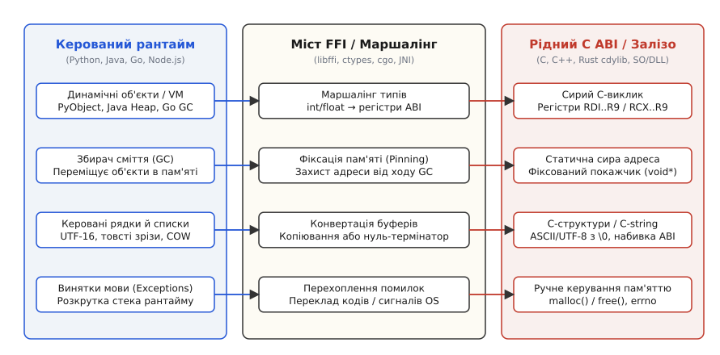
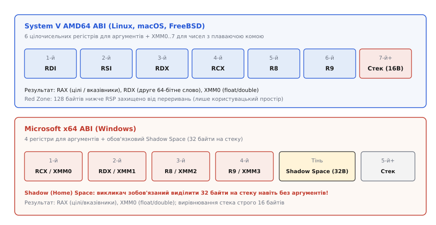
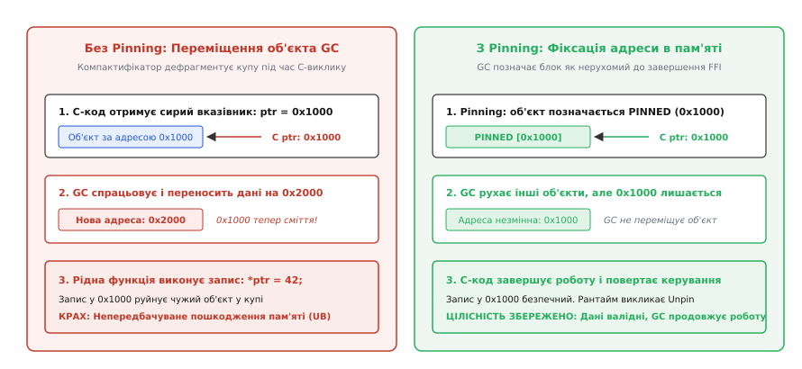
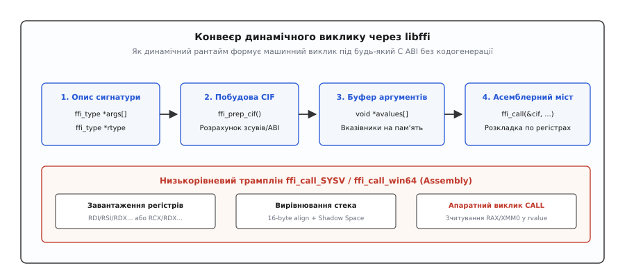

# Виклик рідного коду з іншої мови (FFI)

<preknowlist>
- [ABI та calling convention](root:sf-lang/abi-calling-convention) — угоди про виклики, розташування аргументів у регістрах і вирівнювання стека.
- [Лінкування](root:sf-lang/linking) — динамічні таблиці символів, завантаження спільних бібліотек (`dlopen`, `dlsym`) та розділювані об'єкти.
- [Байткод і віртуальна машина](root:sf-lang/bytecode-vm) — модель пам'яті керованого рантайму, стек виконання інтерпретатора та збирач сміття (GC).
- [Суворе аліасування (strict aliasing)](root:sf-lang/strict-aliasing) — правила доступу до сирої пам'яті через типізовані покажчики.
</preknowlist>

Коли високонавантажений вебсервер на Python або сервіс обробки транзакцій на Java має обчислити криптографічний хеш чи помножити матриці за допомогою векторних інструкцій SIMD, написання цих алгоритмів мовою інтерпретатора або віртуальної машини сповільнює виконання у десятки разів. На машинному рівні готова C-бібліотека — це звичайний набір інструкцій у пам'яті процесу. Проте якщо інтерпретатор Python або віртуальна машина Java спробує виконати прямий асемблерний перехід (`jmp` або `call`) на початкову адресу цієї функції, процес негайно завершиться аварійним скиданням пам'яті (англ. *segmentation fault*).

Причина полягає у несумісності внутрішніх світів. У мові Python кожна змінна є покажчиком на динамічний об'єкт `PyObject` у купі, де число `42` обгорнуте лічильником посилань, типізаційними метаданими та дескрипторами. У віртуальній машині Java об'єкти містять заголовки з прапорцями збирача сміття та покажчиками на таблиці методів. У мові Go функції використовують сегментовані стеки та повертають множинні значення через власні структури рантайму. Натомість скомпільована C-функція очікує сирі двійкові байти: цілі числа, розташовані у конкретних фізичних регістрах процесора (`%rdi`, `%rsi`), числа з плаваючою комою у векторних регістрах (`%xmm0`), апаратний стек із суворим 16-байтовим вирівнюванням та неперервні блоки пам'яті без жодних об'єктних обгорток.

Для подолання цієї прірви використовується **інтерфейс чужоземних функцій** — **FFI** (англ. *Foreign Function Interface*, від лат. *foris* — «зовні», *functio* — «виконання», *inter* — «між», *facies* — «зовнішній вигляд / поверхня»). FFI є системним мостом, який бере на себе перетворення представлення типів (маршалінг), узгодження апаратних регістрів, захист адрес пам'яті від переміщення збирачем сміття (фіксацію або pinning) та коректну передачу кодів помилок між різнорідними середовищами виконання.


*Архітектурна межа FFI. Ліворуч — керований рантайм із динамічною типізацією, автоматичним збиранням сміття та винятками. Праворуч — рідне двійкове середовище C ABI з фіксованими регістрами процесора, сирою пам'яттю та ручним керуванням ресурсами. У центрі — шар маршалінгу, який перетворює типи, фіксує адреси об'єктів у пам'яті (pinning) та вирівнює апаратний стек.*

> 🔧 **Навіщо це.** FFI є фундаментом сучасного стека розробки. Саме завдяки FFI бібліотеки глибокого навчання на Python (PyTorch, TensorFlow) передають тензори у високопродуктивні ядра C++/CUDA на графічних процесорах, мобільні додатки на Swift та Kotlin використовують єдине спільне ядро бізнес-логіки на Rust або C++, а системні утиліти на Go та Node.js взаємодіють із системними викликами ядра операційної системи.

## C ABI як універсальний двійковий стандарт

Чому майже всі мови програмування реалізують FFI саме через інтерфейс мови C, а не C++, Rust чи Pascal? Історія виникнення цього стандарту та шлях від ранніх експериментів у Lisp-системах до появи універсальних мостів докладно описані у вставці [Від мостів Lisp до універсального клею систем](root:sf-lang/foreign-function-interface/hist-ffi-evolution.md).

Головна причина полягає в тому, що двійковий інтерфейс застосунків C — **C ABI** (англ. *Application Binary Interface*) — є найпростішим, найстабільнішим і найближчим до архітектури процесора серед усіх існуючих.

Мова C++ не має єдиного стандартизованого ABI: різні компілятори (GCC, Clang, MSVC) і навіть різні версії одного компілятора по-різному спотворюють імена функцій (англ. *name mangling*), мають несумісні розкладки таблиць віртуальних методів (`vtable`), відмінні структури обробки винятків та різні правила передачі нетривіальних об'єктів із конструкторами копіювання. Злінкувати бібліотеку C++, зібрану MSVC, з програмою, скомпільованою GCC, безпосередньо неможливо.

На противагу цьому, C ABI гарантує:
1. **Прямі імена символів:** функція `calculate_hash` експортується в таблицю символів динамічної бібліотеки (`.so` або `.dll`) під незмінним ім'ям `calculate_hash` (без спотворень).
2. **Прозору розкладку структур:** поля лежать у пам'яті строго в порядку їхнього оголошення з передбачуваними правилами вирівнювання.
3. **Відсутність прихованого рантайму:** C-функції не потребують ініціалізації збирача сміття, потокових пулів чи глобальних таблиць типів.

### 64-бітний розкол: System V AMD64 проти Microsoft x64

На сучасних 64-бітних процесорах архітектури x86_64 світ розділився на два несумісних ABI, і будь-який FFI-міст зобов'язаний враховувати цю різницю.

В операційних системах Linux, macOS, FreeBSD та Solaris діє стандарт **System V AMD64 ABI**. В операційній системі Windows діє стандарт **Microsoft x64 ABI**.


*Порівняння 64-бітних угод про виклики. У System V AMD64 (Linux/macOS) перші шість аргументів передаються через регістри RDI..R9. У Microsoft x64 (Windows) використовуються лише чотири регістри RCX..R9, а викликач зобов'язаний виділити 32-байтний тіньовий простір (Shadow Space) на стеку для збереження регістрів викликаною функцією.*

Розгляньмо ключові відмінності між цими двома угодами:

```
Розподіл регістрів для аргументів у 64-бітних ABI:

1. System V AMD64 ABI (Linux, macOS, BSD):
   - Цілі числа та вказівники (1..6): %rdi, %rsi, %rdx, %rcx, %r8, %r9
   - Числа з плаваючою комою (1..8):  %xmm0, %xmm1, %xmm2, %xmm3, %xmm4, %xmm5, %xmm6, %xmm7
   - Решта аргументів (7+):          Стек (вирівнювання 16 байтів)
   - Червона зона (Red Zone):         128 байтів нижче %rsp захищено від переривань

2. Microsoft x64 ABI (Windows):
   - Аргументи 1..4 (цілі / float):   %rcx/%xmm0, %rdx/%xmm1, %r8/%xmm2, %r9/%xmm3
   - Решта аргументів (5+):          Стек (розміщуються вище тіньового простору)
   - Тіньовий простір (Shadow Space): 32 байти на стеку виділяються викликачем ЗАВЖДИ
   - Червона зона:                    Відсутня
```

### Пастка тіньового простору (Shadow Space) у Windows

Найпідступнішою відмінністю Microsoft x64 ABI є обов'язковий **тіньовий простір** (англ. *Shadow Space* або *Home Space*). Згідно зі специфікацією Windows, викликач функції зобов'язаний виділити на стеку 32 байти (чотири 64-бітних слова) безпосередньо перед виконанням інструкції `call`, навіть якщо функція не приймає жодного аргументу.

Ці 32 байти зарезервовані для викликаної функції: якщо компілятор вирішить зберегти вхідні регістри `%rcx`, `%rdx`, `%r8`, `%r9` у пам'ять (наприклад, у зневаджувальному режимі або для звільнення регістрів під внутрішні обчислення), він збереже їх саме в цей виділений простір.

Якщо автор низькорівневого FFI-мосту скомпілює виклик під Windows за правилами Linux і забуде виділити ці 32 байти, викликана C-функція виконає запис у стек за адресою `%rsp + 8`, перезаписавши адресу повернення (англ. *return address*), яку процесор поклав на стек під час інструкції `call`. У момент виконання інструкції `ret` процесор здійснить стрибок за пошкодженою адресою і програма зазнає фатального краху.

## Маршалінг типів: розкладання даних на рівні байтів

**Маршалінг** (англ. *marshalling*, від давньофр. *mareschal* — «розпорядник / впорядник») — це процес перетворення внутрішнього представлення даних високорівневої мови у формат, сумісний із C ABI, та зворотне перетворення результату (демаршалінг).

### Скалярні типи та розбіжності розрядності

Передача простих чисел виглядає тривіальною, але містить класичну пастку моделі пам'яті:

```
Моделі розрядності типів на 64-бітних системах:

Тип C          Linux/macOS (LP64)    Windows (LLP64)
int            32 біти (4 байти)     32 біти (4 байти)
long           64 біти (8 байтів)    32 біти (4 байти)  <- КРИТИЧНА РОЗБІЖНІСТЬ!
long long      64 біти (8 байтів)    64 біти (8 байтів)
void* (покажчик) 64 біти (8 байтів)    64 біти (8 байтів)
size_t         64 біти (8 байтів)    64 біти (8 байтів)
```

Якщо C-бібліотека приймає аргумент `unsigned long`, то під Linux FFI-міст повинен передати 64-бітне значення у регістрі, а під Windows — 32-бітне. Саме тому у кросплатформному коді рекомендується використовувати строго типізовані заголовки `<stdint.h>` (`int32_t`, `uint64_t`, `size_t`), де ширина типу зафіксована явно.

### Розкладка та вирівнювання структур

Коли мова передає через FFI складену структуру, компілятори обох сторін повинні дотримуватися ідентичного **вирівнювання** (англ. *alignment*).

Згідно з правилами C ABI:
1. Кожне поле структури повинно починатися за адресою, кратною його власному розміру (вирівнюванню). Поле типу `int32_t` (4 байти) вирівнюється по межі 4 байтів, а `double` (8 байтів) — по межі 8 байтів.
2. Для дотримання цього правила компілятор автоматично вставляє невидимі проміжки — **набивку** (англ. *padding*).
3. Загальний розмір структури (`sizeof`) завжди доповнюється набивкою наприкінці, щоб стати кратним максимальному вирівнюванню серед усіх її полів.

Розгляньмо структуру:

:::tabs
```c
struct SensorPayload {
    uint8_t  sensor_id;   /* 1 байт,  зміщення 0 */
    /* 3 байти набивки (padding) */
    uint32_t timestamp;   /* 4 байти, зміщення 4 (кратне 4) */
    double   temperature; /* 8 байтів, зміщення 8 (кратне 8) */
    uint8_t  status_flag; /* 1 байт,  зміщення 16 */
    /* 7 байтів кінцевої набивки */
};
```
```cpp
#include <cstdint>
#include <type_traits>

struct alignas(8) SensorPayload {
    uint8_t  sensor_id;   // 1 байт,  зміщення 0
    // 3 байти набивки (padding)
    uint32_t timestamp;   // 4 байти, зміщення 4
    double   temperature; // 8 байтів, зміщення 8
    uint8_t  status_flag; // 1 байт,  зміщення 16
    // 7 байтів кінцевої набивки
};

static_assert(sizeof(SensorPayload) == 24);
static_assert(alignof(SensorPayload) == 8);
```
:::

Сумарний розмір цієї структури у пам'яті становить **24 байти**, хоча корисні дані займають лише `1 + 4 + 8 + 1 = 14` байтів:

```
Побайтове розміщення структури SensorPayload (24 байти):
[id][pad][pad][pad] [timestamp (4B)] [temperature (8B)] [flag][pad..7B..pad]
 0   1    2    3     4   5   6   7    8..15              16   17..........23
```

Якщо мова Rust створює структуру без спеціального атрибута, компілятор Rust має право перевпорядкувати поля (наприклад, розмістити `temperature`, потім `timestamp`, потім `sensor_id` та `status_flag`), щоб стиснути структуру до 16 байтів. Якщо передати таку оптимізовану структуру в C-функцію, C прочитає температуру за зміщенням 8 замість зміщення 0 і отримає спотворені дані.

Щоб заборонити перевпорядкування полів і гарантувати сумісність із C ABI, у мові Rust обов'язково застосовують атрибут `#[repr(C)]`.

### Рядки: нуль-термінатор проти товстих покажчиків

Найпоширенішою точкою відмови в FFI є маршалінг рядків.

У мові C рядок (`const char*`) — це неперервний масив байтів, що завершується нульовим символом `\0` (англ. *null-terminated string*). Довжина рядка у структурі не зберігається; щоб дізнатися її, функція `strlen` сканує пам'ять до першого байта `0x00`.

Натомість у сучасних мовах рядки влаштовані зовсім інакше:
- **Rust (`&str` / `String`):** товстий покажчик (англ. *fat pointer*), що містить адресу початку та точну довжину в байтах. Рядок не має нуль-термінатора наприкінці.
- **Go (`string`):** структура з двох слів — адреса масиву та довжина `len`. Нуль-термінатор відсутній.
- **Java (`java.lang.String`) та JavaScript:** рядки кодуються у форматі UTF-16 (по 2 байти на символ) або компактному латинському форматі без кінцевого нуля.

Маршалінг рядка з високорівневої мови в C майже завжди вимагає **виділення нового блоку пам'яті в купі, копіювання байтів та додавання `\0`**.

```
Схема маршалінгу рядка:
  Go string / Rust &str:  ["H","e","l","l","o"] (довжина 5, без \0)
                                ↓ копіювання + алокація
  C-string (heap):        ['H','e','l','l','o','\0'] (6 байтів) -> передається в C
                                ↓
  Після повернення з C:   Звільнення виділених 6 байтів
```

Якщо викликач забуде звільнити виділений C-рядок, у програмі виникне витік пам'яті. Якщо ж передати покажчик на внутрішній буфер рядка без копіювання (сподіваючись на нульовий байт десь у сусідній пам'яті), C-функція читатиме пам'ять за межами рядка, доки не натрапить на випадковий нуль або не викличе помилку захисту пам'яті.

## Керування пам'яттю та володіння покажчиками

Фундаментальне правило надійної міжмовної архітектури формулюється однозначно: **хто виділив пам'ять — той її і звільняє**.

### Небезпека різнорідних алокаторів (Allocator Mismatch)

Кожне середовище виконання керує купою через власні внутрішні структури даних:
- Мова C використовує системний `malloc()` / `free()`, де заголовок виділеного блока зберігається безпосередньо перед адресою даних.
- Віртуальна машина Java (JVM) розміщує об'єкти у спеціальних регіонах пам'яті (Eden, Survivor, Old Gen) і звільняє їх автоматично під час фази Garbage Collection.
- Рантайм Go використовує алокатор TCMalloc із класами розмірів (mcache, mcentral, mheap).
- Мова Python має власний алокатор дрібних об'єктів `PyObject_Malloc` (PyMalloc).

Якщо C-бібліотека виділить пам'ять через `malloc`, а програма на Go чи Java спробує звільнити її через власний рантайм, або навпаки — якщо C-код викличе `free()` для адреси, виділеної в керованій купі Java чи Go, структури пам'яті процесу будуть миттєво зруйновані.

Повний працюючий приклад із контролем алокацій, передачею структур, перевіркою кодів помилок та ідіоматичними клієнтами на Python та Rust наведено у практичній вставці [Побудова надійного FFI-мосту з контролем пам'яті та структур](root:sf-lang/foreign-function-interface/proj-c-bridge-memory.md).

### Патерн непрозорих дескрипторів (Opaque Handles)

Щоб запобігти несанкціонованому втручанню клієнтського коду у внутрішній стан C-бібліотеки, застосовують патерн **непрозорого покажчика** (англ. *opaque handle*).

У публічному інтерфейсі структура оголошується без розкриття полів:

:::tabs
```c
/* Заголовний файл library.h */
typedef struct EngineContext EngineContext;

/* Функції життєвого циклу */
EngineContext* engine_create(int config_flags);
int            engine_process(EngineContext *ctx, const double *data, size_t len);
void           engine_destroy(EngineContext *ctx);
```
```cpp
// Заголовний файл library.hpp
#pragma once
#include <cstddef>

extern "C" {
    struct EngineContext;

    EngineContext* engine_create(int config_flags);
    int            engine_process(EngineContext *ctx, const double *data, size_t len);
    void           engine_destroy(EngineContext *ctx);
}
```
:::

Клієнтські мови (Python, Java, Rust) отримують цю структуру як «чорну скриньку» — бестиповий покажчик `void*` або число `uintptr_t`. Клієнт не може напряму прочитати чи змінити поля структури; він зберігає дескриптор і передає його назад у функції бібліотеки. Знищення об'єкта відбувається строго через виклик `engine_destroy()`, що гарантує виклик рідного `free()`.

## Пастка переміщення: збирач сміття та фіксація пам'яті (Pinning)

У мовах з автоматичним керуванням пам'яттю (Java, C#, Go, OCaml) збирач сміття (GC) виконує не лише видалення мертвих об'єктів, а й **дефрагментацію купи** за допомогою переміщення живих об'єктів (англ. *moving / compactifying GC*).

Коли об'єкти переміщуються у купі, рантайм автоматично оновлює всі внутрішні посилання на них у керованому коді. Проте збирач сміття нічого не знає про регістри процесора та локальні змінні всередині скомпільованої C-бібліотеки.


*Механіка фіксації пам'яті (Pinning). Ліворуч — без фіксації збирач сміття (GC) переносить об'єкт на нову адресу для дефрагментації купи, перетворюючи сирий C-покажчик на застарілу адресу й спричиняючи крах. Праворуч — з фіксацією (Pinning) рантайм блокує переміщення об'єкта до повернення з нативної функції.*

Якщо передати сирий покажчик на масив у C-функцію, і під час тривалого обчислення GC вирішить перемістити цей масив з адреси `0x1000` на адресу `0x2000`, C-код продовжить записувати дані за старою адресою `0x1000`. Це призведе до перезапису чужих об'єктів у купі та непередбачуваного падіння програми через деякий час після завершення виклику.

### Механізми фіксації у різних мовах

Щоб уникнути катастрофи переміщення пам'яті, застосовують операцію **фіксації адреси** (англ. *pinning*):

1. **Java JNI (Java Native Interface):**
   Функція `GetPrimitiveArrayCritical()` повідомляє віртуальній машині про початок критичної секції. JVM або повністю тимчасово блокує запуск збирача сміття, або закріплює вказаний масив на поточному місці в пам'яті. Після завершення операцій C-код зобов'язаний негайно викликати `ReleasePrimitiveArrayCritical()`.

2. **Go (`cgo` та `runtime.Pinner`):**
   Історично `cgo` забороняв передавати у C покажчики на структури Go, які містять інші покажчики на об'єкти Go. Починаючи з версії Go 1.21, введено офіційний механізм `runtime.Pinner`:
   ```go
   var pinner runtime.Pinner
   pinner.Pin(&dataSlice[0]) // Об'єкт зафіксовано в купі
   C.process_buffer((*C.float)(&dataSlice[0]), C.size_t(len(dataSlice)))
   pinner.Unpin()            // Фіксацію знято
   ```

3. **C# / .NET (P/Invoke):**
   Ключове слово `fixed` фіксує об'єкт у пам'яті на час виконання блоку:
   ```csharp
   unsafe {
       fixed (byte* p = byteArray) {
           NativeMethods.ProcessBytes(p, byteArray.Length);
       } // Після виходу з блоку fixed об'єкт знову може переміщуватися
   }
   ```

4. **Rust (`std::pin::Pin`):**
   Хоча у Rust немає збирача сміття, переміщення об'єктів у пам'яті може відбуватися під час передачі значень за значенням (move semantics). Тип `Pin<&mut T>` або `Pin<Box<T>>` гарантує компілятору, що об'єкт ніколи не буде переміщений за іншою адресою, уможливлюючи створення стабільних самопосилальних структур для взаємодії з C-бібліотеками.

## Еволюція екосистем: від JNI до Panama, Cgo та PyO3

Різні мовні платформи пройшли довгий шлях розвитку власних FFI-інструментів, балансуючи між продуктивністю, зручністю розробки та безпекою типів.

### Java: JNI, JNA та Project Panama (FFM API)

1. **JNI (Java Native Interface):** Традиційний міст, введений ще в Java 1.1. Вимагає написання C-файлів із жорстким іменуванням (`Java_com_example_MyClass_nativeMethod`), де кожен виклик приймає вказівник `JNIEnv*`. Для доступу до полів об'єкта або виклику методів C-код виконує динамічний пошук через `GetFieldID` / `GetMethodID`, що створює значні накладні витрати. Крім того, робота з локальними посиланнями (`jobject`) вимагає ручного керування через `DeleteLocalRef`, інакше у циклах з тисячами викликів вичерпується таблиця дескрипторів JVM.
2. **JNA (Java Native Access):** Бібліотека поверх `libffi`, яка дозволила завантажувати `.so`/`.dll` прямо з коду Java без компіляції C-файлів. Спростила розробку, але сповільнила швидкість виклику у 5–10 разів через динамічний маршалінг.
3. **Project Panama (Foreign Function & Memory API, Java 22+):** Сучасна заміна JNI. Panama вводить концепцію областей пам'яті (`Arena`), безпечних сегментів пам'яті (`MemorySegment`) та зв'язувача `Linker`. Замість проміжних C-файлів JIT-компілятор JVM безпосередньо генерує машинний код завантаження регістрів процесора за C ABI, скорочуючи накладні витрати на виклик майже до рівня прямого виклику в C (~3 наносекунди).

### Go: Внутрішня будова Cgo та зміна контексту

Мова Go містить інструмент `cgo`, який аналізує спеціальний коментар `import "C"`. Під час компіляції `cgo` створює проміжні файли зв'язування на C та Go, а також генерує функції диспетчеризації `cgocall` та `cgocallback`.

Головна архітектурна особливість `cgo` полягає у взаємодії з моделлю горутин (M:N планувальник). Горутина виконується на невеликому стеку (від 2 КБ), розміщеному в купі, який динамічно збільшується за потреби. C-код, навпаки, очікує великий неперервний системний стек ОС (2–8 МБ) і не вміє викликати перевірку переповнення стека Go.

Тому під час кожного виклику `cgo` рантайм Go виконує складну послідовність дій:
1. Поточна горутина `g` блокується.
2. Виконання перемикається на системний стек потоку операційної системи `g0`.
3. Оновлюється маска сигналів процесу (`pthread_sigmask`), щоб системні сигнали (наприклад, `SIGSEGV` або `SIGPROF`) не перехоплювалися обробниками Go під час виконання чужого коду.
4. Потік операційної системи позначається як заблокований у C (`_Psyscall`), що дозволяє планувальнику Go відв'язати процесорний контекст `P` і передати інші горутини на сусідні потоки.
5. Після повернення з C-функції відновлюється стан горутини, стек перемикається назад, і планувальник шукає вільний контекст `P` для продовження роботи.

Ця багатоетапна процедура пояснює, чому один виклик `cgo` коштує від 50 до 90 наносекунд — майже в сто разів дорожче за звичайний виклик функції всередині C або Rust.

### Python: ctypes, CFFI, Cython та PyO3

В екосистемі Python історично співіснують кілька підходів:
- **`ctypes`:** Вбудований модуль на базі `libffi`. Працює без компілятора, але повільний через динамічне пакування кожного аргументу в об'єкти `PyObject` та інтерпретацію сигнатур.
- **`cffi`:** Сучасніший інструмент, який парсить чисті C-заголовки. У режимі API-mode генерує повноцінний C-модуль розширення, збирає його через системний компілятор і працює значно швидше за `ctypes`.
- **Cython:** Транслятор мови зі статичною типізацією у C/C++, що дозволяє писати змішаний код із прямим доступом до C-структур.
- **PyO3 та nanobind:** Сучасні генератори зв'язок для Rust та C++ відповідно. PyO3 дозволяє писати нативні модулі для Python на мові Rust, де гарантії безпеки пам'яті Rust автоматично поєднуються з керуванням лічильниками посилань CPython, усуваючи ризики ручного керування пам'яттю.

## Статичні обгортки проти динамічного libffi

Реалізація міжмовного виклику будується двома принципово різними шляхами: статичним або динамічним.

### 1. Статичні компільовані мости (JNI, cgo, Cython, Rust `extern "C"`)

У цьому підході на етапі збирання проєкту генерується проміжний C/C++ файл-обгортка. Компілятор C перетворює виклики на звичайні прямі інструкції `call`.

- **Переваги:** Максимальна швидкість виконання. Накладні витрати на виклик мінімальні (часто складають лічені наносекунди).
- **Недоліки:** Вимагає наявності встановленого C-компілятора та інструментів збирання на машині розробника або попередньої компіляції окремих двійкових файлів під кожну цільову операційну систему й архітектуру процесора (x86_64, ARM64, RISC-V).

### 2. Динамічний FFI через libffi (Python `ctypes`, Ruby `fiddle`, LuaJIT)

Динамічний FFI дозволяє викликати довільну C-функцію без компілятора під час виконання програми. Програма завантажує спільну бібліотеку через системний виклик `dlopen()` (або `LoadLibrary()` у Windows), знаходить адресу функції через `dlsym()` (`GetProcAddress()`) та конструює машинний виклик «на льоту».

Головним рушієм цього підходу є бібліотека **libffi**.


*Конвеєр динамічного виклику через libffi. Рантайм описує типи аргументів у масиві ffi_type*, функція ffi_prep_cif розраховує регістри й байти стека для цільового ABI, а низькорівневий асемблерний трамплін ffi_call завантажує значення в апаратні регістри й виконує машинну інструкцію виклику.*

Контракт виклику, внутрішні структури даних (`ffi_cif`, `ffi_type`) та механізм зворотних викликів через замикання (Closures API) детально розібрані у довідковій вставці [Інтерфейс динамічного виклику libffi: структури CIF та диспетчеризація](root:sf-lang/foreign-function-interface/api-libffi-dynamic-call.md).

## Ціна перетину межі (FFI Overhead) та бар'єри безпеки

Виклик через FFI не є безкоштовним. Перетин межі між двома мовами тягне за собою відчутні накладні витрати.

### Порівняння затримок виклику

```
Час виконання одного виклику порожньої функції void noop():

Тип виклику                      Час виконання        Накладні витрати в тактах CPU
Прямий виклик C -> C             ~0.5 - 1.5 нс        1 - 4 такти (інструкція call)
Rust extern "C" -> C             ~0.5 - 1.5 нс        1 - 4 такти (zero-cost FFI)
Java FFM (Panama, Java 22+)      ~2.5 - 4.5 нс        8 - 15 тактів
Java JNI                         ~10 - 20 нс          30 - 70 тактів
Go cgo (виклик C з горутини)     ~50 - 90 нс          150 - 300 тактів
Python ctypes                    ~100 - 300 нс        300 - 1000 тактів
```

### Втрата компіляторних оптимізацій

Коли обидві частини програми написані однією мовою (наприклад, C++ або Rust), оптимізувальний компілятор застосовує агресивний інлайнінг (англ. *inlining*) — підставляє тіло короткої функції безпосередньо в місце виклику, видаляє мертвий код, векторизує цикли та поширює константи.

Коли функція викликається через динамічну спільну бібліотеку (DSO) за C ABI, межа компіляції стає непроникним бар'єром:
- Компілятор високорівневої мови не бачить тіла C-функції й не може її заінлайнити.
- Компілятор C не знає, як викликач використовуватиме результат.
- Процесор змушений виконувати реальну інструкцію непрямого виклику, що скидає конвеєр передбачення переходів (англ. *branch predictor*).

Єдиним винятком є використання міжмовної LTO (Link-Time Optimization) між мовами, що базуються на єдиному бекенді LLVM (наприклад, Clang C/C++ та Rustc), де LLVM здатний інлайнити функції Rust у C++ і навпаки на етапі генерації фінального бінарного файлу.

### Помилки, винятки та системні сигнали через межу ABI

Якщо C++ функція викидає виняток (`throw std::runtime_error(...)`), механізм розкрутки стека (англ. *stack unwinding*) шукає таблиці винятків у форматі DWARF (на Linux) або Windows SEH. Якщо виняток доходить до кадру стека мови Python, Go чи C, яка не має таких таблиць, процес негайно завершується викликом `std::terminate()`.

Аналогічно, паніка у мові Rust (`panic!`) або Go (`panic()`), що перетинає межу `extern "C"`, веде до невизначеної поведінки (UB) або негайного аварійного завершення.

**Правило безпеки:** Будь-який міжмовний міст зобов'язаний перехоплювати всі внутрішні винятки у своїй мові та перетворювати їх на числові коди повернення (`int status`).

Ще більшу небезпеку становлять апаратні сигнали процесора (англ. *hardware exceptions / signals*): звернення за недійсною адресою (`SIGSEGV`), помилка вирівнювання шини (`SIGBUS`) або ділення на нуль (`SIGFPE`). Коли такий сигнал виникає всередині C-бібліотеки, керований рантайм реагує по-різному:
- **Віртуальна машина Java (HotSpot JVM):** перехоплює `SIGSEGV` власним обробником, оскільки використовує захищені нульові сторінки для оптимізації `NullPointerException`. Якщо збій стався у C-коді, JVM формує детальний аварійний звіт `hs_err_pid.log` із дампом нативних регістрів і негайно зупиняє процес.
- **Python:** за замовчуванням аварійно завершується без пояснень; для локалізації місця падіння використовують модуль `faulthandler` (`python -X faulthandler`), який виводить стек викликів C у момент аварії.
- **Go:** рантайм Go встановлює власні обробники сигналів, які перетворюють нативні падіння на паніку `runtime error: cgo result has invalid pointer` або виводять трасування всіх горутин.

### Загрози безпеці та вразливості пам'яті (Memory Safety Hazards)

Перетин межі FFI руйнує всі гарантії безпеки, які надає кероване середовище. Типові сценарії вразливостей включають:
1. **Змішування типів (Type Confusion):** Якщо нативний код очікує покажчик на структуру розміром 64 байти, а клієнтський FFI-код помилково передав структуру розміром 32 байти, функція прочитає наступні 32 байти чужих даних зі стека або купи, що може призвести до витоку конфіденційної інформації (ключів шифрування, паролів) або виконання довільного коду.
2. **Переповнення буферів у нативному коді (Buffer Overflow):** Помилка в C-бібліотеці (наприклад, використання `strcpy` або некоректна арифметика індексів) може перезаписати метадані сусідніх об'єктів збирача сміття у керованій купі, перетворивши цілісну віртуальну машину на нестабільний процес.
3. **Стан гонки (Data Races):** Якщо керований потік передає буфер у C-функцію, яка зберігає цей покажчик і запускає фоновий потік операційної системи для асинхронного запису, обидва середовища починають одночасно читати й модифікувати ту саму ділянку пам'яті без синхронізації, руйнуючи інваріанти пам'яті високорівневої мови.

## Архітектурні шаблони: як правильно проектувати FFI

Розуміння фізики FFI дозволяє сформулювати чотири головні архітектурні принципи:

### 1. Принцип пакетної обробки (Batching)

Ніколи не викликайте FFI-функцію у внутрішньому циклі для окремих чисел:

```python
# АНТИПАТЕРН: 1 000 000 дрібних перетинів межі FFI
# Накладні витрати FFI (300 мс) повністю знищать перевагу C-коду
for x in large_array:
    result.append(lib.fast_math_sin(x))

# ПРАВИЛЬНО: 1 перетин межі для всього масиву
# 1 виклик передає вказівник на буфер, C-код обробляє 1 000 000 елементів за 1 мс
lib.fast_math_sin_vectorized(input_ptr, output_ptr, len(large_array))
```

### 2. Спільні буфери пам'яті (Zero-Copy)

Замість постійної серіалізації та копіювання даних використовуйте структури з фіксованою адресою: протокол буферів у Python (Buffer Protocol / `memoryview`), прямі буфери у Java (`java.nio.ByteBuffer.allocateDirect`), або спільне відображення файлів через `mmap`.

### 3. Ізоляція небезпечного коду

У мові Rust усі FFI-виклики обов'язково маркуються ключовим словом `unsafe`. Хорошою практикою є створення тонкої безпечної обгортки (англ. *safe wrapper*), яка бере на себе перевірку покажчиків на `NULL`, валідацію довжини масивів та автоматичне звільнення дескрипторів через типаж `Drop` (патерн RAII).

### Підсумкова таблиця технологій FFI

```
Порівняння підходів до реалізації FFI:

Технологія        Мова        Тип зв'язування     Швидкість виклику  Потреба в C-компіляторі
Rust extern "C"   Rust        Статичне / DSO      Максимальна (~1нс) Потрібен для C-частини
Go cgo            Go          Статичне через шлюз Середня (~60нс)    Потрібен
Java JNI          Java        Динамічний міст     Висока (~15нс)     Потрібен
Java FFM (Panama) Java 22+    Вбудований JIT FFI  Висока (~3нс)      Не потрібен
Python ctypes     Python      Динамічний (libffi) Низька (~200нс)    Не потрібен
Python CFFI/Cython Python     Статичний / JIT     Висока (~10-30нс)  Потрібен для збирання
LuaJIT FFI        LuaJIT      JIT-інтегрований    Максимальна (~1нс) Не потрібен
```
