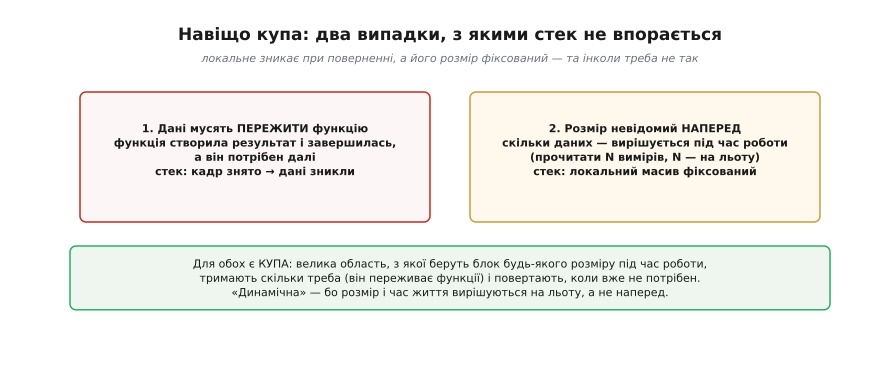
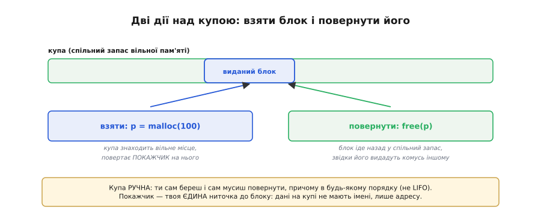
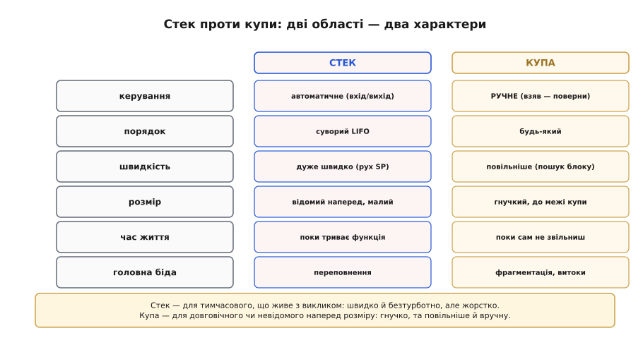
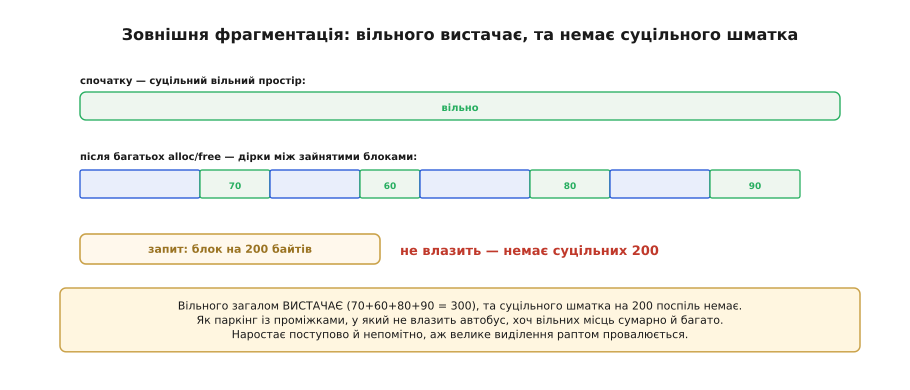
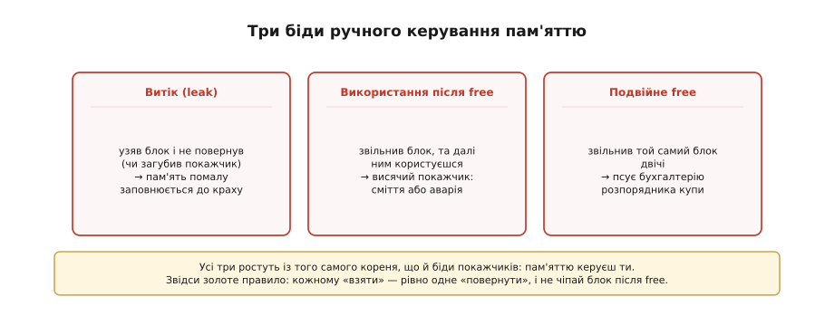
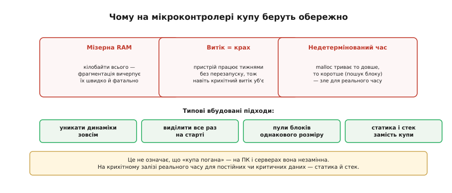

# Купа

[Стек](topic:sf-lang/stack-lifo) — чудовий, але **жорсткий**: дані на ньому живуть рівно стільки, скільки триває виклик, а їхній розмір мусить бути відомий наперед. Та програмування раз у раз вимагає **іншого**: даних, що переживуть функцію, яка їх створила, і даних, чий розмір з'ясується лише під час роботи. Для цього існує **купа** (англ. *heap* — «насип, безладна гора»: назва передає, що блоки лежать тут без порядку, на відміну від акуратного стека) — велика область пам'яті, з якої програма може **взяти** блок будь-якого розміру коли завгодно, тримати його скільки треба й **повернути**, коли більше не потрібен. Це **динамічна пам'ять** — гнучка й могутня, але за гнучкість доводиться платити: ручним керуванням, новою бідою на ім'я **фрагментація** й цілим виводком підступних багів. А на мікроконтролері купа взагалі вимагає особливої обачності. Розберімо і силу динамічної пам'яті, і чому до неї треба підходити з повагою.

### Навіщо купа: чого не може стек


*Два випадки, з якими стек не впорається. Перший: дані мусять **пережити** функцію — вона створила результат і завершилась, а він потрібен далі; та стек уже зняв її кадр, і дані зникли. Другий: розмір невідомий **наперед** — скільки даних, вирішується під час роботи (наприклад, прочитати N вимірів, де N визначається на льоту), а локальний масив на стеку має фіксований розмір. Для обох потрібна пам'ять, яку беруть на льоту й тримають, скільки треба, — це й є купа.*

Слово «**динамічна**» тут ключове: і розмір, і час життя вирішуються **під час роботи** (*runtime*), а не наперед (як у стека чи глобальних змінних, де все зафіксовано при компіляції). Це величезна свобода — брати рівно стільки пам'яті, скільки треба, рівно тоді, коли треба, і тримати її рівно стільки, скільки потрібно. Та свобода, як завжди, має ціну: купою треба **керувати вручну**, і вона породжує проблеми, яких у дисциплінованого стека просто не було.

### Дві дії: взяти й повернути


*Взяти (allocate): просиш блок потрібного розміру — купа знаходить вільне місце й повертає **покажчик** на нього: `p = malloc(100)`. Повернути (free): `free(p)` віддає блок назад у спільний запас, звідки його можуть видати комусь іншому. На відміну від стека, купа **ручна**: ти сам береш і сам мусиш повернути, причому в **будь-якому** порядку (не LIFO). Покажчик — твоя **єдина** ниточка до блоку: у купи дані не мають імені, лише адресу.*

Ось де знову важить сама природа [покажчика](topic:sf-lang/addresses-pointers): блок на купі **не має імені** — лише адресу, тож покажчик на нього — ваша єдина ниточка. Загубили покажчик (перезаписали, втратили з області видимості) — і блок лишився зайнятим, але **недосяжним**: це **витік**. Дві операції — «взяти» і «повернути» — в C називаються `malloc` і `free` (від *memory allocate* — «виділити пам'ять» — і *free* — «звільнити»; у C++ ту саму роль грають `new` і `delete`). Здаються вони простими, але саме на них тримається вся відповідальність: ви, програміст, мусите **парувати** кожне «взяти» з рівно одним «повернути». За тим, які блоки вільні, а які зайняті, стежить **розпорядник купи** (*allocator* — «той, що виділяє») — службова «бухгалтерія» над областю купи, що при виділенні шукає вільний блок потрібного розміру, а при звільненні повертає його в запас. Саме ця свобода брати будь-що будь-коли й породжує головну біду — фрагментацію.

### Стек проти купи

Два світи зручно покласти поряд.


*Стек: керування **автоматичне** (вхід і вихід функції), порядок суворий LIFO, дуже швидко (рух покажчика стека), розмір малий і відомий наперед, час життя — поки триває функція, головна біда — переповнення. Купа: керування **ручне** (взяв — поверни), порядок будь-який, повільніше (пошук блоку), розмір гнучкий до межі купи, час життя — поки сам не звільниш, головні біди — фрагментація й витоки.*

Це порівняння — практична шпаргалка для вибору. **Стек** — для тимчасового, що живе з викликом: швидко, автоматично, безтурботно, але жорстко. **Купа** — для довговічного чи невідомого наперед розміру: гнучко й могутньо, але повільніше, вручну й примхливо. Більшість даних чудово живе на стеку (локальні змінні) чи в глобальних; купу беруть саме тоді, коли потрібна її гнучкість — і свідомо приймають її ціну.

### Як це виглядає в коді

Подивімося на купу руками — короткий і цілком реальний C, де видно і користь, і обидві типові пастки.

> 🔧 **Навіщо це.** Цей фрагмент — той самий код, що ви писатимете щоразу, коли розмір даних з'ясовується на льоту: прочитати рівно `n` вимірів, де `n` приходить ззовні. Якщо засвоїти тут три речі — перевірку на `NULL`, парне `free` і заборону торкатися блоку після звільнення — ви оминете більшість багів динамічної пам'яті ще до того, як вони з'являться.

```c
// Узяти масив на n чисел, чий розмір відомий лише під час роботи.
int *buf = malloc(n * sizeof(int));   // взяти блок на купі
if (buf == NULL) {                    // КУПА могла відмовити — перевіряти ОБОВ'ЯЗКОВО
    return -1;                        // місця немає: чесно вийти, а не писати за NULL
}
for (int i = 0; i < n; i++)
    buf[i] = read_sensor(i);          // користуємось блоком — він переживе будь-яку функцію
process(buf, n);
free(buf);                            // повернути блок: рівно одне free на одне malloc
buf = NULL;                           // обнулити покажчик, щоб не торкнутись звільненого
```

Тепер — три способи зробити це неправильно, кожен зі своїм наслідком:

```c
int *p = malloc(64);
// (1) ВИТІК: вийшли, не повернувши блок — пам'ять зайнята, а покажчика вже нема
return;                  // free(p) так і не сталось

// (2) ВИКОРИСТАННЯ ПІСЛЯ FREE: блок повернули, та чіпаємо далі
free(p);
p[0] = 42;               // пишемо в чужу тепер пам'ять → сміття або аварія

// (3) ПОДВІЙНЕ FREE: повернули той самий блок двічі
free(p);
free(p);                 // псує бухгалтерію розпорядника купи
```

Перший рядок робочого прикладу — `if (buf == NULL)` — не формальність: на стиснутому залізі пропущена перевірка обертається записом за нульовою адресою, а це псує що завгодно. Решта дисципліни вкладається в одне речення: одне `malloc` — одне `free`, і ніколи не торкайся блоку після звільнення. А **звідки** береться сама фрагментація, винесена в назву, видно вже на наступному кроці.

### Головна біда: фрагментація


*Спочатку купа — суцільний вільний простір. Та після багатьох «взяти-повернути» блоків різного розміру в різному порядку вільне місце **дробиться** на дрібні розкидані шматки між зайнятими блоками. І ось біда: запит на великий блок (скажімо, 200 байтів) **не влазить**, хоча вільного загалом **вистачає** (70+60+80+90 = 300), бо немає **суцільного** шматка на 200 поспіль. Це **зовнішня фрагментація**: пам'ять є, але роздроблена.*

Сам термін **фрагментація** (від латинського *fragmentum* — «уламок, відколений шматок») точно називає суть: суцільне вільне поле кришиться на уламки. Аналогія тут влучна: це як **паркінг із проміжками**, у який не влазить автобус, хоч вільних місць сумарно й багато — вони просто розкидані. Фрагментація підступна, бо наростає **поступово й непомітно**: програма працює собі, бере й повертає блоки, а вільна пам'ять тихо кришиться на все дрібніші уламки, аж поки одного дня велике виділення раптом не зазнає невдачі — попри «достатню» вільну пам'ять. На великих системах із цим борються (ущільнення, пули блоків однакового розміру), та на крихітному мікроконтролері фрагментація особливо небезпечна. Це фундаментальна ціна свободи брати блоки будь-якого розміру в будь-якому порядку.

### Біди купи

Фрагментація — не єдина небезпека. Ручне керування означає **ручні помилки**, і всі вони підступні.


*Витік пам'яті (leak): узяв блок і не повернув (чи загубив покажчик) — пам'ять помалу заповнюється, аж поки не вичерпається. Використання після звільнення: звільнив блок, та далі ним користуєшся через покажчик — це висячий покажчик, що дає сміття або аварію. Подвійне звільнення (double free): звільнив той самий блок двічі — псує бухгалтерію розпорядника купи. Усі три ростуть із того самого кореня, що й біди покажчиків: пам'яттю керуєш ти, і ти ж за неї відповідаєш.*

Найпідступніший — **витік**: програма працює нібито нормально, але помалу «з'їдає» пам'ять; на сервері це можуть бути тижні до краху, на мікроконтролері — інколи години. А **використання після звільнення** — це прямий нащадок [висячого покажчика](topic:sf-lang/addresses-pointers): ви тримаєте папірець з адресою будинку, який уже знесли. Усі ці біди мають спільний корінь: на відміну від автоматичного стека, купою керуєте **ви**, і кожна неуважність обертається багом, що проявляється не одразу, а згодом і не там. Звідси й **золоте правило**: кожному «взяти» — рівно одне «повернути», не раніше й не пізніше; і ніколи не чіпай блок після звільнення.

### Купа на мікроконтролері: обережно


*На крихітному мікроконтролері динамічна пам'ять особливо ризикована. Мізерна RAM (кілобайти) — фрагментація вичерпує її швидко й фатально. Витік дорівнює краху — пристрій працює тижнями без перезапуску, тож навіть крихітний витік зрештою його вб'є. Недетермінований час — виділення триває то довше, то коротше (пошук блоку), а це погано для керування в реальному часі. Тому вбудована практика часто **уникає** динамічної пам'яті, або виділяє один раз на старті, або бере фіксовані «пули» блоків.*

Це не означає, що «купа погана» — на великих системах (ПК, сервери) вона незамінна. Та на **крихітному залізі реального часу** до неї підходять сторожко. Типові підходи у вбудованих системах: **уникати** динамічної пам'яті зовсім; або виділити все потрібне **один раз на старті** (і більше не звільняти); або користуватися **пулами** блоків однакового розміру (де фрагментації не буває за визначенням); або взагалі обходитися **стеком і глобальними** (статичною пам'яттю). Правило просте: для постійних чи критичних до часу даних на мікроконтролері — статика й стек; динамічна пам'ять — лише за справжньої потреби й обережно. У прошивці варто віддавати перевагу **передбачуваній** статичній пам'яті там, де можна, — і система буде надійнішою.

> 🔧 **Навіщо це.** Динамічна пам'ять — потужний інструмент, що вимагає відповідальності, особливо на мікроконтролері. Перше: **купа — для даних, що переживають функцію або чий розмір невідомий наперед**; для всього іншого є дешевший і безпечніший [стек](topic:sf-lang/stack-lifo) та глобальні. Друге: **кожному виділенню — рівно одне звільнення**; забув повернути — витік (пам'ять тихо закінчиться), повернув і користуєшся далі — [висяча біда](topic:sf-lang/addresses-pointers); це найчастіші й найпідступніші помилки. Третє: **покажчик — ваша єдина ниточка** до блоку на купі; загубили його — загубили пам'ять. Четверте, найважливіше для прошивки: **на мікроконтролері купу беруть обережно** — мізерна RAM, фатальна фрагментація, витоки, що валять довгопрацюючий пристрій, і недетермінований час; тому в прошивках часто уникають динамічної пам'яті або суворо її обмежують. Засвойте різницю стек/купа й дисципліну «взяв — поверни» — і ви оминете найгрізніші біди пам'яті.
