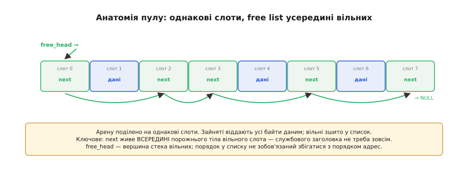
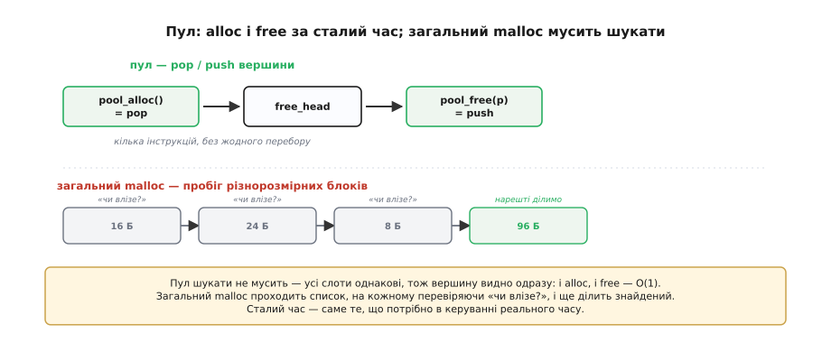
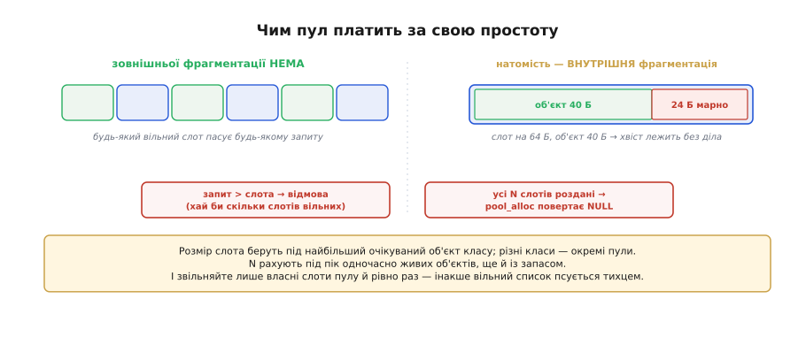

# ⚙️ Пули блоків: динамічна пам'ять без фрагментації

> Загальна [купа й динамічна пам'ять](topic:sf-lang/heap-dynamic-memory) дає неоціненну гнучкість — брати блок будь-якого розміру будь-коли, — але платить за неї **фрагментацією**, **недетермінованим часом** і виводком ручних помилок, а на мікроконтролері це особливо боляче. Є рятівний прийом, де фрагментації не буває за визначенням: **пули блоків однакового розміру**. Розберімо його до кінця — як він улаштований, чому виділення в ньому коштує сталий час O(1) і яку ціну він просить натомість.

## Задача: динамічна пам'ять там, де купа зась

Уявімо типову вбудовану ситуацію. Прошивка приймає з радіо пакети, і кожен треба десь потримати, поки його опрацюють: то один пакет у польоті, то одразу п'ять. Розмір пакета відомий і однаковий, а от **скільки** їх живе водночас — ні. Це просить динамічної пам'яті: брати буфер, коли пакет прийшов, і повертати, коли опрацьований. Та загальна [купа](topic:sf-lang/heap-dynamic-memory) тут небажана: пакети приходять і йдуть тисячі разів на секунду, вільне місце потроху кришиться на розкидані уламки, а пошук блоку по списку триває то довше, то коротше — і одного дня виділення провалюється або запізнюється рівно тоді, коли цього найменше можна допустити. Питання руба: як зберегти зручність «взяв — повернув», але **викинути** з неї і фрагментацію, і непередбачуваний час?

## Ідея: один розмір на всіх

Уся хитрість в одному обмеженні: хай **усі блоки будуть однакові**. Беремо суцільний масив пам'яті — **арену** (*pool arena*) — і ще на старті ріжемо її на N однаковісіньких **слотів** (*slots*) наперед заданого розміру. Раптом усі біди загального розпорядника тануть. Зовнішньої фрагментації більше **немає в принципі**: коли всі дірки одного розміру, будь-яка вільна дірка годиться під будь-який запит — «розкиданих уламків, що не влазять», просто не буває. А пошук «який блок узяти» зникає геть: годиться **перший-ліпший** вільний слот, бо вони не різняться.

Лишається тримати облік, які слоти вільні. Тут другий гарний хід: зшити вільні слоти в **однозв'язний список** — **free list**, — але посилання `next` зберігати **просто всередині самого вільного слота**. Поки слот не виданий, його тіло порожнє й нічого не варте — от туди й кладемо адресу наступного вільного. Виходить список, який не коштує **жодного зайвого байта** службових даних на блок (на відміну від загальної купи з її заголовком розміру в кожному блоці). Голова списку — покажчик `free_head` — указує на перший вільний слот, тож фактично це **стек вільних слотів**.


*Арену поділено на вісім однакових слотів. Зайняті віддають усі свої байти даним; вільні зшито в список — `free_head` указує на перший, той посиланням `next` на наступний, і так до `NULL`. Ключове: `next` живе **всередині** порожнього тіла вільного слота, тож службового заголовка на блок не треба зовсім. Порядок у списку не зобов'язаний збігатися з порядком за адресами.*

З цієї картини обидві операції стають майже тривіальними. **Виділити** слот — це зняти верхній елемент стека: повернути слот, на який дивиться `free_head`, а саму голову пересунути на його `next`. **Звільнити** слот — покласти його назад на вершину: записати в його `next` поточну голову, а голову перевести на цей слот. Жодного перебору, жодного пошуку — кілька інструкцій в обох випадках.


*`pool_alloc` знімає слот із вершини списку, `pool_free` кладе слот назад на вершину — обидві дії за **сталий час**, без жодного перебору. Унизу — контраст: загальний `malloc` мусить **пройти** список різнорозмірних блоків, на кожному перевіряючи «чи влізе?», і ще ділити знайдений. Пул шукати не мусить — усі слоти однакові, тож вершину видно одразу.*

## Реалізація

Зведімо ідею в код. Вільний слот несе всередині лише одне поле — посилання на наступний вільний, тож найпростіше описати його окремою структурою `Slot`, а сам пул — структурою `Pool` з головою списку, ареною та розмірами. `pool_init` один раз нарізає арену й зшиває всі слоти у вільний список; `pool_alloc` і `pool_free` — це pop і push того стека.

```c
#include <stddef.h>
#include <stdint.h>

// Вільний слот несе всередині тільки посилання на наступний вільний.
// Тому розмір слота мусить бути не меншим за sizeof(Slot).
typedef struct Slot {
    struct Slot *next;
} Slot;

typedef struct {
    Slot    *free_head;   // вершина стека вільних слотів
    uint8_t *arena;       // початок суцільної арени
    size_t   slot_size;   // розмір одного слота, байтів
    size_t   count;       // N — скільки слотів усього
} Pool;

// Нарізати арену на N слотів і зшити всі у вільний список.
void pool_init(Pool *p, void *arena, size_t slot_size, size_t count) {
    p->arena     = (uint8_t *)arena;
    p->slot_size = slot_size;
    p->count     = count;
    p->free_head = NULL;
    // зшиваємо з кінця, щоб на виході голова вказувала на слот 0
    for (size_t i = count; i-- > 0; ) {
        Slot *slot   = (Slot *)(p->arena + i * slot_size);
        slot->next   = p->free_head;   // next лежить у тілі вільного слота
        p->free_head = slot;
    }
}

// Виділити слот = зняти верхній елемент стека вільних. O(1).
void *pool_alloc(Pool *p) {
    if (p->free_head == NULL)          // слоти скінчились — чесна відмова
        return NULL;
    Slot *block  = p->free_head;
    p->free_head = block->next;        // голова з'їжджає на наступний вільний
    return block;                      // тіло слота тепер віддане даним
}

// Звільнити слот = покласти назад на вершину стека. O(1).
void pool_free(Pool *p, void *ptr) {
    if (ptr == NULL)
        return;
    Slot *slot   = (Slot *)ptr;
    slot->next   = p->free_head;       // старий верх стає наступним
    p->free_head = slot;               // а звільнений слот — новим верхом
}
```

Тут видно всі суттєві риси одразу: пул **сам собі розпорядник** над власною ареною, виділення й звільнення не залежать від кількості зайнятих блоків, а «пам'ять скінчилась» — це проста перевірка `free_head == NULL`, а не загадковий збій десь у глибині купи. Одна тиха умова коректності схована в структурі `Slot`: розмір слота має бути **не меншим** за `sizeof(Slot)` (тобто за розмір покажчика) і кратним вирівнюванню — інакше посиланню `next` просто нема де лягти в тілі вільного слота.

## Складність і пастки на МК

Виграш у швидкості прямий: і `pool_alloc`, і `pool_free` — **O(1)**, кілька інструкцій, без циклів. Це не просто «швидше» — це **детерміновано**: час однаковий завжди, скільки б слотів не було зайнято, а саме сталий час і потрібен у керуванні реального часу, де загальна купа підводить непередбачуваністю. До того ж пул не носить службового заголовка на блок (посилання `next` лежить у тілі вільного слота й зникає, щойно слот виданий), тож на дрібних об'єктах він ще й **ощадливіший** за загальну купу за пам'яттю.

Та однаковий розмір, що подарував усі ці переваги, водночас і ставить межі — і їх треба знати в обличчя.


*Зовнішньої фрагментації немає за визначенням — будь-який вільний слот придатний (ліворуч). Натомість з'являється **внутрішня фрагментація** (праворуч): поклавши 40 байтів у слот на 64, ми марнуємо 24 байти всередині слота. І дві тверді межі (внизу): запит, **більший** за слот, провалюється навіть за купи вільних слотів, а коли всі N слотів роздані — наступне виділення повертає `NULL`.*

Перша пастка — **внутрішня фрагментація** (*internal fragmentation*): дрібний об'єкт займає цілий слот, а різниця між розміром слота й розміром об'єкта лежить без діла. Зовнішню фрагментацію ми прибрали, але частину пам'яті все одно марнуємо — тільки тепер усередині слотів. Лік простий: брати розмір слота **близько до типового об'єкта**, а коли об'єкти різко різних розмірів — тримати **кілька окремих пулів** під різні класи (скажімо, пул дрібних і пул великих). Друга — **жорстка стеля розміру**: слот фіксований, тож запит, що в нього не влазить, приречений, хай би скільки слотів стояло вільними; тому розмір слота беруть під **найбільший очікуваний** об'єкт класу. Третя — **скінченність**: слотів рівно N, виділених на старті, і коли всі роздані, чесний `pool_alloc` повертає `NULL` — тут не можна, як у загальній купі, «дотягтися» до решти RAM. Через це N рахують під **пік одночасно живих** об'єктів, ще й із запасом, бо вичерпання пулу в роботі — це відмова. І остання, наскрізна для всього розділу обачність: `pool_free` має приймати лише покажчик, що **справді** вказує на слот **цього** пулу (а не чужу адресу й не той самий слот двічі) — інакше ми зіпсуємо вільний список так само, як подвійне `free` псує бухгалтерію купи; на МК без захисту пам'яті (а [мапа пам'яті](topic:hw-arch/memory-map) на дрібному контролері плоска, без сторожа) така помилка не дасть чесної аварії, а тихо понівечить сусідні дані.

> 🔧 **Навіщо це.** Пул блоків — це **приручена** динамічна пам'ять для вбудованих систем: ви лишаєте собі зручність «взяв — повернув», але свідомо міняєте свободу довільного розміру на **передбачуваність** — сталий час O(1) і нуль зовнішньої фрагментації. Саме тому до пулів тягнуться там, де купа зась: у драйверах, мережевих буферах, чергах подій реального часу. Той самий принцип «виділити пам'ять наперед і роздавати готовими блоками» лежить і в основі того, як RTOS дає кожній задачі її [стек із заздалегідь відведеної пам'яті](topic:sf-lang/task-stacks).
