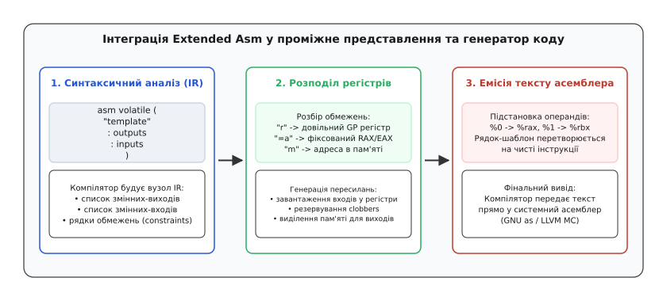
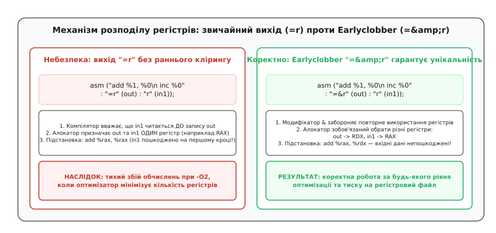
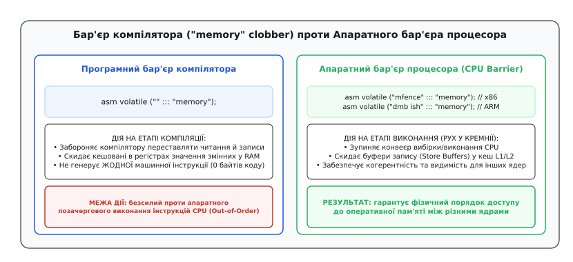
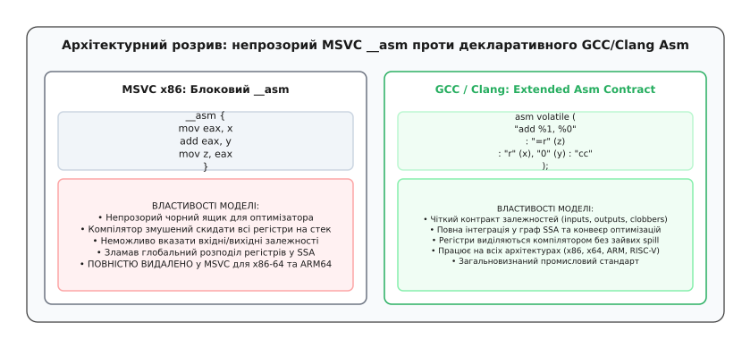
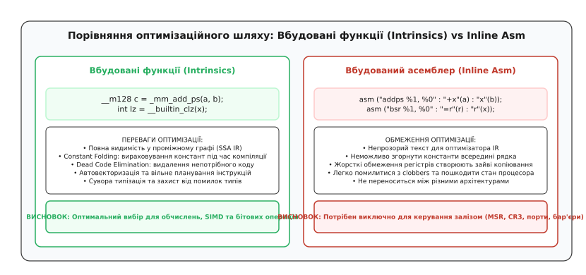

# Вбудований асемблер у C/C++

<preknowlist>
- [Компіляція](topic:sf-lang/compilation) — трансляція коду високого рівня в машинний код цільової архітектури.
- [Оптимізації компілятора](topic:sf-lang/compiler-optimizations) — перетворення проміжного представлення (SSA) та перевпорядкування інструкцій.
- [Правило «ніби»](topic:sf-lang/as-if-rule) — дозвіл оптимізатору змінювати послідовність дій за умови незмінності спостережуваного результату.
- [volatile](topic:sf-lang/volatile) — заборона кешування значень у регістрах та видалення операцій звернення до пам'яті.
- [ABI та calling convention](topic:sf-lang/abi-calling-convention) — угоди про виклики, збережені й тимчасові регістри процесора.
- [Набір інструкцій](topic:hw-arch/isa) — машинний рівень команд процесора, прапорці стану та регістри загального призначення.
</preknowlist>

Коли операційній системі потрібно перемкнути таблиці сторінок віртуальної пам'яті, процесор x86-64 вимагає записати фізичну адресу кореневого каталогу `PML4` безпосередньо в системний регістр керування `CR3` за допомогою інструкції `mov %rax, %cr3`. У мовах C та C++ не існує жодної синтаксичної конструкції, оператора чи покажчика, здатного згенерувати цю команду: мовна модель розглядає апаратну платформу як абстрактну машину з лінійною пам'яттю, де керуючі регістри процесора, інструкції керування перериваннями та лічильники тактів просто не мають еквівалентів.

Спроба розв'язати цю проблему викликом окремої підпрограми, скомпільованої в зовнішньому асемблерному файлі, створює відчутні накладні витрати: процесор мусить виконати інструкцію виклику `call`, зберегти адресу повернення на стеку, налаштувати стек-фрейм функції відповідно до [угод про виклики (ABI)](topic:sf-lang/abi-calling-convention) і повернутися через `ret`. Для операцій, які мають виконуватися за 1–2 такти в критичних секціях ядра або в гарячих циклах обробки сигналів (наприклад, зчитування лічильника `RDTSC` чи атомарне блокування шини), такий оверхед є неприпустимим.

Єдиним прямим містком між абстракцією високого рівня та кремнієм мікропроцесора є **вбудований асемблер** (англ. *inline assembly*). Проте просте вставляння сирого машинного тексту в оптимізувальний компілятор миттєво руйнує роботу генератора коду: оптимізатор не знає, які регістри модифікує інструкція, які змінні вона читає і чи можна видалити цей фрагмент як мертвий код. Щоб поєднати абсолютний контроль над залізом із математичною оптимізацією, був створений формальний інтерфейс взаємодії — **розширений асемблер (Extended Asm)**.

## Базовий асемблер та криза чорного ящика

У найпростішій формі, успадкованій ще від перших компіляторів мови C для PDP-11, асемблерна вставка записується як один текстовий рядок: `asm("cli")` або `__asm__("nop")`. Такий формат називають **базовим асемблером** (англ. *Basic Assembly*).

Для компілятора базовий асемблер є абсолютно непрозорим чорним ящиком:

:::tabs
```c
void disable_interrupts_basic(void) {
    /* Базовий асемблер без опису операндів */
    __asm__("cli");
}
```
```cpp
void disable_interrupts_basic() noexcept {
    /* Базовий асемблер у C++ */
    asm("cli");
}
```
```asm
# Згенерований машинний код x86-64
disable_interrupts_basic:
    cli
    ret
```
:::

У наведеному прикладі інструкція `cli` (Clear Interrupt Flag) не має операндів і не взаємодіє зі змінними C, тому базовий синтаксис видається достатнім. Проте щойно вставка намагається виконати обчислення чи передати дані між C-змінними та регістрами процесора, виникає нерозв'язний конфлікт із розподілювачем регістрів компілятора.

Розглянемо функцію, яка намагається додати число до локальної змінної через базовий асемблер:

:::tabs
```c
int increment_broken(int x) {
    /* Спроба використати базовий асемблер для обчислень */
    __asm__("addl $1, %eax");
    return x;
}
```
```cpp
int increment_broken(int x) noexcept {
    /* Помилкова спроба прямого використання регістра */
    asm("addl $1, %eax");
    return x;
}
```
:::

Під час компіляції з увімкненою оптимізацією (`-O2` або `-O3`) цей код призводить до тихого пошкодження даних або повернення старого незміненого значення `x`. Причина полягає в принципах функціонування компіляторного конвеєра:

1. **Відсутність зв'язку зі змінними:** компілятор не знає, що інструкція `addl` розраховує отримати значення змінної `x` саме в регістрі `%eax`. Згідно з угодою System V AMD64 ABI, перший цілочисельний аргумент передається в регістрі `%edi`, а не `%eax`. Компілятор не генерує команду пересилання `mov %edi, %eax`, оскільки він не аналізує вміст асемблерного рядка.
2. **Непомічене пошкодження стану:** компілятор не поінформований про те, що регістр `%eax` було змінено. Якщо оптимізатор зберігав у `%eax` проміжне значення іншої важливої змінної або покажчика, воно буде безповоротно затерте.
3. **Видалення та перевпорядкування:** оскільки компілятор не бачить, щоб значення `x` у виразі `return x` залежало від результату оператора `asm`, за [правилом «ніби» (as-if rule)](topic:sf-lang/as-if-rule) оптимізатор має повне право повністю видалити рядок асемблера як мертвий код або винести його за межі функції.

Щоб позбутися цих фатальних вад, провідні компілятори сімейства GCC та Clang запровадили декларативний контракт операндів. Детально про історичне протистояння різних підходів до вбудованого коду можна дізнатися у вставці [Від базового рядка до контракту оптимізатора: еволюція вбудованого асемблера](topic:sf-lang/inline-assembly/hist-inline-asm-evolution.md).

## Анатомія Extended Asm у GCC та Clang

**Розширений вбудований асемблер** (англ. *Extended Assembly*) перетворює асемблерну вставку з непрозорого рядка на повноцінний вузол у проміжному графі залежностей компілятора (SSA IR). Програміст більше не прив'язує команди до конкретних фізичних регістрів вручну; замість цього він описує правила вводу, виводу та побічних ефектів за допомогою чотирьох розділених двокрапками секцій:

```text
asm [volatile] [inline] [goto] (
    "Шаблон інструкцій"
    : Вихідні операнди (Outputs)
    : Вхідні операнди (Inputs)
    : Зіпсовані ресурси (Clobbers)
    : Мітки переходів (GotoLabels)
);
```


*Конвеєр трансляції розширеного асемблера: компілятор аналізує обмеження, виділяє фізичні регістри з пулу доступних ресурсів, резервує зіпсовані регістри та підставляє апаратні назви в текстовий шаблон інструкцій.*

Розглянемо покроково, як влаштована кожна секція на прикладі обчислення 64-розрядної суми двох чисел з генерацією прапорця переносу (Carry Flag):

:::tabs
```c
#include <stdint.h>

uint64_t add_with_carry(uint64_t a, uint64_t b, uint8_t *carry_out) {
    uint64_t sum;
    uint8_t carry;
    
    __asm__ __volatile__ (
        "addq %[src], %[dst]\n\t"   /* Додавання: dst = dst + src */
        "setc %[c_out]"             /* Запис прапорця Carry у змінну */
        : [dst] "=r" (sum),         /* Вихід 0: результат суми */
          [c_out] "=q" (carry)      /* Вихід 1: прапорець переносу (8-бітний регістр) */
        : [src] "r" (b),            /* Вхід 0: доданок b */
          "[dst]" (a)               /* Вхід 1: початкове значення для dst (збігається з sum) */
        : "cc"                      /* Clobber: змінено арифметичні прапорці */
    );
    
    *carry_out = carry;
    return sum;
}
```
```cpp
#include <cstdint>
#include <utility>

/* Ідіоматична C++ версія, що повертає пару зі значенням і прапорцем */
std::pair<uint64_t, uint8_t> add_with_carry(uint64_t a, uint64_t b) noexcept {
    uint64_t sum = 0;
    uint8_t carry = 0;
    
    asm volatile (
        "addq %[src], %[dst]\n\t"
        "setc %[c_out]"
        : [dst] "=r" (sum),
          [c_out] "=q" (carry)
        : [src] "r" (b),
          "[dst]" (a)
        : "cc"
    );
    
    return {sum, carry};
}
```
:::

### Роль ключового слова volatile

Ключове слово `volatile` в операторі `asm volatile` має строго визначену компіляторну семантику: воно повідомляє оптимізатору, що виконання цієї вставки має спостережувані побічні ефекти (Side Effects), які не відображені в явному списку вихідних змінних (наприклад, зміна стану портів введення-виведення, керування прапорцями переривань процесора чи модифікація апаратних таймерів).

Внаслідок цього `volatile` накладає два жорстких обмеження:
1. Забороняє компілятору **видаляти** блок вбудованого асемблера як мертвий код (Dead Code Elimination), навіть якщо жоден з його вихідних операндів не використовується далі в потоці керування.
2. Забороняє **виносити** блок за межі циклів (Loop-Invariant Code Motion) або дублювати його під час оптимізацій розгортання коду.

> ⚠️ **Критичне розмежування:** `asm volatile` гарантує збереження виконання інструкції, проте воно **не є бар'єром пам'яті**. Компілятор має повне право переставляти звичайні операції читання й запису змінних C навколо блоку `asm volatile`, якщо не вказано додаткових обмежень пам'яті (`"memory"` clobber).

Якщо блок `asm` взагалі не має секції виходів (наприклад, `asm("cli" ::: "memory")`), компілятори GCC та Clang автоматично трактують його як `volatile`. Якщо ж блок має виходи, але не позначений `volatile`, оптимізатор безжально викине всю вставку, щойно виявиться, що обчислене значення ніде не читається.

## Обмеження операндів (Constraints)

**Рядок обмеження** (англ. *constraint string*) — це точна декларативна інструкція для розподілювача регістрів (Register Allocator), яка визначає, де саме має розташовуватися операнд на момент передачі керування асемблерній інструкції: у довільному регістрі загального призначення, у спеціалізованому фіксованому регістрі, у комірці оперативної пам'яті чи безпосередньо як числова константа в коді.

Повний перелік синтаксичних форм та прапорців наведено у довіднику [Довідник синтаксису, обмежень та модифікаторів Extended Asm](topic:sf-lang/inline-assembly/api-extended-asm-constraints.md).

### Базові класи обмежень

1. `"r"` (**Register**) — вимагає виділити для операнда довільний регістр загального призначення (General Purpose Register). Компілятор самостійно знаходить найменш завантажений регістр процесора, що мінімізує скидання даних у стек.
2. `"m"` (**Memory**) — операнд передається через пряму адресу в оперативній пам'яті (наприклад, `(%rdi)` або `32(%rsp)`). Компілятор не витрачає апаратний регістр для завантаження значення, а генерує ефективну адресу операнда для використання машинними інструкціями з адресацією пам'яті.
3. `"i"` (**Immediate**) — операнд є цілочисельною константою, відомою на етапі компіляції. Дозволяє компілятору закодувати число безпосередньо в тіло машинної інструкції (наприклад, `addl $42, %eax`). Якщо передати змінну замість константи, компілятор видасть помилку збірки.
4. `"g"` (**General**) — довільний з перелічених варіантів (`r`, `m` або `i`). Надає оптимізатору максимальну свободу вибору найефективнішого представлення залежно від поточного тиску на регістровий файл.
5. Архітектурно-фіксовані регістри x86:
   - `"a"` — виключно регістр `RAX` / `EAX` / `AL` (необхідний для інструкцій множення `mul`, ділення `div`, операцій введення-виведення `in`/`out` та системних викликів);
   - `"c"` — лічильник `RCX` / `ECX` / `CL` (обов'язковий для інструкцій зсуву `shl`/`shr` та рядкових інструкцій з префіксом `rep`);
   - `"d"` — регістр даних `RDX` / `EDX` (старша частина добутку чи діленого);
   - `"x"` — векторний 128-бітний регістр SSE (`XMM0`–`XMM15`);
   - `"v"` — розширений векторний регістр AVX-512 (`XMM`, `YMM`, `ZMM`).

### Модифікатори обмежень: вихід, оновлення та Earlyclobber

Перед символом обмеження обов'язково вказується модифікатор напрямку передачі даних:

- `"="` (**Write-only**) — вказує, що операнд є виключно вихідним. Компілятор вважає попереднє значення змінної знищеним і перезаписує його результатом виконання інструкції.
- `"+"` (**Read-Modify-Write**) — операнд є одночасно і входом, і виходом. Компілятор завантажує початкове значення змінної в регістр перед початком вставки і зберігає оновлене значення після її завершення.
- `"&"` (**Earlyclobber**) — модифікатор раннього перезапису, один із найважливіших інструментів безпеки у вбудованому асемблері.


*Механізм Earlyclobber: без модифікатора `&` алокатор компілятора об'єднує вхідний і вихідний операнди в один фізичний регістр, що руйнує вхідні дані на проміжних кроках багаторядкової вставки.*

Розглянемо детальний механізм виникнення дефекту раннього перезапису:

За замовчуванням розподілювач регістрів виходить із припущення, що процесор зчитує всі вхідні операнди **до** того, як буде згенеровано перший вихідний результат. Відповідно, з метою мінімізації кількості задіяних регістрів компілятор призначає вихідному операнду `"=r"` той самий фізичний регістр, що й одному з входів `"r"`.

Якщо асемблерний блок містить більше ніж одну команду, і вихідний операнд модифікується на першому кроці, значення вхідного операнда у спільному регістрі знищується до того, як наступні інструкції встигнуть його використати:

:::tabs
```c
/* НЕБЕЗПЕЧНО: помилка через відсутність раннього клірингу */
uint32_t broken_combine(uint32_t a, uint32_t b) {
    uint32_t result;
    __asm__ (
        "movl %1, %0\n\t"   /* Якщо %0 та %2 в одному регістрі, %2 затерто! */
        "addl %2, %0"
        : "=r" (result)     /* ДЕФЕКТ: компілятор може призначити result та b регістр %eax */
        : "r" (a), "r" (b)
    );
    return result;
}

/* БЕЗПЕЧНО: модифікатор & забороняє спільне використання регістрів */
uint32_t safe_combine(uint32_t a, uint32_t b) {
    uint32_t result;
    __asm__ (
        "movl %1, %0\n\t"
        "addl %2, %0"
        : "=&r" (result)    /* ВИПРАВЛЕНО: result гарантовано отримає унікальний регістр */
        : "r" (a), "r" (b)
    );
    return result;
}
```
```cpp
/* C++ версія безпечного комбінування операндів */
uint32_t safe_combine(uint32_t a, uint32_t b) noexcept {
    uint32_t result = 0;
    asm (
        "movl %1, %0\n\t"
        "addl %2, %0"
        : "=&r" (result)
        : "r" (a), "r" (b)
    );
    return result;
}
```
:::

Практичні експерименти з відтворенням пастки Earlyclobber під різними рівнями оптимізації детально розібрано у практикумі [Практикум: таймери процесора, бар'єри компілятора та пастки оптимізації](topic:sf-lang/inline-assembly/proj-benchmark-barrier.md).

## Секція зіпсованих ресурсів (Clobbers) та бар'єр компілятора

Секція **Clobbers** повідомляє оптимізатору про побічні ефекти, які не описані в секції вихідних операндів. Вона містить розділений комами список апаратних ресурсів, які інструкція змінює без відома компілятора.

### Види Clobber-специфікацій

1. **Конкретні фізичні регістри (`"rax"`, `"rcx"`, `"r11"`):** якщо асемблерна команда неявно змінює фіксований регістр (наприклад, інструкція `cpuid` модифікує `eax`, `ebx`, `ecx`, `edx`), ці регістри обов'язково перелічуються в списку clobbers. Оптимізатор збереже їхній попередній вміст у стек і не буде зберігати в них змінні програми на момент виконання блоку.
2. **Прапорці стану (`"cc"`):** інформує компілятор про те, що інструкція модифікувала регістр прапорців умовних переходів (`EFLAGS` / `RFLAGS` на x86, `CPSR` на ARM). Оптимізатор враховує, що попередні результати порівнянь втрачені, і генерує нові перевірки перед розгалуженнями.
3. **Оперативна пам'ять (`"memory"`):** так званий **програмний бар'єр пам'яті** (англ. *Compiler Memory Barrier*).

### Механізм дії `"memory"` clobber

Коли в секції clobbers вказано рядок `"memory"`, компілятор робить припущення найгіршого випадку: вбудований асемблер міг прочитати або перезаписати абсолютно будь-яку змінну в оперативній пам'яті за довільними покажчиками.


*Порівняння рівнів синхронізації: `"memory"` clobber керує лише оптимізатором і скиданням регістрів у RAM під час трансляції, тоді як апаратні інструкції (MFENCE / DMB) скидають буфери запису всередині кремнієвого ядра процесора.*

Це викликає дві фундаментальні дії генератора коду:
1. **Скидання брудних регістрів (Register Spill):** перед виконанням асемблерного блоку компілятор зобов'язаний зберегти в пам'ять усі змінні, які наразі утримуються в регістрах.
2. **Інвалідація кешованих значень (Reload):** після завершення блоку оптимізатор не має права повторно використовувати значення змінних з регістрів. Він зобов'язаний зчитати їх заново з фізичної пам'яті.

> 🔧 **Навіщо це:**
> Класичний випадок використання — ініціалізація апаратних буферів DMA або керування апаратними регістрами прапорців, де не можна допустити випереджального запису тригера до повного збереження корисного навантаження в пам'ять.

:::tabs
```c
void trigger_dma_transfer(volatile uint32_t *dma_flag, uint8_t *buffer) {
    buffer[0] = 0xAA;
    buffer[1] = 0xBB;
    /* Забороняємо компілятору переставити запис flag = 1 перед записом даних у buffer */
    __asm__ __volatile__ ("" ::: "memory");
    *dma_flag = 1;
}
```
```cpp
void trigger_dma_transfer(volatile uint32_t *dma_flag, uint8_t *buffer) noexcept {
    buffer[0] = 0xAA;
    buffer[1] = 0xBB;
    asm volatile ("" ::: "memory");
    *dma_flag = 1;
}
```
:::

Слід чітко розрізняти:
- **Програмний бар'єр компілятора (`asm volatile("" ::: "memory")`):** діє **виключно на етапі компіляції**. Він не генерує жодного байта машинного коду (розмір = 0 тактів) і запобігає перевпорядкуванню інструкцій оптимізатором.
- **Апаратний бар'єр процесора (`mfence`, `dmb ish`):** діє **під час виконання в процесорі**. Він зупиняє конвеєр мікропроцесора, скидає черги запису (Store Buffers) у кеш-пам'ять і гарантує фізичний порядок доступу до RAM між різними ядрами CPU.

## Прямі переходи в C: інфраструктура asm goto

Традиційний вбудований асемблер повертає результат через змінну, після чого код на C виконує умовний перехід за допомогою оператора `if`:

:::tabs
```c
/* Звичайний підхід: генерація проміжного прапорця */
void check_overflow_classic(int a, int b) {
    int is_overflow;
    __asm__ ("addl %2, %0\n\t"
             "seto %b1"
             : "+r" (a), "=q" (is_overflow)
             : "r" (b)
             : "cc");
    if (is_overflow) {
        /* Обробка помилки */
    }
}
```
```cpp
void check_overflow_classic(int a, int b) noexcept {
    int is_overflow = 0;
    asm ("addl %2, %0\n\t"
         "seto %b1"
         : "+r" (a), "=q" (is_overflow)
         : "r" (b)
         : "cc");
    if (is_overflow) {
        /* Обробка помилки */
    }
}
```
:::

Така конструкція змушує процесор спочатку записати біт прапорця в регістр через команду `seto`, а потім перевірити цей регістр через `test` або `cmp` перед інструкцією умовного переходу `jne`.

Для усунення цих накладних витрат у GCC 4.5 та Clang 9 було впроваджено синтаксис **`asm goto`**. Він дозволяє машинній інструкції стрибати безпосередньо на мітки мови C:

:::tabs
```c
#include <stdbool.h>
#include <stdio.h>

void execute_fast_math(int a, int b) {
    /* asm goto виконує прямий стрибок на мітку overflow_detected */
    __asm__ __volatile__ goto (
        "addl %1, %0\n\t"
        "jo %l[overflow_detected]" /* Jump if Overflow прямо на C-мітку */
        :
        : "r" (a), "r" (b)
        : "cc"
        : overflow_detected
    );
    
    printf("Обчислення успішне, переповнення немає.\n");
    return;

overflow_detected:
    fprintf(stderr, "Помилка: арифметичне переповнення!\n");
}
```
```cpp
#include <iostream>

void execute_fast_math(int a, int b) noexcept {
    asm volatile goto (
        "addl %1, %0\n\t"
        "jo %l[overflow_detected]"
        :
        : "r" (a), "r" (b)
        : "cc"
        : overflow_detected
    );
    
    std::cout << "Обчислення успішне, переповнення немає.\n";
    return;

overflow_detected:
    std::cerr << "Помилка: арифметичне переповнення!\n";
}
```
:::

У ядрі Linux механізм `asm goto` став фундаментом оптимізації **Static Keys (Jump Labels)**. Коли трасування ядра вимкнено, на місці перевірки стоїть однобайтова інструкція `NOP`. Якщо адміністратор активує трасування, ядро динамічно замінює байт `NOP` на інструкцію безумовного переходу `JMP`, що забезпечує нульові накладні витрати на перевірку умов у гарячих мережевих шляхах.

## Архітектурний розкол: MSVC __asm проти GCC Extended Asm

В індустрії розробки під архітектуру x86 довгий час співіснували дві принципово різні філософії реалізації вбудованого асемблера: модель компілятора Microsoft Visual C++ та модель компіляторів GCC/Clang.


*Контраст архітектур: блоковий синтаксис MSVC змушує компілятор скидати всі регістри у стек через відсутність контракту, тоді як модель GCC інтегрує інструкції в оптимізаційний граф SSA.*

### Чому Microsoft видалила __asm у 64-розрядному компіляторі

У 32-розрядному компіляторі MSVC блок `__asm` використовував синтаксис Intel:

:::tabs
```c
/* Тільки для 32-розрядного MSVC (x86 32-bit) */
int add_fast_msvc(int a, int b) {
    __asm {
        mov eax, a
        add eax, b
    }
}
```
```cpp
int add_fast_msvc(int a, int b) noexcept {
    __asm {
        mov eax, a
        add eax, b
    }
}
```
:::

Хоча цей запис виглядав інтуїтивно зрозумілим, він мав катастрофічні наслідки для оптимізатора:
- Компілятор MSVC не знав, які змінні та регістри змінює блок, і був змушений відключати глобальну оптимізацію для всієї функції.
- Усі локальні змінні примусово розміщувалися в оперативній пам'яті на стеку.

Під час переходу на 64-розрядну архітектуру x86-64 (AMD64) та ARM64 компанія Microsoft **повністю видалила підтримку `__asm`**. Головна причина полягала в тому, що новий 64-розрядний бекенд оптимізатора базувався на строгому SSA-представленні та 16-регістровому файлі. Підтримка неконтрольованого блокового асемблера зруйнувала б усі оптимізаційні проходи.

Замість вбудованого асемблера Microsoft запропонувала системним програмістам два шляхи:
1. Винесення асемблерного коду в окремі зовнішні файли `.asm`, що компілюються через Macro Assembler (MASM, `ml64.exe`).
2. Використання стандартизованих **вбудованих функцій компілятора (Compiler Intrinsics)**.

## Вбудовані функції (Compiler Intrinsics) як сучасна альтернатива

**Вбудована функція** (англ. *Compiler Intrinsic*, або *Builtin*) — це спеціальна псевдофункція, що оголошена у системних заголовних файлах компілятора (`<immintrin.h>`, `<x86intrin.h>`, `<arm_neon.h>`), яку компілятор напряму розпізнає на рівні проміжного представлення та замінює на одну конкретну машинну інструкцію цільового процесора.


*Переваги Intrinsics: на відміну від непрозорого рядка `asm`, вбудовані функції беруть участь у згортанні констант, усуненні мертвого коду та глобальному розподілі векторних регістрів.*

### Порівняння властивостей: Inline Asm проти Intrinsics

| Критерій порівняння | Вбудований асемблер (`asm`) | Вбудовані функції (`Intrinsics`) |
| :--- | :--- | :--- |
| **Видимість для оптимізатора** | Непрозорий чорний ящик; команди всередині рядка не оптимізуються. | Повна видимість у проміжному графі (SSA IR). |
| **Згортання констант (Constant Folding)** | Неможливе: інструкція завжди виконується під час роботи програми. | Підтримується: якщо аргументи константні, результат обчислюється під час збірки. |
| **Розподіл регістрів** | Схильний до помилок (вимагає ручного керування `&`, clobbers). | Автоматичний та оптимальний вибір регістрів компілятором. |
| **Безпека типів** | Відсутня (оперує нетипізованими регістрами й байтами). | Сувора типізація мов C та C++. |
| **Портативність** | Прив'язаний до синтаксису конкретного асемблера (GNU as). | Працює однаково в GCC, Clang, MSVC та Intel OneAPI. |

Розглянемо практичний приклад оптимізації підрахунку ненульових бітів у 64-розрядному числі (Population Count):

:::tabs
```c
#include <stdint.h>
#include <immintrin.h>

/* Спосіб 1: Через вбудований асемблер (неефективно при константах) */
int popcount_asm(uint64_t val) {
    uint64_t count;
    __asm__ ("popcntq %1, %0" : "=r" (count) : "r" (val) : "cc");
    return (int)count;
}

/* Спосіб 2: Через intrinsic-функцію GCC/Clang/MSVC (оптимально) */
int popcount_intrinsic(uint64_t val) {
    #if defined(_MSC_VER)
        return (int)__popcnt64(val);
    #else
        return __builtin_popcountll(val);
    #endif
}
```
```cpp
#include <cstdint>
#include <bit>

/* Спосіб C++20: стандартна бібліотека генерує intrinsic автоматично */
constexpr int popcount_modern(uint64_t val) noexcept {
    return std::popcount(val); /* Може виконуватися під час компіляції (constexpr) */
}
```
:::

Якщо викликати функцію `popcount_modern(0b10110010ULL)`, сучасний C++ компілятор навіть не згенерує інструкцію `popcnt`: він порахує результат `4` на етапі трансляції й просто підставить константу в машинний код. З версією на `asm` такий фокус неможливий.

## Внутрішнє представлення в оптимізаторі: RTL та LLVM IR

Щоб зрозуміти, чому оптимізатор поводиться з вбудованим асемблером саме так, необхідно розглянути його трансляцію у проміжне представлення (IR):

У компіляторі GCC після синтаксичного аналізу блок `asm` перетворюється на конструкцію мови передачі регістрів (Register Transfer Language, RTL). Він записується як спеціальний вираз `asm_operands`, що об'єднує вектор вихідних шаблонів, вектор вхідних операндів та список обмежень. На етапі глобального розподілу регістрів (Global Register Allocator) оптимізатор розглядає кожен вхідний операнд як «використання» (use) віртуального регістра, а кожен вихідний — як «визначення» (def).

В інфраструктурі LLVM та компіляторі Clang блок розширеного асемблера транслюється у спеціальну інструкцію `call` до об'єкта `llvm::InlineAsm`:

```text
%result = call i32 asm sideeffect "addl $2, $0", "=r,0,r,~{cc}"(i32 %a, i32 %b)
```

Тут ключові атрибути мають пряме відображення:
- `sideeffect` відповідає ключовому слову `volatile`;
- `"~{cc}"` позначає clobber прапорців процесора;
- `"=r,0,r"` кодує обмеження операндів.

Під час оптимізаційних проходів LLVM (таких як Early CSE, GVN чи Dead Store Elimination) інструкція `call void asm` розглядається як бар'єр для тих значень, які зазначені в її обмеженнях. Якщо оптимізатор бачить, що функція викликає `asm` без побічних ефектів, і результат не використовується, інструкція видаляється на рівні SSA-графа за тими самими правилами, що й звичайні математичні вирази.

## Апаратні пастки: Red Zone, стекові кадри та PIC-регістри

Робота з вбудованим асемблером вимагає глибокого розуміння мікроархітектурних та системних угод платформи. Порушення цих угод веде до катастрофічних помилок, які не виявляються компілятором під час збірки.

### Небезпека червоної зони (Red Zone)

У стандарті System V AMD64 ABI визначено 128-байтову область під поточним покажчиком стека `%rsp`, яка називається **червоною зоною** (Red Zone). Компілятор має право використовувати цю область для збереження локальних змінних листових функцій (leaf functions), не змінюючи значення `%rsp` (тобто без виконання інструкцій `sub $128, %rsp`).

Якщо програміст вирішить використати всередині асемблерної вставки інструкцію `push`:

:::tabs
```c
/* КАТАСТРОФА: push знищує змінні у Red Zone */
void broken_stack_usage(int val) {
    int local_data = val * 10; /* Компілятор може тримати local_data у Red Zone: -8(%rsp) */
    __asm__ __volatile__ (
        "pushq %0\n\t"         /* Записує значення за адресою -8(%rsp), затираючи local_data! */
        "popq %%rax"
        :
        : "r" ((uint64_t)val)
        : "rax"
    );
    /* local_data тепер містить сміття */
}
```
```cpp
void broken_stack_usage(int val) noexcept {
    int local_data = val * 10;
    asm volatile (
        "pushq %0\n\t"
        "popq %%rax"
        :
        : "r" (static_cast<uint64_t>(val))
        : "rax"
    );
}
```
:::

Інструкція `push` декрементує `%rsp` і записує дані у пам'ять, що безповоротно руйнує збережені компілятором змінні в Red Zone. У коді операційних систем та обробників переривань розробники завжди вимикають використання червоної зони за допомогою прапорця компіляції `-mno-red-zone`.

### Збережені регістри та покажчик кадру

Згідно з угодами про виклики ABI, регістри процесора поділяються на дві категорії:
1. **Тимчасові (Caller-saved / Scratch):** регістри, які підпрограма може вільно змінювати (`rax`, `rcx`, `rdx`, `rsi`, `rdi`, `r8`–`r11` на x86-64).
2. **Збережені (Callee-saved / Non-volatile):** регістри, вміст яких функція зобов'язана відновити перед поверненням (`rbx`, `rsp`, `rbp`, `r12`–`r15`).

Якщо у вбудованому асемблері змінюється callee-saved регістр, його необхідно або додати до списку clobbers (щоб компілятор зберіг його у пролозі функції), або зберегти та відновити вручну. Пряма модифікація регістрів стека `%rsp` або покажчика кадру `%rbp` (при вимкненій опції `-fomit-frame-pointer`) заборонена: вона ламає розгортання стека (Stack Unwinding) під час обробки винятків C++ та блокує роботу налагоджувачів (GDB, LLDB).

## Порівняння: ручні атомарні інструкції проти std::atomic

До стандарту C11 та C++11 системні програмісти реалізовували потокобезпечні примітиви за допомогою вбудованого асемблера з апаратним префіксом блокування шини `lock`:

:::tabs
```c
#include <stdint.h>
#include <stdbool.h>

/* Застарілий підхід: ручний inline asm для x86 */
bool atomic_compare_exchange_asm(uint32_t *ptr, uint32_t expected, uint32_t desired) {
    uint8_t success;
    __asm__ __volatile__ (
        "lock; cmpxchgl %[desired], %[memory]\n\t"
        "sete %[success]"
        : [memory] "+m" (*ptr),
          [success] "=q" (success),
          "+a" (expected)
        : [desired] "r" (desired)
        : "cc", "memory"
    );
    return success != 0;
}
```
```cpp
#include <atomic>
#include <cstdint>

/* Сучасний переносний підхід: std::atomic */
bool atomic_compare_exchange_modern(std::atomic<uint32_t> &val, uint32_t expected, uint32_t desired) noexcept {
    return val.compare_exchange_strong(expected, desired, 
                                       std::memory_order_seq_cst, 
                                       std::memory_order_relaxed);
}
```
:::

Чому сучасний `std::atomic` або компіляторні builtins (`__atomic_compare_exchange_n`) переважають асемблерну вставку:
1. **Крос-платформеність:** інструкція `lock cmpxchg` існує лише на x86. На архітектурах ARM та RISC-V атомарні операції базуються на іншій моделі — парах інструкцій `load-linked / store-conditional` (`ldrex`/`strex`, `lr.w`/`sc.w`) або інструкціях атомарного розширення (LSE, Large System Extensions). Компіляторний `std::atomic` автоматично генерує правильні інструкції для будь-якого процесора.
2. **Точність моделі пам'яті (Memory Ordering):** ручний `lock` на x86 завжди забезпечує найсуворішу послідовну узгодженість (Sequential Consistency, `seq_cst`). Стандартний `std::atomic` дозволяє вказати слабші бар'єри (`acquire`, `release`, `relaxed`), що на архітектурах зі слабким порядком пам'яті (ARM, POWER) забезпечує багаторазовий приріст продуктивності.

### Коли вбудований асемблер залишається незамінним

Попри колосальну перевагу intrinsic-функцій в обчисленнях та стандартизованих атоміків у багатопотоковості, вбудований асемблер залишається безальтернативним у таких сферах системної інженерії:
1. **Спеціальні системні команди ядра:** завантаження дескрипторних таблиць переривань (`lidt`), перемикання захищеного режиму, робота з регістрами керування пам'яттю (`CR0`, `CR3`, `CR4` на x86; `TTBR0_EL1`, `SCTLR_EL1` на ARM).
2. **Низькорівневе перемикання контексту задач:** пряма маніпуляція покажчиком стека (`%rsp` / `SP`) при переході між потоками операційної системи або волокнами (Fibers).
3. **Прямі переходи за допомогою `asm goto`:** побудова високоефективних таблиць трасування та динамічного патчингу коду (Dynamic Code Patching у ядрі Linux).
4. **Специфічні інструкції, відсутні в заголовках компілятора:** виконання новітніх розширень архітектур, для яких виробники ще не випустили оновлення стандартних бібліотек.

Вбудований асемблер — це найпотужніший скальпель низькорівневого розробника. Використаний з точним розумінням контракту операндів, модифікаторів та бар'єрів пам'яті, він дозволяє досягати максимальної продуктивності обладнання, зберігаючи всю міць математичних оптимізацій компілятора.
