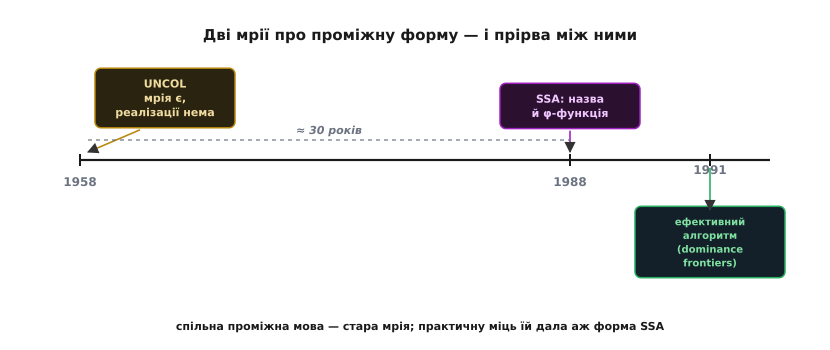

# 📜 Мрія про спільну мову: від UNCOL до φ-функції

Є ідеї, які приходять зарано. Хтось ясно бачить розв'язок, формулює його чітко, публікує — а світ навколо ще не доріс до того, щоб ту ідею втілити. Вона лягає в архів як гарне креслення без матеріалів, з яких її можна було б збудувати. І чекає — інколи десятиліттями, — поки технології дозріють і хтось інший візьме те саме креслення, тільки вже з правильним інструментом у руках.

Історія проміжного представлення — це саме така історія, і навіть двічі. Спершу — велика мрія про **одну спільну проміжну мову** для всіх компіляторів світу, сформульована 1958 року з майже математичною ясністю й так до пуття й не втілена. А через тридцять років — тиха, непоказна ідея про те, як **записувати змінні**, що народилася в стінах однієї дослідницької лабораторії й дала проміжному коду ту силу, якої мрія 1958-го так і не дочекалася. Розберімо обидві — бо разом вони показують, як довго інколи йде шлях від «ось розв'язок» до «ось як його зробити».

## Арифметика, що звела всіх з розуму

Щоб відчути, звідки взялася перша мрія, треба перенестися в другу половину 1950-х. Комп'ютери тоді ще не мали спільної архітектури: кожна нова машина — IBM 704, UNIVAC, машини Burroughs — була окремим світом зі своєю системою команд, своїми регістрами, своїм способом адресувати пам'ять. А з іншого боку саме народжувалися перші мови високого рівня: FORTRAN щойно з'явився (1957), на підході були інші. І перед кожним, хто хотів, щоб його мова працювала на кількох машинах, поставала та сама гнітюча арифметика.

Порахуймо. Хай є **N** мов і **M** машин. Щоб кожна мова працювала на кожній машині, потрібен окремий компілятор на кожну пару — а таких пар **N × M**. Три мови на чотири машини — це вже дванадцять компіляторів, кожен пишеться, налагоджується й підтримується окремо. А головне — приріст квадратичний: додав одну нову машину, і мусиш написати компілятори з **усіх** N мов у неї одразу. Додав одну нову мову — компілятори з неї в **усі** M машин. Кожен новий гравець тягне за собою цілий пучок нової роботи. Індустрія бачила, як ця стіна росте, і розуміла: так далі не можна.

Розв'язок, коли його нарешті сформулювали, виявився з того рідкісного ґатунку, що після нього дивуєшся, чому не бачив раніше. А що, як не перекладати кожну мову прямо в кожну машину? Що, як вставити **посередника** — одну проміжну мову, спільну для всіх? Тоді кожна мова перекладається лише в цю проміжну мову — раз. А кожна машина породжується лише з цієї проміжної мови — теж раз. Замість N × M окремих перекладачів виходить **N + M**: по одному «передньому» перекладачеві на кожну мову й по одному «задньому» на кожну машину. Квадрат перетворюється на суму. Три мови й чотири машини — це вже не дванадцять компіляторів, а сім частин.

> 🔧 **Навіщо це.** Та сама арифметика керує будовою компіляторів і сьогодні — просто мрію 1958-го врешті реалізували, тільки в кожного вендора по-своєму. Коли той самий GCC збирає C і під восьмибітний AVR, і під ARM усередині ESP32, і під ваш ноутбук — це не три компілятори, а один, у якого над спільною проміжною формою навішано три «задні» частини. Ідея посередника, що зводить N × M до N + M, — не абстракція з підручника, а причина, з якої взагалі можливо мати один зрілий компілятор на десятки різних чіпів.

## Комітет SHARE і людина, яка дала мрії ім'я

Тут історія роздвоюється на два майже одночасні джерела, і їх варто розрізняти, бо їх часто плутають.

Перше джерело — **SHARE**, група користувачів комп'ютерів IBM (одне з найперших об'єднань такого штибу в історії обчислень). Усередині SHARE зібрався *ad-hoc* комітет з універсальних мов, і його учасники — Джозеф Стронг (Joseph Strong), Джон Вегстайн (John Wegstein), Ерроу Триттер (Aaron Tritter), Ян Ольштин (Jan Olsztyn), Оуен Мок (Owen Mock) і Томас Стіл (Thomas Steel) — 1958 року опублікували працю з довгою, але точною назвою: **«Проблема програмного зв'язку з машинами, що змінюються: пропонований розв'язок»** (*The Problem of Programming Communication with Changing Machines: A Proposed Solution*). Вона вийшла двома частинами в журналі *Communications of the ACM* — у серпневому й вересневому числах 1958 року. Уже сама назва б'є в саму суть проблеми: машини **змінюються**, а програмний зв'язок з ними доводиться щоразу лагодити наново.

Друге джерело — **Мелвін Конвей** (Melvin Edward Conway), тоді молодий дослідник у Кейзькому технологічному інституті (Case Institute of Technology — самостійний тоді заклад у Клівленді, що аж 1967 року злився з Університетом Вестерн-Резерв у нинішній Case Western Reserve University). Того ж 1958 року, у жовтневому числі того самого *Communications of the ACM* (том 1, число 10), Конвей надрукував статтю з короткою й дзвінкою назвою — **«Пропозиція UNCOL»** (*Proposal for an UNCOL*). Саме він дав мрії те ім'я, під яким вона ввійшла в історію.

**UNCOL** — це **UN**iversal **C**omputer **O**riented **L**anguage, універсальна машинно-орієнтована мова. Ім'я передає задум точно: мова не для людини (не «проблемно-орієнтована», як FORTRAN), а орієнтована на **машину** — проміжна, спільна для всіх, у яку компілятор перекладає будь-яку вхідну мову й з якої породжує код будь-якої машини. Той самий посередник, та сама арифметика N + M — але тепер з іменем, під яким про нього можна говорити.

> 🔧 **Навіщо це.** Мелвін Конвей увійшов в історію обчислень не лише UNCOL. Через десять років, 1968-го, він сформулював те, що згодом назвуть **законом Конвея** (Conway's Law): організації, які проєктують системи, приречені відтворювати в цих системах структуру власного спілкування. Стаття називалася «Як комітети винаходять?» (*How Do Committees Invent?*). Іронія долі: людина, яка запропонувала спільну проміжну мову як спосіб не дублювати роботу, згодом пояснила світові, чому великі організації **все одно** дублюють структуру своїх відділів у структурі свого коду. Обидва спостереження — про те, як влаштована праця над складними системами.

## Чому мрія не збулася

Ось у чому гіркота цієї частини історії: UNCOL так і не постав. Не тому, що ідея була хибна — вона була бездоганна, і час це довів. А тому, що її не було з чого збудувати.

UNCOL ніколи не був **повністю специфікований** — не існувало документа, який казав би точно, з яких команд ця мова складається, як саме вони поводяться, як записуються. Радше це була **концепція**, ніж мова: усі погоджувалися, що така мова *мала б* існувати, і навіть приблизно розуміли, якою вона *мала б* бути, — але звести це до працездатного, повного визначення так і не вдалося. А без повного визначення нема чого реалізовувати: не можна написати переклад «у UNCOL», якщо ніхто не домовився, що таке UNCOL.

Причина глибша за брак старанності. На межі 1950–60-х сама **теорія й техніка компіляторів ще не дозріли**. Багато з того, що для UNCOL було конче потрібне, доводилося б винаходити з нуля: як спроєктувати проміжну мову настільки нейтральну, щоб у неї добре лягала і числова FORTRAN-математика, і геть інакший COBOL; як розкласти складні мовні конструкції на прості проміжні кроки, не втративши того, що знадобиться на іншому кінці для якісного коду; навіть такі приземлені речі, як спільне кодування символів чи техніки «розкрутки» (bootstrapping) компілятора самого через себе. Кожен із цих шматків згодом стане окремою зрілою галуззю — але тоді їх просто не існувало. UNCOL вимагав, щоб уся ця машинерія була готова заздалегідь, а її ще не було.

І тут — найважливіша й найчесніша деталь усієї цієї історії, варта того, щоб її не забути. За UNCOL бралися **найкращі уми** тодішньої інформатики, знову й знову, роками. І щоразу вона виявлялася для них заскладною. Це не історія про геніальну ідею, яку злі обставини не дали втілити невдахам, — це історія про геніальну ідею, об яку розбивалися саме генії, бо фундамент під нею ще не був закладений.


*Дві мрії про проміжну форму. **1958** — UNCOL: спільну проміжну мову ясно сформульовано, але техніка компіляторів ще не дозріла, і мова лишається радше концепцією. **1988** — форма SSA дістає назву й φ-функцію. **1991** — з'являється ефективний алгоритм її побудови. Між першою мрією й тим, що дало проміжному коду справжню силу, — близько тридцяти років.*

Мрія, однак, не вмерла — вона перевтілилася. Сама ідея спільної проміжної мови виявилася настільки правильною, що проросла в десятках місць під іншими іменами. **P-код** мови UCSD Pascal у 1970-х — проміжна форма, яку виконувала маленька віртуальна машина, щоб той самий Pascal ішов на різному залізі. Пізніше — байткод Java й формат ANDF (*Architecture Neutral Distribution Format*, «нейтральний до архітектури формат поширення»). Усе це — діти тієї самої мрії 1958-го: узяти складну вхідну мову, звести до спільної проміжної форми, а вже з неї йти на будь-яку машину. Докладніше про те, як ця ж ідея живе в сучасних віртуальних машинах, — у темі про [байткод і віртуальну машину](root:sf-lang/bytecode-vm). Саме́ слово «UNCOL» стало загальною назвою для будь-якої такої універсальної проміжної мови — пам'ять про мрію, вплетена в саму термінологію.

## Друга мрія: як записувати змінні

Тепер — уперед на тридцять років, у зовсім інший сюжет. Він не про те, як зв'язати багато мов і машин, а про куди тоншу річ: **як усередині компілятора записувати значення змінних**, щоб над кодом було легко міркувати. На перший погляд — дрібниця, технічна деталь. Насправді — те, що врешті дало проміжному коду ту аналітичну силу, заради якої він і потрібен.

Проблема ось у чому. У звичайному коді одне й те саме ім'я змінної можна перезаписувати скільки завгодно разів:

```
x = a + 1
...
x = b · 2       // те саме ім'я x, уже інше значення
y = x + 3       // яке саме «x» тут мається на увазі?
```

Коли компілятор хоче щось довести про програму — скажімо, «це значення ніде далі не вживається, його можна викинути» або «ось це обчислення повторюється, порахуймо його раз», — він мусить для кожного вживання імені простежити, **яке саме присвоєння** сюди дійшло. А якщо між присвоєнням і вживанням є розгалуження, цикли, злиття гілок — ця нитка розплітається на десятки можливих історій, і аналіз тоне в них.

Рятівна ідея проста до нахабності: **заборонити перезапис**. Хай кожне ім'я записується **рівно один раз** за весь код. Замість перезаписувати `x`, заводимо нові версії — `x₁`, `x₂`, `x₃` — по одній на кожне присвоєння:

```
x₁ = a + 1
...
x₂ = b · 2
y₁ = x₂ + 3     // тепер очевидно: це саме x₂, іншого й бути не може
```

Тепер, побачивши будь-яке ім'я, компілятор **одразу** знає єдине місце, де воно народилося, — простежувати нема чого. Це і є **форма статичного одноразового присвоєння** (*static single-assignment form*, SSA): у ній кожне ім'я має рівно одну точку народження на весь код. Слово «статичного» тут важливе: ідеться про **текст** програми, а не про виконання. У циклі рядок `x₁ = …` фізично виконається багато разів — але в **записі** коду присвоєння `x₁` стоїть в одному-єдиному місці. Одне присвоєння на ім'я в тексті — не в часі.

## Проблема на злитті й пранк, що став стандартом

Тільки-но заборонили перезапис, ідея впирається в стіну там, де **шляхи сходяться**. Розгляньмо просте розгалуження:

```
if (щось)   x₁ = a;      // прийшли сюди — актуальне x₁
else        x₂ = b;      // прийшли сюди — актуальне x₂
y = ???                  // яке з двох? залежить, звідки ми прийшли
```

У блоці, куди сходяться обидві гілки, значення прийшло **по одній з них** — але по якій саме, статично, дивлячись лише на текст, не скажеш. Довелося б порушити щойно введене правило й дозволити двом присвоєнням одного імені. Уся краса розсипалася б на першому ж `if`.

Розв'язок, який знайшли, елегантний саме своєю відвертою штучністю. У блок злиття ставлять особливу псевдо-операцію, що «вибирає» значення залежно від того, з якої гілки виконання сюди дісталося:

```
x₃ = φ(x₁, x₂)    // прийшли гілкою then → x₁; гілкою else → x₂
y₁ = x₃ + 1       // далі — одне чисте ім'я x₃
```

Оцю операцію-вибирач назвали **φ-функцією** (грецька літера «фі»). І ось тут — одна з найкращих історій про те, як народжуються назви в інформатиці. Ця «функція» — насправді **не** функція й **не** машинна команда: жоден процесор такого не вміє. Це суто службова фікція, підказка самому компіляторові, звідки взялося значення. Автори спершу так її подумки й називали — *phony function*, «фальшива функція», «пранк-функція». Але «phony function» — не та назва, з якою поважна наукова стаття піде у світ. І тоді один з авторів, **Баррі Розен** (Barry Rosen), обрав грецьке «φ» — звучить як «phi», перегукується з «phony», але виглядає солідно й математично. Пранк-назву протягли повз рецензентів під грецькою маскою. Так «фальшива функція» стала φ-функцією — і під цим іменем увійшла в кожен серйозний компілятор світу.

Перед тим як згенерувати справжній машинний код, усі φ «розчиняють» назад у звичайні присвоєння на кінцях відповідних гілок — бо процесор φ не виконає. SSA — це форма **для аналізу**: у ній міркують про програму, а на виході з неї виходять.

## Уотсонівська лабораторія: хто і коли

Тепер — хто це зробив, коли й де, бо тут важлива кожна деталь.

Місце дії — **дослідницький центр IBM імені Томаса Дж. Уотсона** (T. J. Watson Research Center) під Нью-Йорком, кінець 1980-х. Тамтешні дослідники працювали над проєктом **PTRAN** (*Parallel TRANslator*) — системою, що автоматично перекроювала послідовні FORTRAN-програми під паралельне виконання. Щоб таке робити, треба дуже глибоко розуміти, як у програмі течуть дані: що від чого залежить, що можна робити водночас. Саме з цієї потреби — точно бачити потік даних — і виросла форма SSA. Це важлива деталь: SSA народилася не як самоціль, а як інструмент, потрібний для конкретної задачі про паралелізм.

Ключова публікація вийшла 1988 року на симпозіумі POPL (*Principles of Programming Languages*). Стаття називалася **«Глобальні номери значень і надлишкові обчислення»** (*Global Value Numbers and Redundant Computations*), а її авторами були **Баррі Розен** (Barry K. Rosen), **Марк Веґман** (Mark N. Wegman) і **Кеннет Задек** (F. Kenneth Zadeck). Саме в ній уперше з'явилися і **назва** «static single-assignment form», і **φ-функція** в її нинішньому вигляді, і демонстрація оптимізації, що спирається на цю форму. Це той самий момент, коли розрізнені попередні напрацювання зібралися в іменовану, викінчену форму.

Бо попередні напрацювання були. SSA не впала з неба — це вершина довгого ланцюга ідей. Ще 1970 року Шапіро й Сейнт (Shapiro, Saint) думали над тим, де саме в програмі треба ставити псевдоприсвоєння на злиттях. 1978-го Райф (John Reif) дав алгоритм розстановки таких псевдоприсвоєнь обходом дерева домінування. У середині 1980-х з'явилися «місця народження» змінних (*birthpoints*) укупі з переіменуванням, що робило кожне присвоєння окремим, — і алгоритм пошуку цих місць спирався на роботи Райфа й Тар'яна (Robert Tarjan). Розен, Веґман і Задек стали на плечі всього цього — і дали формі остаточну назву та φ.


*SSA — не один винахід, а ланцюг ідей завдовжки понад двадцять років. Питання «де ставити псевдоприсвоєння на злиттях» ставили ще від 1970-х; розстановку через дерево домінування дав Райф 1978-го; «місця народження» змінних дозріли в середині 1980-х. Розен, Веґман і Задек 1988 року зібрали це в іменовану форму з φ-функцією, а стаття 1991-го дала швидкий алгоритм побудови. Кожна віха стоїть на плечах попередньої.*

## Останній камінь: домінантні межі

Іменована форма — це половина справи. Лишалося головне практичне питання: **де саме** розставляти φ-функції? Наївна відповідь — «ставмо φ у кожному блоці злиття для кожної змінної» — дає купу зайвих φ там, де жодної двозначності насправді нема, і роздуває код. А точна ручна розстановка складна. Без **швидкого й економного** алгоритму SSA лишалася б гарною теорією, як колись UNCOL.

Цей камінь ліг на місце 1991 року. Розен, Веґман і Задек об'єдналися з ще двома дослідниками з того самого кола — **Роном Сайтроном** (Ron Cytron) і **Жанною Ферранте** (Jeanne Ferrante) — і випустили статтю, назва якої вже стала класичною: **«Ефективне обчислення форми статичного одноразового присвоєння та графа керувальних залежностей»** (*Efficiently Computing Static Single Assignment Form and the Control Dependence Graph*), *ACM Transactions on Programming Languages and Systems*, том 13, число 4, жовтень 1991, сторінки 451–490.

Ключем став точний математичний критерій — **домінантна межа** (*dominance frontier*). Інтуїція за ним така. Кажуть, що блок A **домінує** блок B, якщо будь-який шлях від входу програми до B неминуче проходить через A — тобто до B не дістатися, оминувши A. Тепер: домінантна межа блоку A — це ті блоки, до яких вплив A «щойно перестає бути неминучим». Формально — блок Y такий, що A домінує *якогось попередника* Y, але не домінує сам Y (не рахуючи випадку, коли Y — це A). Простими словами: домінантна межа — це рівно ті точки, де шлях, що йшов через A, зливається з іншим шляхом, який A **оминув**. А злиття двох шляхів — це якраз місце, де могли зустрітися два різні значення однієї змінної. Тобто **домінантна межа точно вказує, де потрібна φ-функція**.

Алгоритм звівся до чіткого рецепта: для кожної змінної береш усі блоки, де вона присвоюється, і рахуєш їхню домінантну межу (з повторенням, поки нові φ самі не породжують нові місця для φ). Виходить **мінімальна** розстановка — φ рівно там, де вони справді потрібні, і ніде більше. Оце й перетворило SSA з красивого поняття на практичний, швидкий, застосовний інструмент.

## Дві мрії, один урок

Складімо обидві історії поряд — і проступить те, заради чого їх варто було розповісти разом.

**Перша мрія** — UNCOL, 1958 — була про **велике зовнішнє**: як зв'язати всі мови й усі машини через одного посередника. Ідея бездоганна, сформульована рано й ясно, — і не втілена, бо фундамент під нею ще не був закладений. Найкращі уми розбивалися об неї роками.

**Друга мрія** — SSA, 1988–1991 — була про **мале внутрішнє**: як записати змінні всередині проміжного коду, щоб над ним було легко міркувати. Куди скромніша на позір ідея — і саме вона дала проміжному представленню ту аналітичну силу, без якої мрія 1958-го лишалася б красивою схемою. Бо спільний посередник вартий чогось лише тоді, коли над ним можна **потужно оптимізувати**, — а це вміння дала саме SSA.

І тут дві історії стуляються в одну. Сьогодні на SSA-подібному проміжному коді тримаються майже всі серйозні компілятори — і GCC, і [LLVM](root:sf-lang/llvm-clang), чия проміжна мова від початку побудована як SSA. А LLVM — це водночас і найповніше втілення тієї **першої** мрії: справжній спільний посередник, у який перекладаються десятки мов і з якого породжується код десятків архітектур. Виходить, обидві мрії зустрілися в одному місці. Стара мрія про N + M нарешті збулася — але збулася по-справжньому лише тому, що дочекалася другої, тихої мрії про те, як записувати змінні. Ідея, що прийшла зарано, дочекалася ідеї, якої їй бракувало.

**Статус доказовості: усталено.** Дати, імена й публікації підтверджені первинними та зведеними джерелами. UNCOL: концепцію запропонував *ad-hoc* комітет SHARE, праця «The Problem of Programming Communication with Changing Machines» вийшла в *Communications of the ACM* двома частинами (серпень і вересень 1958); ім'я «UNCOL» дав Мелвін Конвей у статті «Proposal for an UNCOL» (*CACM*, том 1, число 10, жовтень 1958), яку він написав у Кейзькому технологічному інституті. UNCOL так і не був повноцінно специфікований чи реалізований — це усталений факт. SSA: назву «static single-assignment form» і φ-функцію ввели Розен, Веґман і Задек у праці «Global Value Numbers and Redundant Computations» (POPL 1988) у дослідницькому центрі IBM ім. Уотсона; ефективний алгоритм побудови через домінантні межі дали Сайтрон, Ферранте, Розен, Веґман і Задек у статті «Efficiently Computing Static Single Assignment Form and the Control Dependence Graph» (*ACM TOPLAS*, том 13, число 4, жовтень 1991). Походження назви «φ» від «phony function» (вибір Баррі Розена задля «публікабельнішого» вигляду) засвідчене самими учасниками; попередній ланцюг ідей (Shapiro-Saint 1970, Reif 1978, birthpoints середини 1980-х) наведено за оглядовою літературою про розвиток SSA.
