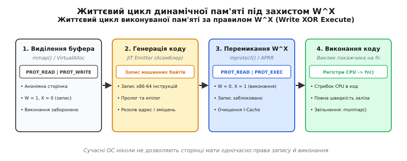
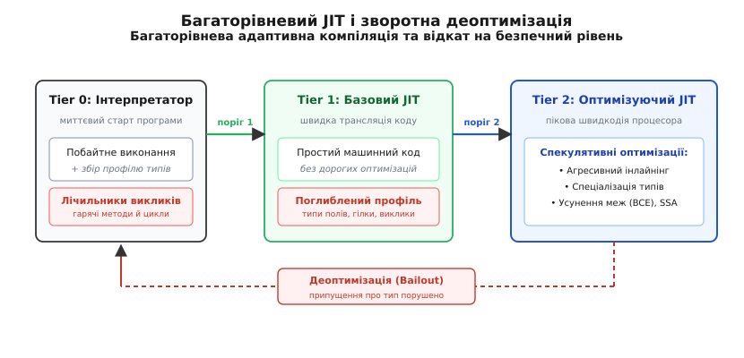
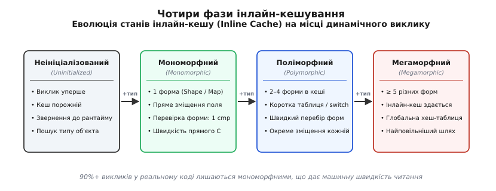
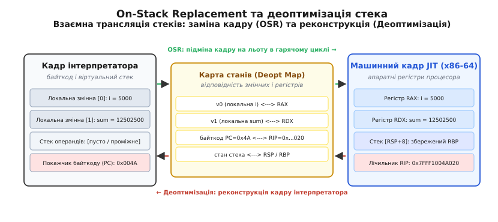

# JIT-компіляція: машинний код, породжений під час виконання

<preknowlist>
- [Байткод і віртуальна машина](topic:sf-lang/bytecode-vm) — виконання проміжного коду на стековій чи регістровій машині та накладні витрати циклу диспетчеризації інструкцій.
- [Оптимізації компілятора](topic:sf-lang/compiler-optimizations) — SSA-форма, інлайнінг, усунення мертвого коду та спекулятивні перетворення.
- [Карта пам'яті](topic:hw-arch/memory-map) — сторінки віртуальної пам'яті, права доступу (R/W/X) та політика безпеки W^X.
- [ABI та calling convention](topic:sf-lang/abi-calling-convention) — регістровий розподіл, конвенції викликів та структура стекового кадру.
</preknowlist>

Коли інтерпретатор виконує цикл на 100 мільйонів ітерацій для обчислення суми властивостей об'єктів `sum += point.x`, центральний процесор витрачає від 85% до 95% тактів не на додавання чисел, а на обслуговування самого інтерпретатора. На кожному кроці циклу віртуальна машина зчитує черговий байт команди, виконує непрямий перехід через таблицю `switch(opcode)` (що руйнує передбачення переходів у конвеєрі CPU), дістає операнди з віртуального стека в оперативній пам'яті, перевіряє динамічні типи, шукає зміщення поля `x` у геш-таблиці властивостей і запаковує результат назад у динамічний дескриптор. Реальна арифметика займає одну апаратну інструкцію `add`, але навколо неї виконуються десятки службових інструкцій розбору байткоду.

Попереднє статичне компілювання (AOT, *Ahead-Of-Time*, англ. «заздалегідь») генерує бездоганний машинний код для C++ або Rust, де типи та розміри структур зафіксовані на етапі збирання. Проте для динамічних мов (JavaScript, Python, Ruby) або динамічного завантаження класів у Java та .NET такий підхід стикається з фундаментальною перешкодою: компілятор наперед не знає, які саме типи даних потраплять у функцію, чи буде перевизначено метод у процесі роботи і які властивості матиме об'єкт.

Розв'язанням цієї дилеми є **JIT-компіляція** (*Just-In-Time compilation*, англ. «компіляція саме вчасно», динамічна компіляція) — технологія, за якої проміжне подання програми (байткод або абстрактне синтаксичне дерево) транслюється в рідні машинні інструкції процесора безпосередньо під час її виконання, спираючись на фактичну поведінку та типи даних, зафіксовані профілювальником.

## Механізми виділення та виконання коду: безпека W^X

Звичайні компілятори створюють двійкові файли у форматі ELF або PE на диску, які завантажувач операційної системи монтує у фіксовані сегменти віртуальної пам'яті: сегмент коду `.text` отримує права на читання та виконання, а сегменти даних `.data` та стек — права на читання й запис. JIT-компілятор зобов'язаний створювати новий машинний код прямо всередині оперативної пам'яті працюючого процесу.

Виділення пам'яті через стандартні функції `malloc()` або оператор `new` для цього не підходить. Сторінки купи розмічаються ядром із правами `PROT_READ | PROT_WRITE` (читання та запис). Якщо передати вказівник на такий буфер у регістр лічильника інструкцій `RIP`/`PC`, блок керування пам'яттю (MMU) апаратно перехопить спробу вибірки команди й операційна система негайно завершить процес аварійним сигналом `SIGSEGV` або винятком `STATUS_ACCESS_VIOLATION`.

### Принцип W^X (Write XOR Execute)

Сучасні операційні системи (Linux із модулями SELinux/PaX, Windows із механізмом DEP, macOS із Hardened Runtime) реалізують апаратний захист **W^X** (*Write XOR Execute*, «запис виключає виконання»). Пам'ять процесу може бути або доступною для запису, або доступною для виконання, але ніколи обома одночасно:

```
(Права = Запис)  XOR  (Права = Виконання)
```

Цей принцип захищає систему від атак типу переповнення буфера та впровадження довільного шелкоду (*shellcode*). Для JIT-компілятора це вимагає чіткого чотирифазного протоколу керування віртуальними сторінками:

1. **Виділення анонімної сторінки:** JIT запитує в ядра операційної системи окремі сторінки пам'яті через системний виклик `mmap()` (у POSIX) із прапорцями `PROT_READ | PROT_WRITE` та `MAP_ANONYMOUS | MAP_PRIVATE` або `VirtualAlloc()` (у Windows) із прапорцем `PAGE_READWRITE`.
2. **Емісія машинного коду:** Компілятор записує двійкові байти інструкцій цільового процесора (наприклад, x86-64 або ARM64) у виділену пам'ять.
3. **Перемикання прав доступу:** Системним викликом `mprotect(addr, size, PROT_READ | PROT_EXEC)` (або `VirtualProtect` із `PAGE_EXECUTE_READ`) сторінка переводиться в режим «тільки для читання й виконання». Будь-яка подальша спроба змінити байти в цьому буфері викличе апаратне виключення.
4. **Скидання кешу інструкцій (Instruction Cache Coherency):** Процесори сучасної архітектури мають розділені кеші першого рівня: кеш даних (*D-Cache*) і кеш інструкцій (*I-Cache*). Коли компілятор записував байти коду, вони осіли в D-Cache. Щоб конвеєр процесора під час вибірки команд не прочитав застарілі дані з I-Cache, JIT зобов'язаний виконати системну інструкцію скидання кешу, наприклад `__builtin___clear_cache()` у GCC/Clang або `sys_icache_invalidate()` на архітектурах ARM.
5. **Виклик коду:** Адреса буфера зводиться до покажчика на функцію відповідно до цільової угоди про виклики ([ABI та calling convention](topic:sf-lang/abi-calling-convention)), після чого процесор здійснює прямий стрибок на згенеровані інструкції.


*Послідовне перемикання прав сторінки від запису до виконання унеможливлює виконання небезпечного коду*

На сучасних процесорах Apple Silicon (архітектура ARM64 під macOS) захист реалізовано ще жорсткіше через апаратні регістри захисту APRR (*Access Protection of Resource Registers*). Сторінки JIT виділяються зі спеціальним прапорцем `MAP_JIT`, а перемикання прав між записом та виконанням здійснюється безпосередньо з простору користувача за лічені наносекунди через виклик `pthread_jit_write_protect_np()`, що уникає дорогих системних викликів до ядра.

> ⚙️ **Поряд — практична вставка:** [реалізація мініатюрного JIT-рушія з W^X та динамічною генерацією x86-64](topic:sf-lang/jit-compilation/proj-jit-engine.md) — повний робочий код мовами C та C++, який демонструє ручне виділення сторінок через `mmap`/`VirtualAlloc`, кодування асемблерних інструкцій x86-64, перемикання захисту W^X та безпечний виклик скомпільованої функції.

## Багаторівнева архітектура (Tiered Compilation)

Компіляція коду не є безкоштовною: оптимізуючий компілятор витрачає процесорний час на побудову проміжного графа SSA (*Static Single Assignment*), аналіз потоків керування, розміщення змінних у регістрах (*Register Allocation*) та векторизацію. Якщо компілювати весь вихідний текст оптимізуючим JIT у момент запуску програми, користувач зіткнеться з величезною затримкою старту (*startup latency*), хоча 90% коду виконається лише один раз під час ініціалізації.

Сучасні віртуальні машини (HotSpot JVM, Google V8, .NET Core RyuJIT) використовують **багаторівневу компіляцію** (*Tiered Compilation*), яка поєднує кілька рушіїв виконання з різним балансом швидкості компіляції та якості генерованого коду.


*Програма стартує в інтерпретаторі й поступово просувається до оптимізуючого JIT через систему лічильників гарячих точок*

### Рівні виконання (Tiers)

1. **Tier 0: Інтерпретатор (Interpreter).** Забезпечує миттєвий старт програми без пауз на трансляцію. У JVM це шаблонний інтерпретатор (*Template Interpreter*), у Google V8 — інтерпретатор *Ignition*. Одночасно інтерпретатор збирає статистику: які типи передаються у функції, які гілки `if/else` вибираються найчастіше та скільки разів викликався кожен метод.
2. **Tier 1: Базовий JIT (Baseline / Quick Compiler).** У JVM це клієнтський компілятор *C1* (без профілювання або з базовим профілюванням), у V8 — компілятори *Sparkplug* та *Maglev*. Базовий JIT здійснює лінійний однопрохідний переклад байткоду в машинний код майже без оптимізацій. Він компілює код за частки мілісекунди, що зменшує навантаження на інтерпретатор у 3–5 разів і продовжує накопичувати детальний профіль типів.
3. **Tier 2: Оптимізуючий JIT (Optimizing Compiler).** У JVM це серверний компілятор *C2* або *GraalVM*, у V8 — *Turbofan*, у .NET — *RyuJIT*. Сюди потрапляє лише невеликий відсоток найбільш навантаженого коду. Оптимізуючий компілятор застосовує дорогі глобальні оптимізації та спекулятивну спеціалізацію, створюючи машинний код, що за швидкістю конкурує з програмами на C та C++.

### Виявлення гарячих точок (Hotspot Detection)

Перехід методу на наступний ярус компіляції визначається двома лічильниками, вбудованими в кожну функцію:
- **Лічильник викликів методу** (*Invocation Counter*) — збільшується на одиницю при кожному вході у функцію.
- **Лічильник зворотних переходів циклу** (*Backedge Counter*) — інкрементується щоразу, коли тіло циклу повертається на початок чергової ітерації.

Коли сума лічильників перевищує встановлений поріг (наприклад, 10 000 викликів у JVM C2), віртуальна машина ставить метод у чергу фонової JIT-компіляції. Поки фоновий потік компілятора генерує машинний код, основні потоки продовжують виконувати функцію в інтерпретаторі або базовому JIT без жодного блокування. Щойно машинний код готовий, віртуальна машина атомарно підміняє покажчик точки входу методу на адресу скомпільованого блоку.

### Компіляція методів (Method JIT) проти компіляції трас (Trace JIT)

За фундаментальною одиницею трансляції JIT-компілятори поділяються на два класи:

| Властивість | Компілятор методів (Method JIT) | Трасувальний компілятор (Trace JIT) |
| :--- | :--- | :--- |
| **Одиниця компіляції** | Метод або функція цілком разом із усіма її гілками | Лінійна послідовність виконаних інструкцій циклу (*Trace*) |
| **Представники** | HotSpot (C1/C2), V8 (Turbofan), .NET RyuJIT | LuaJIT 2, PyPy Trace JIT, SpiderMonkey TraceMonkey |
| **Обробка розгалужень** | Будує повний граф потоку керування (CFG) | Фіксує лише фактично пройдену гілку; інші гілки стають виходами (*guards*) |
| **Переваги** | Ефективний на складному об'єктному коді з багатьма методами | Надзвичайно прості оптимізації лінійного коду, мінімальний розмір JIT |
| **Слабкі місця** | Дорогий аналіз усього графа функцій | Деградація швидкості при частих змінах напрямку гілок (*trace explosion*) |

> 📜 **Поряд — історична вставка:** [від Smalltalk і Self до HotSpot та V8: як народилася динамічна компіляція](topic:sf-lang/jit-compilation/hist-dynamic-translation.md) — історія проривів Пітера Дойча, Девіда Унгара, Урса Гельцле та Ларса Бака, які перетворили повільні динамічні мови на основу сучасного вебу та серверної інфраструктури.

## Спекулятивні оптимізації під час виконання

Головна перевага JIT-компілятора над класичним статичним транслятором полягає в тому, що він бачить реальні дані під час виконання. Статичний компілятор зобов'язаний бути консервативним: якщо теоретично існує ймовірність, що вказівник може бути нульовим або метод може бути перевизначений, він мусить згенерувати повний код динамічної перевірки.

JIT-компілятор діє **спекулятивно** (лат. *speculari* — спостерігати, робити припущення): він робить оптимістичну ставку на те, що поведінка програми в майбутньому повторюватиме її поведінку в минулому.

### Інлайн-кешування (Inline Caching) та приховані класи

У динамічних мовах звернення до поля `obj.x` є складним процесом: об'єкти реалізовані як динамічні хеш-таблиці або словники ключів. Щоб уникнути пошуку рядка `"x"` у геш-таблиці на кожній операції читання, рушії використовують концепцію **прихованих класів** (в термінології V8 — *Shapes* або *Maps*, у JavaScriptCore — *Structures*). Прихований клас визначає точне зміщення кожного поля у внутрішньому буфері пам'яті об'єкта.

На місці звернення до поля JIT розміщує **інлайн-кеш** (*Inline Cache, IC*), який проходить чотири стани:


*Еволюція місця виклику від першого звернення до оптимізованого машинного читання поля*

```
                 +новий тип                  +новий тип                  ≥ 5 типів
[Неініціалізований] ─────► [Мономорфний] ─────────► [Поліморфний] ──────────► [Мегаморфний]
  (виклик рантайму)       (1 форма об'єкта:         (2-4 форми:               (глобальний
                           1 cmp + прямий MOV)       коротка таблиця)          геш-пошук)
```

1. **Неініціалізований (Uninitialized):** Кеш порожній. Перше звернення викликає службову підпрограму рантайму, яка визначає поточний прихований клас об'єкта `Shape_A` та зміщення поля `+16`.
2. **Мономорфний (Monomorphic):** Місце виклику перезаписується прямими машинними інструкціями. Апаратний код порівнює покажчик класу об'єкта з кешованим `Shape_A`:
   ```
   ; Мономорфний інлайн-кеш для obj.x
   cmp [rdi + 0], Shape_A_ptr   ; перевірка прихованого класу
   jne .call_miss_handler       ; промах -> перехід до рантайму
   mov rax, [rdi + 16]          ; пряме читання з фіксованого зміщення
   ```
   Якщо отримувач має очікувану форму, доступ до поля виконується за один такт процесора як у структурах C. У правильно спроектованих програмах понад 90% викликів лишаються мономорфними.
3. **Поліморфний (Polymorphic):** Якщо через це саме місце коду проходять об'єкти 2–4 різних форм (наприклад, `Point2D` та `Point3D`), JIT генерує коротку таблицю переходів або ланцюжок із кількох перевірок.
4. **Мегаморфний (Megamorphic):** Якщо кількість форм перевищує поріг (зазвичай 4 або 5), кеш перестає розширюватися. Він переходить у мегаморфний стан і делегує пошук глобальній геш-таблиці або системному диспетчеру.

### Спекулятивне розгортання типів (Type Speculation)

Розглянемо додавання двох змінних у JavaScript: `function add(a, b) { return a + b; }`. Специфікація мови вимагає, щоб оператор `+` підтримував додавання 32-бітних цілих, чисел із плаваючою комою подвійної точності, конкатенацію рядків і виклик методів `valueOf()`/`toString()`.

Якщо профілювальник показує, що за перші 10 000 викликів аргументи `a` і `b` завжди були цілими числами (*Smi — Small Integer*), оптимізуючий JIT викидає всю логіку динамічного розбору й компілює функцію у три апаратні інструкції:

```
; Оптимізований спекулятивний доданок
test rdi, 1             ; Перевірка тегу: чи аргумент a є Smi?
jnz  .deoptimize_bailout ; Якщо ні -> деоптимізація
test rsi, 1             ; Перевірка тегу: чи аргумент b є Smi?
jnz  .deoptimize_bailout ; Якщо ні -> деоптимізація
add  rdi, rsi           ; Пряме апаратне додавання в регістрах
jo   .deoptimize_bailout ; Перевірка переповнення (Integer Overflow)
mov  rax, rdi
ret
```

### Агресивний інлайнінг та аналіз витоку (Escape Analysis)

Коли JIT бачить, що виклик методу мономорфний, він застосовує **інлайнінг** (*Inlining*): видаляє інструкцію виклику й вставляє тіло викликаної функції прямо в місце виклику.

Інлайнінг у JIT є каталізатором для інших оптимізацій:
- **Усунення перевірок меж масивів (Bounds Check Elimination, BCE):** Якщо після інлайнінгу видно, що цикл має вигляд `for (int i = 0; i < arr.length; i++) sum += arr[i]`, компілятор математично доводить, що індекс `i` ніколи не вийде за межі `[0, arr.length)`. Всі апаратні інструкції умовного переходу для перевірки `IndexOutOfBoundsException` викидаються з тіла циклу, дозволяючи процесору застосувати SIMD-векторизацію.
- **Аналіз витоку (Escape Analysis) та скалярна заміна (Scalar Replacement of Aggregates):** Якщо функція створює тимчасовий об'єкт `Point p = new Point(x, y)`, JIT перевіряє, чи посилання на `p` не передається в інші потоки і не зберігається в глобальних структурах. Якщо об'єкт не «витікає» за межі методу, JIT взагалі **не виділяє пам'ять у купі**: поля `x` і `y` розкладаються безпосередньо по апаратних регістрах CPU, зводячи навантаження на збирач сміття до нуля.

## Деоптимізація (Deoptimization / Bailout) та OSR

Спекулятивні оптимізації неминуче стикаються з ситуацією, коли зроблене припущення виявляється хибним. Наприклад, функція `add(a, b)`, скомпільована під 32-бітні цілі числа, на 1 000 001-й ітерації отримує аргумент із рухомою комою `3.14` або рядок `"px"`.

Скомпільований машинний код не має права повернути неправильний результат або завершитися аварійно. Для обробки таких випадків реалізовано механізм **деоптимізації** (*Deoptimization*, або *Bailout*).


*Трансляція апаратного стекового кадру JIT у віртуальний кадр інтерпретатора за допомогою карти деоптимізації*

### Механіка процесу деоптимізації

1. **Спрацювання варти (Guard Failure):** Машинний код виконує інструкцію перевірки типу або діапазону. Якщо умова не виконана, процесор переходить на гілку відкату (*bailout stub*).
2. **Зупинка в точці безпеки (Safepoint):** Кожен машинний блок JIT супроводжується метаданими — **картою деоптимізації** (*Deopt Map / Scope Info*), яку компілятор генерує під час побудови коду. Ця таблиця точно описує, яке значення байткоду відповідає кожному апаратному регістру CPU та зміщенню машинного стека в даній точці.
3. **Реконструкція стека інтерпретатора:** Рантайм виділяє в пам'яті стандартний стековий кадр інтерпретатора. Значення з апаратних регістрів (наприклад, `RAX`, `RDX`) записуються у відповідні слоти локальних змінних та стека операндів байткоду.
4. **Передача керування:** Виконання продовжується в інтерпретаторі саме з тієї інструкції байткоду, на якій провалилася спекулятивна перевірка.

Оптимізований машинний код із помилковим припущенням позначається як недійсний і видаляється з кешу коду, а лічильники типу оновлюються, щоб наступного разу компілятор врахував ширший набір типів.

### Заміна коду на стеку (On-Stack Replacement, OSR)

Класична компіляція замінює точку входу функції для наступних викликів. Проте якщо програма складається з одного великого методу `main()`, усередині якого крутиться обчислювальний цикл на мільярд ітерацій, функція `main()` викликається лише один раз. Її лічильник викликів ніколи не досягне порогу JIT.

У цьому випадку спрацьовує лічильник зворотних переходів циклу (*Backedge Counter*). Коли цикл стає гарячим, компілятор запускає процедуру **On-Stack Replacement (OSR)**:
1. JIT компілює спеціальну версію коду, точкою входу якої є не початок функції, а заголовок відповідного циклу.
2. Прямо під час виконання чергової ітерації віртуальна машина призупиняє інтерпретатор.
3. Поточні значення локальних змінних переносяться з віртуального кадру інтерпретатора в регістри та машинний стек процесора.
4. Кадр інтерпретатора замінюється апаратним стековим кадром, і процесор стрибає всередину оптимізованого машинного циклу, не чекаючи завершення функції.

## Інженерні компроміси та економіка JIT

JIT-компіляція не є безумовним виграшем для будь-якої задачі. Вона представляє складний інженерний баланс між часом виконання, споживанням пам'яті та латентністю.

```
Швидкодія
   ▲                                   Пікова продуктивність (Peak Throughput)
   │                                   ┌───────────────────────────────────────►
   │                                  /  (JIT Tier 2: C2 / Turbofan)
   │                                 /
   │                                /
   │    Статичний AOT (C++/Rust)   /
   ├──────────────────────────────/────────────────────────────────────────────►
   │                             /
   │                            /
   │     Інтерпретатор         /
   ├──────────────────────────┘ (Прогрів / Warmup)
   │
   └───────────────────────────────────────────────────────────────────────────► Час роботи
```

### Час прогріву (Warmup Time)

JIT-керованим програмам потрібен час на «прогрів» (*warmup phase*) — період накопичення статистики профілювання та проходження через яруси компіляції.
- **Короткоживучі процеси (CLI-утиліти, лямбда-функції Serverless):** Для задач, що виконуються за 50–200 мілісекунд, JIT є неефективним. Витрати CPU на роботу компілятора перевищують виграш від оптимізованого коду. У цьому сценарії перемагають статичні бінарні файли (Go, Rust) або AOT-компілятори (GraalVM Native Image).
- **Довгоживучі сервери (Web-сервіси, мікросервіси, бази даних):** Після фази прогріву оптимізуючий JIT досягає пікової пропускної здатності (*Peak Throughput*), яка завдяки інлайн-кешуванню, динамічному інлайнінгу та спекулятивній ліквідації розгалужень нерідко наздоганяє і навіть випереджає статичний C++, оскільки використовує особливості профілю конкретного виробничого навантаження.

### Накладні витрати на пам'ять (Memory Footprint)

JIT-середовища споживають значно більше оперативної пам'яті:
1. **Кеш коду (Code Cache):** Буфери пам'яті з виконуваними машинними сторінками займають десятки й сотні мегабайтів.
2. **Вектори зворотного зв'язку (Type Feedback Vectors):** Структури даних із профілями типів для кожного виклику в байткоді.
3. **Структури даних компілятора:** Побудова SSA-графів, матриць конфліктів інтервалів життя змінних під час розподілу регістрів вимагають значних обсягів тимчасової пам'яті.

> 🔧 **Навіщо це в реальній розробці.** Розуміння механізмів JIT дозволяє писати високопродуктивний код динамічними мовами:
> - **Зберігайте мономорфізм:** Не передавайте в одну функцію або масив об'єкти з різними наборами полів (різними *Shapes*). Мономорфний код працює з апаратною швидкістю прямого читання пам'яті, тоді як перехід у мегаморфний стан сповільнює доступ у 10–50 разів.
> - **Уникайте динамічної зміни структури об'єктів (Monkey-patching):** Додавання нових полів до об'єкта після його ініціалізації розриває прихований клас (*Shape transition*) і скидає оптимізовані інлайн-кеші. Ініціалізуйте всі поля об'єкта в конструкторі в одному й тому самому порядку.
> - **Стережіться деоптимізаційних пасток:** Зміна типу змінної всередині критичного циклу (наприклад, додавання числа з плаваючою комою до цілочисельного лічильника) викликає постійний відкат у деоптимізацію (*deopt loop*), знищуючи продуктивність.

JIT-компіляція перетворила віртуальні машини з простих емуляторів байткоду на адаптивні операційні середовища. Поєднуючи спостереження за реальними типами в рантаймі з апаратними можливостями сучасних мікропроцесорів, JIT створює машинний код найвищої ефективності саме там і тоді, де це найбільше потрібно.
