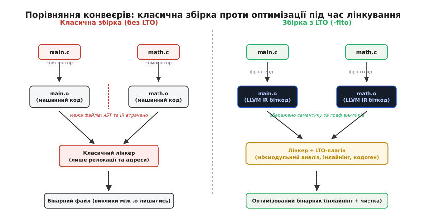
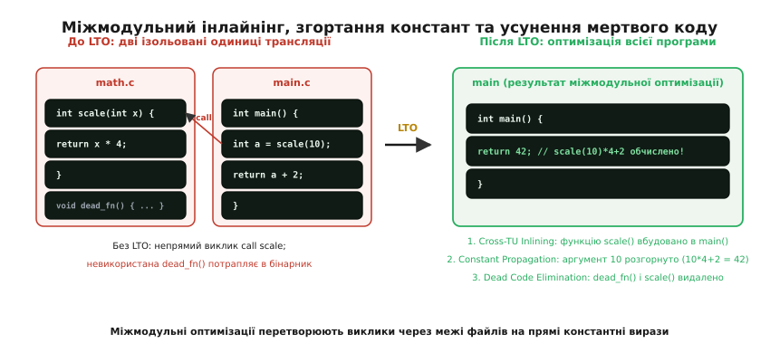
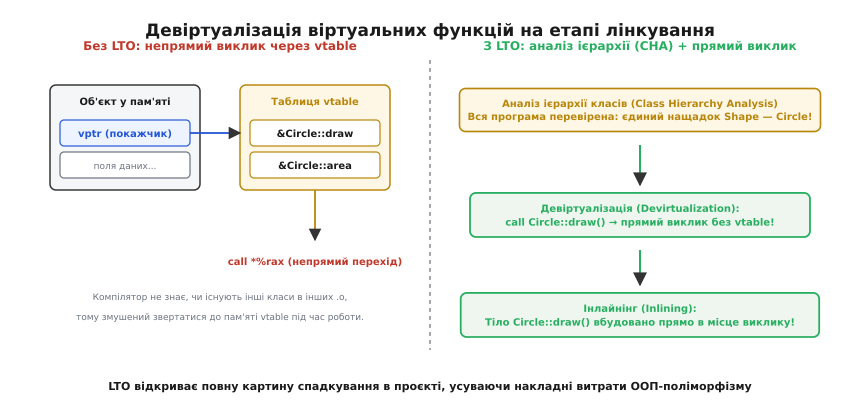
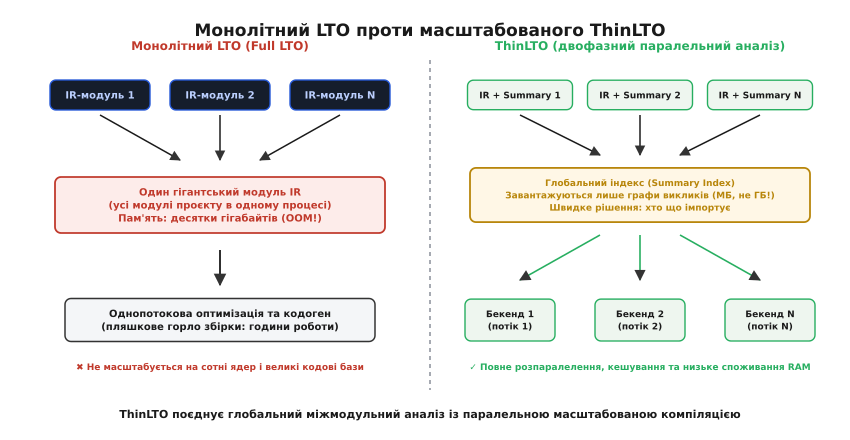

# Оптимізація на етапі лінкування (LTO)

<preknowlist>
- [Одиниця трансляції](topic:sf-lang/translation-unit) — поділ проєкту на окремі вихідні файли (.c/.cpp) та межі видимості static/extern.
- [Лінкування](topic:sf-lang/linking) — розв'язання символів, релокація адрес та об'єднання секцій об'єктних файлів.
- [Проміжне представлення (IR)](topic:sf-lang/intermediate-representation) — машинно-незалежне представлення коду у формі SSA-графів (LLVM IR, GIMPLE).
- [Оптимізації компілятора](topic:sf-lang/compiler-optimizations) — базові перетворення: інлайнінг, згортання констант, усунення мертвого коду.
- [LLVM і Clang](topic:sf-lang/llvm-clang) — архітектура компілятора з розділенням на фронтенд, оптимізатор та кодогенератор.
</preknowlist>

Коли проєкт мовами C чи C++ розбивають на окремі вихідні файли, компілятор обробляє кожен із них як ізольовану [одиницю трансляції](topic:sf-lang/translation-unit). Згенерований машинний код скидається в об'єктний файл `.o`, і на цьому етапі вихідне синтаксичне дерево (AST), типи мови високого рівня, інформація про чистоту функцій та граф потоку керування безповоротно втрачаються. У [ELF-файлі](topic:sf-lang/elf-format) залишаються лише байти машинних інструкцій та таблиці релокацій. Коли класичний [лінкер](topic:sf-lang/linking) зшиває готові шматки в єдиний виконуваний файл, він працює наосліп: він бачить лише адреси й таблиці імен, але не може вбудувати маленьку функцію з сусіднього файла в тіло гарячого циклу чи видалити метод, який насправді ніхто не викликає.

Такий поділ створює болісний архітектурний глухий кут: розробник змушений або виносити реалізацію функцій у заголовкові файли (руйнуючи інкапсуляцію та збільшуючи час кожної перекомпіляції у десятки разів), або миритися з накладними витратами на міжмодульні виклики функцій та віртуальний поліморфізм.

Розв'язанням цієї фундаментальної проблеми є **оптимізація на етапі лінкування** (*Link-Time Optimization, LTO*, англ. *link-time optimization* — «оптимізація під час компонування»), відома також як **оптимізація всієї програми** (*Whole Program Optimization, WPO*, англ. *whole-program optimization*). Замість передчасного скидання сирого машинного коду компілятор зберігає в об'єктних файлах своє багате [проміжне представлення (IR)](topic:sf-lang/intermediate-representation), відкладаючи фінальний глобальний аналіз, інлайнінг та кодогенерацію на момент, коли всі частини програми нарешті зійшлися докупи.


*Зліва — класичний конвеєр: компілятор ізольовано генерує машинний код для кожного файлу, а лінкер лише розставляє адреси без можливості оптимізації. Справа — конвеєр LTO: фронтенд генерує проміжне представлення (IR біткод), а лінкерний плагін запускає глобальний оптимізатор над усією програмою разом.*

### Чому класичний лінкер сліпий між файлами

Щоб зрозуміти, чому звичайний компонувальник не здатний оптимізувати програму, простежмо шлях функції через стандартний компіляторний конвеєр.

Уявімо два файли: у файлі `math.c` визначено невелику математичну функцію `int scale(int x) { return x * 4; }`, а у файлі `main.c` вона викликається як `scale(10)`.

Коли компілятор транслює `main.c`, він бачить лише заголовкове оголошення `int scale(int);`. Компілятор не знає, що містить тіло `scale`, чи має вона побічні ефекти (запис у глобальну пам'ять, системні виклики), і чи повертає завжди детерміноване значення. Тому компілятор зобов'язаний згенерувати стандартну конвенцію виклику ([ABI calling convention](topic:sf-lang/abi-calling-convention)): завантажити аргумент `10` у регістр `%edi`, згенерувати інструкцію `call scale` та записати в секцію релокацій запис `R_X86_64_PLT32` для символу `scale`.

Коли компілятор окремо транслює `math.c`, він генерує повноцінний пролог і епілог функції:
```assembly
scale:
    leal (,%rdi,4), %eax
    ret
```

Коли класичний лінкер береться за ці два `.o` файли, він бачить лише два масиви бінарних байтів. Лінкер:
1. Знаходить адресу початку функції `scale` (наприклад, `0x401120`).
2. Записує цю адресу в поле зміщення інструкції `call` у коді `main`.

Лінкер не може «заінлайнити» `scale` в `main`, тому що машинний код уже згенеровано: регістри розподілено, розмір фрейму стека розраховано, зміщення для стрибків зафіксовано. Перетворення машинних інструкцій назад у граф потоку керування є еквівалентним задачі зворотного інжинірингу і не піддається надійній автоматичній оптимізації без втрати коректності.

### Механізм LTO: біткод усередині об'єктних файлів

Технологія LTO докорінно змінює контракт між компілятором і лінкером. Замість того, щоб перетворювати високорівневий IR на машинний асемблер на етапі трансляції окремого файлу, компілятор діє інакше:

1. Фронтенд компілятора (Clang, GCC) парсить вихідний текст, будує AST і перетворює його на оптимізоване [проміжне представлення](topic:sf-lang/intermediate-representation) — біткод LLVM (`.bc`) або байткод GCC GIMPLE.
2. Цей біткод упаковується у звичайний файл контейнера ELF, Mach-O або COFF (зазвичай у спеціальну секцію, наприклад `.llvmbc` або `.gnu.lto_*`), або файл `.o` повністю формується як файл біткоду.
3. Коли запускається лінкер (`lld`, GNU `gold`, GNU `ld`, `mold` чи Apple `ld64`), він викликає спеціальний **LTO-плагін** (`LLVMgold.so`, `libLTO.dylib` тощо).
4. Плагін перехоплює всі файли з біткодом, завантажує їхні проміжні представлення та об'єднує їх у глобальний контекст.
5. Тепер оптимізатор бачить граф викликів **усієї програми** одночасно. Він проводить міжпроцедурний аналіз, виконує глобальні перетворення, і лише після цього запускає фінальний бекенд кодогенерації для отримання дійсного машинного коду.

> 🔧 **Навіщо це.** Без LTO будь-яка декомпозиція проєкту на окремі `.c`/`.cpp` файли має ціну у швидкодії: компілятор не може прибрати виклики між файлами, не бачить константних параметрів і не може позбутися мертвого коду, оголошеного з зовнішнім зв'язуванням (`extern`). З прапорцем `-flto` архітектурна модульність коду більше не суперечить максимальній швидкодії.

Про те, як ця ідея визрівала від перших дослідницьких експериментів 1980-х років у Стенфорді до сучасних промислових рушіїв, можна прочитати в [історії розвитку LTO](topic:sf-lang/link-time-optimization/hist-lto-origins.md).

### Ключові міжмодульні оптимізації

Коли вся програма представлена як єдиний граф проміжного коду, оптимізатор отримує доступ до перетворень, принципово неможливих під час окремої трансляції.


*Зліва — виклик між двома ізольованими файлами зберігає накладні витрати виклику та тягне зайвий код. Справа — LTO поєднує модулі: функція вбудовується, константний вираз `scale(10)*4+2` повністю обчислюється під час збірки в `42`, а мертва функція видаляється.*

#### 1. Міжмодульний інлайнінг (Cross-TU Inlining)

Інлайнінг є каталізатором для переважної більшості інших компіляторних оптимізацій. Коли тіло функції вбудовується в місце її виклику:
- Зникають інструкції підготовки аргументів, команди `call` та `ret`, збереження й відновлення регістрів у пролозі/епілозі.
- Відкриваються можливості для **глобального поширення констант** (*Interprocedural Constant Propagation, IPCP*): якщо функція викликається з фіксованими значеннями (наприклад, прапорцями конфігурації), неактивні гілки умовної логіки видаляються як мертвий код.
- Стає можливим автовекторизація циклів (SIMD), розгортання циклів (*loop unrolling*) та усунення спільних підвиразів (*Common Subexpression Elimination, CSE*).

#### 2. Усунення мертвого коду на рівні програми (Whole-Program Dead Code Elimination, WPDCE)

У звичайній моделі збірки компілятор не має права видалити функцію, якщо вона не має специфікатора `static`: вона вважається видимою для інших об'єктних файлів (`extern`), які лінкер може підключити пізніше.

Під час LTO, якщо програма збирається як фінальний виконуваний файл (а не динамічна бібліотека), лінкер знає точний список точок входу (наприклад, `main` або функцію старту рантайму `_start`). Усі глобальні функції та змінні, до яких немає шляху в графі досяжності від точки входу, позначаються як локальні та **повністю видаляються** разом з їхніми рядковими літералами та допоміжними таблицями.

#### 3. Девіртуалізація через аналіз повної ієрархії класів (Class Hierarchy Analysis, CHA)

У мовах C++ та Rust поліморфні виклики через покажчики або посилання здійснюються опосередковано: через таблицю віртуальних методів (`vtable`) або таблицю трейтів (*trait object* / *vtable fat pointer*).


*Зліва — звичайний віртуальний виклик: читання vptr з об'єкта, читання адреси методу з vtable у пам'яті, непрямий перехід `call *%rax`. Справа — LTO перевіряє повну ієрархію класів (CHA): знаючи, що єдиний спадкоємець — `Circle`, непрямий виклик перетворюється на прямий або повністю інлайниться.*

Розгляньмо, як це працює в коді:

:::tabs
```c
// Поліморфізм через структури з покажчиками на функції (C)
typedef struct IHandler {
    int (*handle)(void* ctx, int event);
} IHandler;

typedef struct FastHandler {
    IHandler base;
    int multiplier;
} FastHandler;

static int fast_handle(void* ctx, int event) {
    FastHandler* self = (FastHandler*)ctx;
    return event * self->multiplier;
}

int dispatch_event(IHandler* handler, int event) {
    // Непрямий виклик через покажчик — дорожчий за прямий
    return handler->handle(handler, event);
}
```
```cpp
// Поліморфізм через віртуальні класи (C++)
class IHandler {
public:
    virtual ~IHandler() = default;
    virtual int handle(int event) const = 0;
};

class FastHandler final : public IHandler {
private:
    int multiplier_;
public:
    explicit FastHandler(int multiplier) noexcept : multiplier_(multiplier) {}
    int handle(int event) const noexcept override {
        return event * multiplier_;
    }
};

int dispatch_event(const IHandler& handler, int event) {
    // Віртуальний виклик через vtable
    return handler.handle(event);
}
```
:::

Під час локальної компіляції файлу з `dispatch_event` компілятор не знає, скільки спадкоємців `IHandler` існує у проєкті. Можливо, в іншому модулі є ще `SlowHandler` чи `NetworkHandler`. Тому компілятор зобов'язаний згенерувати непрямий перехід: прочитати покажчик `vptr` з об'єкта, зсунутися на індекс методу у `vtable`, завантажити адресу функції та виконати `call *%rax`. Такий непрямий виклик призводить до промахів передбачувача переходів процесора (*Branch Target Buffer, BTB*) і заважає конвеєру процесора.

На етапі LTO оптимізатор проводить **аналіз ієрархії класів** (*Class Hierarchy Analysis, CHA*, від грец. *hierarchia* — «священний порядок» та англ. *class hierarchy analysis*):
1. Лінкер аналізує всю множину класів, скомпільованих у бінарник.
2. Якщо виявляється, що `FastHandler` — це **єдиний** нащадок `IHandler` у всій програмі, непрямий виклик `call *%rax` замінюється на прямий `call FastHandler::handle`.
3. Щойно виклик став прямим, спрацьовує міжмодульний інлайнінг, і все тіло обробника вбудовується безпосередньо у функцію `dispatch_event`, ліквідуючи накладні витрати ООП-абстракцій до абсолютного нуля!

Як на практиці перевірити ці оптимізації за допомогою дезасемблера `objdump` та побачити зникнення `call` у машинному коді, показано в [практикумі міжмодульного інлайнінгу](topic:sf-lang/link-time-optimization/proj-cross-tu-inline.md).

---

### Проблема масштабованості: Монолітний LTO проти ThinLTO

Попри всі переваги, класичний монолітний LTO (*Full LTO*, або *Monolithic LTO*) тривалий час залишався інструментом, непридатним для щоденного використання у великих проєктах.

Причина — **вибухове зростання вимог до пам'яті та часу збірки**.

У режимі Full LTO компілятор завантажує проміжне представлення **всіх** об'єктних файлів проєкту в пам'ять одного процесу лінкера, формуючи гігантський єдиний модуль. 
- Для проєктів масштабу веб-браузера (Chromium, Firefox) чи офісного пакету (LibreOffice) розмір такого IR-графа сягає десятків гігабайтів.
- Аналіз залежностей і побудова графа викликів вимагають поліноміальних обчислювальних витрат.
- Оптимізація та фінальна кодогенерація тривалий час виконувалися в один потік, блокуючи всі інші процесорні ядра багатоядерних робочих станцій.
- Будь-яка зміна одного рядка в одному `.c` файлі призводила до повної багатохвилинної чи багатогодинної перекомпіляції всього проєкту на етапі лінкування.


*Зліва — монолітний Full LTO: усі модулі зливаються в один гігантський граф в одному процесі, спричиняючи дефіцит оперативної пам'яті та однопотокове пляшкове горло. Справа — ThinLTO: легкий глобальний індекс зведень ухвалює рішення про імпорт, а незалежні бекенди компілюють код паралельно на всіх ядрах із дисковим кешуванням.*

#### Архітектура ThinLTO

Для розв'язання цієї кризи інженери Google та Apple розробили підхід **ThinLTO** (впроваджений у LLVM), а в GCC подібну концепцію реалізовано під назвою **WHOPR** (*Whole Program Optimizer*).

ThinLTO розділяє процес на три чіткі фази:

```
Фаза 1: Тонка компіляція (Thin Compile)
   [main.cpp]  ─── Clang ───> [main.o: IR + Module Summary]
   [math.cpp]  ─── Clang ───> [math.o: IR + Module Summary]

Фаза 2: Тонке лінкування (Thin Link — Глобальний індекс)
   Лінкер зчитує ЛИШЕ Module Summary кожного .o (лічені мегабайти!)
   Будує Global Summary Index:
   - Обчислює міжмодульний граф викликів та ваги ребер.
   - Визначає глобально мертві символи.
   - Складає план імпорту: "Модулю main треба імпортувати scale() з math".

Фаза 3: Паралельні тонкі бекенди (Thin Backends)
   Ядро 1: Оптимізує main.o + імпортована scale()  ───> машинний код main.s
   Ядро 2: Оптимізує math.o (видаляє scale, якщо вона заінлайнена всюди) ───> math.s
   (Повністю паралельно на 100% ядер + жорстке кешування результатів!)
```

#### Ключовий елемент: Зведення модуля (Module Summary)

На відміну від Full LTO, де для аналізу треба завантажити повні тіла всіх функцій та їхні SSA-інструкції, ThinLTO під час первинної компіляції записує у файл компактне **зведення модуля** (*Module Summary*).

Зведення містить:
- Список усіх визначених та імпортованих символів із прапорцями зв'язування.
- Список викликів (ребра графа викликів) із зазначенням орієнтовної вартості інструкцій (*instruction count cost*) та частоти виклику за профілем.
- Множину прочитаних і записаних глобальних змінних (для аналізу чистоти функцій).
- Метадані типів для перевірки цілісності потоку керування (CFI) та девіртуалізації.

Розмір Summary становить менше 1–2% від повного розміру біткоду. На етапі Thin Link лінкер зчитує лише ці зведення, що займає менше секунди навіть для сотень тисяч функцій, і потребує мінімуму оперативної пам'яті (сотні мегабайтів замість 40+ ГБ).

#### Вибірковий імпорт та кешування

На основі глобального індексу кожен тонкий бекенд завантажує з інших модулів **тільки ті функції, які визнано вигідними для інлайнінгу**. Усі інші функції з чужих модулів залишаються звичайними зовнішніми викликами `extern`.

Крім того, ThinLTO підтримує **дискове кешування** (`-Wl,--thinlto-cache-dir=...`). Якщо модуль `math.cpp` та всі його залежності не змінювалися з моменту минулої збірки, тонкий бекенд навіть не запускає оптимізацію: лінкер просто дістає готовий машинний `.o` з кешу, забезпечуючи швидкість інкрементальної збірки на рівні звичайної компіляції без LTO!

---

### Порівняння підходів: No LTO, Full LTO та ThinLTO

| Характеристика | Без LTO (`-O3`) | Full LTO (`-flto=full`) | ThinLTO (`-flto=thin`) |
| :--- | :--- | :--- | :--- |
| **Міжмодульний інлайнінг** | Неможливий | Повний | Вибірковий (найгарячіші виклики) |
| **Девіртуалізація (CHA)** | Лише всередині одного `.cpp` | Повна по всьому проєкту | Повна по всьому проєкту |
| **Видалення мертвого коду** | Лише локальні (`static`) | Глобальне (WPDCE) | Глобальне (WPDCE) |
| **Споживання пам'яті лінкером** | Мінімальне (~50–200 МБ) | Екстремальне (10–60+ ГБ) | Низьке (~200–800 МБ) |
| **Масштабування за ядрами CPU** | Повне (на етапі `.cpp -> .o`) | Однопотоковий лінкер | Повне паралельне (Thin Backends) |
| **Інкрементальна збірка** | Дуже швидка | Повний перерахунок | Швидка (завдяки ThinLTO Cache) |
| **Швидкодія згенерованої програми** | Базова (100%) | Максимальна (+5–15%) | Майже як Full LTO (+4.5–14.8%) |

Повний перелік параметрів компілятора, налаштувань лінкерів та інструкцій для Clang, GCC, MSVC та Rust зібрано у [довіднику прапорців та інструментів LTO](topic:sf-lang/link-time-optimization/api-lto-flags.md).

---

### Синергія LTO з профілюванням (PGO)

Оптимізація на етапі лінкування стає ще ефективнішою у зв'язці з **оптимізацією за профілем виконання** (*Profile-Guided Optimization, PGO*).

Головна дилема міжмодульного інлайнінгу — це **бюджет розміру коду** (*code bloat*). Якщо інлайнити абсолютно всі доступні міжмодульні функції:
1. Розмір виконуваного файлу збільшується в рази.
2. Процесорний кеш інструкцій L1i переповнюється (*Instruction Cache Thrashing*), що призводить до падіння швидкодії замість прискорення.

PGO вирішує цю проблему, збираючи реальну статистику виконання програми під час тестового прогону: які гілки `if/else` обираються в 99% випадків, а які виклики функцій відбуваються лише під час аварійного завершення.

Коли ThinLTO отримує файл профілю (`.profdata` в LLVM або `.gcda` в GCC):
- Функції на **гарячих шляхах** (*hot paths*) агресивно імпортуються між модулями та інлайняться навіть за значного розміру їхнього коду.
- Функції на **холодних шляхах** (*cold paths*, наприклад, вивід повідомлень про помилки, логування) залишаються звичайними викликами і навіть виносяться в окремі "холодні" секції пам'яті для оптимізації локальності кешу.

---

### Практичні компроміси та підводні камені

Застосування LTO у виробничих проєктах вимагає врахування кількох технічних обмежень:

1. **Сумісність версій інструментів**: проміжне представлення (IR біткод) не є стабільним бінарним форматом інтерфейсу (ABI). Не можна скомпілювати один `.o` файл через Clang 15, інший через Clang 18, а лінкувати їх через GCC. Усі модулі та статичні бібліотеки, зібрані з LTO, мають компілюватися точно однією версією компілятора.
2. **Збирання спільних бібліотек (`.so` / `.dylib`)**: якщо функція експортується з динамічної бібліотеки для зовнішніх користувачів, лінкер не має права видалити її, навіть якщо всередині самої бібліотеки вона ніколи не викликається. Для якісної оптимізації бібліотек слід явно приховувати внутрішні символи за допомогою прапорця `-fvisibility=hidden` або сценаріїв контролю версій символів (*version scripts*).
3. **Зневадження (Debugging)**: оптимізація коду на рівні всієї програми переміщує інструкції між різними вихідними файлами, що ускладнює зіставлення адрес машинного коду з рядками у форматі DWARF. Для налагоджувальних збірок під час активної розробки LTO зазвичай вимикають, залишаючи його для релізного профілю (`Release` / `RelWithDebInfo`).
4. **Використання вбудованого асемблера (`inline asm`)**: компілятор не може оптимізувати чи аналізувати сирі асемблерні вставки, оскільки вони є непрозорим текстом для генератора IR. Якщо вбудований асемблер змінює глобальний стан, про який не повідомлено через список руйнувань (*clobbers*), міжмодульний аналіз даних може зробити помилкові припущення.

Оптимізація на етапі лінкування перетворює лінкер із простого механізму склеювання адрес на фінальний аналітичний центр компілятора, стираючи штучні кордони між окремими файлами та дозволяючи писати чистий, модульний і водночас гранично продуктивний код.
