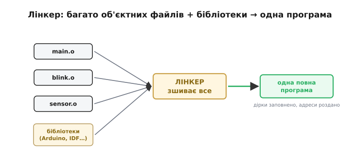
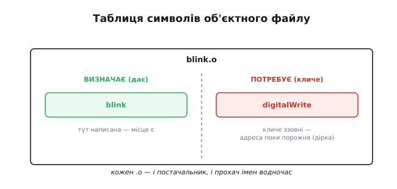
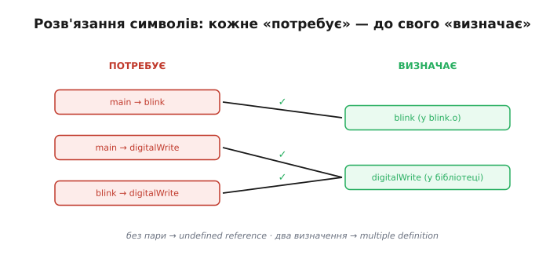
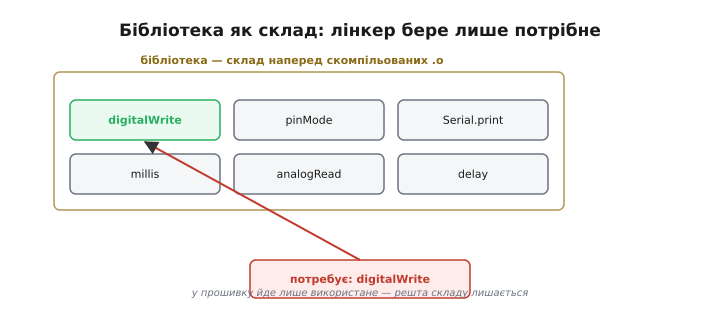
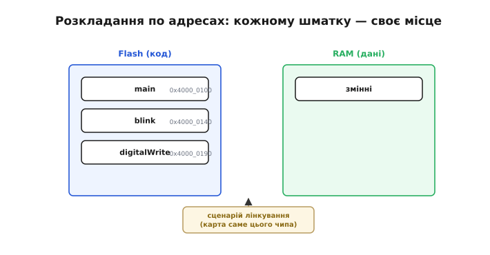
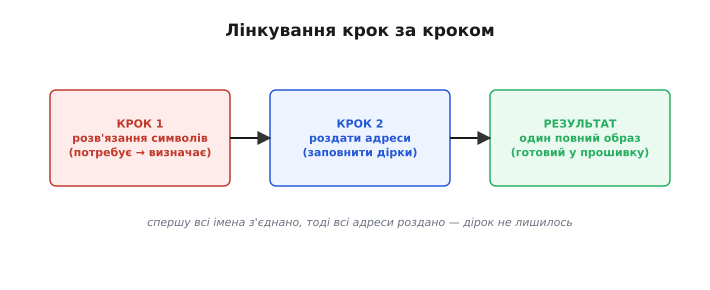

# Лінкування: збираємо все докупи (об'єктні файли, бібліотеки, адреси)

Окрема компіляція кожного файлу коду лишає по [об'єктному файлу](root:sf-lang/compiler-stages) (`.o`) на кожен із них, і всі вони «з дірками»: у кожному є посилання на чуже — виклики функцій з інших файлів і бібліотек — без точних адрес. Зшиває все це в одну робочу програму **лінкер** (*linker*, від англ. *to link* — «зв'язувати»): він **зв'язує** розрізнені шматки в одне ціле. Лінкер часто здається найзагадковішим інструментом збірки — а насправді робить лише **дві** прості за ідеєю речі: з'єднує імена (заповнює дірки) і розкладає все по адресах.

Особливість лінкера серед усіх інструментів збірки ось у чому: компіляція **знижує рівень** одного файлу (текст → числа), а лінкер **збирає ціле з частин**. Саме тут із купки окремих `.o` народжується програма, що знає себе **всю**: де лежить кожна функція й куди веде кожен виклик. Його прообраз — компонувальник A-0, що його [Грейс Гоппер](root:sf-lang/compilation/hist-grace-hopper.md) зібрала ще 1952 року: той теж діставав підпрограми зі складу й узгоджував їхні адреси.


*Робота лінкера одним поглядом: на вхід — усі об'єктні файли (`.o`) плюс бібліотеки; на виході — одна повна програма, де всі дірки заповнено, а кожен шматок дістав свою адресу. Лінкер збирає з розрізнених деталей готовий механізм.*

### Символи: імена, які треба з'єднати

Щоб зрозуміти лінкер, треба знати про **символи** (*symbol*, від грец. *sýmbolon* — «знак»). Кожен об'єктний файл несе свою «відомість» — **таблицю символів**, де записано дві речі: що цей файл **визначає** (тобто **дає** світові — які функції й змінні в ньому реально є) і що цей файл **потребує** (тобто кличе ззовні, але сам не має — це і є ті «дірки»).

Скажімо, файл `blink.o` **визначає** функцію `blink` (вона в ньому написана), але **потребує** `digitalWrite` (він її кличе, а коду її не має). Так кожен `.o` — це водночас і **постачальник** одних імен, і **прохач** інших.

Звідки лінкер знає, хто що дає й потребує? Із самої таблиці символів, яку компілятор і асемблер дбайливо вписали в кожен `.o`. Символ — це просто **ім'я**, прив'язане до місця: «функція `blink` починається ось тут». У визначених символів місце вже є; у потрібних (зовнішніх) воно поки порожнє — «адресу впишеш ти, лінкере». По суті, лінкер працює як **бюро знайомств**: в одній колонці — оголошення «шукаю того, хто вміє `digitalWrite`», в іншій — «я вмію `digitalWrite`, ось я»; його справа — звести пари.


*Таблиця символів об'єктного файлу. Ліворуч — що файл визначає (дає: тут функцію `blink`). Праворуч — що потребує (кличе ззовні: `digitalWrite`) — це і є незаповнені «дірки». Кожен `.o` — і постачальник, і прохач імен водночас.*

### Розв'язання символів: з'єднати «потребує» з «є»

Головна робота лінкера — **розв'язання символів** (*symbol resolution*): для кожного «потребує X» знайти десь поміж усіх файлів і бібліотек той, хто «визначає X», і **з'єднати** їх — вписати в дірку справжню адресу того X. Знайшов на кожне «треба» своє «є» — програма зшита.

Шукає лінкер по **всіх** поданих йому файлах і бібліотеках, і діє за суворим правилом: кожне ім'я має бути визначене **рівно один раз** — не нуль (бо нема куди вести виклик) і не двічі (бо незрозуміло, котре визначення брати). І ось чому ці помилки виринають аж **тепер**, а не при компіляції: компілятор бачив лише **один** ваш файл і повірив на слово, що `digitalWrite` десь існує (ви ж пообіцяли це заголовком). По-справжньому перевірити, чи вона існує насправді, можна лише коли **всі** файли зійшлися разом — тобто на лінкуванні. Тому «не знайшов функцію» — це майже завжди скарга лінкера, а не компілятора.

А якщо **не** знайшов? Тоді лінкер зупиняється зі знаменитою скаргою «**undefined reference**» («невизначене посилання»): ви кличете щось, чого ніде нема — забули під'єднати потрібний файл чи бібліотеку. Буває й протилежна біда: дві різні частини **визначають** те саме ім'я — лінкер не знає, котре брати, і скаржиться на «**multiple definition**» («множинне визначення»).


*Серце лінкування. Для кожного «потребує» (ліворуч) лінкер шукає відповідне «визначає» (праворуч) і простягає між ними зв'язок. Усі стрілки знайшли мету — програма зшита. Якщо ж якесь «потребує» лишилось без пари — це undefined reference; якщо два файли визначають те саме — multiple definition.*

> 🔧 **Навіщо це.** Двох найчастіших скарг лінкера досить, щоб упізнавати половину «таємничих» збоїв збірки. «**undefined reference to digitalWrite**» майже завжди означає, що ви **забули** під'єднати файл чи бібліотеку, де ця функція живе (наприклад, не вказали потрібну бібліотеку проєкту). А «**multiple definition**» — що ви випадково **двічі** визначили те саме (часто — вписали повноцінне визначення в заголовок, що його вклеїли у два файли). Знаючи, що це **лінкер**, а не компілятор, ви шукаєте причину в **складі** проєкту, а не в синтаксисі окремого рядка.

Як ці дві скарги виглядають на справжньому коді й чим саме їх лікувати (додати джерело до збірки; винести визначення із заголовка через оголошення + `.c`, `inline` чи `static`) — розбирає [практикум помилок лінкера](root:sf-lang/linking/proj-linker-errors.md).

### Бібліотеки: склад готового коду

Звідки ж береться код тих функцій, яких ви не писали, — `digitalWrite`, `Serial.println` і сотень інших? З **бібліотек** (*libraries*). Бібліотека — це, по суті, **архів уже скомпільованих** об'єктних файлів: ядро Arduino, стандартна бібліотека мови, ESP-IDF — усе це склади готового, перевіреного коду, що його хтось зібрав **до вас** і раз.

Коли лінкер бачить ваше «потребує `digitalWrite`», він іде на цей склад і **витягує лише те, що справді потрібно**, — саму `digitalWrite` (та все, що вона тягне за собою), а не весь архів. Тому до вашої прошивки потрапляє **тільки використаний** код бібліотек, а не вони цілком. І, що важливо, бібліотеки **не перекомпільовують** щоразу — вони вже готові `.o`, лінкерові лишається їх **дібрати**.

Це дає одразу два зиски. По-перше, **швидкість**: величезний код бібліотек скомпільовано раз і назавжди, а ваша щоденна збірка лише дібрає з нього потрібне, не перетравлюючи його наново. По-друге, **ощадність**: лінкер тягне в прошивку лише ті функції, що ви справді кличете, відкидаючи решту складу (це звуть «прибиранням мертвого коду»). Тому підключити велику бібліотеку заради однієї функції — **не страшно**: у чіп піде тільки використане, а не весь її обсяг. Такий спосіб збирання — коли готовий код беруть із бібліотек і **вшивають у саму програму** — звуть **статичним лінкуванням**: усе потрібне опиняється всередині одного образу, без зовнішніх залежностей під час роботи.

На «великих» комп'ютерах буває й інакше — **динамічне** лінкування, коли спільні бібліотеки лежать окремо й підвантажуються вже під час запуску програми (це ті `.dll` у Windows чи `.so` у Linux, що їх ділять між собою багато застосунків). Для мікроконтролера такий шлях майже не годиться: там нема ні файлової системи, ні операційної системи, яка підвантажила б щось «на ходу», та й зайвого місця катма. Тому вбудований світ майже завжди обирає **статичне** лінкування: усе своє нести з собою, в одному самодостатньому образі — точнісінько в дусі самодостатності [мікроконтролера](root:hw-arch/microcontroller), що несе всю свою «начинку» на одному кристалі.

> 🔧 **Навіщо це.** Звідси дві щоденні речі. Перша: не бійтеся розміру, підключаючи бібліотеку, — прошивка зросте лише на те, що ви з неї **кличете**. Друга: якщо лінкер кричить «**undefined reference**» на функцію, що мала б бути в бібліотеці, — найімовірніше, ви **не вказали саму бібліотеку** проєктові (код її є, та лінкерові не сказали, де шукати). Тобто лікувати треба не код, а **склад** збірки — список під'єднаних файлів і бібліотек.


*Бібліотека як склад: архів наперед скомпільованих об'єктних файлів (ядро Arduino, стандартна бібліотека…). На запит «потребує `digitalWrite`» лінкер витягує зі складу лише цю функцію (і її залежності), а не весь архів. Звідси й береться код, якого ви не писали, — і саме тому до прошивки входить тільки використане.*

### Розкладання по адресах: де що житиме

Зшити імена — півсправи. Друга робота лінкера: вирішити, **де саме** в пам'яті чипа житиме кожен шматок, тобто дати кожному фрагменту коду й кожній змінній **остаточну адресу** на [карті пам'яті](root:hw-arch/mcu-blocks) чипа. Код лягає в одну ділянку пам'яті, дані — в іншу; усе вишиковується за чіткою розкладкою.

І ось тепер дірки можна **остаточно** заповнити: щойно лінкер знає, що `digitalWrite` лежатиме, скажімо, за адресою `0x4000_0190`, він вписує саме це число в кожне місце, де її кликали. Орієнтуватися ж, куди що класти, лінкерові допомагає особливий **сценарій лінкування** (*linker script*) — файл, що описує карту пам'яті **конкретного** чипа: де у нього Flash під код, де RAM під дані, скільки чого. (Те, як саме код і дані розкладаються по ділянках-секціях, докладніше розбирає [образ прошивки](root:sf-lang/firmware-image); тут важлива сама ідея: лінкер **призначає адреси**.)


*Друга робота лінкера: він розкладає всі шматки на карті пам'яті чипа — код у Flash, дані в RAM, кожному своя адреса. Знаючи, що `digitalWrite` лежить за `0x4000_0190`, лінкер вписує це число в усі місця, де її кликали. Орієнтир — сценарій лінкування, що знає карту пам'яті саме цього чипа.*

Зверніть увагу: сценарій лінкування **прив'язаний до чипа**, так само як машинний код прив'язаний до ядра, для якого [компілятор його породжує](root:sf-lang/compilation). У ESP32 одна карта пам'яті, у іншого МК — зовсім інша; той самий код, зібраний під різні чипи, лінкер розкладе по **різних** адресах. Це ще одна причина, чому під кожну плату потрібна своя «ціль» у тулчейні: не лише компілятор має знати ядро, а й лінкер — карту пам'яті. Тому, до речі, готовий образ під один чіп не «оживе» на іншому, навіть спорідненому: адреси в ньому розраховані під чужу карту.

### Результат: один повний образ

Чому ж адреси не призначив раніше асемблер? Бо, складаючи окремий `.o`, він **не знав**, поряд із якими іншими файлами той опиниться й куди все ляже разом. Тому об'єктний код пишуть «**пересувним**» (*relocatable*): мовляв, «це почнеться там, де скажуть». Зібравши всіх докупи, лінкер нарешті вирішує остаточну розкладку, **зсуває** кожен шматок на його місце й виправляє всі внутрішні посилання під нові адреси. Цей зсув і називають **релокацією** — дати плаваючим адресам остаточний дім.

Зробивши обидві справи — з'єднавши всі імена й роздавши всі адреси, — лінкер видає **одну повну програму**: жодних незаповнених дірок, кожен шматок на своєму місці з відомою адресою. Це вже майже прошивка — лишається оформити її в остаточний [образ для заливання в чіп](root:sf-lang/firmware-image).

### Простежмо лінкування на прикладі


*Лінкування крок за кроком: спершу кожне «потребує» з'єднують із «визначає» (символи розв'язано), тоді кожному шматку дають адресу — і дірки заповнюють цими адресами. На виході — один повний образ.*

**Проєкт із двох ваших файлів (`main.o`, `blink.o`) і однієї бібліотеки — як лінкер зшиває їх в один образ:**

```
НА ВХОДІ ЛІНКЕРА (об'єктні файли + бібліотека):
  main.o    визначає: main          потребує: blink, digitalWrite
  blink.o   визначає: blink         потребує: digitalWrite
  libArduino (бібліотека)  визначає: digitalWrite, … (багато іншого)

КРОК 1 — РОЗВ'ЯЗАННЯ СИМВОЛІВ (з'єднати «потребує» з «визначає»):
  main  → blink         : знайдено в blink.o       ✓
  main  → digitalWrite  : знайдено в libArduino    ✓
  blink → digitalWrite  : знайдено в libArduino    ✓
  усі «потребує» мають пару → дірок не лишилось

КРОК 2 — ЗІБРАТИ ОДНОРІДНЕ РАЗОМ (секції):
  .text (код)  ← main, blink, digitalWrite       → піде у Flash
  .data (дані) ← початкові значення змінних       → піде в RAM

КРОК 3 — РОЗКЛАСТИ ЗА АДРЕСАМИ (за сценарієм лінкування):
  .text: main          → 0x4000_0100
         blink         → 0x4000_0140
         digitalWrite  → 0x4000_0190
  (тепер кожен виклик вписує точну адресу замість «дірки»)

РЕЗУЛЬТАТ: один повний образ — готовий стати прошивкою
```

Простежте логіку: спершу лінкер **з'єднав** усі прохання з постачальниками (зокрема витяг `digitalWrite` зі складу-бібліотеки), переконавшись, що жодне «потребує» не лишилось без відповіді. Тоді він **згорнув однорідне докупи** — увесь код в одну секцію `.text`, усі дані в `.data` — і за **сценарієм лінкування** розклав ці секції за адресами конкретного чипа, вписавши точні числа в місця викликів. Якби, скажімо, `blink.o` не під'єднали, `main` лишився б із недосяжним «потребує blink» — і ми б дістали те саме «undefined reference». Так абстрактні «символи» й «адреси» виявляються найприземленішою бухгалтерією: хто кого кличе, хто де лежить і чи всі кінці зійшлися.

Отже, лінкер зшиває розрізнені об'єктні файли та потрібні шматки бібліотек у єдину програму: з'єднує всі імена й роздає всі адреси, заповнюючи дірки, що їх лишив асемблер. Гопперів A-0 понад сімдесят років тому робив по суті те саме — діставав підпрограми зі складу-стрічки й узгоджував адреси; сучасний лінкер — той самий зшивач, лише виріс і змужнів. На виході — повний, узгоджений код: один-єдиний файл, де кожен виклик веде куди слід, а кожна змінна має свою адресу. Та це ще не той файл, який заливають у чіп: його треба оформити в остаточний [образ прошивки](root:sf-lang/firmware-image) з його впорядкованими ділянками-секціями — і саме там код і дані остаточно посядуть свої місця у Flash та RAM.

---
