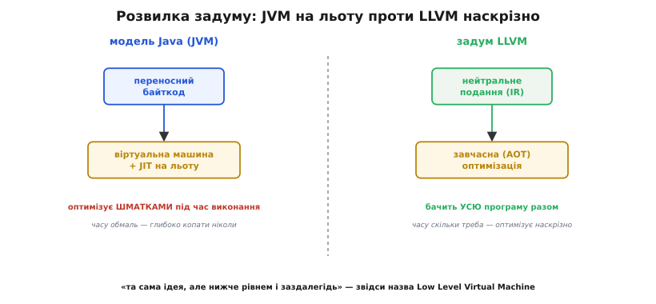
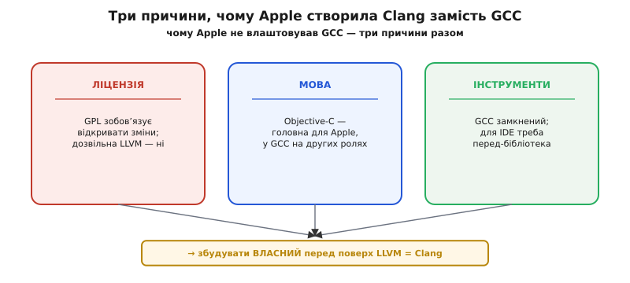

# 📜 Як народилися LLVM і Clang

Найкоротший спосіб зрозуміти, звідки взялися LLVM і Clang, — побачити, що це дві різні історії, розділені пʼятьма роками й однією зміною роботи. Спершу — університетський дослідницький проєкт про те, як краще оптимізувати програми (2000 рік, Іллінойс). Потім — та сама людина переходить у велику компанію, і там під зовсім інший, дуже приземлений тиск (ліцензія, гроші, продукти) виростає окремий інструмент (Clang). Одна ідея, дві епохи, дві мотивації. Розплутаймо їх по черзі — і по дорозі відділимо задокументовані факти від пізніших легенд, бо навколо таких проєктів легенди наростають швидко.

## Дослідник, аспірант і питання, що їх звело

2000 року в Іллінойському університеті в Урбана-Шампейн (University of Illinois at Urbana-Champaign, UIUC) зустрілися двоє. Вікрам Адве (Vikram Adve) — на той час молодий викладач-дослідник, фахівець із компіляторів і оптимізації програм. Кріс Латтнер (Chris Arthur Lattner) — щойно прийшов туди аспірантом (наприкінці 2000 року, як науковий асистент і магістрант). Їх звело одне питання, і воно варте того, щоб сформулювати його точно, бо саме воно — зерно всього подальшого.

Питання таке. У світі тоді гриміла **віртуальна машина Java** — [байткодова машина](topic:sf-lang/bytecode-vm), яка бере переносний байткод і виконує його, а гарячі місця на льоту докомпільовує в машинний код (це зветься **JIT**, *just-in-time* — «саме вчасно»). Підхід дав Java переносність і пристойну швидкість. Але в нього була вбудована стеля: JIT-компілятор бачить програму **шматками під час виконання**, у нього обмаль часу (він працює, поки користувач чекає), і тому глибоку, дорогу оптимізацію всієї програми разом він собі дозволити не може.

Адве й Латтнер поставили питання навиворіт. А що, як узяти саму ідею віртуальної машини — переносне, нейтральне подання програми, — але опустити його **рівнем нижче** і зсунути роботу з «під час виконання» на «заздалегідь»? Тобто робити не так багато JIT і значно більше **завчасної** компіляції (*ahead-of-time*, AOT), щоб компілятор бачив **усю** програму й мав скільки завгодно часу на аналіз та оптимізацію. Не машина, що квапливо латає код на ходу, а платформа, над якою можна робити наскрізну оптимізацію всього — від збирання окремого файлу до лінкування й навіть після нього.

> 🔧 **Навіщо це.** Ця розвилка «швидко на льоту проти повільно, зате наскрізно» — не музейна. Саме вона стоїть за прапорцем `-flto` (*link-time optimization*, оптимізація під час лінкування) у вашому тулчейні: він дає компіляторові побачити всю прошивку разом, а не файл за файлом, — рівно та «наскрізність», заради якої й починався LLVM.

Ось чому нова платформа отримала назву-абревіатуру **LLVM** — **Low Level Virtual Machine**, «низькорівнева віртуальна машина». Слово «virtual machine» тут — прямий уклін у бік Java, а «low level» — точна поправка: беремо ту ідею, але нижче й із прицілом на завчасну, а не квапливу оптимізацію. Це не здогад про походження назви — це те, як пояснював його сам Латтнер: узяти щось на кшталт JVM і побудувати платформу **під нею**, над якою робиться оптимізація цілої програми. Статус: усталено.


*Розвилка, з якої почався LLVM. Модель Java: переносний байткод крутить віртуальна машина, а JIT квапливо докомпільовує гарячі шматки під час виконання — часу на глибоку оптимізацію обмаль. Задум Адве й Латтнера: узяти ту саму ідею нейтрального подання, але опустити рівнем і перенести оптимізацію на «заздалегідь», коли видно всю програму й час не тисне. Звідси й назва — «низькорівнева віртуальна машина».*

## Дисертація, а не продукт

Тут критично тримати в голові ще одну обставину, бо вона змінює те, як читати всю ранню історію: **LLVM починався як дослідження, не як товар**. Це не стартап, що ліпив компілятор на продаж, і не корпоративний відділ. Це аспірант із науковим керівником, які досліджували, як влаштувати компіляторну оптимізацію краще, ніж уміли тоді.

Матеріальний доказ — Латтнерова **магістерська робота 2002 року**. Її назва проговорює задум прямим текстом: **«LLVM: An Infrastructure for Multi-Stage Optimization»** — «LLVM: інфраструктура для багатоетапної оптимізації». Не «новий компілятор C», а саме **інфраструктура для оптимізації на багатьох етапах** — під час збирання, під час лінкування, під час виконання. Слова в назві — це і є вся програма проєкту, стисло. Статус: усталено (робота опублікована й доступна).

Це пояснює одну рису, через яку LLVM потім вистрелив, хоч задумувалася вона не заради успіху, а заради зручності досліджень. Щоб пробувати різні оптимізації, потрібне чисте, одноманітне подання програми, над яким легко експериментувати, і воно має бути **окремим, добре описаним складником**, а не заплутаними нутрощами якогось монолітного компілятора. Дослідникові так просто зручніше працювати. Але саме ця дослідницька акуратність — чітка межа навколо серцевини — згодом і зробила LLVM тим, що можна взяти й вбудувати куди завгодно. Гарна інженерія, народжена з потреби експериментувати, виявилася гарною інженерією взагалі.

> 🔧 **Навіщо це.** Коли ви дивуєтеся, чому LLVM так легко «встромляється» в десятки різних мов і продуктів, згадайте це коріння. Річ не в маркетингу — річ у тому, що серцевину змушені були зробити чистою й відокремленою ще тоді, коли на ній ставили досліди. Дисципліна дослідника обернулася зручністю для всіх.

## Жовтень 2003: код виходить у світ

Кілька років LLVM жив як академічний проєкт. Переломна дата — **24 жовтня 2003 року**: Кріс Латтнер оголосив вихід **LLVM 1.0**. Оголошення він зробив у розсилці **GCC** — тодішнього стандартного вільного компілятора, — і саме́ місце оголошення промовисте: молодий проєкт заявляв про себе там, де збиралися компіляторники, поруч із головним гравцем поля. Статус: усталено (лист у публічному архіві розсилки).

Що вже вміла та перша версія — теж варто знати, бо це показує, наскільки серйозним був задум із самого початку. LLVM 1.0 мала стабільний передній кінець для **C**, бета-версію для **C++**, генератори коду під **x86** і **SPARC V9**, причому обидва режими — і звичайну статичну компіляцію, і JIT. Тобто не іграшка на одну архітектуру, а вже інфраструктура з кількома цілями й обома способами породжувати код.

Вийшло LLVM під **дозвільною** (permissive) ліцензією — University of Illinois/NCSA. Слово «дозвільна» тут не дрібниця термінології; воно стане пружиною **другої** половини цієї історії. Дозвільна ліцензія означає: бери, вбудовуй у свій продукт, зокрема закритий, і **не мусиш** відкривати назад свої зміни. Запамʼятаймо цю рису — за два роки саме вона приведе до Apple. (Пізніше, від LLVM 8.0, проєкт перейшов на ліцензію Apache 2.0 з винятком, теж дозвільну; для нашої історії важлива сама природа — дозвільна від початку.)

## Коли назва перестала означати те, що означала

Раз уже мова про назву, закриймо цей сюжет до кінця, бо навколо нього крутиться поширена плутанина. З роками LLVM переріс власне імʼя. Задумувалося як «низькорівнева віртуальна машина» — а виросло у величезну **родину** інструментів: оптимізатор, генератори коду під безліч ядер, лінкер, відлагоджувач, бібліотеки, передні кінці різних мов. До «віртуальної машини» в тому сенсі, який спадає на думку сучасному розробникові (щось на кшталт JVM, що виконує байткод), це вже мало стосунку.

Тому **від 2011 року назва LLVM офіційно перестала бути абревіатурою**. Тепер це просто власна назва цілого проєкту-парасольки, і розшифровувати її як «Low Level Virtual Machine» — історично цікаво, але формально вже неправильно. Це не легенда й не міська байка — це зафіксована позиція самого проєкту: імʼя лишили, а розшифровку офіційно відкинули як таку, що радше плутає, ніж пояснює. Статус: усталено.

Отже, коротка правда про назву в трьох реченнях. Спершу — справжня абревіатура «Low Level Virtual Machine», з прямим натяком на JVM і поправкою «нижче рівнем». Потім проєкт розрісся далеко за межі будь-якої «віртуальної машини». Від 2011-го — вже не абревіатура взагалі, а просто імʼя. Хто наполягає, що «LLVM досі означає Low Level Virtual Machine», просто застряг у 2003-му.

## Зміна роботи, з якої почалася друга історія

2005 року сюжет робить крутий поворот, і починається зовсім інша його половина. **Apple найняла Латтнера** — з конкретним завданням: довести LLVM до промислової якості для використання в продуктах Apple. Академічний проєкт дістав промислового спонсора з ясною метою й, головне, з ресурсами. Латтнер не просто далі пиляв LLVM сам — він зібрав і збудував в Apple **цілу команду** компіляторників, і чимало важливих можливостей LLVM реалізував там особисто. Дослідницька інфраструктура ставала виробничою. Статус: усталено.

Але тут треба різко пригальмувати з поширеним спрощенням «Apple найняла Латтнера — і зʼявився Clang». Це неправда, і плутати ці дві речі — типова помилка. 2005 року йшлося про **LLVM**, не про Clang. Apple вкладалася в **серцевину** — оптимізатор і генерацію коду, — щоб ужити її у своїх системах розробки. Clang як окремий інструмент народиться пізніше й з іншої, дуже конкретної потреби. Спершу — LLVM у виробництві. Питання «а звідки взявся Clang?» ще навіть не стояло.

## Чому Apple знадобився власний передній кінець

Щоб зрозуміти народження Clang, треба побачити, що муляло Apple. А муляв їм інструмент, яким усі тоді користувалися для C і C++, — **GCC**. Причин було три, і жодна з них не «GCC поганий сам по собі». GCC був потужний і перевірений. Проблема була в тому, що він **не пасував Apple** — з трьох різних боків, які склалися разом.

Перша причина, і головна, — **ліцензія**. GCC розповсюджується під **GPL** (*GNU General Public License*), а новіші версії — під **GPLv3**. Ліцензія GPL вимагає: якщо ти поширюєш змінену версію чи розширення GCC, ти **мусиш відкрити свій код** цих змін. Для компанії, яка вбудовує компілятор у власне закрите середовище розробки й хоче тримати свої напрацювання при собі, це принципова перешкода. А LLVM, згадаймо, від першого дня був під **дозвільною** ліцензією — бери й вбудовуй, нічого відкривати назад не зобовʼязаний. Ось де вистрілила та рання риса LLVM: дозвільність, закладена в 2003-му, у 2005–2006-му виявилася для Apple вирішальною перевагою. Різниця цих двох філософій ліцензування — окрема велика тема, і хто хоче копнути глибше в бік GCC, знайде її в [історії GCC](topic:sf-lang/compiler-stages/hist-gcc.md).

Друга причина — **Objective-C**. Це була головна мова застосунків під macOS та (згодом) iOS, тобто для Apple — критична. А в світі GCC вона була **на других ролях**: пріоритет низький, розвиток млявий, потрібні Apple можливості додавалися повільно. Компанія, для якої ця мова центральна, залежала від чужого проєкту, де ця мова — периферія. Незручне становище.

Третя причина — **інтеграція в середовище розробки**. GCC проєктувався як компілятор командного рядка: на вході файли, на виході обʼєктний код. Він **погано вбудовувався** в IDE (Apple тут — Xcode), де хочеться не просто зібрати код, а й розуміти його наживо: підказувати типи, миттєво підсвічувати помилки, стрибати до означень. Для такого потрібен передній кінець, спроєктований як **бібліотека, що віддає структуру коду назовні**, а не замкнена програма-компілятор. GCC таким не був.


*Чому Apple не влаштовував GCC — три причини, що зійшлися разом. Ліцензія: GPL зобовʼязує відкривати зміни, дозвільна ліцензія LLVM — ні. Мова: Objective-C, головна для Apple, у GCC розвивалася мляво. Інструменти: GCC — замкнений компілятор командного рядка, а для живих підказок в IDE потрібен передній кінець-бібліотека, що віддає структуру коду. Жодна причина не «GCC поганий» — усі три про те, що він не пасував саме Apple.*

Складіть ці три причини — і рішення стає очевидним. Дозвільна ліцензія + власна мова, яку ніхто інший належно не тягне, + потреба в компіляторі-бібліотеці для IDE. Купувати чуже під GPL і випрошувати підтримку Objective-C у чужому проєкті — глухий кут. Дешевше й розумніше збудувати **свій** передній кінець поверх LLVM, який уже є, уже дозвільний і вже вміє оптимізувати та генерувати код. Так задум Clang визрів не з технічної цікавості, а з тверезого підрахунку.

## Clang народжується

Так близько **2006 року** в Apple почалася робота над **Clang** — переднім кінцем для родини мов C (C, C++, Objective-C) поверх LLVM. А **2007 року** Clang відкрили: схвалення зробити його відкритим кодом дали в липні 2007-го, а перший публічний випуск припав на осінь того ж року. Далі Clang пішов у **Xcode** — інтегроване середовище розробки Apple — і став тим компілятором, на якому Apple будувала свої платформи. Статус: усталено.

Тут варто чітко розділити **ідею** й **реалізацію**, бо їх часто змішують. Ідея спільного переднього кінця над спільною серцевиною — стара, вона стоїть і за GCC, і за будь-яким пристойним компілятором. Заслуга Clang не в ідеї. Заслуга — в **реалізації**: зробити цей передній кінець дозвільним за ліцензією, першокласним для Objective-C і, найголовніше, **побудованим як бібліотека**, що вміє віддати назовні повне синтаксичне дерево C++. Останнє й дало ту екосистему інструментів, за яку Clang люблять, — від ясних повідомлень про помилки до автодоповнення в редакторах, що читають код по-справжньому, а не гадають регулярними виразами. Ідея була ні до чого нова; новою була якісна, дозвільна, придатна для інструментів реалізація в потрібний момент.

## Колективний труд і хто що зробив

Наостанок — про людей, бо історію технологій легко звести до одного героя, а це майже завжди викривлення. Спокуса розповідати LLVM і Clang як «історію Кріса Латтнера» велика: він і справді центральна постать — задумав LLVM аспірантом, привів його в Apple, зібрав команду, започаткував Clang, а згодом і мову Swift. Але «центральна постать» — не «єдина».

Найкраще розбиває міф про одинака сам перелік лауреатів премії, якою відзначили LLVM. **2012 року** Асоціація обчислювальної техніки (*Association for Computing Machinery*, ACM) присудила **ACM Software System Award** — одну з найповажніших нагород у галузі програмних систем — **трьом** людям:

```
ACM Software System Award, 2012 — за LLVM:
  • Vikram Adve    — науковий керівник, співавтор задуму
  • Chris Lattner  — автор реалізації, творець LLVM і Clang
  • Evan Cheng      — провідний розробник генератора коду
```

Кожне імʼя в цьому списку — окрема роль, і разом вони показують, як насправді робляться такі системи. **Вікрам Адве** — науковий керівник, з яким Латтнер сформулював самий задум наскрізної оптимізації; без цього напряму не було б чого реалізовувати. **Кріс Латтнер** — той, хто цей задум **утілив** і далі провів від дисертації до промислового інструмента й до Clang. **Еван Ченг** (Evan Cheng), інженер Apple, — вів проєктування й реалізацію **генератора коду**, тобто тієї частини, що перетворює нейтральне подання на машинні команди конкретного ядра; без неї «інфраструктура оптимізації» не видала б жодного робочого байта. Ідея, реалізація серцевини, генерація коду — три різні внески, три людини, одна нагорода. Статус: усталено (склад лауреатів опублікований ACM).

А за цими трьома іменами — ще й **UIUC** з його дослідницьким середовищем, де все почалося, і **Apple** з грошима та командою, без яких дослідницький проєкт не став би виробничим, і величезна спільнота відкритого коду, що наросла навколо LLVM після 2003-го. Тому чесна однорядкова відповідь на питання «хто зробив LLVM і Clang?» звучить так: задум — Адве й Латтнер в Іллінойсі 2000-го; реалізація й Clang — Латтнер із командою в Apple від 2005-го; генерація коду — Ченг; а далі — спільнота. Не один геній, а точна послідовність людей і рішень, кожне з яких лягло на попереднє.
