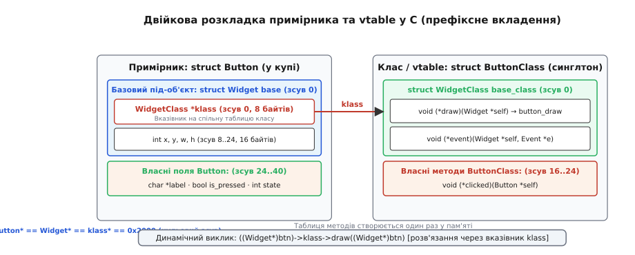
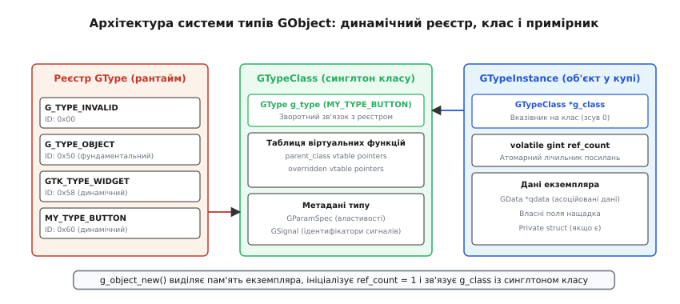
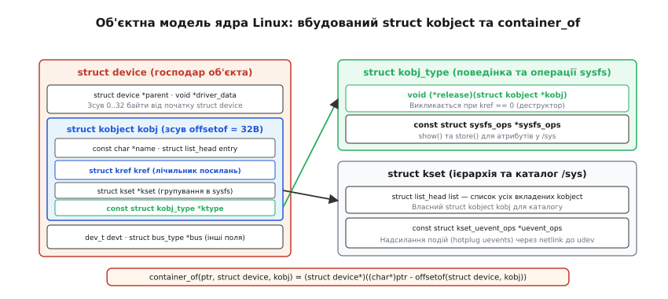
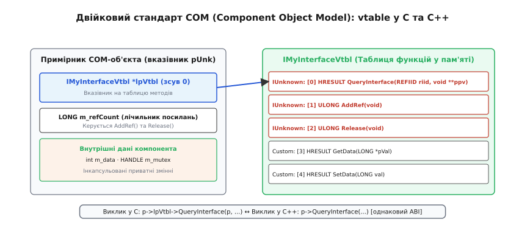

# Об'єктна система поверх C: клас, примірник, реєстрація типу

<preknowlist>
- [Пам'ять як масив](root:hw-arch/memory-as-array) — структури в пам'яті як неперервні послідовності байтів із фіксованими зсувами полів.
- [Адреси й покажчики](root:sf-lang/addresses-pointers) — пряма адресна арифметика, розіменування та перетворення типів покажчиків.
- [ABI та calling convention](root:sf-lang/abi-calling-convention) — двійкове вирівнювання структур, передача аргументів та розміщення покажчиків у пам'яті.
- [Поліморфізм і динамічне зв'язування](root:sf-lang/polymorphism) — концепція віртуальних таблиць (vtable) та непрямих викликів функцій через покажчики.
- [Препроцесор і макроси](root:sf-lang/preprocessor-macros) — генерація коду, конкатенація токенів та створення безпечних обгорток типів.
</preknowlist>

У мові C структура `struct` є лише описом послідовного розташування полів у пам'яті з фіксованими зміщеннями байтів, визначеними на етапі компіляції. Компілятор C не надає вбудованих понять класу, методів екземпляра, успадкування полів або поліморфної диспетчеризації через віртуальні таблиці. Проте масштабні програмні комплекси — графічні бібліотеки (GTK), ядра операційних систем (Linux Driver Model) та компонентні сервери (COM) — вимагають роботи з тисячами різнорідних об'єктів через єдині абстрактні інтерфейси.

Коли системний код повинен опрацьовувати довільні типи пристроїв чи елементів інтерфейсу без перекомпіляції клієнтських модулів, усі механізми об'єктноорієнтованого програмування будуються вручну безпосередньо в оперативній пам'яті. Розробник бере на себе задачі компілятора: вручну проєктує двійкову сумісність структур, формує таблиці покажчиків на функції та організовує динамічний реєстр типів у просторі виконання програми (англ. *runtime*).

> 🔧 **Навіщо це.** Побудова об'єктної системи поверх C забезпечує стабільний двійковий інтерфейс (ABI), не залежний від версій компіляторів та мовних стандартів C++. Це основа для міжмовного зв'язування (англ. *language bindings*), модульних плагінів та низькорівневих драйверів ядра, де динамічний поліморфізм реалізується з мінімальними накладними витратами і повним контролем за кожним виділеним байтом.

---

## Фундаментальні стовпи ООП у C: інкапсуляція, спадкування та vtable

Реалізація об'єктної парадигми в процедурній мові спирається на три базові двійкові техніки: непрозорі покажчики для приховування стану, префіксне вкладення базових структур для сумісності адрес підтипів та структури покажчиків на функції для динамічного поліморфізму.

### 1. Інкапсуляція через непрозорі покажчики (Opaque Pointers)

В об'єктноорієнтованому коді стан об'єкта не повинен бути доступним клієнтському модулю напряму. У C найсуворішим способом ізоляції внутрішнього стану є використання **неповних типів** (англ. *incomplete types*) або непрозорих покажчиків (англ. *opaque pointers*, відомих також у C++ як патерн PIMPL — *Pointer to Implementation*).

У загальнодоступному заголовному файлі (`.h`) структура лише оголошується без розкриття полів, а доступ до неї надається виключно через типізований покажчик та набір функцій-методів, першим аргументом яких виступає контекст об'єкта `self` (аналог прихованого покажчика `this` у C++):

:::tabs
```c
/* widget.h — публічний інтерфейс: внутрішня розкладка прихована */
#ifndef WIDGET_H
#define WIDGET_H

typedef struct Widget Widget;

Widget* widget_new(int x, int y);
void widget_free(Widget *self);
void widget_set_position(Widget *self, int x, int y);
void widget_get_position(const Widget *self, int *x, int *y);

#endif
```
```cpp
// widget.hpp — публічний інтерфейс з ідіоматичною C++ інкапсуляцією
#pragma once
#include <memory>
#include <utility>

class Widget {
public:
    Widget(int x, int y);
    ~Widget();

    Widget(Widget&&) noexcept;
    Widget& operator=(Widget&&) noexcept;

    void set_position(int x, int y) noexcept;
    [[nodiscard]] std::pair<int, int> get_position() const noexcept;

private:
    struct Impl;
    std::unique_ptr<Impl> m_impl;
};
```
:::

У файлі реалізації (`.c`) структура визначається повністю. Компілятор, обробляючи клієнтський код, знає лише розмір покажчика (8 байтів на 64-бітних архітектурах). Це унеможливлює пряме читання чи модифікацію внутрішніх полів і дозволяє змінювати розмір і розкладку внутрішньої структури без перекомпіляції модулів, що використовують бібліотеку.

### 2. Спадкування через префіксне вкладення (Prefix Layout)

Для побудови ієрархії типів («тип `Derived` є розширенням типу `Base`») у C застосовують **префіксне вкладення структур**. Базова структура вбудовується як **найперше поле** структури-нащадка за значенням:

:::tabs
```c
typedef struct {
    int x;
    int y;
} Widget;

typedef struct {
    Widget base;          /* Зсув 0 байтів від початку Button */
    char *label;          /* Зсув після sizeof(Widget) */
    bool is_pressed;
} Button;
```
```cpp
struct Widget {
    int x;
    int y;
};

struct Button : public Widget {
    char *label;
    bool is_pressed;
};
```
:::

Стандарт мови C (C11 §6.7.2.1) надає гарантію: покажчик на структуру після приведення типу вказує на її перший елемент, і навпаки. Це означає, що початкова адреса `struct Button` у точності збігається з початковою адресою поля `base`:

```
&button == (void*)&(button.base)   [зсув Δ = 0 байтів]
```

Завдяки нульовому зсуву будь-яка функція, що очікує покажчик `Widget*`, може безпосередньо приймати покажчик `(Widget*)&button`. Процесорна інструкція читання поля за зміщенням прочитає рівно ті самі байти, що й для справжнього базового екземпляра. Це забезпечує безпечне та повністю безкоштовне приведення типу вгору (англ. *upcasting*) на рівні двійкового коду.

### 3. Поліморфізм через таблиці покажчиків на функції (vtable)

Якщо об'єкт повинен змінювати поведінку в нащадках (наприклад, кнопка малюється інакше, ніж базовий віджет), нативні функції прив'язуються до об'єкта динамічно. Зберігати окремі покажчики на всі віртуальні функції всередині кожного екземпляра вкрай неефективно: об'єкт із 20 віртуальними методами витрачав би 160 байтів пам'яті лише на покажчики.

Замість цього створюють окрему структуру — **таблицю класу** (англ. *class struct* або *vtable*), яка існує в єдиному екземплярі на весь тип, а кожен примірник містить лише один покажчик `klass` на відповідну таблицю:


*Двійкова розкладка пам'яті об'єктної системи в C. Екземпляр Button містить базовий блок Widget на нульовому зсуві, першим полем якого є вказівник klass на структуру ButtonClass. Таблиця ButtonClass вкладає в себе WidgetClass і містить покажчики на конкретні реалізації віртуальних функцій.*

Розглянемо практичну реалізацію динамічної диспетчеризації у порівнянні з C++:

:::tabs
```c
#include <stdio.h>
#include <stdlib.h>

/* Оголошення таблиці класу (vtable) базового типу */
typedef struct Widget Widget;
typedef struct WidgetClass WidgetClass;

struct WidgetClass {
    void (*draw)(Widget *self);
    void (*handle_click)(Widget *self, int x, int y);
};

/* Базовий примірник */
struct Widget {
    const WidgetClass *klass; /* Вказівник на таблицю vtable (зсув 0) */
    int x, y;
};

void widget_draw_default(Widget *self) {
    printf("Base Widget drawing at (%d, %d)\n", self->x, self->y);
}

static const WidgetClass g_widget_class = {
    .draw = widget_draw_default,
    .handle_click = NULL
};

/* Нащадок: Button */
typedef struct Button Button;
typedef struct ButtonClass ButtonClass;

struct ButtonClass {
    WidgetClass parent_class; /* Вкладення таблиці предка (зсув 0) */
    void (*on_pressed)(Button *self);
};

struct Button {
    Widget base;              /* Вкладення екземпляра предка (зсув 0) */
    const char *label;
};

void button_draw_override(Widget *self) {
    Button *btn = (Button*)self;
    printf("Button drawing [%s] at (%d, %d)\n", btn->label, self->x, self->y);
}

static const ButtonClass g_button_class = {
    .parent_class = {
        .draw = button_draw_override,
        .handle_click = NULL
    },
    .on_pressed = NULL
};

/* Поліморфний виклик */
void render_scene(Widget *w) {
    /* Непрямий виклик через vtable: аналог w->draw() у C++ */
    if (w && w->klass && w->klass->draw) {
        w->klass->draw(w);
    }
}

int main(void) {
    Widget base_obj = { .klass = &g_widget_class, .x = 10, .y = 20 };
    Button btn_obj = { 
        .base = { .klass = (const WidgetClass*)&g_button_class, .x = 100, .y = 200 },
        .label = "Submit"
    };

    render_scene(&base_obj);
    render_scene((Widget*)&btn_obj); /* Двійковий поліморфізм у дії */
    return 0;
}
```
```cpp
#include <iostream>
#include <string>
#include <vector>
#include <memory>

// Базовий поліморфний клас: компілятор автоматично генерує прихований vptr
class Widget {
public:
    Widget(int x, int y) : m_x(x), m_y(y) {}
    virtual ~Widget() = default;

    virtual void draw() const {
        std::cout << "Base Widget drawing at (" << m_x << ", " << m_y << ")\n";
    }

    [[nodiscard]] int x() const noexcept { return m_x; }
    [[nodiscard]] int y() const noexcept { return m_y; }

private:
    int m_x;
    int m_y;
};

// Клас-нащадок з явним перевизначенням методу
class Button : public Widget {
public:
    Button(int x, int y, std::string label)
        : Widget(x, y), m_label(std::move(label)) {}

    void draw() const override {
        std::cout << "Button drawing [" << m_label << "] at (" 
                  << x() << ", " << y() << ")\n";
    }

private:
    std::string m_label;
};

// Поліморфна функція
void render_scene(const Widget& w) {
    w.draw(); // Динамічна диспетчеризація через vtable компілятора
}

int main() {
    auto base_obj = std::make_unique<Widget>(10, 20);
    auto btn_obj = std::make_unique<Button>(100, 200, "Submit");

    render_scene(*base_obj);
    render_scene(*btn_obj);
    return 0;
}
```
:::

У C-версії диспетчеризація `w->klass->draw(w)` розгортається у два послідовні розіменування покажчиків: спочатку витягується адреса таблиці класу `w->klass`, а потім за фіксованим зміщенням береться адреса функції `draw` і викликається з передачею `w` як першого аргументу. Це двійковий еквівалент виклику віртуального методу в C++.

Повна демонстрація робочої об'єктної системи з ієрархічним розв'язанням типів та спадкуванням наведена у вставці [практичної реалізації модульної об'єктної системи з vtable та підрахунком посилань](root:sf-lang/object-system-in-c/proj-dynamic-vtable-runtime.md).

---

## GObject (GLib / GTK): Промислова об'єктна модель загального призначення

Найрозвиненішою об'єктною системою в екосистемі C є **GObject**, що входить до складу бібліотеки GLib. Історичні передумови її виокремлення з графічного тулкіта GTK+ детально описані в [історичному нарисі про еволюцію GObject](root:sf-lang/object-system-in-c/hist-gobject-evolution.md).

GObject вирішує задачу побудови динамічно типізованої, інтроспективної об'єктної системи з підтримкою множинних інтерфейсів, сигналів та автоматичного керування пам'яттю.


*Архітектура системи GObject. Реєстр типів під час виконання повертає числовий GType. Для кожного типу одноразово виділяється структура GTypeClass (vtable та метадані властивостей), а кожен створений об'єкт GTypeInstance зберігає лічильник посилань і вказівник g_class на свій клас.*

### 1. Динамічний реєстр типів: GType
В основі GObject лежить фундаментальний числовий тип `GType` (ціле число розміру `uintptr_t`). Кожен зареєстрований у програмі тип — від базових примітивів (`G_TYPE_INT`, `G_TYPE_STRING`) до складних користувацьких класів — отримує унікальний числовий ідентифікатор у глобальному дереві типів.

Реєстрація типу виконується функцією `g_type_register_static()`, куди передається структура `GTypeInfo` з розмірами екземпляра і класу, а також вказівниками на функції ініціалізації:
- `class_init`: викликається **рівно один раз** при першому зверненні до класу для заповнення vtable та реєстрації сигналів/властивостей;
- `instance_init`: викликається **щоразу** при створенні нового об'єкта для встановлення початкових значень полів.

### 2. Розподіл пам'яті: GTypeInstance та GTypeClass
Кожен об'єктний тип у GObject представлений парою структур:
1. `GTypeClass`: структура класу, що розміщується в пам'яті в єдиному екземплярі на весь час роботи процесу. Вона починається з поля `GType g_type` і містить таблицю віртуальних методів.
2. `GTypeInstance`: структура екземпляра об'єкта, що виділяється в динамічній пам'яті. Першим полем обов'язково є `GTypeClass *g_class`.

Завдяки цьому будь-який об'єкт за зміщенням `0` містить покажчик на свій клас, через який можна отримати його `GType`, виконати поліморфний виклик методу або перевірити належність до ієрархії спадкування за час `O(1)`.

### 3. Макросна механіка G_DEFINE_TYPE
Для усунення рутинного коду розробники використовують макрос `G_DEFINE_TYPE(TypeName, type_name, PARENT_TYPE)`. Він автоматично генерує:
- Статичну змінну для збереження отриманого `GType`;
- Функцію `type_name_get_type()`, яка потокобезпечно реєструє тип при першому виклику;
- Статичний покажчик `type_name_parent_class` на клас предка (для виклику батьківських методів через механізм chained calls).

### 4. Життєвий цикл та двоетапне знищення
Керування пам'яттю в GObject спирається на атомарний підрахунок посилань через `g_object_ref()` та `g_object_unref()`.

Для вирішення проблеми циклічних посилань у складних графах об'єктів (наприклад, віджет тримає модель даних, а модель тримає віджет як слухача) GObject використовує двоетапне знищення (англ. *two-phase destruction*):
1. **Фаза `dispose`**: Викликається, коли лічильник посилань падає до 0. Об'єкт зобов'язаний звільнити всі посилання на інші об'єкти `GObject` (обнулити поля через `g_clear_object()`), розриваючи потенційні цикли. У цій фазі об'єкт все ще залишається валідним у пам'яті.
2. **Фаза `finalize`**: Викликається безпосередньо перед звільненням пам'яті (`g_free`). Тут звільняються сирі ресурси: виділена пам'ять `malloc`, файлові дескриптори, мережеві сокети та м'ютекси.

Повні сигнатури та інваріанти базових структур наведені у [довіднику інтерфейсів GObject та kobject](root:sf-lang/object-system-in-c/api-gobject-kobject-core.md).

---

## Об'єктна модель ядра Linux: kobject, kset, ktype та driver model

Архітектура ядра Linux будується навколо зовсім іншої парадигми. Ядро Linux принципово уникає класичного префіксного спадкування, замінюючи його **інтрузивними структурами** (англ. *intrusive data structures*).

Замість того, щоб вбудовувати базовий об'єкт суворо першим полем, ядро вбудовує структуру `struct kobject` у довільне місце структури-господаря (наприклад, `struct device` чи `struct cdev`).


*Модель об'єктів ядра Linux. Об'єкт kobject вбудовується на довільному зсуві всередину struct device. Макрос container_of вираховує адресу зовнішньої структури шляхом віднімання зміщення offsetof. Життєвим циклом керує структура kobj_type, а групуванням у sysfs — kset.*

### 1. Механізм container_of
Оскільки `kobject` розташований не за нульовим зміщенням, приведення типу `(struct device*)kobj_ptr` призвело б до зміщення пам'яті та фатального падіння ядра. Для повернення від вказівника на внутрішнє поле до вказівника на зовнішній об'єкт використовується макрос `container_of`:

:::tabs
```c
/* Макрос container_of у ядрі Linux (чистий C з розширеннями GCC) */
#define container_of(ptr, type, member) ({                      \
    const typeof(((type *)0)->member) *__mptr = (ptr);          \
    (type *)((char *)__mptr - offsetof(type, member));          \
})
```
```cpp
// Ідіоматичний еквівалент container_of у C++20 через шаблонні функції
#include <cstddef>
#include <type_traits>

template <typename OuterType, typename MemberType>
[[nodiscard]] constexpr OuterType* container_of(MemberType* ptr, MemberType OuterType::* member) noexcept {
    const auto offset = reinterpret_cast<std::size_t>(&(static_cast<OuterType*>(nullptr)->*member));
    return reinterpret_cast<OuterType*>(reinterpret_cast<char*>(ptr) - offset);
}
```
:::

Макрос обчислює зсув поля `member` від початку структури `type` за допомогою вбудованого оператора `offsetof` і віднімає отриману кількість байтів від адреси поля. Усі обчислення зміщень відбуваються під час компіляції, тому зворотне отримання зовнішнього об'єкта виконується процесором за одну інструкцію віднімання `sub`.

### 2. Тріада kobject, ktype та kset
Об'єктна підсистема ядра складається з трьох ключових сутностей:
- `struct kobject`: мінімальний вбудований елемент. Містить лічильник посилань `struct kref`, покажчик на батьківський `kobject` (для формування дерева пристроїв), ім'я та точку монтування у віртуальній файловій системі `/sys` (sysfs).
- `struct kobj_type` (скорочено `ktype`): описує спільну поведінку групи однакових `kobject`. Містить обов'язковий деструктор `release()` (викликається, коли `kref` досягає нуля) та покажчик на операції sysfs `struct sysfs_ops` (`show`/`store` для читання й запису файлів атрибутів користувачем).
- `struct kset`: колекція об'єктів `kobject` одного типу. Відображається в sysfs як окрема директорія (наприклад, `/sys/bus/pci/devices`) та транслює системні події підключення обладнання (англ. *hotplug uevents*) через сокети netlink у простір користувача для демона `udev`.

### 3. Модель драйверів (Driver Model)
На базі `kobject` побудовано дерево уніфікованої моделі драйверів Linux:
- `struct bus_type` (шина, наприклад PCI, USB, I2C);
- `struct device_driver` (драйвер, що обслуговує пристрої на шині);
- `struct device` (фізичний або віртуальний пристрій).

Коли ядро виявляє новий контролер, шина зіставляє зареєстровані драйвери з пристроєм через функцію `bus_type->match()`. Уся координація живлення (Suspend/Resume), прив'язка ресурсів DMA та відображення топології в `/sys` працюють автоматично завдяки вбудованим `kobject`.

---

## Component Object Model (COM) у C: Двійковий контракт IUnknown

Microsoft Component Object Model (COM) — це специфікація двійкового інтерфейсу компонентів, створена для взаємодії програмних модулів, скомпільованих різними мовами та різними компіляторами.

COM стандартизував структуру таблиці віртуальних функцій (vtable) на рівні машинного ABI. Незалежно від того, написаний компонент на C, C++, Delphi чи асемблері, вказівник на інтерфейс COM є **покажчиком на покажчик на таблицю функцій**:


*Двійкова організація COM-об'єкта. Будь-який інтерфейс починається з покажчика lpVtbl на таблицю методів. Перші три слоти vtable обов'язково займають QueryInterface, AddRef та Release (контракт IUnknown).*

### 1. Контракт IUnknown
Кожен COM-інтерфейс зобов'язаний наслідувати фундаментальний інтерфейс `IUnknown`. Перші три слоти vtable строго зафіксовані:
1. `QueryInterface(REFIID riid, void **ppv)`: запит підтримуваного інтерфейсу за його 128-бітним глобальним ідентифікатором GUID (`IID`). Це безпечний динамічний аналог `dynamic_cast` на двійковому рівні.
2. `AddRef()`: атомарне збільшення лічильника посилань.
3. `Release()`: атомарне зменшення лічильника посилань та самознищення об'єкта при досягненні 0.

### 2. Виклик COM-методів у C та C++
Двійкова розкладка COM була навмисно спроєктована так, щоб у C++ виклик інтерфейсу відбувався як звичайний виклик віртуального методу через неявний `vptr`. У мові C цей самий виклик записується явно:

:::tabs
```c
/* Виклик методу COM у чистому C */
#include <windows.h>
#include <stdio.h>

void use_com_interface_c(IUnknown *pUnk) {
    if (!pUnk) return;

    /* 1. Збільшуємо лічильник посилань */
    pUnk->lpVtbl->AddRef(pUnk);

    /* 2. Запитуємо цільовий інтерфейс */
    void *pStream = NULL;
    static const IID IID_ISequentialStream = { 
        0x0c733a30, 0x2a1c, 0x11ce, {0xad, 0xe5, 0x00, 0xaa, 0x00, 0x44, 0x77, 0x3d} 
    };

    HRESULT hr = pUnk->lpVtbl->QueryInterface(pUnk, &IID_ISequentialStream, &pStream);
    if (SUCCEEDED(hr) && pStream) {
        printf("Інтерфейс ISequentialStream успішно отримано в C\n");
        
        IUnknown *pStreamUnk = (IUnknown*)pStream;
        pStreamUnk->lpVtbl->Release(pStreamUnk);
    }

    /* 3. Звільняємо початкове посилання */
    pUnk->lpVtbl->Release(pUnk);
}
```
```cpp
// Виклик методу COM у C++ з використанням розумних покажчиків WRL / winrt
#include <windows.h>
#include <wrl/client.h>
#include <iostream>

void use_com_interface_cpp(Microsoft::WRL::ComPtr<IUnknown> unk) {
    if (!unk) return;

    // Microsoft::WRL::ComPtr автоматично керує AddRef/Release за правилами RAII
    Microsoft::WRL::ComPtr<ISequentialStream> stream;
    
    // As() всередині викликає QueryInterface з автоматичним виведенням IID
    HRESULT hr = unk.As(&stream);
    if (SUCCEEDED(hr) && stream) {
        std::cout << "Інтерфейс ISequentialStream успішно отримано в C++\n";
    }
}
```
:::

У мові C розробник змушений вручну розіменовувати `p->lpVtbl->Method(p, ...)` та явно передавати покажчик `p` як перший параметр `This`. У C++ компілятор виконує ці дії неявно, генеруючи ідентичний машинний код виклику.

---

## Порівняльний аналіз: Об'єктні системи в C проти нативного C++

Створення об'єктних моделей поверх C та використання нативних класів C++ представляють два різні інженерні компроміси між контролем, безпекою та продуктивністю.

| Критерій | Об'єктна система поверх C (GObject / COM / kobject) | Нативні класи C++ (Itanium / MSVC ABI) |
| :--- | :--- | :--- |
| **Накладні витрати на екземпляр** | Від 8B (`kobject` без vtable) до 24–48B (`GObject`: vptr + ref_count + qdata + private struct). | **8 байтів** на 64-бітних платформах (єдиний прихований покажчик `vptr` у заголовку). |
| **Таблиці класів (vtable)** | Створюються динамічно в купі або як глобальні структури. Можуть містити користувацькі метадані. | Генеруються компілятором статично і розміщуються в захищеній від запису секції `.rodata`. |
| **Перевірка безпеки типів** | **Час виконання (Runtime):** макроси з магічними числами (`G_TYPE_CHECK_INSTANCE_CAST`), `container_of` або `QueryInterface`. | **Час компіляції (Compile-time):** сувора статична типізація, `static_cast` та компіляторний RTTI (`dynamic_cast`). |
| **Зв'язування з іншими мовами** | **Ідеальне:** чистий C ABI експортується в Python, Rust, C#, JS без проміжних шлюзів. | **Складне:** спотворення імен (name mangling), відсутність єдиного ABI та винятки вимагають C-обгорток (extern "C"). |
| **Динамічна модифікація** | Можливе додавання нових методів, властивостей, сигналів та інтерфейсів під час роботи програми. | Структура класу та vtable фіксуються на етапі збірки і не можуть бути змінені в рантаймі. |
| **Керування пам'яттю** | Ручне або через підрахунок посилань (`g_object_ref`, `kobject_put`). Високий ризик витоків. | Автоматичне через RAII (`std::unique_ptr`, `std::shared_ptr`) та компіляторні деструктори. |

### 1. Накладні витрати пам'яті
У нативному C++ клас із віртуальними функціями містить рівно один прихований покажчик на таблицю `vptr` (8 байтів). Таблиця `vtable` створюється компілятором у секції констант `.rodata` і не потребує жодного байта динамічної пам'яті під час виконання.

У GObject кожен об'єкт несе обов'язковий заголовок: покажчик на клас `g_class` (8B), атомарний лічильник `ref_count` (4B + 4B вирівнювання) та покажчик на асоційовані дані `qdata` (8B). Разом це складає мінімум 24 байти службових даних на кожен екземпляр ще до збереження корисних полів. Додатково кожна структура `GTypeClass` виділяється в купі та містить розлогі метадані про всі властивості типу.

### 2. Безпека типів і ціна динамічного контролю
У C++ приведення вказівників при одиничному спадкуванні перевіряється на етапі трансляції і коштує 0 процесорних тактів. Якщо тип несумісний, компілятор видає помилку збірки.

У C об'єктні системи змушені виконувати перевірки типу під час виконання. Макрос `G_OBJECT(obj)` розгортається у виклик функції `g_type_check_instance_cast()`, яка перевіряє дерево предків об'єкта. У налагоджувальних збірках це додає накладні витрати на кожен виклик методу, а у фінальних збірках (де перевірки вимикаються прапорцем `-DG_DISABLE_CAST_CHECKS`) помилка типізації призводить до невизначеної поведінки (англ. *undefined behavior*) та пошкодження пам'яті.

### 3. Динамічна гнучкість проти статичної оптимізації
Головна перевага C-орієнтованих систем полягає в їхній динамічності. GObject дозволяє динамічно реєструвати нові типи під час роботи програми (наприклад, при завантаженні зовнішнього плагіна), динамічно підключати сигнали за назвою рядка, генерувати схеми інтроспекції (GIR) та прозоро транслювати виклики в інтерпретовані мови.

C++ орієнтований на принцип «нульових накладних витрат» (англ. *zero-cost abstractions*): усе, що можна перевірити й розрахувати на етапі компіляції (зсуви полів, шаблони, inline-розгортання методів), вирішується до запуску програми. Але це позбавляє C++ динамічної рефлексії та робить його двійковий ABI жорстко прив'язаним до конкретного компілятора.

---

## Архітектурний синтез: коли обирати об'єктну систему в C

Реалізація об'єктних моделей поверх чистого C залишається фундаментальним інструментом системної інженерії у трьох ключових сценаріях:
1. **Простір ядра операційної системи (Kernel Space).** У ядрі Linux відсутнє середовище виконання C++ (рантайм винятків, RTTI, купові алокатори стандартної бібліотеки). Модель `kobject` забезпечує строге керування життєвим циклом обладнання та безпомилкову інтеграцію з віртуальними файловими системами при мінімальному споживанні ресурсів.
2. **Базові загальносистемні бібліотеки та GUI-фреймворки.** Бібліотеки рівня GTK, GStreamer та libui експортують C ABI, що гарантує сумісність між різними версіями компіляторів і дозволяє автоматично генерувати обгортки для десятків мов програмування через єдиний шар інтроспекції.
3. **Міжмодульні стандарти компонентів (COM / IPC).** Двійковий стандарт vtable гарантує стабільну взаємодію бінарних плагінів і компонентів операційної системи без потреби поширення вихідного коду чи використання однакових компіляторних тулчейнів.
