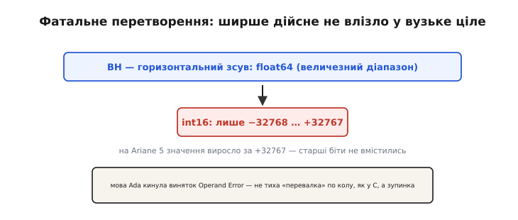
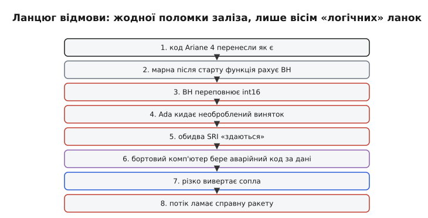
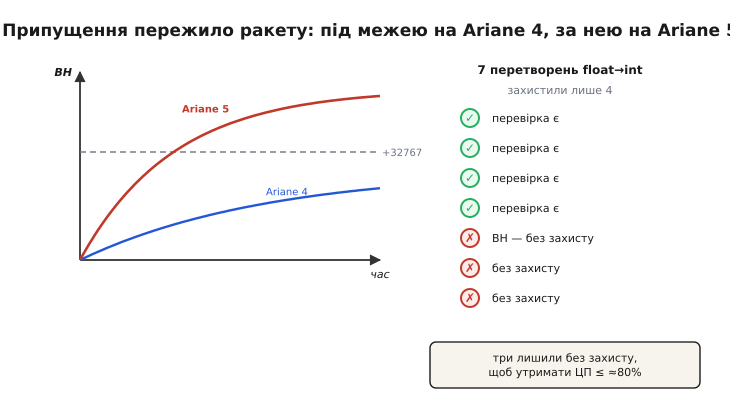

# 📜 Ariane 5 (1996): як одне переповнення коштувало сотні мільйонів доларів

> Є правило, від якого холодно стає: межі цілих типів **реальні й тихі**, і коли число до них підходить, машина мовчки видає неправду. Ariane 5 — найгучніше підтвердження цього правила і, мабуть, найдорожчий рядок коду в історії техніки: за **37 секунд** одне неперевірене перетворення [числа з плаваючою комою у вузьке ціле](topic:sf-lang/overflow-wraparound) (`float64 → int16`) перетворило новісіньку європейську ракету-носій на хмару уламків над Куру, а разом із нею — на дим понад **370 мільйонів доларів**. І найгірше: жодна деталь не зламалася. Усе залізо було справне. Ракету вбила **арифметика**.

Уявіть ранок 4 червня 1996 року на космодромі Куру у Французькій Гвіані. На старті — **Ariane 5**, флагман Європейського космічного агентства (*European Space Agency*, ESA), плід десятиліття роботи й мільярдів вкладень. Це її **перший** політ, рейс із позначенням **501** (звідси й назва — «Flight 501»). На борту — чотири наукові супутники місії Cluster, призначені вивчати магнітосферу Землі. Відлік доходить нуля, спалахує маршовий двигун Vulcain, два твердопаливні прискорювачі підхоплюють — і півсотні тонн заліза йдуть угору. Перші секунди — бездоганні. А тоді, на 37-й секунді, ракета раптом **різко** хитається, її ламає набігаючим потоком, спрацьовує самознищення — і над джунглями розквітає вогняна куля. Десять років праці згоріли швидше, ніж ви читаєте цей абзац.

Що сталося? Відповідь на це питання шукала спеціальна комісія, і те, що вона знайшла, стало хрестоматійним уроком для кожного, хто пише код, де є числа. Розплутаймо цю історію так, як розплутувала її комісія, — від наслідку до першопричини.

---

## Ракета, що мала стати тріумфом

Спершу — навіщо взагалі була Ariane 5 і чому ставки були такі високі. Попередня ракета сімейства, **Ariane 4**, на той час уже стала робочою конячкою європейської космонавтики: надійна, передбачувана, з десятками успішних пусків. Але ринок супутників ріс, апарати важчали, і Європі потрібен був носій **потужніший** — щоб виводити більше й далі, конкуруючи зі США та Росією. Так народилася Ariane 5: не доопрацювання старої ракети, а **новий** носій з новою геометрією, новими двигунами й куди агресивнішою траєкторією виходу.

Саме оце «куди агресивнішою» згодом виявиться смертельним — але тоді про це ніхто не думав. Думали про інше: новий носій — це новий ризик, тож скрізь, де можна, інженери прагнули **спертися на вже перевірене**. Навіщо переписувати з нуля систему, що бездоганно літала на Ariane 4 роками? Це здавалося не лінощами, а **інженерною мудрістю**: повторно використати випробуваний, вилизаний роками код — значить зменшити шанс нової помилки. Логіка бездоганна. Пастка була не в ній, а в **одному невисловленому припущенні**, що сховалося всередині того старого коду.

> 🔧 **Навіщо це.** Повторне використання коду — щоденна реальність вбудованої розробки: ви берете готову бібліотеку давача, драйвер шини, чужий модуль фільтрації — і вбудовуєте у свій проєкт. Урок Ariane 5 не «не використовуйте чуже» (це неможливо й нерозумно), а тонший: **кожен модуль несе невисловлені припущення про діапазони вхідних даних**, і коли ви переносите його в нове оточення, ці припущення можуть мовчки зламатися. Питання, яке рятує: «на яких діапазонах це тестувалося — і чи мої нові дані в них лишаються?».

---

## Винний модуль: система орієнтації SRI

Заглибмося в те місце, де визрівала біда. На борту ракети є вузол, без якого політ неможливий, — **інерціальна система відліку** (*Inertial Reference System*; у звіті фігурує французька абревіатура **SRI**, *Système de Référence Inertielle*). Її робота — щомиті знати, **як ракета орієнтована** у просторі: куди дивиться ніс, як вона нахилена, з якою кутовою швидкістю обертається. Без цього система керування не знає, куди відхиляти сопла, і втримати ракету на курсі неможливо — вона перекинеться.

Щоб такому критичному вузлу можна було довіряти, його **дублюють**. На Ariane 5 стояли **два** блоки SRI — робочий і резервний (*hot standby*), що крутив **ту саму** програму паралельно й готовий був підхопити будь-якої миті. Якщо робочий відмовить, керування миттю перемикається на резервний — класична схема відмовостійкості. Запам'ятаймо цю деталь: вона ще зіграє злий жарт.

Усередині SRI була функція **вирівнювання** (*alignment*) — вона точно «наводила» інерціальну платформу перед стартом, поки ракета ще стоїть на столі. Тонкість, успадкована з Ariane 4: на старій ракеті ця функція з певних причин мусила лишатися активною ще **близько 40 секунд після** команди на старт — на випадок раптової затримки відліку, щоб не переналаштовувати платформу заново. На Ariane 5 такої потреби **не було** — її відлік влаштований інакше. Але код перенесли **як є**, разом із цим «хвостом», що тепер працював **уже в польоті**, не маючи там жодного сенсу. Марна, здавалося б, дрібниця. Ось тільки ця марна функція й далі щось обчислювала — і саме в її обчисленнях ховалася міна.

---

## Фатальний рядок: float64 → int16

Тепер — до самого осердя, до того перетворення, заради якого ми й розповідаємо цю історію. Усередині функції вирівнювання була величина **BH** (*Biais Horizontal* — «горизонтальний зсув», показник, пов'язаний із горизонтальною швидкістю платформи). Її рахували й зберігали як **64-бітне число з плаваючою комою** (`float64`) — широке, з величезним діапазоном. А далі, за логікою програми, це значення треба було записати у змінну типу **16-бітне знакове ціле** (`int16`), діапазон якого тісний: **−32768 … +32767**.

Ось воно — те саме **[перетворення з ширшого типу у вужчий](topic:sf-lang/overflow-wraparound)**, найнебезпечніше місце всякої цілочисельної арифметики. Поки BH лишався маленьким, він спокійно вкладався в int16. Але на Ariane 5, з її крутішою й швидшою траєкторією, **горизонтальна швидкість зростала в рази** проти Ariane 4 — і значення BH полізло вгору, далеко за +32767. Сталося найгірше: число **не влізло** в приймач.

*Горизонтальна швидкість платформи жила як широке 64-бітне дійсне (вгорі), а її «зсув» BH програма приводила до **16-бітного знакового цілого** з діапазоном лише −32768 … +32767. На Ariane 5 значення виросло за цю межу — і старші біти просто **не вмістились** у 16-бітне вікно. Та головне внизу: на відміну від «голого» C/C++, де знакове переповнення — це UB і найчастіше тиха «перевалка» по колу, тутешня мова (**Ada**) на таке перетворення кинула **виняток** Operand Error («помилка операнда»). Не тиха неправда — а зупинка.*

І тут — найважливіша відмінність, яку варто завважити. Зазвичай переповнення проходить тихо: «число просто перевалює по колу», бо так поводиться **залізо** й так (для беззнакових типів) дозволяє мова C/C++. Але бортовий код Ariane писали мовою **Ada** — суворою мовою, створеною саме для систем, де ціна помилки — життя. Ada не дозволяє тихого переповнення: коли значення не вкладається в цільовий тип, вона **кидає виняток** (*exception*) — Operand Error. Тобто система **виявила** проблему. Це був не той тихий баг, що його ніхто не помітив, — навпаки, залізо чесно скрикнуло «не можу!». Уся подальша катастрофа виросла з того, що́ сталося з цим криком далі.

---

## Чому виняток нікому не зарадив

Здавалося б — чудово: система помітила переповнення, кинула виняток. Хіба ж це не та сама «перевірка», якої ми закликали не забувати? У тім і гіркота, що виняток був, а **обробника** для нього — не було. Цей конкретний Operand Error програма **не передбачала ловити** в цьому місці: припускалося, що тут він фізично **неможливий**. Тож коли немислиме сталося, виняток пішов «нагору» необробленим — і за правилами системи це означало, що блок SRI визнає **сам себе несправним** і **зупиняється**. Логіка тут навіть розумна: якщо вузол наштовхнувся на стан, який вважався неможливим, безпечніше йому «здатися», ніж видавати казна-що. Для апаратного збою — правильно. Для **програмної** помилки, однакової в обох блоках, — фатально.

Бо тут знову важить дублювання. Резервний SRI крутив **ту саму** програму на **тих самих** даних — отже, наштовхнувся на **те саме** переповнення й **тим самим** робом «здався» лише на частку секунди раніше за робочий. Дублювання, покликане рятувати від відмов, тут не врятувало **нічого**: воно захищає від випадкової поломки **заліза** (згорів чип, обірвався контакт), але не від **детермінованої помилки в спільному коді**. Однаковий код на однакових входах дає однаковий збій — двічі. За мить **обидва** блоки орієнтації мовчали.

*Жодної механічної поломки — лише ланцюжок із восьми ланок, кожна з яких сама по собі здавалася логічною. Марна функція з Ariane 4 (2) рахує BH, той переповнює int16 (3), Ada кидає необроблений виняток (4), обидва SRI «здаються» (5) — і тут найпідступніше: бортовий комп'ютер приймає **аварійний діагностичний код** мовчазного SRI за **справжні польотні дані** (6), за ними різко вивертає сопла (7) — і потік ламає ракету (8). Розірвати ланцюг можна було на будь-якій ланці.*

---

## Як «крик про помилку» став командою на вибух

І все одно лишається питання: гаразд, обидва SRI замовкли — але ж це лише втрата даних про орієнтацію, чому одразу **вибух**? Відповідь — у найхитрішій ланці всього ланцюга, і саме вона перетворює прикру відмову на катастрофу.

Коли блок SRI «здався», він не зник безслідно — він виставив на свою шину **діагностичний код помилки**: певну комбінацію бітів, що мала б означати «я несправний, мої числа — сміття». За задумом, це повідомлення для наземного аналізу, **не** дані для польоту. Але бортовий комп'ютер керування (*On-Board Computer*, OBC), що читав із цієї шини, **не розрізнив** двох речей: для нього з порту SRI просто прийшла чергова порція бітів, і він **витлумачив аварійний код як звичайні числа орієнтації**. Тобто прийняв «крик про несправність» за реальні дані про кут і кутову швидкість ракети.

А ці «числа» (насправді — уламки діагностики) описували геть дику, фізично неможливу орієнтацію. Комп'ютер керування, чесно намагаючись «виправити» цю уявну катастрофічну похибку, віддав виконавчим механізмам команду на **повне** відхилення — різко вивернув сопла твердопаливних прискорювачів і маршового двигуна Vulcain до упору. Ракета, що насправді летіла рівно, від цього ривка **справді** різко змінила курс. Аеродинамічний потік, на який носій не був розрахований під таким кутом, почав його **ламати**. Спрацювали давачі руйнування — і автоматика самознищення, як їй і належить над населеною місцевістю, підірвала ракету. Так бітовий код «у мене помилка» за кілька ланок став фізичною командою «знищити себе».

Гірка іронія в тім, що в ту мить, коли SRI здалися, ракета була **цілком справна** й летіла правильно. Її занапастила не реальна несправність, а **хибне тлумачення повідомлення про несправність**, якої по суті не було (бо марна функція вирівнювання після старту й так нічого корисного не рахувала). Ланцюг непорозумінь, де кожна ланка окремо здавалася розумною, разом склався у вирок.

---

## Комісія Ліонса: анатомія розслідування

Європа була приголомшена. На кону стояла не лише купа грошей, а й **репутація** всієї програми Ariane та довіра замовників супутників. Тож ESA та французьке космічне агентство CNES створили незалежну **слідчу комісію** (*Inquiry Board*), яку очолив поважний французький математик **Жак-Луї Ліонс** (*Jacques-Louis Lions*) з Колеж де Франс — постать світового рівня в галузі прикладної математики. Комісія взялася до роботи 13 червня й уже **19 липня 1996 року**, менш ніж за півтора місяця, оприлюднила звіт. Цей звіт став взірцем інженерного розслідування: ясний, чесний, без пошуку «крайнього».

Маючи телеметрію й уцілілі дані, комісія **точно** відтворила весь ланцюг — від переповнення BH до необробленого винятку, відмови обох SRI, хибного тлумачення діагностики й фатального повороту сопел. Та найцінніше у звіті — не сам механізм, а **чесний аналіз рішень**, що до нього призвели. І ось тут історія стає по-справжньому повчальною, бо комісія недвозначно показала: винна не «дурна помилка» однієї людини, а **ланцюг розумних рішень**, кожне з яких окремо мало сенс.

*Та сама фізична величина (ліворуч): на пологій траєкторії Ariane 4 (синя) BH роками лишався під межею int16, тож код працював бездоганно; на крутішій траєкторії Ariane 5 (червона) той самий BH **вилазить** за +32767. Праворуч — ключове відкриття комісії: із семи критичних перетворень захистили перевірками **лише чотири**; решту три (зокрема фатальне для BH) свідомо лишили **без** захисту, аби втримати завантаження процесора SRI в межах вимоги — **не більш ніж ≈80%**. Ризик не проґавили — його **зважили** й **визнали неможливим**, спираючись на діапазони Ariane 4. Рішення колективне, обґрунтоване — і помилкове.*

---

## Чотири з семи: рішення, яке здавалося правильним

Зупинімося на цьому відкритті окремо, бо воно — серце всієї науки з Ariane 5. Програмісти SRI **не були недбалі** — навпаки. У тій самій підсистемі було **сім** подібних перетворень із плаваючої коми в цілі, де теоретично могло статися переповнення. Інженери **свідомо** проаналізували кожне й **захистили** перевірками **чотири** з них. А три інші — серед них і те, що рахувало BH, — лишили **без** захисту. Чому? З двох сплетених причин.

Перша — **навантаження на процесор**. До бортового обчислювача SRI висувалася жорстка вимога: його завантаження не повинно перевищувати приблизно **80%** (запас потрібен, щоб система гарантовано встигала в реальному часі). Кожна додаткова перевірка — це зайві такти. Аби вкластися в цей бюджет, від частини перевірок свідомо **відмовилися** — лишивши захист лише там, де його вважали справді потрібним.

Друга — і головна — **аналіз показав, що ці три перетворення «не можуть» переповнитися**. Спираючись на фізичні діапазони змінних **на траєкторії Ariane 4**, інженери довели (для тієї ракети — цілком коректно!), що відповідні величини ніколи не сягнуть межі типу. Навіщо ж марнувати дорогоцінні такти на перевірку події, яка **фізично неможлива**? Залізна логіка. З однією-єдиною тріщиною: «фізично неможливо» стосувалося **Ariane 4**, а код тепер летів на **Ariane 5** — де фізика траєкторії була **інша**, і те, що вчора було неможливим, сьогодні стало неминучим. Припущення про діапазон **пережило** ракету, для якої було істинним, і мовчки перекочувало в нову, де стало хибним.

Ось чому Ariane 5 — не байка про криворукого програміста, а значно тривожніший урок. Розумні, сумлінні інженери ухвалили **обґрунтоване** рішення, що спиралося на **правильний** для свого часу аналіз, — і саме воно вбило ракету, коли світ під припущенням змінився. Найнебезпечніші баги — не там, де хтось був дурний, а там, де всі були розумні, але **припущення тихо застаріло**.

> 🔧 **Навіщо це.** Це найсуворіше підтвердження двох звичних порад про [переповнення](topic:sf-lang/overflow-wraparound) — «брати тип ширший за очікуваний діапазон» і «перевіряти межі». Від них легко відмахнутися: мовляв, зайва обережність, такти на вітер. Ariane 5 показує ціну такої економії — 370 мільйонів за три зекономлені перевірки. Практичний висновок для вашого коду: (1) «це значення ніколи не переросте тип» — **небезпечне** припущення; запишіть його явно й спитайте, **за яких умов** воно ламається; (2) перевірки меж викидайте з міркувань швидкості лише тоді, коли **довели** безпечність — і пам'ятайте, що доказ прив'язаний до **конкретних** діапазонів; (3) переносячи код у нове оточення (нова плата, новий діапазон давача, новий режим), **перевіряйте заново** саме ті припущення про діапазони, на яких трималася його коректність.

---

## Що змінила ця катастрофа

Чи минула наука даремно? Ні — і це світла частина історії. Звіт комісії Ліонса не обмежився констатацією; він дав низку рекомендацій, що змінили інженерну культуру далеко за межами Ariane. Серед головних: не лишати «мертвого» коду працювати поза його призначенням (та фатальна функція вирівнювання взагалі не мала крутитися в польоті); ретельніше перевіряти **припущення про діапазони** при повторному використанні коду в новому контексті; і — найважливіше концептуально — не покладатися на резервування **однаковим** кодом проти **програмних** помилок, бо однаковий код повторює однаковий збій. Європейська космонавтика винесла уроки: наступні польоти Ariane 5 були успішними, і ракета пролітала **понад два десятиліття**, ставши однією з найнадійніших у світі. Фатальний перший пуск зробив усі дальші **міцнішими**.

Та найдовший слід Ariane 5 лишила не в космонавтиці, а в **головах інженерів** усіх галузей. Цей випадок став, мабуть, **найвідомішим прикладом переповнення** в історії — його розбирають на курсах інформатики по всьому світу саме тому, що він з'єднує дрібну технічну деталь (`float64 → int16`) з велетенським наслідком (хмара уламків і 370 мільйонів) **прямим, видимим** ланцюгом. Він робить абстрактне правило «межі типів реальні» **незабутнім**.

---

## Що винести з цієї історії

Озирнімося на пройдений ланцюг. Усе почалося з **повторно використаного** коду з Ariane 4, що ніс невисловлене припущення про діапазон. Усередині — **марна** після старту функція, що далі рахувала величину BH. На новій, крутішій траєкторії BH **переповнив** 16-бітне ціле при перетворенні з 64-бітного дійсного. Мова Ada чесно кинула **виняток** — але його **не ловили**, тож SRI **здався**; а резервний, з тим самим кодом, здався так само. Аварійний **діагностичний код** бортовий комп'ютер прийняв за **польотні дані**, різко вивернув сопла — і потік **зламав** справну ракету. Сім перевірок, чотири захищені, три — ні; і саме незахищена трійця, обґрунтована аналізом **старої** ракети, виявилася смертельною на **новій**.

І ось що варто винести — поза самим механізмом. По-перше, **переповнення вбиває по-справжньому**: це не академічна формальність, а реальна межа між робочою системою й катастрофою. По-друге, **виняток сам по собі не рятує** — він рятує лише там, де його **ловлять** і **осмислено** обробляють; необроблена помилка буває гіршою за тихий баг, бо обриває критичну функцію в найгірший момент. По-третє, **резервування однаковим кодом — ілюзія захисту** проти програмних помилок: воно стереже від випадкових збоїв заліза, а не від детермінованої помилки в спільній логіці. І по-четверте, найглибше: **найнебезпечніші припущення — ті, що колись були правдою**. «Це число ніколи не переросте тип» було чистою правдою на Ariane 4 — і коштувало ракети на Ariane 5. Коли переносите код, давач чи бібліотеку в нове оточення, питайте не «чи працювало це раніше», а «**на яких припущеннях** воно працювало — і чи всі вони ще живі тут».

І останнє. Числа, що занапастили ракету, були **цілі** — а саме в цілих переповнення таке різке й тихе. Світ же повний **дробів**: температура 23.5°, напруга 3.3 В; як уписати кому між бітами, не наражаючись щоразу на ту саму безодню, — окрема велика розмова. Та хоч би яким способом ми зображали числа, урок Ariane 5 лишається той самий: межі типу реальні, а найдорожче коштує припущення, що колись було правдою.
